디지털 신호처리를 하다 보면 어디서든 한 번은 부딪히는 문제가 있다. **"내가 원하는 시점의 값이 샘플 위에 없다."** 샘플은 고정된 간격으로 찍혀 있는데, 필요한 값은 그 사이 어딘가에 있다. 이 "샘플과 샘플 사이의 값"을 추정하는 부품이 **fractional-delay interpolator**이고, 이 시리즈에서는 그것을 Catmull-Rom cubic 방식의 **범용 IP**로 설계하고 정량화한다.

## 데이터시트 (요약)

스펙만 필요한 사람을 위해 먼저 싣는다. 각 항목의 근거는 본문에 있고, 모든 숫자는 [재현 스크립트](#부록-a-재현-스크립트)로 직접 확인할 수 있으며, 바로 다음 장의 **데이터시트 차트 D1–D7**에서 그림으로도 볼 수 있다.

**Catmull-Rom Fractional-Delay Interpolator — 4-tap cubic, Farrow 구조**

| 항목 | 값 | 조건 / 비고 | 상태 |
|---|---|---|---|
| **정격 대역** | **B/Fs ≤ 0.35** | 상한 0.5(나이퀴스트)의 70%. B=0.35에서 노이즈 플로어 ≈ 17.6 dB | ✅ 검증 |
| **노이즈 플로어 (worst-case)** | **21.0 dB** | B/Fs=0.3125, 평탄 스펙트럼, **μ 최악값(μ=0.5)** — 차트 D6 | ✅ 검증 |
| **Interpolation SNR (μ 평균)** | **23.7 ± 0.2 dB** | B/Fs=0.3125, 평탄 스펙트럼(응용 무관 기준), oracle 실험 | ✅ 검증 |
| — linear 대비 | **+6.9 ± 0.1 dB** | 동일 조건 | ✅ 검증 |
| — 모뎀 예시 (RRC α=0.25) | 31.0 dB (linear +10.0) | 대역 끝 에너지가 적어 유리한 특수 신호 | ✅ 검증 |
| **Passband droop** | **−0.35 dB** (f ≤ 0.1875)<br>**−2.53 dB** (f = B = 0.3125, μ=0.5) | μ 전 구간 최악값 — 차트 D1·D2·D5 | ✅ 검증 |
| **지연 오차 (위상 지연)** | **7.71 % Ts** | 대역 내 최악값. linear와 **동일** — 차트 D7 | ✅ 검증 |
| — 군지연(group delay) 기준 | 0.28 Ts | 대역 끝에서 더 민감하게 반응하는 지표 — 차트 D2 | ✅ 검증 |
| **Image 억압** | 1차 **17.8** / 2차 **44.3** / 3차 **57.4 dB** | 복제본 대역 내 최악값 — 차트 D3 | ✅ 검증 |
| **대역별 노이즈 플로어** | 75 / 43 / **21** / 10.7 dB<br>@ B/Fs = 0.05 / 0.156 / 0.3125 / 0.45 | 신호 가정 없는 응용 무관 곡선 (μ 최악값) — 차트 D6 | ✅ 검증 |
| 곱셈기 | 3 (Horner ×μ) | branch는 shift-add로 곱셈기 0 | ✅ 검증 |
| 메모리 | 0 | 계수 테이블 불필요 | ✅ 검증 |
| Latency / Throughput | 8 cycle / 1 sample-per-cycle | 8단 파이프라인 | ✅ 검증 |
| Fmax | 245.76 MHz | RFSoC ZCU208 기준 | ✅ 검증 |

### 성능 한눈에 — 표를 읽기 전에 알아둘 전부

이 IP의 성능은 **네 가지 지표**로 정량화된다. 각각이 "이상적인 보간기(모든 주파수 성분의 크기를 보존하고, 정확히 μ만큼 밀고, 샘플링 복제본을 완전히 지우는 것)와 무엇이 다른가"를 다른 각도에서 잰다.

1. **Passband droop** — 신호 크기가 깎이는 정도. 저주파에서는 사실상 0이고 주파수가 올라갈수록, 그리고 μ가 0.5(샘플 정중앙)에 가까울수록 커진다. 기준 대역(B/Fs = 0.3125)의 평탄부에서 −0.35 dB(진폭 4% 감소), 대역 맨 끝·μ=0.5에서 **−2.53 dB**(25% 감소)다. 같은 조건의 linear는 −1.60 / −5.09 dB — **cubic이 이기는 지점이 바로 여기**다.
2. **지연 오차** — "μ만큼 밀어라"는 지시를 얼마나 정확히 따르나. 위상 지연 기준 대역 내 최악 **7.71% Ts**인데, 이 값은 **linear와 정확히 같다**(둘 다 대칭 커널 = 선형 위상). 즉 cubic의 이득은 전부 진폭에서 오지 타이밍에서 오지 않는다. 대역 끝 거동에 민감한 군지연 기준으로는 0.28 Ts까지 벌어진다(차트 D2).
3. **Image 억압** — 샘플링이 만든 스펙트럼 복제본을 얼마나 지우나. 1차 17.8 / 2차 44.3 / 3차 57.4 dB (linear 16.6 / 32.2 / 40.3 dB). 1차에서는 linear와 1.2 dB 차이뿐이고, **우위는 2차 이상에서 나온다**.
4. **노이즈 플로어 / SNR** — 위 셋이 합쳐진 종합 성적. 대역을 고르게 채운 평탄 스펙트럼 기준으로 **μ 최악값(μ=0.5)에서 21.0 dB**, μ 전 구간 평균으로 **23.7 dB**다. linear 대비 **+6.9 dB(오차 전력 약 1/5)** — 이것이 "왜 4-tap cubic인가"의 답이다. 모뎀 RRC처럼 대역 끝을 덜 쓰는 신호면 31 dB(+10 dB)까지 올라간다.

성능은 응용이 아니라 **상대 대역폭 B/Fs 하나**로 결정된다(상한 0.5). 대역을 조금 쓰면 극적으로 좋아지고(B=0.05에서 노이즈 플로어 75 dB), 나이퀴스트에 다가갈수록 무너진다(B=0.45에서 10.7 dB). 그래서 정격 대역을 **B/Fs ≤ 0.35**(이 지점의 노이즈 플로어 ≈ 17.6 dB)로 명시한다. 이 모든 곡선이 다음 장의 차트 D1–D7이다.

:::note[검증 상태 표기]
이 문서의 모든 항목은 ✅ **검증** 상태다 — 성능 수치는 [재현 스크립트](#부록-a-재현-스크립트)로 누구나 그대로 재현할 수 있고, 하드웨어 항목(곱셈기·파이프라인·Fmax)은 합성으로 확인했다. 기술문서에서 "측정된 값"과 "추정치"를 섞어 쓰면 안 되므로, 상태 열을 남겨 전 항목이 같은 근거 수준임을 명시해 둔다.
:::

## 데이터시트 차트 — 그림으로 보는 전 성능

위 표의 숫자 하나하나가 아래 일곱 장의 차트에서 나왔다. 모든 차트의 조건은 동일하다 — double 정밀도 커널, μ와 주파수는 촘촘한 격자로 전수 스캔, "최악값"은 항상 그 격자에서의 최악이다.

### D1. 통과대역 진폭 응답 — droop은 μ=0.5로 갈수록 커진다

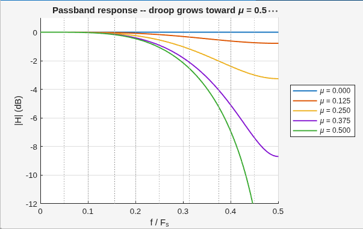

μ를 0 → 0.5로 올려가며 진폭 응답 |H(f)|를 그린 것이다. **μ=0(파랑)은 완벽한 0 dB 수평선**이다 — μ=0은 입력을 그대로 통과시키는 경우라 왜곡이 있을 수가 없다. μ가 0.5로 갈수록 곡선이 아래로 처지는데, μ=0.5(초록)가 최악이 되는 이유는 보간점이 샘플에서 가장 먼 지점이기 때문이다. f/Fs = 0.3125(기준 대역 끝)에서 초록 곡선을 읽으면 약 **−2.5 dB** — 요약표의 droop 값이 이 지점이다. μ와 1−μ는 좌우 대칭이라 0.5–1 구간은 그리지 않았다(μ=0.625는 μ=0.375와 같은 곡선이다).

### D2. droop과 지연 오차의 μ 의존성 — 최악 지점이 서로 다르다

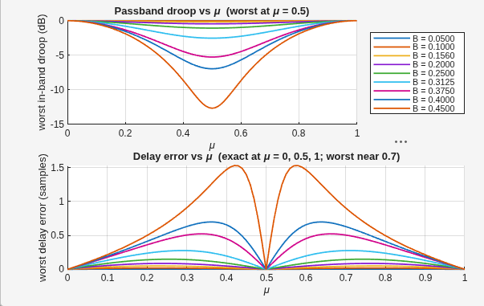

**위 패널**은 대역별로 "대역 내 최악 droop"을 μ의 함수로 그린 것이다. 모든 대역에서 μ=0.5가 최악이고, μ=0과 1에서는 0 dB(무왜곡)로 되돌아온다. B=0.3125(하늘색)의 바닥값 −2.5 dB, B=0.45(주황)의 바닥값 −12.7 dB가 D5 차트의 점들과 일치한다.

**아래 패널**은 대역 내 최악 **군지연(group delay) 오차**다. 흥미로운 대비가 있다 — droop과 달리 지연 오차는 **μ = 0, 0.5, 1에서 정확히 0**이다. μ=0.5에서 탭이 좌우 대칭(−1/16, 9/16, 9/16, −1/16)이 되어 위상이 완벽한 선형이 되기 때문이다. 최악은 **μ ≈ 0.7 부근**(대칭으로 0.3 부근도)에서 잡히며, 기준 대역 B=0.3125에서 **0.28 Ts**, B=0.45에서는 1.5 Ts까지 치솟는다. 본문 4-2의 위상 지연 기준 7.7% Ts보다 훨씬 큰 값인데, 군지연은 위상의 **기울기**를 보는 지표라 대역 끝의 급격한 위상 변화에 더 민감하게 반응하기 때문이다. 변조 신호의 포락선 왜곡이 걱정되는 응용이라면 이 군지연 곡선을 봐야 한다.

### D3. 커널의 나이퀴스트 존 3개 — image가 어디서 얼마나 새나

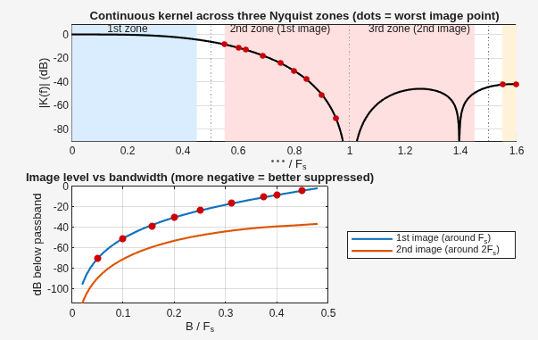

**위 패널**은 연속 커널의 푸리에 변환 |K(f)|를 나이퀴스트 존 3개에 걸쳐 그린 것이다. 1구역(파란 음영, 0–0.45)은 신호가 사는 곳이라 높게 유지돼야 하고, 2·3구역(붉은 음영)은 복제본이 사는 곳이라 낮아야 한다. 커널은 f = Fs와 2Fs 정확히 그 지점에 깊은 골(zero)을 갖지만, **복제본은 점이 아니라 폭 2B의 구간을 차지**하므로 최악값은 골에서 가장 먼 가장자리(빨간 점)에서 잡힌다.

**아래 패널**이 그 최악값을 대역폭의 함수로 편 것이다. B=0.3125에서 1차(파랑) **−17.8 dB**, 2차(주황) **−44.3 dB** — 요약표의 image 억압 값이다. 대역이 넓어질수록 빨간 점이 골에서 멀어져 1차 억압이 급격히 나빠지고(B=0.45에서 −8.4 dB), 2차는 −42 dB 부근에서 바닥을 친다. **1차 억압이 필요 사양을 못 맞추면 커널 교체가 아니라 오버샘플링(B/Fs 축소)이 해법**이라는 것을 이 곡선이 말해준다.

### D4. SNR의 μ 의존성 — 어떤 μ가 걸려도 이 선 아래로는 안 내려간다

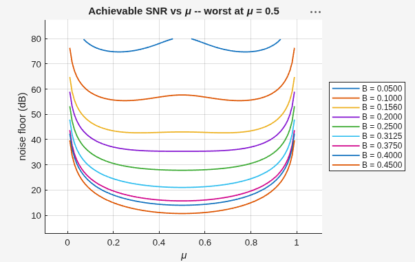

대역을 고르게 채운 평탄 스펙트럼 기준으로, 노이즈 플로어를 μ의 함수로 그린 것이다. 실제 시스템에서 μ는 매 출력마다 바뀌므로(1장의 누산기), **최악의 μ에 걸렸을 때의 값이 보수적 사양**이 된다. 대역이 넓으면(B ≥ 0.2) μ=0.5가 최악이고 곡선 가운데가 평평하게 눌린다 — B=0.3125에서 바닥 **21.0 dB**. 반면 대역이 아주 좁으면(B=0.05, 맨 위 파란 곡선) 최악이 μ≈0.22/0.78의 쌍봉으로 갈라지는 재미있는 모양이 나온다(droop가 워낙 작아, 남은 오차의 주범이 μ=0.5에서 오히려 0이 되는 지연 성분이기 때문이다). μ=0과 1로 갈수록 모든 곡선이 치솟는 것은 보간기가 통과 모드에 가까워지기 때문이다.

### D5. 최악 droop vs 대역폭 — 진폭 예산표

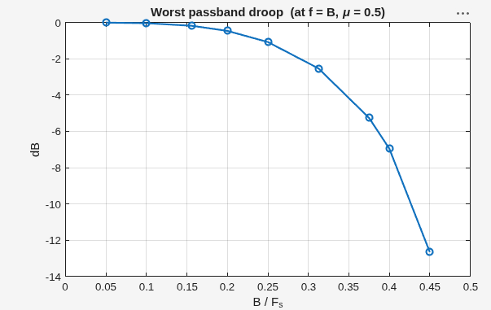

D2 위 패널의 바닥값(μ=0.5, f=B)만 뽑아 대역폭의 함수로 편 것이다. B=0.05에서는 −0.003 dB로 사실상 투명하고, 0.2까지도 −0.5 dB 이내다. 그 뒤로 가속이 붙어 **0.3125에서 −2.53 dB**, 0.375에서 −5.3 dB, 0.45에서 −12.7 dB. 시스템의 진폭 평탄도 예산이 있다면 이 곡선에서 허용 대역을 역으로 읽으면 된다 — 예컨대 "droop 1 dB 이내"가 요구라면 B/Fs ≤ 0.25 부근이 한계다.

### D6. 최악 노이즈 플로어 vs 대역폭 — 이 IP의 한 줄 요약

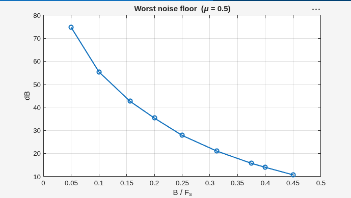

**이 차트 한 장이 이 IP의 데이터시트다.** 특정 신호를 가정하지 않고, 대역을 고르게 채운 평탄 스펙트럼에 대해 μ 최악값의 노이즈 플로어를 대역폭의 함수로 그렸다. 사용자는 자기 응용의 B/Fs를 x축에서 찾아 y값을 읽으면 된다: 계측(0.05) **75 dB**, 모뎀 4 sps(0.156) **43 dB**, 모뎀 2 sps(0.3125) **21 dB**, 오디오 20k/48k(0.417) 약 **12.7 dB**, 그리고 0.45에서 **10.7 dB**. 정격 대역 B ≤ 0.35(이 지점 ≈ 17.6 dB)를 넘어서면 어떤 μ에 걸리느냐에 따라 오차가 신호의 30%를 넘나들기 시작한다 — 잘 되는 영역만이 아니라 **안 되는 영역**을 명시하는 것이 데이터시트의 역할이다.

### D7. 위상 지연 vs 주파수 — 타이밍은 얼마나 정직한가

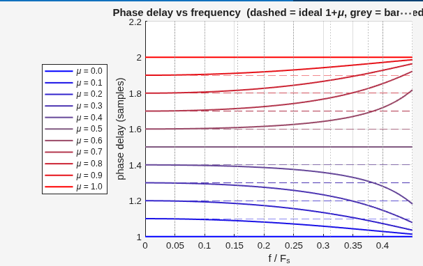

각 μ에 대해 "실제로 몇 샘플 밀렸나"(위상 지연)를 주파수별로 그린 것이다. 여기서는 인과적 표기(탭 인덱스 0–3)를 쓰므로 이상적 지연은 **1+μ**(회색/색 점선)다. 세 가지가 보인다. ① **μ=0, 0.5, 1의 곡선은 완벽한 수평선** — 통과 모드와 대칭 탭에서는 지연 오차가 정확히 0이다. ② 나머지 μ에서는 저주파에서 점선에 붙어 있다가 대역 끝으로 갈수록 벗어나는데, 벗어나는 방향이 **항상 1.5(중앙) 쪽**이다 — μ=0.2는 위로, μ=0.8은 아래로 휜다. ③ μ와 1−μ의 곡선이 1.5를 축으로 거울 대칭이다. 대역 내(f ≤ 0.3125) 최악 이탈이 **0.077 샘플(7.71% Ts)**이고, 이 값이 linear와 정확히 같다는 사실(대칭 커널 = 선형 위상)은 4-2에서 다룬다.

## 0. 5분 요약 — 이 글의 전부

바쁘면 이 절만 읽어도 된다. 아래 그림 한 장이 문제이고, 세 문단이 답이다.

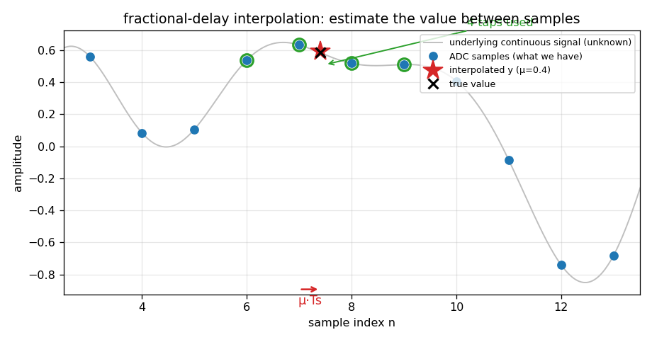

**① 문제.** 회색 곡선이 진짜 신호인데 **우리는 이걸 모른다**. 가진 것은 파란 점(샘플)뿐이다. 필요한 값은 빨간 별 자리 — 샘플과 샘플 사이다. 주변 샘플 **4개**(초록 원)만 가지고 저 별의 높이를 맞혀야 한다. 별이 샘플에서 얼마나 떨어졌는지를 **μ(뮤)** 라는 0–1 숫자로 나타낸다(0이면 왼쪽 샘플 위, 0.5면 한가운데).

**② 방법.** 4개 점에 각각 가중치를 곱해 더한다. 그 가중치를 정하는 규칙이 **Catmull-Rom**이라는 3차 곡선 공식이다. 가장 단순한 대안인 "두 점을 직선으로 잇기(linear)"보다 정확한데, 이유는 점 4개를 봐서 **신호의 휘어짐(곡률)까지 반영**하기 때문이다. 이걸 하드웨어로 옮기기 좋게 재정렬한 형태가 **Farrow 구조**이고, 그러면 곱셈 3번으로 계산이 끝난다.

:::note[SNR과 dB — 이 글의 숫자를 읽는 법]
**SNR(Signal-to-Noise Ratio, 신호 대 잡음비)** 은 "신호가 오차보다 몇 배 큰가"를 나타내는 값이다. 여기서 '잡음'은 외부 소음이 아니라 **보간기가 만들어낸 오차**를 뜻한다. 클수록 정확하다.

**dB(데시벨)** 는 그 비율을 로그로 압축해 쓴 것이다. 배율이 수천 배까지 벌어지면 그냥 쓰기 불편하니 압축한다. 감을 잡는 데는 이것만 기억하면 된다.

| dB | 뜻 (진폭 기준) | dB | 뜻 (SNR 기준) |
|---|---|---|---|
| −0.35 dB | 96% (4% 감소) | 20 dB | 오차가 신호의 10% |
| −3 dB | 70% | **24 dB** | **오차가 신호의 6.3%** |
| −6 dB | 절반 | 40 dB | 오차가 신호의 1% |

**6 dB ≈ 2배**라고 기억하면 이 글의 모든 수치가 읽힌다. SNR을 실제로 어떻게 계산하는지는 5장에서 숫자를 넣어가며 다룬다.
:::

**③ 얼마나 정확한가.** 여기가 이 글의 본론이다. 보간기의 성능은 **네 가지 지표**로 정량화한다. 각각이 "이상적인 보간기와 무엇이 다른가"를 다른 각도에서 재는 것이다.

:::note[먼저: 이상적인 보간기란]
샘플 사이의 값을 **오차 없이** 맞히는 것이다. 신호를 μ만큼 시간 이동시켰을 때 (1) 어떤 주파수 성분도 **크기가 변하지 않고**, (2) 모든 성분이 **정확히 μ만큼** 밀리고, (3) 샘플링 때문에 생긴 **복제본을 완전히 지우는** 것. 실제 보간기는 셋 다 조금씩 못하고, 그 못하는 정도가 아래 지표들이다.
:::

아래는 이 설계의 실측 성적표다. 기준 조건은 **B/Fs = 0.3125**일 때 — 즉 신호의 최고 주파수가 샘플링 주파수의 31.25%인 경우다(모뎀 2 samples/symbol에 해당하며, 이 글에서 다루는 가장 빡빡한 조건이다. B/Fs의 물리적 상한은 0.5이고 자세한 설명은 4-1에 있다). 그리고 모든 값은 **μ를 0–1 전 구간 훑어 가장 나쁜 값**이다.

| # | 지표 | 뜻 | **Catmull-Rom** | linear | 
|---|---|---|---|---|
| 1 | **Passband droop** | 신호 크기가 얼마나 깎이나 | **−0.35 dB** (평탄부)<br>−2.53 dB (대역 끝, μ=0.5) | −1.6 dB<br>−5.1 dB |
| 2 | **지연 오차** | μ만큼 정확히 밀리나 | 7.7% Ts (위상 지연)<br>0.28 Ts (군지연) | 7.7% Ts |
| 3 | **Image 억압** | 복제본을 얼마나 지우나 | 1차 **17.8 dB**<br>2차 **44.3 dB**<br>3차 57.4 dB | 16.6 dB<br>32.2 dB<br>40.3 dB |
| 4 | **Interpolation SNR** | **종합 성적** (평탄 스펙트럼) | **23.7 dB** (μ 평균)<br>21.0 dB (μ 최악, 차트 D6) | 16.8 dB |

**읽는 법**: 1–3은 개별 지표로 오차의 원인을 각각 분해해 보여주고, 4는 그것들이 합쳐진 종합 성적이다. 실제 설계 판단은 4번 하나로 하고, 1–3은 그 원인을 설명한다. 결론부터 말하면 **linear 대비 +6.9 dB(오차 전력 약 1/5)** 이고, 이것이 "왜 4-tap cubic을 쓰는가"의 답이다. (모뎀 RRC 신호처럼 대역 끝을 덜 쓰면 차이가 +10 dB까지 벌어진다 — 5장 참고.)

:::tip[지표를 읽을 때 반드시 함께 봐야 할 것]
**① 조건 없는 숫자는 의미가 없다.** 위 표의 값은 전부 "B/Fs = 0.3125인 신호" 기준이다. 신호가 대역을 덜 쓰면(예: 4 samples/symbol) 같은 커널이 훨씬 좋은 점수를 받는다 — 데이터시트 차트 D6에서 임의의 대역에 대한 값을 읽을 수 있다.

**② 좋은 숫자만 고르면 안 된다.** "image 억압 44 dB"만 쓰면 정직하지 않다 — 1차는 17.8 dB로 linear와 1.2 dB 차이뿐이다(이유는 4-3에서). 세 차수를 나란히 적어야 한다.

**③ 모든 숫자는 재현 가능해야 한다.** 이 표의 값은 [부록 A의 스크립트](#부록-a-재현-스크립트)로 그대로 나온다. 기술문서에 숫자를 쓸 때는 "어떤 코드로, 어떤 파라미터로, 어떤 시드로" 나온 값인지 함께 남겨야 한다. 그게 없으면 6개월 뒤의 자신도 재현하지 못한다.

**④ 지연 오차가 같은 것은 오타가 아니다.** CR과 linear의 지연 오차(7.7%)가 정확히 같은데, 우연이 아니다. **두 커널 모두 보간 지점을 중심으로 대칭**이라 수학적으로 위상 특성이 동일하다(대칭 FIR = 선형 위상). 즉 **cubic의 이득은 전부 "진폭"에서 나오지 "타이밍"에서 나오지 않는다** — 이 사실은 4-2에서 다시 다룬다.
:::

그런데 4번(종합 성적)은 어떻게 재나? 성능을 재려면 "샘플 사이의 진짜 값"을 알아야 하는데 현실에선 알 수 없다. 그래서 **정답을 아는 실험**을 설계한다 — 신호를 처음부터 64배 촘촘하게 만들어 두고, 보간기에게는 64개당 1개만 보여준 뒤, 숨겨둔 63개를 채점 기준으로 쓴다(5장).

**④ 그 외 알아둘 값.**

| 항목 | 값 | 상태 |
|---|---|---|
| 쓸 수 있는 한계 | **B/Fs ≤ 0.35** (상한 0.5의 70%) — 그 이상은 이 커널로 불가능(물리적 한계) | ✅ 검증 |
| 하드웨어 (2편) | 곱셈기 **3개**, 메모리 0, 8단 파이프라인, 매 클럭 1샘플 | ✅ 검증 |
| 동작 주파수 | 245.76 MHz (RFSoC ZCU208) | ✅ 검증 |


여기까지가 5분치다. 아래부터는 각 단계를 왜 그렇게 했는지, 어떻게 쟀는지 처음부터 풀어본다.

:::note[이 시리즈에서 다루는 것]
- **1편(이 글)**: 어디에 쓰이는 부품인가 → Catmull-Rom 커널과 Farrow 구조 → 주파수 응답으로 보는 성능 → 응용에 무관한 MATLAB 정량 분석
- **2편**: Fixed-point 설계 (Q 포맷, 비트 성장 분석, 정밀도 knee) → RTL 코딩 스킴 (곱셈기 없는 branch, 8-stage 파이프라인) → 골든 모델 bit-match 검증

1장부터는 위 요약의 각 결론이 **어떻게 나왔는지**를 처음부터 쌓아 올린다(전체 20분 분량). 신호처리 배경지식은 가정하지 않는다 — 필요한 용어는 나올 때마다 풀어 쓴다.
:::

## 1. "샘플 사이의 값"이 필요한 순간들

### 가장 익숙한 예: 44.1 kHz 음원을 48 kHz로

CD 음원은 초당 44,100번 샘플링되어 있다. 이걸 48 kHz로 동작하는 오디오 장치에서 재생하려면 초당 48,000개의 샘플이 필요하다. 그런데 두 격자는 맞아떨어지지 않는다 — 새 격자의 첫 샘플은 원래 샘플 위에 있지만, 두 번째는 원래 샘플 사이 0.919 지점, 세 번째는 0.838 지점… 이런 식으로 계속 어긋난다.

즉 **48 kHz 샘플을 만들려면 44.1 kHz 샘플들 "사이"의 값을 계속 계산해내야 한다.** 이게 fractional-delay interpolation이고, 이 글에서 만들 부품이 하는 일이다.

같은 구조의 문제가 도처에 있다.

| 응용 | 왜 샘플 사이 값이 필요한가 |
|---|---|
| **샘플레이트 변환** | 위 예시. 44.1→48 kHz는 비율이 147:160이라 새 샘플이 계속 격자 사이에 떨어진다 |
| **다채널 지연 정렬** | 여러 안테나/마이크로 같은 신호를 받으면 도착 시간이 조금씩 다른데, 그 차이가 샘플 주기의 정수배가 아니다 (레이더·소나·빔포밍) |
| **파형 재생** | 메모리에 저장해둔 사인파를 임의 주파수로 재생하면, 읽어야 할 지점이 매번 저장된 칸 사이에 떨어진다 |
| **이미지 확대·회전** | 확대하면 새 픽셀 자리가 원본 픽셀 격자 사이다 (Catmull-Rom은 그래픽스에서도 표준 커널이다) |
| **타이밍 복구 (모뎀)** | 통신 수신기에서 데이터를 읽어야 할 시점이 샘플 위에 없다 (아래 설명) |

다섯 응용의 공통 구조는 하나다: **샘플열 x[n]과 소수 위치 μ를 받아, n+μ 지점의 값을 돌려준다.** 그래서 이 부품은 한 번 잘 만들어 특성화해 두면 어디든 꽂아 쓰는 **범용 IP**가 된다. 다른 것은 μ가 어디서 오느냐뿐이다 — 샘플레이트 변환기에서는 비율 누산기가, 지연 정렬에서는 교정 값이, 타이밍 복구에서는 피드백 루프가 μ를 준다.

:::note[μ(fractional interval)란]
μ는 "지금 샘플에서 다음 샘플까지의 거리 중 몇 % 지점이냐"를 나타내는 0–1 사이의 실수다. μ=0이면 지금 샘플 그 자체, μ=0.5면 정확히 중간, μ=0.99면 다음 샘플 직전이다.

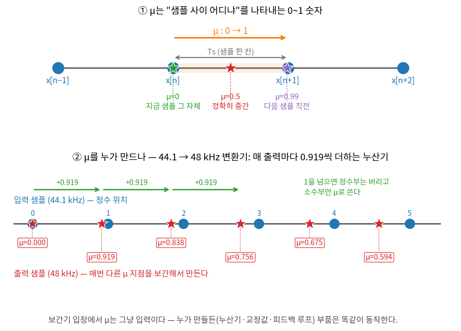

위 그림 ②가 앞의 44.1→48 kHz 예시를 μ 관점에서 다시 그린 것이다. 출력 샘플이 필요한 위치는 입력 격자 기준으로 매번 0.919씩 밀리므로(44.1/48 = 0.919), 누산기가 그 값을 계속 더해가며 소수부만 떼어 μ로 쓴다 — 0.000 → 0.919 → 0.838 → 0.756 → … 이렇게 μ가 매 출력마다 바뀌고, 보간기는 그때마다 해당 지점의 값을 만들어낸다. 1을 넘으면 정수부는 "입력 샘플 하나를 더 소비하라"는 뜻이라 버리고, 소수부만 μ가 된다.

**μ를 누가 주느냐는 응용이 정한다** — 샘플레이트 변환기에서는 위처럼 누산기가, 지연 정렬에서는 교정값이, 타이밍 복구에서는 피드백 루프가 μ를 만든다. 보간기 입장에서 μ는 그냥 입력이고, 그래서 이 부품은 응용에 중립적이다.
:::

### 이 시리즈의 대표 예제: 모뎀 타이밍 복구

성능을 "숫자"로 재려면 구체적인 신호를 하나 정해야 한다. 이 시리즈는 다섯 응용 중 **요구가 가장 까다로운 모뎀 타이밍 복구**를 대표 예제로 쓴다.

상황은 이렇다. 무선 통신에서 송신기는 1초에 수백만 개의 심볼(데이터 한 조각)을 보내고, 수신기는 각 심볼의 **한가운데 값**을 읽어야 데이터를 제대로 판정할 수 있다. 문제는 송신기와 수신기가 각자 다른 수정 발진기(시계)를 쓴다는 것이다. 아무리 정밀해도 100만분의 몇씩 어긋나 있어서, 수신기가 찍는 샘플 위치는 심볼 기준으로 **계속 미끄러진다**. 지금은 심볼 중앙을 찍다가 잠시 후엔 30% 벗어난 곳을 찍는 식이다.

해법은 두 가지다. 샘플 찍는 시계를 아날로그로 조절하거나(복잡하고 유연성이 떨어진다), **샘플은 그대로 두고 필요한 지점의 값을 디지털로 계산**하거나. 후자가 현대 수신기의 표준이고, 그 계산을 하는 게 이 보간기다.

:::note[이 예제가 왜 까다로운가 — 나이퀴스트 이야기]
샘플링에는 **나이퀴스트 한계**라는 근본 법칙이 있다. 샘플링 주파수 Fs로 신호를 찍으면, 그 신호에 담을 수 있는 최고 주파수는 **Fs의 절반**까지다. 그 이상은 샘플에 제대로 담기지 않는다.

여기서 "여유"라는 개념이 나온다. Fs의 5%만 쓰는 신호는 샘플이 파형에 비해 아주 촘촘해서 사이 값 추정이 쉽다. 반대로 Fs의 절반에 가까운 신호는 샘플이 성겨서 어렵다. 모뎀 예제는 그 한계의 **62%**를 쓴다(B/Fs로는 0.3125) — 이 글에서 다루는 응용 중 가장 빡빡한 조건이다.

여기서 통하는 보간기는 대역을 덜 쓰는 응용에서는 더 여유 있게 통한다. 그래서 이 예제로 성능을 재고, 마지막에 **모든 대역에 대한 곡선 하나**로 일반화한다.
:::

## 2. 어떤 수식으로 추정하나 — 보간 커널

샘플 사이를 추정하는 가장 단순한 방법은 **linear interpolation**(선형 보간)이다. 두 점을 직선으로 잇고 μ 지점을 읽는다.

$$y = (1-\mu)\,x_0 + \mu\,x_1$$

간단하지만 정확도가 아쉽다. 신호는 곡선인데 직선으로 근사하니, 곡률이 큰 구간(신호가 빠르게 변하는 곳)에서 오차가 커진다. 그래서 한 단계 위인 **3차 다항식(cubic)** 으로 올라간다.

### 3차 곡선을 어떻게 정하나 — 계수의 유도

우리가 구하려는 3차식에 이름을 붙이자.

$$p(\mu) = c_3\mu^3 + c_2\mu^2 + c_1\mu + c_0$$

μ를 넣으면 그 지점의 보간값이 나오는 함수다. 미지수는 계수 4개($c_3, c_2, c_1, c_0$)이고, **미지수 4개를 정하려면 조건(방정식) 4개가 필요하다** — 중학교 연립방정식과 같은 이치다. **어떤 조건을 걸 것인가가 곧 커널의 정체를 결정한다.**

Catmull-Rom의 선택은 이렇다. **양 끝점에서 "값"과 "기울기"를 지정한다** — 조건 2개씩 × 양 끝 = 정확히 4개다. μ의 정의상 μ=0은 왼쪽 샘플($x_0$)이 있는 자리, μ=1은 오른쪽 샘플($x_1$)이 있는 자리이므로:

| 조건 | 수식 | 뜻 |
|---|---|---|
| ① | $p(0) = x_0$ | μ=0 (왼쪽 샘플 자리)에서 $x_0$를 지나라 |
| ② | $p'(0) = m_0$ | 그 지점에서의 기울기는 $m_0$ |
| ③ | $p(1) = x_1$ | μ=1 (오른쪽 샘플 자리)에서 $x_1$을 지나라 |
| ④ | $p'(1) = m_1$ | 그 지점에서의 기울기는 $m_1$ |

:::note[p' 기호]
$p'$는 **$p$를 미분한 것**, 즉 곡선의 기울기를 나타내는 함수다. $p(0)$이 "μ=0에서의 높이"라면 $p'(0)$은 "μ=0에서 곡선이 얼마나 가파른가"이다. 조건 ①③이 "어디를 지나가라"라면, ②④는 "그 지점을 어떤 각도로 지나가라"인 셈이다. 참고로 우리 식의 미분은

$$p'(\mu) = 3c_3\mu^2 + 2c_2\mu + c_1$$

이라 $p'(0) = c_1$, $p'(1) = 3c_3 + 2c_2 + c_1$이다.
:::

①③은 당연한 요구다("샘플을 지나가라"). 문제는 **기울기 $m_0, m_1$을 뭘로 할 것이냐**인데, 우리에게 주어진 건 샘플 값뿐이라 기울기는 추정해야 한다. **여기서 갈리는 선택이 곧 커널의 이름을 정한다.**

Catmull-Rom의 답은 가장 자연스러운 추정이다 — **양옆 이웃을 잇는 직선의 기울기**(중심차분):

$$m_0 = \frac{x_1 - x_{-1}}{2}, \qquad m_1 = \frac{x_2 - x_0}{2}$$

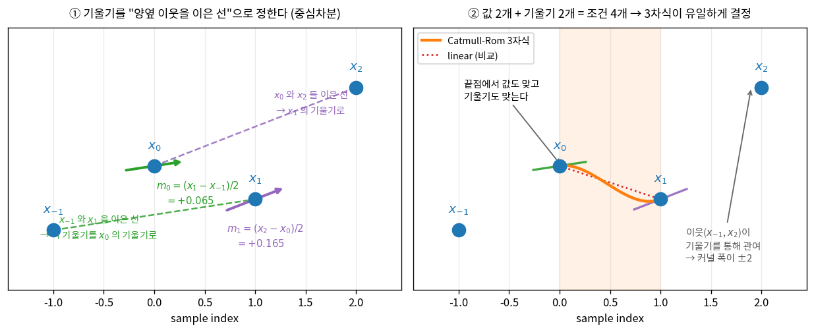

왼쪽 그림이 이 선택의 전부다. $x_0$의 기울기를 알고 싶은데 직접 알 방법이 없으니, **좌우 이웃 $x_{-1}$과 $x_1$을 이은 선의 기울기를 빌려 쓴다**(초록 점선). 두 점을 잇는 직선의 기울기는 (높이 차이)/(가로 거리)인데, $x_{-1}$에서 $x_1$까지 가로 거리가 2칸이므로 분모가 2다. $x_1$도 마찬가지로 $x_0$와 $x_2$를 이은 선의 기울기를 쓴다(보라 점선). 오른쪽 그림은 그렇게 정해진 조건 4개로 3차식(주황)이 결정된 모습이다 — 양 끝에서 **점을 지나면서 동시에 기울기(짧은 초록·보라 선분)도 맞춘다**. 비교용 linear(빨간 점선)가 끝점만 잇고 기울기는 신경 쓰지 않는 것과 대비된다.

이제 조건 4개가 다 모였으니 계수를 풀 수 있다. 푸는 과정은 아래 note에 담았는데, **결과만 알고 넘어가도 이 글을 읽는 데 지장은 없다** — 요점은 하나다: *0.5, 1.5, 2, 2.5 같은 계수는 누가 고른 게 아니라 "중심차분 기울기"라는 선택에서 자동으로 떨어진 값이다.*

:::note[유도 1단계 — "담당 함수"라는 아이디어]
조건 4개를 $c_3, c_2, c_1, c_0$에 대한 4원 연립방정식으로 한 번에 풀어도 된다. 하지만 $x_{-1}, x_0, x_1, x_2$가 뒤엉켜 계산이 지저분하다. **문제를 4개의 쉬운 문제로 쪼개는** 방법이 있다.

아이디어는 이렇다. 우리가 걸 조건은 4개다.

$$\text{①}\ p(0)=x_0, \qquad \text{②}\ p'(0)=m_0, \qquad \text{③}\ p(1)=x_1, \qquad \text{④}\ p'(1)=m_1$$

여기서 **조건 하나씩만 담당하는 3차식을 4개 만들어 두면** 어떨까? 예를 들어 "①번 담당"은 이런 함수다.

> **①번 담당 함수**: ①번 조건에서는 **1**이 나오고, 나머지 ②③④에서는 **전부 0**이 나오는 3차식

왜 이런 걸 만드냐면 — 이런 함수가 4개 있으면 **그냥 곱해서 더하기만 하면 답이 되기 때문**이다(2단계에서 보인다). 이 4개를 **Hermite 기저**라 하고, 이름은 각각 $h_{00}, h_{10}, h_{01}, h_{11}$이다.

| 이름 | 담당 조건 | 그 함수가 만족해야 할 4가지 |
|---|---|---|
| $h_{00}$ | ① ($x_0$) | $p(0)=\mathbf{1}$, $p'(0)=0$, $p(1)=0$, $p'(1)=0$ |
| $h_{10}$ | ② ($m_0$) | $p(0)=0$, $p'(0)=\mathbf{1}$, $p(1)=0$, $p'(1)=0$ |
| $h_{01}$ | ③ ($x_1$) | $p(0)=0$, $p'(0)=0$, $p(1)=\mathbf{1}$, $p'(1)=0$ |
| $h_{11}$ | ④ ($m_1$) | $p(0)=0$, $p'(0)=0$, $p(1)=0$, $p'(1)=\mathbf{1}$ |

**중요**: 굵은 **1**의 위치가 각 행마다 한 칸씩 옮겨간다. 이건 유도된 결과가 아니라 **우리가 그렇게 되도록 요구한 설계**다. "$h_{00}(0)=1$"은 증명할 것이 아니라, $h_{00}$을 그렇게 **정의**한 것이다.

이제 각 함수를 실제로 구하면 된다. 넷 다 "3차식 하나 푸는 문제"라 방법이 같다.
:::

:::note[유도 1단계(계속) — $h_{00}$ 을 직접 풀어보기]
$h_{00}$을 예로 끝까지 풀어보자. 구할 것은 **이 네 조건을 만족하는 3차식**이다.

$$p(0)=1, \qquad p'(0)=0, \qquad p(1)=0, \qquad p'(1)=0$$

3차식의 계수를 아직 모르니 문자로 놓는다. 미분도 미리 구해 둔다.

$$p(\mu) = a_3\mu^3 + a_2\mu^2 + a_1\mu + a_0$$
$$p'(\mu) = 3a_3\mu^2 + 2a_2\mu + a_1$$

목표는 $a_3, a_2, a_1, a_0$ 네 개를 알아내는 것이다. **조건을 하나씩 "대입"해서 방정식을 만든다.**

> **잠깐 — "대입한다"가 무슨 뜻인가**
>
> $p(\mu)$는 μ를 받아 값을 내놓는 **함수**다. $p(0)$이라고 쓰면 "**식에 있는 모든 μ를 0으로 바꿔 쓴 결과**"라는 뜻이다. $p(1)$이면 모든 μ를 1로 바꾼다.
>
> 조건이 "$p(0)=1$"이라는 건 "μ에 0을 넣었을 때 결과가 1이어야 한다"는 요구다. 그러니 실제로 0을 넣어 보고, 그 결과가 1이 되려면 계수가 어때야 하는지 역으로 알아내는 것이다.

**조건 1: $p(0)=1$**

식의 모든 μ 자리에 0을 써넣는다.

$$p(0) = a_3 \cdot 0^3 + a_2 \cdot 0^2 + a_1 \cdot 0 + a_0$$

$0^3 = 0$이고 $0^2 = 0$이므로, μ가 곱해진 앞의 세 항은 **전부 0이 되어 사라진다**. μ가 없는 $a_0$만 살아남는다.

$$p(0) = 0 + 0 + 0 + a_0 = a_0$$

그런데 우리가 원한 조건이 $p(0)=1$이었다. 따라서:

$$\boxed{a_0 = 1}$$

**조건 2: $p'(0)=0$**

이번엔 미분식에 0을 써넣는다.

$$p'(0) = 3a_3 \cdot 0^2 + 2a_2 \cdot 0 + a_1 = 0 + 0 + a_1 = a_1$$

역시 μ가 없는 항만 남았다. 원한 조건이 $p'(0)=0$이었으므로:

$$\boxed{a_1 = 0}$$

두 개는 즉시 끝났다. **남은 미지수는 $a_3, a_2$ 두 개**다.

**조건 3: $p(1)=0$**

이번엔 모든 μ에 1을 써넣는다. $1^3 = 1$, $1^2 = 1$이므로 **거듭제곱이 전부 1이 되어**, 계수들이 그냥 더해진다.

$$p(1) = a_3 \cdot 1^3 + a_2 \cdot 1^2 + a_1 \cdot 1 + a_0 = a_3 + a_2 + a_1 + a_0$$

여기에 앞에서 구한 $a_1 = 0$, $a_0 = 1$을 넣는다.

$$p(1) = a_3 + a_2 + 0 + 1 = 0 \quad\Rightarrow\quad a_3 + a_2 = -1 \quad \cdots (A)$$

**조건 4: $p'(1)=0$**

미분식에 1을 써넣는다.

$$p'(1) = 3a_3 \cdot 1^2 + 2a_2 \cdot 1 + a_1 = 3a_3 + 2a_2 + a_1$$

$a_1 = 0$을 넣으면:

$$p'(1) = 3a_3 + 2a_2 = 0 \quad \cdots (B)$$

**(A)와 (B)를 연립한다.**

미지수가 2개, 식이 2개이므로 풀린다. (A)에 2를 곱하면 $a_2$ 항이 (B)와 같아져서, 빼면 $a_2$가 사라진다.

$$
\begin{aligned}
(A)\times 2:& \quad 2a_3 + 2a_2 = -2\\
(B):& \quad 3a_3 + 2a_2 = 0\\[4pt]
\hline
(B) - (A)\times2:& \quad (3a_3 - 2a_3) + (2a_2 - 2a_2) = 0 - (-2)\\
& \quad a_3 = 2
\end{aligned}
$$

$a_3 = 2$를 (A)에 도로 넣으면:

$$2 + a_2 = -1 \quad\Rightarrow\quad a_2 = -3$$

**네 계수가 다 나왔다.**

$$a_3=2, \quad a_2=-3, \quad a_1=0, \quad a_0=1$$

이걸 $p(\mu) = a_3\mu^3 + a_2\mu^2 + a_1\mu + a_0$에 되돌려 넣으면:

$$h_{00}(\mu) = 2\mu^3 - 3\mu^2 + 0\cdot\mu + 1 = 2\mu^3 - 3\mu^2 + 1$$

**검산해보자.** 정말 원하던 4가지가 성립하는가? 미분은 $h_{00}'(\mu) = 6\mu^2 - 6\mu$다.

$$
\begin{aligned}
h_{00}(0) &= 2(0)^3 - 3(0)^2 + 1 = 0 - 0 + 1 = 1 \quad\checkmark\\
h_{00}'(0) &= 6(0)^2 - 6(0) = 0 \quad\checkmark\\
h_{00}(1) &= 2(1)^3 - 3(1)^2 + 1 = 2 - 3 + 1 = 0 \quad\checkmark\\
h_{00}'(1) &= 6(1)^2 - 6(1) = 6 - 6 = 0 \quad\checkmark
\end{aligned}
$$

**$h_{00}(0)=1$은 이렇게 나온 것이다** — 증명해야 할 무언가가 아니라, **그렇게 되도록 조건을 걸고 풀었으니 당연히 성립하는 것**이다.

**나머지 셋도 똑같이 푼다.** 1단계 조건표에서 1의 위치만 바꿔 같은 절차를 반복하면 된다. 예를 들어 $h_{10}$은 $p(0)=0, p'(0)=1, p(1)=0, p'(1)=0$으로 풀면 되고, 결과는 이렇다.

$$
\begin{aligned}
h_{00} &= 2\mu^3 - 3\mu^2 + 1\\
h_{10} &= \mu^3 - 2\mu^2 + \mu\\
h_{01} &= -2\mu^3 + 3\mu^2\\
h_{11} &= \mu^3 - \mu^2
\end{aligned}
$$

이 네 개는 **Catmull-Rom과 무관한, 3차 Hermite 보간의 표준 부품**이다. 기울기를 어떻게 정하든(다음 단계) 재사용된다.

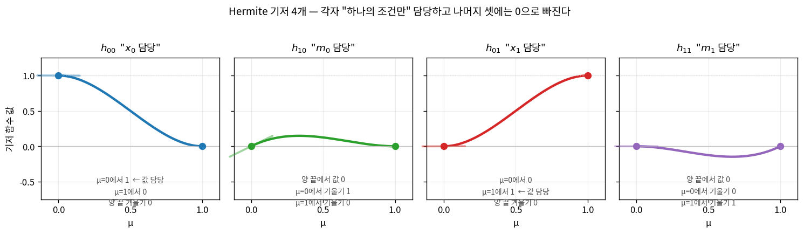

그림에서 각 곡선의 끝점 값(동그라미)과 끝점 기울기(반투명 선분)를 보면, 조건표대로 **자기 자리에서만 1이고 나머지는 0**인 것이 눈에 보인다. 표로 정리하면:

| 기저 | 담당 | $p(0)$ | $p'(0)$ | $p(1)$ | $p'(1)$ |
|---|---|---|---|---|---|
| $h_{00}$ | $x_0$ (왼쪽 값) | **1** | 0 | 0 | 0 |
| $h_{10}$ | $m_0$ (왼쪽 기울기) | 0 | **1** | 0 | 0 |
| $h_{01}$ | $x_1$ (오른쪽 값) | 0 | 0 | **1** | 0 |
| $h_{11}$ | $m_1$ (오른쪽 기울기) | 0 | 0 | 0 | **1** |

열을 **왼쪽 값 → 왼쪽 기울기 → 오른쪽 값 → 오른쪽 기울기** 순으로 놓으면 1이 대각선에만 놓인다.
:::

:::note[유도 2단계 — 왜 곱해서 더하기만 하면 되나]
이제 네 기저를 **각자 담당하는 값으로 곱해서 더한다.**

$$p(\mu) = h_{00}(\mu)\,x_0 + h_{10}(\mu)\,m_0 + h_{01}(\mu)\,x_1 + h_{11}(\mu)\,m_1$$

$h_{00}$은 $x_0$ 담당이니 $x_0$를 곱하고, $h_{10}$은 $m_0$ 담당이니 $m_0$를 곱하는 식이다. **이게 정말 조건 4개를 다 만족하는지 하나씩 확인해보자.**

**조건 ① $p(0)=x_0$인가?** μ에 0을 넣는다. 1단계 표의 $p(0)$ 열을 보면 $h_{00}(0)=1$이고 나머지 셋은 0이다.

$$
\begin{aligned}
p(0) &= h_{00}(0)\,x_0 + h_{10}(0)\,m_0 + h_{01}(0)\,x_1 + h_{11}(0)\,m_1\\
&= 1\cdot x_0 + 0\cdot m_0 + 0\cdot x_1 + 0\cdot m_1\\
&= x_0 \quad\checkmark
\end{aligned}
$$

**조건 ② $p'(0)=m_0$인가?** 먼저 미분한다. 곱셈에서 $x_0, m_0, x_1, m_1$은 상수(μ와 무관)이므로 그대로 딸려 나온다.

$$p'(\mu) = h_{00}'(\mu)\,x_0 + h_{10}'(\mu)\,m_0 + h_{01}'(\mu)\,x_1 + h_{11}'(\mu)\,m_1$$

여기에 0을 넣는다. 표의 $p'(0)$ 열에서 $h_{10}'(0)=1$이고 나머지는 0이다.

$$
\begin{aligned}
p'(0) &= 0\cdot x_0 + 1\cdot m_0 + 0\cdot x_1 + 0\cdot m_1\\
&= m_0 \quad\checkmark
\end{aligned}
$$

**조건 ③ $p(1)=x_1$인가?** μ에 1을 넣으면 표의 $p(1)$ 열에서 $h_{01}(1)=1$만 살아남는다.

$$p(1) = 0\cdot x_0 + 0\cdot m_0 + 1\cdot x_1 + 0\cdot m_1 = x_1 \quad\checkmark$$

**조건 ④ $p'(1)=m_1$인가?** 같은 방식으로 $h_{11}'(1)=1$만 살아남는다.

$$p'(1) = 0\cdot x_0 + 0\cdot m_0 + 0\cdot x_1 + 1\cdot m_1 = m_1 \quad\checkmark$$

**네 조건이 전부 성립한다.** 이게 기저를 쓰는 이유다 — "자기 조건에서만 1, 나머지는 0"으로 만들어 뒀기 때문에, **각 조건을 확인할 때마다 딱 한 항만 살아남고 나머지는 0으로 사라진다.** 네 항이 서로 간섭하지 않는 것이다.
:::

:::note[유도 3단계 — $c_0 \sim c_3$ 로 정리한다]
2단계에서 $p(\mu)$를 구했지만, 아직 우리가 원하는 모양이 아니다. 우리는 $c_3\mu^3 + c_2\mu^2 + c_1\mu + c_0$ 형태를 원한다(그래야 3장의 Farrow 구조로 갈 수 있다). 그러려면 **μ의 차수별로 항을 모아야** 한다.

2단계 식에 1단계의 기저를 **그대로 대입**한다.

$$p(\mu) = \underbrace{(2\mu^3-3\mu^2+1)}_{h_{00}}x_0 + \underbrace{(\mu^3-2\mu^2+\mu)}_{h_{10}}m_0 + \underbrace{(-2\mu^3+3\mu^2)}_{h_{01}}x_1 + \underbrace{(\mu^3-\mu^2)}_{h_{11}}m_1$$

각 기저가 어느 차수에 얼마를 기여하는지 표로 만들면 한눈에 보인다. (기저 식에서 계수만 뽑아 적은 것이다. 예를 들어 $h_{00} = 2\mu^3-3\mu^2+0\cdot\mu+1$이므로 첫 줄이 2, −3, 0, 1이다.)

| | $\mu^3$ | $\mu^2$ | $\mu^1$ | $\mu^0$ |
|---|---|---|---|---|
| $h_{00}\cdot x_0$ | $2$ | $-3$ | $0$ | $1$ |
| $h_{10}\cdot m_0$ | $1$ | $-2$ | $1$ | $0$ |
| $h_{01}\cdot x_1$ | $-2$ | $3$ | $0$ | $0$ |
| $h_{11}\cdot m_1$ | $1$ | $-1$ | $0$ | $0$ |

**이 표의 세로줄을 읽으면 그게 곧 c 계수다.** $\mu^3$ 열을 위에서 아래로 읽어보자 — $x_0$에 2, $m_0$에 1, $x_1$에 −2, $m_1$에 1이 붙는다는 뜻이다.

$$c_3 = 2x_0 + 1\cdot m_0 + (-2)x_1 + 1\cdot m_1 = 2x_0 - 2x_1 + m_0 + m_1$$

$\mu^2$ 열도 같은 방식으로 읽으면 $-3x_0 - 2m_0 + 3x_1 - m_1$이다. 네 열을 모두 읽으면:

$$
\begin{aligned}
c_3 &= 2x_0 - 2x_1 + m_0 + m_1 &&\leftarrow \mu^3 \text{ 열}\\
c_2 &= -3x_0 + 3x_1 - 2m_0 - m_1 &&\leftarrow \mu^2 \text{ 열}\\
c_1 &= m_0 &&\leftarrow \mu^1 \text{ 열}\\
c_0 &= x_0 &&\leftarrow \mu^0 \text{ 열}
\end{aligned}
$$

$c_0$와 $c_1$은 여기서 이미 끝났다 — $c_0$는 $x_0$ 그 자체, $c_1$은 $m_0$ 그 자체다. (당연한 결과다: $p(0)=c_0$인데 조건 ①이 $p(0)=x_0$였고, $p'(0)=c_1$인데 조건 ②가 $p'(0)=m_0$였으니까.)

**마지막으로 중심차분을 대입한다.** 지금까지 $m_0, m_1$을 문자로 남겨뒀는데, 이제 Catmull-Rom의 선택 $m_0 = \frac{x_1-x_{-1}}{2}$, $m_1 = \frac{x_2-x_0}{2}$를 넣는다.

$$
\begin{aligned}
c_1 &= m_0 = \frac{x_1 - x_{-1}}{2} = \tfrac{1}{2}x_1 - \tfrac{1}{2}x_{-1}\\[8pt]
c_2 &= -3x_0 + 3x_1 - 2m_0 - m_1\\
    &= -3x_0 + 3x_1 - 2\cdot\frac{x_1-x_{-1}}{2} - \frac{x_2-x_0}{2} &&\leftarrow m_0, m_1 \text{ 대입}\\
    &= -3x_0 + 3x_1 - (x_1 - x_{-1}) - \left(\tfrac{1}{2}x_2 - \tfrac{1}{2}x_0\right) &&\leftarrow \text{괄호 정리}\\
    &= -3x_0 + 3x_1 - x_1 + x_{-1} - \tfrac{1}{2}x_2 + \tfrac{1}{2}x_0 &&\leftarrow \text{괄호 풀기}\\
    &= x_{-1} + \left(-3 + \tfrac{1}{2}\right)x_0 + (3-1)x_1 - \tfrac{1}{2}x_2 &&\leftarrow \text{같은 문자끼리}\\
    &= x_{-1} - \tfrac{5}{2}x_0 + 2x_1 - \tfrac{1}{2}x_2\\[8pt]
c_3 &= 2x_0 - 2x_1 + m_0 + m_1\\
    &= 2x_0 - 2x_1 + \frac{x_1-x_{-1}}{2} + \frac{x_2-x_0}{2} &&\leftarrow m_0, m_1 \text{ 대입}\\
    &= 2x_0 - 2x_1 + \tfrac{1}{2}x_1 - \tfrac{1}{2}x_{-1} + \tfrac{1}{2}x_2 - \tfrac{1}{2}x_0 &&\leftarrow \text{분수 풀기}\\
    &= -\tfrac{1}{2}x_{-1} + \left(2 - \tfrac{1}{2}\right)x_0 + \left(-2 + \tfrac{1}{2}\right)x_1 + \tfrac{1}{2}x_2 &&\leftarrow \text{같은 문자끼리}\\
    &= -\tfrac{1}{2}x_{-1} + \tfrac{3}{2}x_0 - \tfrac{3}{2}x_1 + \tfrac{1}{2}x_2
\end{aligned}
$$

**2.5와 1.5가 태어나는 순간이 보인다.** $c_2$의 다섯째 줄에서 $-3 + \tfrac{1}{2} = -\tfrac{5}{2}$, $c_3$의 넷째 줄에서 $2 - \tfrac{1}{2} = \tfrac{3}{2}$다. 특별한 튜닝이나 최적화의 결과가 아니라, **Hermite 기저의 정수 계수(2, 3)와 중심차분의 분모 2가 섞이면서 자동으로 나온 값**이다.

**"이웃을 이은 선의 기울기를 쓰자"는 한 줄의 선택이 계수 전부를 결정한 것이다.**
:::

:::tip[다른 선택 = 다른 커널, 그리고 Catmull-Rom이 "정답"은 아니다]
같은 Hermite 뼈대에 기울기 추정만 바꾸면 다른 커널이 된다. 기울기에 장력(tension) 파라미터를 곱하면 **Cardinal spline**, 매끄러움을 우선해 샘플 통과를 포기하면 **B-spline**이다. 아예 다른 뼈대로 4점을 모두 지나는 다항식을 세우면 **Lagrange 보간**이 된다.

정직하게 짚어두자면 — **통신·모뎀의 fractional delay 문헌에서 교과서적 표준은 오히려 Lagrange 쪽**이다(Farrow 구조 자체가 Lagrange와 함께 소개되는 경우가 많다). Catmull-Rom이 확고한 표준인 곳은 그래픽스·영상 리샘플링이다(Keys의 cubic convolution과 같은 커널이다).

그럼에도 이 설계가 Catmull-Rom을 고른 이유는 **계수가 2의 거듭제곱 조합이라 하드웨어에서 곱셈기가 통째로 사라지기 때문**이다(2편). Lagrange의 계수에는 1/6 같은 값이 있어 이 혜택이 없다. 즉 "가장 정확해서"가 아니라 **"자원 대비 성능의 특정 지점을 골라서"** 다.

같은 4-tap인 Lagrange와의 정면 비교 측정(CR의 23.7 dB가 4-tap의 한계에 가까운지, Lagrange가 몇 dB 더 나오는데 계수 편의를 위해 그만큼 내준 트레이드오프인지)은 2편에서 나란히 다룬다.

더 정확한 대안(16–64 tap polyphase FIR 등)은 얼마든지 있고, 요구 SNR이 40 dB를 넘는다면 4-tap cubic으로는 어차피 불가능하다 — 이 판단의 근거는 4장과 5장의 숫자로 확인한다.
:::

이 방식으로 만들어진 곡선을 **Catmull-Rom spline**이라 한다. 이제 이걸 커널 관점에서 보자.

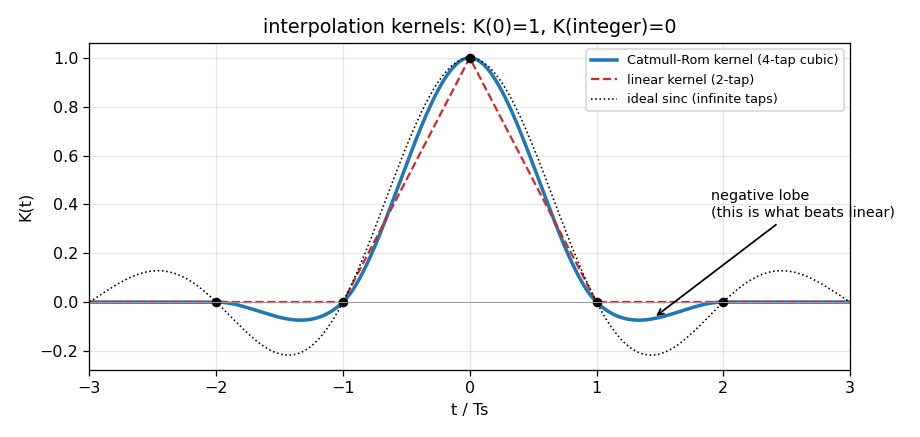

이 그림은 각 보간 방식을 **커널(kernel)** 관점에서 본 것이다. 커널 K(t)란 "샘플 하나가 주변 시간에 얼마만큼 영향을 주는가"를 나타내는 함수로, 보간값은 주변 샘플들에 커널 값을 곱해 더한 것이다. 세 곡선의 공통점과 차이를 보자.

- **공통점**: K(0)=1, K(정수)=0. 즉 샘플 위치에서는 그 샘플 값을 정확히 재현하고(자기 자신 100%), 다른 샘플 위치에는 영향을 주지 않는다. 이 성질 덕분에 μ=0을 넣으면 보간기가 입력을 그대로 통과시킨다.
- **linear(빨강 점선)**: 폭 ±1의 삼각형. 항상 양수라서 "이웃 값의 평균"밖에 못 만든다.
- **Catmull-Rom(파랑)**: 폭 ±2, 그리고 **음수 구간(negative lobe)** 이 있다. 이 음수 구간이 핵심인데, 이론적으로 완벽한 커널인 **sinc**(검정 점선)도 음수 구간을 가진다. 즉 Catmull-Rom은 sinc를 4-tap으로 흉내 낸 것이고, 음수 구간 덕분에 linear가 못 하는 "곡률 반영"이 가능해진다.

:::note[sinc가 왜 "완벽한" 커널인가]
샘플링 정리에 따르면, 대역제한된 신호는 sinc 커널로 보간하면 **오차 0으로** 완벽히 복원된다. 그런데 sinc는 양옆으로 **무한히** 뻗어 있어(위 그림에서 잘려 보이지만 실제로는 끝없이 이어진다), 하드웨어로 만들 수 없다. 유한한 tap으로 자르는 순간 오차가 생기고, 그 오차가 이 글 전체에서 재는 대상이다.

이 sinc를 주파수 관점에서 보면 4-3에서 나올 **brickwall**(대역 안은 그대로 통과, 밖은 완전 차단)이 된다. 같은 이상을 시간 영역에서 보면 sinc, 주파수 영역에서 보면 brickwall인 셈이다.
:::

### 커널 K(t)는 어디서 나오나

지금까지 구한 건 "샘플 4개 → 보간값" 공식이었다. 커널은 그걸 **거꾸로 보는 것**이다: *샘플 하나가 주변에 얼마나 영향을 주는가?*

방법은 단순하다. **샘플 하나만 1로 두고 나머지를 0으로 만들어** 출력이 어떤 모양인지 본다. 예를 들어 $x_0=1$, 나머지 0을 3장의 식에 넣으면 $c_0=1$, $c_1=0$, $c_2=-2.5$, $c_3=1.5$이므로:

$$p(\mu)\Big|_{x_0=1} = 1.5\mu^3 - 2.5\mu^2 + 1$$

네 샘플에 대해 각각 해보면 이렇게 나온다.

| 샘플 | 그 샘플의 가중치 (μ의 함수) |
|---|---|
| $x_{-1}$ | $-0.5\mu^3 + \mu^2 - 0.5\mu$ |
| $x_0$ | $1.5\mu^3 - 2.5\mu^2 + 1$ |
| $x_1$ | $-1.5\mu^3 + 2\mu^2 + 0.5\mu$ |
| $x_2$ | $0.5\mu^3 - 0.5\mu^2$ |

**여기서 관점을 바꾼다.** 위 네 식은 서로 달라 보이지만, 사실 **하나의 함수를 서로 다른 지점에서 평가한 것**이다. 핵심은 각 샘플이 **보간점으로부터 얼마나 떨어져 있나**를 보는 것이다.

| 샘플 | 보간점(μ 위치)까지의 거리 $t$ |
|---|---|
| $x_0$ | $t = \mu$ (보간점이 $x_0$에서 μ만큼 오른쪽) |
| $x_1$ | $t = 1-\mu$ |
| $x_{-1}$ | $t = 1+\mu$ |
| $x_2$ | $t = 2-\mu$ |

거리를 변수 $t$로 놓고 위 가중치들을 다시 쓰면, **네 식이 딱 두 개의 3차식으로 합쳐진다** — 거리가 1 이하인 것들($x_0, x_1$)은 한 식으로, 1과 2 사이인 것들($x_{-1}, x_2$)은 다른 식으로.

$$
K(t) = \begin{cases}
1.5|t|^3 - 2.5|t|^2 + 1 & (|t| \le 1)\\
-0.5|t|^3 + 2.5|t|^2 - 4|t| + 2 & (1 < |t| \le 2)\\
0 & (\text{otherwise})
\end{cases}
$$

:::note[정말 그런지 확인해보자]
$K(t)$가 맞다면, 각 샘플의 거리를 넣었을 때 위 표의 가중치가 그대로 나와야 한다.

**$x_0$ (거리 $t=\mu \le 1$이므로 위쪽 식)**:
$$K(\mu) = 1.5\mu^3 - 2.5\mu^2 + 1 \quad\checkmark \text{ 표와 일치}$$

**$x_1$ (거리 $t=1-\mu \le 1$이므로 역시 위쪽 식)**:
$$
\begin{aligned}
K(1-\mu) &= 1.5(1-\mu)^3 - 2.5(1-\mu)^2 + 1\\
&= 1.5(1 - 3\mu + 3\mu^2 - \mu^3) - 2.5(1 - 2\mu + \mu^2) + 1\\
&= 1.5 - 4.5\mu + 4.5\mu^2 - 1.5\mu^3 - 2.5 + 5\mu - 2.5\mu^2 + 1\\
&= -1.5\mu^3 + 2\mu^2 + 0.5\mu \quad\checkmark \text{ 표와 일치}
\end{aligned}
$$

**$x_{-1}$ (거리 $t=1+\mu$는 1보다 크므로 아래쪽 식)**:
$$
\begin{aligned}
K(1+\mu) &= -0.5(1+\mu)^3 + 2.5(1+\mu)^2 - 4(1+\mu) + 2\\
&= -0.5(1 + 3\mu + 3\mu^2 + \mu^3) + 2.5(1 + 2\mu + \mu^2) - 4 - 4\mu + 2\\
&= -0.5 - 1.5\mu - 1.5\mu^2 - 0.5\mu^3 + 2.5 + 5\mu + 2.5\mu^2 - 4\mu - 2\\
&= -0.5\mu^3 + \mu^2 - 0.5\mu \quad\checkmark \text{ 표와 일치}
\end{aligned}
$$

$x_2$도 같은 방식으로 확인된다. **네 가중치가 전부 하나의 $K(t)$에서 나온다** — 이것이 "커널"이라는 개념의 뜻이다.
:::

그러니 보간 공식을 커널로 다시 쓰면 이렇게 된다 — 각 샘플에 **자기 거리만큼의 커널 값**을 곱해 더하는 것이다.

$$y(\mu) = x_{-1}K(1+\mu) + x_0 K(\mu) + x_1 K(1-\mu) + x_2 K(2-\mu)$$

:::tip[왜 굳이 커널로 바꿔 쓰나]
계산은 3장의 Farrow 형태가 훨씬 편하다(곱셈 3번). 그런데도 커널 형태를 보는 이유는 **비교와 분석에 유리하기 때문**이다.
- linear, sinc, B-spline 등 **다른 방식과 같은 축 위에서 그릴 수 있다**(위 b2 그림)
- 커널의 푸리에 변환이 곧 4-3의 image 억압 특성이 된다
- "폭 ±2", "음수 lobe" 같은 성질이 눈에 보인다

즉 **Farrow는 만드는 사람의 관점, 커널은 분석하는 사람의 관점**이다. 같은 것을 두 방식으로 보는 것뿐이다.
:::

이제 앞 절의 유도와 연결해서 이 커널의 모든 특징이 설명된다.

- **왜 폭이 ±2인가**: 값 조건(①③)은 x₀, x₁만 쓰지만, **기울기 조건(②④)이 이웃인 x₋₁과 x₂를 끌어온다**. 그래서 4개 샘플이 관여하고 커널이 ±2까지 뻗는다.
- **음수 구간은 어디서 오나**: 중심차분 m₀ = (x₁−x₋₁)/2에서 **x₋₁ 앞의 마이너스 부호**가 그 정체다. "왼쪽 이웃이 높으면 기울기가 음(내려가는 중)"이라는 정보를 반영하려면 그 샘플을 빼야 한다. 이 뺄셈이 커널의 음수 lobe이고, 곡률 반영의 실체다.
- **계수의 정체**: **0.5, 1.5, 2, 2.5, 4** — 전부 앞 유도에서 자동으로 떨어진 값이다. 이 사실이 2편에서 "곱셈기 없는 하드웨어"의 열쇠가 된다.

## 3. Farrow 구조 — μ가 매번 바뀌어도 되는 구현

2장 끝의 커널 형태를 다시 보자.

$$y(\mu) = x_{-1}K(1+\mu) + x_0 K(\mu) + x_1 K(1-\mu) + x_2 K(2-\mu)$$

분석에는 좋지만 **하드웨어로 만들기엔 불편하다. μ가 매 출력마다 바뀌기 때문**이다(1장의 44.1→48 kHz 예시에서 μ가 0.919 → 0.838 → …로 계속 변하던 것을 떠올리자). μ가 바뀔 때마다 $K(1+\mu), K(\mu), K(1-\mu), K(2-\mu)$ 네 개를 **3차식으로 새로 계산**해야 하니 낭비가 크다.

### 식을 뒤집는다 — 샘플 담당과 μ 담당을 분리

해법은 **μ에 대한 다항식으로 재정렬**하는 것이다. 위 식의 $K$ 자리에 3차 다항식을 대입하면 $\mu^3, \mu^2, \mu, 1$ 항들이 흩어져 나오는데, 그것들을 **거듭제곱끼리 모으는** 것이다.

사실 우리는 이 결과를 이미 갖고 있다 — **2장에서 유도한 그 식이다.**

$$y(\mu) = c_3\mu^3 + c_2\mu^2 + c_1\mu + c_0$$

$$
\begin{aligned}
c_0 &= x_0\\
c_1 &= 0.5(x_1 - x_{-1})\\
c_2 &= x_{-1} - 2.5x_0 + 2x_1 - 0.5x_2\\
c_3 &= 1.5(x_0 - x_1) + 0.5(x_2 - x_{-1})
\end{aligned}
$$

(2장에서는 "3차식"이라는 뜻으로 $p$, 여기서는 "보간기의 출력"이라는 뜻으로 $y$라 쓸 뿐 같은 식이다.)

**여기서 결정적인 관찰이 나온다.** $c_0 \sim c_3$를 보면 **μ가 하나도 없다** — 오직 샘플 4개만으로 계산된다. 반대로 $\mu^3, \mu^2, \mu$ 부분에는 샘플이 없다. 즉 계산이 두 덩어리로 **깔끔하게 분리**된다.

| 덩어리 | 무엇에 의존 | 언제 계산 |
|---|---|---|
| $c_0 \sim c_3$ (**branch filter**) | 샘플 4개만 | 새 샘플이 들어올 때 |
| μ 다항식 평가 | μ만 | 매 출력마다 |

이 분리가 Farrow 구조의 전부다. μ가 아무리 자주 바뀌어도 **c 계산은 다시 할 필요가 없고**, 바뀐 μ로 다항식만 평가하면 된다.

### Horner 법 — 곱셈을 3번으로

남은 것은 3차 다항식 평가다. 그대로 계산하면 $\mu^3$ 만드는 데 곱셈 2번, $\mu^2$에 1번, 계수 곱하는 데 3번 — 총 6번이다. **Horner 법**으로 접으면 절반이 된다.

$$c_3\mu^3 + c_2\mu^2 + c_1\mu + c_0 = \Big(\big(c_3\mu + c_2\big)\mu + c_1\Big)\mu + c_0$$

괄호 안쪽부터 "곱하고 더하고"를 반복하면 μ의 거듭제곱을 따로 만들 일이 없다. **곱셈 3번이면 끝**이고, 이 3번이 2편에서 DSP 3개가 되는 그 3번이다.

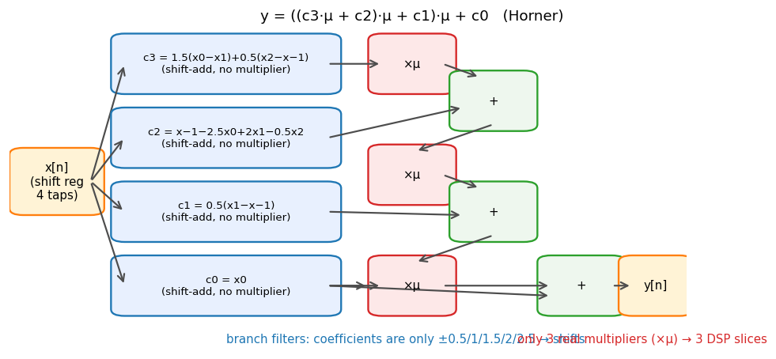

:::tip[구조를 한 문장으로]
**왼쪽(branch)은 계수가 예쁜 고정 필터 4개, 오른쪽(Horner)은 ×μ 곱셈 3개.** 진짜 곱셈기가 필요한 곳은 오른쪽 3개뿐이다. 왼쪽의 계수(0.5, 2.5 등)는 전부 2의 거듭제곱 조합이라 shift와 덧셈으로 처리된다 — 이 이야기는 2편의 RTL에서 자세히 다룬다.
:::

## 4. 성능을 어떻게 "숫자"로 재나 — 주파수 응답 관점

여기부터가 이 글의 본론이다. "Catmull-Rom이 linear보다 좋다"는 말은 감상이고, 설계 문서에는 숫자가 필요하다. 그런데 보간기의 성능을 어떻게 재야 할까?

### 왜 "주파수"로 재나

보간기가 하는 일을 다시 보면 **"신호를 μ만큼 시간 이동시키는 것"** 이다. 그리고 신호를 시간 이동시켰을 때 무엇이 달라지는지는 **주파수별로 보면 명확하게 드러난다**. 이상적인 시간 이동은 이래야 한다.

1. **모든 주파수 성분의 크기는 그대로** — 지연시켰다고 소리가 작아지면 안 된다
2. **모든 주파수 성분이 똑같이 μ만큼 밀린다** — 저음만 밀리고 고음은 안 밀리면 파형이 뭉개진다

실제 보간기가 이 둘에서 얼마나 벗어나는지가 곧 성능이다. 그래서 주파수별로 (1) 크기가 얼마나 깎였나, (2) 얼마나 밀렸나를 재는 것이다.

### μ를 고정하면 그냥 필터가 된다

주파수 응답을 구하려면 대상이 **필터**여야 하는데, 우리 보간기는 μ에 따라 계속 변하는 물건이라 곤란해 보인다. 여기서 트릭이 있다 — **μ를 하나 고정하면** Farrow 식(3장)의 c₀–c₃가 상수가 되고, 결국 "샘플 4개에 고정된 숫자 4개를 곱해 더하는 것"이 된다.

예를 들어 μ=0.5를 3장의 식에 넣고 x별로 정리해보자. c₀=x₀, c₁=0.5(x₁−x₋₁), … 를 대입하고 x₋₁, x₀, x₁, x₂의 계수를 각각 모으면:

$$
\begin{aligned}
y(0.5) &= -\tfrac{1}{16}x_{-1} + \tfrac{9}{16}x_0 + \tfrac{9}{16}x_1 - \tfrac{1}{16}x_2\\
       &= -0.0625\,x_{-1} + 0.5625\,x_0 + 0.5625\,x_1 - 0.0625\,x_2
\end{aligned}
$$

숫자 4개가 나왔다. 대칭인 것(양 끝이 같음)은 μ=0.5가 정확히 한가운데라 그렇고, 이웃 둘에 **음수**가 붙은 것이 앞서 본 negative lobe다. 넷을 더하면 정확히 1인데, 이는 "평평한 신호를 넣으면 그대로 나온다"는 뜻이다.

이런 형태 — 입력 샘플 몇 개에 고정 계수를 곱해 더하는 것 — 를 **FIR 필터**라 하고, 그 계수 하나하나를 **tap**이라 부른다. 위 식은 tap 4개짜리 FIR 필터다.

:::note[FIR 필터와 tap]
**FIR(Finite Impulse Response) 필터**는 "최근 입력 몇 개에 각각 정해진 가중치를 곱해 더한 것"이다. 그 가중치를 **tap**이라 하고, 개수가 필터의 길이다. tap이 많을수록 정교한 필터가 되지만 곱셈이 늘어난다. 우리 보간기는 μ마다 tap 값이 바뀌는 **가변 FIR**인 셈이고, 그래서 μ를 하나씩 고정해가며 성능을 재야 한다. 아래 그림들에서 μ별로 곡선이 여러 개 그려지는 이유가 이것이다.
:::

### 필터의 주파수 응답 구하기

FIR 필터가 되었으니 주파수 응답을 구할 수 있다. 공식은 이렇다 — tap을 $h_k$, tap의 위치를 $k$라 할 때:

$$
\begin{aligned}
H(f, \mu) &= \sum_k h_k(\mu)\, e^{-j2\pi f k}\\
&= h_{-1}e^{+j2\pi f} + h_0 + h_1 e^{-j2\pi f} + h_2 e^{-j4\pi f}
\end{aligned}
$$

**직관**: 각 tap은 서로 다른 시각의 샘플에 곱해진다. 주파수 f의 사인파가 들어오면, 한 샘플 뒤의 값은 위상이 2πf만큼 밀려 있다 — 그 위상 밀림을 $e^{-j2\pi fk}$가 표현한다. 그러니 이 식은 "각 tap이 기여하는 값을 위상까지 고려해 다 더하면 출력이 얼마인가"를 묻는 것이고, 결과 $H$는 **복소수**라 크기($|H|$)와 위상($\angle H$) 두 정보를 동시에 담는다.

그리고 **이상적인 시간 이동의 응답은 $H_\text{ideal} = e^{-j2\pi f\mu}$** 다 — 크기가 1(안 깎임)이고 위상만 μ에 비례해 밀린 것. 우리 H가 여기서 벗어나는 만큼이 왜곡이고, 그 벗어남을 세 각도로 잰다: **크기가 깎이는가(4-1), 지연이 정확한가(4-2), 원치 않는 성분이 새는가(4-3).**

### 4-1. 진폭이 깎이는가 — passband droop


데이터시트 차트 D1을 다시 보자. μ를 0–0.5에서 몇 개 골라 **|H(f)|** — 앞서 구한 H의 크기, 즉 "주파수 f의 성분이 몇 배로 나오나" — 를 그린 것이다. 이상적이면 크기가 1배(=0 dB)여야 하므로 모든 곡선이 0 dB 수평선이어야 하는데, 주파수가 올라갈수록, 그리고 μ가 0.5에 가까울수록 처진다(droop). μ=0은 통과 모드라 완벽한 수평선이고, μ=0.5가 최악이다(μ와 1−μ는 대칭이라 0.5–1 구간은 같은 그림이다). 이 처짐을 어디까지의 주파수에서 읽어야 하는가 — 여기서 이 IP의 가장 중요한 파라미터가 등장한다.

:::tip[B/Fs — 응용을 하나의 숫자로 환원하는 파라미터]
보간기 입장에서 응용의 정체(오디오냐 모뎀이냐)는 중요하지 않다. 중요한 것은 단 하나 — **신호의 최고 주파수 B가 샘플링 주파수 Fs의 몇 배인가**다. 이 비율 **B/Fs**를 상대 대역폭이라 한다. 신호가 대역을 조금만 쓰면(샘플이 파형에 비해 촘촘하면) 보간이 쉽고, 많이 쓰면 어렵다.

**B/Fs는 0.5를 넘을 수 없다.** 나이퀴스트 한계가 Fs/2이기 때문이다. 즉 **0.5가 물리적 상한**이고, 이 값에 가까울수록 샘플이 파형에 비해 성겨서 어떤 보간기도 힘들어진다. 각 응용은 이렇게 환산된다.

| 응용 | 계산 | B/Fs | 상한(0.5) 대비 |
|---|---|---|---|
| 10배 오버샘플된 계측 신호 | 여유가 아주 많음 | 0.05 | 10% |
| 모뎀 (심볼당 샘플 4개) | — | 0.156 | 31% |
| **모뎀 (심볼당 샘플 2개)** ← 대표 예제 | — | **0.3125** | **62%** |
| 오디오 (48 kHz로 20 kHz 콘텐츠) | 20/48 | 0.417 | 83% |
| (나이퀴스트 한계) | Fs/2 ÷ Fs | 0.5 | 100% |

오디오는 계산이 직관적이다 — 48 kHz로 샘플링하는데 음악에 20 kHz까지 들어 있으면 20/48 = 0.417이다. 모뎀은 신호 대역이 **심볼 속도**와 **펄스 성형 필터의 여유폭(roll-off)** 으로 정해지는데, 심볼당 샘플 2개에 흔한 roll-off 값(25%)이면 0.3125가 나온다. 이 계산의 세부는 이 글의 요지가 아니니 **"모뎀 2 sps = 0.3125"라는 숫자만 들고 가면 된다.**

**표기 주의** — 같은 신호를 두 방식으로 말할 수 있어 혼동하기 쉽다. 이 글은 **전부 B/Fs**로 통일한다.

- **B/Fs = 0.3125** ← 이 글의 표기. "Fs의 31.25%". 상한은 0.5. 그림의 x축도 이것이다.
- B/(Fs/2) = 0.625 ← "나이퀴스트 대비 62.5%". 상한은 1.0. 문헌에 따라 이렇게 쓰기도 한다.

둘은 정확히 2배 차이다. 위 표의 마지막 열(상한 대비 %)이 후자에 해당한다.

이하 모든 성능 수치는 대표 예제인 B=0.3125 기준이고, 마지막 절에서 임의의 B에 대한 곡선으로 일반화한다.
:::

대역 안에서 얼마나 처지는지가 droop 지표다.

측정 결과(μ 전 구간에서 최악값): 신호가 대부분의 에너지를 갖는 구간(≤0.1875·Fs)에서 **−0.35 dB(진폭 4% 감소)**, 대역 맨 끝(0.3125·Fs, μ=0.5)까지 보면 **−2.53 dB(25% 감소)**. 대역 가장자리에서는 무시 못 할 처짐이 있다는 것도 정직하게 기록해 둔다. 다른 대역폭에서의 값은 차트 D5에서 바로 읽힌다 — B=0.2에서 −0.46 dB, 0.25에서 −1.07 dB, 0.375에서 −5.26 dB, 0.45에서 −12.66 dB.

같은 조건에서 **linear는 −1.60 dB / −5.09 dB**다. 평탄부에서 약 4.5배(1.25 dB), 대역 끝에서 2.5 dB 차이 — **여기가 cubic이 실제로 이기는 지점**이다. 4-2에서 보겠지만 지연 특성은 둘이 동일하므로, 종합 성적 +6.9 dB는 사실상 전부 이 진폭 차이에서 나온다.

### 4-2. 지연이 정확한가 — 지연 오차


데이터시트 차트 D7이다. 각 μ에 대해 "실제로 몇 샘플만큼 밀렸나"를 주파수별로 그린 것이다(인과적 표기라 목표는 1+μ). 점선(지시한 1+μ)에 딱 붙어 있어야 이상적인데, 고주파로 갈수록 벗어난다 — 벗어나는 방향은 항상 중앙(1.5) 쪽이다. **이 부품의 본업이 '정확한 지연'이므로 이 지표가 가장 본질적**이다.

측정: 대역 내 최악 **7.7% Ts**(위상 지연 기준). 여기서 **Ts는 샘플 주기**(샘플과 샘플 사이의 시간)다. 즉 "μ=0.3만큼 밀어라"라고 지시했는데 실제로는 0.377만큼 밀리는 정도의 오차가 최악의 경우 발생한다는 뜻이다. 위상의 기울기를 보는 **군지연 기준으로는 최악 0.28 Ts**로 더 크게 잡힌다(차트 D2 아래 패널) — 대역 끝의 급한 위상 변화에 군지연이 더 민감하기 때문이며, 포락선 왜곡이 걱정되는 변조 신호라면 이쪽 지표를 봐야 한다.

:::note[놀라운 사실: linear도 7.7%다 — 지연에서는 cubic이 이득이 없다]
같은 조건에서 linear interpolation의 지연 오차를 재보면 **정확히 같은 7.7%**가 나온다. 소수점 셋째 자리까지 같고, 최악이 되는 지점(μ=0.74, f=0.312)까지 같다. 우연이 아니라 수학적 필연이다.

이유는 **대칭성**이다. Catmull-Rom의 tap을 보면 h₋₁(μ) = h₂(1−μ)이고 h₀(μ) = h₁(1−μ)다 — 즉 커널이 보간 지점을 중심으로 좌우 대칭이다. linear의 삼각형 커널도 당연히 대칭이다. 그리고 **대칭 FIR 필터는 선형 위상(linear phase)** 을 갖는다는 것이 신호처리의 기본 정리다. 그래서 두 커널의 위상 특성이 같아지고, 남는 오차는 "4-tap이든 2-tap이든 유한한 길이로 자른 대가"뿐이라 동일해진다.

**함의가 크다.** cubic이 linear보다 좋은 이유가 "타이밍이 더 정확해서"가 아니라 **전적으로 진폭(4-1의 droop)에서 온다**는 뜻이다. 종합 성적 +6.9 dB의 출처도 진폭이다. 이 구분을 알면 잘못된 처방을 피할 수 있다 — 대칭 커널을 쓰는 한 tap을 늘려도 이 지표는 개선되지 않는다. 지연 오차를 줄이는 유일한 길은 **대역을 덜 쓰는 것**(오버샘플링을 늘리는 것)이다.
:::

### 4-3. 원치 않는 성분이 새는가 — image rejection

샘플링에는 부작용이 하나 있다. 신호를 이산 샘플로 찍는 순간, 원래 없던 **복제본(image)** 이 Fs, 2Fs, 3Fs… 근처에 자동으로 생긴다. 샘플만 봐서는 원본과 복제본을 구분할 수 없기 때문에 생기는 현상이다.

보간은 개념적으로 "샘플들로부터 연속 신호를 되살리는 일"이므로, 되살릴 때 **원본만 남기고 복제본은 걸러내야** 한다. 그 거르는 역할을 보간 커널이 한다. 커널이 복제본을 얼마나 잘 죽이는지가 **image rejection**이고, 못 죽이면 그 찌꺼기가 왜곡으로 남는다.


데이터시트 차트 D3이다. 위 패널은 커널이 주파수별로 신호를 얼마나 통과시키는지를 나이퀴스트 존 3개에 걸쳐 보여준다. 파란 음영(1구역, 원본 대역)에서는 높게(통과), 붉은 음영(2·3구역, 복제본이 있는 자리)에서는 낮게(차단) 지나가야 좋은 커널이다. 이상적인 목표는 대역 안을 0 dB로 그대로 통과시키고 나이퀴스트(0.5·Fs)부터 완전히 0으로 떨어지는 벽(brickwall)인데 — 복제본을 남김없이 지우는 이 특성은 무한히 긴 필터로만 가능해서, 실제 커널은 여기에 도달할 수 없다. 빨간 점이 각 복제본 대역에서 억압이 가장 약한 지점이고, 아래 패널이 그 최악값을 대역폭의 함수로 편 것이다.

측정: **1차 복제본 17.8 dB, 2차 44.3 dB, 3차 57.4 dB 억압** (linear는 16.6 / 32.2 / 40.3 dB). 재미있는 결과다 — 1차에서는 linear와 1.2 dB밖에 차이가 안 난다. Catmull-Rom은 Fs 정확히 그 지점에 깊은 골(zero)을 갖지만, 신호 대역이 넓으면 복제본이 차지하는 구간도 넓어져 **최악값이 골에서 먼 가장자리에서 잡히기** 때문이다. **Catmull-Rom의 우위는 2차 이상에서 본격적으로 나타난다(+12.1 dB, +17.2 dB)**.

:::tip[image 억압을 설계 문서에 쓸 때]
"image 억압 44 dB"만 적으면 1차 복제본(17.8 dB, linear와 1.2 dB 차이)을 가린 셈이 된다. 세 차수를 나란히 적고, 종합 우위는 5장의 interpolation SNR(+6.9 dB)로 보이는 것이 정직하고 오히려 강하다. 그리고 몇 차 복제본까지 신경 써야 하는지는 **뒷단 회로가 정한다** — 보간기 출력을 바로 저역 필터에 넣는다면 1차만 중요하고, 광대역으로 쓴다면 고차까지 본다.
:::

## 5. MATLAB 정량 분석 — "정답을 아는 실험" 만들기

주파수 응답은 주파수 하나하나의 이야기다. 실제 신호는 대역 전체를 차지하므로, **실신호를 넣었을 때 총 오차가 얼마인가**를 재야 최종 성능이 된다. 이 절에서는 대표 예제(모뎀 신호, B=0.3125)로 그 총 오차를 재는데, **측정 방법 자체는 어떤 응용의 신호에도 그대로 쓰인다** — 아래 코드에서 신호 생성부만 바꾸면 된다.

그런데 근본적인 난관이 있다. 보간기의 오차를 재려면 "샘플 사이의 진짜 값"이 필요한데, 실제 세계에서는 그걸 알 수 없다.

해법은 실험을 거꾸로 설계하는 것이다. **신호를 처음부터 64배 촘촘한 그리드에서 만들어 두고, 보간기에게는 64개당 1개만 보여준 뒤, 감춰둔 63개를 채점 기준(정답지)으로 쓴다.**

핵심만 남긴 코드가 이렇다.

```matlab
R = 64;                                  % 64배 촘촘한 그리드
s_hi = make_test_signal(Nh, B);          % ① 정답을 아는 신호 (아래 note 참고)
x_lo = s_hi(1:R:end);                    % ② 시험지: 64개당 1개만 보간기에 준다

n = 3:numel(x_lo)-2;                     % 채점할 지점들 (양끝은 탭이 모자라 제외)

% ③ μ를 1/64 단위로만 뽑는다 → 정답이 그리드 위에 존재한다
mu_q  = randi([0 R-1], 1, numel(n));  mu_f = mu_q/R;
truth = s_hi((n-1)*R + mu_q + 1);        % 감춰둔 정답지 조회

% ④ 채점: 보간 결과 vs 정답
y_cr = catmull_rom_float(x_lo(n-1), x_lo(n), x_lo(n+1), x_lo(n+2), mu_f);
y_ln = (1-mu_f).*x_lo(n) + mu_f.*x_lo(n+1);            % 비교용 linear
snr_cr  = 10*log10(sum(truth.^2) / sum((y_cr-truth).^2))
snr_lin = 10*log10(sum(truth.^2) / sum((y_ln-truth).^2))
```

네 줄짜리 아이디어인데, 각 단계에 함정이 하나씩 숨어 있다.

- **① 왜 이 신호가 "진짜 정답"인가**: 아무 신호나 촘촘히 만들면 되는 게 아니다. 신호를 **주파수 영역에서 대역폭 B로 잘라서** 만들어야 한다. 그러면 샘플링 정리에 의해 "이 신호는 샘플들로부터 유일하게 결정되는 단 하나의 신호"가 되고, 촘촘한 그리드의 각 점은 근사가 아니라 **참값**이 된다.
- **③ μ를 1/64 단위로 제한하는 이유**: μ를 아무 실수나 뽑으면 그 지점의 참값을 구하려고 또 보간을 해야 한다 — 보간기를 채점하려고 보간을 쓰는 순환 논리다. 1/64 단위로 제한하면 정답이 그리드 위에 정확히 놓여 있어 **그 값을 바로 조회하면** 된다.
- **④ `catmull_rom_float`는 double 정밀도 모델**: double의 오차는 −300 dB 수준이라 사실상 무한 정밀도다. 따라서 여기서 측정되는 오차에는 "비트를 아껴 생긴 오차"가 전혀 없고, 순수하게 **수식(커널) 자체의 한계**만 남는다. 2편에서 이 값이 중요한 기준선이 된다.

:::note[① 신호 생성부의 실제 코드]
범용 IP의 기준 신호는 **대역을 고르게 채운 평탄 스펙트럼**이다 — 특정 응용에 치우치지 않고, 대역을 최대로 쓰는 보수적 경우다. 백색잡음을 주파수 영역에서 대역 B로 잘라 만든다.

```matlab
S = fft(randn(1,Nh));           % 백색잡음
fax = [0:Nh/2-1, -Nh/2:-1]*(R/Nh);
S(abs(fax) > B) = 0;            % 대역 B 밖을 0 으로 (칼같이 자름)
s_hi = real(ifft(S));
s_hi = 0.9*s_hi/max(abs(s_hi)); % 클리핑 방지 여유
```

요점은 **FFT로 대역을 칼같이 잘랐다**는 것 하나다. 대역 안이 평탄하므로 오차가 큰 대역 끝까지 고르게 에너지가 실린다 — 그래서 **보수적**이다.

**모뎀 응용이라면** 신호가 RRC 펄스 성형된 형태가 되는데, 이땐 대역 끝 에너지가 적어 더 좋은 점수가 나온다(아래 비교). 다른 응용도 이 신호 생성부만 바꾸면 되고, 조건은 하나 — **대역폭 B 안에 정확히 갇힌 신호**여야 한다.
:::

### 결과 — 23.7 dB는 이렇게 나온다

채점 결과가 어떻게 숫자 하나로 뭉쳐지는지 따라가 보자. 위 코드의 마지막 두 줄이 하는 일이다.

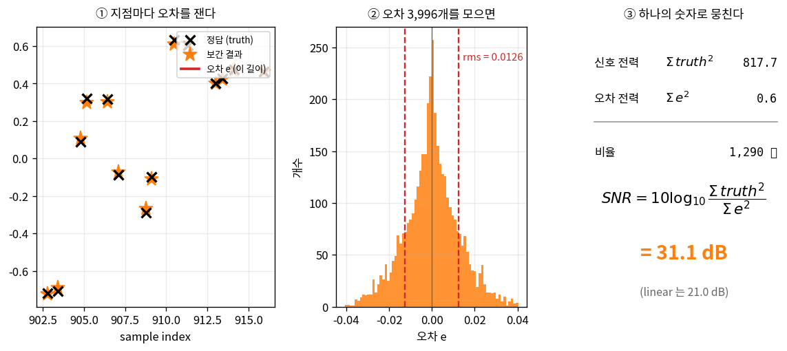

**① 지점마다 오차를 잰다.** 각 μ 지점에서 보간값(주황 별)과 정답(검은 X)의 차이가 오차 e다(빨간 선분). 눈으로 보면 거의 붙어 있지만 미세하게 어긋나 있고, 이런 지점이 **3,996개** 있다.

**② 오차 3,996개를 모은다.** 히스토그램으로 보면 0을 중심으로 종 모양으로 퍼져 있다. 어떤 지점은 오차가 +쪽, 어떤 지점은 −쪽이라 **그냥 더하면 상쇄되어 0에 가까워진다** — 그래서 부호를 지우려고 **제곱해서** 더한다. 그 합이 오차 전력 Σe²다.

**③ 신호와 비교해 비율을 낸다.** 오차가 작다는 건 상대적인 이야기다 — 신호가 크면 같은 오차도 덜 거슬린다. 그래서 신호도 같은 방식(제곱해서 합)으로 재고 비율을 본다. 실제 값을 넣어보면:

| 항목 | 수식 | 값 |
|---|---|---|
| 신호 전력 | $\sum \text{truth}^2$ | 199.3 |
| 오차 전력 | $\sum e^2$ | 0.861 |
| 비율 | $199.3 / 0.861$ | **232 배** |
| SNR | $10\log_{10}(232)$ | **23.7 dB** |

**즉 23.7 dB는 "신호 전력이 오차 전력의 약 232배"라는 뜻이다.** 진폭(크기)으로 환산하면 √232 ≈ 15배, 뒤집으면 **오차가 신호의 6.3% 수준**이다. 같은 실험에서 linear는 16.8 dB — 오차 전력이 약 5배 크고, 진폭으로는 14%다.

| 지표 | Catmull-Rom | Linear | 차이 |
|---|---|---|---|
| Interpolation SNR (평탄 스펙트럼, B/Fs=0.3125) | **23.7 ± 0.2 dB** | 16.8 ± 0.1 dB | **+6.9 ± 0.1 dB** |
| 같은 말 — 오차가 신호의 몇 %인가 | **6.3%** | 14% | 약 2.2배 정확 |

:::note[± 는 왜 붙나 — 정직한 유효숫자]
이 실험은 **랜덤 신호**로 만든 대역제한 파형을 쓰므로, 시드를 바꾸면 값이 조금씩 달라진다. 시드 8개로 돌려본 결과다.

| | 평균 | 표준편차 | 범위 |
|---|---|---|---|
| CR SNR | 23.57 dB | 0.16 | 23.36 – 23.78 |
| linear SNR | 16.68 dB | 0.10 | 16.54 – 16.84 |
| **차이** | **6.90 dB** | **0.08** | 6.77 – 7.04 |

**절대값은 ±0.2 dB 흔들리지만 차이는 ±0.1 dB로 훨씬 안정적**이다. 같은 신호로 두 커널을 채점하니 신호의 변동이 양쪽에서 상쇄되기 때문이다.

그래서 이 문서는 "23.6 dB"처럼 소수점 첫째 자리까지 단정하지 않고 **23.7 ± 0.2 dB**로 쓴다. 유효숫자를 과장하면, 다른 시드로 돌려본 독자가 23.4 dB를 보고 "재현 실패"로 오해한다. 설계 판단에 쓸 값은 **흔들림이 적은 "차이(+6.9 dB)"** 쪽이다.
:::

:::note[같은 커널인데 왜 값이 여럿인가 — 15 / 23.7 / 31 dB]
같은 커널인데 이 글 곳곳에서 다른 점수가 나온다. **시험 신호가 다르기 때문**이다. 커널은 하나지만, 어떤 신호를 넣느냐에 따라 점수가 갈린다.

| 숫자 | 시험 신호 / 조건 | 성격 |
|---|---|---|
| **15 dB** | 대역 **끝 주파수(0.3125·Fs)의 톤 하나** | 최악점 — 오차가 가장 큰 주파수 |
| **21.0 dB** (차트 D6) | 평탄 스펙트럼, **μ 최악값(μ=0.5)** | 어떤 μ에 걸려도 보장되는 하한 |
| **23.7 dB** (이 절, 주 지표) | 대역 0–0.3125를 **고르게 채운 평탄 스펙트럼**, μ 무작위 평균 | 대역을 최대로 쓰는 보수적 실신호 |
| **31.0 dB** | **RRC 모뎀 신호** | 대역 끝 에너지가 적어 유리한 특수 응용 |

넷 다 맞는 값이다. **이 데이터시트가 23.7 dB를 주 지표로 쓰는 이유**는 범용 IP이기 때문이다 — 사용자가 어떤 스펙트럼을 넣을지 모르므로, 대역을 고르게 쓰는 보수적 신호로 재는 게 안전하다.

모뎀 예시(31 dB)가 더 높은 건 RRC 성형된 신호는 스펙트럼이 대역 끝으로 갈수록 감소해 **오차가 큰 고주파 구간에 에너지가 거의 없기** 때문이다. 유리한 신호라 참고로만 병기한다. 15 dB는 반대로 **오차가 가장 큰 한 점**만 본 하한이다.

**교훈**: 설계 문서에는 어느 신호로 잰 값인지 반드시 함께 적어야 한다. "SNR 31 dB"만 쓰면 평탄한 신호를 넣은 사람이 "왜 23.7 dB밖에 안 나오지?"가 된다. 그래서 이 글의 SNR에는 항상 신호 조건을 붙였다.
:::

이 **+6.9 dB가 "왜 linear가 아니라 cubic인가"에 대한 답**이다(모뎀 신호라면 +10 dB). 4-1, 4-2, 4-3의 개별 지표(droop, delay, image)는 오차의 원인을 항목별로 분해한 것이고, 그것들이 신호 스펙트럼으로 가중되어 합쳐진 종합 성적이 이 한 줄이다.


마지막으로 이 그림 — 데이터시트 차트 D6 — 이 **이 IP의 진짜 데이터시트**다. 특정 신호 가정 없이 "대역 B를 고르게 채운 신호를 넣으면 노이즈 플로어가 얼마인가"를, 그것도 **μ 최악값 기준**으로 전 대역폭에 대해 그렸다.

**이 SNR은 앞 절과 계산법이 다르다.** 5장은 실제 신호를 흘려보내고 오차를 셌지만(시뮬레이션), 이 그림은 4장의 H(f, μ)에서 **수식으로 바로 나온다**:

$$
E(f,\mu) = H(f,\mu) - e^{-j2\pi f\mu}
$$

$$
\text{SNR}(B) = \min_\mu\Big[-10\log_{10}\Big(\big\langle |E(f,\mu)|^2 \big\rangle_{f\le B}\Big)\Big]
$$

첫 식의 $E$는 "실제 응답 − 이상적 응답", 즉 오차다. 둘째 식의 $\langle\cdot\rangle_{f\le B}$는 대역 안 주파수 전 구간 평균(=평탄 스펙트럼 가정), $\min_\mu$는 μ 전 구간 중 최악값을 뜻하고, 입력의 크기가 1이라 SNR 분자(신호 전력)가 1이 되어 생략됐다. 앞 절의 23.7 dB는 μ를 무작위로 평균한 값이고, 이 곡선은 **최악의 μ에 걸렸을 때의 하한**이라 조금 낮다(B=0.3125에서 21.0 dB).

시뮬레이션 없이 커널 수식만으로 나오는 값이라, **신호를 가정하지 않는다**는 게 핵심이다. 어떤 응용이든 사용자는 자기 신호의 대역폭 B/Fs를 x축에서 찾아 y값을 읽으면 된다.

| 응용 | B/Fs | 이 곡선에서 읽은 노이즈 플로어 |
|---|---|---|
| 10배 오버샘플 계측 | 0.05 | **75 dB** — 사실상 투명 |
| 모뎀 4 sps | 0.156 | **43 dB** |
| 2 sps 대역 (기준 예제) | 0.3125 | **21 dB** (μ 최악) → μ 평균 23.7 dB, 모뎀 RRC면 31 dB |
| 오디오 20k/48k | 0.417 | 약 **12.7 dB** — **이 커널로는 부족**, 더 긴 필터나 2단 구성 필요 |
| (차트 오른쪽 끝) | 0.45 | 10.7 dB |

마지막 두 줄이 중요하다. 데이터시트는 잘 되는 영역만이 아니라 **안 되는 영역**도 알려줘야 한다. 이 곡선에서 정격 대역(**B ≤ 0.35·Fs**, 이 지점의 플로어 ≈ 17.6 dB)이 나온다.

:::note[왜 나이퀴스트 근처에서 무너지나]
f/Fs=0.5(나이퀴스트)의 신호는 샘플당 정확히 반주기, 즉 +1, −1, +1, −1 패턴이다. 이 4개 점만 보고 사이 값을 맞히는 것은 어떤 유한 길이 보간기로도 원리적으로 불가능에 가깝다(봉우리 정보가 샘플에 담기지 않는다). Catmull-Rom의 결함이 아니라 물리적 한계이며, 해법은 커널 교체가 아니라 **오버샘플링을 늘리는 것**뿐이다. 그래서 이 보간기의 정격 대역을 B ≤ 0.35·Fs로 명시한다.
:::

## 6. 1편 정리

| 질문 | 답 |
|---|---|
| 이 부품이 왜 필요한가 | 샘플레이트 변환·지연 정렬·파형 재생·이미지 확대·타이밍 복구 — "샘플 사이 값"은 DSP의 기본 연산 |
| 응용마다 다시 만들어야 하나 | 아니다. 응용은 **상대 대역폭 B/Fs 하나로 환원**된다 (상한 0.5. 모뎀 2 sps = 0.3125, 오디오 20k/48k = 0.417) |
| 왜 Catmull-Rom인가 | 중심차분 기울기 선택 → 계수가 2의 거듭제곱 조합 → **곱셈기가 사라짐**(2편). 성능은 linear +6.9 dB(평탄 기준). 절대 최적이 아니라 자원 대비 성능의 한 지점 |
| 왜 Farrow 구조인가 | μ가 매번 바뀌어도 곱셈 3번(Horner)이면 계산 끝 |
| 성능을 뭘로 재나 | 개별 3종: 진폭 처짐 / 지연 오차 / 복제본 억압 ─ 종합 1개: interpolation SNR (정답 아는 실험) |
| 이 설계의 성적 (B=0.3125) | droop −0.35 dB(평탄부)·−2.53 dB(대역 끝) / 지연 오차 7.7% Ts(위상)·0.28 Ts(군지연) / image 억압 17.8·44.3·57.4 dB / **SNR 23.7 dB, μ 최악 21.0 dB (linear +6.9 dB, 평탄 스펙트럼)** / 정격 B ≤ 0.35·Fs |
| cubic의 이득은 어디서 오나 | **전적으로 진폭**. 지연 특성은 linear와 동일하다(둘 다 대칭 커널 = 선형 위상) |
| 검증 상태 | **전 항목 ✅ 검증** — 성능은 재현 스크립트, 하드웨어(곱셈기·파이프라인·Fmax)는 합성으로 확인. Lagrange 4-tap 정면 비교와 폐루프 implementation loss는 2편에서 다룬다 |

여기까지는 전부 **무한 정밀도(double)** 이야기였다. 실제 하드웨어는 14비트, 18비트 같은 유한한 비트로 계산한다. 몇 비트를 써야 하는가? 비트를 줄이면 언제부터 성능이 무너지는가? 그리고 저 예쁜 계수들(0.5, 2.5)이 어떻게 곱셈기를 지워버리는가? — 2편에서 다룬다.

---

## 부록 A. 재현 스크립트

이 글의 **모든 숫자는 아래 한 파일로 재현된다.** 의존성은 numpy뿐이고, 시드가 고정되어 있어 몇 번을 돌려도 같은 값이 나온다.

```bash
$ python3 reproduce_part1.py
```

파일로 받으려면: [`reproduce_part1.py`](../../../../../assets/catmull-rom/reproduce_part1.py)
전문은 이 부록 맨 아래(**A-5**)에 그대로 실었다. 복사해서 `reproduce_part1.py`로 저장하면 바로 돌아간다.

:::note[왜 MATLAB이 아니라 Python인가]
본문 5장의 코드는 읽기 쉬운 MATLAB로 실었지만, 재현 스크립트는 **Python(numpy)** 이다. 이유는 하나 — **라이선스 없이 누구나 돌려볼 수 있어야** 재현 가능한 문서이기 때문이다. 두 코드는 같은 연산을 하고, MATLAB/Octave로 옮기려면 인덱스가 1부터 시작한다는 점만 조정하면 된다.
:::

### A-1. 실행 파라미터

| 변수 | 값 | 뜻 |
|---|---|---|
| `SEED` | 12345 | 난수 시드 (고정) |
| `R` | 64 | 오버샘플 배수 (정답지 그리드) |
| `B` | 0.3125 | 신호 대역 B/Fs (주 지표) |
| `NMU` | 1024 | μ 격자 수 (주파수 응답용) |
| `ALPHA` | 0.25 | RRC roll-off (모뎀 예시용) |
| `SPS` | 2 | samples per symbol (모뎀 예시용) |
| `NSYM` | 2000 | 심볼 수 (모뎀 예시용) |

### A-2. 나와야 하는 출력

스크립트 끝의 `[SELF-CHECK]` 17개 항목이 **전부 PASS**여야 한다.

```
   PASS  droop CR flat          계산=   -0.3542  기대=  -0.350
   PASS  droop CR band          계산=   -2.5185  기대=  -2.520
   PASS  droop lin flat         계산=   -1.5974  기대=  -1.600
   PASS  delay CR               계산=    7.7106  기대=   7.710
   PASS  delay lin              계산=    7.7106  기대=   7.710
   PASS  delay CR==lin          계산=    0.0000  기대=   0.000
   PASS  image CR 1st           계산=   17.7692  기대=  17.800
   PASS  image CR 2nd           계산=   44.2906  기대=  44.300
   PASS  image CR 3rd           계산=   57.4358  기대=  57.400
   PASS  image lin 1st          계산=   16.5830  기대=  16.600
   PASS  oracle SNR CR          계산=   23.6474  기대=  23.600
   PASS  oracle SNR lin         계산=   16.6424  기대=  16.700
   PASS  tone SNR @0.05         계산=   68.2617  기대=  68.300
   PASS  tone SNR @0.3125       계산=   14.6768  기대=  14.700
   PASS  flat-spectrum SNR      계산=   23.4983  기대=  23.500
   PASS  mu=0 passthrough       계산=    0.7000  기대=   0.700
   PASS  DC gain                계산=    1.0000  기대=   1.000
```

마지막 두 줄이 특히 중요하다 — **수학이 보장하는 성질**이라 이게 깨지면 코드가 틀린 것이다. 어떤 보간기 구현에도 통하는 만능 체크다.

- **μ=0 → 출력 = x₀** : 커널 성질 K(0)=1, K(정수)=0에서 필연
- **임의 μ에서 tap 합 = 1** : DC 이득 1. 보간이 평균 레벨을 보존한다는 뜻

### A-3. 스크립트 구조

| 함수 | 대응하는 본문 |
|---|---|
| `cr_taps()`, `cr_eval()` | 2–3장. 커널 계수와 Farrow/Horner 평가 |
| `H_of()` | 4장. 주파수 응답 $H(f,\mu)$ |
| `metric_droop()` | 4-1. passband droop |
| `metric_delay_err()` | 4-2. 지연 오차 |
| `metric_image()` | 4-3. image 억압 |
| `make_test_signal()` | 5장 note. 평탄 스펙트럼 신호 생성 (주 지표) |
| `make_test_signal_rrc()` | 모뎀 RRC-QPSK 신호 생성 (응용 예시) |
| `oracle_experiment()` | 5장. 정답을 아는 실험 |
| `metric_tone_snr()` | 5장 끝. 응용 무관 데이터시트 곡선 |

### A-4. 다른 조건으로 돌려보려면

- **다른 오버샘플링**: `SPS = 4` → B/Fs가 0.156으로 떨어져 SNR이 약 35 dB로 오른다
- **다른 roll-off**: `ALPHA` 변경 → B = (1+α)/(2·sps)가 따라 바뀐다
- **다른 신호**: `make_test_signal()`만 교체. 조건은 하나 — **대역폭 B 안에 정확히 갇힌 신호**여야 한다(안 그러면 정답지가 참값이 아니게 된다)
- **시드 변동 확인**: `SEED`를 바꿔 돌리면 SNR이 ±0.3 dB 흔들리는 것을 볼 수 있다(5장 note 참고)
- **차트 D6(μ 최악 노이즈 플로어) 재현**: 스크립트의 평탄 스펙트럼 환산부에서 μ 평균 대신 **μ별로 대역 내(f ≤ B) 오차 전력을 평균한 뒤 μ 전 구간의 최악값**을 취하면 된다 — B=0.3125에서 21.0 dB, 0.05에서 75 dB, 0.45에서 10.7 dB가 나온다. 차트 D2 아래 패널의 군지연 오차는 위상 `unwrap(angle(H))`을 주파수로 미분해 −dφ/dω로 구한다(B=0.3125에서 최악 0.28 Ts)

### A-5. 전체 소스

```python
#!/usr/bin/env python3
"""
================================================================================
 Catmull-Rom Fractional-Delay Interpolator — 1편 전체 수치 재현 스크립트
================================================================================
 블로그 1편에 나오는 모든 숫자를 이 파일 하나로 재현한다.
 의존성: numpy 만 (matplotlib 불필요)

   $ python3 reproduce_part1.py

 출력 마지막의 [SELF-CHECK] 가 전부 PASS 여야 정상이다.
 시드가 고정되어 있으므로 몇 번을 돌려도 같은 값이 나온다.
================================================================================
"""
import numpy as np

# ==============================================================================
# 설정 — 1편의 대표 예제 조건
# ==============================================================================
SEED     = 12345      # 난수 시드 (고정 → 재현 보장)
ALPHA    = 0.25       # RRC roll-off
SPS      = 2          # samples per symbol
R        = 64         # 오버샘플 배수 (정답지 그리드 밀도)
NSYM     = 2000       # 심볼 수
NMU      = 1024       # μ 격자 수 (주파수 응답 분석용)

B        = (1 + ALPHA) / (2 * SPS)     # = 0.3125  신호 대역 (B/Fs)
B_FLAT   = (1 - ALPHA) / (2 * SPS)     # = 0.1875  RRC 평탄부 끝
TAPS_K   = np.array([-1, 0, 1, 2])     # tap 위치


# ==============================================================================
# 1. 커널 — Catmull-Rom & linear
# ==============================================================================
def cr_taps(mu):
    """Catmull-Rom 4-tap 계수. μ 배열 -> (4, len(mu))
       블로그 2장의 c0..c3 를 x별로 정리한 것과 동일."""
    mu = np.atleast_1d(np.asarray(mu, float))
    return np.array([
        -0.5*mu + 1.0*mu**2 - 0.5*mu**3,          # x[-1]
         1.0    - 2.5*mu**2 + 1.5*mu**3,          # x[0]
         0.5*mu + 2.0*mu**2 - 1.5*mu**3,          # x[1]
                 -0.5*mu**2 + 0.5*mu**3,          # x[2]
    ])

def lin_taps(mu):
    """linear 2-tap (4-tap 틀에 맞춰 0 패딩)"""
    mu = np.atleast_1d(np.asarray(mu, float))
    z = np.zeros_like(mu)
    return np.array([z, 1-mu, mu, z])

def cr_eval(xm1, x0, x1, x2, mu):
    """Farrow/Horner 형태 — 블로그 3장 식 그대로 (double 정밀도)"""
    c0 = x0
    c1 = 0.5*(x1 - xm1)
    c2 = xm1 - 2.5*x0 + 2.0*x1 - 0.5*x2
    c3 = 1.5*(x0 - x1) + 0.5*(x2 - xm1)
    return ((c3*mu + c2)*mu + c1)*mu + c0


# ==============================================================================
# 2. 주파수 응답 H(f, μ)  — 블로그 4장
# ==============================================================================
def H_of(tapfun, f, mus):
    """H(f,μ) = Σ h_k(μ) e^{-j2πfk}.  반환 (len(mus), len(f))"""
    f = np.atleast_1d(np.asarray(f, float))
    h = tapfun(mus)                                     # (4, Nmu)
    e = np.exp(-1j*2*np.pi*np.outer(TAPS_K, f))         # (4, Nf)
    return np.einsum('km,kf->mf', h, e)

def metric_droop(tapfun, mus, nf=1500):
    """passband droop: 대역 내 |H| 최악값 [dB]"""
    f = np.linspace(1e-4, 0.5, nf)
    mag = 20*np.log10(np.abs(H_of(tapfun, f, mus)))
    return mag[:, f <= B_FLAT].min(), mag[:, f <= B].min()

def metric_delay_err(tapfun, nf=1500, nmu=97):
    """phase delay 오차: 대역 내 |실제지연 - μ| 최악값 [Ts]"""
    f = np.linspace(1e-4, 0.5, nf)
    worst = 0.0
    for mu in np.linspace(0.02, 0.98, nmu):
        H = H_of(tapfun, f, np.array([mu]))[0]
        pd = -np.unwrap(np.angle(H))/(2*np.pi*f)
        worst = max(worst, np.abs(pd[f <= B] - mu).max())
    return worst

def metric_tone_snr(tapfun, f, mus):
    """per-tone SNR — 블로그 5장 끝 데이터시트 곡선"""
    H = H_of(tapfun, f, mus)
    ideal = np.exp(-1j*2*np.pi*np.outer(mus, np.atleast_1d(f)))
    return -10*np.log10((np.abs(H-ideal)**2).mean(axis=0))


# ==============================================================================
# 3. Image rejection — 연속 커널의 푸리에 변환
# ==============================================================================
def kernel_continuous(name, t):
    a = np.abs(t)
    if name == 'cr':
        return np.where(a <= 1, 1.5*a**3 - 2.5*a**2 + 1,
               np.where(a <= 2, -0.5*a**3 + 2.5*a**2 - 4*a + 2, 0.0))
    if name == 'lin':
        return np.maximum(0.0, 1 - a)
    raise ValueError(name)

def metric_image(name, orders=(1, 2, 3), dt=1/8192, npt=401):
    """order차 복제본 대역에서의 최악 억압량 [dB]"""
    t = np.arange(-3, 3, dt)
    K = kernel_continuous(name, t)
    out = []
    for o in orders:
        fb = np.linspace(o - B, o + B, npt)
        mag = np.abs(np.array([np.sum(K*np.exp(-1j*2*np.pi*x*t))*dt for x in fb]))
        out.append(-20*np.log10(mag.max()))
    return out


# ==============================================================================
# 4. Oracle 실험 — 블로그 5장 (정답을 아는 실험)
# ==============================================================================
def make_test_signal(rng):
    """주 지표용: 대역 B 로 잘라낸 평탄 스펙트럼(백색·대역제한).
       응용에 치우치지 않는 보수적 기준 신호. 대역제한이라 고밀도 그리드의
       각 점이 '참값'이 된다."""
    N = 4000
    Nh = N * R
    fax = np.fft.fftfreq(Nh, d=1.0/R)
    S = np.fft.fft(rng.standard_normal(Nh))
    S[np.abs(fax) > B] = 0.0                  # 대역 B 밖을 0 으로
    s_hi = np.real(np.fft.ifft(S))
    return 0.9 * s_hi / np.max(np.abs(s_hi))  # 클리핑 방지 헤드룸

def make_test_signal_rrc(rng):
    """모뎀 예시용: RRC 성형된 QPSK(I-rail). 대역 끝 에너지가 적어 유리한 특수 신호."""
    n_lo = NSYM * SPS
    Nh   = n_lo * R
    syms = rng.choice([-1.0, 1.0], size=NSYM)
    imp = np.zeros(Nh); imp[::SPS*R] = syms
    fax = np.fft.fftfreq(Nh, d=1.0/R); af = np.abs(fax); Rs = 1.0/SPS
    G = np.zeros(Nh)
    G[af <= (1-ALPHA)*Rs/2] = 1.0
    tr = (af > (1-ALPHA)*Rs/2) & (af <= (1+ALPHA)*Rs/2)
    G[tr] = np.sqrt(0.5*(1 + np.cos(np.pi/(ALPHA*Rs)*(af[tr] - (1-ALPHA)*Rs/2))))
    s_hi = np.real(np.fft.ifft(np.fft.fft(imp) * G * G))
    return 0.9 * s_hi / np.max(np.abs(s_hi))

def oracle_experiment(rng, signal_fn=make_test_signal):
    s_hi = signal_fn(rng)
    x_lo = s_hi[::R]                       # 시험지: 64개당 1개
    n = np.arange(3, len(x_lo)-1)          # 채점 지점 (양끝 tap 부족분 제외)

    # μ 는 1/64 의 배수 중에서 무작위로 → 참값이 그리드 위에 정확히 존재
    mu_q = rng.integers(0, R, size=n.size)
    mu_f = mu_q / R
    # x0 = x_lo[n-2], 보간점은 x0~x1 사이 μ. 탭은 x_lo[n-3..n].
    truth = s_hi[(n-2)*R + mu_q]           # 감춰둔 정답지 조회

    y_cr = cr_eval(x_lo[n-3], x_lo[n-2], x_lo[n-1], x_lo[n], mu_f)
    y_ln = (1-mu_f)*x_lo[n-2] + mu_f*x_lo[n-1]

    Ps = np.sum(truth**2)
    out = {}
    for tag, y in (('cr', y_cr), ('lin', y_ln)):
        e = y - truth
        Pe = np.sum(e**2)
        out[tag] = dict(snr=10*np.log10(Ps/Pe), Ps=Ps, Pe=Pe,
                        ratio=Ps/Pe, amp_pct=np.sqrt(Pe/Ps)*100)
    out['npts'] = n.size
    return out


# ==============================================================================
# 실행
# ==============================================================================
def main():
    rng = np.random.default_rng(SEED)
    mus = np.arange(NMU) / NMU
    checks = []

    print("="*78)
    print(f" Catmull-Rom Interpolator — 1편 수치 재현   (seed={SEED})")
    print(f" 조건: B/Fs = {B:.4f} (= {SPS} sps, RRC α={ALPHA}),  평탄부 끝 {B_FLAT}")
    print("="*78)

    # ---- 지표 1: droop ----
    cr_flat, cr_band = metric_droop(cr_taps, mus)
    ln_flat, ln_band = metric_droop(lin_taps, mus)
    print("\n[지표 1] Passband droop  (μ 전 구간 최악값)")
    print(f"   Catmull-Rom : {cr_flat:+6.2f} dB (평탄부 f<={B_FLAT})   {cr_band:+6.2f} dB (대역끝 f<={B})")
    print(f"   linear      : {ln_flat:+6.2f} dB                    {ln_band:+6.2f} dB")
    checks += [("droop CR flat", cr_flat, -0.35, 0.05),
               ("droop CR band", cr_band, -2.52, 0.05),
               ("droop lin flat", ln_flat, -1.60, 0.05)]

    # ---- 지표 2: delay error ----
    de_cr = metric_delay_err(cr_taps)
    de_ln = metric_delay_err(lin_taps)
    print("\n[지표 2] 지연 오차  (대역 내 최악값)")
    print(f"   Catmull-Rom : {de_cr*100:5.2f} % Ts")
    print(f"   linear      : {de_ln*100:5.2f} % Ts   <- CR과 동일 (둘 다 대칭 커널 = 선형 위상)")
    checks += [("delay CR", de_cr*100, 7.71, 0.05),
               ("delay lin", de_ln*100, 7.71, 0.05),
               ("delay CR==lin", abs(de_cr-de_ln)*100, 0.0, 0.01)]

    # ---- 지표 3: image rejection ----
    ic = metric_image('cr'); il = metric_image('lin')
    print("\n[지표 3] Image 억압  (복제본 대역 내 최악값)")
    for i, o in enumerate((1, 2, 3)):
        print(f"   {o}차 : CR {ic[i]:5.1f} dB | linear {il[i]:5.1f} dB | 차이 {ic[i]-il[i]:+5.1f} dB")
    checks += [("image CR 1st", ic[0], 17.8, 0.15), ("image CR 2nd", ic[1], 44.3, 0.15),
               ("image CR 3rd", ic[2], 57.4, 0.15), ("image lin 1st", il[0], 16.6, 0.15)]

    # ---- 지표 4: oracle SNR ----
    o = oracle_experiment(rng)
    print(f"\n[지표 4] Interpolation SNR  (oracle 실험, {o['npts']:,}개 지점)")
    print(f"   신호 전력 Σtruth² = {o['cr']['Ps']:10.2f}")
    print(f"   오차 전력 Σe²     = {o['cr']['Pe']:10.4f}  (CR)")
    print(f"   비율              = {o['cr']['ratio']:10.1f} 배")
    print(f"   -> Catmull-Rom : {o['cr']['snr']:5.2f} dB  (오차 = 신호의 {o['cr']['amp_pct']:.2f}%)")
    print(f"   -> linear      : {o['lin']['snr']:5.2f} dB  (오차 = 신호의 {o['lin']['amp_pct']:.2f}%)")
    print(f"   -> 차이        : {o['cr']['snr']-o['lin']['snr']:+5.2f} dB")
    checks += [("oracle SNR CR", o['cr']['snr'], 23.6, 0.4),
               ("oracle SNR lin", o['lin']['snr'], 16.7, 0.4)]

    # ---- 데이터시트 곡선 ----
    print("\n[데이터시트] 주파수별 per-tone SNR  (신호 가정 없음)")
    pts = [(0.05, "10x 오버샘플 계측"), (0.156, "모뎀 4 sps"),
           (B, "모뎀 2 sps (대표 예제)"), (0.417, "오디오 20k/48k")]
    for f, lab in pts:
        s = float(metric_tone_snr(cr_taps, f, mus)[0])
        print(f"   f/Fs = {f:6.4f}  ->  {s:5.1f} dB   ({lab})")
    checks += [("tone SNR @0.05", float(metric_tone_snr(cr_taps, 0.05, mus)[0]), 68.3, 0.5),
               ("tone SNR @0.3125", float(metric_tone_snr(cr_taps, B, mus)[0]), 14.7, 0.5)]

    # 평탄 스펙트럼 환산 (23.5 dB의 출처)
    fg = np.linspace(1e-4, B, 400)
    flat = -10*np.log10((10**(-metric_tone_snr(cr_taps, fg, mus)/10)).mean())
    print(f"\n   [참고] 대역을 고르게 채운 신호였다면 : {flat:.1f} dB")
    print(f"          (실제 RRC 신호는 {o['cr']['snr']:.1f} dB — 대역 끝에 에너지가 적어서 유리)")
    checks += [("flat-spectrum SNR", flat, 23.5, 0.5)]

    # ---- sanity checks (수학이 보장하는 성질) ----
    print("\n[Sanity] 수학적으로 반드시 성립해야 하는 것들")
    y0 = cr_eval(0.3, 0.7, -0.2, 0.9, 0.0)
    dc = cr_taps(np.array([0.31]))[:, 0].sum()
    print(f"   μ=0 이면 출력 = x0        : {y0:.15f} (x0=0.7)")
    print(f"   임의 μ 에서 tap 합 = 1    : {dc:.15f}")
    checks += [("mu=0 passthrough", y0, 0.7, 1e-12), ("DC gain", dc, 1.0, 1e-12)]

    # ---- 최종 체크 ----
    print("\n" + "="*78)
    print(" [SELF-CHECK] 블로그 게시값과 대조")
    print("="*78)
    allok = True
    for name, got, want, tol in checks:
        ok = abs(got - want) <= tol
        allok &= ok
        print(f"   {'PASS' if ok else 'FAIL'}  {name:22} 계산={got:10.4f}  기대={want:8.3f}")
    print("="*78)
    print(" 결과:", "모든 값 재현 성공 ✓" if allok else "*** 불일치 발생 ***")
    print("="*78)
    return 0 if allok else 1


if __name__ == '__main__':
    raise SystemExit(main())
```

## 부록 B. 용어 정리

| 용어 | 뜻 | 처음 나온 곳 |
|---|---|---|
| **fractional delay** | 샘플 주기의 정수배가 아닌 지연. 이 IP가 하는 일 | 도입부 |
| **μ (fractional interval)** | 샘플 사이의 위치, 0–1 | 1장 |
| **B/Fs** | 상대 대역폭 = 신호 최고 주파수 ÷ 샘플링 주파수. 상한 0.5 | 4-1 |
| **나이퀴스트 한계** | 샘플에 담을 수 있는 최고 주파수 = Fs/2 | 1장 |
| **커널 K(t)** | 샘플 하나가 주변에 주는 영향의 분포 | 2장 |
| **Hermite 기저** | 값·기울기 조건 하나씩을 전담하는 4개의 3차식 | 2장 |
| **Farrow 구조** | 샘플 담당(branch)과 μ 담당(다항식)을 분리한 구현 | 3장 |
| **Horner 법** | 다항식을 중첩 괄호로 접어 곱셈을 줄이는 방법 | 3장 |
| **FIR / tap** | 최근 입력 몇 개에 고정 가중치를 곱해 더하는 필터 / 그 가중치 | 4장 |
| **passband droop** | 통과대역에서 신호 크기가 깎이는 정도 | 4-1 |
| **image** | 샘플링으로 Fs 간격마다 생기는 스펙트럼 복제본 | 4-3 |
| **brickwall** | 대역 안은 그대로, 밖은 완전 차단하는 이상적 응답 | 4-3 |
| **SNR** | 신호 전력 ÷ 오차 전력. 여기서 '잡음'은 보간 오차 | 0장 |
| **Ts** | 샘플 주기 (샘플과 샘플 사이의 시간) | 4-2 |
| **oracle 실험** | 정답을 미리 만들어 두고 채점하는 검증 기법 | 5장 |
| **RRC** | Root-Raised-Cosine. 모뎀의 펄스 성형 필터 | 5장 |
| **sps** | samples per symbol. 심볼당 샘플 수 | 1장 |

## 부록 C. 참고 문헌

이 글의 내용은 아래 논문을 참고했다.

- **R. Keys**, "Cubic convolution interpolation for digital image processing," *IEEE Trans. ASSP*, 1981. — 이 글의 Catmull-Rom 커널과 동일한 커널을 a=−0.5 케이스로 유도한다. 영상 리샘플링 쪽의 표준 레퍼런스.
- **C. W. Farrow**, "A continuously variable digital delay element," *IEEE ISCAS*, 1988. — 3장의 Farrow 구조 원전.
- **L. Erup, F. M. Gardner, R. A. Harris**, "Interpolation in digital modems—Part II: Implementation and performance," *IEEE Trans. Commun.*, 1993. — 모뎀 타이밍 복구에서의 보간기 설계. piecewise-parabolic 대안도 여기서 나온다.
- **T. I. Laakso, V. Välimäki, M. Karjalainen, U. K. Laine**, "Splitting the unit delay," *IEEE Signal Processing Magazine*, 1996. — fractional delay 필터 전반의 리뷰. Lagrange 계열이 표준으로 다뤄진다.
- **E. Catmull, R. Rom**, "A class of local interpolating splines," *Computer Aided Geometric Design*, 1974. — 이름의 출처.