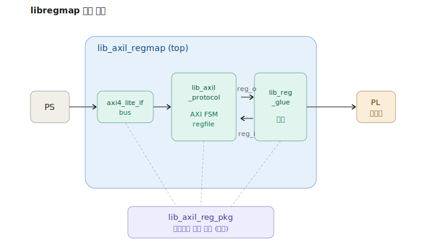
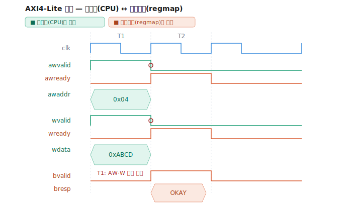
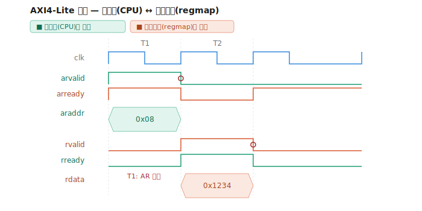

PS(프로세서)와 PL(FPGA 로직)을 잇는 가장 흔한 다리가 **AXI4-Lite 슬레이브 레지스터맵**이다. 이 글에서는 실제로 동작하는 **AXI4-Lite 슬레이브** 레지스터맵 시스템 `libregmap`을 놓고, AXI4-Lite 프로토콜이 어떻게 동작하는지부터 시스템을 이루는 다섯 개 파일의 모든 줄이 무엇을 하는지까지 차근차근 풀어본다.

:::note[이 글에서 다루는 것]
- **이 코드는 AXI4-Lite 슬레이브(slave)이다** — 마스터(CPU)의 요청을 받아 처리하는 쪽
- AXI4-Lite를 왜 쓰는지 (FPGA의 PS-PL 인터페이스 관점)
- AXI4-Lite의 5개 채널과 VALID/READY 핸드셰이크
- 쓰기·읽기 트랜잭션이 시간 순서로 어떻게 흘러가는지 (타이밍 예시)
- 시스템을 이루는 다섯 파일(`axi4_lite_if`, `lib_axil_reg_pkg`, `lib_axil_protocol`, `lib_reg_glue`, `lib_axil_regmap`)의 역할과 협력
- RO/RW 레지스터를 한곳에서 정의하고 자동 배선하는 구조
- 주소 범위를 벗어났을 때의 DECERR, 비정렬 주소의 SLVERR 처리
:::

## 왜 AXI4-Lite 슬레이브 레지스터맵이 필요한가

FPGA SoC(예: Xilinx Zynq)는 크게 두 부분으로 나뉜다. **PS(Processing System)** 는 ARM CPU가 소프트웨어를 돌리는 부분이고, **PL(Programmable Logic)** 은 우리가 Verilog/SystemVerilog로 설계하는 하드웨어 부분이다. 문제는 이 둘이 어떻게 대화하느냐이다.

소프트웨어(PS)가 하드웨어(PL)에게 "이제 시작해", "이 값으로 설정해", "지금 상태가 어때?"라고 명령하고 물어보려면, **둘 사이에 약속된 통신 규약**이 필요하다. 그 표준이 AXI4-Lite이고, PL 쪽에서 그 명령을 **받아주는 창구**가 바로 이 글에서 만드는 **AXI4-Lite 슬레이브 레지스터맵**이다.

### 구체적인 예: PL에 카운터를 만들어 CPU로 제어하기

이 글의 코드는 실제로 **카운터를 제어하는 레지스터맵**이다. 상황을 그려보자. PL에 "클럭마다 1씩 증가하는 카운터" 하드웨어를 만들었다고 하자. 이제 CPU(PS)에서 이 카운터를 제어하고 싶다.

- CPU: "카운터 켜!" → PL 카운터가 증가 시작
- CPU: "지금 값이 얼마야?" → PL이 현재 카운터 값을 알려줌
- CPU: "카운터 초기화!" → PL 카운터가 0으로 리셋

이걸 가능하게 하는 게 **레지스터맵**이다. 각 명령에 **메모리 주소**를 하나씩 배정한다.

| 주소 | 이름 | 방향 | 의미 |
|---|---|---|---|
| `0x00` | CNT_START | 쓰기(RW) | 1을 쓰면 카운터 enable |
| `0x04` | CNT_CLEAR | 쓰기(RW) | 1을 쓰면 카운터 0으로 초기화 |
| `0x08` | CNT_VALUE | 읽기(RO) | 카운터의 현재 값 |
| `0x0C` | CNT_OVERFLOW | 읽기(RO) | 오버플로가 몇 번 났는지 |

그러면 CPU 쪽 소프트웨어는 그냥 **메모리에 값을 읽고 쓰듯이** 하드웨어를 제어한다. C 코드로 보면 이런 느낌이다.

```c
// CPU(PS)에서 도는 소프트웨어
*(volatile uint32_t*)(BASE + 0x00) = 1;        // "카운터 켜!" (CNT_START에 1 쓰기)
uint32_t now = *(volatile uint32_t*)(BASE + 0x08);  // "지금 값?" (CNT_VALUE 읽기)
*(volatile uint32_t*)(BASE + 0x04) = 1;        // "초기화!" (CNT_CLEAR에 1 쓰기)
```

CPU가 `BASE + 0x00`에 1을 쓰는 그 순간, 그 쓰기 동작이 AXI4-Lite 버스를 타고 PL로 전달되고, **우리가 만들 슬레이브 레지스터맵이 그것을 받아** 카운터를 켜는 신호로 바꿔준다. 반대로 CPU가 `BASE + 0x08`을 읽으면, 슬레이브가 PL 카운터의 실제 값을 읽어 CPU에게 돌려준다.

:::tip[핵심 — 이 코드는 "받는 쪽"이다]
CPU(마스터)는 명령을 **보내는 쪽**이고, 이 레지스터맵(슬레이브)은 그 명령을 **받아서 처리하는 쪽**이다. 그래서 이 코드는 트랜잭션을 스스로 시작하지 않고, 항상 마스터가 보낸 주소·데이터·요청을 기다렸다가 응답한다. 이것이 **AXI4-Lite 슬레이브**의 본질이다. 소프트웨어가 하드웨어를 "메모리처럼" 다루게 해주는 번역기인 셈이다.



위 애니메이션은 이 과정을 보여준다. CPU가 보낸 쓰기 명령이 슬레이브에 저장되어 카운터를 켜고, 이어서 읽기 요청이 카운터의 실제값을 가져와 CPU로 돌아온다. 슬레이브는 스스로 무언가 시작하지 않고, 마스터의 요청을 받아 PL 하드웨어와 이어주는 다리 역할만 한다.
:::

이제 이 슬레이브가 따르는 AXI4-Lite 프로토콜부터, 실제 구현 코드까지 차례로 본다.

## 0. 시스템 전체 그림

`libregmap`은 한 파일이 아니라 **역할이 분리된 여러 파일**로 구성된다. 최상위 모듈 `lib_axil_regmap`(top)이 세 개의 구성요소 — 인터페이스(`axi4_lite_if`), 프로토콜 엔진(`lib_axil_protocol`), 배선(`lib_reg_glue`) — 를 안에 인스턴스화해 하나로 묶다. 그리고 이 모든 모듈은 레지스터 레이아웃을 **패키지(`lib_axil_reg_pkg`) 한 곳에서만** 정의해 참조한다.

:::note[이 시스템은 AXI4-Lite 슬레이브이다]
`libregmap`(과 그 핵심인 `lib_axil_protocol`)은 AXI4-Lite **슬레이브(slave)** 로 동작한다. 즉 트랜잭션을 **시작하는 쪽이 아니라 받는 쪽**이다. 마스터(보통 CPU/PS)가 주소·데이터·요청을 보내면, 이 슬레이브는 그것을 받아 레지스터에 쓰거나 값을 돌려준다. 그래서 인터페이스 포트도 `axi4_lite_if.slave bus`처럼 **slave modport**로 받다. 아래 타이밍 다이어그램에서 어느 신호를 마스터가 구동하고 어느 신호를 이 슬레이브가 구동하는지 색으로 구분해 두었다.
:::



위 그림처럼 큰 사각형이 top 모듈이고, 그 안에 세 모듈이 들어 있다. 패키지는 모듈이 아니라 "공유되는 정의 모음"이라 top 바깥에 두고, 각 모듈이 점선으로 참조한다. PS는 top의 왼쪽 바깥, PL 하드웨어는 오른쪽 바깥에 연결된다.

각 구성요소의 역할은 다음과 같다.

| 파일 | 위치 | 역할 |
|---|---|---|
| `lib_axil_regmap.sv` | **top** | 아래 세 모듈을 인스턴스화해 묶는 최상위 |
| `axi4_lite_if.sv` | top 내부 | AXI4-Lite 신호 전부를 묶은 **인터페이스**. modport로 방향을 정하고, 검증용 clocking block도 제공. |
| `lib_axil_protocol.sv` | top 내부 | AXI 프로토콜을 처리하는 **핵심 엔진**. 쓰기/읽기 FSM과 `regfile`. |
| `lib_reg_glue.sv` | top 내부 | `reg_i` **배선 전담** 모듈. RW는 echo, RO는 하드웨어 값을 주입하고, 제어비트를 추출. |
| `lib_axil_reg_pkg.sv` | top 바깥 (참조) | 레지스터 **레이아웃의 단일 출처(SSOT)**. 개수·오프셋·RO/RW 구분을 한곳에 정의. |

데이터 흐름을 한 문장으로 요약하면 이렇다. PS가 `axi4_lite_if`를 통해 `lib_axil_protocol`에 쓰기/읽기를 하면, 프로토콜 엔진은 쓴 값을 `reg_o`로 내보내고 읽을 값을 `reg_i`에서 가져온다. 그 사이를 `lib_reg_glue`가 이어주는데, 평범한 레지스터는 쓴 값을 그대로 돌려주고(echo), 읽기 전용 레지스터는 PL 하드웨어의 실제 상태값을 꽂아 넣다. 그리고 이 모든 모듈이 어떤 주소가 몇 번 레지스터인지, 어느 것이 읽기 전용인지를 `lib_axil_reg_pkg` 하나만 보고 판단한다.

아래에서 프로토콜부터 시작해 네 파일을 차례로 뜯어본다.

## 1. AXI4-Lite 란 무엇인가

AXI4-Lite는 AMBA AXI4 규격에서 **버스트(연속 전송)와 복잡한 기능을 걷어낸 경량 버전**이다. 한 번에 한 워드(32비트 또는 64비트)만 주고받기 때문에, CPU가 주변장치의 제어 레지스터를 읽고 쓰는 용도에 딱 맞다. 그래서 "레지스터맵"을 만들 때 사실상 표준처럼 쓰이다.

핵심 특징을 정리하면 이렇다. 한 번에 한 워드만 전송하고(버스트 없음), 모든 신호 교환은 **VALID/READY 두 신호의 Handshake(handshake)** 로 이뤄지며, 채널이 5개로 분리되어 있어 읽기와 쓰기가 독립적으로 진행된다.

### 5개의 독립 채널

AXI4-Lite는 신호들을 역할별로 5개 채널로 묶다. 쓰기에 3개, 읽기에 2개이다.

| 채널 | 방향 | 역할 | 주요 신호 |
|---|---|---|---|
| AW (Write Address) | 마스터→슬레이브 | 쓸 주소 전달 | `awaddr`, `awvalid`, `awready` |
| W (Write Data) | 마스터→슬레이브 | 쓸 데이터 전달 | `wdata`, `wstrb`, `wvalid`, `wready` |
| B (Write Response) | 슬레이브→마스터 | 쓰기 결과 응답 | `bresp`, `bvalid`, `bready` |
| AR (Read Address) | 마스터→슬레이브 | 읽을 주소 전달 | `araddr`, `arvalid`, `arready` |
| R (Read Data) | 슬레이브→마스터 | 읽은 데이터 응답 | `rdata`, `rresp`, `rvalid`, `rready` |

여기서 **마스터**는 보통 CPU(PS)이고, **슬레이브**는 우리가 만들 레지스터맵(PL)이다. **이 글에서 분석하는 모든 코드는 슬레이브 쪽**이다. 즉 표의 "방향" 칼럼에서, 슬레이브인 우리 코드는 `awaddr`·`wdata`·`arvalid` 같은 신호를 **받고**, `awready`·`bresp`·`rdata` 같은 신호를 **내보낸다**. 마스터(CPU)는 반대이다. 슬레이브는 절대 트랜잭션을 먼저 시작하지 않고, 마스터가 보낸 것에 반응만 한다.

### VALID/READY 핸드셰이크 — 모든 것의 기본

AXI의 모든 데이터 전송은 단 하나의 규칙을 따른다.

:::tip[핸드셰이크 황금률]
**VALID와 READY가 같은 클럭 엣지에서 동시에 1이면, 그 순간 데이터가 전송된다.**
:::

보내는 쪽이 "데이터 준비됐어"라고 `VALID=1`을 올리고, 받는 쪽이 "받을 준비 됐어"라고 `READY=1`을 올린다. 두 신호가 같은 상승엣지에서 모두 1인 바로 그 사이클에 데이터 한 건이 건네진다. 둘 중 하나라도 0이면 전송은 일어나지 않고 기다린다.

이 단순한 규칙 덕분에, 보내는 쪽과 받는 쪽이 서로의 속도를 신경 쓰지 않아도 안전하게 데이터를 주고받을 수 있다.

## 2. 쓰기 트랜잭션의 흐름

CPU가 레지스터 한 칸에 값을 쓸 때, 세 채널(AW → W → B)이 순서대로 동작한다.

1. **주소 전달 (AW)**: 마스터가 `awaddr`에 주소를 싣고 `awvalid=1`. 슬레이브가 `awready=1`로 받으면 주소 전송 완료.
2. **데이터 전달 (W)**: 마스터가 `wdata`에 값을, `wstrb`에 바이트 마스크를 싣고 `wvalid=1`. 슬레이브가 `wready=1`로 받으면 데이터 전송 완료. 이때 슬레이브는 받은 값을 레지스터에 저장한다.
3. **응답 (B)**: 슬레이브가 처리 결과(`bresp`: OKAY 또는 에러)를 싣고 `bvalid=1`. 마스터가 `bready=1`로 받으면 트랜잭션 종료.

타이밍으로 보면 이렇게 흐른다.



위 그림에서 빨간 원으로 표시된 세 지점이 **핸드셰이크(Handshake)** 가 일어나는 순간이다. T2에서 AW 채널(주소), T3에서 W 채널(데이터), T4에서 B 채널(응답)의 valid와 ready가 동시에 1이 되어, 그 클럭에 각 정보가 전송된다.

각 채널에서 VALID와 READY가 만나는 순간(Handshake)이 한 번씩 있고, 그 세 번의 Handshake로 쓰기 한 건이 완성된다.

### wstrb — 바이트 단위 쓰기 마스크

`wstrb`(write strobe)는 32비트 데이터 중 **어느 바이트를 실제로 쓸지** 고르는 4비트 신호이다(32비트는 4바이트이므로). 예를 들어 `wstrb=4'b0011`이면 하위 2바이트만 갱신하고 상위 2바이트는 기존 값을 유지한다. CPU가 한 워드의 일부만 수정하고 싶을 때 사용한다.

## 3. 읽기 트랜잭션의 흐름

읽기는 더 간단하다. 두 채널(AR → R)만 쓴다.

1. **주소 전달 (AR)**: 마스터가 `araddr`에 주소를 싣고 `arvalid=1`. 슬레이브가 `arready=1`로 받음.
2. **데이터 응답 (R)**: 슬레이브가 해당 주소의 값을 `rdata`에, 결과를 `rresp`에 싣고 `rvalid=1`. 마스터가 `rready=1`로 받으면 종료.



읽기는 두 번의 핸드셰이크로 끝난다. T1에서 AR 채널(주소)이 Handshake하고, 슬레이브가 곧바로 데이터를 준비해 T2에서 R 채널(데이터)이 Handshake한다.

여기서도 색으로 구동 주체가 구분된다. **초록색(arvalid, araddr, rready)은 마스터(CPU)가 구동**하고, **주황색(arready, rvalid, rdata, rresp)은 슬레이브인 regmap이 구동**한다. 읽기에서는 주소만 마스터가 주고, 실제 데이터(rdata)는 슬레이브가 만들어 돌려준다는 점이 한눈에 보인다.

:::note[응답 코드 bresp / rresp]
2비트 응답 코드의 의미는 이렇다. `OKAY(2'b00)`는 정상, `SLVERR(2'b10)`는 슬레이브 내부 오류, `DECERR(2'b11)`는 주소 디코딩 실패(없는 주소 접근)이다. 이 모듈은 범위를 벗어난 주소에 DECERR를 돌려준다.
:::

## 4. 모듈 전체 구조 한눈에 보기

이제 실제 코드 `lib_axil_protocol.sv`를 본다. 이 모듈은 AXI4-Lite **슬레이브** 레지스터 파일이자, 이 시스템의 프로토콜 엔진이다. 동작을 한 문장으로 요약하면 이렇다.

> CPU가 쓴 값을 `regfile` 배열에 저장하고(그 값은 `reg_o`로 하드웨어에도 노출), 읽기 요청에는 하드웨어가 준 `reg_i` 값을 돌려준다. 주소가 범위를 벗어나면 DECERR, 비정렬이면 SLVERR.

구조는 크게 다섯 덩어리이다. 파라미터·포트 선언, 상수와 저장소, 헬퍼 함수 4개, **병렬 수신 쓰기 로직**, 읽기 로직. 쓰기 로직은 next-state를 계산하는 **조합 블록(`always_comb`)과 그것을 래치하는 등록 블록(`always_ff`)의 2-process 구조**이고, 읽기 로직은 별도의 `always_ff` 하나이다. 쓰기와 읽기가 이렇게 분리돼 있다는 점이 핵심이다. AXI의 채널 독립성을 그대로 코드 구조로 옮긴 것이다.

```
lib_axil_protocol
├─ 파라미터 / 포트 (bus, reg_o, reg_i)
├─ localparam 상수 (폭, 응답코드 OKAY/SLVERR/DECERR)
├─ regfile[] 저장소 + reg_o 노출
├─ 헬퍼 함수 4개
│   ├─ addr_in_range()   영역 안인가? (REGION_BYTES 직접 비교)
│   ├─ addr_aligned()    4바이트 정렬인가? (신규)
│   ├─ addr_to_index()   주소 → 레지스터 인덱스
│   └─ apply_strb()      바이트 마스크 적용
├─ 쓰기 로직 (2-process: always_comb 회수/수신/커밋 → always_ff 래치)
└─ 읽기 로직 (arready 상시 1 → 즉시 응답)
```

:::note[이전 버전과의 차이]
이전 버전은 쓰기가 직렬 FSM(`W_IDLE → W_DATA → W_RESP`)이고 헬퍼가 3개였다. 이번 버전은 **병렬 수신 + 2-process 구조**로 바뀌고 정렬 검사(`addr_aligned`)가 추가되어 헬퍼가 4개가 됐다. 그 결과 더 빠르고(트랜잭션당 ~2클럭), 더 안전하다(비정렬 SLVERR). 또 회수·수신·커밋을 독립된 `if`로 분리하면서 back-to-back race(버그 #1)와 커밋 중복 latch(버그 #2)를 함께 잡았다. 자세한 건 8번에서 다룬다.
:::

## 5. 포트와 파라미터 — 줄 단위 설명

```systemverilog
module lib_axil_protocol #(
    parameter int ADDR_WIDTH    = 32,
    parameter int DATA_WIDTH    = 32,
    parameter int NUM_REGISTERS = lib_axil_reg_pkg::NUM_REGISTERS
) (
    axi4_lite_if.slave bus,
    output logic [DATA_WIDTH-1:0] reg_o [NUM_REGISTERS],  // PS -> PL
    input  logic [DATA_WIDTH-1:0] reg_i [NUM_REGISTERS]   // PL -> PS
);
```

- `ADDR_WIDTH`, `DATA_WIDTH`: 주소·데이터 폭. 기본 32비트.
- `NUM_REGISTERS`: 레지스터 개수. 패키지에서 가져온다.
- `axi4_lite_if.slave bus`: AXI4-Lite 신호 전부를 묶은 **인터페이스**이다. 앞서 본 `awaddr`, `wvalid`, `bresp` 같은 신호가 전부 이 `bus.` 안에 들어 있다. `.slave` modport라 방향이 슬레이브 관점으로 정해진다.
- `reg_o`: CPU가 쓴 값을 하드웨어로 내보내는 출력 배열 (PS→PL).
- `reg_i`: 하드웨어가 CPU에게 보여줄 값을 받는 입력 배열 (PL→PS). 읽기 응답이 여기서 나온다.

:::tip[reg_o 와 reg_i 의 분리가 핵심 설계]
쓰기는 `reg_o`로 나가고, 읽기는 `reg_i`로 들어온다. 둘이 분리돼 있어서, 하드웨어가 "쓴 값과 다른 값"을 CPU에게 보여줄 수 있다. 만약 쓴 값을 그대로 돌려받고 싶으면, 모듈 바깥에서 `reg_i = reg_o`로 연결하면 된다(에코).
:::

## 6. 상수와 저장소

```systemverilog
localparam int STRB_WIDTH   = DATA_WIDTH/8;
localparam int REGION_BYTES = NUM_REGISTERS * STRB_WIDTH;
localparam int IDX_WIDTH    = $clog2(NUM_REGISTERS);

localparam logic [1:0] RESP_OKAY   = 2'b00;
localparam logic [1:0] RESP_SLVERR = 2'b10;
localparam logic [1:0] RESP_DECERR = 2'b11;

logic [DATA_WIDTH-1:0] regfile [NUM_REGISTERS];
```

- `STRB_WIDTH = DATA_WIDTH/8`: 데이터의 바이트 수. 32비트면 4.
- `REGION_BYTES`: 이 레지스터맵이 차지하는 전체 바이트 크기 (레지스터 수 × 4).
- `IDX_WIDTH = $clog2(NUM_REGISTERS)`: 레지스터 인덱스를 표현하는 데 필요한 비트 수.
- `RESP_*`: 앞서 설명한 2비트 응답 코드 상수.
- `regfile`: CPU가 쓴 값을 실제로 보관하는 내부 배열. 이게 이 모듈의 "기억 장치"이다.

```systemverilog
genvar gi;
generate
    for (gi = 0; gi < NUM_REGISTERS; gi++) begin : g_expose
        assign reg_o[gi] = regfile[gi];
    end
endgenerate
```

`regfile`에 저장된 모든 값을 `reg_o`로 그대로 연결한다. `generate`-`for`로 레지스터 개수만큼 `assign`을 펼친다. 즉 **CPU가 쓰는 순간 그 값이 바로 하드웨어(`reg_o`)에 보인다.**

## 7. 헬퍼 함수 4개 — 줄 단위 설명

**AXI4-LITE의 R/W 주소를 유효성을 판정하고 변환**하는 함수들이다.

### addr_in_range — 영역 안인가?

```systemverilog
function automatic bit addr_in_range(input logic [ADDR_WIDTH-1:0] a);
    return (a < REGION_BYTES);
endfunction
```

주소가 레지스터 영역(`REGION_BYTES = 레지스터수 × 4`) 안에 있는지를 **직접 크기 비교**로 판정한다.


### addr_aligned — 4바이트 정렬인가?

```systemverilog
function automatic bit addr_aligned(input logic [ADDR_WIDTH-1:0] a);
    return (a[1:0] == 2'b00);
endfunction
```

주소의 하위 2비트가 0인지, 즉 **4바이트 정렬**인지 확인한다. 레지스터는 워드(4바이트) 단위이므로 `0x4`, `0x8`처럼 4의 배수여야 한다. `0x6` 같은 비정렬 주소가 들어오면 조용히 잘못된 레지스터로 매핑되는 대신, 뒤에서 SLVERR로 거절한다.

### addr_to_index — 주소를 레지스터 번호로

```systemverilog
function automatic logic [IDX_WIDTH-1:0] addr_to_index(input logic [ADDR_WIDTH-1:0] a);
    return a[2 +: IDX_WIDTH];
endfunction
```

바이트 주소를 배열 인덱스로 변환한다. 하위 2비트(바이트 오프셋)를 떼고, `[2 +: IDX_WIDTH]`로 인덱스 폭만큼 추출한다. `+:`는 "2번 비트부터 IDX_WIDTH개"라는 폭 지정 슬라이스이다. 정렬·범위 검사를 통과한 주소에만 호출되므로 항상 유효한 인덱스가 나온다.

### apply_strb — 바이트 마스크 적용

```systemverilog
function automatic logic [DATA_WIDTH-1:0] apply_strb(
    input logic [DATA_WIDTH-1:0] old_val,
    input logic [DATA_WIDTH-1:0] new_val,
    input logic [STRB_WIDTH-1:0] strb
);
    logic [DATA_WIDTH-1:0] r = old_val;
    for (int i = 0; i < STRB_WIDTH; i++)
        if (strb[i]) r[i*8 +: 8] = new_val[i*8 +: 8];
    return r;
endfunction
```

`wstrb`에 따라 바이트 단위로 골라 쓴다. 결과 `r`을 기존 값으로 시작해, `strb[i]`가 1인 바이트만 새 값으로 덮다. 예를 들어 기존 `0xAABBCCDD`, 새 값 `0x11223344`, `strb=4'b0011`이면 하위 2바이트만 바뀌어 `0xAABB3344`가 된다.

## 8. 쓰기 채널 — 병렬 수신 구조

이 설계의 가장 큰 특징이다. AXI4-LITE는 5개의 채널이 모두 독립적으로 움직인다.

**AXI4-LITE 프로토콜에서는 AW채널과 W채널이 존재하는데, AWVALID와 WVALID를 동 클럭에 받거나, AWVALID를 먼저 받거나, WVALID를 먼저 받는 경우 모두를 처리할 수 있어야한다.**

따라서  **주소(AW)와 데이터(W)를 동시에, 독립적으로 받는 병렬 수신 구조**로 설계했다.


### 핵심 아이디어 — latch 후 합류

```systemverilog
logic                  aw_taken;   // AW 핸드셰이크를 이미 받았나(주소 확보)
logic                  w_taken;    // W  핸드셰이크를 이미 받았나(데이터 확보)
logic [ADDR_WIDTH-1:0] waddr_q;    // 래치한 쓰기 주소
logic [DATA_WIDTH-1:0] wdata_q;    // 래치한 쓰기 데이터
logic [STRB_WIDTH-1:0] wstrb_q;    // 래치한 strobe
```

두 채널을 따로 받으니, 먼저 온 쪽을 기억해 둘 저장소가 필요하다. `aw_taken`/`w_taken`은 "이 채널을 이미 받았다"는 플래그이고, `waddr_q`/`wdata_q`/`wstrb_q`는 받은 값을 보관한다.

```systemverilog
wire aw_hs    = bus.awvalid && bus.awready;   // 이번 클럭 AW Handshake 성립?
wire w_hs     = bus.wvalid  && bus.wready;     // 이번 클럭 W Handshake 성립?
wire b_collect = bus.bvalid && bus.bready;     // 이번 클럭 응답 회수?

wire have_aw = aw_taken | aw_hs;               // 주소 확보됨 = 전에 받았거나 지금 받거나
wire have_w  = w_taken  | w_hs;

// 응답 자리가 비어 있거나(미게시) 이번 클럭에 회수되면 커밋 가능.
wire resp_slot_free  = (!bus.bvalid) || b_collect;
wire do_write_commit = have_aw && have_w && resp_slot_free;
```

`have_aw`와 `have_w`가 핵심이다. "주소가 확보됐다"는 건 **이전에 latch해뒀거나(`aw_taken`) 이번 클럭에 막 받거나(`aw_hs`)** 둘 중 하나이다. 데이터도 마찬가지이다. 그래서 둘 다 확보되고(`have_aw && have_w`) **응답 자리가 비어 있으면**(`resp_slot_free`) 그 즉시 기록한다. 어느 채널이 먼저 왔는지는 상관없다.

여기서 `resp_slot_free`가 중요하다. 단순히 `!bvalid`만 보지 않고, **이번 클럭에 응답이 회수되는 경우(`b_collect`)도 자리가 비는 것으로 본다.** 덕분에 응답을 돌려주는 바로 그 클럭에 곧장 다음 트랜잭션을 커밋할 수 있어 back-to-back이 막히지 않는다.

```systemverilog
wire [ADDR_WIDTH-1:0] commit_addr = aw_taken ? waddr_q : bus.awaddr;
wire [DATA_WIDTH-1:0] commit_data = w_taken  ? wdata_q : bus.wdata;
wire [STRB_WIDTH-1:0] commit_strb = w_taken  ? wstrb_q : bus.wstrb;
```

기록에 쓸 값을 고른다. 이전에 받아둔 값(`waddr_q` 등)이 있으면 그걸, 이번 클럭에 막 도착했으면 버스의 현재 값(`bus.awaddr` 등)을 쓴다. AW와 W가 **동시에** 와도 이 한 줄로 둘 다 정확히 잡힌다.

### 2-process 구조 — 조합(next-state) + 등록(ff)

이 쓰기 로직은 **하나의 `always_ff`에 모든 걸 욱여넣지 않고**, 다음 상태를 계산하는 조합 블록(`always_comb`)과 그 값을 클럭에 래치하는 등록 블록(`always_ff`)으로 나눈 **2-process 구조**이다. 이렇게 나눈 이유는 한 클럭에 **동시에 일어날 수 있는 세 사건(응답 회수 · 채널 수신 · 커밋)을 각각 독립적으로** next-state에 반영하기 위해서다.

```systemverilog
always_comb begin
    // 기본값: 현재 상태 유지
    n_awready  = bus.awready;  n_wready = bus.wready;
    n_bvalid   = bus.bvalid;   n_bresp  = bus.bresp;
    n_aw_taken = aw_taken;     n_w_taken = w_taken;
    n_waddr    = waddr_q;      n_wdata   = wdata_q;  n_wstrb = wstrb_q;
    rf_we = 1'b0;  rf_idx = '0;  rf_wdata = '0;

    // 1) 응답 회수: 자리 비우고 두 채널 개방 (아래 수신이 다시 닫을 수 있음)
    if (b_collect) begin
        n_bvalid   = 1'b0;
        n_aw_taken = 1'b0;  n_w_taken = 1'b0;
        n_awready  = 1'b1;  n_wready  = 1'b1;
    end

    // 2) 채널 수신: 회수와 독립적으로 이번 클럭 핸드셰이크 latch
    if (aw_hs) begin
        n_waddr = bus.awaddr;  n_aw_taken = 1'b1;  n_awready = 1'b0;
    end
    if (w_hs) begin
        n_wdata = bus.wdata;  n_wstrb = bus.wstrb;
        n_w_taken = 1'b1;     n_wready = 1'b0;
    end

    // 3) 커밋: addr+data 확보 && 응답 자리 빔 → 기록 + 응답 게시
    if (do_write_commit) begin
        ...
    end
end
```

세 부분으로 나뉜다. **(1) 응답 회수**: 마스터가 이전 응답을 받아가면(`b_collect`) bvalid를 내리고 두 채널을 다시 열어 다음 트랜잭션을 준비한다. **(2) 독립 수신**: AW나 W Handshake가 성립하면 각자 값을 latch하고, **그 채널만** ready를 내려 같은 값을 중복으로 받지 않게 한다. **(3) 커밋**: 주소·데이터가 모두 확보되면 레지스터에 쓴다.

핵심은 이 셋이 **상호배타 `if/else`가 아니라 독립된 세 개의 `if`** 라는 점이다. 그래서 회수가 ready를 막 열어준 **바로 그 클럭에 도착한 새 핸드셰이크도 (2)에서 정상적으로 latch된다.** 이것이 아래 :::note에서 설명하는 버그 #1 수정의 핵심이다.

:::note[버그 #1 — 응답 회수와 동시 수신의 race]
이전 1-process 구현은 수신 latch가 `if (bvalid && bready) ... else ...`의 **else에 갇혀 있었다.** 그래서 응답을 회수하는 바로 그 클럭에는 수신 로직이 평가되지 않았다. 그 클럭에 마스터가 `ready=1`을 보고 다음 트랜잭션의 AW/W를 올리면 그 핸드셰이크가 통째로 버려져 데이터가 유실됐다(back-to-back에서 재현). 2-process로 분리해 회수·수신·커밋을 독립된 `if`로 만들면서 이 race가 사라졌다.
:::

### 응답 코드 — 3가지 (DECERR + SLVERR)

```systemverilog
    if (do_write_commit) begin
        if (!addr_in_range(commit_addr)) begin
            n_bresp = RESP_DECERR;               // 범위 밖
        end else if (!addr_aligned(commit_addr)) begin
            n_bresp = RESP_SLVERR;               // 범위 안 + 비정렬 (기록 안 함)
        end else begin
            rf_we    = 1'b1;
            rf_idx   = addr_to_index(commit_addr);
            rf_wdata = apply_strb(regfile[addr_to_index(commit_addr)],
                                  commit_data, commit_strb);
            n_bresp  = RESP_OKAY;                // 범위 안 + 정렬
        end
        n_bvalid   = 1'b1;                       // 응답 게시
        n_aw_taken = 1'b0;  n_w_taken = 1'b0;    // 방금 커밋한 분 소비
        n_awready  = 1'b0;  n_wready  = 1'b0;    // 응답 구간엔 닫아 둠
    end
```

커밋 시 주소를 **3단계로 검사**한다. 범위를 벗어나면 `DECERR`, 범위 안이지만 4바이트 정렬이 아니면 `SLVERR`(이때는 기록하지 않음), 정렬까지 맞으면 strobe를 적용해 저장하고 `OKAY`이다. 실제 기록은 여기서 바로 하지 않고 `rf_we`/`rf_idx`/`rf_wdata` 신호만 세워 두며, 등록 블록(`always_ff`)이 이를 받아 클럭 엣지에 `regfile`에 쓴다.

커밋 직후에는 `aw_taken`/`w_taken`을 모두 비우고 두 채널의 ready도 닫는다.

:::note[버그 #2 — 커밋과 동시에 핸드셰이크 중복 latch]
커밋 클럭에 `aw_taken`/`w_taken`을 `aw_hs`/`w_hs`로 보존하면, 동시 수신 후 즉시 커밋하는 경우 **'방금 커밋한 그 트랜잭션'의 핸드셰이크가 다시 latch**되어, 다음 클럭 `b_collect` 시 같은 데이터가 한 번 더 기록됐다(트랜잭션 1건당 `rf_we` 2회 → side-effect 레지스터 오동작). 커밋 클럭엔 ready=0이라 같은 클럭에 새 핸드셰이크가 성립할 수 없으므로, 커밋 시 두 채널을 모두 비우는 게 맞다.
:::

### 등록 — next-state를 클럭에 래치

```systemverilog
always_ff @(posedge bus.clk or negedge bus.rst_n) begin
    if (!bus.rst_n) begin
        bus.awready <= 1'b1;          // 리셋 직후부터 받을 준비(상시 ready)
        bus.wready  <= 1'b1;
        bus.bvalid  <= 1'b0;
        bus.bresp   <= RESP_OKAY;
        aw_taken    <= 1'b0;  w_taken <= 1'b0;
        waddr_q     <= '0;    wdata_q <= '0;  wstrb_q <= '0;
        for (int i = 0; i < NUM_REGISTERS; i++) regfile[i] <= '0;
    end else begin
        bus.awready <= n_awready;  bus.wready <= n_wready;
        bus.bvalid  <= n_bvalid;   bus.bresp  <= n_bresp;
        aw_taken    <= n_aw_taken;  w_taken   <= n_w_taken;
        waddr_q     <= n_waddr;  wdata_q <= n_wdata;  wstrb_q <= n_wstrb;
        if (rf_we) regfile[rf_idx] <= rf_wdata;
    end
end
```

등록 블록은 단순하다. 리셋 시 `awready=1`/`wready=1`로 **두 채널을 다 열어두고**(상시 ready), 그 외에는 조합 블록이 계산한 next-state(`n_*`)를 그대로 클럭 엣지에 래치한다. 실제 `regfile` 쓰기도 여기서 `rf_we`가 섰을 때만 한 번 일어난다. 모든 상태 변경이 이 한 블록에 모여 있어 race가 끼어들 여지가 없다.

타이밍으로 보면, AW와 W가 동시에 오는 경우 이렇게 2클럭에 끝난다.


T1에서 AW와 W Handshake가 동시에 성립해 둘 다 latch되고, T2에서 곧바로 기록과 응답(bvalid)이 나간다. 직렬 구조의 3클럭보다 한 클럭 빠르다.

그림에서 **초록색 신호(awvalid, awaddr, wvalid, wdata)는 마스터(CPU)가 구동**하고, **주황색 신호(awready, wready, bvalid, bresp)는 슬레이브인 이 regmap이 구동**한다. 마스터가 "보낼게(valid)"를 올리고, 슬레이브가 "받을게(ready)"로 응답하는 관계가 색으로 드러난다.

## 9. 읽기 채널 — arready 상시 1로 단축

`arready`를 **항상 1로 열어둬**, 주소가 오는 즉시 데이터를 만들어 응답한다. 
```systemverilog
logic r_busy;   // rvalid 게시 후 회수 대기 중인가
wire ar_hs = bus.arvalid && bus.arready;

always_ff @(posedge bus.clk or negedge bus.rst_n) begin
    if (!bus.rst_n) begin
        bus.arready <= 1'b1;          // 상시 받을 준비
        bus.rvalid  <= 1'b0;
        ...
    end else begin
        if (bus.rvalid && bus.rready) begin
            bus.rvalid  <= 1'b0;       // 응답 회수 -> 다시 받을 준비
            bus.arready <= 1'b1;
            r_busy      <= 1'b0;
        end else if (ar_hs && !r_busy) begin
            if (!addr_in_range(bus.araddr)) begin
                bus.rdata <= '0;
                bus.rresp <= RESP_DECERR;                  // 범위 밖
            end else if (!addr_aligned(bus.araddr)) begin
                bus.rdata <= '0;
                bus.rresp <= RESP_SLVERR;                  // 범위 안 + 비정렬
            end else begin
                bus.rdata <= reg_i[addr_to_index(bus.araddr)];  // hardware decides
                bus.rresp <= RESP_OKAY;                    // 범위 안 + 정렬
            end
            bus.rvalid  <= 1'b1;
            bus.arready <= 1'b0;       // 응답 회수까지 AR 닫음
            r_busy      <= 1'b1;
        end
    end
end
```

`ar_hs`(AR Handshake)가 성립하는 즉시, 쓰기와 **동일한 3단계 검사**를 한다. 범위 밖이면 DECERR, 비정렬이면 SLVERR(데이터는 0), 정렬·범위 OK면 `reg_i`에서 값을 가져와 OKAY이다. `r_busy`는 응답을 게시한 뒤 마스터가 받아갈 때까지 새 요청을 막는 플래그이다.

:::tip[읽기 값은 regfile 이 아니라 reg_i 에서]
쓰기는 `regfile`에 저장하지만, 읽기는 `reg_i`에서 값을 가져온다. 즉 CPU가 읽는 값은 하드웨어가 결정한다("hardware decides"). 쓴 값을 그대로 읽고 싶으면 바깥에서 `reg_i = reg_o`로 연결해야 하는데, 그 연결을 바로 다음에 볼 `lib_reg_glue`가 담당한다.
:::


## 10. 전체 동작 예시로 정리

레지스터가 256개(영역 1KB = 0x400)라고 할 때, 세 가지 시나리오를 따라가 본다.

**시나리오 A — 정상 쓰기 (주소 0x04에 0x1234, AW·W 동시)**

1. 마스터: `awaddr=0x04`+`awvalid=1`, `wdata=0x1234`+`wstrb=4'hF`+`wvalid=1`을 **같은 클럭에** 보냄
2. 슬레이브는 awready·wready가 항상 1이므로 둘 다 즉시 Handshake → `aw_taken`·`w_taken` 동시에 latch
3. 다음 클럭: `have_aw`·`have_w` 모두 참 → `addr_in_range(0x04)` OK, `addr_aligned(0x04)` OK → `regfile[1]=0x1234`, `bresp=OKAY`, `bvalid=1`
4. 마스터 `bready=1` → 종료. 약 2클럭. 동시에 `reg_o[1]`에 `0x1234` 노출.

**시나리오 B — 비정렬 쓰기 (주소 0x06에 쓰기)**

1. 마스터가 `awaddr=0x06`으로 쓰기 시도
2. `addr_in_range(0x06)` OK지만 `addr_aligned(0x06)=0` (하위 2비트가 `10`)
3. → `bresp=SLVERR`, **레지스터는 기록되지 않음**. 비정렬 접근을 안전하게 거절.

**시나리오 C — 범위 밖 읽기 (주소 0x800 읽기)**

1. 마스터: `araddr=0x800`+`arvalid=1` → arready 상시 1이라 즉시 Handshake
2. `addr_in_range(0x800)=0` (0x400 영역 초과) → `rdata=0`, `rresp=DECERR`
3. `rvalid=1` → 마스터가 DECERR로 "없는 주소"임을 인지

:::note[이 DUT를 검증하려면]
이런 레지스터맵은 보통 UVM 테스트벤치로 검증한다. 정상 쓰기/읽기, strobe 부분 쓰기, **비정렬 SLVERR**, 범위 밖 DECERR, AW/W 순서를 바꾼 경우(동시·AW우선·W우선), 백투백 트랜잭션 등을 시퀀스로 만들어 스코어보드로 비교하고 커버리지로 빠진 케이스를 확인한다.
:::

## 11. axi4_lite_if — 신호를 묶는 인터페이스

지금까지 `bus.awvalid`, `bus.wdata`처럼 `bus.` 을 붙여 신호를 썼다. 그 `bus`의 정체가 바로 이 인터페이스이다. AXI4-Lite의 모든 신호를 하나로 묶어, 모듈 사이를 깔끔하게 연결한다.

```systemverilog
interface axi4_lite_if #(
    parameter int ADDR_WIDTH = 32,
    parameter int DATA_WIDTH = 32
) (
    input logic clk,
    input logic rst_n
);
    localparam int STRB_WIDTH = DATA_WIDTH / 8;

    logic [ADDR_WIDTH-1:0]  awaddr;
    logic [2:0]             awprot;
    logic                   awvalid;
    logic                   awready;
    logic [DATA_WIDTH-1:0]  wdata;
    logic [STRB_WIDTH-1:0]  wstrb;
    logic                   wvalid;
    logic                   wready;
    logic [1:0]             bresp;
    logic                   bvalid;
    logic                   bready;
    logic [ADDR_WIDTH-1:0]  araddr;
    logic [2:0]             arprot;
    logic                   arvalid;
    logic                   arready;
    logic [DATA_WIDTH-1:0]  rdata;
    logic [1:0]             rresp;
    logic                   rvalid;
    logic                   rready;
```

5개 채널(AW/W/B/AR/R)의 신호가 전부 한 인터페이스 안에 선언돼 있다. 앞서 본 핸드셰이크 신호(`awvalid`/`awready` 등), 데이터(`wdata`, `rdata`), 응답(`bresp`, `rresp`)이 모두 여기 모여 있다. `awprot`/`arprot`는 보호 속성 신호로, 이 설계에서는 사용하지 않지만 AXI 규격상 포함된다.

### modport — 방향을 정하는 관점

```systemverilog
    modport slave (
        input  clk, rst_n,
               awaddr, awprot, awvalid, wdata, wstrb, wvalid, bready,
               araddr, arprot, arvalid, rready,
        output awready, wready, bresp, bvalid, arready, rdata, rresp, rvalid
    );
```

같은 신호라도 슬레이브 입장에서는 어떤 게 입력이고 어떤 게 출력인지 정해야 한다. `modport slave`가 그걸 정의한다. 슬레이브는 주소·데이터·valid를 **받고(input)**, ready·응답·읽기데이터를 **내보낸다(output)**. 그래서 `lib_axil_protocol`의 포트가 `axi4_lite_if.slave bus`였던 것이다. 이 한 줄로 모든 신호 방향이 한 번에 정해진다.

:::tip[인터페이스를 쓰는 이유]
인터페이스가 없으면 모듈마다 20개 가까운 AXI 신호를 일일이 포트로 나열하고 연결해야 한다. 인터페이스로 묶으면 `bus` 하나만 주고받으면 되고, modport로 방향까지 자동 정리된다. 실수도 줄고 코드도 짧아진다.
:::

### clocking block — 검증 전용

```systemverilog
    clocking master_cb @(posedge clk);
        default input #1step output #1ns;
        input  awready, wready, bresp, bvalid, arready, rdata, rresp, rvalid;
        output awaddr, awprot, awvalid, wdata, wstrb, wvalid, bready,
               araddr, arprot, arvalid, rready;
    endclocking
```

`clocking block`은 **검증(테스트벤치) 전용** 기능이다. 신호를 언제 샘플링하고 언제 구동할지 타이밍을 명확히 정해, 테스트벤치와 DUT 사이의 경쟁 상태(race condition)를 막다. `master_cb`는 테스트벤치가 마스터처럼 행동할 때, `monitor_cb`는 신호를 관찰만 할 때 쓴다. `#1step input`은 클럭 직전 값을 안정적으로 읽겠다는 뜻이다. RTL 합성에는 영향을 주지 않고, 시뮬레이션에서만 동작한다.

## 12. lib_axil_reg_pkg — 레이아웃의 단일 출처

이 패키지가 시스템의 **설계도**이다. 레지스터가 몇 개인지, 각 주소가 무슨 의미인지, 어느 것이 읽기 전용인지를 **여기 한곳에서만** 정의하고 모든 모듈이 이를 참조한다. 그래서 레지스터를 바꿀 때 이 파일만 고치면 된다.

```systemverilog
package lib_axil_reg_pkg;
    localparam int NUM_REGISTERS = 256;

    localparam logic [7:0] CNT_START    = 8'h00;  // RW: 1을 쓰면 카운터 enable
    localparam logic [7:0] CNT_CLEAR    = 8'h04;  // RW: 1을 쓰면 카운터 0으로 clear
    localparam logic [7:0] CNT_VALUE    = 8'h08;  // RO: 카운터 현재값
    localparam logic [7:0] CNT_OVERFLOW = 8'h0C;  // RO: 카운터 오버플로 횟수
```

먼저 레지스터 개수(256)와 각 레지스터의 **오프셋 주소**를 정의한다. 이 예제는 간단한 카운터를 제어하는 레지스터맵이다. `CNT_START`(시작), `CNT_CLEAR`(초기화)는 CPU가 값을 쓰는 RW 레지스터이고, `CNT_VALUE`(현재값), `CNT_OVERFLOW`(오버플로 횟수)는 하드웨어가 값을 채우는 RO(읽기 전용) 레지스터이다.

:::note[RW 와 RO 의 차이]
- **RW (Read-Write)**: CPU가 쓴 값이 그대로 저장되고 읽으면 그 값이 나옴 (echo). 제어용.
- **RO (Read-Only)**: CPU가 써도 무시되고, 읽으면 하드웨어가 정한 값이 나옴. 상태 보고용.

카운터를 예로 들면, "카운터를 켜라"는 명령은 RW(`CNT_START`)로 쓰고, "지금 카운터 값이 얼마냐"는 RO(`CNT_VALUE`)로 읽는다.
:::

### 오프셋을 인덱스로

```systemverilog
    function automatic int unsigned off2idx(input logic [7:0] off);
        return off >> 2;                       // off / 4
    endfunction

    localparam int IDX_CNT_START    = off2idx(CNT_START);     // 0
    localparam int IDX_CNT_CLEAR    = off2idx(CNT_CLEAR);     // 1
    localparam int IDX_CNT_VALUE    = off2idx(CNT_VALUE);     // 2
    localparam int IDX_CNT_OVERFLOW = off2idx(CNT_OVERFLOW);  // 3
```

바이트 오프셋(0x00, 0x04, 0x08...)을 배열 인덱스(0, 1, 2...)로 바꾼다. `off >> 2`는 4로 나누는 것과 같다(레지스터당 4바이트이므로). 이렇게 만든 `IDX_*` 상수로 `reg_o[IDX_CNT_START]`처럼 **이름으로** 레지스터에 접근할 수 있어, 코드 가독성이 크게 올라간다.

### 어느 레지스터가 RO 인가

```systemverilog
    localparam logic [NUM_REGISTERS-1:0] REG_IS_RO =
          (1 << IDX_CNT_VALUE)
        | (1 << IDX_CNT_OVERFLOW);              // 0x08, 0x0C 가 RO
endpackage
```

256비트짜리 비트마스크로, RO 레지스터의 위치만 1로 세운다. `IDX_CNT_VALUE`(2번)와 `IDX_CNT_OVERFLOW`(3번) 비트가 켜진다. RO 레지스터를 추가할 때는 여기에 `| (1 << IDX_새것)` 한 항만 추가하면 된다. 이 마스크를 보고 glue가 어느 레지스터에 하드웨어 값을 꽂을지 결정한다.

## 13. lib_reg_glue — reg_i 배선 전담

`lib_axil_protocol`은 AXI 프로토콜만 처리하고, "읽을 값을 어디서 가져올지"는 신경 쓰지 않다. 그 결정을 이 `lib_reg_glue`가 전담한다. 앞서 regmap이 읽기 때 `reg_i`에서 값을 가져온다고 했는데, **그 `reg_i`를 채우는 게 바로 이 모듈**이다.

```systemverilog
module lib_reg_glue #(
    parameter int DATA_WIDTH = 32
) (
    input  logic [DATA_WIDTH-1:0] reg_o [NUM_REGISTERS],   // PS -> PL (쓰기경로)
    output logic [DATA_WIDTH-1:0] reg_i [NUM_REGISTERS],   // PL -> PS (읽기경로)

    input  logic [DATA_WIDTH-1:0] hw_cnt_value,            // -> IDX_CNT_VALUE
    input  logic [DATA_WIDTH-1:0] hw_cnt_overflow,         // -> IDX_CNT_OVERFLOW

    output logic                  cnt_enable,              // CNT_START bit0
    output logic                  cnt_clear                // CNT_CLEAR bit0
);
```

포트를 보면 역할이 드러난다. regmap에서 나온 `reg_o`(쓴 값)를 받고, 채워 넣은 `reg_i`(읽을 값)를 내보낸다. `hw_cnt_value`, `hw_cnt_overflow`는 PL 하드웨어(카운터)의 실제 상태값 입력이고, `cnt_enable`, `cnt_clear`는 하드웨어로 보낼 제어 신호 출력이다.

### 제어 신호 추출

```systemverilog
    assign cnt_enable = reg_o[IDX_CNT_START][0];
    assign cnt_clear  = reg_o[IDX_CNT_CLEAR][0];
```

CPU가 `CNT_START`에 쓴 값의 0번 비트를 뽑아 `cnt_enable`로, `CNT_CLEAR`의 0번 비트를 `cnt_clear`로 내보낸다. 즉 CPU가 "1"을 쓰면 그 비트가 하드웨어 카운터를 켜거나 초기화한다. `IDX_*` 이름 덕분에 어느 레지스터에서 뽑는지 한눈에 보인다.

### 읽기 경로 배선 — echo + RO 주입

```systemverilog
    always_comb begin
        for (int k = 0; k < NUM_REGISTERS; k++)
            reg_i[k] = reg_o[k];                        // RW echo 전체 한 번에

        reg_i[IDX_CNT_VALUE]    = hw_cnt_value;         // RO 주입
        reg_i[IDX_CNT_OVERFLOW] = hw_cnt_overflow;      // RO 주입
    end
endmodule
```

이 블록이 glue의 핵심이다. 동작은 두 단계이다. 먼저 **모든 레지스터를 echo로 연결**한다. `reg_i[k] = reg_o[k]`를 전체에 적용해, 기본적으로 "쓴 값이 그대로 읽힌다"가 된다(RW 동작). 그다음 **RO 레지스터만 덮어쓴다**. `reg_i[IDX_CNT_VALUE]`에는 하드웨어의 실제 카운터 값을, `IDX_CNT_OVERFLOW`에는 오버플로 횟수를 꽂다. 이러면 그 두 주소는 CPU가 뭘 쓰든 무시되고 하드웨어 값이 읽힌다.

:::tip[이 구조의 장점]
RW 레지스터가 몇 개든 `for` 한 줄로 처리되고, RO는 추가한 개수만큼만 코드가 늘어난다. 레지스터를 추가할 때 패키지에서 오프셋과 RO 마스크만 정의하고, RO면 glue에 주입 한 줄만 더하면 된다. 배선 로직이 레지스터 수에 휘둘리지 않다.
:::

## 13-1. lib_axil_regmap — 셋을 묶는 top

마지막으로 이 모든 것을 하나로 묶는 최상위(top) 모듈이다. top은 직접 로직을 거의 갖지 않고, **두 모듈을 인스턴스화하고 내부 배선으로 연결**하는 역할만 한다.

```systemverilog
module lib_axil_regmap #( ... ) (
    axi4_lite_if.slave bus,                          // PS 접근 창구
    input  logic [DATA_WIDTH-1:0] hw_cnt_value,      // RO 입력 (PL이 제공)
    input  logic [DATA_WIDTH-1:0] hw_cnt_overflow,
    output logic                  cnt_enable,        // 제어 출력 (PL로)
    output logic                  cnt_clear
);
    logic [DATA_WIDTH-1:0] reg_o [NUM_REGISTERS];    // 내부 배선: protocol -> glue
    logic [DATA_WIDTH-1:0] reg_i [NUM_REGISTERS];    // 내부 배선: glue -> protocol

    lib_axil_protocol #( ... ) u_protocol (
        .bus (bus), .reg_o (reg_o), .reg_i (reg_i)
    );

    lib_reg_glue #( ... ) u_lib_glue (
        .reg_o (reg_o), .reg_i (reg_i),
        .hw_cnt_value (hw_cnt_value), .hw_cnt_overflow (hw_cnt_overflow),
        .cnt_enable (cnt_enable), .cnt_clear (cnt_clear)
    );
endmodule
```

구조가 명확하다. top은 `reg_o`·`reg_i` 두 내부 배열을 선언하고, `u_protocol`(프로토콜 엔진)과 `u_lib_glue`(배선)를 그 배열로 이어준다. 프로토콜 엔진이 `reg_o`로 쓴 값을 내보내면 glue가 받아 `reg_i`로 되돌려주는 고리가 top 안에서 닫힌다.

:::note[인터페이스는 인스턴스가 아니라 포트]
`axi4_lite_if`는 top **안에서 만들어지는 게 아니라** `bus` 포트로 바깥에서 주입된다. 보통 더 상위(테스트벤치나 SoC top)에서 인터페이스를 생성해 이 모듈에 연결한다. 그래서 앞의 계층 그림에서 인터페이스가 top 경계에 걸쳐 있는 것이다.
:::

top의 바깥 포트는 PS가 접근하는 `bus`, 그리고 PL 하드웨어와 주고받는 신호들(`hw_cnt_value`/`hw_cnt_overflow` 입력, `cnt_enable`/`cnt_clear` 출력)이다. 즉 이 모듈 하나를 SoC에 인스턴스화하면, 한쪽은 CPU 버스에, 다른 쪽은 카운터 같은 PL 로직에 연결되어 완결된 레지스터맵이 된다.

## 14. 전체 흐름

이제 카운터 시나리오로 다섯 파일이 어떻게 맞물리는지 정리한다.

**CPU가 카운터를 켤 때 (RW 쓰기)**

1. CPU가 `CNT_START`(0x00)에 1을 씀 → `axi4_lite_if`를 통해 전달
2. `lib_axil_protocol`의 쓰기 FSM이 받아 `regfile[0]`에 저장, `reg_o[0]`에 노출
3. `lib_reg_glue`가 `reg_o[0][0]`을 뽑아 `cnt_enable=1`로 출력
4. PL 카운터가 켜져서 매 클럭 증가 시작

**CPU가 카운터 값을 읽을 때 (RO 읽기)**

1. CPU가 `CNT_VALUE`(0x08)를 읽음 → `axi4_lite_if`를 통해 전달
2. `lib_axil_protocol`의 읽기 FSM이 `reg_i[2]`를 `rdata`에 실음
3. 그런데 `reg_i[2]`는 `lib_reg_glue`가 `hw_cnt_value`로 채워둔 값
4. 결국 CPU는 하드웨어 카운터의 실제 현재값을 읽음

여기서 각 파일의 책임이 분명히 드러난다. 인터페이스는 신호를 나르고, 패키지는 레이아웃을 정의하고, regmap은 프로토콜을 처리하고, glue는 값을 어디서 가져올지 배선한다. 책임이 나뉘어 있어 레지스터를 추가하거나 바꿀 때 영향 범위가 작다.

## 마무리

이 모듈은 **AXI4-Lite 슬레이브** 레지스터맵의 구조를 보여준다. FPGA에서 CPU(PS)가 하드웨어(PL)를 메모리처럼 제어할 수 있게 해주는 바로 그 창구이다. 핵심을 다시 짚으면, 쓰기와 읽기를 **독립된 두 로직**으로 나눠 채널 독립성을 구현했고, **VALID/READY 핸드셰이크**로 모든 전송을 안전하게 처리하며, 주소 범위를 벗어나면 **DECERR**, 비정렬 주소는 **SLVERR**로 명확히 거부한다. 그리고 `reg_o`(쓰기 노출)와 `reg_i`(읽기 소스)를 분리해, 하드웨어가 CPU에게 보여줄 값을 자유롭게 결정할 수 있게 했다.

이 구조를 이해하면, 어떤 AXI4-Lite 주변장치를 봐도 "어디서 Handshake가 일어나고, 어디서 데이터가 저장·반환되는지"를 빠르게 파악할 수 있다.

"UVM" 검증환경에서는 설계한 AXI4-LITE를 어떻게 UVM 관점에서 검증할 수 있는지 다룰 예정이다.(링크)

## 부록. 전체 코드

복사해서 바로 쓸 수 있도록 다섯 파일의 전체 코드를 싣다. 모두 **AXI4-Lite 슬레이브** 레지스터맵을 구성하는 코드이다. 컴파일 순서는 패키지 → 인터페이스 → 내부 모듈 → top 순서를 권장한다(도구가 자동 정렬하면 무관).

### lib_axil_regmap.sv

top — 셋을 묶는 최상위 모듈

```systemverilog
//======================================================================
// lib_axil_regmap.sv  (DUT, wrapper)
//----------------------------------------------------------------------
//  최종 레지스터맵 모듈.
//  내부에 다음 두 모듈 + 패키지를 묶어 하나의 완결된 레지스터맵을 구성한다.
//    - lib_axil_protocol : AXI4-Lite 프로토콜 엔진(쓰기/읽기 FSM, regfile)
//                          PS<->레지스터 배열(reg_o/reg_i)만 다루고
//                          레지스터의 의미(RO/RW)는 모른다.
//    - reg_glue          : reg_i 배선 전담. RW echo + RO 주입,
//                          제어비트(cnt_enable/cnt_clear) 추출.
//    - lib_axil_reg_pkg  : 레지스터 레이아웃(인덱스/RO 여부)의 단일 출처.
//
//  바깥에서 보는 포트:
//    bus            : AXI4-Lite slave 인터페이스 (PS 접근 창구)
//    hw_cnt_value   : RO 0x08 = 카운터 현재값   (PL이 값 제공)
//    hw_cnt_overflow: RO 0x0C = 오버플로 횟수   (PL이 값 제공)
//    cnt_enable     : 제어 0x00 bit0 (PL로 내보내는 제어비트)
//    cnt_clear      : 제어 0x04 bit0
//
//  Address range = [0 .. NUM_REGISTERS*4 - 1]. Out-of-range -> DECERR.
//======================================================================
import lib_axil_reg_pkg::*;

module lib_axil_regmap #(
    parameter int ADDR_WIDTH    = 32,
    parameter int DATA_WIDTH    = 32,
    parameter int NUM_REGISTERS = lib_axil_reg_pkg::NUM_REGISTERS
) (
    axi4_lite_if.slave bus,

    // PL 쪽 RO 상태 입력 (RO 레지스터마다 하나씩)
    input  logic [DATA_WIDTH-1:0] hw_cnt_value,      // -> IDX_CNT_VALUE    (0x08)
    input  logic [DATA_WIDTH-1:0] hw_cnt_overflow,   // -> IDX_CNT_OVERFLOW (0x0C)

    // PL 쪽 제어 출력 (RW 레지스터에서 뽑은 제어비트)
    output logic                  cnt_enable,        // CNT_START bit0 (0x00)
    output logic                  cnt_clear          // CNT_CLEAR bit0 (0x04)
);

    //------------------------------------------------------------------
    // 내부 배선: protocol <-> glue
    //------------------------------------------------------------------
    logic [DATA_WIDTH-1:0] reg_o [NUM_REGISTERS];   // PS -> PL (쓰기경로)
    logic [DATA_WIDTH-1:0] reg_i [NUM_REGISTERS];   // PL -> PS (읽기경로)

    //------------------------------------------------------------------
    // (1) AXI4-Lite 프로토콜 엔진 (순수 레지스터 파일)
    //------------------------------------------------------------------
    lib_axil_protocol #(
        .ADDR_WIDTH    (ADDR_WIDTH),
        .DATA_WIDTH    (DATA_WIDTH),
        .NUM_REGISTERS (NUM_REGISTERS)
    ) u_protocol (
        .bus   (bus),
        .reg_o (reg_o),
        .reg_i (reg_i)
    );

    //------------------------------------------------------------------
    // (2) reg_i 배선 전담 (RW echo + RO 주입 + 제어비트 추출)
    //------------------------------------------------------------------
    lib_reg_glue #(
        .DATA_WIDTH (DATA_WIDTH)
    ) u_lib_glue (
        .reg_o           (reg_o),
        .reg_i           (reg_i),
        .hw_cnt_value    (hw_cnt_value),
        .hw_cnt_overflow (hw_cnt_overflow),
        .cnt_enable      (cnt_enable),
        .cnt_clear       (cnt_clear)
    );

endmodule
```

### lib_axil_protocol.sv

AXI4-Lite 슬레이브 프로토콜 엔진 (병렬 수신)

```systemverilog
//======================================================================
// lib_axil_protocol.sv  (AXI4-Lite protocol engine — 병렬 수신 FSM)
//  AXI4-Lite register file with the whole array exposed to hardware.
//    reg_o : value PS wrote to each register   (regmap -> hardware, PS->PL)
//    reg_i : value returned on a register read (hardware -> regmap, PL->PS)
//
//  Write : stores PS data into regfile, also visible on reg_o.
//  Read  : returns reg_i[idx]  (hardware decides what PS sees).
//          To echo the written value back, wire reg_i = reg_o externally.
//
//  Address range = [0 .. NUM_REGISTERS*4 - 1]. Out-of-range -> DECERR.
//----------------------------------------------------------------------
//  [병렬 수신 구조]
//   awready/wready 를 상시 1 로 두어 AW/W 두 채널을 독립적으로 받는다.
//     - aw_taken / w_taken : 각 채널 핸드셰이크를 따로 포착(먼저 온 쪽 latch)
//     - 둘 다 모이면(addr+data 확보) 그 즉시 기록하고 bvalid 1
//     - 동시 / AW-우선 / W-우선 모두 ~2클럭에 완료
//   읽기 채널도 arready 를 상시 1 로 두어 한 클럭 빨리 응답한다.
//----------------------------------------------------------------------
//  [버그 #1 수정 — 응답 회수와 동시 수신의 race]
//   (이전 구현) 수신 latch 가 `if (bvalid&&bready) ... else ...` 의 else 에
//   갇혀 있어, 응답을 회수하는 바로 그 클럭에는 수신 로직이 평가되지 않았다.
//   그 클럭에 master 가 ready=1 을 보고 다음 트랜잭션의 AW/W 를 올리면 그
//   핸드셰이크가 통째로 버려져 데이터가 유실됐다(back-to-back 에서 재현).
//
//   (수정) 회수 / 수신 / 커밋을 상호배타 if/else 에서 분리해, 한 클럭에
//   동시에 일어날 수 있는 세 사건을 각각 독립적으로 next-state 에 반영한다.
//   조합(next) + 등록(ff) 2-process 구조로 작성. 회수가 채널을 열어주는
//   바로 그 클럭에 도착한 새 핸드셰이크도 정상적으로 latch 된다.
//
//   검증: Icarus Verilog 로 동시/AW우선/W우선/back-to-back 연속/strobe
//   부분쓰기/비정렬(SLVERR)/범위밖(DECERR)/경계 레지스터 시나리오를
//   scoreboard 와 대조해 전부 통과(ALL CHECKS PASSED).
//======================================================================
import lib_axil_reg_pkg::*;

module lib_axil_protocol #(
    parameter int ADDR_WIDTH    = 32,
    parameter int DATA_WIDTH    = 32,
    parameter int NUM_REGISTERS = lib_axil_reg_pkg::NUM_REGISTERS
) (
    axi4_lite_if.slave bus,

    output logic [DATA_WIDTH-1:0] reg_o [NUM_REGISTERS],  // PS -> PL
    input  logic [DATA_WIDTH-1:0] reg_i [NUM_REGISTERS]   // PL -> PS
);
    localparam int STRB_WIDTH   = DATA_WIDTH/8;
    localparam int REGION_BYTES = NUM_REGISTERS * STRB_WIDTH;
    localparam int IDX_WIDTH    = $clog2(NUM_REGISTERS);

    localparam logic [1:0] RESP_OKAY   = 2'b00;
    localparam logic [1:0] RESP_SLVERR = 2'b10;
    localparam logic [1:0] RESP_DECERR = 2'b11;

    // internal storage for written values
    logic [DATA_WIDTH-1:0] regfile [NUM_REGISTERS];

    // expose stored values to hardware
    genvar gi;
    generate
        for (gi = 0; gi < NUM_REGISTERS; gi++) begin : g_expose
            assign reg_o[gi] = regfile[gi];
        end
    endgenerate

    // 유효 주소 = 실제 레지스터 영역(REGION_BYTES) 안.
    function automatic bit addr_in_range(input logic [ADDR_WIDTH-1:0] a);
        return (a < REGION_BYTES);
    endfunction

    // 4바이트 정렬 여부(하위 2비트가 0).
    function automatic bit addr_aligned(input logic [ADDR_WIDTH-1:0] a);
        return (a[1:0] == 2'b00);
    endfunction

    // 바이트 주소 -> 레지스터 인덱스 (in-range 주소에만 호출).
    function automatic logic [IDX_WIDTH-1:0] addr_to_index(input logic [ADDR_WIDTH-1:0] a);
        return a[2 +: IDX_WIDTH];
    endfunction

    function automatic logic [DATA_WIDTH-1:0] apply_strb(
        input logic [DATA_WIDTH-1:0] old_val,
        input logic [DATA_WIDTH-1:0] new_val,
        input logic [STRB_WIDTH-1:0] strb
    );
        logic [DATA_WIDTH-1:0] r = old_val;
        for (int i = 0; i < STRB_WIDTH; i++)
            if (strb[i]) r[i*8 +: 8] = new_val[i*8 +: 8];
        return r;
    endfunction

    //==================================================================
    // ---- Write channel : 병렬 수신 (2-process, 버그 #1 수정판) ----
    //==================================================================
    // 상태(state)
    logic                  aw_taken;
    logic                  w_taken;
    logic [ADDR_WIDTH-1:0] waddr_q;
    logic [DATA_WIDTH-1:0] wdata_q;
    logic [STRB_WIDTH-1:0] wstrb_q;

    // 다음 상태(next-state)
    logic                  n_awready, n_wready, n_bvalid, n_aw_taken, n_w_taken;
    logic [1:0]            n_bresp;
    logic [ADDR_WIDTH-1:0] n_waddr;
    logic [DATA_WIDTH-1:0] n_wdata;
    logic [STRB_WIDTH-1:0] n_wstrb;
    logic                  rf_we;
    logic [IDX_WIDTH-1:0]  rf_idx;
    logic [DATA_WIDTH-1:0] rf_wdata;

    // 이번 클럭 각 채널 핸드셰이크 / 응답 회수.
    wire aw_hs     = bus.awvalid && bus.awready;
    wire w_hs      = bus.wvalid  && bus.wready;
    wire b_collect = bus.bvalid  && bus.bready;

    // addr/data 확보 여부 = 래치분 + 이번 클럭 새로 받는 분.
    wire have_aw = aw_taken | aw_hs;
    wire have_w  = w_taken  | w_hs;

    // 응답 자리가 비어 있거나(미게시) 이번 클럭에 회수되면 커밋 가능.
    wire resp_slot_free = (!bus.bvalid) || b_collect;
    wire do_write_commit = have_aw && have_w && resp_slot_free;

    // 커밋에 쓸 최종 주소/데이터 (이번 클럭 막 도착분도 반영).
    wire [ADDR_WIDTH-1:0] commit_addr = aw_taken ? waddr_q : bus.awaddr;
    wire [DATA_WIDTH-1:0] commit_data = w_taken  ? wdata_q : bus.wdata;
    wire [STRB_WIDTH-1:0] commit_strb = w_taken  ? wstrb_q : bus.wstrb;

    // ---- 조합 : next-state 계산 (회수 / 수신 / 커밋을 독립 반영) ----
    always_comb begin
        // 기본값 : 현재 상태 유지
        n_awready  = bus.awready;
        n_wready   = bus.wready;
        n_bvalid   = bus.bvalid;
        n_bresp    = bus.bresp;
        n_aw_taken = aw_taken;
        n_w_taken  = w_taken;
        n_waddr    = waddr_q;
        n_wdata    = wdata_q; 
        n_wstrb    = wstrb_q;
        rf_we      = 1'b0;
        rf_idx     = '0;
        rf_wdata   = '0;

        // 1) 응답 회수 : 자리 비우고 두 채널 개방 (아래 수신이 다시 닫을 수 있음).
        if (b_collect) begin
            n_bvalid   = 1'b0;
            n_aw_taken = 1'b0;
            n_w_taken  = 1'b0;
            n_awready  = 1'b1;
            n_wready   = 1'b1;
        end

        // 2) 채널 수신 : 회수와 독립적으로 이번 클럭 핸드셰이크 latch.
        //    (회수가 ready 를 막 열어준 그 클럭의 입력도 여기서 잡힌다 → 버그 #1 해소)
        if (aw_hs) begin
            n_waddr    = bus.awaddr;
            n_aw_taken = 1'b1;
            n_awready  = 1'b0;
        end
        if (w_hs) begin
            n_wdata    = bus.wdata;
            n_wstrb    = bus.wstrb;
            n_w_taken  = 1'b1;
            n_wready   = 1'b0;
        end

        // 3) 커밋 : addr+data 확보 && 응답 자리 빔 → 기록 + 응답 게시.
        if (do_write_commit) begin
            if (!addr_in_range(commit_addr)) begin
                n_bresp = RESP_DECERR;
            end else if (!addr_aligned(commit_addr)) begin
                n_bresp = RESP_SLVERR;           // 비정렬 쓰기 거절(기록 안 함)
            end else begin
                rf_we    = 1'b1;
                rf_idx   = addr_to_index(commit_addr);
                rf_wdata = apply_strb(regfile[addr_to_index(commit_addr)],
                                      commit_data, commit_strb);
                n_bresp  = RESP_OKAY;
            end
            n_bvalid   = 1'b1;                   // 응답 게시
            // 방금 커밋한 분은 소비. 커밋 클럭엔 ready=0 이라 같은 클럭에 새
            // 핸드셰이크가 성립할 수 없으므로 두 채널 모두 비운다.
            //   (버그 #2 수정) 기존엔 aw_hs/w_hs 로 보존했는데, 동시 수신 후
            //   즉시 커밋하는 경우 '방금 커밋한 그 트랜잭션'의 핸드셰이크가
            //   다시 latch 되어, 다음 클럭 b_collect 시 같은 데이터가 한 번 더
            //   기록됐다(트랜잭션 1건당 rf_we 2회 → side-effect 레지스터 오동작).
            n_aw_taken = 1'b0;
            n_w_taken  = 1'b0;
            n_awready  = 1'b0;                   // 응답 구간엔 닫아 둠
            n_wready   = 1'b0;
        end
    end

    // ---- 등록 : next-state 를 클럭에 래치 ----
    always_ff @(posedge bus.clk or negedge bus.rst_n) begin
        if (!bus.rst_n) begin
            bus.awready <= 1'b1;
            bus.wready  <= 1'b1;
            bus.bvalid  <= 1'b0;
            bus.bresp   <= RESP_OKAY;
            aw_taken    <= 1'b0;
            w_taken     <= 1'b0;
            waddr_q     <= '0;
            wdata_q     <= '0;
            wstrb_q     <= '0;
            for (int i = 0; i < NUM_REGISTERS; i++) regfile[i] <= '0;
        end else begin
            bus.awready <= n_awready;
            bus.wready  <= n_wready;
            bus.bvalid  <= n_bvalid;
            bus.bresp   <= n_bresp;
            aw_taken    <= n_aw_taken;
            w_taken     <= n_w_taken;
            waddr_q     <= n_waddr;
            wdata_q     <= n_wdata;
            wstrb_q     <= n_wstrb;
            if (rf_we) regfile[rf_idx] <= rf_wdata;
        end
    end

    //==================================================================
    // ---- Read channel : arready 상시 1 로 한 클럭 단축 ----
    //   AR 핸드셰이크가 성립하는 즉시 데이터/응답을 만들어 rvalid 게시.
    //   (1번 버그와 무관 — 원본 로직 유지)
    //==================================================================
    logic r_busy;

    wire ar_hs = bus.arvalid && bus.arready;

    always_ff @(posedge bus.clk or negedge bus.rst_n) begin
        if (!bus.rst_n) begin
            bus.arready <= 1'b1;
            bus.rvalid  <= 1'b0;
            bus.rdata   <= '0;
            bus.rresp   <= RESP_OKAY;
            r_busy      <= 1'b0;
        end else begin
            if (bus.rvalid && bus.rready) begin
                bus.rvalid  <= 1'b0;
                bus.arready <= 1'b1;
                r_busy      <= 1'b0;
            end else if (ar_hs && !r_busy) begin
                if (!addr_in_range(bus.araddr)) begin
                    bus.rdata <= '0;
                    bus.rresp <= RESP_DECERR;
                end else if (!addr_aligned(bus.araddr)) begin
                    bus.rdata <= '0;
                    bus.rresp <= RESP_SLVERR;
                end else begin
                    bus.rdata <= reg_i[addr_to_index(bus.araddr)];
                    bus.rresp <= RESP_OKAY;
                end
                bus.rvalid  <= 1'b1;
                bus.arready <= 1'b0;
                r_busy      <= 1'b1;
            end
        end
    end
endmodule
```

### lib_reg_glue.sv

reg_i 배선 (RW echo + RO 주입)

```systemverilog
//======================================================================
// reg_glue.sv
//  top 에서 분리한 'reg_i 배선 전담' 모듈.
//  레지스터 레이아웃(인덱스/RO 여부)은 lib_axil_reg_pkg 가 단일 출처.
//
//   - RW(echo): for 문으로 reg_i=reg_o 자동. 레지스터 수와 무관하게 한 줄.
//   - RO      : PL 상태값(hw_*)을 named 포트로 받아 주입. RO 개수만큼만 코드.
//   - 제어    : reg_o 에서 이름으로 제어비트 추출해 top 으로 출력.
//======================================================================
import lib_axil_reg_pkg::*;

module lib_reg_glue #(
    parameter int DATA_WIDTH = 32
) (
    input  logic [DATA_WIDTH-1:0] reg_o [NUM_REGISTERS],   // PS -> PL (쓰기경로)
    output logic [DATA_WIDTH-1:0] reg_i [NUM_REGISTERS],   // PL -> PS (읽기경로)

    // PL 쪽 RO 상태 입력 (RO 레지스터마다 하나씩)
    input  logic [DATA_WIDTH-1:0] hw_cnt_value,            // -> IDX_CNT_VALUE
    input  logic [DATA_WIDTH-1:0] hw_cnt_overflow,         // -> IDX_CNT_OVERFLOW  ★추가

    // PL 쪽 제어 출력 (RW 레지스터에서 뽑은 제어비트)
    output logic                  cnt_enable,              // CNT_START bit0
    output logic                  cnt_clear                // CNT_CLEAR bit0
);

    // (1) 제어 신호 추출: reg_o -> PL (이름으로)
    assign cnt_enable = reg_o[IDX_CNT_START][0];
    assign cnt_clear  = reg_o[IDX_CNT_CLEAR][0];

    // (2) 읽기 경로 배선: 기본 echo + RO 예외 주입
    always_comb begin
        for (int k = 0; k < NUM_REGISTERS; k++)
            reg_i[k] = reg_o[k];                        // RW echo 전체 한 번에

        reg_i[IDX_CNT_VALUE]    = hw_cnt_value;         // RO 주입
        reg_i[IDX_CNT_OVERFLOW] = hw_cnt_overflow;      // RO 주입  ★추가
    end

endmodule
```

### lib_axil_reg_pkg.sv

레지스터 레이아웃 패키지

```systemverilog
package lib_axil_reg_pkg;
    //------------------------------------------------------------------
    // 레지스터 개수 (DUT·TB·scoreboard·coverage가 모두 이 값을 참조)
    //   ★ 레지스터 수를 바꾸려면 여기 한 줄만 수정하면 전체 반영됨
    //------------------------------------------------------------------
    localparam int NUM_REGISTERS = 256;

    //------------------------------------------------------------------
    // 레지스터 오프셋 (base는 Vivado Address Editor가 결정)
    //   실제 접근 주소 = (Vivado가 정한 base) + offset
    //------------------------------------------------------------------
    localparam logic [7:0] CNT_START    = 8'h00;  // RW: 1을 쓰면 카운터 enable(매클럭 증가)
    localparam logic [7:0] CNT_CLEAR    = 8'h04;  // RW: 1을 쓰면 카운터 0으로 clear
    localparam logic [7:0] CNT_VALUE    = 8'h08;  // RO: 카운터 현재값
    localparam logic [7:0] CNT_OVERFLOW = 8'h0C;  // RO: 카운터 오버플로 횟수  ★추가

    //==================================================================
    // 레지스터 레이아웃 — reg_glue(배선)와 검증환경이 공유.
    //   오프셋(바이트) <-> 인덱스(reg_o/reg_i 배열 첨자) 변환과,
    //   각 레지스터가 RO(PL이 값 제공)인지 RW(echo)인지를 한 곳에 정의.
    //==================================================================

    // 오프셋 -> 인덱스 : 레지스터당 4바이트이므로 /4
    function automatic int unsigned off2idx(input logic [7:0] off);
        return off >> 2;                       // off / 4
    endfunction

    // 인덱스를 이름으로
    localparam int IDX_CNT_START    = off2idx(CNT_START);     // 0
    localparam int IDX_CNT_CLEAR    = off2idx(CNT_CLEAR);     // 1
    localparam int IDX_CNT_VALUE    = off2idx(CNT_VALUE);     // 2
    localparam int IDX_CNT_OVERFLOW = off2idx(CNT_OVERFLOW);  // 3  ★추가

    // 각 레지스터 종류: 1=RO(PL이 값 제공), 0=RW(echo)
    //   RO 레지스터의 비트만 세운다. RO 추가 시 여기에 OR로 한 항 추가.
    localparam logic [NUM_REGISTERS-1:0] REG_IS_RO =
          (1 << IDX_CNT_VALUE)
        | (1 << IDX_CNT_OVERFLOW);              // 0x08, 0x0C 가 RO  ★수정

endpackage
```

### axi4_lite_if.sv

AXI4-Lite 인터페이스 + slave modport

```systemverilog
//======================================================================
// axi4_lite_if.sv
//======================================================================
interface axi4_lite_if #(
    parameter int ADDR_WIDTH = 32,
    parameter int DATA_WIDTH = 32
) (
    input logic clk,
    input logic rst_n
);
    localparam int STRB_WIDTH = DATA_WIDTH / 8;

    logic [ADDR_WIDTH-1:0]  awaddr;
    logic [2:0]             awprot;
    logic                   awvalid;
    logic                   awready;
    logic [DATA_WIDTH-1:0]  wdata;
    logic [STRB_WIDTH-1:0]  wstrb;
    logic                   wvalid;
    logic                   wready;
    logic [1:0]             bresp;
    logic                   bvalid;
    logic                   bready;
    logic [ADDR_WIDTH-1:0]  araddr;
    logic [2:0]             arprot;
    logic                   arvalid;
    logic                   arready;
    logic [DATA_WIDTH-1:0]  rdata;
    logic [1:0]             rresp;
    logic                   rvalid;
    logic                   rready;

    // DUT modport
    modport slave (
        input  clk, rst_n,
               awaddr, awprot, awvalid, wdata, wstrb, wvalid, bready,
               araddr, arprot, arvalid, rready,
        output awready, wready, bresp, bvalid, arready, rdata, rresp, rvalid
    );

    // verification clocking blocks
    clocking master_cb @(posedge clk);
        default input #1step output #1ns;
        input  awready, wready, bresp, bvalid, arready, rdata, rresp, rvalid;
        output awaddr, awprot, awvalid, wdata, wstrb, wvalid, bready,
               araddr, arprot, arvalid, rready;
    endclocking

    clocking monitor_cb @(posedge clk);
        default input #1step;
        input  awaddr, awprot, awvalid, awready,
               wdata, wstrb, wvalid, wready,
               bresp, bvalid, bready,
               araddr, arprot, arvalid, arready,
               rdata, rresp, rvalid, rready;
    endclocking

    modport master_tb  ( clocking master_cb,  input clk, rst_n );
    modport monitor    ( clocking monitor_cb, input clk, rst_n );
endinterface
```