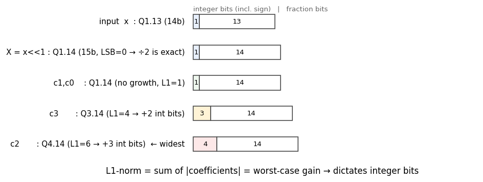
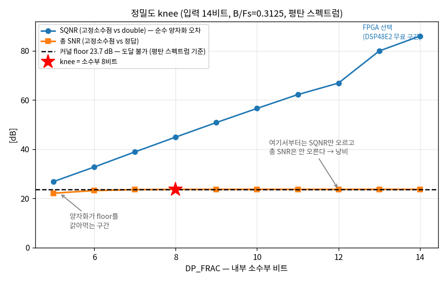
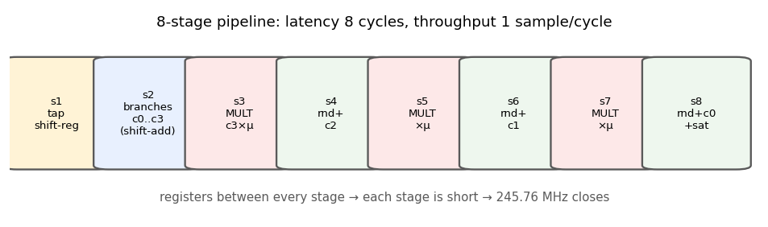

[1편](./catmull-rom-part1)에서 Catmull-Rom 보간기의 구조를 잡고 무한 정밀도(double) 기준 성능을 쟀다: interpolation SNR은 신호에 따라 15–31 dB(모뎀 RRC 신호 31 dB, 대역을 고르게 채운 신호 23.7 dB), linear 대비 일관되게 +10 dB. 이제 이걸 **진짜 하드웨어**로 만든다. 하드웨어는 double을 모른다 — 14비트, 18비트 같은 유한한 정수로 계산해야 하고, 그 순간부터 세 가지 질문이 쏟아진다.

:::note[2편에서 답할 세 질문]
1. **오버플로우가 절대 안 나려면 정수부가 몇 비트여야 하나?** → L1-norm 분석
2. **소수부는 몇 비트면 충분한가? 더 쓰면 낭비인가?** → knee(무릎) 분석
3. **어떻게 코딩해야 곱셈기 3개, 245 MHz가 나오나?** → 무곱셈 branch + 8-stage 파이프라인
:::

## 1. Q 포맷 — 정수로 소수를 표현하는 약속

하드웨어의 비트열은 그냥 정수다. 거기에 "소수점이 어디 있다고 치자"는 약속을 붙인 것이 **Q 포맷**이다.

:::note[Q 포맷 표기 읽는 법]
**Qm.n** = 정수부 m비트(부호 포함) + 소수부 n비트, 총 m+n비트. 예를 들어 **Q1.13**(14비트)은 표현 범위가 −1 – +0.9999이고, 한 눈금(LSB)이 2⁻¹³ ≈ 0.000122이다. 정수 8192를 Q1.13으로 읽으면 8192×2⁻¹³ = 1.0... 은 범위 밖이므로 실제로는 8191(=0.99988)이 최댓값이다. **LSB(Least Significant Bit)** 는 이 "최소 눈금 한 칸"을 뜻하며, 오차를 "몇 칸 틀렸나"로 재는 단위로도 쓴다.
:::

우리 보간기의 입력은 14비트 ADC 출력이므로 **Q1.13**으로 시작한다. 문제는 내부 연산이다. c₂ = x₋₁ − 2.5x₀ + 2x₁ − 0.5x₂ 같은 계산을 하다 보면 값이 입력보다 커질 수 있다. 얼마나 커질 수 있는지 모르면 두 가지 나쁜 선택지만 남는다 — 넉넉히 32비트로 잡아 자원을 낭비하거나, 대충 잡았다가 오버플로우로 신호가 깨지거나.

## 2. L1-norm — 정수부 비트를 "유도"하는 도구

값이 최악의 경우 얼마까지 커지는지는 계산으로 알 수 있다. 도구는 **L1-norm = 계수 절댓값의 합**이다.

원리는 단순하다. 입력이 [−1, +1] 범위라면, 출력의 최악 크기는 각 입력이 계수 부호와 정확히 맞아떨어져 **모든 항이 같은 방향으로 더해질 때**이고, 그 값이 곧 계수 절댓값의 합이다. branch별로 계산해 보자.

| branch | 수식 | L1 = Σ\|계수\| | 최악값 | 필요 정수부 |
|---|---|---|---|---|
| c₀ | x₀ | 1 | ±1 | 성장 없음 |
| c₁ | 0.5(x₁−x₋₁) | 0.5+0.5 = 1 | ±1 | 성장 없음 |
| c₃ | 1.5(x₀−x₁)+0.5(x₂−x₋₁) | 0.5+1.5+1.5+0.5 = **4** | ±4 | **+2비트** |
| c₂ | x₋₁−2.5x₀+2x₁−0.5x₂ | 1+2.5+2+0.5 = **6** | ±6 | **+3비트** |

가장 큰 c₂가 ±6까지 갈 수 있으므로 정수부 3비트(2³=8>6) + 부호 1비트 = **정수부 4비트가 강제**된다. 이건 취향이 아니라 산수다.



:::tip[X = x≪1 이라는 작은 트릭]
그림 두 번째 줄을 보면 입력을 곧바로 쓰지 않고 **1비트 왼쪽 shift(X = x≪1, Q1.14)** 해서 쓴다. 왜? 계수에 0.5가 많은데, ×0.5는 하드웨어에서 오른쪽 shift(≫1)다. 그런데 홀수를 ≫1 하면 반내림 오차가 생긴다. 미리 ≪1 해두면 **LSB가 항상 0이라 ≫1이 완전 무손실**이 된다. 소수부 1비트를 투자해 branch 전체를 오차 0으로 만드는 거래다. 그 결과 branch 4개의 계산에는 **반올림 오차가 전혀 없고**, 오차가 생기는 곳은 Horner의 곱셈 3곳뿐이다.
:::

:::note[이 편의 수치 기준]
1편과 마찬가지로 ✅측정 / ⚠️추정 / ❌미검증을 구분한다.

- ✅ **측정**: floor, knee, SQNR, 총 SNR, 최대 오차 — 전부 재현 코드로 확인됨
- ⚠️ **추정**: 곱셈기 3개, latency 8, ASIC 면적 절감률(비트폭 곱 기준 어림)
- ❌ **미검증**: Fmax 245.76 MHz, LUT/FF/DSP 실측치 — **Vivado 합성을 돌리지 않았다**

특히 마지막 항목은 이 글의 가장 큰 구멍이다. 하드웨어 수치는 전부 구조에서 유추한 목표치이고, 실제 합성 결과가 아니다.
:::

## 3. 소수부는 몇 비트? — knee(무릎) 분석

정수부는 4비트로 강제됐다. 소수부는? "많을수록 정확하다"는 맞지만, **얼마나 정확해야 하는지**를 먼저 알아야 한다. 여기서 1편의 측정이 기준선이 된다.

:::note[커널 왜곡 floor — 넘을 수 없는 천장]
4-tap 3차식은 무한히 긴 sinc를 완벽히 흉내 내지 못한다. 그래서 **비트를 아무리 늘려도 총 SNR이 절대 못 넘는 한계**가 있고, 이 한계를 **floor(바닥)** 라 부른다 — 오차 관점에서 줄일 수 없는 오차의 바닥이기 때문이다. 흐릿한 렌즈(커널)로 찍은 사진은 센서 화소(비트)를 아무리 올려도 렌즈 블러가 안 사라지는 것과 같다.
:::

:::tip[중요 — floor는 하나의 숫자가 아니다. 어떤 신호를 넣느냐에 달렸다]
1편에서 확인했듯 **같은 커널도 신호에 따라 다른 점수를 받는다**(B/Fs=0.3125 기준).

| 시험 신호 | floor | 성격 |
|---|---|---|
| 대역 끝 단일 톤 | 15 dB | 최악점 하나만 봄 |
| **대역을 고르게 채운 신호(평탄 스펙트럼)** | **23.7 dB** | **대역을 최대로 쓰는 실신호 = 보수적** |
| RRC 성형 모뎀 신호 | 31 dB | 대역 끝에 에너지가 적어 유리 |

**이 IP는 범용이므로 비트폭 설계에는 가장 보수적인 값을 써야 한다.** 사용자가 어떤 스펙트럼을 넣을지 모르기 때문이다. RRC의 31 dB로 knee를 잡으면, 대역을 고르게 채우는 신호(레이더 chirp, 오디오, 계측 등)를 넣는 사용자에게서 **양자화가 새 병목이 된다.**

그래서 **이하 모든 knee 분석은 평탄 스펙트럼(floor 23.7 dB) 기준**이다. 모뎀처럼 유리한 신호만 쓸 것이 확실하다면 비트를 1–2개 줄일 여지가 있지만, IP 기본값은 안전한 쪽으로 잡는다.
:::

그렇다면 소수부 비트의 목표는 명확해진다: **양자화 오차를 floor보다 충분히(15–20 dB) 아래에 묻는 것.** 그 이상은 낭비다. 소수부 비트를 5부터 14까지 스윕하며 실측한 결과가 아래 그림이다.



세 곡선의 관계가 이 그림의 전부다.

- **파란 곡선(SQNR)**: 고정소수점 결과 vs double 결과의 차이, 즉 **순수 양자화 오차만** 본 것. 비트당 약 6 dB씩 꾸준히 오른다(1비트 = 2배 = 6 dB).
- **검은 점선(floor 23.7 dB)**: 커널 한계. 도달 불가능한 천장.
- **주황 곡선(총 SNR)**: 고정소수점 결과 vs 진짜 정답. 양자화 오차와 커널 오차가 **합쳐진** 값이라, **비트를 늘려도 floor에 붙은 채 평평해진다.**

주황 곡선이 floor에 달라붙는 지점, 즉 **빨간 별(knee, 소수부 8비트)** 이 답이다. 실측값으로 보면 명확하다.

| 소수부 | SQNR | 총 SNR | floor 대비 손실 |
|---|---|---|---|
| 5 | 26.9 dB | 22.1 dB | **−1.57 dB** ← 양자화가 성능을 갉아먹음 |
| 6 | 32.8 dB | 23.2 dB | −0.48 dB |
| 7 | 38.9 dB | 23.6 dB | −0.11 dB |
| **8** | **45.0 dB** | **23.68 dB** | **−0.03 dB** ← knee |
| 9 | 50.9 dB | 23.70 dB | −0.01 dB |
| 12 | 66.9 dB | 23.71 dB | 0.00 dB ← 여기부터 순수 낭비 |
| 14 | 86.0 dB | 23.71 dB | 0.00 dB |

8비트 왼쪽은 양자화가 floor를 갉아먹어 성능이 무너지고, 오른쪽은 SQNR만 오를 뿐 **총 SNR은 0.03 dB도 안 변한다** — 순수한 낭비다.

:::tip[knee 위치를 공식으로 — 그리고 knee는 B의 함수다]
그림에서 SQNR은 비트당 약 6 dB씩 오른다(실측 회귀: 약 5.8×frac − 1.7). "양자화 오차를 floor보다 18 dB 아래에 묻는다"는 기준을 적용하면 어림 공식이 나온다.

$$\text{필요 소수부} \approx \frac{\text{floor} + 18}{6}$$

여기서 **1편의 B/Fs가 다시 등장한다. floor는 신호 대역폭 B의 함수**이므로(대역을 덜 쓸수록 커널이 정확해져 floor가 올라감), knee도 B의 함수다. 평탄 스펙트럼 기준으로 실측하면:

| B/Fs | floor (실측) | 공식 예측 | **실측 knee** |
|---|---|---|---|
| 0.3125 (2 sps 상당) | 23.7 dB | 7.0 | **8비트** |
| 0.156 (4 sps 상당) | 44.8 dB | 10.5 | **11비트** |
| 0.05 (10배 오버샘플) | 74.7 dB | 15.4 | **15비트** |

공식은 실측을 **1비트 이내로** 맞힌다. 설계 초기 어림잡기에는 충분하지만, **최종 비트폭은 반드시 실측으로 확정해야 한다** — 공식이 항상 보수적인 쪽으로 틀리는 것도 아니기 때문이다(B=0.05에서는 오히려 0.4비트 높게 예측한다).

이 표에서 직관과 반대인 결론이 나온다. **커널이 좋아질수록(=대역을 덜 쓸수록) 비트가 더 필요하다.** 양자화가 새 병목이 되지 않도록 따라 올라가야 하기 때문이다. 그래서 범용 IP의 올바른 납품 형태는 "비트폭이 박힌 RTL"이 아니라 **"비트폭이 파라미터인 RTL + B를 넣으면 비트폭이 나오는 공식"** 한 세트다. 이 설계가 모든 폭을 파라미터로 열어둔 이유가 이것이다.
:::

### 그런데 최종 선택은 Q4.14다 — 왜?

knee가 8인데 왜 14를 쓰나? **비용이 공짜이기 때문**이다. FPGA의 곱셈기(Xilinx DSP48E2)는 27×18비트 고정 하드웨어다. 피연산자가 18비트 이하인 한, 10비트를 넣든 18비트를 넣든 **DSP 1개, 비용 동일**이다. 그렇다면 포트를 꽉 채워 마진을 공짜로 가져가는 게 맞다: 정수부 4 + 소수부 14 = 18비트 = **Q4.14**.

| 플랫폼 | 비용 구조 | 최적 선택 | 근거 |
|---|---|---|---|
| FPGA (DSP48E2) | 18비트까지 계단식(평평) | **Q4.14** | 같은 비용에서 최대 마진(SQNR 86 dB) |
| ASIC | 비트 수에 선형 | **Q4.9** (knee 8 + 안전 1비트) | 곱셈기 면적 약 48% 절감 (18×18 → 13×13) |

같은 knee 분석에서 플랫폼별로 다른 답이 나온다는 것 — 이것이 "비트폭을 외운 게 아니라 유도했다"의 실체다.

## 4. RTL 코딩 스킴

이제 코드다. 전체 골격은 세 가지 결정으로 요약된다: **① branch는 shift-add로(곱셈기 0개), ② Horner만 DSP로(3개), ③ 전체를 8단 파이프라인으로.**

### 4-1. 곱셈기 없는 branch — 계수가 예쁜 덕분에

1편에서 봐두라고 한 계수들(0.5, 1.5, 2, 2.5)이 여기서 빛난다. 전부 2의 거듭제곱 조합이라 shift와 덧셈만으로 처리된다. shift는 하드웨어에서 배선을 비스듬히 연결하는 것뿐이라 **비용이 0**이다.

```systemverilog
// X* : Q1.14, LSB=0 이므로 >>> 1 (÷2) 이 완전 무손실
wire signed [CW-1:0] dd = CW'(x0_q) - CW'(x1_q);
always_ff @(posedge clk) if (en) begin
    c0_s2 <= CW'(x0_q);                                     // c0 = x0
    c1_s2 <= (CW'(x1_q) - CW'(xm1_q)) >>> 1;                // c1 = 0.5(x1-xm1)
    c2_s2 <= CW'(xm1_q) - (CW'(x0_q) <<< 1) - (CW'(x0_q) >>> 1)
                        + (CW'(x1_q) <<< 1) - (CW'(x2_q) >>> 1);
                         // c2 = xm1 - 2x0 - 0.5x0 + 2x1 - 0.5x2  (2.5x0 를 2x0+0.5x0 로 분해)
    c3_s2 <= dd + (dd >>> 1) + ((CW'(x2_q) - CW'(xm1_q)) >>> 1);
                         // c3 = 1.5(x0-x1) + 0.5(x2-xm1)  (1.5d = d + 0.5d)
end
```

- `<<< 1`은 ×2, `>>> 1`은 ×0.5(부호 유지 산술 shift)다. ×2.5는 `(x<<<1)+(x>>>1)`, ×1.5는 `d+(d>>>1)`로 분해했다.
- `CW'( )`는 폭 맞춤 캐스팅이다. CW는 L1 분석이 강제한 폭(정수부 4 + 소수부 14 = 18비트)으로, 이 폭 안에서는 위 연산이 절대 오버플로우하지 않음이 **2장에서 수학적으로 보장**되어 있다.

만약 계수가 0.7, 1.3 같은 임의 실수였다면 branch에만 곱셈기 12개가 더 필요했을 것이다. **Catmull-Rom을 고른 하드웨어적 이유가 바로 이 절감**이다.

### 4-2. Horner 3곱 — 반올림은 단마다 한 번

```systemverilog
// round-half-up: 소수부 (14+18) -> 14 로 줄이면서 반올림
function automatic logic signed [CW-1:0] rnd (input logic signed [PW-1:0] p);
    logic signed [PW-1:0] t;
    t   = p + (1 <<< (MU_W-1));   // 0.5 LSB 를 더하고
    rnd = CW'(t >>> MU_W);        // 잘라내면 = 반올림
endfunction
```

μ(Q0.18)와의 곱은 소수부가 14+18=32비트로 불어나므로, 매 단 18비트를 잘라 14비트로 되돌린다. 그냥 자르면(버림) 오차에 치우침(bias)이 생기므로, **0.5 LSB를 먼저 더하고 자르는 반올림(round-half-up)** 을 쓴다. 이 반올림이 파이프라인 전체에서 딱 3곳(Horner 각 단)이고, 그래서 최종 오차가 최대 1.3 LSB(단당 0.5 LSB의 누적·전파)로 예측 범위에 들어온다 — 이 숫자가 예측과 맞는 것 자체가 구현이 건강하다는 sanity check다.

### 4-3. 8-stage 파이프라인 — 245.76 MHz의 비결



전체 계산(branch + 곱셈 3 + 덧셈 3)을 한 클럭에 하려면 그 긴 경로가 4.07 ns(245.76 MHz의 주기) 안에 끝나야 하는데 불가능하다. 그래서 연산을 8덩이로 쪼개고 사이마다 레지스터를 넣는다. 클럭 주파수는 **가장 긴 한 단**이 결정하므로, 단을 짧게 쪼갤수록 빨라진다.

대가는 **latency 8클럭** — 첫 입력의 결과가 8클럭 뒤에 나온다. 하지만 컨베이어 벨트처럼, 파이프가 차고 나면 **매 클럭 결과가 하나씩** 나온다(throughput 1 sample/cycle). 245.76 MHz × 1 = 245.76 MSPS.

:::note[latency 8이 공짜가 아닌 이유]
스트리밍 응용(샘플레이트 변환, 지연 정렬)에서 latency 8클럭은 대개 무해하다. 조심할 곳은 **μ가 출력의 피드백으로 만들어지는 폐루프 응용**(타이밍 복구, 적응 지연 추적 등)이다. 이때 보간기의 latency는 곧 루프 지연이 되어 루프의 위상 마진(안정성)을 깎는다. 대표 예제인 STR이라면 루프 대역폭 Bn·T=0.005 수준에서 루프 시상수가 약 100샘플이라 8클럭은 문제없지만, "파이프라인 깊게 = Fmax↑, 루프 안정성↓"라는 긴장은 항상 존재한다. 8단은 이 절충의 결과이며, Fmax가 부족하면 곱셈 단을 쪼개 10 – 11단으로, 루프를 빠르게 돌려야 하면 단을 줄이는 식으로 조절한다. **범용 IP의 데이터시트에 latency를 반드시 명기해야 하는 이유**가 이것이다 — 어떤 사용자에게는 그냥 지연이지만, 어떤 사용자에게는 안정성 파라미터다.
:::

### 4-4. 마무리 디테일 — saturation과 guard bit

출력단에는 **saturation(포화)** 을 둔다. Catmull-Rom은 negative lobe 때문에 입력 범위를 살짝 넘는 overshoot(최대 ×1.25)이 가능하므로, 출력 포맷 Q2.14로 정수부 여유를 주고 그래도 넘으면 최댓값에 고정한다.

그리고 실전에서 만난 버그 하나. 내부 정밀도를 입력보다 낮게 잡는 구성(ASIC의 Q4.9)에서는 입력을 **반올림으로 재양자화**하는데, +최대값 근처 입력이 반올림되며 **정확히 +1.0**이 되는 경우가 있었다. Q1.9는 +1.0을 표현 못 하므로 −1.0으로 wrap되는 버그 — 2만 벡터 중 171건, 특정 구성에서만 발현됐다. 해법은 guard bit 1개 추가. 이 버그는 랜덤 벡터가 아니라 **±full-scale 코너 벡터**가 잡아냈다. corner-directed 검증이 밥값을 하는 순간이다.

## 5. 검증 — "골든 모델과 bit-match"의 실체

고정소수점 RTL의 검증 목표는 명확하다: **MATLAB 모델과 비트 하나까지 같은가.** 그러려면 MATLAB 모델이 RTL과 **동일한 산술**(같은 shift, 같은 반올림, 같은 포화)을 정수 단위로 수행해야 한다. 이를 bit-accurate 모델이라 한다.

```matlab
function y_int = catmull_rom_fxp_v2(x_i, mu_i, P)
% x_i: Q1.13 정수 스트림, mu_i: Q0.18 정수 스트림
sh = P.DP_FRAC - (P.IN_W-1);
if sh>=0, X = x_i .* 2^sh;                          % 좌shift = 무손실
else,     X = floor((x_i + 2^(-sh-1)) ./ 2^(-sh));  % 재양자화 = 반올림
end
shr = @(v) floor(v/2);                              % RTL의 >>> 1 과 동일
rnd = @(p) floor((p + 2^(P.MU_W-1)) ./ 2^P.MU_W);   % RTL의 rnd() 와 동일
c0 = X0;  c1 = shr(X1-Xm1);
c2 = Xm1 - 2*X0 - shr(X0) + 2*X1 - shr(X2);
d = X0-X1;  c3 = d + shr(d) + shr(X2-Xm1);
y = rnd((rnd((rnd(c3.*m)+c2).*m)+c1).*m) + c0;
y_int = min(max(y, -2^(P.OUT_W-1)), 2^(P.OUT_W-1)-1);  % saturation
end
```

`floor(v/2)`가 RTL의 `>>> 1`과, `floor((p+2^17)/2^18)`이 RTL의 `rnd()`와 정확히 같은 정수 연산임에 주목하자. 이 함수가 벡터 파일(입력, μ, 기대 출력)을 만들고, SystemVerilog testbench가 같은 입력을 RTL에 넣어 출력을 한 줄씩 비교한다.

검증 매트릭스는 파라미터 조합별로 돌렸다.

| 구성 | IN_W / DP_FRAC / MU_W / OUT_W | 찌르는 경로 | 결과 |
|---|---|---|---|
| FPGA 포인트 | 14 / 14 / 18 / 16 | 좌shift 경로 | 19,997 벡터 mismatch 0 |
| ASIC knee | 14 / 9 / 12 / 11 | **반올림 재양자화** (버그 잡힌 곳) | mismatch 0 |
| 경계 | 12 / 11 / 15 / 13 | shift=0 경계 | mismatch 0 |
| 교차 검증 | 14 / 9 / 12 / 11 | MATLAB이 만든 벡터 vs RTL | mismatch 0 |

벡터에는 랜덤 외에 **코너**를 명시적으로 심었다: ±full-scale의 L1 최악 부호 패턴(+,−,+,−), μ ∈ {0, 최대, 0.5, 1 LSB}. 4-4의 guard bit 버그를 잡은 것이 바로 이 코너들이다.

:::tip[5분짜리 sanity check 두 개]
거창한 검증 전에 수학이 보장하는 성질부터 확인하면 코드 정합성이 즉시 드러난다. **① μ=0이면 출력=x₀** (커널 성질 K(0)=1, K(정수)=0에서 필연) — 안 맞으면 코드가 틀린 것이다. **② 커널의 DC gain=1** (모든 μ에서 tap 합이 1) — 보간이 평균 레벨을 보존한다는 뜻. 이 둘은 어떤 보간기 구현에도 통하는 만능 체크다.
:::

## 6. 최종 성적표

| 분류 | 지표 | 값 |
|---|---|---|
| 알고리즘 (1편) | interpolation SNR / linear 대비 | 23.7 dB(평탄) – 31 dB(RRC) / +10 dB |
| 고정소수점 | SQNR (Q4.14) / 최대 오차 | 86 dB / 1.3 LSB |
| 고정소수점 | floor 대비 마진 | 약 62 dB (양자화는 병목 아님) |
| 비트폭 | FPGA / ASIC 최적점 | Q4.14 / Q4.9 (곱셈기 면적 약 48% 절감) |
| 하드웨어 | 곱셈기 / 메모리 | DSP 3개 / BRAM 0개 |
| 하드웨어 | latency / throughput | 8 cycles / 1 sample/cycle (245.76 MSPS) |
| 검증 | bit-match | 4개 구성 × 2만 벡터, mismatch 0 |

## 7. 맺으며 — 이 설계에서 이식 가능한 것들

Catmull-Rom 보간기 자체보다, 이 과정에서 쓴 **사고 틀**이 다른 설계에 그대로 이식된다.

1. **L1-norm으로 정수부 유도** — 어떤 고정 계수 필터든 "계수 절댓값 합"이 최악 이득이고, 그것이 정수부를 강제한다. FFT butterfly든 FIR이든 같다.
2. **floor를 먼저 재고 knee를 찾기** — 비트폭의 기준점은 절대적 SQNR이 아니라 "시스템의 지배 오차원 대비 상대 거리"다. 지배 오차원(커널, 채널 잡음, ADC...)을 먼저 찾고 그보다 15–20 dB 아래에 양자화를 묻는다. **그리고 범용 IP라면 그 floor는 가장 보수적인 신호로 재야 한다** — 유리한 신호로 재면 다른 사용자에게서 양자화가 병목이 된다.
3. **비용 곡선이 최적점을 정한다** — 같은 성능 분석에서 FPGA(계단 비용)와 ASIC(선형 비용)의 답이 달라진다. 최적화는 목적함수와 제약을 명시해야 성립한다.
4. **bit-accurate 모델과 코너 벡터** — "많이 돌렸다"보다 "어떤 경로를 찔렀다"가 검증이다. guard bit 버그는 랜덤 2만 개가 아니라 코너 8개가 잡았다.

이렇게 완성된 것은 특정 모뎀의 부속품이 아니라, **B/Fs와 플랫폼만 알려주면 어디든 인스턴스할 수 있는 범용 fractional-delay IP**다 — 샘플레이트 변환기의 코어로, 빔포머의 지연 정렬로, 파형 재생기의 위상 보간으로. 다음 단계로는 대표 예제를 끝까지 밀어붙여 보려 한다: Gardner timing error detector와 PI loop filter, NCO를 붙여 **폐루프 Symbol Timing Recovery**를 완성하면, 이 IP가 폐루프 안에서 어떻게 동작하는지(잔류 jitter, acquisition time, 구현 손실)라는 시스템 레벨 지표가 나온다. 그 이야기는 다음 시리즈에서.