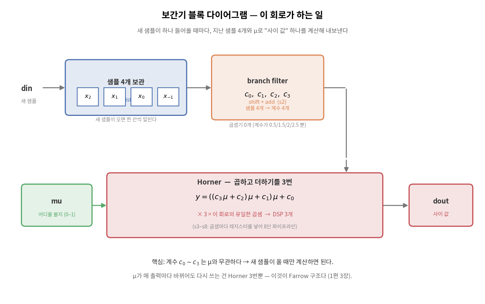
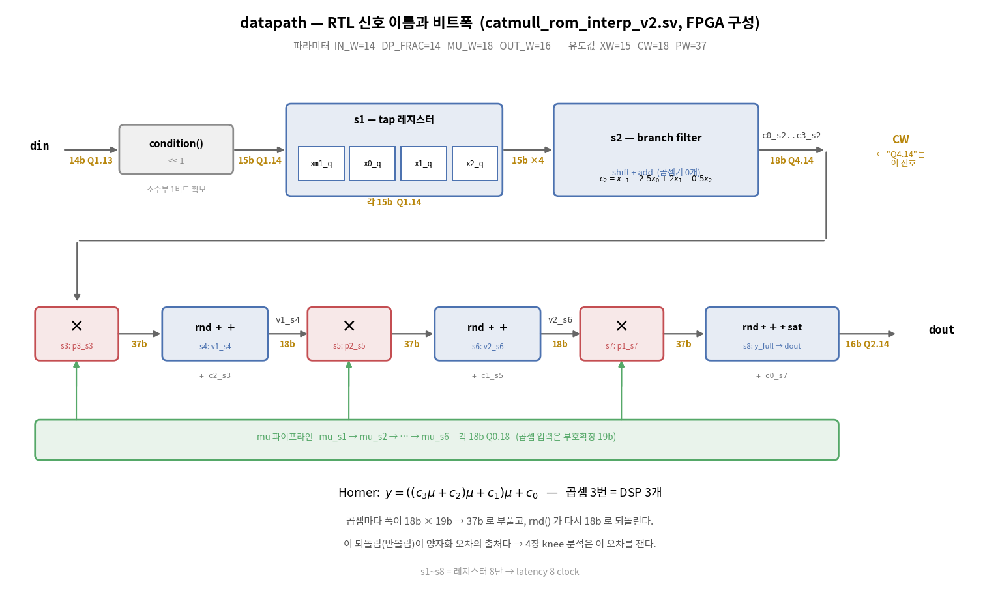
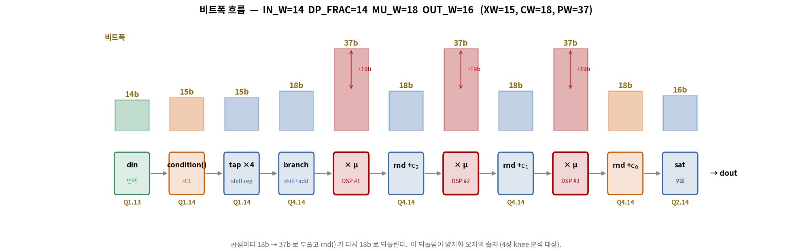
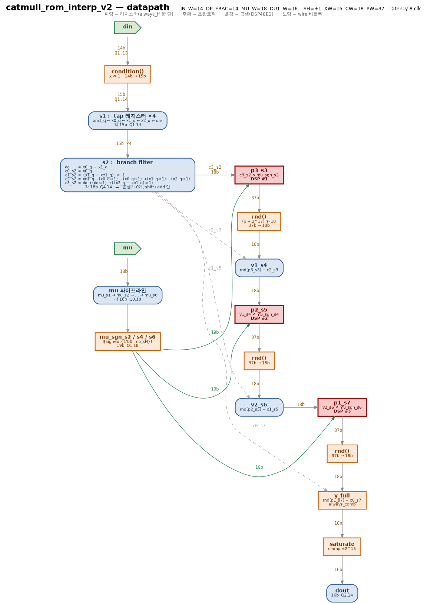
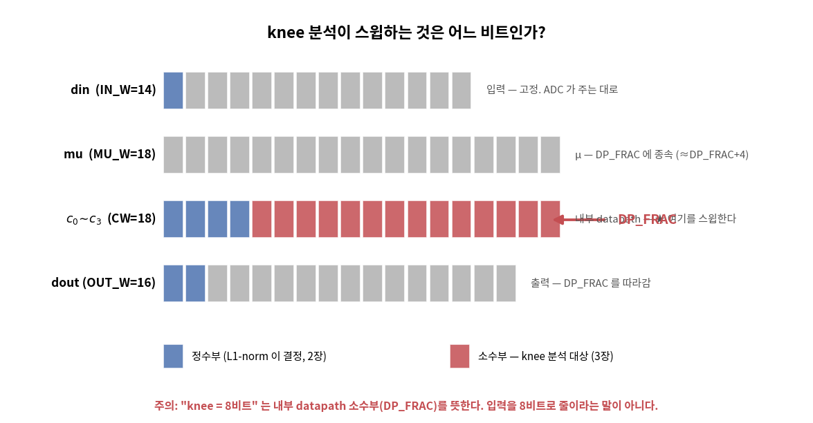

[1편](./catmull-rom-part1)에서 Catmull-Rom 보간기의 구조를 잡고 무한 정밀도(double) 기준 성능을 쟀다: interpolation SNR은 신호에 따라 15–31 dB(모뎀 RRC 신호 31 dB, 대역을 고르게 채운 신호 23.7 dB), linear 대비 일관되게 +10 dB. 이제 이걸 **진짜 하드웨어**로 만든다. 하드웨어는 double을 모른다 — 14비트, 18비트 같은 유한한 정수로 계산해야 하고, 그 순간부터 세 가지 질문이 쏟아진다.

:::note[2편에서 답할 세 질문]
1. **오버플로우가 절대 안 나려면 정수부가 몇 비트여야 하나?** → L1-norm 분석 (3장)
2. **소수부는 몇 비트면 충분한가? 더 쓰면 낭비인가?** → knee(무릎) 분석 (4장)
3. **어떻게 코딩해야 곱셈기 3개, 245 MHz가 나오나?** → 무곱셈 branch + 8-stage 파이프라인 (5장)

그리고 그 답이 맞았는지 **Vivado로 합성해 확인한다** (7장). 거기서 어림 하나가 틀렸다는 것도 드러난다.
:::

## 1. 먼저 — 이 회로가 뭘 하는가

비트 이야기를 하기 전에 **무엇을 만드는지**부터 그림으로 못 박자. 1편의 수식을 회로로 옮기면 이렇게 생겼다.



읽는 법은 왼쪽 위에서 오른쪽 아래로다.

| 블록 | 하는 일 |
|---|---|
| **shift register** | 최근 샘플 **4개**($x_{-1}, x_0, x_1, x_2$)를 들고 있는다. 새 샘플이 오면 한 칸씩 밀린다 |
| **branch filter** | 그 4개로 계수 4개를 만든다: $c_2 = x_{-1} - 2.5x_0 + 2x_1 - 0.5x_2$ 등. **곱셈기가 없다** — 계수가 0.5/1.5/2/2.5 뿐이라 shift와 add로 끝난다 |
| **Horner** | $y = ((c_3\mu + c_2)\mu + c_1)\mu + c_0$ 를 계산한다. **μ를 곱하는 3번이 이 회로의 유일한 곱셈**이다 |
| **mu** | "지금 샘플 사이 어디를 볼 것인가"(0–1). 매 출력마다 바뀔 수 있다 |

**핵심은 계수 $c_0 \sim c_3$ 에 μ가 없다는 것**이다. 그래서 새 샘플이 올 때만 계산하면 되고, μ가 아무리 자주 바뀌어도 다시 하는 건 Horner 3번뿐이다. 이게 1편 3장에서 유도한 Farrow 구조다.

이제 질문은 하나로 좁혀진다. **이 블록들 사이를 흐르는 숫자를 몇 비트로 나를 것인가?**

## 2. Q 포맷 — 정수로 소수를 표현하는 약속

하드웨어의 비트열은 그냥 정수다. 거기에 "소수점이 어디 있다고 치자"는 약속을 붙인 것이 **Q 포맷**이다.

:::note[Q 포맷 표기 읽는 법]
**Qm.n** = 정수부 m비트(부호 포함) + 소수부 n비트, 총 m+n비트. 예를 들어 **Q1.13**(14비트)은 표현 범위가 −1 – +0.9999이고, 한 눈금(LSB)이 2⁻¹³ ≈ 0.000122이다. 정수 8192를 Q1.13으로 읽으면 8192×2⁻¹³ = 1.0... 은 범위 밖이므로 실제로는 8191(=0.99988)이 최댓값이다. **LSB(Least Significant Bit)** 는 이 "최소 눈금 한 칸"을 뜻하며, 오차를 "몇 칸 틀렸나"로 재는 단위로도 쓴다.
:::

### 같은 회로에 비트폭을 적으면

1장 블록도의 각 블록을 RTL 신호 이름으로 바꾸고, **선마다 비트폭을 적은 것**이 아래 그림이다. 설계 문서에서 datapath를 다룰 때 보통 이 형태로 그린다.



1장 블록도와 하나씩 대응된다.

| 1장 블록도 | 이 그림 | RTL 신호 |
|---|---|---|
| 샘플 4개 보관 | s1 — tap 레지스터 | `xm1_q, x0_q, x1_q, x2_q` |
| branch filter | s2 — branch filter | `c0_s2`–`c3_s2` |
| Horner ×3 | s3–s8 (곱셈 ×3 + rnd·add ×3) | `p3_s3, v1_s4, p2_s5, v2_s6, p1_s7, y_full` |
| — (블록도엔 없던 것) | **condition()** | 입력 Q1.13 → 내부 Q1.14 (소수부 1비트 확보) |

블록도에 없던 **`condition()`** 하나만 짚고 가자. 입력 Q1.13을 내부 Q1.14로 바꾸는 함수다. FPGA 구성에서는 `<<1` 한 줄이라 배선일 뿐 게이트도 안 쓴다.

```systemverilog
function automatic logic signed [XW-1:0] condition (input logic signed [IN_W-1:0] v);
    if (SH >= 0) condition = XW'(v) <<< SH;              // 늘리거나 그대로 (무손실)
    else begin
        t = {v[IN_W-1], v} + (1 <<< (-SH-1));            // 줄일 땐 반올림
        condition = XW'(t >>> (-SH));
    end
endfunction
```

:::tip[왜 1비트를 늘리나 — `>>1`을 무손실로 만들기 위해서다]
**모든 계수가 1/2의 배수**라는 데서 출발한다.

$$c_1 = \tfrac{1}{2}(x_1 - x_{-1}), \qquad c_2 = x_{-1} - \tfrac{5}{2}x_0 + 2x_1 - \tfrac{1}{2}x_2, \qquad c_3 = \tfrac{3}{2}(x_0-x_1) + \tfrac{1}{2}(x_2-x_{-1})$$

하드웨어에서 ×0.5는 `>>1`이다. 그런데 **홀수를 `>>1` 하면 LSB가 날아간다.**

```
Q1.13 그대로 :  8191 >> 1 = 4095      (정답 4095.5)  -> 0.5 손실
<<1 해두면   : 16382 >> 1 = 8191      (정확)         -> 손실 0
```

미리 `<<1` 해두면 **LSB가 항상 0**이므로 `>>1`이 **무손실**이 된다. 소수부 비트 1개를 투자해 **branch filter 전체를 오차 0으로 만드는 거래**다.

실제로 20만 샘플로 두 방식의 계수 오차를 재보면(Q1.13 LSB 단위):

| 계수 | `<<1` 함 (현재) | `<<1` 안 함 |
|---|---|---|
| $c_1$ | **최대 0, 평균 0** | 최대 0.50, 평균 **−0.25** |
| $c_2$ | **최대 0, 평균 0** | 최대 1.00, 평균 **+0.50** |
| $c_3$ | **최대 0, 평균 0** | 최대 1.00, 평균 **−0.50** |

`<<1`을 안 하면 **Horner가 시작하기도 전에 계수가 이미 틀려 있고, 편향까지 있다.** 뒤에서 아무리 정교하게 반올림해도 못 되돌린다.

**내부 포맷 Q1.14는 원인이 아니라 결과다.** "`>>1`을 정확히 하겠다"는 결정이 먼저고, `SH=+1`도 `condition()`의 `<<1`도 전부 거기서 따라 나왔다.

**이것이 1편에서 "계수가 예쁘다"고 한 것의 두 번째 배당금**이다. 첫째는 곱셈기가 사라진 것(5-1), 둘째는 **1비트만 더 주면 그 shift-add가 정확해진다**는 것이다. Lagrange의 1/6 같은 계수였다면 어떤 유한 비트로도 정확해지지 않는다.
:::

### 비트폭만 따라가면

세부를 걷어내고 **폭이 어떻게 변하는지만** 보면 이렇다.



$$14 \to 15 \to 18 \to \mathbf{37} \to 18 \to \mathbf{37} \to 18 \to \mathbf{37} \to 18 \to 16$$

**패턴이 하나뿐이다.** 곱셈마다 18b가 37b로 부풀고, `rnd()`가 다시 18b로 되돌린다. 그게 3번 반복된다.

**이 되돌림이 이 글의 핵심**이다. 37비트를 18비트로 자를 때 버리는 19비트가 곧 양자화 오차이고, 4장의 knee 분석이 재는 것이 바로 이 오차다. `DP_FRAC`을 바꾼다는 건 이 그림의 **18b를 몇 비트로 할 것인가**를 정하는 일이다.

### 전체 회로도 — 이것만 보고 구현할 수 있게

폭을 봤으니 이제 세부다. **RTL의 `always_ff` 문장을 하나도 빠짐없이 옮기면** 아래가 된다. 신호 이름, 각 단에서 실제로 계산하는 식이 전부 들어 있다. (스크롤이 필요하니 필요할 때 펼쳐 보면 된다.)



읽는 법:

- **파랑 = 레지스터** (`always_ff` 한 단). 파랑 상자를 지날 때마다 latency가 1클럭 는다
- **주황 = 조합 로직** (레지스터 없이 즉시 계산). `condition()`, `rnd()`, `y_full`, `saturate`
- **빨강 = 곱셈** → DSP48E2 3개. 이 회로의 유일한 곱셈이다
- **노란 라벨 = wire 비트폭.** `18b` → `37b` → `18b` 로 부풀었다 줄어드는 게 보인다
- **회색 점선 = 지연만 되는 신호.** `c0_s2`는 아무 계산 없이 s7까지 흘러가 마지막 덧셈에서 쓰인다

각 상자 안의 식이 RTL 그대로다. 예를 들어 `c2_s2` 상자의

```
xm1_q − (x0_q<<1) − (x0_q>>1) + (x1_q<<1) − (x2_q>>1)
```

는 RTL의 이 문장이다.

```systemverilog
c2_s2 <= CW'(xm1_q) - (CW'(x0_q) <<< 1) - (CW'(x0_q) >>> 1)
                    + (CW'(x1_q) <<< 1) - (CW'(x2_q) >>> 1);
```

`mu` 파이프라인이 따로 있는 이유도 보인다. **곱셈이 s3, s5, s7 세 곳에서 일어나는데 각각 다른 시점의 μ가 필요**하므로, μ를 레지스터로 지연시켜 타이밍을 맞춘다. `c0_s2`가 s7까지 그대로 흘러가는 것도 같은 이유다 — Horner의 마지막 덧셈에서야 쓰인다.

### 신호별 비트폭 — 표로

같은 내용을 표로 옮기면 이렇다. **RTL의 선언을 그대로 따온 것**이라 코드와 1:1로 대조할 수 있다.

| RTL 신호 | 단계 | 폭 | Q 포맷 | 무엇 |
|---|---|---|---|---|
| `din` | 입력 포트 | **14b** | Q1.13 | ADC 샘플 |
| `condition(din)` | s1 조합 | 15b | Q1.14 | 소수부 1비트 확보 (`SH=+1`, `<<1`) |
| `xm1_q, x0_q, x1_q, x2_q` | s1 레지스터 | 각 15b | Q1.14 | 탭 4개 (`XW`) |
| `mu` | 입력 포트 | **18b** | Q0.18 | 보간 위치 |
| `c0_s2`–`c3_s2` | s2 레지스터 | **18b** | **Q4.14** | branch 출력 (`CW`) |
| `mu_sgn_s2` | s2 조합 | 19b | Q1.18 | μ 부호확장 (곱셈용) |
| `p3_s3` | s3 레지스터 | 37b | Q5.32 | `c3 × mu` (`PW`) |
| `v1_s4` | s4 레지스터 | 18b | Q4.14 | `rnd(p3) + c2` |
| `p2_s5` | s5 레지스터 | 37b | Q5.32 | `v1 × mu` |
| `v2_s6` | s6 레지스터 | 18b | Q4.14 | `rnd(p2) + c1` |
| `p1_s7` | s7 레지스터 | 37b | Q5.32 | `v2 × mu` |
| `y_full` | s8 조합 | 18b | Q4.14 | `rnd(p1) + c0` |
| `dout` | s8 레지스터 | **16b** | Q2.14 | 포화 후 출력 (`OUT_W`) |

**패턴이 보인다.** 곱하면 37비트로 부풀고(`p3_s3`), 반올림하면 18비트로 돌아온다(`v1_s4`). 이게 3번 반복된다. **이 되돌림에서 생기는 오차가 4장 knee 분석의 대상**이다.

### 우리가 정할 수 있는 건 하나뿐

위 표의 폭들은 전부 **파라미터 4개에서 자동으로 계산**된다.

| 파라미터 | 어디 | FPGA | ASIC | 누가 정하나 |
|---|---|---|---|---|
| `IN_W` | `din` | 14 | 14 | **못 정한다** — ADC가 준다 |
| **`DP_FRAC`** | **내부 소수부** | **14** | **9** | **← 4장의 주제** |
| `MU_W` | `mu` | 18 | 12 | DP_FRAC 따라감 |
| `OUT_W` | `dout` | 16 | 11 | 응용이 요구 |

| 유도값 | 식 | FPGA | ASIC |
|---|---|---|---|
| `SH` | `DP_FRAC − (IN_W−1)` | +1 (늘림) | −4 (줄임, 반올림) |
| `XW` | `DP_FRAC + 1 (+1 if SH<0)` | 15 | 11 |
| `CW` | `XW + 3` | **18** | **14** |
| `PW` | `CW + MU_W + 1` | 37 | 27 |

`CW = XW + 3`의 **+3을 어떻게 구했는지가 3장의 주제**다. `SH < 0`(ASIC)에서 입력을 반올림해 줄일 때 5-4의 guard bit 버그가 나온다.

:::tip["Q4.14"는 `c0_s2`–`c3_s2` 를 가리킨다]
이 글의 Q 포맷은 전부 다른 신호를 가리키니 헷갈리기 쉽다.

| 표기 | RTL 신호 | 폭 |
|---|---|---|
| Q1.13 | `din` | 14b |
| Q0.18 | `mu` | 18b |
| **Q4.14** | **`c0_s2`–`c3_s2` (내부 datapath)** | **18b** |
| Q2.14 | `dout` | 16b |

**입력 폭과 내부 정밀도는 별개다.** 14비트 ADC를 받으면서 내부를 9비트로 계산할 수 있고(ASIC 구성), 그 변환을 `condition()`이 한다.
:::

문제는 내부다. $c_2 = x_{-1} - 2.5x_0 + 2x_1 - 0.5x_2$ 같은 계산을 하다 보면 값이 입력보다 커질 수 있다. 얼마나 커질 수 있는지 모르면 두 가지 나쁜 선택지만 남는다 — 넉넉히 32비트로 잡아 자원을 낭비하거나, 대충 잡았다가 오버플로우로 신호가 깨지거나.

## 3. L1-norm — 정수부 비트를 "유도"하는 도구

값이 최악의 경우 얼마까지 커지는지는 계산으로 알 수 있다. 도구는 **L1-norm = 계수 절댓값의 합**이다.

원리는 단순하다. 입력이 [−1, +1] 범위라면, 출력의 최악 크기는 각 입력이 계수 부호와 정확히 맞아떨어져 **모든 항이 같은 방향으로 더해질 때**이고, 그 값이 곧 계수 절댓값의 합이다. branch별로 계산해 보자.

| branch | 수식 | L1 = Σ\|계수\| | 최악값 | 필요 정수부 |
|---|---|---|---|---|
| c₀ | x₀ | 1 | ±1 | 성장 없음 |
| c₁ | 0.5(x₁−x₋₁) | 0.5+0.5 = 1 | ±1 | 성장 없음 |
| c₃ | 1.5(x₀−x₁)+0.5(x₂−x₋₁) | 0.5+1.5+1.5+0.5 = **4** | ±4 | **+2비트** |
| c₂ | x₋₁−2.5x₀+2x₁−0.5x₂ | 1+2.5+2+0.5 = **6** | ±6 | **+3비트** |

가장 큰 c₂가 ±6까지 갈 수 있으므로 정수부 3비트(2³=8>6) + 부호 1비트 = **정수부 4비트가 강제**된다. 이건 취향이 아니라 산수다.

:::note[지금까지 정해진 것 — 그리고 남은 것]
내부 한 숫자의 비트를 **정수부 + 소수부**로 나눠 보면, 지금 절반이 정해졌다.

```
     정수부          소수부
   ┌────────┐  ┌──────────────┐
Q  4 비트    .  ??? 비트
   └────────┘  └──────────────┘
    L1-norm이       아직 안 정함
    강제 (이 장)     → 4장 knee 분석
```

- **정수부 4비트**: L1-norm이 **유도**했다. 오버플로우가 안 나는 최소값이라 선택의 여지가 없다.
- **소수부 ??? 비트**: 아직 미정. 많을수록 정확하지만 비트를 더 쓴다. 최적점을 4장에서 찾는다.

이 둘이 합쳐지면 내부 한 숫자의 폭 `CW`가 완성된다.
:::


그림 두 번째 줄의 **X = x≪1** 은 2장에서 본 `condition()`이다. 덕분에 branch 4개의 계산에는 **반올림 오차가 전혀 없고**, 오차가 생기는 곳은 Horner의 곱셈 3곳뿐이다.

:::note[이 편의 수치 기준]
1편과 마찬가지로 ✅측정 / ⚠️추정 / ❌미검증을 구분한다.

- ✅ **측정**: floor, knee, SQNR, 총 SNR, 최대 오차 — 재현 코드로 확인
- ✅ **합성 실측**: Fmax, LUT/FF/DSP/CARRY8, critical path — Vivado 2024.1, xczu48dr-ffvg1517-2-e, OOC (7장 참고)
- ⚠️ **추정**: ASIC 실면적 — Design Compiler 를 안 돌렸다. LUT 수로 대리 측정만 했다

이 글의 초판은 하드웨어 수치가 전부 "구조에서 유추한 목표치"였다. 지금은 합성을 돌려 실측으로 바꿨고, **그 과정에서 어림 하나가 틀렸다는 것도 드러났다**(7장).
:::

## 4. 소수부는 몇 비트? — 비트 최적화의 논리

정수부는 3장에서 4비트로 확정됐다. 이제 남은 건 **소수부**다. 그리고 그 소수부 비트 수에 이름이 붙어 있다 — **`DP_FRAC`**.

:::note[`DP_FRAC`이 뭔가 — 소수를 몇 칸으로 쪼개는가]
`DP_FRAC` = **DataPath FRACtion**, 내부 연산의 **소수부 비트 수**다. −1과 +1 사이를 몇 칸으로 나눠 쓰느냐를 정한다.

```
DP_FRAC=2 :  -1 ┃───┃───┃───┃───┃ +1     한 칸 = 2⁻² = 0.25  (성김, 부정확)
DP_FRAC=14:  -1 ┃┃┃┃┃┃┃┃┃┃┃┃┃┃┃┃ +1     한 칸 = 2⁻¹⁴ ≈ 0.00006  (촘촘, 정확)
```

한 눈금(LSB)의 크기가 $2^{-	ext{DP\_FRAC}}$다. 촘촘할수록 정밀하지만 비트를 더 쓴다. 예를 들어 `0.3`을 표현하면, DP_FRAC=2는 가장 가까운 0.25로 밀려나 오차가 크고, DP_FRAC=14는 0.29999…로 거의 정확하다. 이 "가장 가까운 눈금으로 밀리는 오차"가 곧 **양자화 오차**이고, 이 장이 재는 것이 바로 이것이다.

**중요**: `DP_FRAC`은 c0_s2 한 곳의 값이 아니다. 내부를 흐르는 **모든 숫자의 소수부**가 이 하나의 값을 공유한다 — X(Q1.14), c0_s2(Q4.14), v1_s4(Q4.14), 출력(Q2.14)이 전부 소수부 14다. 하나의 `DP_FRAC`이 datapath 전체를 관통한다.
:::

이 장 전체가 이 숫자 하나를 정하는 과정이다.

먼저 큰 그림. 비트 최적화는 세 단계다.

> **① 천장을 잰다** — 비트를 무한히 써도 못 넘는 한계(floor)가 있다.
> **② 언제 천장에 닿는지 본다** — 비트를 늘리다 보면 floor에 붙어 더 안 좋아지는 지점(knee)이 나온다.
> **③ knee는 하한일 뿐, 최종값은 플랫폼이 정한다** — 비트 1개의 비용이 FPGA와 ASIC에서 다르다.

하나씩 보자.

### 먼저 짚을 것 — 무엇을 스윕하는가



정하려는 건 **내부 계산 정밀도 `DP_FRAC`** 이다. 2장에서 봤듯 폭 4개 중 입력은 ADC가, 출력과 μ는 DP_FRAC이 정해지면 따라온다. **우리가 손댈 수 있는 건 이것 하나뿐**이다.

혼동하기 쉬운 게 하나 있다. 2장의 비트폭 흐름에서 **곱셈마다 18b가 37b로 부풀었다 되돌아왔다.** 그 되돌리는 폭이 바로 `DP_FRAC`이다. 그러니 "`DP_FRAC`을 정한다"는 것은 **그 되돌림을 몇 비트로 할 것인가**를 정하는 일이다. 되돌림 자체는 어떤 값을 골라도 항상 일어나는 구조적 동작이고, 우리는 그 목표 폭만 고른다.

그리고 **"소수부 8비트"는 내부 계산 정밀도**이지 입력이 아니다. 14비트 ADC를 받으면서 내부를 9비트로 계산하는 게 ASIC 구성이다. (v1 RTL은 내부 정밀도가 입력에 묶여 이 구분이 불가능했다. `DP_FRAC`을 독립 파라미터로 뽑은 것이 v2의 존재 이유다.)

### ① 천장 — floor는 넘을 수 없다

비트를 아무리 늘려도 못 넘는 한계가 있다. **4-tap 3차식이 무한 sinc를 완벽히 흉내 내지 못하기 때문**이다. 무한 정밀도(double)로 계산해도 남는 이 오차의 한계를 **floor**라 부른다.

:::note[floor — 렌즈의 한계]
흐릿한 렌즈(커널)로 찍은 사진은 센서 화소(비트)를 아무리 올려도 렌즈 블러가 안 사라진다. floor가 그 렌즈 한계다. 1편에서 double 모델로 측정한 값이 그대로 이 천장이 된다.
:::

:::tip[floor는 하나의 숫자가 아니다 — 신호에 달렸다]
1편에서 확인했듯 **같은 커널도 신호에 따라 점수가 다르다**(B/Fs=0.3125 기준).

| 시험 신호 | floor | 성격 |
|---|---|---|
| 대역 끝 단일 톤 | 15 dB | 최악점 하나만 봄 |
| **평탄 스펙트럼(대역 고르게 채움)** | **23.7 dB** | **대역을 최대로 쓰는 보수적 실신호** |
| RRC 모뎀 신호 | 31 dB | 대역 끝 에너지가 적어 유리 |

**범용 IP의 비트폭은 가장 보수적인 값으로 잡아야 한다.** 사용자가 어떤 스펙트럼을 넣을지 모르기 때문이다. RRC의 31 dB로 설계하면, 대역을 고르게 쓰는 신호(레이더 chirp, 오디오, 계측)를 넣는 사용자에게서 양자화가 새 병목이 된다. 그래서 **이하 모든 분석은 평탄 스펙트럼(floor 23.7 dB) 기준**이다.
:::

### ② knee — 언제 천장에 닿는가

이제 `DP_FRAC`을 5부터 14까지 하나씩 바꿔가며(**스윕**), 매번 고정소수점으로 계산해 성능을 잰다.

```
DP_FRAC = 5  -> 고정소수점 계산 -> 총 SNR 몇 dB?
DP_FRAC = 6  -> 고정소수점 계산 -> 총 SNR 몇 dB?
...
DP_FRAC = 14 -> 고정소수점 계산 -> 총 SNR 몇 dB?
```

이때 **두 가지를 같이 재는 게 핵심**이다.

| 재는 것 | 무엇과 비교 | 뜻 |
|---|---|---|
| **SQNR** | 고정소수점 vs **double 모델** | 순수 양자화 오차만 |
| **총 SNR** | 고정소수점 vs **진짜 정답** | 양자화 오차 + 커널 오차(floor) |

우리가 원하는 건 **총 SNR**이다. SQNR이 아무리 좋아도 총 SNR이 floor에 막히면 소용없다. 스윕 결과가 이걸 보여준다.


| 소수부 | SQNR | 총 SNR | floor 대비 손실 |
|---|---|---|---|
| 5 | 32.0 dB | 22.1 dB | **−1.57 dB** ← 양자화가 성능을 깎음 |
| 6 | 37.8 dB | 23.2 dB | −0.48 dB |
| 7 | 43.6 dB | 23.6 dB | −0.11 dB |
| **8** | **49.9 dB** | **23.68 dB** | **−0.03 dB** ← knee |
| 9 | 55.9 dB | 23.70 dB | −0.01 dB |
| 12 | 73.7 dB | 23.71 dB | 0.00 dB ← 여기부터 순수 낭비 |
| 14 | 86.0 dB | 23.71 dB | 0.00 dB |

세 곡선의 관계가 전부다.

- **SQNR(파랑)**: 순수 양자화 오차. 비트당 약 6 dB씩 꾸준히 오른다(1비트 = 2배 = 6 dB).
- **floor(검은 점선, 23.7 dB)**: 커널 한계. 도달 불가능한 천장.
- **총 SNR(주황)**: 둘이 합쳐진 값이라 **비트를 늘려도 floor에 붙어 평평해진다.**

**8비트에서 총 SNR이 floor에 −0.03 dB까지 붙는다.** 왼쪽(7비트 이하)은 양자화가 floor를 갉아먹어 성능이 무너지고, 오른쪽(9비트 이상)은 SQNR만 오를 뿐 총 SNR은 0.01 dB도 안 변한다 — 순수한 낭비다. 이 무릎이 **knee = 8**이다.

:::tip[knee를 공식으로 — 그리고 knee는 B의 함수다]
SQNR이 비트당 6 dB씩 오르므로, "양자화 오차를 floor보다 18 dB 아래에 묻는다"는 기준에서 어림 공식이 나온다.

$$\text{필요 소수부} \approx \frac{\text{floor} + 18}{6}$$

**floor가 대역폭 B의 함수**이므로(대역을 덜 쓸수록 커널이 정확해져 floor가 올라감) knee도 B의 함수다.

| B/Fs | floor | 공식 예측 | **실측 knee** |
|---|---|---|---|
| 0.3125 (2 sps 상당) | 23.7 dB | 7.0 | **8비트** |
| 0.156 (4 sps 상당) | 44.8 dB | 10.5 | **11비트** |
| 0.05 (10배 오버샘플) | 74.7 dB | 15.4 | **15비트** |

**직관과 반대의 결론**: 커널이 좋아질수록(대역을 덜 쓸수록) 비트가 더 필요하다. 양자화가 새 병목이 되지 않도록 따라 올라가야 하기 때문이다. 그래서 범용 IP의 올바른 납품 형태는 "비트폭이 박힌 RTL"이 아니라 **"비트폭이 파라미터인 RTL"** 이다. 이 설계가 모든 폭을 파라미터로 연 이유다.
:::

### ③ knee는 하한일 뿐 — 최종값은 플랫폼이 정한다

여기가 가장 헷갈리는 지점이다. **knee가 8인데 최종 선택은 FPGA에서 14다.** 왜?

**knee는 "이보다 적게 쓰면 성능이 무너지는 하한"이지 "이걸 써라"가 아니다.** 실제로 몇을 쓸지는 **비트 1개의 비용**이 정하는데, 그 비용이 플랫폼마다 다르다.

| 플랫폼 | 비트 1개의 비용 | 그래서 |
|---|---|---|
| **ASIC** | 면적이 비트에 **선형**으로 증가 | 최소로 → knee 8 + 안전 1 = **9** |
| **FPGA** | DSP48E2가 **18b 고정** 하드웨어. 8을 넣든 14를 넣든 DSP 1개 | 포트를 꽉 채움 → 정수부 4 + 소수부 **14** = 18b |

**여기서 "14"가 나온다.** knee 분석이 14를 정한 게 아니다. FPGA의 DSP 포트가 18비트고, 정수부가 4비트(3장 L1-norm)이니, **남는 소수부가 자동으로 18 − 4 = 14**다. "knee 8을 만족하면서 공짜인 포트를 꽉 채운 결과"가 14인 것이다.

| 플랫폼 | 비용 구조 | 최종 선택 | 근거 |
|---|---|---|---|
| FPGA (DSP48E2) | 18비트까지 계단식(평평) | **DP_FRAC=14** (Q4.14) | 같은 비용에서 최대 마진(SQNR 86 dB) |
| ASIC | 비트 수에 선형 | **DP_FRAC=9** (Q4.9) | knee 8 + 안전 1. 면적 43% 절감(7장 실측) |

7장 합성이 이걸 증명한다 — DP_FRAC을 14→9로 줄여도 **DSP는 3개 그대로**다. FPGA에선 정밀도 5비트(14 vs 9)가 사실상 공짜다.

### 조립 — 정수부 + 소수부 = Q4.14

이제 3장과 4장의 결과가 합쳐진다. 내부 한 숫자(`c0_s2`–`c3_s2`)의 18비트가 이렇게 완성된다.

```
        정수부 4          소수부 14
      ┌──────────┐  ┌──────────────────┐
  Q   4 비트       .  14 비트                =  18 비트 (CW)
      └──────────┘  └──────────────────┘
       L1-norm 유도       knee + 플랫폼 선택
       (3장, 못 바꿈)      (4장, DP_FRAC=14)
```

| | 값 | 어떻게 정해졌나 |
|---|---|---|
| **정수부** | 4 | L1-norm이 **유도** ($\|c_2\|\le6$ → 오버플로우 방지 최소). 선택 불가 |
| **소수부** | 14 (= DP_FRAC) | knee가 하한(8)을 주고, FPGA 비용(공짜)이 최종값(14)을 정함 |

**이 Q4.14가 처음 등장했던 2장 표의 정체**다. 정수부는 산수로 강제됐고, 소수부는 knee 분석과 플랫폼으로 골랐다. 그리고 이 소수부 14는 c0_s2뿐 아니라 X·v1·v2·출력까지 datapath 전체가 공유한다 — 그게 `DP_FRAC`이다.

**같은 knee 분석에서 플랫폼별로 다른 답이 나온다는 것** — 이것이 "비트폭을 외운 게 아니라 유도했다"의 실체다. 세 단계를 한 줄로 요약하면:

> floor를 재고(①) → knee라는 하한을 찾고(②) → 플랫폼 비용으로 최종값을 정한다(③).

## 5. RTL 코딩 스킴

이제 코드다. 전체 골격은 세 가지 결정으로 요약된다: **① branch는 shift-add로(곱셈기 0개), ② Horner만 DSP로(3개), ③ 전체를 8단 파이프라인으로.**

### 5-1. 곱셈기 없는 branch — 계수가 예쁜 덕분에

1편에서 봐두라고 한 계수들(0.5, 1.5, 2, 2.5)이 여기서 빛난다. 전부 2의 거듭제곱 조합이라 shift와 덧셈만으로 처리된다. shift는 하드웨어에서 배선을 비스듬히 연결하는 것뿐이라 **비용이 0**이다.

```systemverilog
// X* : Q1.14, LSB=0 이므로 >>> 1 (÷2) 이 완전 무손실
wire signed [CW-1:0] dd = CW'(x0_q) - CW'(x1_q);
always_ff @(posedge clk) if (en) begin
    c0_s2 <= CW'(x0_q);                                     // c0 = x0
    c1_s2 <= (CW'(x1_q) - CW'(xm1_q)) >>> 1;                // c1 = 0.5(x1-xm1)
    c2_s2 <= CW'(xm1_q) - (CW'(x0_q) <<< 1) - (CW'(x0_q) >>> 1)
                        + (CW'(x1_q) <<< 1) - (CW'(x2_q) >>> 1);
                         // c2 = xm1 - 2x0 - 0.5x0 + 2x1 - 0.5x2  (2.5x0 를 2x0+0.5x0 로 분해)
    c3_s2 <= dd + (dd >>> 1) + ((CW'(x2_q) - CW'(xm1_q)) >>> 1);
                         // c3 = 1.5(x0-x1) + 0.5(x2-xm1)  (1.5d = d + 0.5d)
end
```

- `<<< 1`은 ×2, `>>> 1`은 ×0.5(부호 유지 산술 shift)다. ×2.5는 `(x<<<1)+(x>>>1)`, ×1.5는 `d+(d>>>1)`로 분해했다.
- `CW'( )`는 폭 맞춤 캐스팅이다. CW는 L1 분석이 강제한 폭(정수부 4 + 소수부 14 = 18비트)으로, 이 폭 안에서는 위 연산이 절대 오버플로우하지 않음이 **2장에서 수학적으로 보장**되어 있다.

만약 계수가 0.7, 1.3 같은 임의 실수였다면 branch에만 곱셈기 12개가 더 필요했을 것이다. **Catmull-Rom을 고른 하드웨어적 이유가 바로 이 절감**이다.

### 5-2. Horner 3곱 — 반올림은 단마다 한 번

```systemverilog
// round-half-up: 소수부 (14+18) -> 14 로 줄이면서 반올림
function automatic logic signed [CW-1:0] rnd (input logic signed [PW-1:0] p);
    logic signed [PW-1:0] t;
    t   = p + (1 <<< (MU_W-1));   // 0.5 LSB 를 더하고
    rnd = CW'(t >>> MU_W);        // 잘라내면 = 반올림
endfunction
```

μ(Q0.18)와의 곱은 소수부가 14+18=32비트로 불어나므로, 매 단 18비트를 잘라 14비트로 되돌린다. 그냥 자르면(버림) 오차에 치우침(bias)이 생기므로, **0.5 LSB를 먼저 더하고 자르는 반올림(round-half-up)** 을 쓴다. 이 반올림이 파이프라인 전체에서 딱 3곳(Horner 각 단)이고, 그래서 최종 오차가 최대 1.3 LSB(단당 0.5 LSB의 누적·전파)로 예측 범위에 들어온다 — 이 숫자가 예측과 맞는 것 자체가 구현이 올바르다는 sanity check다.

### 5-3. 8-stage 파이프라인 — 목표 245.76 MHz


전체 계산(branch + 곱셈 3 + 덧셈 3)을 한 클럭에 하려면 그 긴 경로가 4.07 ns(245.76 MHz의 주기) 안에 끝나야 하는데 불가능하다. 그래서 연산을 8덩이로 쪼개고 사이마다 레지스터를 넣는다. 클럭 주파수는 **가장 긴 한 단**이 결정하므로, 단을 짧게 쪼갤수록 빨라진다.

대가는 **latency 8클럭** — 첫 입력의 결과가 8클럭 뒤에 나온다. 하지만 컨베이어 벨트처럼, 파이프가 차고 나면 **매 클럭 결과가 하나씩** 나온다(throughput 1 sample/cycle). 245.76 MHz × 1 = 245.76 MSPS.

합성해보니 실제로는 **384 MHz**까지 나왔다(7장). 목표 대비 여유 56%다. 다만 뒤에서 보겠지만 이 숫자에는 함정이 있다.

:::note[latency 8이 공짜가 아닌 이유]
스트리밍 응용(샘플레이트 변환, 지연 정렬)에서 latency 8클럭은 대개 무해하다. 조심할 곳은 **μ가 출력의 피드백으로 만들어지는 폐루프 응용**(타이밍 복구, 적응 지연 추적 등)이다. 이때 보간기의 latency는 곧 루프 지연이 되어 루프의 위상 마진(안정성)을 깎는다. 대표 예제인 STR이라면 루프 대역폭 Bn·T=0.005 수준에서 루프 시상수가 약 100샘플이라 8클럭은 문제없지만, "파이프라인 깊게 = Fmax↑, 루프 안정성↓"라는 긴장은 항상 존재한다. 8단은 이 절충의 결과이며, Fmax가 부족하면 곱셈 단을 쪼개 10 – 11단으로, 루프를 빠르게 돌려야 하면 단을 줄이는 식으로 조절한다. **범용 IP의 데이터시트에 latency를 반드시 명기해야 하는 이유**가 이것이다 — 어떤 사용자에게는 그냥 지연이지만, 어떤 사용자에게는 안정성 파라미터다.
:::

### 5-4. 마무리 디테일 — saturation과 guard bit

출력단에는 **saturation(포화)** 을 둔다. Catmull-Rom은 negative lobe 때문에 입력 범위를 살짝 넘는 overshoot(최대 ×1.25)이 가능하므로, 출력 포맷 Q2.14로 정수부 여유를 주고 그래도 넘으면 최댓값에 고정한다.

그리고 실전에서 만난 버그 하나. 내부 정밀도를 입력보다 낮게 잡는 구성(ASIC의 `DP_FRAC=9`)에서는 `condition()`이 입력을 **반올림으로 줄인다**(`SH=−4`). 그런데 +최대값 근처 입력이 반올림되며 **정확히 +1.0**이 되는 경우가 있었다.

```
Q1.13 최대값 8191 (= 0.99988)
  반올림해서 Q1.9 로:  (8191 + 8) >> 4 = 512
  그런데 Q1.9 의 표현 범위는 −512 – +511  ->  512 는 −512 로 wrap!
  즉 +1.0 이 −1.0 이 된다
```

2만 벡터 중 171건, ASIC 구성에서만 발현됐다. 해법은 **guard bit 1개 추가**(`XW = DP_FRAC + 1 + 1`).

:::note[왜 truncation 대신 rounding 인가 — 이건 선택이었다]
"반올림이 문제라면 그냥 잘라버리면(truncation) 되지 않나?" 맞다. 그리고 그러면 이 버그는 **아예 없다**. 잘라내기는 값을 항상 줄이므로 절대 넘칠 수 없다.

대신 다른 대가를 치른다. 20만 샘플로 재보면:

| | 오차 평균(편향) | 오버플로우 | 추가 비트 |
|---|---|---|---|
| **truncation** | **−0.47 LSB** | 없음 | 0 |
| **rounding** (현재) | +0.03 LSB | 0.05% 발생 | **1 (guard)** |

truncation은 **모든 값을 아래로 깎아** −0.47 LSB의 편향을 남긴다. 이 편향은 매 샘플 같은 방향이라 출력에 **DC offset**으로 누적된다. 4장에서 knee를 8비트로 잡아 총 오차를 0.03 dB까지 관리해놓고 여기서 0.47 LSB 편향을 넣는 건 아깝다.

그래서 **편향 없는 rounding을 택하고 guard bit 1개를 냈다.** CW가 13→14비트가 되어 곱셈기 면적이 약 8% 는다.

**논쟁의 여지는 있다.** DC 편향이 무해한 응용(AC 결합, DC 제거 필터가 이미 있는 경우)이라면 truncation으로 8%를 아끼는 게 나을 수 있다. **convergent rounding**(round-half-to-even)을 쓰면 편향도 없고 +1.0도 안 나오지만 로직이 붙는다. 세 선택지 모두 정당하고, 이 설계는 "범용 IP는 편향을 남기지 않는다"는 쪽을 골랐을 뿐이다.
:::

이 버그는 랜덤 벡터가 아니라 **±full-scale 코너 벡터**가 잡아냈다. corner-directed 검증이 효과를 보이는 지점이다.

:::tip[두 반올림을 헷갈리지 말 것]
이 글에는 반올림이 **두 군데** 나오는데 목적이 다르다.

| | 어디 | 언제 | 왜 |
|---|---|---|---|
| `condition()`의 반올림 | 입력단 | `SH<0` (ASIC만) | 입력을 내부 정밀도로 **줄일 때** |
| `rnd()`의 반올림 | Horner 각 단 | **항상** | 곱셈으로 부푼 폭(37b)을 되돌릴 때 |

guard bit 버그는 **전자**의 문제다. 후자는 2장에서 본 `PW → CW` 되돌림이고, 4장 knee 분석이 재는 오차가 바로 이것이다.
:::

## 6. 검증 — "골든 모델과 bit-match"의 실체

고정소수점 RTL의 검증 목표는 명확하다: **MATLAB 모델과 비트 하나까지 같은가.** 그러려면 MATLAB 모델이 RTL과 **동일한 산술**(같은 shift, 같은 반올림, 같은 포화)을 정수 단위로 수행해야 한다. 이를 bit-accurate 모델이라 한다.

```matlab
function y_int = catmull_rom_fxp_v2(x_i, mu_i, P)
% x_i: Q1.13 정수 스트림, mu_i: Q0.18 정수 스트림
sh = P.DP_FRAC - (P.IN_W-1);
if sh>=0, X = x_i .* 2^sh;                          % 좌shift = 무손실
else,     X = floor((x_i + 2^(-sh-1)) ./ 2^(-sh));  % 재양자화 = 반올림
end
shr = @(v) floor(v/2);                              % RTL의 >>> 1 과 동일
rnd = @(p) floor((p + 2^(P.MU_W-1)) ./ 2^P.MU_W);   % RTL의 rnd() 와 동일
c0 = X0;  c1 = shr(X1-Xm1);
c2 = Xm1 - 2*X0 - shr(X0) + 2*X1 - shr(X2);
d = X0-X1;  c3 = d + shr(d) + shr(X2-Xm1);
y = rnd((rnd((rnd(c3.*m)+c2).*m)+c1).*m) + c0;
y_int = min(max(y, -2^(P.OUT_W-1)), 2^(P.OUT_W-1)-1);  % saturation
end
```

`floor(v/2)`가 RTL의 `>>> 1`과, `floor((p+2^17)/2^18)`이 RTL의 `rnd()`와 정확히 같은 정수 연산임에 주목하자. 이 함수가 벡터 파일(입력, μ, 기대 출력)을 만들고, SystemVerilog testbench가 같은 입력을 RTL에 넣어 출력을 한 줄씩 비교한다.

검증 매트릭스는 파라미터 조합별로 돌렸다.

| 구성 | IN_W / DP_FRAC / MU_W / OUT_W | 찌르는 경로 | 결과 |
|---|---|---|---|
| FPGA 포인트 | 14 / 14 / 18 / 16 | 좌shift 경로 | 19,997 벡터 mismatch 0 |
| ASIC knee | 14 / 9 / 12 / 11 | **반올림 재양자화** (버그 잡힌 곳) | mismatch 0 |
| 경계 | 12 / 11 / 15 / 13 | shift=0 경계 | mismatch 0 |
| 교차 검증 | 14 / 9 / 12 / 11 | MATLAB이 만든 벡터 vs RTL | mismatch 0 |

벡터에는 랜덤 외에 **코너**를 명시적으로 심었다: ±full-scale의 L1 최악 부호 패턴(+,−,+,−), μ ∈ {0, 최대, 0.5, 1 LSB}. 5-4의 guard bit 버그를 잡은 것이 바로 이 코너들이다.

:::tip[5분짜리 sanity check 두 개]
거창한 검증 전에 수학이 보장하는 성질부터 확인하면 코드 정합성이 즉시 드러난다. **① μ=0이면 출력=x₀** (커널 성질 K(0)=1, K(정수)=0에서 필연) — 안 맞으면 코드가 틀린 것이다. **② 커널의 DC gain=1** (모든 μ에서 tap 합이 1) — 보간이 평균 레벨을 보존한다는 뜻. 이 둘은 어떤 보간기 구현에도 통하는 만능 체크다.
:::

## 7. 합성 실측 — 주장을 숫자로 확인하기

여기까지의 하드웨어 이야기는 전부 **"구조상 그럴 것이다"** 였다. 이제 Vivado를 돌려 확인한다.

**조건**: Vivado 2024.1, xczu48dr-ffvg1517-2-e (RFSoC ZCU208), out-of-context 합성, 목표 245.76 MHz. DP_FRAC 을 14→9로 스윕하고, 각각을 **DSP 사용/금지** 두 모드로 돌렸다.

### 결과

| 모드 | DP_FRAC | Fmax | LUT | FF | CARRY8 | **DSP** |
|---|---|---|---|---|---|---|
| DSP 사용 | **14** (FPGA 선택) | **384 MHz** | 210 | 232 | 25 | **3** |
| DSP 사용 | 12 | 319 MHz | 216 | 218 | 25 | **3** |
| DSP 사용 | 10 | 349 MHz | 190 | 190 | 20 | **3** |
| DSP 사용 | **9** (ASIC 선택) | 380 MHz | 176 | 172 | 20 | **3** |
| DSP 금지 | 14 | 275 MHz | **1277** | 430 | 145 | 0 |
| DSP 금지 | 12 | 276 MHz | 1107 | 400 | 127 | 0 |
| DSP 금지 | 10 | 289 MHz | 873 | 350 | 101 | 0 |
| DSP 금지 | 9 | 288 MHz | **730** | 316 | 92 | 0 |

### 확인된 것

**① 곱셈기 3개 — 정확히 맞았다.** 모든 구성에서 DSP48E2 **3개**. Horner 곱셈 3번이 그대로 DSP 3개로 매핑됐다. 게다가 합성 로그를 보면 예상보다 좋다.

```
DSP Mapping: (C:0x20000)+(A''*B2)'
DSP Report: register c3_s2_reg is absorbed into DSP
DSP Report: operator rnd_return0 is absorbed into DSP
```

`0x20000 = 2¹⁷` 은 Horner 라운딩 상수($2^{MU\_W-1}$)다. **반올림 덧셈이 DSP 내부 C 포트로 흡수**되어 별도 로직을 안 썼다. 파이프라인 레지스터도 DSP 내부 레지스터로 들어갔다.

**② "FPGA에선 DP_FRAC=14가 공짜" — 입증됐다.** 14에서 9로 **5비트나 줄여도**:

| | DP_FRAC=14 | DP_FRAC=9 | 차이 |
|---|---|---|---|
| **DSP** | **3** | **3** | **0** |
| LUT | 210 | 176 | −16% |
| FF | 232 | 172 | −26% |

DSP48E2 가 27×18 고정 하드웨어라 작게 써도 1개는 1개다. **정밀도 5비트가 사실상 공짜**다. 4장의 knee 분석에서 "knee 는 8인데 14를 쓴다"고 한 근거가 이것이다.

**③ 245.76 MHz — 여유롭게 달성.** 384 MHz, 여유 56%.

### 새로 알게 된 것 — DSP 3개의 값어치

DSP 사용을 금지하고 곱셈기를 LUT 로 펼쳐봤다. 이게 "곱셈기 3개"라는 스펙의 의미를 정량화해준다.

| DP_FRAC=14 | DSP 사용 | DSP 금지 | 배수 |
|---|---|---|---|
| LUT | 210 | **1277** | **6.1배** |
| CARRY8 | 25 | 145 | 5.8배 |
| Fmax | 384 MHz | 275 MHz | **−28%** |

**DSP 3개 = LUT 1,067개 + 속도 109 MHz.** 2편 내내 "곱셈기 3개"를 강조한 이유가 이 숫자다.

### 틀린 것 — ASIC 면적 절감 48%는 과대평가였다

4장에서 "ASIC 은 Q4.9 로 면적 48% 절감"이라 썼다. 비트폭 곱(18×18 → 13×13 = 48%)으로 어림한 값이다. DSP 금지 모드의 LUT 로 대리 측정해보니:

| DP_FRAC | LUT (DSP 금지) | dp14 대비 |
|---|---|---|
| 14 | 1277 | — |
| 12 | 1107 | −13% |
| 10 | 873 | −32% |
| **9** | **730** | **−43%** |

**어림 48% vs 실측 43%.** 방향은 맞았지만 5%p 낙관적이었다.

이유는 명확하다. **회로에 곱셈기만 있는 게 아니다.** 덧셈기·레지스터·캐리 체인은 비트폭에 **선형**이지 제곱이 아니다. 곱셈기만 보면 제곱으로 줄지만, 나머지가 선형으로만 줄어 전체 절감률을 끌어내린다.

:::tip[교훈 — 어림은 방향만 주고, 숫자는 합성이 준다]
"비트폭 곱에 비례"는 **곱셈기 하나의 면적**에는 맞는 어림이다. 하지만 **모듈 전체**에는 안 맞는다. 어림으로 설계 방향(9비트로 가면 절반 가까이 준다)을 잡는 건 옳았지만, **숫자를 문서에 쓸 때는 반드시 재봐야 한다.**

그리고 LUT 수 자체도 ASIC 면적의 **대리 지표**일 뿐이다. 진짜 ASIC 면적은 Design Compiler/Genus + 스탠다드셀 라이브러리로 재야 한다. 이 글은 거기까지 못 갔다 — ⚠️ 로 남긴다.
:::

### Critical path — 예상이 빗나갔다

파이프라인을 짤 때 가장 걱정한 건 **마지막 단(s8)** 이었다. 곱셈 결과를 받아 라운딩·덧셈·포화를 한 사이클에 다 하니까. 그런데 실측한 최악 경로는 전혀 다른 곳이었다.

```
Source:      x0_q_reg[1]/C                      (s1 입력 탭 레지스터)
Destination: rnd_return0/DSP_A_B_DATA_INST/B[17]  (DSP 입력)
Logic Levels: 8  (CARRY8=4 LUT2=1 LUT3=1 LUT5=1 LUT6=1)
Data Path Delay: 2.323ns  (logic 0.849ns 37%, route 1.474ns 63%)
```

**진짜 병목은 s2 의 branch filter** 였다. $c_2 = x_{-1} - 2.5x_0 + 2x_1 - 0.5x_2$ 를 계산하는 덧셈 체인에 **CARRY8 이 4개 연속**으로 물려 있다.

s8 이 안 걸린 이유는 위에서 본 대로 **DSP 가 라운딩·덧셈을 내부로 흡수**했기 때문이다. 걱정한 경로가 아예 DSP 안으로 사라졌다.

**아이러니**: 5-1 에서 "계수가 예뻐서 곱셈기가 사라졌다"고 자랑했는데, **그 대신 생긴 shift-add 체인이 critical path 가 됐다.** 곱셈기를 없앤 대가가 캐리 체인인 셈이다. 공짜는 없었다.

:::note[이 Fmax 숫자를 그대로 믿으면 안 되는 이유]
표의 Fmax 를 자세히 보면 이상하다. **DP_FRAC=12(319 MHz)가 14(384 MHz)보다 느리다.** 비트가 적은데 더 느린 건 물리적으로 말이 안 된다.

원인은 critical path 리포트에 있다 — **route 가 지연의 63%** 다. 로직(0.849 ns)보다 배선(1.474 ns)이 크다. 이 정도로 작은 회로(LUT 200개)에서는 **배치 운(placement luck)이 지배**한다. 즉 구성 간 Fmax 차이는 설계 특성이 아니라 **노이즈**다.

더 중요한 건 이것이다 — **384 MHz 는 상한이 아니다.** 합성기에 245.76 MHz 를 목표로 줬으니, 합성기는 그걸 맞추고 최적화를 멈춘다. 진짜 한계를 보려면 목표를 400 MHz 쯤으로 조여서 다시 돌려야 한다. 그래서 이 값은 **"245.76 MHz 는 여유롭게 된다"** 는 뜻이지 **"이 IP 의 최대 속도는 384 MHz"** 라는 뜻이 아니다. 데이터시트에 쓸 때는 이 구분을 명시해야 한다.
:::

### 재현

```bash
# 1) 기능 검증 (iverilog, 무료)
./synth/run_sim.sh

# 2) 합성
vivado -mode batch -source synth/run_synth.tcl
#   또는: -tclargs <part> <freq> <rtl_path>
```

`synth/results/synth_results.csv` 에 위 표가 그대로 나온다.

## 8. 최종 성적표

| 분류 | 지표 | 값 |
|---|---|---|
| 알고리즘 (1편) | interpolation SNR / linear 대비 | 23.7 dB(평탄) – 31 dB(RRC) / +10 dB |
| 고정소수점 | SQNR (Q4.14) / 최대 오차 | 86 dB / 1.3 LSB |
| 고정소수점 | floor 대비 마진 | 약 62 dB (양자화는 병목 아님) |
| 비트폭 | FPGA / ASIC 최적점 | Q4.14 / Q4.9 (면적 43% 절감, 6장 실측) |
| 하드웨어 | 곱셈기 / 메모리 | DSP 3개 / BRAM 0개 |
| 하드웨어 | latency / throughput | 8 cycles / 1 sample/cycle |
| 하드웨어 | **Fmax (합성 실측)** | **384 MHz** @ Q4.14, xczu48dr-2 OOC (목표 245.76 대비 +56%) |
| 하드웨어 | **자원 (합성 실측)** | **DSP 3 / LUT 210 / FF 232 / CARRY8 25** |
| 하드웨어 | DSP 3개의 값어치 | 곱셈기를 LUT로 펼치면 LUT 6.1배(1277), Fmax −28% |
| 하드웨어 | critical path | branch filter $c_2$ 의 CARRY8 체인 (s2) — 예상했던 s8 이 아니었다 |
| 검증 | bit-match | 4개 구성 × 2만 벡터, mismatch 0 |

## 9. 맺으며 — 이 설계에서 이식 가능한 것들

Catmull-Rom 보간기 자체보다, 이 과정에서 쓴 **사고 틀**이 다른 설계에 그대로 이식된다.

1. **L1-norm으로 정수부 유도** — 어떤 고정 계수 필터든 "계수 절댓값 합"이 최악 이득이고, 그것이 정수부를 강제한다. FFT butterfly든 FIR이든 같다.
2. **어림은 방향, 숫자는 측정** — "ASIC 면적 48% 절감"은 비트폭 곱으로 어림한 값이었고, 실측은 43%였다. 방향은 맞았지만 숫자는 틀렸다. 어림으로 설계를 정하되, **문서에 쓰는 숫자는 반드시 재본 것**이어야 한다. 같은 이유로 "245.76 MHz"도 목표치일 뿐이었고, 재보니 384 MHz였다(그리고 그것도 상한이 아니다).

3. **예상한 critical path 는 대개 틀린다** — 마지막 단(곱셈→라운딩→덧셈→포화)이 병목일 거라 확신했지만, 실제로는 DSP 가 그걸 통째로 흡수했고 병목은 branch 의 CARRY8 체인이었다. "곱셈기를 없앴다"고 자랑한 shift-add 가 새 병목이 된 셈이다. **합성기가 뭘 할지는 합성기만 안다.**

4. **floor를 먼저 재고 knee를 찾기** — 비트폭의 기준점은 절대적 SQNR이 아니라 "시스템의 지배 오차원 대비 상대 거리"다. 지배 오차원(커널, 채널 잡음, ADC...)을 먼저 찾고 그보다 15–20 dB 아래에 양자화를 묻는다. **그리고 범용 IP라면 그 floor는 가장 보수적인 신호로 재야 한다** — 유리한 신호로 재면 다른 사용자에게서 양자화가 병목이 된다.
3. **비용 곡선이 최적점을 정한다** — 같은 성능 분석에서 FPGA(계단 비용)와 ASIC(선형 비용)의 답이 달라진다. 최적화는 목적함수와 제약을 명시해야 성립한다.
4. **bit-accurate 모델과 코너 벡터** — "많이 돌렸다"보다 "어떤 경로를 찔렀다"가 검증이다. guard bit 버그는 랜덤 2만 개가 아니라 코너 8개가 잡았다.

이렇게 완성된 것은 특정 모뎀의 부속품이 아니라, **B/Fs와 플랫폼만 알려주면 어디든 인스턴스할 수 있는 범용 fractional-delay IP**다 — 샘플레이트 변환기의 코어로, 빔포머의 지연 정렬로, 파형 재생기의 위상 보간으로. 다음 단계로는 대표 예제를 끝까지 밀어붙여 보려 한다: Gardner timing error detector와 PI loop filter, NCO를 붙여 **폐루프 Symbol Timing Recovery**를 완성하면, 이 IP가 폐루프 안에서 어떻게 동작하는지(잔류 jitter, acquisition time, 구현 손실)라는 시스템 레벨 지표가 나온다. 그 이야기는 다음 시리즈에서.


## 부록 A. 최종 RTL — AXI4-Stream 라이브러리

본문의 `catmull_rom_interp_v2`는 알고리즘과 비트폭을 설명하기 위한 코어다. 실제로 시스템에 붙이려면 **표준 인터페이스와 backpressure**가 필요하다. 이 부록은 그 코어를 AXI4-Stream으로 감싼 최종 라이브러리 `lib_axis_interp_catmull`이다.

본문 코어와 달라진 점은 세 가지다.

**① `en` 하나가 파이프라인 전체를 제어한다.** 본문의 `en`을 `w_adv`(advance)로 바꿨다. 출력이 막히면(`m_axis_tready`가 0) 파이프 전체가 얼어붙고, 풀리면 통째로 전진한다. 단마다 개별 stall을 두지 않아 데이터 정합성이 깨질 수 없다.

```systemverilog
wire w_out_stall = r_vpipe[LAT-1] & ~m_axis_tready;  // 마지막 단이 막힘
wire w_adv       = ~w_out_stall;                      // 전역 파이프 enable
```

**② 입력에 skid buffer를 둬 `tready` 경로를 끊었다.** `s_axis_tready`가 `m_axis_tready`에 조합적으로 물리면 그 경로가 임계경로가 될 수 있다. skid buffer가 `tready`를 **레지스터 출력**으로 만들어 이를 차단한다. 대신 2칸을 둬서 ready가 1클럭 늦게 반응해도 그 사이 들어온 beat를 흡수한다.

**③ 샘플과 μ가 별도 스트림으로 들어온다.** `s_axis_din_*`(샘플)과 `s_axis_mu_*`(μ) 두 채널을 내부에서 join한다 — **둘 다 valid일 때만** 한 beat를 소비한다. 한쪽이 먼저 와도 각자의 skid buffer에서 대기하다 짝이 맞으면 함께 진입한다.

```systemverilog
wire w_both    = w_din_tvalid & w_mu_tvalid;  // 두 스트림 모두 준비됨
wire w_in_fire = w_both & w_adv;              // 그때만 파이프 진입
```

:::note[네이밍 컨벤션]
신호 이름으로 조합/순차를 구분한다. **`w_`** = 조합(wire/always_comb), **`r_`** = 레지스터(always_ff). 클럭·리셋은 AXI 표준명 `s_axis_aclk` / `s_axis_aresetn`을 쓴다.
:::

이 코드는 본문의 비트폭 파라미터(`IN_W`, `DP_FRAC`, `MU_W`, `OUT_W`)를 그대로 물려받는다. FPGA 구성(`DP_FRAC=14`)과 ASIC 구성(`DP_FRAC=9`) 모두, 랜덤 backpressure와 두 스트림의 독립적인 gap 아래에서 골든 모델과 **bit-exact**임을 확인했다(20,000 벡터, mismatch 0). full-throughput(1 sample/cycle, bubble 0)도 검증했다.

### A-1. lib_axis_interp_catmull.sv

```systemverilog
//=============================================================================
// lib_axis_interp_catmull.sv
//-----------------------------------------------------------------------------
// Catmull-Rom cubic fractional-delay interpolator with AXI4-Stream interfaces
// and full ready/valid backpressure (skid-buffered).
//
// Two independent slave streams (sample and mu) are JOINED: a beat is consumed
// only when both are valid and the pipeline can advance. Each slave has its own
// skid buffer so neither tready is combinationally coupled to m_axis_tready.
//
// Algorithm (Farrow structure, per-sample coefficients, Horner in mu):
//   c0 = x0
//   c1 = 0.5(x1 - x-1)
//   c2 = x-1 - 2.5 x0 + 2 x1 - 0.5 x2
//   c3 = 1.5(x0 - x1) + 0.5(x2 - x-1)
//   y  = ((c3*mu + c2)*mu + c1)*mu + c0
// Branch filters are multiplierless (coeffs are multiples of 1/2 -> shift+add);
// only the three Horner mu-multiplies map to DSPs. DP_FRAC is independent of
// the input width (FPGA: 14, ASIC: 9).
//
// Fixed-point (sh = DP_FRAC-(IN_W-1)):
//   s_axis_din_tdata : signed Q1.(IN_W-1)   s_axis_mu_tdata : unsigned Q0.MU_W
//   internal X : Q1.DP_FRAC  datapath : Q4.DP_FRAC   product : PW bits
//   m_axis_tdata : signed Q(OUT_W-DP_FRAC).DP_FRAC, saturating
//
// Reset strategy (portable ASIC/FPGA via the ASYNC_RST parameter):
//   Only r_vpipe (the valid pipeline) is reset -- it gates m_axis_tvalid, so it
//   must power up at 0. Datapath registers are intentionally NOT reset: r_vpipe
//   masks their power-up value in normal operation, ASIC scan-DFT initializes
//   them for test, and FPGA configuration sets them to 0. This keeps the reset
//   tree tiny and lets DSP/SRL packing proceed.
//   ASYNC_RST=1 -> async reset (ASIC; add a top-level reset synchronizer).
//   ASYNC_RST=0 -> synchronous reset (FPGA/Xilinx-friendly).
//
// Naming: w_ = combinational (wire/always_comb), r_ = registered (always_ff).
// Latency LAT = 8 cycles (while advancing); throughput 1 sample/cycle.
//=============================================================================
`default_nettype none

module lib_axis_interp_catmull #(
    parameter int IN_W      = 14, // input sample width, signed Q1.(IN_W-1)
    parameter int DP_FRAC   = 14, // internal datapath fraction bits (independent)
    parameter int MU_W      = 18, // mu width, unsigned Q0.MU_W
    parameter int OUT_W     = 16, // output width, frac = DP_FRAC, saturating
    parameter bit ASYNC_RST = 1   // 1: async reset (ASIC), 0: sync reset (FPGA)
) (
    input  wire                     s_axis_aclk,
    input  wire                     s_axis_aresetn,

    // ---- AXI4-Stream slave: sample stream ----
    input  wire                     s_axis_din_tvalid,
    output wire                     s_axis_din_tready,
    input  wire signed [IN_W-1:0]   s_axis_din_tdata,

    // ---- AXI4-Stream slave: mu stream ----
    input  wire                     s_axis_mu_tvalid,
    output wire                     s_axis_mu_tready,
    input  wire        [MU_W-1:0]   s_axis_mu_tdata,

    // ---- AXI4-Stream master (output) ----
    output wire                     m_axis_tvalid,
    input  wire                     m_axis_tready,
    output wire signed [OUT_W-1:0]  m_axis_tdata
);
    // ------------------------------------------------------------------ params
    localparam int SH  = DP_FRAC - (IN_W - 1);              // Fractional Bit Shift
    localparam int XW  = DP_FRAC + 1 + ((SH < 0) ? 1 : 0);  // Input Data Bit width
    localparam int CW  = XW + 3;       // C0~C3 BW:Bit Extension(+1)+(+2.5)+(+2)+(+0.5)=log2(6.0)=3
    localparam int PW  = CW + MU_W + 1;                     // Product Width
    localparam int LAT = 8;                                 // Latency

    // ======================= input skid buffers (per stream) ================
    wire                w_din_tvalid, w_din_tready;
    wire signed [IN_W-1:0] w_din_tdata;
    wire                w_mu_tvalid,  w_mu_tready;
    wire        [MU_W-1:0] w_mu_tdata;

    lib_axis_skid_buffer #(.DATA_W(IN_W), .ASYNC_RST(ASYNC_RST)) u_skid_din (
        .s_axis_aclk   (s_axis_aclk),      .s_axis_aresetn(s_axis_aresetn),
        .s_axis_tvalid (s_axis_din_tvalid),.s_axis_tready (s_axis_din_tready),
        .s_axis_tdata  (s_axis_din_tdata),
        .m_axis_tvalid (w_din_tvalid),     .m_axis_tready (w_din_tready),
        .m_axis_tdata  (w_din_tdata)
    );

    lib_axis_skid_buffer #(.DATA_W(MU_W), .ASYNC_RST(ASYNC_RST)) u_skid_mu (
        .s_axis_aclk   (s_axis_aclk),      .s_axis_aresetn(s_axis_aresetn),
        .s_axis_tvalid (s_axis_mu_tvalid), .s_axis_tready (s_axis_mu_tready),
        .s_axis_tdata  (s_axis_mu_tdata),
        .m_axis_tvalid (w_mu_tvalid),      .m_axis_tready (w_mu_tready),
        .m_axis_tdata  (w_mu_tdata)
    );

    // ============================ join + backpressure =======================
    // A new pipeline beat requires BOTH streams present.
    logic [LAT-1:0] r_vpipe;
    wire w_out_stall = r_vpipe[LAT-1] & ~m_axis_tready;
    wire w_adv       = ~w_out_stall;              // global pipeline enable (advance)
    wire w_both      = w_din_tvalid & w_mu_tvalid;// both slaves have a beat
    wire w_in_hs   = w_both & w_adv;            // sample enters s1 this cycle

    // consume from a slave only when the joined beat actually handshake
    assign w_din_tready = w_in_hs;
    assign w_mu_tready  = w_in_hs;

    wire signed [IN_W-1:0] w_din = w_din_tdata;
    wire        [MU_W-1:0] w_mu  = w_mu_tdata;

    // ------------------------------------------------- fixed-point functions
    function automatic logic signed [XW-1:0] align_frac (input logic signed [IN_W-1:0] v);
        logic signed [IN_W:0] t;
        if (SH >= 0) align_frac = XW'(v) <<< SH;
        else begin
            t = {v[IN_W-1], v} + (1 <<< (-SH-1));   // round-half-up
            align_frac = XW'(t >>> (-SH));
        end
    endfunction

    // ------------------------------------------------------------------------
    // round_half_up(p, SHIFT): return round(p / 2^SHIFT) using round-half-up.
    //
    // Self-contained: the body references only its arguments and PW (the operand
    // width). To promote it to a shared package later, copy the function into
    // `package dsp_round_pkg; ... endpackage`, replacing PW with a package
    // width parameter; the logic itself needs no change (that is the point of
    // writing SHIFT explicitly instead of hard-coding MU_W).
    //
    //   p     : signed value to round (PW bits wide, in and out)
    //   SHIFT : number of low (fractional) bits to drop.
    //           SHIFT>0 -> add half-LSB (2^(SHIFT-1)) then arithmetic-shift.
    //           SHIFT<=0 -> no-op passthrough (nothing to round).
    //
    // Usage here: each Horner product grew the fraction by exactly MU_W bits,
    // so callers pass SHIFT=MU_W to fold Q4.(DP_FRAC+MU_W) back to Q4.DP_FRAC;
    // the surrounding CW'( ) cast then trims the PW-wide result down to CW.
    function automatic logic signed [PW-1:0] round_half_up
        (input logic signed [PW-1:0] p, input int SHIFT);
        logic signed [PW-1:0] t;
        if (SHIFT <= 0) begin
            round_half_up = p;                      // no fractional bits to drop
        end else begin
            t = p + (PW'(1) <<< (SHIFT-1));         // add half-LSB (2^(SHIFT-1))
            round_half_up = t >>> SHIFT;            // arithmetic shift = /2^SHIFT
        end
    endfunction

    // ============================ s1: taps ==================================
    logic signed [XW-1:0]  r_x2_q, r_x1_q, r_x0_q, r_xm1_q;
    logic        [MU_W-1:0] r_mu_s1;
    always_ff @(posedge s_axis_aclk) if (w_adv & w_in_hs) begin
        {r_xm1_q, r_x0_q, r_x1_q, r_x2_q} <= {r_x0_q, r_x1_q, r_x2_q, align_frac(w_din)};
        r_mu_s1 <= w_mu;
    end

    // ============================ s2: branches ==============================
    logic signed [CW-1:0]  r_c0_s2, r_c1_s2, r_c2_s2, r_c3_s2;
    logic        [MU_W-1:0] r_mu_s2;
    wire  signed [CW-1:0]  w_dd = CW'(r_x0_q) - CW'(r_x1_q);
    always_ff @(posedge s_axis_aclk) if (w_adv) begin
        r_c0_s2 <= CW'(r_x0_q);
        r_c1_s2 <= (CW'(r_x1_q) - CW'(r_xm1_q)) >>> 1;
        r_c2_s2 <= CW'(r_xm1_q) - (CW'(r_x0_q) <<< 1) - (CW'(r_x0_q) >>> 1)
                               + (CW'(r_x1_q) <<< 1) - (CW'(r_x2_q) >>> 1);
        r_c3_s2 <= w_dd + (w_dd >>> 1) + ((CW'(r_x2_q) - CW'(r_xm1_q)) >>> 1);
        r_mu_s2 <= r_mu_s1;
    end

    // ============================ Horner x3 =================================
    wire signed [MU_W:0] w_mu_sgn_s2 = $signed({1'b0, r_mu_s2});
    logic signed [PW-1:0]  r_p3_s3;
    logic signed [CW-1:0]  r_c0_s3, r_c1_s3, r_c2_s3;
    logic        [MU_W-1:0] r_mu_s3, r_mu_s4, r_mu_s5;
    always_ff @(posedge s_axis_aclk) if (w_adv) begin
        r_p3_s3 <= r_c3_s2 * w_mu_sgn_s2;
        {r_c0_s3, r_c1_s3, r_c2_s3, r_mu_s3} <= {r_c0_s2, r_c1_s2, r_c2_s2, r_mu_s2};
    end

    logic signed [CW-1:0]  r_v1_s4, r_c0_s4, r_c1_s4;
    always_ff @(posedge s_axis_aclk) if (w_adv) begin
        r_v1_s4 <= CW'(round_half_up(r_p3_s3, MU_W)) + r_c2_s3;
        {r_c0_s4, r_c1_s4, r_mu_s4} <= {r_c0_s3, r_c1_s3, r_mu_s3};
    end

    wire signed [MU_W:0] w_mu_sgn_s4 = $signed({1'b0, r_mu_s4});
    logic signed [PW-1:0]  r_p2_s5;
    logic signed [CW-1:0]  r_c0_s5, r_c1_s5;
    always_ff @(posedge s_axis_aclk) if (w_adv) begin
        r_p2_s5 <= r_v1_s4 * w_mu_sgn_s4;
        {r_c0_s5, r_c1_s5, r_mu_s5} <= {r_c0_s4, r_c1_s4, r_mu_s4};
    end

    logic signed [CW-1:0]  r_v2_s6, r_c0_s6;
    logic        [MU_W-1:0] r_mu_s6;
    always_ff @(posedge s_axis_aclk) if (w_adv) begin
        r_v2_s6 <= CW'(round_half_up(r_p2_s5, MU_W)) + r_c1_s5;
        {r_c0_s6, r_mu_s6} <= {r_c0_s5, r_mu_s5};
    end

    wire signed [MU_W:0] w_mu_sgn_s6 = $signed({1'b0, r_mu_s6});
    logic signed [PW-1:0]  r_p1_s7;
    logic signed [CW-1:0]  r_c0_s7;
    always_ff @(posedge s_axis_aclk) if (w_adv) begin
        r_p1_s7 <= r_v2_s6 * w_mu_sgn_s6;
        r_c0_s7 <= r_c0_s6;
    end

    // ============================ s8: sum + saturate ========================
    localparam logic signed [CW-1:0] SAT_MAX =  (1 <<< (OUT_W-1)) - 1;
    localparam logic signed [CW-1:0] SAT_MIN = -(1 <<< (OUT_W-1));
    logic signed [CW-1:0]    w_y_full;
    logic signed [OUT_W-1:0] r_dout;
    always_comb w_y_full = CW'(round_half_up(r_p1_s7, MU_W)) + r_c0_s7;
    always_ff @(posedge s_axis_aclk) if (w_adv)
        r_dout <= (w_y_full > SAT_MAX) ? OUT_W'(SAT_MAX) :
                  (w_y_full < SAT_MIN) ? OUT_W'(SAT_MIN) : OUT_W'(w_y_full);

    generate
        if (ASYNC_RST) begin : g_async_rst
            // ASIC: async assert (reacts without a clock edge).
            always_ff @(posedge s_axis_aclk or negedge s_axis_aresetn)
                if (!s_axis_aresetn) r_vpipe <= '0;
                else if (w_adv)      r_vpipe <= {r_vpipe[LAT-2:0], w_in_hs};
        end else begin : g_sync_rst
            // FPGA: synchronous reset (no aresetn in the sensitivity list).
            always_ff @(posedge s_axis_aclk)
                if (!s_axis_aresetn) r_vpipe <= '0;
                else if (w_adv)      r_vpipe <= {r_vpipe[LAT-2:0], w_in_hs};
        end
    endgenerate

    assign m_axis_tvalid = r_vpipe[LAT-1];
    assign m_axis_tdata  = r_dout;

endmodule

`default_nettype wire
```

### A-2. lib_axis_skid_buffer.sv

범용 2-deep skid buffer다. 이 보간기뿐 아니라 어떤 AXI-Stream 블록에도 그대로 쓸 수 있다. 핵심은 **`tready`를 레지스터로 내보내되, 2칸을 둬서 무손실을 보장**하는 것이다.

```systemverilog
//=============================================================================
// lib_axis_skid_buffer.sv
//-----------------------------------------------------------------------------
// 2-deep skid buffer for AXI4-Stream.
//
// WHY THIS EXISTS
//   The naive backpressure path
//       assign s_axis_tready = m_axis_tready;
//   lets a far-away m_axis_tready ripple combinationally back to s_axis_tready
//   and, across several stages, becomes the critical path. This buffer makes
//   s_axis_tready a REGISTERED output, cutting that path -- at the cost of
//   tready reacting one cycle late.
//
// WHY "2-DEEP"
//   Because tready is registered, upstream sees the de-assert one cycle late
//   and may push one more beat after we decide to stop. A single slot would
//   lose that beat, so a second "skid" slot absorbs it (like a car skidding
//   just past the brake point).
//
// GUARANTEES (verified by tb_skid / tb_axis_interp / tb_throughput):
//   no data loss, no duplication, strict in-order, and full throughput
//   (1 beat/cycle when unstalled, zero bubbles).
//
// STYLE
//   Single-process: next state is computed AND registered inside one always_ff
//   (the common datapath style). Reset flavour is chosen by ASYNC_RST through
//   generate; the body is short enough that duplicating it in the two arms is
//   cheaper in readability than a comb/ff split.
//     ASYNC_RST=1 : async assert (ASIC; pair with a top-level reset synchronizer)
//     ASYNC_RST=0 : synchronous reset (FPGA; Xilinx-friendly, keeps SRL/DSP)
//
// Naming: w_ = combinational (wire), r_ = registered (always_ff).
//=============================================================================
`default_nettype none

module lib_axis_skid_buffer #(
    parameter int DATA_W    = 32,
    parameter bit ASYNC_RST = 1
) (
    input  wire                 s_axis_aclk,
    input  wire                 s_axis_aresetn,
    // slave (input side): upstream drives valid/data, we drive ready
    input  wire                 s_axis_tvalid,
    output wire                 s_axis_tready,
    input  wire [DATA_W-1:0]    s_axis_tdata,
    // master (output side): we drive valid/data, downstream drives ready
    output wire                 m_axis_tvalid,
    input  wire                 m_axis_tready,
    output wire [DATA_W-1:0]    m_axis_tdata
);
    // Two storage slots:
    //   primary (pri) -- wired to the output;
    //   skid          -- overflow slot; used only while the output is stalled
    // Each slot has a payload (r_d_*) and an "occupied?" flag (r_v_*).
    logic              r_v_pri, r_v_skid;   // occupied flags (registered)
    logic [DATA_W-1:0] r_d_pri, r_d_skid;   // payloads       (registered)
    logic              r_rdy;               // registered s_axis_tready

    // Output is ALWAYS the primary slot; skid must drain into primary first.
    assign s_axis_tready = r_rdy;           // registered -> short timing path
    assign m_axis_tvalid = r_v_pri;         // valid iff primary occupied
    assign m_axis_tdata  = r_d_pri;

    // A bus transfers only when valid AND ready are both high.
    wire w_s_hs = s_axis_tvalid & r_rdy;    // input  handshake: we take a beat
    wire w_m_hs = r_v_pri & m_axis_tready;  // output handshake: a beat leaves

    generate
        if (ASYNC_RST) begin : g_async_rst
            // ASIC: async assert (reacts without a clock edge).
            always_ff @(posedge s_axis_aclk or negedge s_axis_aresetn) begin
                if (!s_axis_aresetn) begin
                    r_v_pri  <= 1'b0;
                    r_v_skid <= 1'b0;
                    r_d_pri  <= '0;
                    r_d_skid <= '0;
                    r_rdy    <= 1'b1;
                end else begin
                    if (w_m_hs || !r_v_pri) begin  // data is leaving now? || primary already empty?
                        if (r_v_skid) begin        // data is present in skid?
                            r_d_pri  <= r_d_skid;  // skid -> primary
                            r_v_pri  <= 1'b1;      // primary valid -> 1
                            r_v_skid <= 1'b0;      // skid valid -> 0
                        end else if (w_s_hs) begin // data is empty in skid & s_handshake
                            r_d_pri  <= s_axis_tdata; // straight through primary
                            r_v_pri  <= 1'b1;         // straight through primary valid
                        end else begin
                            r_v_pri  <= 1'b0;     // nothing to give
                        end
                    end else if (w_s_hs && !r_v_skid) begin // output is stall && primary is full
                        r_d_skid <= s_axis_tdata; // preserve data in skid buffer
                        r_v_skid <= 1'b1;
                    end
                    r_rdy <= !(r_v_skid || (r_v_pri && !m_axis_tready && w_s_hs));
                end
            end
        end else begin : g_sync_rst
            // FPGA: synchronous reset (no aresetn in the sensitivity list).
            always_ff @(posedge s_axis_aclk) begin
                if (!s_axis_aresetn) begin
                    r_v_pri  <= 1'b0;
                    r_v_skid <= 1'b0;
                    r_d_pri  <= '0;
                    r_d_skid <= '0;
                    r_rdy    <= 1'b1;
                end else begin
                    if (w_m_hs || !r_v_pri) begin   //
                        if (r_v_skid) begin
                            r_d_pri  <= r_d_skid; // drain skid -> primary
                            r_v_pri  <= 1'b1;
                            r_v_skid <= 1'b0;
                        end else if (w_s_hs) begin
                            r_d_pri  <= s_axis_tdata; // straight through
                            r_v_pri  <= 1'b1;
                        end else begin
                            r_v_pri  <= 1'b0;     // nothing to give
                        end
                    end else if (w_s_hs && !r_v_skid) begin
                        r_d_skid <= s_axis_tdata; // park overflow beat
                        r_v_skid <= 1'b1;
                    end
                    r_rdy <= !(r_v_skid || (r_v_pri && !m_axis_tready && w_s_hs));
                end
            end
        end
    endgenerate
endmodule

`default_nettype wire

```

:::tip[검증 방법]
```bash
iverilog -g2012 -o sim -s tb_axis_interp \
    rtl/lib_axis_skid_buffer.sv rtl/lib_axis_interp_catmull.sv tb/tb_axis_interp.sv
vvp sim   # -> RESULT: PASS (bit-exact, 2 streams, random backpressure)
```
테스트벤치는 두 입력 스트림에 **서로 다른 독립 랜덤 gap**을 걸고 출력에도 랜덤 backpressure를 준다. 그래도 bit-exact라는 것은 join이 두 스트림을 정확히 정렬한다는 뜻이다 — 동기화가 틀렸다면 μ와 샘플이 어긋나 전부 mismatch가 났을 것이다.
:::