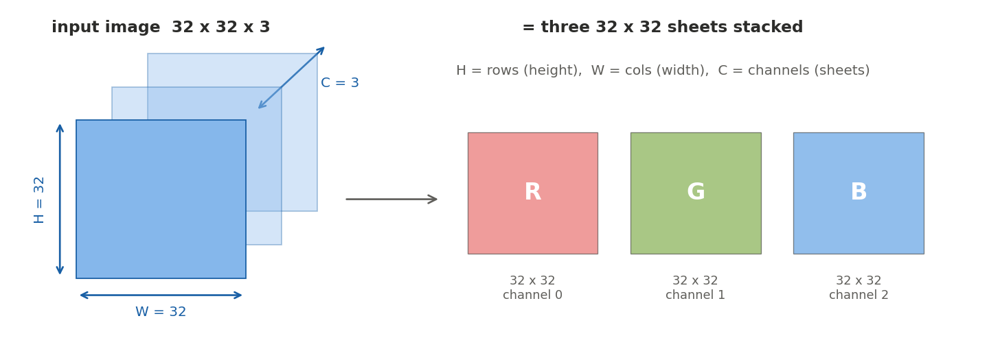
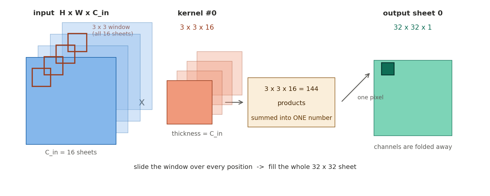
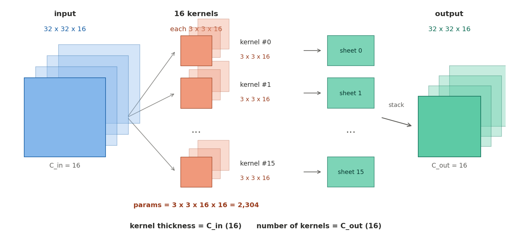
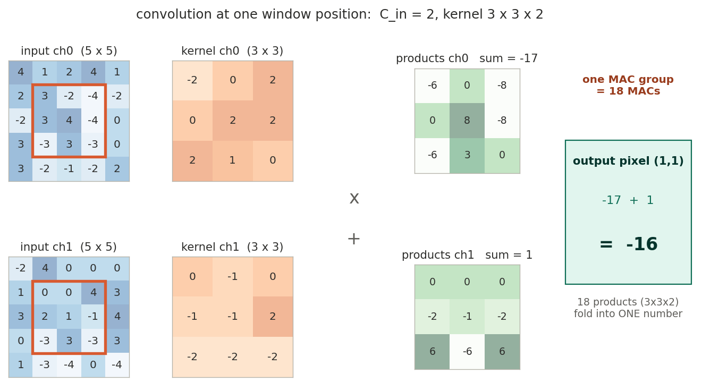
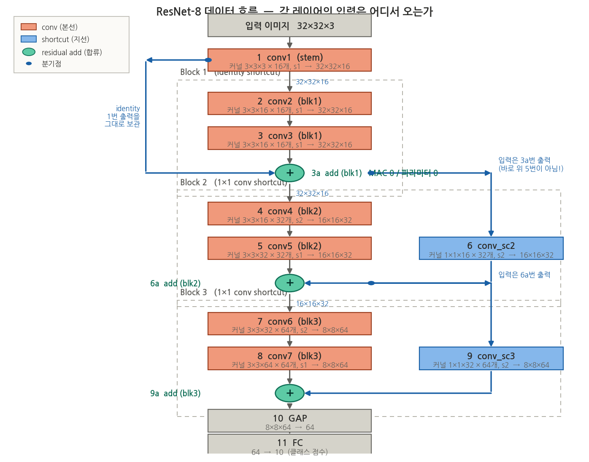

이 시리즈의 최종 목표는 **CIFAR-10 이미지를 분류하는 ResNet-8을, INT8 정수 연산만으로, ZCU208 FPGA 보드 위에서 돌리는 CNN 가속기 IP**를 밑바닥부터 설계하는 것이다. 그런데 RTL을 한 줄이라도 쓰기 전에 반드시 먼저 해야 할 일이 있다. **내가 가속하려는 워크로드가 정확히 무엇인지 숫자로 아는 것**이다.

하드웨어 설계의 모든 결정 — 곱셈기를 몇 개 둘지, 온칩 메모리를 몇 KB 잡을지, DDR에서 데이터를 얼마나 자주 가져올지 — 은 전부 워크로드의 숫자에서 나온다. 이 숫자 없이 설계를 시작하면 "일단 크게 만들고 보자"가 되고, 그 결과물은 근거를 설명할 수 없는 회로가 된다. 그래서 1편은 코드가 아니라 **계산**이다.

:::note[이 글에서 다루는 것]
- CIFAR-10과 ResNet-8이 무엇인지 (CNN 기본 개념 포함)
- **텐서 표기 규약** — `32×32×3`에서 어느 숫자가 세로·가로·채널인가
- **커널의 진짜 모양** — K는 커널 전체가 아니다. C_in과 C_out의 정확한 의미
- 입력과 필터가 실제로 어떻게 곱해지고 더해지는지 **그림과 숫자로 따라가기**
- 합성곱 레이어 하나의 연산량(MAC)과 파라미터 수를 **손으로 세는 법**
- ResNet-8 전체를 레이어별로 해부한 표 — 총 12.5M MACs, 77K 파라미터
- Roofline 분석 — 이 워크로드는 연산 병목인가, 메모리 병목인가
- 결론: 하드웨어가 지원해야 할 연산은 **5종류**로 수렴한다
:::

## 0. 왜 MNIST가 아니라 CIFAR-10 + ResNet-8인가

가속기 입문 프로젝트의 단골은 MNIST(28×28 흑백 손글씨 숫자)다. 하지만 MNIST는 워크로드가 너무 작아서, 문제가 하나 생긴다. **CPU로도 충분히 빠르다**는 것이다. 가속기란 "소프트웨어로는 느려서 전용 하드웨어를 만드는" 물건인데, 가속할 필요가 없는 대상을 가속하면 설계의 존재 이유가 사라진다.

CIFAR-10은 32×32 **컬러(3채널)** 이미지 6만 장을 10개 클래스(비행기, 자동차, 새, 고양이...)로 분류하는 데이터셋이다. 그리고 ResNet-8은 이 크기의 이미지에 맞게 설계된 작은 **잔차 신경망(Residual Network)** 이다. 이 조합을 고른 이유는 세 가지다.

1. **실제 CNN의 구성 요소를 전부 포함한다** — 3×3 합성곱, 1×1 합성곱, stride 2 다운샘플링, 잔차 연결(residual connection), 전역 평균 풀링, 완전연결층. 즉 이걸 돌리는 하드웨어는 더 큰 ResNet 계열도 (속도만 다를 뿐) 돌릴 수 있는 구조가 된다.
2. **혼자 끝낼 수 있는 규모다** — 합성곱 레이어가 총 9개(shortcut 포함)라, 전 레이어를 손으로 검증하는 것이 가능하다.
3. **중간 데이터가 온칩 메모리에 다 들어간다** — 이건 아래에서 직접 계산으로 확인한다. 이 사실 하나가 메모리 서브시스템 설계를 극적으로 단순하게 만들어 준다.

:::note[CNN(합성곱 신경망)이 뭔지 30초 요약]
CNN(Convolutional Neural Network)은 이미지를 처리하는 신경망이다. 핵심 아이디어는 이미지 전체를 한 번에 보는 대신, **작은 창(예: 3×3)을 이미지 위에서 슬라이딩시키며 국소 패턴(모서리, 질감 등)을 감지**하는 것이다. 이 "슬라이딩 창 + 곱셈-덧셈" 연산이 **합성곱(convolution)** 이고, 창의 가중치 묶음을 **커널(kernel)** 또는 필터라 부른다. 커널 하나가 이미지를 훑고 지나가면 "이 패턴이 어디에 얼마나 강하게 있는가"를 나타내는 2차원 지도가 하나 나오는데, 이것이 **특징맵(feature map)** 이다. 커널을 여러 개 쓰면 특징맵도 여러 장 나오고, 이 "장 수"를 **채널(channel)** 이라 한다. CNN은 이런 합성곱 레이어를 여러 층 쌓아, 앞층에서는 단순한 패턴을, 뒷층에서는 그것들이 조합된 복잡한 패턴(눈, 바퀴, 얼굴...)을 감지한다.

이 요약에 나온 커널·특징맵·채널이 정확히 어떤 모양이고 어떻게 곱해지는지는 1~3장에서 그림과 숫자로 하나씩 뜯어본다.
:::

## 1. 표기 약속 — 32×32×3에서 각 숫자가 무엇인가

본격적으로 세기 전에 표기부터 못 박고 간다. 이 시리즈에서 텐서(다차원 배열) 크기는 **항상 `높이 × 너비 × 채널` 순서**로 쓴다.

```
32 × 32 × 3
│    │    └── C : 채널(channel) 수 — 특징맵이 몇 "장" 쌓여 있는가
│    └─────── W : 너비(width)  — 가로 픽셀 수
└──────────── H : 높이(height) — 세로 픽셀 수
```

즉 `32×32×3`은 "가로 32, 세로 32짜리 2차원 판이 3장 겹쳐 있는 것"이다. CIFAR-10 입력이라면 그 3장은 각각 빨강(R), 초록(G), 파랑(B) 성분의 밝기 지도다.



*왼쪽은 32×32×3 텐서를 입체로 본 것, 오른쪽은 그것을 3장의 판으로 펼쳐 본 것. 같은 데이터의 두 가지 그림이다.*

:::note[왜 순서를 명시해야 하나 — 프레임워크마다 다르다]
표기 순서는 관례일 뿐이고 실제로 통일돼 있지 않다. PyTorch는 텐서를 `[N, C, H, W]`(배치, 채널, 높이, 너비) 순으로 메모리에 담고(NCHW), TensorFlow는 `[N, H, W, C]`(NHWC)를 기본으로 쓴다. **글에서는 사람이 읽기 편한 `H×W×C`로 쓰되, 2편의 PyTorch 코드는 `[C, H, W]` 순서**라는 점만 기억하면 된다. 하드웨어에서는 이 순서가 곧 "메모리에서 어떤 값이 이웃하는가"를 결정하므로, 3편에서 버퍼를 설계할 때 다시 정면으로 다룬다.
:::

채널(C)이 특히 헷갈리기 쉬운데, 한 문장으로 정리하면 이렇다. **채널은 "같은 위치를 서로 다른 관점으로 본 값들"이다.** 입력 이미지에서는 그 관점이 R/G/B 색이고, 중간 레이어에서는 "이 위치에 가로 모서리가 있는가", "이 위치에 곡선이 있는가" 같은 학습된 패턴들이다. 어느 쪽이든 **같은 (세로, 가로) 좌표에 값이 C개씩 쌓여 있는** 구조다.

## 2. 커널의 진짜 모양 — K는 커널 전체가 아니다

이제 이 시리즈에서 가장 많이 오해받는 지점을 정면으로 다룬다. 표에 `K = 3×3`이라고 적혀 있으면 커널이 3×3짜리 납작한 정사각형이라고 읽기 쉽다. **틀렸다.** 커널은 언제나 3차원 직육면체다.

```
커널 1개의 실제 모양 = K × K × C_in
                       └─공간─┘  └─채널─┘
```

`K`는 커널의 **공간 크기 한 변**만 가리키는 기호다. 커널의 **두께**는 K가 정하지 않는다. 두께는 `C_in` — 즉 **입력의 채널 수와 강제로 같아야 한다.** 선택의 여지가 없다. 커널은 입력의 모든 채널을 동시에 훑어야 하므로, 입력이 16채널이면 커널도 반드시 두께 16이어야 곱셈 짝이 맞는다.

| 레이어 | 입력 | K | **커널 1개 모양** | 왜 |
|---|---|---|---|---|
| conv1 | 32×32×**3** | 3 | 3×3×**3** | 입력이 3채널이니 두께 3 |
| conv2 | 32×32×**16** | 3 | 3×3×**16** | 입력이 16채널이니 두께 16 |
| conv7 | 8×8×**64** | 3 | 3×3×**64** | 입력이 64채널이니 두께 64 |

:::tip[커널 1개 모양의 마지막 숫자 = 입력의 마지막 숫자]
이 대응만 기억하면 표를 읽다 막힐 일이 없다. "입력이 32×32×16인데 커널이 3×3×16이어야 하는 것 아닌가?"라는 의문은 **정확히 맞는 직관**이다. 다만 그 16은 K가 아니라 C_in이 담당하는 숫자였을 뿐이다. K는 3만 가리킨다.
:::

### 커널 1개는 출력을 몇 장 만드나 — 정답은 1장

3×3×16 커널 하나를 입력 위에서 슬라이딩시키면 결과가 몇 장 나올까? **딱 1장(32×32×1)이다.** 16채널을 전부 훑었는데 왜 1장이냐면, 커널이 `3×3×16 = 144`개 값을 곱한 뒤 **그 144개를 전부 더해 하나의 숫자로 만들어 버리기** 때문이다. 채널 방향은 합산되어 사라진다.



*커널 하나는 입력의 모든 채널을 관통하며 훑고, 144개의 곱을 하나로 접어 출력 픽셀 1개를 만든다. 창을 모든 위치로 옮기면 32×32짜리 출력 "1장"이 채워진다.*

### 그럼 출력 16채널은 어디서 오나 — 커널이 16개다

출력을 16장 만들려면 방법은 하나다. **3×3×16 커널을 16개 준비해서 각각 따로 훑게 하는 것.** 커널마다 가중치가 다르므로 서로 다른 패턴을 감지하고, 결과 16장을 쌓으면 32×32×16 출력이 된다.



정리하면 두 문장이다.

- **C_in = 커널 1개의 두께** (입력이 정해주는 값)
- **C_out = 커널의 개수** (내가 설계로 정하는 값)

conv2의 파라미터 수가 `3×3×16×16 = 2,304`인 것도 이제 그대로 읽힌다 — 커널 하나에 `3×3×16 = 144`개 가중치, 그런 커널이 16개, 총 2,304개.

### 숫자로 한 번 따라가 보기

말로만 하면 여전히 미끄러우니, 실제 숫자로 창 하나를 계산해 본다. 입력 채널 2개(C_in=2), 3×3 커널인 최소 예시다.



*채널 0의 3×3 창과 커널 채널 0을 원소별로 곱해 9개 곱을 얻고(합 −17), 채널 1도 똑같이 해서(합 1), **두 채널의 결과를 다시 합쳐** 출력 픽셀 하나 −16을 얻는다. 곱셈이 총 `3×3×2 = 18`번 일어났고, 그 18개가 전부 하나의 숫자로 접힌다.*

이 그림의 "18"이 바로 다음 장에서 셀 **MAC의 개수**다.

## 3. 연산량을 세는 단위 — MAC

합성곱의 실체는 앞 그림에서 봤듯 **곱하고 더하기의 반복**이다. 이 "곱셈 1번 + 그 결과를 누적하는 덧셈 1번" 묶음을 **MAC(Multiply-ACcumulate)** 이라 부르고, 신경망 연산량을 세는 표준 단위로 쓴다.

:::note[MAC과 OP(연산)의 관계]
MAC 1개는 곱셈 1번과 덧셈 1번, 즉 **2 OP(operation)** 로 친다. 그래서 "12.5M MACs"는 "25 MOP(2500만 연산)"과 같은 말이다. 하드웨어 성능을 말할 때 쓰는 **GOPS(Giga Operations Per Second, 초당 10억 연산)** 도 이 OP 기준이다. 논문이나 스펙시트를 읽을 때 MAC 기준인지 OP 기준인지에 따라 숫자가 2배 차이 나므로 항상 단위를 확인해야 한다.
:::

합성곱 레이어 하나의 총 MAC 수는 공식 하나로 구해진다. 논리는 단순하다 — **출력 픽셀 하나를 만드는 데 `K×K×C_in`번의 MAC이 들고**(앞 그림의 18번), 그런 출력 픽셀이 `H_out × W_out × C_out`개 있다.

```
MACs = H_out × W_out × C_out × ( K × K × C_in )
       └── 출력 픽셀 개수 ──┘   └ 픽셀 1개당 MAC ┘
                                 = 커널 1개의 원소 수

H_out : 출력 높이(세로)      C_out : 출력 채널 수 = 커널 개수
W_out : 출력 너비(가로)      C_in  : 입력 채널 수 = 커널 1개의 두께
K     : 커널 공간 크기 한 변 (3×3이면 K=3)
```

파라미터(가중치) 수도 같은 요령이다. 커널 하나가 `K × K × C_in`개의 가중치를 갖고, 그런 커널이 `C_out`개 있다.

```
Params = K × K × C_in × C_out   (+ 채널당 bias C_out개)
```

**conv2로 직접 세어 보자.** 입력 32×32×16, 커널 3×3×16짜리 16개, 출력 32×32×16이다.

```
MACs   = 32 × 32 × 16 × (3 × 3 × 16)
       = 1,024 × 16 × 144
       = 2,359,296  (약 236만)
Params = 3 × 3 × 16 × 16 = 2,304
```

여기서 눈여겨볼 비율이 하나 있다. **가중치 2,304개가 MAC 236만 번에 재사용된다**는 점이다. 가중치 하나당 평균 1,024번(= 출력 픽셀 수) 쓰인다. 이 "높은 재사용성"이 합성곱을 하드웨어 가속에 유리하게 만드는 근본 성질이고, 뒤의 roofline 분석에서 정량적으로 다시 만난다.

:::tip[stride와 padding — 출력 크기를 결정하는 두 손잡이]
- **stride(보폭)** 는 커널을 몇 픽셀씩 건너뛰며 슬라이딩할지다. stride 1이면 출력이 입력과 같은 크기, stride 2면 **가로세로가 절반**이 된다(픽셀을 하나 걸러 하나씩만 계산하므로). CNN이 깊어질수록 특징맵을 줄이는(다운샘플링) 표준 수단이다.
- **padding(테두리 채움)** 은 이미지 가장자리에 0을 둘러 커널이 경계 밖으로 나가는 문제를 해결한다. 3×3 커널에 padding 1을 주면 stride 1일 때 출력 크기가 입력과 정확히 같아진다. 이 글의 모든 3×3 합성곱은 padding 1을 쓴다.
:::

## 4. ResNet-8의 구조 — 잔차 블록이란

ResNet의 핵심 발명품은 **잔차 연결(residual connection, shortcut)** 이다. 합성곱 두 층을 지난 결과에 **그 두 층에 들어가기 전의 입력을 그대로 더해주는** 우회로다.

```
입력 x ──┬──> conv 3×3 ──> ReLU ──> conv 3×3 ──>(+)──> ReLU ──> 출력
         │                                        ↑
         └────────────── shortcut ────────────────┘
```

왜 이런 걸 만들었을까? 신경망이 깊어지면 학습이 오히려 어려워지는 현상(기울기 소실)이 있는데, "입력을 그대로 통과시키는 지름길"을 놓아두면 각 블록은 **입력 대비 변화량(residual, 잔차)만 학습**하면 되어 깊은 망도 안정적으로 학습된다. 하드웨어 입장에서 중요한 건 학습 이론이 아니라 이 구조가 요구하는 것 — **두 텐서를 원소별로 더하는(element-wise add) 경로가 필요하고, 더하기 위해 블록의 입력을 블록이 끝날 때까지 버퍼에 들고 있어야 한다**는 사실이다. 이건 7편(메모리 서브시스템)의 버퍼 설계에 직접 영향을 준다.

:::note[ReLU와 BatchNorm — 이름은 자주 나오지만 하드웨어 비용은 거의 0]
- **ReLU(Rectified Linear Unit)** 는 `y = max(0, x)`, 즉 음수를 0으로 자르는 활성화 함수다. 하드웨어로는 부호 비트를 보고 0을 고르는 MUX 하나 수준이라 비용이 거의 없다.
- **BatchNorm(배치 정규화)** 은 각 채널의 분포를 정규화하는 층으로, 추론 시에는 채널마다 고정된 `y = a·x + b` 곱셈-덧셈 하나로 줄어든다. 더 좋은 소식은, 이 `a, b`를 **앞 합성곱의 가중치에 미리 녹여 넣을 수 있다(BN folding)** 는 것이다. 그러면 하드웨어에는 BatchNorm이라는 것 자체가 존재하지 않게 된다. 이 트릭은 2편(양자화)에서 수식으로 다룬다.

그래서 이 글의 연산량 집계에서 ReLU/BN은 무시한다. 전체 MAC의 1%도 안 된다.
:::

이제 ResNet-8 전체를 그려보면 이렇다. "8"은 가중치를 가진 레이어 수(합성곱 7 + FC 1, shortcut 제외 관례)에서 온 이름이다.

```
입력 32×32×3 (CIFAR-10 컬러 이미지)
│
├─ conv1  3×3, s1,  3→16        [stem]              출력 32×32×16
│
├─ Block1 (채널 16, 크기 32×32 유지)
│    conv2 3×3 s1 16→16 → conv3 3×3 s1 16→16
│    shortcut: 그대로 연결 (identity)
│
├─ Block2 (채널 16→32, 크기 32→16으로 절반)
│    conv4 3×3 s2 16→32 → conv5 3×3 s1 32→32
│    shortcut: conv_sc2 1×1 s2 16→32   ← 크기·채널을 본선과 맞추기 위한 1×1
│
├─ Block3 (채널 32→64, 크기 16→8로 절반)
│    conv6 3×3 s2 32→64 → conv7 3×3 s1 64→64
│    shortcut: conv_sc3 1×1 s2 32→64
│
├─ GAP  전역 평균 풀링: 8×8×64 → 64   (각 채널의 8×8=64픽셀 평균)
└─ FC   완전연결: 64 → 10  (클래스 점수)
```

:::note[1×1 합성곱이 shortcut에 등장하는 이유]
Block2에서 본선은 stride 2로 크기가 절반(32→16)이 되고 채널은 2배(16→32)가 된다. 그런데 shortcut으로 넘어온 입력은 여전히 32×32×16이라 **모양이 안 맞아 더할 수가 없다**. 그래서 shortcut 경로에 1×1 커널, stride 2짜리 합성곱을 하나 두어 모양을 16×16×32로 맞춘다.

1×1 커널이라고 해서 값 하나짜리가 아니다. 2장의 규칙은 여기서도 그대로다 — 커널 1개 모양은 `1×1×C_in`, 즉 Block2의 shortcut이라면 `1×1×16`인 **길쭉한 막대**다. 공간적으로는 픽셀 한 자리만 보지만 채널 방향으로는 16개를 전부 훑어 하나로 접는다. 그래서 1×1 합성곱은 공간 패턴은 안 보고 **채널 방향으로만 가중합을 하는** 연산이고, "채널 수 변환기"라고 생각하면 정확하다. MAC 공식에 K=1을 넣으면 그대로 계산된다.
:::

:::note[GAP(전역 평균 풀링)과 FC(완전연결층)]
- **GAP(Global Average Pooling)** 는 채널마다 특징맵 전체(여기서는 8×8=64픽셀)의 **평균 하나**만 남기는 연산이다. "이 특징이 이미지 어딘가에 있긴 한가"로 정보를 압축해, 8×8×64 텐서를 길이 64짜리 벡터로 만든다.
- **FC(Fully-Connected, 완전연결층)** 는 그 64개 값 전부와 10개 출력 각각을 빠짐없이 연결하는 층이다. 출력 하나당 64번의 MAC, 총 640 MAC. 이 10개 출력이 각 클래스의 점수가 되고, 가장 큰 값의 클래스가 예측 결과다.
:::

## 5. 레이어별 해부 — 전체 표

이제 3장의 공식을 모든 레이어에 적용한다. 아래 표의 숫자는 전부 `MACs = H·W·C_out·(K·K·C_in)`, `Params = K·K·C_in·C_out` 에 값을 넣어 직접 계산한 것이다. 특징맵 크기는 INT8 양자화를 전제로 **1픽셀·1채널 = 1바이트**로 센다(양자화는 2편에서 다루지만, 메모리 예산은 지금 잡아야 하므로 미리 가정한다).

표를 읽는 법을 먼저 짚어둔다. 두 가지다.

**첫째, 커널 모양의 대응.** `커널 1개 모양`의 마지막 숫자는 항상 `입력 출처`의 마지막 숫자와 같고(= C_in, 커널 두께), `커널 개수`는 항상 `출력`의 마지막 숫자와 같다(= C_out). 2장에서 확인한 그 대응이다.

**둘째, "입력 출처" 열.** 크기만 적으면 shortcut이 보이지 않는다. ResNet은 **몇 단계 위 레이어의 출력이 아래로 건너뛰어 합류하는** 구조라, "이 레이어의 입력이 **어느 번호에서** 왔는가"를 적어야 데이터 흐름이 표에서 추적된다. 이 열의 번호가 바로 위 번호가 아닌 행들 — **6번과 9번** — 이 shortcut이다.

그리고 MAC도 파라미터도 0이라 연산량 집계에서 빠지기 쉬운 **residual add를 3a / 6a / 9a로 표에 명시**했다. 하드웨어에서는 이것들도 엄연히 데이터 경로와 버퍼를 요구하는 실체다.

| # | 레이어 | **입력 출처** | 커널 1개 모양<br>K×K×C_in | 커널<br>개수 | s | 출력<br>H×W×C | MACs | Params |
|---|---|---|---|---:|:---:|---|---:|---:|
| 1 | conv1 (stem) | 입력 이미지 (32×32×**3**) | 3×3×**3** | **16** | 1 | 32×32×**16** | 442,368 | 432 |
| 2 | conv2 (blk1) | **1번** 출력 (32×32×**16**) | 3×3×**16** | **16** | 1 | 32×32×**16** | 2,359,296 | 2,304 |
| 3 | conv3 (blk1) | **2번** 출력 (32×32×**16**) | 3×3×**16** | **16** | 1 | 32×32×**16** | 2,359,296 | 2,304 |
| **3a** | **add (blk1)** | **3번 + 1번** 출력 | — | — | — | 32×32×16 | **0** | **0** |
| 4 | conv4 (blk2) | **3a번** 출력 (32×32×**16**) | 3×3×**16** | **32** | 2 | 16×16×**32** | 1,179,648 | 4,608 |
| 5 | conv5 (blk2) | **4번** 출력 (16×16×**32**) | 3×3×**32** | **32** | 1 | 16×16×**32** | 2,359,296 | 9,216 |
| 6 | conv_sc2 | **3a번** 출력 (32×32×**16**) ← ⚠︎ | 1×1×**16** | **32** | 2 | 16×16×**32** | 131,072 | 512 |
| **6a** | **add (blk2)** | **5번 + 6번** 출력 | — | — | — | 16×16×32 | **0** | **0** |
| 7 | conv6 (blk3) | **6a번** 출력 (16×16×**32**) | 3×3×**32** | **64** | 2 | 8×8×**64** | 1,179,648 | 18,432 |
| 8 | conv7 (blk3) | **7번** 출력 (8×8×**64**) | 3×3×**64** | **64** | 1 | 8×8×**64** | 2,359,296 | 36,864 |
| 9 | conv_sc3 | **6a번** 출력 (16×16×**32**) ← ⚠︎ | 1×1×**32** | **64** | 2 | 8×8×**64** | 131,072 | 2,048 |
| **9a** | **add (blk3)** | **8번 + 9번** 출력 | — | — | — | 8×8×64 | **0** | **0** |
| 10 | GAP | **9a번** 출력 (8×8×**64**) | — | — | — | 64 | (덧셈 4,096) | 0 |
| 11 | FC | **10번** 출력 (64) | — | — | — | 10 | 640 | 650 |
| | **합계** | | | | | | **12,501,632** | **77,370** |

⚠︎ 표시한 두 행이 이 표에서 가장 중요한 지점이다. **6번(conv_sc2)의 입력은 바로 위 5번이 아니라 3a번**이다. 표의 순서대로 위에서 아래로 읽으면 놓치는, 위로 거슬러 올라가는 화살표다. 9번도 마찬가지로 8번이 아닌 6a번을 받는다. 이것이 shortcut의 정체 — 본선이 conv를 두 번 지나는 동안, 지선은 블록 입구의 값을 들고 출구에서 기다린다.

검산도 표에서 바로 된다. 4행(conv4)은 `MACs = 16 × 16 × 32 × (3×3×16) = 256 × 32 × 144 = 1,179,648`, `Params = 3×3×16 × 32 = 4,608`. stride 2라 출력이 32×32에서 16×16으로 절반이 된 것도 보인다.

### 표를 그림으로 — 데이터 흐름도

표는 순차적이라 "위로 거슬러 올라가는 화살표"를 표현하기 어렵다. 같은 정보를 흐름도로 그리면 분기와 합류가 한눈에 들어온다.



*파란 선이 shortcut(지선)이다. Block 1은 1번 출력을 **그대로** 들고 가 3a에서 합류하고(identity), Block 2·3은 크기와 채널이 안 맞아 1×1 conv(6번, 9번)를 거쳐서 합류한다. 지선이 갈라지는 점(분기점)과 합류하는 점(+)의 세로 거리 — 그 구간 내내 지선의 데이터를 어딘가에 **보관**하고 있어야 한다는 뜻이다.*

:::tip[흐름도에서 하드웨어 요구사항 읽어내기 — add는 공짜가 아니다]
3a의 덧셈은 MAC이 0이고 파라미터도 0이다. 하지만 **공짜가 아니다.** 흐름도의 파란 선 길이가 비용이다.

- **버퍼 비용**: 3a에서 더하려면 1번의 출력 16 KB를 2번과 3번이 계산되는 **내내 붙잡고 있어야** 한다. 이것이 6장 메모리 예산 표에 "shortcut용으로 붙잡아 둔 블록 입력 16 KB"라는 항목으로 등장하는 이유다.
- **스케줄 비용**: 6번(conv_sc2)은 5번과 **독립적**이다. 서로 입력이 다르니 어느 쪽을 먼저 계산해도 되고, 이론적으로는 병렬 실행도 가능하다. 8편에서 레이어 실행 순서를 descriptor로 짤 때, 이 독립성이 곧 스케줄링의 자유도가 된다.
- **연산 비용**: 2편에서 보겠지만, 양자화된 세계에서는 두 브랜치의 scale이 달라 **그냥 더할 수 없다.** requantize를 거쳐 눈금을 맞춘 뒤에야 더할 수 있다. "MAC 0"은 곱셈-누산이 없다는 뜻이지, 회로가 없다는 뜻이 아니다.
:::

**추론 1회 = 약 12.5M MACs = 25 MOP, 파라미터 전체 = 약 77K개(INT8로 약 76 KB).** 이 두 숫자가 이 시리즈 전체를 지배하는 숫자다.

표를 읽으면서 짚어둘 관찰이 몇 개 있다.

**관찰 1 — 연산량은 놀랄 만큼 균등하게 퍼져 있다.** stride 1인 3×3 합성곱(conv2, 3, 5, 7)이 각각 236만 MACs로 전부 똑같다. 우연이 아니다. CIFAR용 ResNet은 크기를 절반으로 줄일 때마다 채널을 2배로 늘리도록 설계되어(32×32×16 → 16×16×32 → 8×8×64), 픽셀 수가 1/4이 되는 만큼 픽셀당 연산이 4배가 되어 상쇄된다. 하드웨어 입장에서 이건 좋은 소식이다. **특정 레이어 하나만 병목이 되는 구조가 아니라서, 하나의 범용 합성곱 엔진으로 전 레이어를 고르게 처리할 수 있다.**

**관찰 2 — 파라미터는 정반대로 뒤쪽에 몰려 있다.** conv7 하나가 36,864개로 전체의 48%를 차지한다. 연산량은 같은데 파라미터는 16배 차이(conv2 대비)라는 건, **레이어마다 "가중치 1개당 재사용 횟수"가 크게 다르다**는 뜻이다. conv2는 가중치당 1,024회, conv7은 64회 재사용된다. 이 차이는 weight 버퍼 크기 산정(7편)의 근거가 된다 — 버퍼는 최대 레이어인 conv7의 36.9 KB에 맞추면 된다.

**관찰 3 — FC는 연산량 기준으로 완전히 무시할 수 있다.** 640 MACs는 전체의 0.005%다. 그런데도 FC를 지원해야 하는 이유는 성능이 아니라 **기능 완결성** 때문이고, 다행히 FC는 별도 엔진 없이 처리할 수 있다(8장에서 설명).

**관찰 4 — 특징맵이 전부 손바닥만 하다.** 가장 큰 특징맵이 16 KB(32×32×16)다. 입력 이미지는 3 KB. 이게 다음 장의 핵심 재료다.

**관찰 5 — 연산량이 0인 레이어가 3개나 있다.** 3a/6a/9a의 residual add는 MAC도 파라미터도 0이다. 연산량만 보면 없는 것과 같지만, 흐름도에서 봤듯 **데이터를 오래 붙잡는 비용**을 요구한다. 여기서 얻을 교훈이 하나 있다 — **워크로드 분석을 MAC 표만으로 끝내면 안 된다.** 연산량 0짜리 레이어가 정작 버퍼 용량과 스케줄링을 결정할 수 있다. 그래서 이 시리즈는 표와 흐름도를 함께 본다.

## 6. 메모리 예산 — 전부 온칩에 들어가는가

가속기 설계에서 가장 먼저 갈리는 길은 "중간 결과를 어디에 두느냐"다. 선택지는 두 개다.

- **오프칩(DDR)**: 레이어 하나 계산할 때마다 결과를 칩 밖 DRAM에 쓰고, 다음 레이어에서 다시 읽어온다. 큰 네트워크에서는 어쩔 수 없는 선택이지만, DDR 접근은 느리고 전력을 많이 먹으며 DMA 설계가 복잡해진다.
- **온칩(BRAM/URAM)**: 칩 안의 SRAM에 전부 상주시킨다. 접근이 1~2사이클이고 대역폭이 사실상 무제한이지만, 용량이 작다.

:::note[BRAM과 URAM — FPGA 안의 두 가지 SRAM]
Xilinx FPGA에는 로직과 별개로 심어져 있는 SRAM 블록이 있다. **BRAM(Block RAM)** 은 36Kb짜리 작은 블록이 칩 곳곳에 흩어져 있는 형태이고, **URAM(UltraRAM)** 은 288Kb짜리 대용량 블록이다. ZCU208에 실린 ZU48DR 칩 기준으로 BRAM 총 약 38 Mb, URAM 총 약 22.5 Mb — 합쳐서 **7 MB 이상의 온칩 SRAM**이 있다.
:::

그럼 우리 워크로드에 필요한 양을 세어 보자. 어떤 시점에 동시에 살아 있어야 하는 데이터는 최대 세 덩어리다.

| 용도 | 최악 케이스 | 크기 |
|---|---|---:|
| 현재 레이어의 입력 특징맵 | 32×32×16 | 16 KB |
| 현재 레이어의 출력 특징맵 | 32×32×16 | 16 KB |
| shortcut용으로 붙잡아 둔 블록 입력 | 32×32×16 | 16 KB |
| 현재 레이어의 가중치 (최대 = conv7) | 36,864개 | 36 KB |
| **합계** | | **약 84 KB** |

**84 KB vs 7 MB.** 필요량이 가용량의 1.2%다. 결론은 명확하다 — **입력 이미지를 한 번 DDR에서 가져온 뒤로는, 최종 결과 10바이트를 내보낼 때까지 모든 중간 데이터가 온칩에 상주할 수 있다.** DDR 트래픽은 추론 1회당 입력 3 KB + 가중치 76 KB(이것도 반복 추론 시 온칩 캐시 가능)가 전부다.

이 결론이 시리즈 전체의 아키텍처를 결정한다. 3편에서 다룰 "핑퐁 버퍼" 구조 — 특징맵 버퍼 두 개를 두고 레이어 N의 출력 버퍼가 레이어 N+1의 입력 버퍼가 되도록 왕복시키는 방식 — 가 성립하는 근거가 바로 이 계산이다.

## 7. Roofline 분석 — 이 워크로드는 무엇에 막히는가

이제 이 시리즈에서 가장 중요한 분석 도구를 꺼낸다. 어떤 하드웨어에서 어떤 워크로드를 돌리든, 성능의 상한은 둘 중 하나가 정한다.

1. **연산 상한**: 하드웨어가 초당 수행할 수 있는 연산 수 (GOPS)
2. **메모리 상한**: 하드웨어가 초당 실어 나를 수 있는 데이터양 (GB/s)

워크로드가 어느 쪽 상한에 먼저 부딪히는지를 판정하는 틀이 **roofline 모델**이다. 판정 기준은 워크로드의 **연산 강도(AI, Arithmetic Intensity)** — "메모리에서 1바이트를 가져올 때마다 연산을 몇 번 하는가"이다.

```
AI = 총 연산 수(OP) / 총 데이터 이동량(byte)
```

AI가 높으면 데이터 한 번 가져와서 오래 계산하는 워크로드(연산 병목, compute-bound), 낮으면 계산은 잠깐인데 데이터를 계속 날라야 하는 워크로드(메모리 병목, memory-bound)다. 그리고 하드웨어 쪽에도 같은 단위의 기준점이 있다.

```
ridge point = 하드웨어 연산 상한(GOPS) / 메모리 대역폭(GB/s)
```

**워크로드의 AI가 ridge point보다 크면 연산 병목, 작으면 메모리 병목**이다. 우리 하드웨어의 목표 스펙을 미리 대입해 보자. 설계할 PE 어레이는 256 MAC × 250 MHz = **128 GOPS**(3편에서 결정 과정을 다룬다), ZCU208의 PS DDR4 대역폭은 실효 기준 대략 **19 GB/s** 수준이다.

```
ridge point = 128 GOPS / 19 GB/s ≈ 6.7 OP/byte
```

즉 우리 하드웨어에서는 **AI가 6.7 OP/byte를 넘는 연산은 연산 유닛이 병목, 못 넘는 연산은 DDR이 병목**이다. 이제 레이어별 AI를 계산한다. 데이터 이동량은 (가중치 + 입력 fmap + 출력 fmap) 바이트로 센다.

| 레이어 | 연산(OP) | 데이터(byte) | AI (OP/byte) | 판정 (vs 6.7) |
|---|---:|---:|---:|---|
| conv2 (blk1) | 4.72M | 2,304 + 16K + 16K ≈ 35K | **≈ 134** | 연산 병목 |
| conv7 (blk3) | 4.72M | 36,864 + 4K + 4K ≈ 45K | **≈ 105** | 연산 병목 |
| FC | 1,280 | 650 + 64 + 10 ≈ 724 | **≈ 1.8** | 메모리 병목 |

3×3 합성곱들의 AI는 100을 넘는다. ridge point의 15배 이상이니 **압도적으로 연산 병목**이다. 반대로 FC는 AI 1.8로 메모리 병목이지만, 5장의 관찰 3에서 봤듯 전체 연산의 0.005%라 실질 영향이 없다.

그런데 여기에 6장의 결론을 겹치면 그림이 한층 더 좋아진다. 위 표의 "데이터 이동량"은 매 레이어 DDR을 오간다는 가정인데, 우리는 **중간 특징맵을 전부 온칩에 두기로 했다**. 그러면 DDR 관점의 데이터 이동은 추론 1회당 입력 3 KB + 가중치 76 KB ≈ 79 KB뿐이고, 네트워크 전체의 실효 AI는:

```
AI_전체 = 25 MOP / 79 KB ≈ 316 OP/byte
```

ridge point 6.7의 약 47배. **이 워크로드는 온칩 상주 전략과 결합하면 완전한 연산 병목 워크로드가 된다.** 이것이 의미하는 바를 풀어 쓰면 이렇다 — 성능을 올리고 싶으면 MAC을 더 붙이면 되고(연산이 벽이므로), DDR 대역폭이나 DMA 최적화에 공을 들일 필요는 거의 없으며, 따라서 **설계 노력의 대부분을 연산 코어(라인 버퍼 + PE 어레이)에 집중하는 것이 옳다**. 시리즈의 분량 배분(4~6편이 연산 코어)이 이 분석에서 나왔다.

:::tip[거칠게 예상해 보는 성능 상한]
연산 병목이라면 성능 상한은 단순 나눗셈으로 나온다. 25 MOP ÷ 128 GOPS ≈ **0.2 ms/추론, 이론상 약 5,000 fps**다. 물론 이건 PE가 한 사이클도 놀지 않는다는 비현실적 가정의 숫자고, 실제로는 레이어 전환 오버헤드, 경계 처리, PE 활용률(특히 입력 채널이 3개뿐인 conv1에서 PE가 많이 논다) 때문에 상당히 깎인다. 실측과 이 상한의 격차를 분석하는 것이 11편(결산)의 핵심 재미가 될 것이다.
:::

## 8. 결론 — 하드웨어가 지원해야 할 연산은 5개

이 글의 최종 산출물이다. ResNet-8을 표로 해부한 결과, 등장하는 연산의 종류는 다음이 전부다.

| # | 연산 | 등장 위치 | 하드웨어 구현 방침 |
|---|---|---|---|
| 1 | **conv 3×3** (stride 1, 2) | 레이어 7개 | 주력 엔진. 라인 버퍼 + PE 어레이 (4~5편) |
| 2 | **conv 1×1** (stride 2) | shortcut 2개 | 3×3 엔진의 특수 케이스로 처리 — 커널 중앙 1탭만 사용 |
| 3 | **residual add** | 3a, 6a, 9a | 출력 경로에 원소별 덧셈기 + shortcut 버퍼 (6편). MAC은 0이지만 버퍼 16 KB를 요구 |
| 4 | **GAP** (8×8 평균) | 마지막 1개 | 누산 후 시프트. 8×8=64개 평균 = **합계 >> 6**, 나눗셈기 불필요 |
| 5 | **FC** | 마지막 1개 | **1×1 conv로 변환해 처리** — 입력을 1×1×64 특징맵으로 보면 FC는 1×1 conv 64→10과 완전히 동일. 별도 엔진 없음 |

ReLU는 양자화 유닛의 클램프 로직에 흡수되고(6편), BatchNorm은 가중치에 folding 되어 소멸한다(2편). MaxPool은 이 네트워크에 없으므로 v1에서는 만들지 않는다 — "필요할 때 추가한다"도 워크로드 분석이 주는 결정이다.

**설계 전에 워크로드를 세어본 대가로 얻은 것**을 정리하면:

- 목표 연산량 25 MOP → PE 어레이 크기와 성능 상한의 근거
- 파라미터 77 KB, 최대 레이어 36 KB → weight 버퍼 크기의 근거
- 특징맵 최대 16 KB, 동시 상주 84 KB → **전량 온칩 상주** 전략 확정, 핑퐁 버퍼 구조의 근거
- 실효 AI 316 OP/byte ≫ ridge 6.7 → 연산 병목 확정, 설계 노력을 연산 코어에 집중
- 지원 연산 5종 확정 → RTL 스코프 동결

다음 편(2편)에서는 하드웨어를 만들기 전 마지막 준비물 — **양자화**를 다룬다. float32로 학습된 이 네트워크를 어떻게 INT8 정수만으로, 그것도 나눗셈 한 번 없이 `(누산값 × M) >> shift` 꼴로 추론하는지, 그리고 그 결과가 RTL 검증의 기준(golden model)이 되도록 레이어별 중간값을 어떻게 덤프하는지를 PyTorch 코드와 함께 본다.