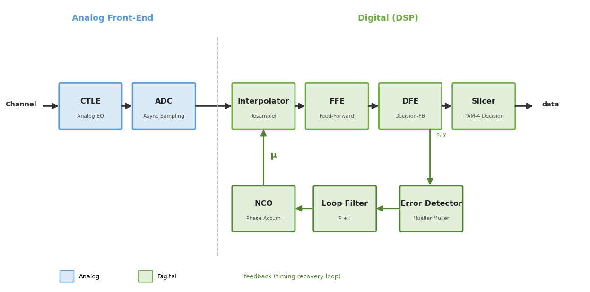

이 글은 **"SerDes: ADC-Based DSP-CDR 설계"** 시리즈의 1편이다. 전체 구조를 개관하고, 왜 이 무거운 디지털 구조를 쓰는지, 각 블록이 무슨 일을 하는지, 어떤 순서로 설계하는지를 잡는다. 이후 편들이 각 블록을 하나씩 깊게 파고들 때, 이 글이 지도 역할을 한다.

:::note[이 시리즈가 다루는 것]
MIPI M-PHY HS-G6(PAM-4)급 고속 수신기를 예로, ADC 기반 DSP-CDR을 **시스템 사양에서 개별 블록까지 top-down으로 설계**한다. 채널이 신호를 얼마나 망가뜨리는지(Link Budget)부터 시작해 → ADC 사양을 도출하고 → EQ로 신호를 복원하고 → Interpolator로 타이밍을 맞추고 → CDR 루프로 클럭을 복원해 → 최종 Jitter/BER를 검증하는 데까지 이어진다.
:::

## 1. 문제 — 고속에서 아날로그 CDR이 무너진다

수신기가 하는 일은 단순하다. 채널을 건너온 신호에서 **데이터를 읽고, 그 데이터의 타이밍(클럭)을 복원**하는 것. 이 "클럭·데이터 복원"이 CDR(Clock and Data Recovery)이다.

전통적으로는 **아날로그 CDR**이 이 일을 했다. PLL/DLL이 클럭 위상을 직접 만들어, 그 클럭으로 데이터를 다시 샘플링한다. 회로가 단순하고 전력도 낮다. 저속~중속에서는 이걸로 충분하다.

문제는 속도가 오르면서 시작된다. PAM-4로 20GBaud를 넘어서면:

- **채널 손실이 극심해진다.** 고주파일수록 손실이 커지는데(표피효과·유전체 손실), 20GHz 근처에서 수십 dB가 깎인다. 아날로그 EQ(CTLE)만으로는 이 손실을 못 되살린다.
- **오버샘플링이 비현실적이다.** 아날로그 CDR은 보통 심볼당 2점(2× 오버샘플)을 찍어 위상을 뽑는데, 23GBaud면 클럭이 46GHz가 넘어야 한다. 이건 전력·면적이 감당 안 된다.
- **채널이 다양하고 변한다.** 고정된 아날로그 회로로는 여러 채널에 유연하게 적응하기 어렵다.

즉 고속에서는 아날로그 CDR이 "성능이 아쉬운" 정도가 아니라 **아예 동작을 못 하는** 영역에 들어간다.

## 2. 해법 — 일단 디지털로 바꾸고, DSP로 다 한다

ADC-Based DSP-CDR의 발상은 과감하다. **신호를 ADC로 통째로 디지털화한 뒤, 이퀄라이징·클럭복원·판정을 전부 디지털 연산으로** 처리한다.

이렇게 하면 고속의 세 가지 문제가 풀린다.

- 복잡한 EQ(FFE/DFE 수십 탭)를 **디지털로 자유롭게** 구현 → 큰 손실도 회복
- **baud-rate(심볼당 1점) ADC** + Interpolator로 우회 → 46GHz 클럭 불필요
- 채널이 바뀌어도 **계수만 재학습(adaptation)** → 유연

대가는 **ADC와 DSP의 전력·면적**이다. 그런데 FinFET 공정이 디지털 로직을 싸고 빠르게 만들어주면서, 이 대가를 감당할 수 있게 됐다. 그래서 이 분야가 하나같이 **FinFET 공정 + 전력 효율**을 강조한다.

:::tip[핵심 — "복잡해서 쓰는" 게 아니라 "복잡하지 않으면 안 돼서" 쓴다]
ADC-DSP 구조가 무거운 건 맞다. 하지만 고속 PAM-4에서는 이게 선택이 아니다. 아날로그로 감당이 안 되는 손실·속도라서, 디지털로 우회하는 것이다. 저속·짧은 채널이라면 여전히 가벼운 아날로그 CDR이 정답이다. **이 구조는 "고속·고손실"이라는 조건에서만 정당화된다.**
:::

## 3. 실제로 쓰는 구조인가 — 근거

이 구조가 교과서 속 이야기가 아니라 **실제 상용·학술 SerDes의 표준**이라는 근거는 분명하다. 대표적인 112Gb/s PAM-4 수신기들의 아키텍처 서술을 보면:

- **Intel 112G PAM4 (10nm FinFET):** 공진형 AFE, 64-way 타임인터리브 ADC, 16탭 FFE + 1탭 DFE의 디지털 이퀄라이제이션, 그리고 DCO 기반 CDR 루프로 구성된다고 서술된다. −35dB Nyquist 채널까지 pre-FEC BER 1e-6로 지원한다.
- **Xilinx/AMD 112G PAM4 (FinFET):** 4단 CTLE, 56GSa/s 타임인터리브 7비트 SAR ADC, DSP, 적응 루프로 구성된다.
- **MathWorks 공식 112G 참조 모델:** CTLE·증폭기 AFE + 타임인터리브 ADC + FFE/DFE DSP + baud-rate CDR 구조를 쓰고, 위상검출에 Mueller-Müller 방식을 채택한다.

세 곳(반도체 회사 실리콘 + EDA 툴 참조모델)이 공통적으로 **CTLE + 타임인터리브 ADC + FFE + (1탭)DFE + baud-rate CDR**로 수렴한다. 즉 이 블록 구성은 특정 회사의 특이한 선택이 아니라 **업계 공통 템플릿**이다.

:::note[근거의 성격 — 정직한 한계]
위는 각 논문·문서가 아키텍처를 **글로 서술한 내용**을 요약한 것이다(동일한 블록 다이어그램이 그려져 있다는 뜻은 아니다). 또한 이 사례들은 주로 112G 이더넷/데이터센터 SerDes이고, 우리가 타깃하는 M-PHY(UFS 모바일)는 채널이 더 짧아 손실이 작다(−15~−29dB급). 따라서 **골격(PAM-4 + baud-rate ADC + 디지털 EQ + Interpolator 기반 CDR)은 같되, 규모는 더 가벼울 수 있다**(FFE 탭이 적거나 DFE 생략 등).
:::

## 4. 전체 블록도

우리가 다룰 수신기의 구조는 이렇다.



크게 **세 덩어리**로 보면 이해가 쉽다.

**① 아날로그 프론트엔드 (Analog Front-End)**
채널을 지나며 뭉개진 신호를 CTLE(연속시간 선형 EQ)로 1차 보정하고, ADC가 디지털로 변환한다. 여기서 ADC의 유효비트(ENOB)가 전체 성능의 천장을 정한다.

**② 디지털 데이터패스 (Feed-forward)**
Interpolator가 타이밍을 맞춘 뒤, FFE(앞먹임)와 DFE(되먹임)가 남은 ISI(심볼 간 간섭)를 마저 제거하고, Slicer가 PAM-4 4레벨을 판정해 데이터를 뽑는다.

**③ 타이밍 복원 루프 (Feedback) ← CDR의 심장**
Error Detector가 "지금 샘플링 위상이 이른가 늦은가"를 판단 → Loop Filter가 그 정보를 누적·평활 → NCO가 위상을 누산 → Interpolator가 그 위상 μ만큼 샘플을 옮긴다. 이 되먹임이 계속 돌며 샘플링 타이밍을 데이터에 맞춰간다.

## 5. 블록별 역할

각 블록이 무슨 일을 하는지 한눈에 정리한다. 상세는 각 편에서 다룬다.

| 블록 | 하는 일 | 다루는 편 |
|---|---|---|
| **CTLE** | 아날로그에서 고주파를 부스트해 손실 1차 보정 | 3편 |
| **ADC** | 아날로그 신호를 디지털로 변환 (baud-rate, 타임인터리브) | 2편 |
| **Interpolator** | CDR이 주는 μ만큼 샘플을 분수지연 이동 (타이밍 정렬) | 4편 |
| **FFE** | 앞먹임으로 선행/후행 ISI 제거 | 4편 |
| **DFE** | 판정된 심볼로 후행 ISI 제거 (잡음 무증폭) | 4편 |
| **Slicer** | PAM-4 4레벨 판정 → 데이터 | 4편 |
| **Error Detector** | 샘플링 위상 오차(이른가/늦은가) 검출 (Mueller-Müller) | 5편 |
| **Loop Filter** | 위상 오차를 평활·누적 (P+I), 루프 대역폭 결정 | 5편 |
| **NCO** | 위상 누산 → Interpolator에 줄 μ 생성 | 5편 |

:::note[Interpolator의 자리]
Interpolator는 타이밍 복원 루프의 **액추에이터(손발)** 다. 루프가 "μ만큼 옮겨라"고 명령하면 실제로 옮긴다. 이 블록의 SQNR·비트폭 설계는 4편에서 상세히 다룬다. Interpolator 혼자서는 아무것도 못 하고, μ를 정해주는 나머지 세 블록(ED·LF·NCO)과 협조해야 CDR이 완성된다.
:::

## 6. 설계 흐름 — 왜 top-down인가

이 시리즈의 핵심 논리는 **아래 블록의 사양이 위 블록의 결정에서 내려온다**는 것이다. 거꾸로 하면 막힌다 — "μ가 얼마나 빨리 수렴해야 하나"는 EQ가 얼마나 신호를 정리했느냐에 달렸고, 그건 채널이 얼마나 손실이 큰지에 달렸으니까.

```
채널 손실 (주어짐, 못 바꿈)
    ↓  "이 손실을 누가 보정하나?"
Link Budget (손실을 EQ 블록들에 배분)          → 2편
    ↓  "ADC는 몇 비트로 받아야 하나?"
ADC 사양 (ENOB, 레이트)                        → 2편
    ↓  "EQ는 얼마나 남은 걸 처리하나?"
EQ 설계 (CTLE/FFE/DFE 분담)                    → 3편
    ↓  "샘플 사이 값을 어떻게 만드나?"
Interpolator 설계                              → 4편
    ↓  "그러고 남은 신호로 CDR이 뭘 하나?"
CDR 루프 (μ 수렴, jitter)                       → 5편
    ↓  "전체 성능을 어떻게 검증하나?"
Jitter/BER 최적화                              → 6편
```

각 화살표가 "위가 아래의 사양을 내려주는" 관계다. 그래서 **시작점은 반드시 Link Budget(2편)** 이다.

:::tip[완전한 일방통행은 아니다 — 반복]
top-down이 뼈대지만 실제 설계는 반복(iteration)이다. 예컨대 CDR 단계에서 Jitter 사양을 못 넘으면, 다시 위로 올라가 EQ를 강화하거나 ADC ENOB를 높이는 쪽으로 예산을 재배분한다. 하지만 되돌아갈 때도 결국 예산표(Link Budget)를 고치는 것이라, **첫 삽은 언제나 Link Budget**이다.
:::

## 7. 이 시리즈의 목차

| 편 | 제목 | 다루는 질문 |
|---|---|---|
| **1** | **전체 구조 개요** | **왜 ADC-DSP인가, 블록별 역할 (이 글)** |
| 2 | Link Budget & ADC 사양 | 채널 손실을 어떻게 나눠 회복하고, 몇 비트로 받나 |
| 3 | 디지털 EQ (FFE/DFE) | 남은 ISI를 어떻게 지우나 |
| 4 | Interpolator 설계 | 샘플 사이 값을 어떻게 만드나 (SQNR·비트폭) |
| 5 | CDR 루프 설계 | μ를 어떻게 수렴시키나 (PD/LF/NCO) |
| 6 | Jitter/BER 최적화 | 닫힌 루프 성능을 어떻게 검증하나 |

## 정리

- 고속 PAM-4에서 **아날로그 CDR은 손실·속도를 감당 못 한다** → ADC로 디지털화 후 DSP로 처리하는 구조로 간다.
- 이 구조(CTLE + 타임인터리브 ADC + FFE/DFE + baud-rate CDR)는 Intel·Xilinx 실리콘과 MathWorks 참조모델이 공통으로 쓰는 **업계 표준 템플릿**이다.
- 수신기는 **아날로그 프론트엔드 + 디지털 데이터패스 + 타이밍 복원 루프** 세 덩어리로 나뉘고, Interpolator는 그 루프의 액추에이터다.
- 설계는 **채널 → Link Budget → ADC → EQ → Interpolator → CDR → Jitter/BER**의 top-down 흐름을 따르며, 막히면 Link Budget으로 되돌아가는 반복이다.

다음 **2편**에서는 이 흐름의 첫 삽 — **채널 손실을 특성화하고, Link Budget으로 EQ에 배분하고, 거기서 ADC ENOB를 도출**하는 과정을 숫자로 따라간다. Interpolator 편(4편)에서 "가정"으로 뒀던 ENOB과 통과대역이, 2편에서 어떻게 "도출값"으로 바뀌는지가 핵심이다.
