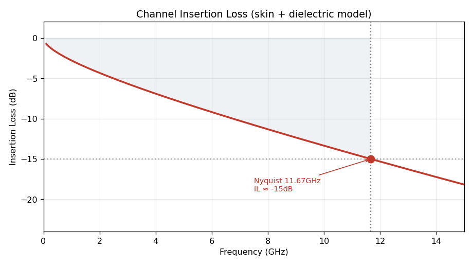
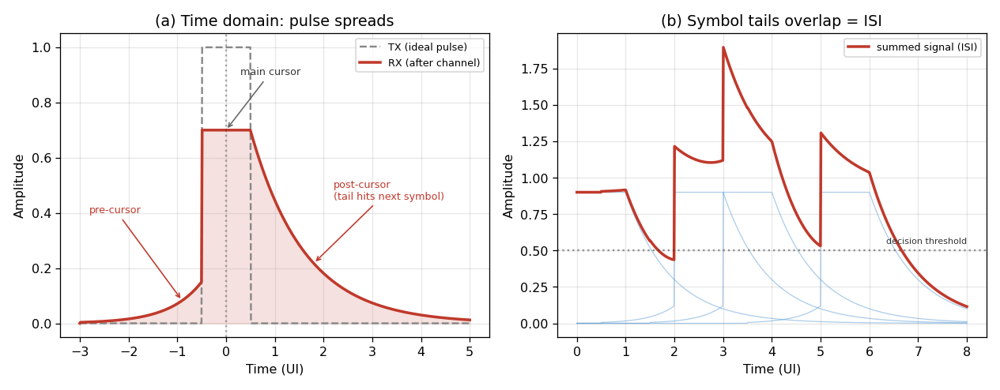
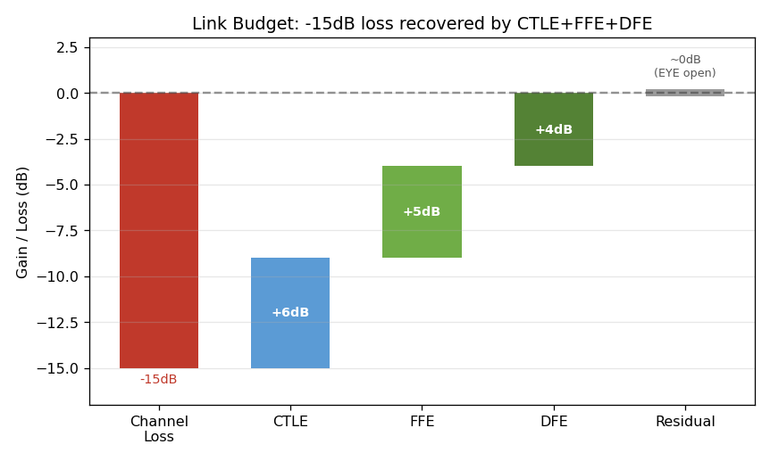
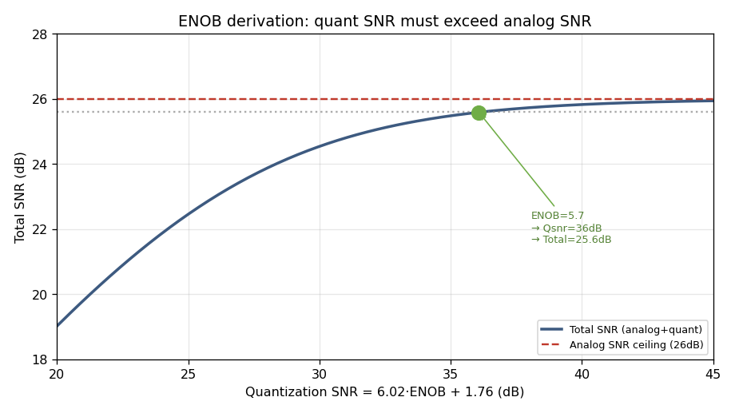

이 글은 **"SerDes: ADC-Based DSP-CDR 설계"** 시리즈의 2편이다. 1편에서 "설계는 채널에서 시작해 위에서 아래로 내려온다"고 했다. 이 편이 그 첫 단계다.

큰 줄기는 세 걸음이다. 먼저 **채널이 신호를 얼마나 왜곡시키는지**를 정량적으로 측정한다. 그다음 그 손실을 **어느 회로가 얼마씩 보상할지** 배분한다(Link Budget). 마지막으로 그 결과로부터 **ADC가 몇 비트여야 하는지**(ENOB)를 도출한다. 각 숫자의 근거를 하나도 건너뛰지 않고 따라간다.

---

## 1. 채널이 신호를 얼마나 왜곡시키나

### 왜 신호가 왜곡되는가

송신기에서 출발한 깨끗한 신호는 PCB 배선·커넥터·패키지·비아를 지나 수신기에 도달할 때쯤이면 상당히 왜곡되어 있다. 원인은 세 가지지만, 하나의 공통된 성질로 요약된다 — **주파수가 높을수록 더 크게 감쇠된다.**

- **표피 효과:** 주파수가 높을수록 전류가 도선 표면으로 몰려, 실제로 흐르는 단면이 좁아지고 저항이 커진다.
- **유전체 손실:** PCB 절연체가 고주파 에너지를 열로 흡수해버린다.
- **반사:** 임피던스가 갑자기 바뀌는 지점(커넥터·비아)에서 신호 일부가 되튄다.

앞의 둘은 명백히 고주파에서 심하고, 반사도 고주파일수록 커진다. 그래서 채널은 **고주파를 감쇠시키는 저역통과 필터**처럼 동작한다.

### 손실을 숫자로 — Insertion Loss

이 "깎임"을 정량화한 것이 **삽입 손실(Insertion Loss, IL)** 이다. 말 그대로 "각 주파수에서 신호가 몇 dB 줄어드는가"를 그린 곡선이다.



곡선을 보면 저주파는 거의 손실이 없다가 고주파로 갈수록 가파르게 떨어진다. 물리적으로 표피효과는 주파수의 제곱근(√f)에, 유전체 손실은 주파수(f)에 비례해 커진다.

```
IL(f) ≈ (표피효과 계수)·√f + (유전체 계수)·f     [dB]
```

### 왜 고주파 손실이 "번짐(ISI)"이 되는가

여기서 많이 혼동한다. 방금은 "고주파가 감쇠된다"는 **주파수 영역**의 설명이었는데, 실무에서는 같은 현상을 "펄스가 퍼진다"는 **시간 영역**으로도 표현한다. 둘이 왜 같은 말일까?

열쇠는 **푸리에 변환**이 알려주는 한 가지 성질이다.

> 시간축에서 **날카롭고 빠르게 변하는** 신호일수록, 주파수축에서 **높은 주파수 성분**을 많이 갖는다.

직관적으로 당연하다. 신호가 순식간에 확 올라가려면(날카로운 모서리), 그만큼 빠른 진동 — 즉 고주파 — 이 필요하다. 느릿한 신호는 저주파만으로 충분하다.

이제 이 성질을 뒤집어 채널에 적용하면:

```
송신 펄스 = 저주파(몸통) + 고주파(날카로운 모서리)
        │
        ▼ 채널이 고주파를 감쇠시킴
수신 펄스 = 저주파만 남음 → 모서리를 못 만듦 → 상승·하강이 느려짐
        │
        ▼
펄스가 시간축으로 퍼진다 (번짐)
```

즉 **고주파가 사라지면 신호가 빠르게 변할 능력을 잃고, 그 결과 펄스가 시간축으로 퍼진다.** 주파수축의 "고주파 손실"과 시간축의 "펄스 번짐"은 완전히 같은 현상의 두 얼굴이다.



**(a)** 송신의 날카로운 펄스(회색 점선)가 채널을 지나면 번진 펄스(빨강)가 된다. 원래 자기 자리(main cursor)를 벗어나 앞뒤로 꼬리가 생긴다.

**(b)** 진짜 문제는 심볼이 줄줄이 이어질 때다. 각 심볼의 번진 꼬리가 **옆 심볼 자리를 침범**한다. 여러 심볼의 꼬리가 겹치면 판정 문턱 근처에서 값이 흔들려, 0인지 1인지 헷갈리게 된다. 이 "한 심볼의 꼬리가 옆 심볼을 방해하는" 현상이 **ISI(Inter-Symbol Interference, 심볼 간 간섭)** 다.

:::note[번짐의 방향 — pre/post-cursor]
꼬리가 **뒤로** 생기면 post-cursor(지나간 심볼이 지금을 침범), **앞으로** 생기면 pre-cursor(다가올 심볼이 지금을 침범)다. 3편에서 보겠지만 이 구분이 중요하다 — DFE는 post-cursor만 지울 수 있고, FFE는 pre-cursor까지 지울 수 있다.
:::

결국 뒤에 나올 EQ가 하는 일은 하나다. **이 번짐(ISI)을 제거해 신호를 다시 선명하게 만드는 것.** 주파수 영역으로 말하면 "감쇠된 고주파를 복원하는 것"이며, 둘은 같은 일이다.

### 우리 채널의 손실 — Nyquist에서 −15dB

손실 곡선에서 **딱 한 점**이 가장 중요하다. 바로 **Nyquist 주파수에서의 손실**이다(Nyquist가 무엇인지는 3장에서 설명한다. 지금은 "신호에서 가장 빠른 성분의 주파수"로만 알아두면 된다). 신호의 가장 빠른 부분이 여기에 해당하고, 그게 가장 심하게 깎이기 때문이다.

우리 시스템은 M-PHY HS-G6, 46.694 Gbps PAM-4다. 심볼레이트가 23.347 GBaud이고, Nyquist는 그 절반인 **약 11.67 GHz**다. 이 주파수에서의 손실을 정하면:

```
Nyquist(11.67GHz)에서 IL ≈ -15 dB   (가정)
```

:::tip[−15dB가 실제로 뜻하는 것]
−15dB는 "신호 세기가 원래의 약 1/5.6로 줄어든다"는 뜻이다(전압 기준. 10^(−15/20) ≈ 0.178). 즉 송신기에서 선명하게 출발한 신호가 케이블·기판을 지나오는 동안 **가장 빠른 성분의 크기가 약 1/5.6로 감쇠되어**, 잡음에 묻히기 직전의 상태로 수신기에 도착한다는 의미다.

이 −15dB가 이 편 전체의 **출발점**이다. 앞으로 할 일은 명확하다 — 이 −15dB만큼 감쇠된 신호를, 수신기 내부의 회로들(CTLE·FFE·DFE)이 **합쳐서 +15dB만큼 보상해** 원래의 선명함을 복원하는 것이다. "얼마를 잃었으니 얼마를 보상해야 한다"는 이 예산표가 바로 **Link Budget**이며, 2장의 주제다.
:::

:::note[−15dB는 가정값이다]
이 −15dB는 M-PHY 기준 채널 템플릿의 성격과 UFS(모바일)의 짧은 채널 특성에 근거한 **합리적 추정**이지, 규격에서 읽은 확정 수치는 아니다. 정확한 값은 실제 채널을 측정(VNA)하거나 시뮬레이션(HFSS)해서 얻는다. 이 시리즈는 −15dB를 출발점으로 삼고, 나중에 실측값으로 바꾸면 그 뒤 계산이 전부 따라 갱신된다.
:::

---

## 2. Link Budget — 손실을 회로에 배분하기

−15dB만큼 손실됐으니 +15dB를 보상해야 한다. 문제는 **"이 +15dB를 어느 회로가 얼마씩 담당할까"** 이다. 이 배분표가 Link Budget이다.

수신기에는 손실을 되살리는(이퀄라이징) 회로가 세 종류 있다. 각자 잘하는 것과 못하는 것이 달라서, 그 특성이 배분량을 정한다.

### 세 EQ의 성격

**CTLE (아날로그 이퀄라이저)**
ADC 앞단의 아날로그 회로로, 감쇠된 고주파를 다시 부스트한다. 아날로그라 **낮은 전력으로 큰 이득을** 낸다. 대신 약점이 둘 있다. 첫째, 고주파를 부스트할 때 **그 대역의 잡음도 함께 증폭된다**(신호만 선택적으로 키울 수 없다. 이 현상을 업계에서는 **noise enhancement** 또는 noise amplification이라 부른다). 둘째, 아날로그 회로라 이득 곡선의 형태를 **세밀하게 조절하기 어렵다**.

**FFE (Feed-Forward Equalizer, "피드포워드")**
디지털에서 여러 개의 "탭"으로 앞뒤 심볼의 간섭을 계산해 제거한다. 가장 큰 강점은 **pre-cursor(다가올 심볼의 침범)를 제거할 수 있는 유일한 블록**이라는 점이다. 유연하지만, 감쇠된 고주파를 복원하는 과정에서 **CTLE와 마찬가지로 잡음을 함께 증폭한다**(noise enhancement).

**DFE (Decision-Feedback Equalizer, "피드백")**
이미 **판정이 끝난 심볼**(0/1/2/3처럼 깨끗하게 확정된 값)을 이용해, 그 심볼이 만드는 뒤쪽 간섭(post-cursor)을 빼준다. 결정적 장점은 **잡음을 키우지 않는다**는 것이다(noise/crosstalk neutral). 판정된 값에는 잡음이 없으니, 그걸로 만든 보정에도 잡음이 안 실린다. 그래서 뒤쪽 ISI 제거의 주력이다. 약점은 두 가지 — post-cursor**만** 제거할 수 있고(pre-cursor는 처리 불가), 판정이 한 번 틀리면 그 오차가 다음 보정으로 전파된다(error propagation).

### 왜 6 / 5 / 4로 나누나

이제 +15dB를 세 회로에 배분한다. **각 회로의 약점이 최소화되도록** 나누는 것이 원칙이다.

**CTLE에 가장 많이 (+6dB)** — 아날로그라 이득 비용이 가장 낮다. 큰 몫을 여기서 저비용으로 보상하는 것이 유리하다. 다만 잡음 증폭 때문에 무한정 늘릴 수는 없고, 안정적으로 동작하는 범위까지만 할당한다.

**DFE는 주고 싶지만 제약 때문에 +4dB** — DFE는 잡음을 안 키우니 이상적으론 여기 다 맡기고 싶다. 하지만 post-cursor만 지울 수 있고, 탭이 많아지면 오차 전파 위험과 타이밍 부담(피드백이 1심볼 안에 끝나야 함)이 커진다. 그래서 감당 가능한 만큼만.

**FFE가 나머지 + pre-cursor 담당 (+5dB)** — CTLE가 놓친 세밀한 부분과, DFE가 손 못 대는 **pre-cursor**를 FFE가 맡는다. 잡음 증폭이 약점이라 과하게는 못 준다.



```
채널 손실 -15dB 보상:
─────────────────────────────────
CTLE : +6 dB   (저비용 이득, 잡음 한계까지)
FFE  : +5 dB   (pre-cursor + 세밀한 보정)
DFE  : +4 dB   (post-cursor ISI, 무잡음이나 제약 있음)
─────────────────────────────────
합계 : +15 dB  → 손실 상쇄, 신호 선명해짐(EYE 열림)
```

:::note[+dB의 물리적 성격은 셋이 조금씩 다르다]
"세 회로가 +15dB를 나눠 담당한다"는 예산표는 개념을 잡는 데 유용하지만, 엄밀히 보면 각 +dB의 물리적 의미가 동일하지 않다. **CTLE의 +6dB**는 아날로그 회로가 실제로 고주파 이득(peaking gain)을 물리적으로 만들어내는 값이다. 반면 **FFE·DFE의 +dB**는 신호 진폭을 키우는 것이 아니라, ISI를 수학적으로 제거해 아이(eye)를 개방하는 **등가적 SNR 마진(equivalent eye opening)** 에 가깝다. 즉 전자는 "주파수 이득", 후자는 "ISI 제거로 얻는 등가 마진"이다. 예산표에서는 동일한 dB로 합산하지만, 물리적 성격은 다르다는 점을 유의하면 좋다. (정확한 배분 검증은 실제 eye/SNR 시뮬레이션이 필요하며, 3편에서 다룬다.)
:::

:::note[이건 "출발 배분"이다]
6/5/4는 각 회로의 성격에 근거한 **초기 배분**일 뿐이다. 3편에서 실제 채널로 FFE/DFE를 모델링해보면 "FFE 5dB로는 pre-cursor가 다 안 지워진다"거나 "DFE 4dB면 충분하다"가 나올 수 있고, 그러면 배분을 조정한다. 정확한 최적 배분은 실제 신호를 돌려봐야 나온다 — 그게 3편의 일이다.
:::

---

## 3. ADC 사양 정하기

Link Budget이 섰으니 ADC로 내려간다. ADC에서 정할 것은 세 가지 — **얼마나 자주 찍을지(샘플레이트), 어디까지 받을지(대역폭), 몇 비트로 받을지(ENOB)** 다.

### 먼저 Nyquist — 왜 심볼레이트의 절반인가

3장에서 미뤄둔 것부터 풀자. 왜 Nyquist가 심볼레이트의 절반일까?

**나이퀴스트-섀넌 샘플링 정리**가 답이다. 요지는 이렇다.

> 어떤 신호를 샘플링해서 정보 손실 없이 담으려면, 그 신호의 **최고 주파수의 2배 이상**으로 샘플링해야 한다.

이걸 뒤집으면, 샘플레이트 fs로 담을 수 있는 최고 주파수는 **fs의 절반**이고, 이 한계 주파수를 **Nyquist 주파수**라 부른다.

우리 신호에 적용하면 간단하다. 신호가 가장 빠르게 변하는 경우는 심볼 부호가 매번 바뀌는 패턴(…0101…)인데, 이때 만들어지는 주파수가 정확히 **심볼레이트의 절반**이다. 23.347 GBaud면 11.67 GHz. 이게 신호의 실질적 최고 주파수이고, 1장에서 채널 손실을 볼 때 하필 이 주파수를 기준으로 삼은 이유다.

### 샘플레이트 — 심볼당 딱 한 번 (baud-rate)

ADC가 얼마나 자주 찍을지 정한다. 여기서 중요한 선택이 있다.

옛날 방식은 심볼 하나당 **두 번**씩 찍었다(2배 오버샘플링). 위상 정보가 넉넉해 편했지만, 23.347 GBaud에서 두 번씩 찍으면 ADC가 **46.7 GS/s**로 돌아야 한다 — 전력과 면적이 감당이 안 된다.

그래서 **심볼당 딱 한 번**만 찍는다. 이걸 **baud-rate 샘플링**이라 부르는데, 용어를 정확히 짚자.

> **baud(보) = 초당 심볼 수**를 세는 단위다. 그러니 **baud-rate = 심볼레이트**이고, "baud-rate로 샘플링한다"는 곧 **"심볼레이트와 똑같은 속도로, 심볼 하나당 샘플 하나를 찍는다"**는 뜻이다.

```
심볼레이트 23.347 GBaud  (초당 23.347G개 심볼)
        │  심볼당 1샘플
        ▼
샘플레이트 23.347 GS/s    (초당 23.347G개 샘플)
```

심볼과 샘플이 1:1로 대응하니, **심볼이 곧 샘플**이 된다. 오버샘플링 대비 ADC 속도를 절반으로 아끼는 게 핵심이다.

대가는 위상 정보 부족이다. 심볼당 한 점뿐이라 "이 샘플이 심볼 한가운데서 찍혔나, 가장자리에서 찍혔나"를 바로 알 수 없다. 이 부족분은 뒤에서 **위상검출기가 간접적으로 추정**하고(5편), 심볼 사이의 정확한 위치는 **Interpolator가 μ만큼 옮겨서** 맞춘다(4편).

:::note[실물에서는 ADC를 여러 개 병렬로]
23.35 GS/s를 ADC 하나로 내기는 어렵다. 그래서 실제 칩은 느린 ADC 수십 개(예: 32~64개)를 살짝씩 엇갈리게 돌려 합산 속도를 내는 **타임인터리브** 구조를 쓴다. 1편에서 본 Intel(64개)·Xilinx(56GSa/s) 사례가 이것이다. 블록도의 "ADC" 한 칸이 실물에선 이 병렬 뭉치다.
:::

### 입력 대역폭 — 최소 Nyquist까지

ADC의 아날로그 입력 대역폭은 최소 **Nyquist(11.67GHz)까지 평탄**해야 한다. 여기서 또 감쇠가 생기면 그것도 손실이 되니까, 실제로는 여유를 둬 Nyquist보다 높게 잡는다. 이건 비교적 명확해서 더 볼 게 없다.

### 몇 비트로 받을까 — ENOB

가장 중요한 결정이 남았다. ADC를 몇 비트로 만들지다. "많을수록 좋다"가 아니다 — 비트가 많으면 전력·면적이 커지니, **딱 필요한 만큼만** 정해야 한다. 그 "필요한 만큼"을 계산하려면 먼저 두 종류의 잡음을 이해해야 한다.

#### 잡음이 두 종류다 — 아날로그 잡음과 양자화 오차

먼저 잡음이 어디서 유입되는지 보자. 신호가 수신기를 통과하는 동안, 잡음은 크게 두 곳에서 유입된다.

**① 아날로그 잡음 — ADC에 들어오기 전에 이미 껴 있는 것**
신호가 ADC에 도달하기 전, 아날로그 경로를 지나는 동안 여러 잡음이 이미 섞여 있다. 회로 소자가 스스로 내는 **열잡음**, CTLE가 고주파를 부스트하며 **함께 키운 잡음**(noise enhancement), 옆 레인에서 새어든 **크로스토크**, 그리고 EQ가 미처 못 지운 **잔류 ISI(residual/uncanceled ISI)** 등이다. 요점은 **신호가 이미 잡음이 섞인 채로 ADC에 도달한다**는 것이다.

**② 양자화 오차 — ADC가 새로 만드는 것**
ADC는 연속적인 아날로그 값을 정해진 칸으로 반올림한다. 예컨대 8비트 ADC는 전체 범위를 256칸으로 쪼개고, 입력값을 가장 가까운 칸에 대응시킨다. 0.617…이라는 값이 입력되어도 가장 가까운 칸(예: 0.615)으로 반올림되는데, 이 **반올림 때문에 생기는 오차**가 양자화 오차다. 칸이 촘촘할수록(비트가 많을수록) 오차가 작다 — 비트를 1개 늘리면 칸이 2배 촘촘해져 오차가 절반이 된다.

정리하면, 신호는 **아날로그 잡음이 이미 낀 채로** ADC에 오고, ADC가 거기에 **양자화 오차를 얹는다.**

#### 어느 지점의 SNR을 재야 하나 — 판정 지점(Slicer)

"얼마나 깨끗한가"를 재는 지표가 **SNR(Signal-to-Noise Ratio)** 이다 — 신호 크기가 잡음 크기보다 몇 배 큰지를 dB로 나타내며, 클수록 깨끗하다.

그런데 **어느 지점에서 재느냐**가 중요하다. 신호는 수신기를 지나며 계속 처리되므로, 지점마다 SNR이 다르다. 정답은 **맨 끝, 심볼을 최종 판정하는 Slicer 직전**이다. 이 지점을 **판정 지점(decision point)** 이라 부르고, 여기서의 SNR을 업계에서는 **Slicer SNR**이라 부른다.

왜 이 지점인가? **비트 오류(BER)는 오직 판정 지점에서 결정**되기 때문이다. Slicer가 신호를 4레벨 중 하나로 판정할 때, 그 순간 신호가 충분히 선명하면 정확히 판정되고 불명확하면 오판된다. 앞단에서 신호가 일시적으로 불명확했더라도 Slicer 직전에 선명해지면 문제없고, 반대로 앞단이 깨끗했어도 이 지점에서 불명확하면 오류가 발생한다.

:::note[Slicer SNR은 "모든 것의 종합"이다]
Slicer는 수신기의 맨 끝(FFE·DFE 다음)에 있다. 따라서 Slicer SNR에는 그 앞의 **모든 것**이 반영된다 — 아날로그 잡음, 양자화 오차, 그리고 FFE·DFE가 ISI를 얼마나 걷어냈는지까지. 즉 Slicer SNR은 "판정 직전, 신호가 이상적 레벨에서 얼마나 벗어났는가"를 잡음(랜덤)과 왜곡(잔류 ISI)을 **모두 합쳐** 잰 값이다. 이렇게 잡음과 왜곡을 함께 본 지표를 **SNDR(Signal-to-Noise-and-Distortion Ratio)** 이라고도 부른다. 이 시리즈에서 "Slicer SNR"이라 하면 이 종합 SNR을 뜻한다.
:::

앞으로 세 가지 SNR이 나온다. **각각 다른 것**이라 미리 구분해둔다.

| 이름 | 표준 용어 | 무엇인가 | 성격 |
|---|---|---|---|
| **요구 SNR** | Required slicer SNR | 목표 BER로 판정하려면 판정 지점에서 최소 이만큼은 필요하다는 합격선 | 넘어야 할 기준 |
| **확보 SNR** | Slicer SNR (SNDR) | 실제로 판정 지점에서 확보한 SNR. 앞단 모든 잡음+왜곡 종합 | 우리가 가진 것 |
| **양자화 SNR** | Quantization SNR (SQNR) | ADC의 양자화 오차만 따진 SNR (ENOB이 결정) | 우리가 설계할 것 |

목표는 이렇다. **확보 Slicer SNR(가진 것)이 요구 SNR(합격선)을 넘어야** 하고, 그 안에서 **양자화 오차가 판정 지점을 너무 깎지 않을 만큼 ADC가 충분히 좋아야** 한다. 이제 세 걸음으로 계산한다.

#### 1단계 — 요구 SNR: 합격선은 얼마인가

요구 SNR은 **PAM-4라는 신호 방식과 목표 BER만으로** 정해진다(아직 우리 회로와 무관하다). BER 공식에서 계산되는데, 결론부터 표로 보인다.

| 목표 raw BER | 필요 SNR (평균전력 기준) |
|---|---|
| 1e-3 | ~16.5 dB |
| **1e-4** | **~18.2 dB** |
| 1e-6 | ~20.4 dB |
| 1e-12 | ~23.9 dB |

M-PHY HS-G6는 **FEC(오류정정)** 를 쓴다. FEC가 뒤에서 오류를 정정해주므로, ADC 직후의 raw BER은 그렇게까지 낮을 필요가 없다. FEC가 감당 가능한 **raw BER 1e-4**를 목표로 잡으면 필요 SNR이 **약 18.2dB**. 여기에 온도·전압 변동 같은 실동작 여유 4dB를 더해:

```
요구 SNR ≈ 22 dB   (이론 최소 18.2dB + 설계 마진 4dB)
```

즉 **18.2dB가 이론적 최소치**, **22dB가 여유를 둔 설계 목표**다.

이는 ADC로 입력된 신호가 모든 보상회로를 거쳐 최종 심볼을 판정할 때 요구 BER 성능을 만족하기 위한 최소 SNR이 22dB라는 뜻이다.

보상 회로는 ADC로 입력된 신호를 어떤 방법을 써서라도 SNR 22dB이상이 되게 만들어야 한다.

:::note[표의 SNR이 어떻게 나오는지 — 펼쳐보기]
BER 공식에서 SNR을 역산하는 과정이다. 궁금하면 펼쳐보고, 아니면 "18.2dB는 BER 공식에서 나온다"만 알고 넘어가도 된다.

**① 오류율 공식.** PAM-4는 4레벨을 구분하는데, 잡음 σ 때문에 인접 레벨로 오판할 확률은 통계학의 **Q 함수**(정규분포 꼬리 넓이)로 주어진다.

```
심볼오류율 SER ≈ 1.5 · Q(d / 2σ)     (d = 레벨 간격, σ = 잡음 표준편차)
비트오류율 BER ≈ SER / 2 = 0.75 · Q(d / 2σ)
```

(계수 1.5는 PAM-M 일반식 2(M−1)/M에 M=4를 넣은 값. BER은 gray coding으로 심볼오류 1개당 비트오류 약 1개.)

**② Q 함수의 인자를 SNR로 바꾸기 (핵심 단계).** SNR을 "평균 신호전력 ÷ 잡음전력"으로 정의한다. PAM-4 레벨을 {−3d/2, −d/2, +d/2, +3d/2}로 놓으면:

```
평균 신호전력 S = [(3d/2)² + (d/2)² + (d/2)² + (3d/2)²] / 4 = 5·(d/2)²
잡음전력      N = σ²
SNR = S/N = 5·(d/2σ)²      →      d/2σ = √(SNR/5)
```

**③ 대입하면 BER과 SNR이 직접 연결된다.**

```
BER ≈ 0.75 · Q( √(SNR/5) )
```

**④ 검산 (BER = 1e-4).**

```
1e-4 = 0.75·Q(√(SNR/5))  →  Q(√(SNR/5)) = 1.33e-4
√(SNR/5) ≈ 3.65  →  SNR = 5·3.65² ≈ 66.6 (선형) = 18.2 dB   ✓
```

**주의.** 여기서는 SNR을 "평균전력 기준"으로 정의했다. 문헌마다 다른 정의(최외곽 레벨 기준, Eb/N0 등)를 쓰면 같은 BER에도 SNR 숫자가 몇 dB씩 달라진다. 값을 인용할 땐 어떤 정의인지 확인해야 한다.
:::

#### 2단계 — 확보 Slicer SNR: 우리가 실제로 가진 것

이제 "판정 지점에서 실제로 확보한 SNR은 얼마인가"를 계산해, 합격선(22dB)을 넘는지 본다. 송신기가 낼 수 있는 가장 깨끗한 신호에서 출발해, 판정 지점까지 가는 동안 유입되는 잡음과 왜곡을 하나씩 차감한다.

```
송신단 기본 SNR:        35 dB   (출발점)
  − CTLE 잡음 부스트:   -4 dB   (고주파 부스트하며 잡음도 증폭)
  − FFE 잡음 증폭:      -3 dB   (앞먹임이 고주파 잡음 키움)
  − 크로스토크/반사:    -3 dB   (옆 레인 간섭 + 임피던스 반사)
  − 잔류 ISI(왜곡):     -3 dB   (EQ가 못 지운 번짐)
─────────────────────────────────
확보 Slicer SNR:        22 dB
```

이 예산에는 아날로그 잡음(CTLE·크로스토크)과 디지털 처리의 영향(FFE), 잔류 왜곡(ISI)이 **모두** 들어간다 — 판정 지점 SNR이니 앞단 전부를 종합하는 게 맞다. (DFE는 잡음을 증폭하지 않으므로 이 목록에 없다 — 그것이 DFE의 장점이다. 각 숫자는 실제로는 회로·채널 시뮬레이션으로 확정해야 하는 값이라 여기서는 합리적 예시이지만, **35dB이던 SNR이 EQ의 잡음 증폭과 잔류 왜곡으로 22dB까지 저하된다**는 구조가 핵심이다.)

**그런데 문제가 있다.** 요구 SNR도 22dB, 확보 SNR도 22dB로 **여유가 0**이다(우연히 같은 값이라 더 헷갈리니 주의하자). 이 상태에서 ADC 양자화 오차까지 더하면 전체가 합격선 아래로 떨어진다. 그냥 둘 수 없다.

그래서 **위로 되돌아가 EQ를 더 강하게** 만든다 — FFE/DFE 탭을 늘려 잔류 ISI를 −3dB에서 −1dB로 줄이는 식이다. 그 결과 **확보 Slicer SNR을 26dB로 끌어올린다**(실제 달성 가능한지는 3편에서 검증). 이제 요구 22dB 대비 **4dB 여유**가 생겼다. 세 숫자의 관계를 정리하면:

```
요구 SNR:          22 dB   (합격선)
확보 SNR(초기):    22 dB   (계산해보니 딱 걸침 → 여유 0, 위험)
확보 SNR(EQ강화):  26 dB   (탭 늘려 4dB 여유 확보) ← 이 값을 3단계로 넘긴다
```

:::tip[여기서 "되돌아가기"가 실제로 일어난다]
여유 0 → EQ 강화는 top-down 설계가 한 번에 안 끝나고 반복된다는 걸 보여준다. Link Budget 배분(6/5/4)이 SNR 관점에선 빠듯했던 것이다. 아래에서 막히면 위로 돌아가 배분을 고치는 이 과정이 실제 설계의 모습이다.
:::

#### 3단계 — ENOB: ADC가 몇 비트여야 하나

2단계에서 확보한 Slicer SNR은 26dB다. 그런데 이 26dB에는 **아직 ADC 양자화 오차가 안 들어가 있다.** ADC가 양자화 오차를 얹으면 판정 지점 SNR은 26dB보다 **떨어진다.** 얼마나 떨어지느냐가 ENOB에 달렸다. ADC가 신호를 너무 깎지 않을 만큼의 ENOB을 찾는 게 목표다.

먼저 두 잡음이 합쳐질 때 전체가 어떻게 되는지 알아야 한다. 기호를 약속하자.

| 기호 | 뜻 |
|---|---|
| `SNR_s` | 확보 Slicer SNR, 양자화 전 (26dB, 가진 것) |
| `SNR_q` | 양자화 SNR (ENOB이 결정, 설계할 것) |
| `SNR_tot` | 양자화까지 합친 최종 판정 지점 SNR (결과) |

**핵심 원리:** 서로 무관한 두 잡음은 **크기(전력)가 그냥 더해진다.** 양자화 전 잡음(Slicer SNR을 정한 것)과 양자화 오차는 서로 무관하므로, 전체 잡음 = 양자화 전 잡음 + 양자화 오차다. 이걸 SNR로 바꾸면 다음 관계가 나온다(유도는 아래 note).

```
   1          1          1
─────── = ─────── + ───────
SNR_tot    SNR_s      SNR_q
```

말로 풀면 **"최종 SNR의 역수 = 두 SNR의 역수를 더한 것"** 이다. 저항의 병렬 연결과 동일한 형태로, **최종 SNR은 항상 둘 중 더 나쁜(작은) 쪽에 지배된다** — 더 큰 잡음원이 전체 성능을 제한하기 때문이다.

:::caution[반드시 선형(linear) 스케일에서 계산할 것]
이 역수 합 공식은 **dB가 아니라 선형(linear) 전력비**에서만 성립한다. 아래 표의 26dB·36dB 같은 dB 값을 공식에 **그대로 대입하면 틀린다.** 반드시 선형으로 바꿔 계산한 뒤 결과를 다시 dB로 되돌려야 한다. 예를 들어 `SNR_s` = 26dB(선형 약 398), `SNR_q` = 36dB(선형 약 3981)라면:

```
1/SNR_tot = 1/398 + 1/3981 ≈ 0.002513 + 0.000251 ≈ 0.002764
SNR_tot ≈ 1/0.002764 ≈ 362 (선형)
       = 10·log10(362) ≈ 25.6 dB
```

26dB에서 0.4dB 저하된 결과다. (dB↔선형 변환: 선형 = 10^(dB/10).) 아래 표의 숫자들은 모두 이렇게 선형에서 계산한 값이다.
:::

:::note[위 공식이 어디서 나오는지]
`S`를 신호전력, `N_s`·`N_q`를 두 잡음전력이라 하면(N_s = 양자화 전 잡음, N_q = 양자화 오차), 전체 잡음은 `N_s + N_q`다. 최종 SNR은:

```
SNR_tot = S / (N_s + N_q)
```

역수를 취하고 분자를 쪼개면:

```
1/SNR_tot = (N_s + N_q)/S = N_s/S + N_q/S = 1/SNR_s + 1/SNR_q
```

즉 임의로 만든 식이 아니라 "무관한 잡음 전력은 더해진다"는 원리에서 바로 나온다. (모든 항이 선형 전력비임에 유의.)
:::

이 공식으로 이제 **"ADC를 얼마나 좋게(=양자화 SNR을 몇 dB로) 만들면, 확보한 26dB가 과도하게 저하되지 않을까"** 를 분석한다. 양자화 SNR을 여러 값으로 바꿔가며 최종 SNR을 계산한 표다.



| 양자화 SNR (`SNR_q`) | 최종 SNR (`SNR_tot`) | 26dB 대비 손실 |
|---|---|---|
| 26 dB (Slicer SNR과 동급) | 23.0 dB | **-3.0 dB** (너무 많이 깎임) |
| 32 dB (+6 위) | 25.0 dB | -1.0 dB |
| 36 dB (+10 위) | 25.6 dB | **-0.4 dB** ✓ |

행별로 살펴보자. 각 행은 "ADC를 이 성능으로 만들면 → 최종이 이렇게 된다"를 의미한다.

- **첫 줄 (양자화 SNR 26dB):** ADC가 신호와 **똑같은 수준으로만** 깨끗한 경우다. 같은 크기의 잡음 두 개가 합쳐지면 잡음이 2배가 되고, 잡음 2배는 곧 SNR 절반, dB로는 **−3dB**다. ADC가 신호만큼의 잡음을 통째로 하나 더 얹는 셈이라 손실이 크다.
- **둘째 줄 (32dB, 신호보다 6dB 깨끗):** ADC를 신호보다 깨끗하게 만드니 ADC가 얹는 잡음이 작아져, 손실이 1dB로 줄었다.
- **셋째 줄 (36dB, 신호보다 10dB 깨끗):** ADC가 신호보다 훨씬 깨끗하니 ADC 잡음이 거의 안 보일 만큼 작아져, 손실이 0.4dB뿐이다.

규칙은 분명하다. **ADC를 깨끗하게(양자화 SNR을 높게) 만들수록 ADC가 얹는 잡음이 작아져, 최종 손실이 준다.**

그렇다면 ADC를 무한정 좋게 만들면 되지 않을까? 그렇지 않다. **ADC 성능을 높이는 것 = 비트 수 증가 = 전력 증가**이기 때문이다. 그래서 "손실이 충분히 작아지는 최소 지점"에서 멈춰야 한다. 표에서 그 지점이 **양자화 SNR 36dB(신호보다 +10dB 위)** 다 — 손실이 0.4dB로 사실상 무시할 수 있고, 여기서 더 높여봐야 손실 감소는 미미한 반면 전력만 낭비된다. 이 상태에서는 **최종 SNR이 사실상 양자화 전 값(26dB)으로 결정되고, ADC는 전체 성능을 제한하지 않는다.** 이것이 "양자화 SNR을 Slicer SNR보다 +10dB 위로 둔다"는 실무 관행의 근거다.

목표를 **양자화 SNR 36dB**로 정했으니, 마지막으로 "36dB를 내려면 ADC가 몇 비트여야 하나"를 구한다. 양자화 SNR과 비트 수는 공식으로 연결된다.

```
양자화 SNR = 6.02 × N + 1.76      (N = 비트 수)
```

이 공식은 "비트 1개 늘리면 양자화 SNR이 약 6dB 좋아진다"는 뜻이다(앞에서 본 "비트 1개당 칸 2배 = 오차 절반 = 6dB" 그것). 우리는 36dB를 원하니, N에 대해 거꾸로 풀면:

```
36 = 6.02 × N + 1.76
34.24 = 6.02 × N
N = 34.24 / 6.02 ≈ 5.7 bit
```

즉 **양자화 SNR 36dB를 내려면 ADC가 유효 5.7비트**여야 한다.

#### 4단계 — 실제 비트 수로 환산

ENOB 5.7은 **유효** 비트다. 실제 ADC는 클럭 흔들림(지터)·소자 비선형성·열잡음이 하위 비트를 오염시켜, 만든 비트 수보다 유효 비트가 적게 나온다. 23GS/s급 고속 ADC는 이 손실이 커서:

```
필요 ENOB:            5.7 bit
유효비트 손실 보상:   +1.5~2 bit  (고속일수록 큼)
─────────────────────────────
실제 ADC 설계 비트:   7~8 bit
```

즉 "유효 5.7비트"를 확보하려면 실제로는 7~8비트짜리 ADC를 만들어야 한다. 이 격차가 고속 ADC 설계가 어렵고 전력을 많이 먹는 이유다.

:::note[4편의 가정 6.5bit와 왜 다른가]
4편(Interpolator)에서는 ENOB을 6.5로 가정했는데 여기선 5.7이 나왔다. 둘 다 합리적 범위이고, 차이는 **양자화 전 Slicer SNR을 몇 dB로 잡느냐, 양자화 여유를 몇 dB로 두느냐**에서 온다. Slicer SNR을 더 높이거나 여유를 +12dB로 키우면 ENOB 요구가 6.5로 올라간다. 즉 ENOB은 이 예산 숫자들에 민감하며, 실제 값은 채널·회로 시뮬레이션으로 확정한다. 이 시리즈의 숫자들이 서로 맞물려 있다는 걸 보여주는 예다.
:::

---

## 4. 이 편에서 정한 것

```
═══════════════════════════════════════════
 Link Budget & ADC 사양
───────────────────────────────────────────
 채널 Nyquist 손실   -15 dB (가정)  → 보상해야 할 양
 EQ 배분            CTLE +6 / FFE +5 / DFE +4 dB
                    (성격 기반 초기 배분, 3편에서 검증)
 ─────────────────────────────────────────
 ADC 샘플레이트      23.35 GS/s (= 심볼레이트, 심볼당 1샘플)
 ADC ENOB           ~5.7 bit (양자화 SNR 36dB 목표)
 ADC 실제 비트       7~8 bit (유효비트 손실 보상)
 ADC 입력 대역폭     ≥ 11.67 GHz (Nyquist 이상)
 ─────────────────────────────────────────
 → EQ 후 통과대역     (3편에서 확정 → 4편 Interpolator 입력)
 → EQ 후 Slicer SNR ~26 dB  (→ 5편 CDR 수렴 능력)
═══════════════════════════════════════════
```

## 정리

- **채널은 고주파를 깎는다.** 그 깎임(삽입손실)이 Nyquist(11.67GHz)에서 −15dB. 이는 신호의 가장 빠른 성분이 원래의 1/5.6로 줄어든다는 뜻이고, 이 편 전체의 출발점이다. 주파수축의 "고주파 손실"은 시간축의 "펄스 번짐(ISI)"과 같은 현상이다 — 날카로운 모서리를 만들 고주파가 사라지기 때문.
- **Link Budget은 −15dB를 보상하는 예산표.** CTLE(+6, 저비용 이득)·FFE(+5, pre-cursor)·DFE(+4, 무잡음이나 제약)가 각자의 특성에 맞게 분담해 +15dB를 복원한다.
- **Nyquist는 샘플링 정리에서** 나온다 — 샘플레이트의 절반. **baud-rate = 심볼레이트**이고, 심볼당 1샘플이라 심볼이 곧 샘플이다.
- **잡음은 두 종류.** ADC 전에 이미 낀 **아날로그 잡음**(열잡음·크로스토크·잔류ISI 등)과, ADC가 반올림하며 새로 만드는 **양자화 오차**다. 이 둘을 합쳐 전체 SNR이 정해진다.
- **ENOB은 세 SNR의 관계로 도출.** 요구 22dB(합격선) < 확보 Slicer SNR 26dB(가진 것)를 확보하고, 양자화 SNR을 그보다 +10dB 위(36dB)로 두어 ADC가 전체 성능을 제한하지 않게 하면 ENOB ≈ 5.7bit → 실제 7~8bit.

다음 **3편**에서는 배분의 디지털 몫 — **FFE와 DFE가 실제로 어떻게 ISI를 지우는지**를 MATLAB으로 모델링한다. pre-cursor와 post-cursor를 각각 어떻게 제거하는지, 그리고 여기서 "가진 것"으로 미뤄둔 EQ 후 통과대역과 SNR이 실제 숫자로 확정되는 과정을 따라간다.