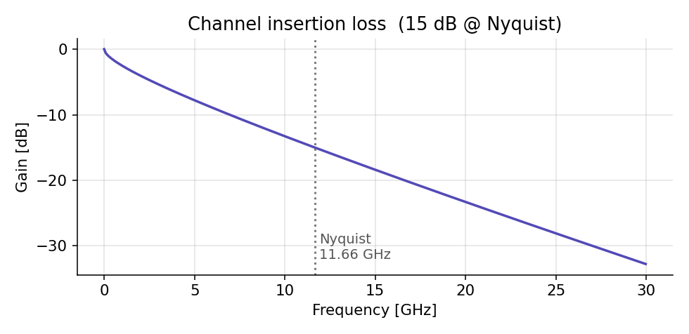
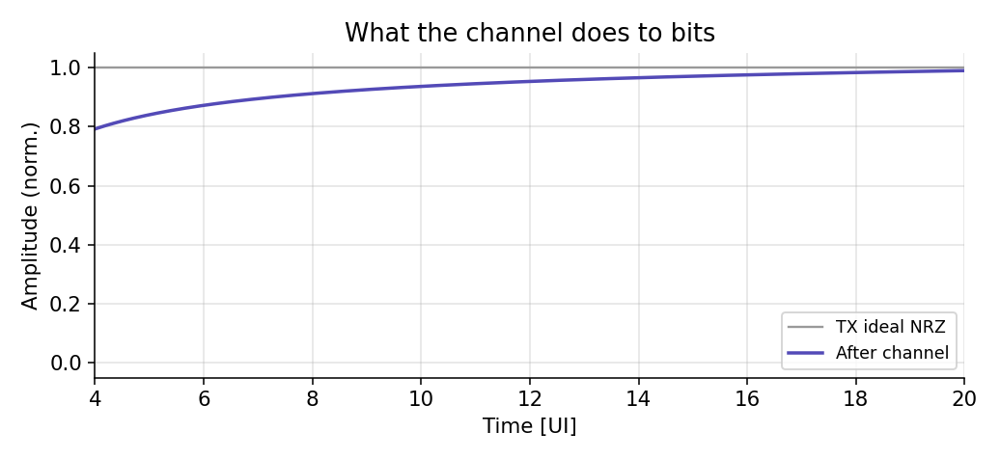
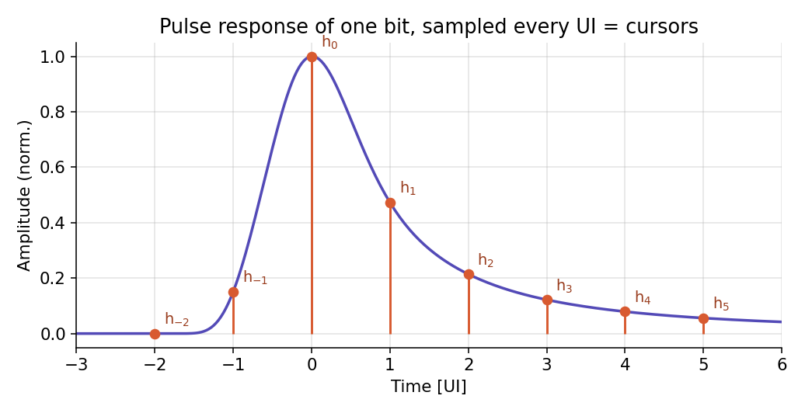
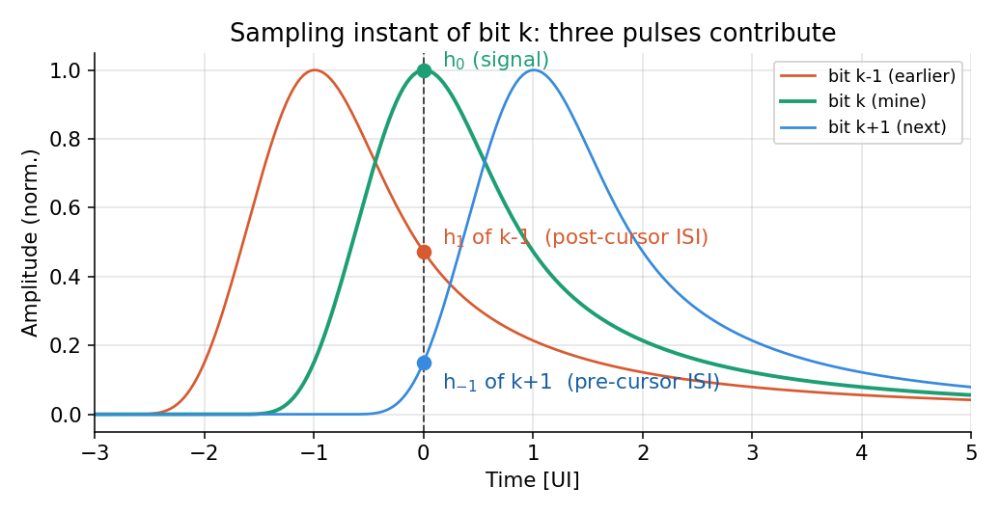
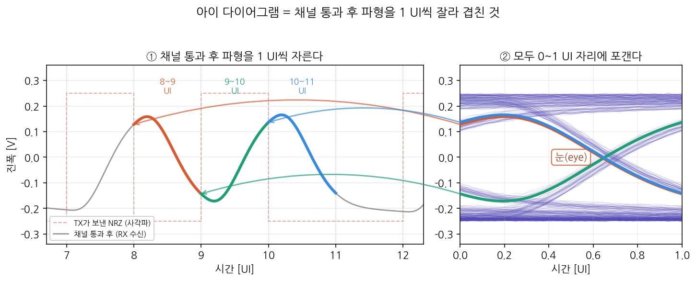
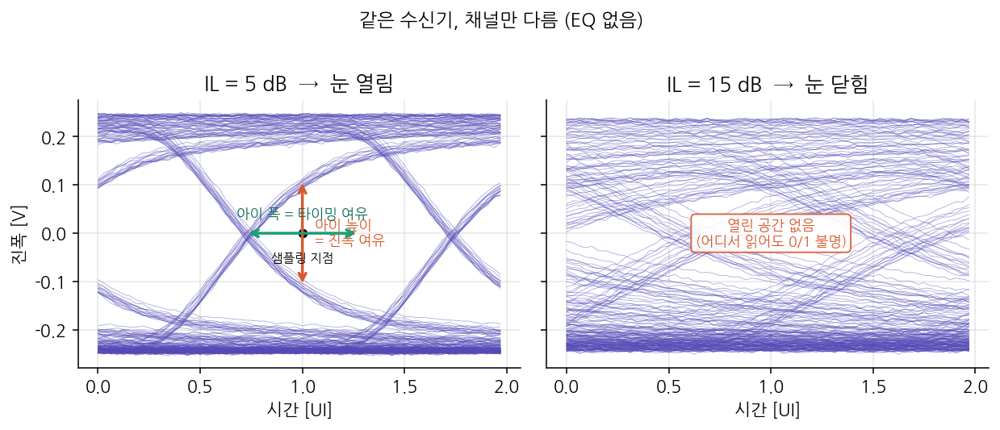
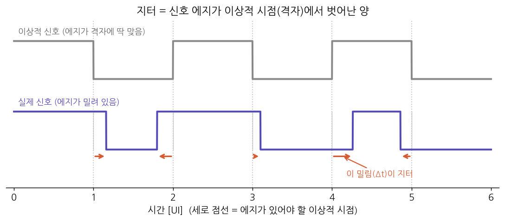
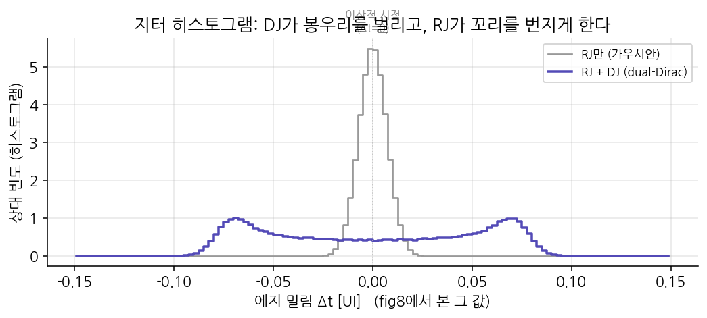

이 글은 **"SerDes 링크 골든 모델"** 시리즈의 1편이다. 링크 버짓도, 이퀄라이저도, CDR도 아직 없다. 그 전에 **적(敵)이 누구인지**부터 안다 — 채널이 신호를 어떻게 망가뜨리는지, 그 망가짐을 무슨 단어(커서, ISI, 지터)로 부르는지, 성적표(아이 다이어그램)는 어떻게 읽는지. 이 어휘가 없으면 다음 편부터의 모든 문장이 안 읽힌다.

:::note[이 글의 그림에 대해]
모든 그림은 개념도가 아니라 **골든 모델 코드가 실제로 계산한 파형**이다(23.32 Gbps NRZ, 15 dB 손실 채널). 리포지토리에서 `make_figs_basics`를 실행하면 MATLAB에서 동일하게 재생성된다. 즉 이 글의 그림을 이해하면, 코드의 변수들을 이미 절반은 이해한 것이다.
:::

## 1. 문제 설정 — 선 하나로 초당 233억 비트

SerDes(Serializer/Deserializer)는 병렬 데이터를 **선 한 쌍(차동)**에 직렬로 밀어 넣어 보내고, 반대편에서 되살리는 기술이다. 우리가 다루는 속도는 23.32 Gbps. 초당 233.2억 비트이니, **비트 하나에 허용된 시간**은:

$$
1\ \text{UI} = \frac{1}{23.32\ \text{Gbps}} = 42.9\ \text{ps}
$$

이 시간 단위를 **UI(Unit Interval)**라 부르고, 이후 모든 타이밍은 ps가 아니라 UI 비율로 말한다. "지터 0.15 UI"는 속도가 바뀌어도 "아이 폭의 15%를 잡아먹는다"는 의미가 유지되지만, "지터 6.4 ps"는 속도를 알아야만 심각한지 판단할 수 있기 때문이다.

:::tip[스케일 감각]
임베디드/FPGA에서 흔한 245.76 MHz 클럭의 1주기는 4.07 ns다. 42.9 ps는 그것의 **95분의 1**. 나노초 세계에서 피코초 세계로 넘어온 것이고, 이 스케일에서는 PCB 트레이스 몇 cm가 "회로"처럼 행동하기 시작한다. 그게 다음 절의 주제다.
:::

## 2. 적의 정체 — 채널은 고주파만 골라 죽인다

TX와 RX 사이의 PCB 트레이스·커넥터·케이블을 통틀어 **채널**이라 부른다. 채널이 신호를 얼마나 깎아먹는지를 나타내는 값이 **삽입손실(IL, Insertion Loss)**이다. 어떤 주파수의 신호를 넣었을 때 반대편에서 진폭이 얼마나 줄어드는지를 dB로 표기하며, 값이 클수록 많이 깎인 것이다(예: 15 dB면 진폭이 약 1/5.6로 감소). IL은 주파수마다 다른데, 표피효과($\sqrt{f}$에 비례)와 유전체 손실($f$에 비례) 때문에 **높은 주파수일수록 더 많이 깎인다.**

세로축이 IL이다(음수로 표기 — 아래로 내려갈수록 손실이 큼). 우리 예제 채널은 나이퀴스트 주파수(11.66 GHz — NRZ의 가장 빠른 패턴 1010…이 만드는 주파수)에서 **약 15 dB**가 깎인다. 이후 글에서 "15 dB 채널", "IL 5 dB" 같은 표현은 전부 **나이퀴스트에서의 IL 값**을 가리킨다 — 채널 난이도를 숫자 하나로 말할 때 업계가 쓰는 관례다. 저주파는 거의 안 깎이는데 고주파만 죽는다는 게 핵심이다.

왜 이게 치명적인가? 데이터 파형에서 **"빠른 천이(에지)"가 곧 고주파 성분**이기 때문이다. 고주파만 선택적으로 죽이면 에지가 뭉개지고, 뭉개진 에지는 자기 비트 시간 안에 정착하지 못한다. 실제로 어떻게 되는지 보자.

회색이 TX가 보낸 반듯한 NRZ, 보라색이 채널을 지난 뒤다. 각진 계단이 뭉개진 곡선이 됐고, 특히 **비트가 빠르게 뒤바뀌는 구간(1010…)은 진폭이 절반도 못 올라가는** 반면, 같은 값이 이어지는 구간은 멀쩡하다. 고주파만 죽었다는 증거가 파형에 그대로 보인다.

한 문장 요약: **주파수 영역의 저역통과 = 시간 영역의 심볼 번짐.**

## 3. 한 비트만 따로 보기 — 펄스 응답과 커서

번짐을 정량화하려면 트릭을 하나 쓴다. **딱 1비트만 보내고** 채널 출력을 관찰하는 것. 이 출력이 **펄스 응답**이고, 여기에 이 시리즈 전체에서 가장 중요한 개념이 들어 있다.

수신기는 UI마다 한 번씩 값을 읽으므로, 펄스 응답을 **UI 간격으로 샘플링한 값들**이 의미를 갖는다. 이 값들을 **커서(cursor)**라 부른다. 그림의 주황 점들이다.

- **h₀ (메인 커서)** — 피크 값. 내 비트가 판정 시점에 전달하는 "신호"다.
- **h₋₁, h₋₂ (프리커서, pre-cursor)** — 피크보다 **앞**의 값. 펄스가 피크에 도달하기 전에 미리 올라와 있는 앞자락이다.
- **h₁, h₂, … (포스트커서, post-cursor)** — 피크 **뒤**의 값. 펄스가 제때 꺼지지 못하고 남긴 꼬리(잔상)다.

그림에서 확인하라: 이 채널은 h₁이 h₀의 절반 가까이 되고, 꼬리가 5 UI 넘게 이어진다. 1비트를 보냈는데 그 흔적이 **비트 대여섯 개 분량의 시간에 걸쳐** 남는 것이다.

:::tip[이름 외우는 법]
cursor(커서) = "판정 시점". **pre**-cursor(프리커서)는 판정 시점보다 **먼저 도착해 있는** 성분, **post**-cursor(포스트커서)는 판정 시점 **이후까지 남는** 성분. 방향만 기억하면 안 헷갈린다.
:::

## 4. 커서가 왜 문제인가 — ISI와 아이 폐쇄 조건

실전에서는 비트를 연달아 보낸다. 각 비트가 저마다 위 그림처럼 번지고, 수신 파형은 그것들이 **전부 겹친 합**이다. 비트 k의 판정 시점에 무슨 일이 벌어지는지 보자.

판정 시점(점선)에서 세 펄스가 동시에 값을 내놓는다.

- 초록(내 비트 bₖ): 자기 피크에 있으므로 **h₀** — 이건 신호.
- 빨강(직전 비트 bₖ₋₁): 자기 피크에서 1 UI 지난 지점이므로 꼬리값 **h₁** — 포스트커서 간섭.
- 파랑(다음 비트 bₖ₊₁): 자기 피크 1 UI **전** 지점이므로 앞자락 값 **h₋₁** — 프리커서 간섭.

여기서 흔한 혼란 하나를 정리하자. "다음 비트가 어떻게 지금을 간섭하지? 미래가 과거에 영향을 주나?" — 아니다. **bₖ₊₁의 전송은 물리적으로 이미 시작됐고, 그 펄스의 앞자락이 번져서 일찍 도착해** 내 판정 시점에 걸친 것뿐이다. 인과율 위반이 아니라 그냥 겹침이다.

이 간섭의 총합을 **ISI(Inter-Symbol Interference, 심볼 간 간섭)**라 한다. 3절 그림(fig3)에서 읽은 우리 채널의 실제 커서 값으로 계산해 보자. $h_0$을 1로 정규화하면 커서는 대략

$$
h_{-1} = 0.15,\quad h_0 = 1.00,\quad h_1 = 0.47,\quad h_2 = 0.21,\quad h_3 = 0.12,\ \dots
$$

이다. 비트를 연달아 보내면 판정 시점의 수신값 $y_k$는, 내 비트가 주는 신호에 이웃 비트들이 자기 커서만큼 얹는 간섭이 더해진 것이다. 예컨대 앞뒤 몇 비트만 보면

$$
y_k = \underbrace{1.00\,b_k}_{\text{신호 }h_0}
    + \underbrace{0.47\,b_{k-1} + 0.21\,b_{k-2} + \cdots}_{\text{포스트커서 ISI}}
    + \underbrace{0.15\,b_{k+1}}_{\text{프리커서 ISI}}
$$

여기서 $b$들은 각각 $+1$ 또는 $-1$이다. **가장 나쁜 경우**는 이웃 비트들이 하필 전부 내 신호와 반대 부호로 정렬돼, 모든 간섭이 신호를 깎는 방향으로 쌓일 때다(충분히 긴 데이터에는 이런 패턴이 반드시 등장한다). 그때 남는 아이 높이는:

$$
\text{최악 아이 높이} = \underbrace{h_0}_{\text{신호}} - \underbrace{\sum_{k \neq 0} |h_k|}_{\text{ISI 총합}}
$$

**이 부등식이 이 글의 핵심이다.** 우리 채널에 넣어 보면 ISI 총합($0.15 + 0.47 + 0.21 + \cdots$)이 신호 $h_0 = 1.00$을 **넘어선다**. 즉 최악 아이 높이가 음수가 되고, 이는 "어떤 데이터 패턴에서는 신호가 간섭에 완전히 파묻힌다"는 뜻이다 — **아이가 닫힌 것**이다. 5절에서 이 상태를 그림으로 직접 확인한다.

정리하면, 아이가 열려 있으려면 $h_0 > \sum_{k\neq 0}|h_k|$, 즉 **내 신호가 모든 간섭의 합보다 커야** 한다. 채널 손실이 크면 이 조건이 깨지고, 그래서 이퀄라이저가 선택이 아닌 **의무**가 된다.

:::note[다음 편 예고 — 커서의 종류가 곧 이퀄라이저의 분업표다]
프리커서와 포스트커서를 굳이 구분하는 이유는 **지우는 방법이 다르기 때문**이다. 포스트커서는 "이미 판정한 비트"의 잔상이라 수신기가 판정값으로 되짚어 뺄 수 있고(DFE), 프리커서는 "아직 판정 전인 비트"의 앞자락이라 수신기는 못 지우고 — 자기가 보낼 비트를 전부 아는 **송신기**가 미리 보상해야 한다(FFE). 이 분업이 링크 버짓 편의 뼈대가 된다.
:::

## 5. 성적표 — 아이 다이어그램

지금까지 본 파형은 시간이 흐르는 대로 쭉 늘어놓은 것이라, 비트 수천 개를 한눈에 판단할 수 없다. 그래서 **파형을 UI 단위로 잘라 같은 자리에 포개는** 트릭을 쓴다. 이것이 **아이 다이어그램**이고, 만들어지는 과정은 다음과 같다.

왼쪽이 연속 파형이고, 세로 점선이 1 UI 경계다. 여기서 UI 조각 세 개(주황·초록·파랑)를 골라 표시했다. 오른쪽은 그 조각들을 화살표를 따라 **전부 $0 \sim 1$ UI 자리에 겹쳐 옮긴** 것이다. 조각마다 앞뒤 비트가 달라 모양이 제각각인데(올라가는 것, 내려가는 것, 평평한 것), 이런 조각을 수백 개 포개면(뒤의 옅은 보라색) 결국 **가운데에 아무 선도 지나가지 않는 빈 공간**이 남는다. 이 공간이 "눈(eye)"이다.

:::note[왜 NRZ인데 사각파가 아니라 곡선인가?]
왼쪽 그림의 빨간 점선이 TX가 **보낸** 신호 — 반듯한 사각파(NRZ)다. 그런데 회색 실선(RX가 **받은** 신호)은 둥근 곡선이다. 사각파의 날카로운 모서리를 만들려면 **아주 높은 주파수 성분**이 필요한데(사각파 = 기본 주파수 + 무수한 고조파의 합), 2절에서 봤듯이 **채널은 그 고주파를 골라 죽인다.** 그래서 모서리가 먼저 뭉개지고 저주파 성분만 남아 곡선이 된다. 특히 010110처럼 빠르게 바뀌는 구간은 나이퀴스트 근처의 고주파라 거의 정현파만 남고, 111·000처럼 같은 값이 이어지는 저주파 구간은 손실이 적어 원래의 평평한 모양을 유지한다. 즉 **이 곡선의 뭉개짐 자체가 채널 손실의 증거**이고, 바로 이 뭉개짐 때문에 "그래도 0과 1을 구분할 수 있나?"를 판단하는 아이 다이어그램이 필요하다.
:::

눈이 왜 중요한가: 수신기는 매 UI마다 **한 시점**을 골라 값을 읽어야 하는데, 눈이 크다는 것은 "어느 데이터 패턴이 와도 그 시점에서 0과 1이 확실히 갈린다"는 뜻이다. 그래서 눈의 **높이는 진폭 여유**(노이즈가 이만큼 실려도 안 틀림), **폭은 타이밍 여유**(샘플링 시점이 이만큼 흔들려도 안 틀림)를 나타낸다.

이제 4절에서 말한 아이 폐쇄 조건이 그림으로 어떻게 나타나는지 보자.

**왼쪽 (5 dB 채널)**: 눈이 크게 열려 있다. 검은 점으로 표시한 아이 중앙(1 UI 지점)에서 세로로 재면 위쪽 선 뭉치와 아래쪽 선 뭉치 사이에 **뚜렷한 간격(아이 높이)**이 있다 — 이 지점에서 읽으면 값이 양수면 1, 음수면 0으로 명확히 갈린다. 가로로 잰 **아이 폭**은 이 안전한 샘플링 시점의 허용 범위다.

**오른쪽 (15 dB 채널)**: 수신기는 그대로 두고 채널만 바꿨다. 4절의 부등식대로 ISI 총합이 신호 $h_0$을 넘어서면서, 위·아래 선 뭉치가 서로 침범해 **가운데 빈 공간이 완전히 메워졌다.** 세로로 어디를 재도 위아래 선이 겹쳐 있으니, **어느 시점에서 읽어도 0인지 1인지 판정 불가능**하다. 4절에서 숫자로 계산한 "아이 폐쇄"가 정확히 이 그림이다.

두 그림의 차이가 이 시리즈 전체의 목표를 정의한다. 이퀄라이저의 성능은 앞으로 전부 **"닫힌 오른쪽 눈을 얼마나 다시 열어젖히는가"**로 평가된다. 다음 편의 링크 버짓은 그 "여는 작업"을 어떤 블록에 얼마씩 시킬지 정하는 예산표다.

## 6. 마지막 적 — 지터 (Jitter)

지금까지는 진폭(세로축)의 적을 봤다. 시간(가로축)에도 적이 있다. 바로 **지터(jitter)**다.

먼저 "신호 에지가 이상적 시점에서 벗어난다"가 무슨 말인지부터 그림으로 보자.

**에지(edge)**란 신호가 0에서 1로, 또는 1에서 0으로 **값이 바뀌는 순간**이다. 이상적인 신호라면 이 에지가 항상 **정확히 UI 격자 위**(위 그림의 세로 점선)에 놓여야 한다 — 1 UI마다 규칙적으로. 위쪽 회색 신호가 그런 이상적인 경우다.

그런데 실제 신호(아래 보라색)는 에지가 격자에서 **조금씩 밀려 있다.** 어떤 에지는 일찍 오고, 어떤 에지는 늦게 온다. 이 **"있어야 할 시점에서 벗어난 양(Δt)"**이 바로 지터다. 왜 문제인가? 수신기는 아이의 가운데(에지에서 반 UI 떨어진 지점)에서 값을 읽는데, 에지가 흔들리면 **"가운데"가 어디인지도 같이 흔들려** 잘못된 시점에서 읽을 위험이 커지기 때문이다. 5절 아이 다이어그램에서 "아이 폭 = 타이밍 여유"라고 한 것이, 바로 이 지터를 견딜 수 있는 여유였다.

이제 에지 수십만 개의 밀림(Δt)을 히스토그램으로 쌓으면, 지터가 두 종류의 성분으로 이루어져 있음이 드러난다.

- **RJ (랜덤 지터, Random Jitter)** — 회색 곡선. 근원이 열잡음이라 **가우시안(Gaussian) 분포**다. 문제는 가우시안 꼬리가 무한하다는 것: 오래 측정할수록 최대값이 계속 커지므로 "peak-to-peak(최대치–최소치)"가 정의되지 않는다. 그래서 분포의 폭인 **rms($\sigma$)로만** 표기한다.
- **DJ (결정성 지터, Deterministic Jitter)** — 보라색에서 봉우리가 **둘로 갈라진** 성분. 전원 노이즈 톤, 듀티 사이클 왜곡, ISI로 인한 에지 밀림처럼 **원인이 특정되는** 지터다. 물리적으로 **유계(bounded)**라서 최악값이 존재하고, **peak-to-peak(pp)로 표기해 그대로 더하면** 된다.

그럼 rms로만 아는 RJ를 버짓에 어떻게 더하나? 질문을 바꾸면 된다. "최대값은?"(답 없음) 대신 **"목표 BER보다 자주 넘지 않는 경계는?"**(답 있음). 가우시안에서 한쪽 꼬리 확률이 $10^{-12}$가 되는 지점은 $7.03\sigma$이고, 에지는 이르거나 늦을 수 있으니 양쪽을 자른다:

$$
\text{RJ}_{pp}\big|_{\text{BER}=10^{-12}} = 2 \times 7.03 \times \sigma = 14.07\,\sigma
$$

$14.07$은 상수가 아니라 **목표 BER의 함수**다($10^{-15}$면 $15.88\sigma$).

:::note[Q 팩터 — 진폭과 시간을 관통하는 하나의 숫자]
방금의 $7.03$을 **Q 팩터(Q factor)**라 부른다. "판정 경계까지의 거리를 노이즈 $\sigma$ 단위로 잰 것"이고 $\text{BER} = 0.5\,\text{erfc}(Q/\sqrt{2})$, 즉 $10^{-12} \leftrightarrow Q = 7.03$이다. 문장으로: **"$10^{-12}$를 원하면 $\sigma$의 7배만큼 여유가 있어야 한다."** 이 같은 Q가 진폭 버짓(노이즈 차감)과 타이밍 버짓(RJ 환산) 양쪽에 등장한다 — 축만 다를 뿐 같은 수학이기 때문이다.
:::

## 정리

- **UI** = 1비트의 시간(42.9 ps @ 23.32 Gbps). 모든 타이밍은 UI 비율로 말한다.
- 채널은 **고주파만 골라 죽이고**, 그 결과 펄스가 시간축으로 번진다.
- 번진 펄스의 UI 간격 샘플이 **커서**: h₀는 신호, 프리커서는 옆 비트의 앞자락, 포스트커서는 지나간 비트의 잔상.
- 이웃 커서들의 최악 합이 **ISI**이고, $h_0 < \sum|h_k|$ 이면 아이가 닫힌다 — 우리 15 dB 채널이 실제로 그 상태다.
- **아이 다이어그램**은 이 모든 것의 성적표: 높이 = 진폭 여유, 폭 = 타이밍 여유.
- 시간축의 적 **지터**는 유계인 DJ(pp 그대로)와 가우시안인 RJ(2Q·σ로 환산)로 나눠 취급하며, 환산 계수는 목표 BER이 정한다.

다음 **2편(링크 버짓)**에서는 이 어휘로 첫 삽을 뜬다 — 닫힌 아이를 열기 위해 손실을 FFE·CTLE·DFE에 **어떤 규칙으로 배분**하는지, 그리고 "진폭 마진 +45.8 mV"라는 한 줄이 어떤 차감 항들의 잔액인지를 골든 모델의 숫자로 따라간다. 4절의 예고(프리커서→FFE, 포스트커서→DFE)가 왜 물리 법칙인지가 그 편의 핵심이다.