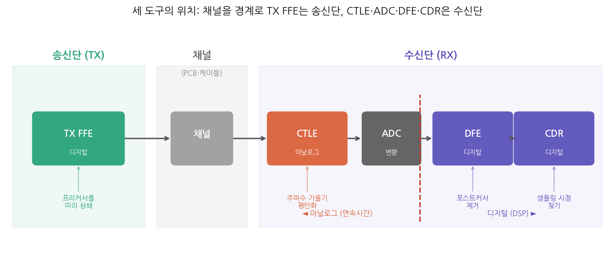
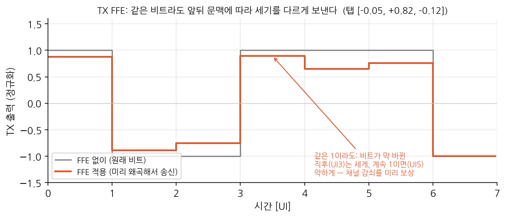
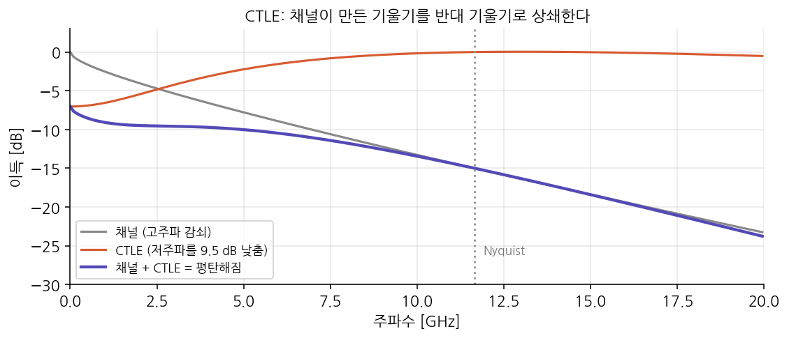
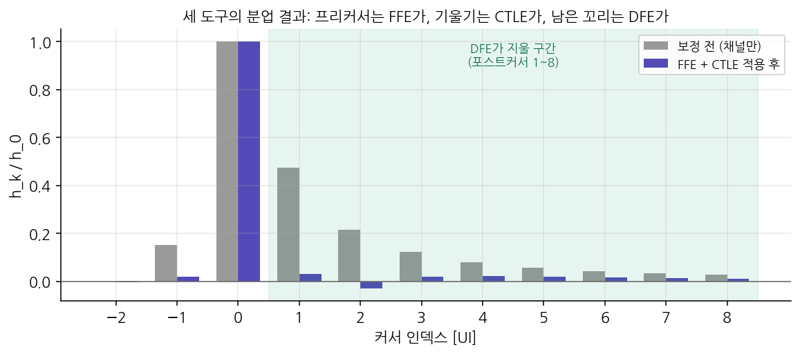
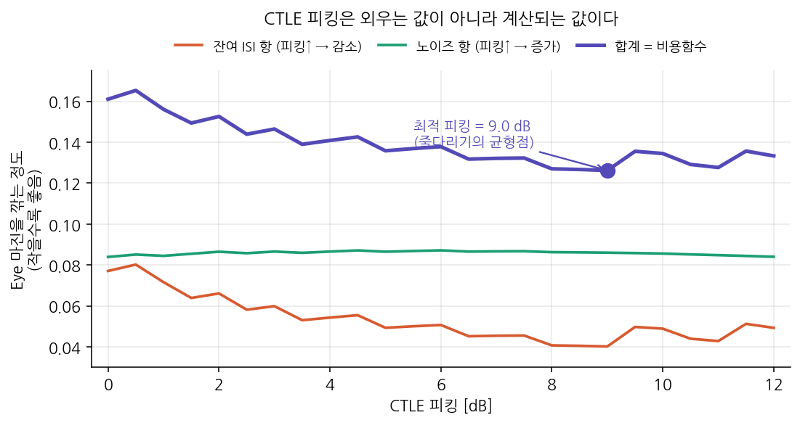
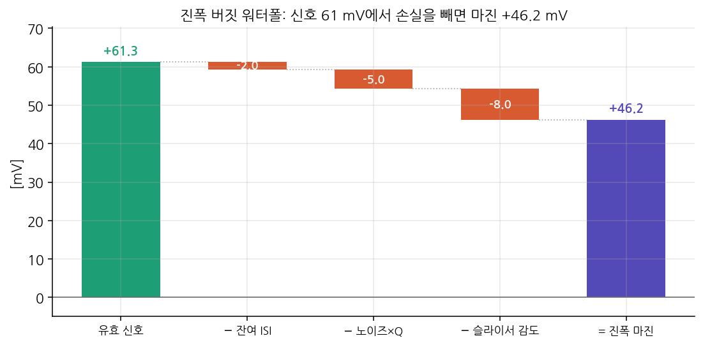
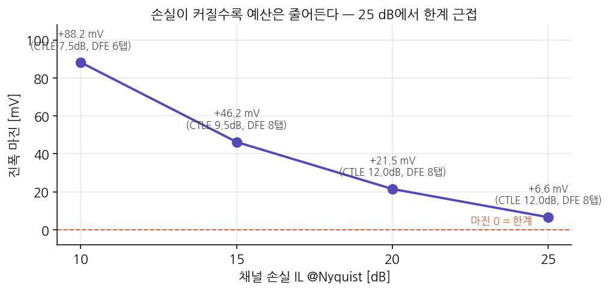
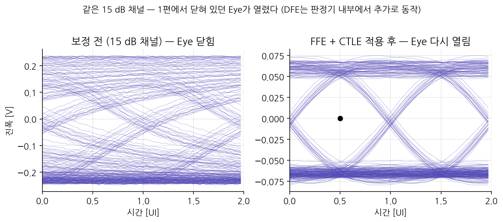

1편에서 우리는 문제를 진단했다. 채널이 고주파를 감쇠시켜 신호가 옆으로 퍼지고(ISI), 그 결과 15 dB 채널에서는 **Eye가 완전히 닫혔다**($h_0 = 1.00 < \sum|h_k| = 1.10$). 이번 편의 임무는 하나다 — **그 닫힌 Eye를 다시 여는 것.**

그런데 무작정 여는 게 아니라, 엔지니어가 실제로 하는 방식대로 연다. 즉 **예산(budget)을 짠다.** 신호가 가진 자원(진폭, 시간)에서 손실 항목을 하나씩 빼나가며 "마지막에 잔액이 플러스로 남는가"를 확인하는 것이다. 이 잔액이 플러스면 링크가 성립하고, 마이너스면 실패한다. 이것이 **링크 버짓(link budget)**이다.

:::note[이 글의 그림에 대해]
1편과 마찬가지로 모든 그림·수치는 골든 모델 코드가 실제로 계산한 값이다(23.32 Gbps NRZ, 15 dB 채널). 리포지토리에서 `make_figs_budget`을 실행하면 동일하게 재생성된다.
:::

## 1. 세 개의 도구 — FFE, CTLE, DFE

닫힌 Eye를 여는 작업을 통틀어 **이퀄라이제이션(equalization, 등화)**이라 한다. 채널이 신호를 왜곡한 만큼 반대로 보정해서 원래 모양에 가깝게 되돌리는 것이다. 이 일을 하는 도구가 세 가지 있는데, 각자 맡는 역할이 다르다. 먼저 이름과 한 줄 요약만 보자.

- **FFE**(Feed-Forward Equalizer) — **송신단**에서, 채널이 왜곡할 것을 미리 알고 **반대로 왜곡해서** 보낸다.
- **CTLE**(Continuous-Time Linear Equalizer) — **수신단**에서, 채널의 주파수 기울기를 **반대 기울기**로 상쇄해 평탄하게 만든다.
- **DFE**(Decision-Feedback Equalizer) — **수신단**에서, 이미 판정한 비트가 남긴 **꼬리를 계산해서 빼준다.**

왜 하나로 안 되고 셋이나 필요한지, 그리고 어떤 규칙으로 일을 나누는지가 이 편의 핵심이다. 하나씩 보자.

:::note[세 도구가 각각 어디서, 무엇을 보정하는가]
셋을 같은 자리에 있는 것으로 오해하기 쉽지만, **채널을 경계로 송신단과 수신단에 나뉘어** 있다. 그리고 수신단 안에서도 **ADC(아날로그→디지털 변환)를 경계로** 아날로그와 디지털로 갈린다.

신호가 지나가는 순서대로 정리하면:

1. **[송신단] TX FFE** (디지털) — 채널이 만들 **프리커서**를 미리 상쇄하도록 왜곡해서 내보낸다.
2. **채널** — 신호가 여기서 왜곡된다(송신단과 수신단을 가르는 경계).
3. **[수신단·아날로그] CTLE** — 채널이 만든 **주파수 기울기**를 반대로 눌러 평탄화한다. 이름의 "Continuous-Time(연속시간)"이 곧 아날로그라는 뜻이며, 아직 디지털로 바꾸기 전의 연속 신호에 작용한다.
4. **[수신단] ADC** — 아날로그 신호를 디지털로 변환한다. 이 지점이 아날로그와 디지털의 경계다.
5. **[수신단·디지털] DFE, CDR** — DFE는 남은 **포스트커서**를 판정값으로 계산해 빼고, CDR은 **최적 샘플링 시점**을 찾는다. 판정된 비트(0/1)라는 이산값을 다루므로 디지털이다.

핵심은 두 가지다. 첫째, **CTLE는 송신단이 아니라 수신단**이다 — 채널이 신호를 왜곡한 *뒤에* 그 왜곡을 펴야 하므로, 반드시 채널을 지난 수신 쪽에 있다. 둘째, 세 도구는 서로의 작업을 되돌리는 게 아니라 **채널이 만든 하나의 왜곡(ISI)을 나눠서 지운다** — 프리커서는 송신단만, 포스트커서는 수신단만 효율적으로 지울 수 있어서 분업할 뿐이다.

이 골든 모델도 정확히 이 구조를 따른다: CTLE는 아날로그 전달함수 $H(s)$로 "모델링"만 하고, FFE·DFE·CDR은 이산 신호를 다루는 디지털 블록으로 구현했다.
:::

## 2. FFE — 미리 반대로 왜곡해서 보낸다

채널이 신호를 어떻게 망가뜨릴지는 이미 안다(1편에서 측정했다). 그렇다면 **송신할 때 미리 반대 방향으로 왜곡해두면**, 채널을 통과한 뒤에 오히려 반듯해질 것이다. 이것이 FFE의 발상이다.

회색이 원래 비트열이고, 주황색이 FFE를 거친 송신 파형이다. 둘의 **부호는 같다**(FFE는 비트를 뒤집지 않는다). 다만 같은 값의 비트라도 **앞뒤 문맥에 따라 세기를 다르게** 보낸다 — 비트가 막 바뀐 직후(예: UI3의 1)는 세게, 같은 값이 계속 이어질 때(예: UI5의 1)는 약하게. 채널이 천이 직후의 급격한 부분(고주파)을 감쇠시킬 것을 알기 때문에, 그 부분을 미리 강조해두면 도착했을 때 딱 맞게 된다.

FFE는 수학적으로는 몇 개의 **탭(tap)**을 가진 필터다. 여기서는 3-탭을 쓴다 — 앞 비트, 현재 비트, 뒤 비트에 각각 가중치를 곱해 더한 것이다. 그런데 FFE에는 **대가**가 있다. 송신기가 낼 수 있는 총 전력은 정해져 있어서, 탭 가중치의 크기 합이 1로 고정된다($\sum|c_k| = 1$). 앞뒤 탭에 전력을 나눠 쓴 만큼 **가운데(메인) 신호가 작아진다.** 우리 모델의 FFE 탭은 $[-0.05,\ 0.82,\ -0.12]$인데, 앞뒤 탭($-0.05,\ -0.12$)에 전력을 내준 만큼 메인 탭이 1.0이 아니라 **0.82**로 줄었다. 이를 dB로 바꾸면

$$
20 \log_{10}(0.82) \approx -1.7\ \text{dB}
$$

이다. 즉 **"메인 탭 0.82배"와 "메인 신호 −1.7 dB 감소"는 같은 말**이다(진폭 비율을 dB로 표기하면 $20\log_{10}$). FFE는 공짜가 아니라 "메인 신호 일부를 내주고 왜곡을 바로잡는" 거래인 셈이다.

:::note[FFE는 왜 프리커서를 맡는가]
1편에서 프리커서(피크보다 **먼저** 도착하는 앞자락)는 수신단이 못 지운다고 했다. 아직 판정하지 않은 미래 비트의 영향이라 뺄 값이 없기 때문이다. 하지만 **송신기는 자기가 앞으로 보낼 비트를 전부 안다.** 그래서 프리커서만큼은 송신단의 FFE가 미리 상쇄하는 것이 유일한 방법이다.
:::

## 3. CTLE — 채널의 기울기를 반대로 기울여 편다

1편에서 채널 손실은 주파수마다 달랐다 — 저주파는 거의 안 깎이고 고주파일수록 크게 감쇠했다. 그래프로 보면 오른쪽으로 갈수록 내려가는 **기울어진 곡선**이다. CTLE의 아이디어는 단순하다. **정반대로 기울어진 특성**을 만들어 곱하면, 둘이 상쇄되어 평평해진다.

회색이 채널(고주파로 갈수록 감쇠), 주황색이 CTLE(저주파를 눌러서 상대적으로 고주파를 살림), 그리고 보라색이 **둘을 합친 결과**다. 나이퀴스트 주파수까지 거의 평탄해진 게 보인다. 평탄하다는 것은 곧 모든 주파수 성분이 고르게 전달된다는 뜻이고, 시간 영역에서는 **퍼짐이 줄어 펄스가 다시 뾰족해진다**는 의미다.

여기서 주의할 표현이 있다. CTLE가 "고주파를 키운다"고 흔히 말하지만, 정확히는 그림처럼 **저주파를 낮추는** 것이다. CTLE는 전력을 만들어내는 회로가 아니기 때문이다. 그래서 대가가 따른다 — 저주파를 누르면 신호도 같이 눌리고, 상대적으로 고주파(신호의 빠른 성분 + 노이즈)의 비중이 커진다. 즉 **신호 대비 노이즈의 비율이 나빠진다.** 피킹을 세게 걸수록 이 비율 악화가 심해지는데, 이것이 CTLE의 비용이고, 잠시 뒤 4절에서 이 비용이 최적 설정을 어떻게 결정하는지 본다.

## 4. DFE — 이미 지나간 비트의 꼬리를 빼준다

포스트커서(피크 **뒤**에 남는 꼬리)는 성격이 다르다. 이건 **이미 판정이 끝난 비트**가 남긴 잔상이다. 수신기는 그 비트가 0이었는지 1이었는지 이미 안다. 그렇다면 그 비트가 남길 꼬리 값을 계산해서 **현재 신호에서 그냥 빼주면** 된다. 이것이 DFE다.

DFE의 결정적 장점은 **신호 대 노이즈 비율을 나빠지게 하지 않는다**는 것이다. CTLE는 아날로그 신호를 다루므로 그 안에 섞인 노이즈까지 함께 통과시키지만, DFE가 빼는 값은 '이미 판정된 깨끗한 비트'(0 또는 1)로부터 계산한 것이라 노이즈가 섞이지 않는다. 그래서 포스트커서 제거는 되도록 DFE에게 맡기는 것이 유리하다.

대신 DFE에도 한계가 있다. 탭 수만큼의 포스트커서까지만 지울 수 있고(우리 모델은 최대 8탭), 무한정 늘리면 회로 면적과 전력이 커진다. 그리고 만약 판정이 틀리면 그 틀린 값으로 다음을 빼므로 오류가 연쇄될 수 있다(에러 전파). 그래서 DFE는 "가까운 포스트커서 몇 개"를 맡고, 멀리 있는 약한 꼬리는 포기한다.

## 5. 세 도구의 분업 — 물리 법칙이 정한다

이제 왜 셋이 필요한지가 분명해진다. **커서의 종류마다 지울 수 있는 도구가 정해져 있기 때문**이다. 이건 설계자의 취향이 아니라 인과성이라는 물리 법칙이 강제한다.

- **프리커서** → FFE만 가능 (미래 비트라 수신단은 못 지움)
- **채널의 주파수 기울기** → CTLE가 담당 (넓은 대역을 한 번에 평탄화)
- **포스트커서** → DFE가 담당 (노이즈 증폭 없이 깨끗하게 제거)

실제로 세 도구를 적용한 뒤 커서가 어떻게 변하는지 보자.

회색이 보정 전(채널만 통과)의 커서다. 메인($h_0$) 양옆으로 프리커서와 긴 포스트커서 꼬리가 크게 남아 있다 — 이 상태가 1편의 닫힌 Eye다. 보라색이 FFE와 CTLE를 적용한 뒤인데, 프리커서가 눌리고 꼬리가 짧아졌다. 그리고 연두색 영역으로 표시한 포스트커서 1~8번은 **DFE가 마저 지울 몫**이다. 세 도구가 각자 맡은 부분을 처리하고 나면, 메인만 우뚝 남고 나머지는 0에 가까워진다 — Eye가 열리는 것이다.

## 6. CTLE 피킹은 외우는 값이 아니라 계산되는 값이다

3절에서 CTLE가 "저주파를 얼마나 낮출지"를 **피킹(peaking)**이라 하고 dB로 표기한다. 그럼 이 값을 얼마로 정해야 할까? 여기에 이 편에서 가장 중요한 사고방식이 있다.

피킹을 올리면 고주파가 더 살아나서 **잔여 ISI는 줄어든다.** 좋은 일이다. 그런데 동시에 **노이즈도 커진다**(3절의 대가). 나쁜 일이다. 즉 피킹을 올리는 것은 좋은 효과와 나쁜 효과를 **동시에** 일으키는 줄다리기다. 그렇다면 둘을 합쳐 "Eye 마진을 가장 적게 깎는" 지점이 최적이다.

주황색이 잔여 ISI 항으로, 피킹을 올릴수록 내려간다. 연두색이 노이즈 항으로, 피킹을 올릴수록 올라간다. 이 둘을 더한 보라색이 **비용함수**이고, 그 최저점이 최적 피킹이다. 우리 채널에서는 **9.5 dB**가 답으로 나온다. 이 숫자는 어디서 외워온 게 아니라, 채널·노이즈·DFE 조건을 넣고 계산하면 저절로 떨어지는 값이다. 조건이 바뀌면(예: 노이즈가 더 크면) 최적 피킹도 따라 움직인다.

:::tip[이것이 '버짓'의 본질이다]
링크 버짓은 단순히 숫자를 더하고 빼는 산수가 아니다. 각 도구의 이득과 대가를 저울에 올리고, 전체 마진이 최대가 되는 배분을 찾는 **최적화**다. CTLE 피킹 하나만 봐도 그렇다.
:::

## 7. 진폭 버짓 — 신호에서 손실을 빼나간 잔액

이제 실제로 예산표를 만들어 보자. 판정 시점에서 신호가 가진 진폭(높이)에서 그것을 갉아먹는 항목들을 하나씩 빼나간다. 남는 것이 **진폭 마진**이다.

먼저 계산의 출발이 되는 **설계 조건** 세 가지를 정해두자. 이 값들은 회로·공정이 정하는 스펙으로, 우리 모델에서는 다음과 같이 가정한다.

| 스펙 | 값 | 의미 |
|---|---|---|
| TX 차동 스윙 | 500 mV | 송신기가 낼 수 있는 최대 진폭(peak-to-peak). 편측으로는 250 mV |
| RX 입력환산 노이즈 | 2.0 mV (rms) | 수신 회로가 만드는 열잡음을, 입력 지점 기준으로 환산한 값 |
| 슬라이서 감도 | 8.0 mV | 판정기가 0/1을 구분하는 데 필요한 최소 신호 |

예산표는 아래 네 항목으로 이루어진다. **유효 신호**에서 출발해 **잔여 ISI**, **노이즈**, **슬라이서 감도**를 차례로 빼면 **진폭 마진**이 남는다. 항목을 하나씩 유도해 보자.

### 7-1. 유효 신호 = +61.3 mV

1편에서 메인 커서 $h_0$가 곧 "신호의 크기"였음을 떠올리자. 편측 스윙 250 mV로 보낸 신호가 판정 시점에 실제로 얼마나 남는지를 단계별로 따라가면:

| 단계 | 메인 커서 (스윙 대비) | 계산 |
|---|---|---|
| TX 출력 | 1.00 | 온전한 신호로 출발 |
| 채널 통과 후 | 0.41 | 펄스 응답의 피크 (아래 설명) |
| + FFE | 0.32 | $0.41 \times 0.82$ (메인 탭 0.82배) |
| + CTLE | **0.245** | 저주파를 눌러 평탄화한 결과 |

**1.00 → 0.41 (채널)**: 나이퀴스트에서 15 dB 감쇠는 진폭비로 $10^{-15/20} = 0.178$배다. 그런데 메인 커서는 그보다 큰 0.41이 남는다. 15 dB는 *나이퀴스트 한 주파수*의 감쇠일 뿐이고, 실제 펄스는 여러 주파수 성분의 합이라 덜 감쇠된 저주파 성분이 메인 커서를 떠받치기 때문이다. 대신 감쇠된 고주파 성분은 사라지지 않고 옆 UI로 퍼져 ISI가 된다(1편에서 본 과정). 그래서 0.41은 단순 곱셈이 아니라 1편에서 계산한 펄스 응답의 피크 값이다.

**0.41 → 0.32 (FFE)**: 이건 단순 곱셈이다. FFE 메인 탭이 0.82배(2절의 −1.7 dB)이므로 $0.41 \times 0.82 \approx 0.34$. 여기에 FFE가 프리커서를 상쇄하며 파형이 미세하게 바뀌어 실제로는 약 0.32다.

**0.32 → 0.245 (CTLE)**: CTLE는 나이퀴스트에서 이득 1.0(0 dB)이 되도록 맞추고, 저주파를 $-9.5$ dB(약 0.34배)까지 눌러 평탄화한다(6절의 최적 피킹 9.5 dB). 메인 커서는 모든 주파수 성분의 합인데, 저주파가 눌리면서 그 합이 0.32에서 0.245로 낮아진다. 대신 주파수 특성이 평탄해져 ISI가 크게 줄어든다 — 3절에서 말한 CTLE의 거래다.

즉 스윙의 100%로 출발한 신호가 채널·FFE·CTLE를 거치며 **24.5%까지 줄어든다.** 이 등화 후 메인 커서 비율 $h_{0,\text{eq}} \approx 0.245$에 편측 스윙을 곱하면 유효 신호다:

$$
\text{유효 신호} = 250\ \text{mV} \times 0.245 \approx 61.3\ \text{mV}
$$

신호가 이렇게 작아졌는데도 링크가 성립하는 이유는 이퀄라이제이션이 신호를 키우는 게 아니라 **신호 대비 간섭**을 무너뜨리는 것이기 때문인데, 10절에서 다시 본다.

### 7-2. 잔여 ISI = −2.0 mV

FFE·CTLE·DFE가 지우고도 남은 자잘한 간섭이다. 등화 후 잔여 ISI 비율(약 0.008)에 편측 스윙을 곱한 값이다:

$$
\text{잔여 ISI} = 250\ \text{mV} \times 0.008 \approx 2.0\ \text{mV}
$$

### 7-3. 노이즈 × Q = −5.0 mV

노이즈는 두 가지가 합쳐진다.

**① 열잡음 $\sigma_n$** — 설계 조건 표의 RX 입력환산 노이즈 2.0 mV가 CTLE를 통과한 뒤의 값이다. CTLE는 저주파를 눌러 평탄화하는데, 그 과정에서 넓은 대역에 퍼진 노이즈의 상당 부분도 함께 걸러진다(노이즈 이득 약 0.34배):

$$
\sigma_n = 2.0\ \text{mV} \times 0.34 \approx 0.69\ \text{mV}
$$

**② 양자화 노이즈 $\sigma_q$** — ADC가 아날로그 신호를 계단처럼 근사하며 생기는 오차다. ADC를 $b$비트로 만들면 측정 범위(풀스케일 $FS$)를 $2^b$개의 계단으로 나누는데, 계단 하나의 크기(LSB)는 $FS/2^b$이고 그 안에서 균일하게 퍼지는 오차의 rms는 다음과 같다($\sqrt{12}$는 균일분포의 표준편차에서 나온다):

$$
\sigma_q = \frac{FS/2^b}{\sqrt{12}}
$$

여기서 풀스케일 $FS$는 유효 신호보다 넉넉해야 한다(안 그러면 신호가 범위를 넘어 잘린다). 유효 신호 61.3 mV에 AGC 헤드룸 1.3배와 양측 2배를 주어 $FS = 2 \times 1.3 \times 61.3 \approx 159$ mV. 뒤에서 도출할 8비트를 넣으면:

$$
\sigma_q = \frac{159/2^8}{\sqrt{12}} = \frac{0.62}{\sqrt{12}} \approx 0.18\ \text{mV}
$$

**두 노이즈를 합쳐 Q를 곱한다.** 두 노이즈는 서로 무관하게 생기므로 그냥 더하지 않고 **제곱해서 더한 뒤 제곱근**(RSS)으로 합친다. 그리고 1편의 Q 팩터(7.03 — "$10^{-12}$ 오류율을 지키려면 노이즈 σ의 7배만큼 여유가 필요")를 곱한다:

$$
\text{노이즈 항} = Q \times \sqrt{\sigma_n^2 + \sigma_q^2}
= 7.03 \times \sqrt{0.69^2 + 0.18^2} \approx 7.03 \times 0.71 \approx 5.0\ \text{mV}
$$

:::note[ADC 비트 수는 왜 8인가 — 버짓이 스펙을 낳는다]
위에서 $\sigma_q$를 구할 때 "8비트"를 넣었는데, 이 8이 어디서 나오는지가 이 note의 주제다. **규칙**: 양자화 노이즈 $\sigma_q$가 열잡음 $\sigma_n$보다 충분히 작아야 ADC가 성능의 발목을 잡지 않는다. 기준은 $\sigma_q \le \sigma_n / 2 = 0.69/2 \approx 0.34$ mV. 비트 수를 하나씩 넣어 $\sigma_q = (FS/2^b)/\sqrt{12}$를 계산하면:

| 비트 $b$ | 계단 크기 LSB | $\sigma_q$ | 목표 ≤ 0.34 mV |
|---|---|---|---|
| 7 | 1.25 mV | 0.36 mV | 초과 ✗ |
| **8** | **0.62 mV** | **0.18 mV** | **만족 ✓** |
| 9 | 0.31 mV | 0.09 mV | 만족 (과잉) |

7비트는 아슬아슬하게 초과하고 **8비트에서 처음 만족**한다. 9비트는 과잉이라 회로·전력만 낭비다. 그래서 답은 **8비트**다. 공식으로 한 번에 풀면 $b \ge \log_2\!\big(FS / (\tfrac{1}{2}\sigma_n\sqrt{12})\big) = \log_2(134) = 7.07$, 올림하여 8비트다.

**여기서 이 "8비트"는 명목(nominal) 비트 수가 아니라 유효 비트 수, 즉 ENOB(Effective Number of Bits)로 이해해야 한다.** 우리 계산은 "양자화 노이즈가 이만큼 작아야 한다"는 성능 요구에서 나왔는데, 실제 ADC는 양자화 오차 외에도 자체 열잡음·비선형성·클럭 지터 때문에 명목 비트 수가 주는 이상적 성능을 다 내지 못한다. 이 실질 성능을 비트로 환산한 것이 ENOB이고, 신호 대 잡음+왜곡비(SNDR)와 $\text{ENOB} = (\text{SNDR}_{\text{dB}} - 1.76)/6.02$로 연결된다. 그래서 실무에서는 **ENOB 8비트를 확보하기 위해 명목 9~10비트 ADC를 쓰기도** 한다 — 명목과 유효 사이의 간격을 메우기 위해서다. 요컨대 버짓이 도출하는 것은 "명목 8비트짜리 부품"이 아니라 "유효 8비트의 성능"이라는 요구 사항이다.

이렇게 버짓은 합격/불합격 판정에 그치지 않고 회로팀에 넘길 **구체적 스펙(ENOB 8비트)을 도출**한다.
:::

### 7-4. 슬라이서 감도 = −8.0 mV

판정기가 0과 1을 구분하는 데 필요한 최소 신호로, 설계 조건 표의 값이다. 이보다 작으면 아예 판정 자체를 못 한다.

### 7-5. 진폭 마진 = +46.2 mV

이제 모두 빼면:

$$
\text{진폭 마진} = 61.3 - 2.0 - 5.0 - 8.0 = +46.2\ \text{mV}
$$

**플러스이므로 진폭 관점에서 링크 성립.** 이 한 줄이 "진폭 마진 +46.2 mV"의 정체다 — 신호라는 예산에서 ISI·노이즈·감도라는 지출을 빼고 남은 저축인 셈이다.

## 8. 타이밍 버짓 — 시간축에도 같은 예산이 있다

진폭(세로축)에 예산이 있듯, 시간(가로축)에도 예산이 있다. 1편에서 본 Eye 폭이 그 예산이고, 여기서 지터를 빼나간다. 1 UI 전체에서 시작한다.

| 항목 | 값 [UI] | 의미 |
|---|---|---|
| 시작: Eye 폭 | 1.000 | 이상적으로 열린 폭 |
| − TX 총지터 | 0.248 | 1편의 DJ + 2Q·RJ |
| − 잔여 ISI로 인한 지터 | 0.020 | 남은 간섭이 에지를 흔든 양 |
| − CDR 잔차 + 샘플러 | 0.100 | 클럭 복원 오차와 샘플링 불확실성 |
| **= 타이밍 마진** | **+0.632** | **플러스이므로 타이밍 관점에서도 성립** |

표에 나온 **CDR**(Clock and Data Recovery)은 아직 이 시리즈에서 설명하지 않은 블록이다. 1편에서 "수신기는 Eye가 가장 크게 열린 지점에서 샘플링한다"고 했는데, 송신기와 수신기는 별도의 클럭을 쓰므로 수신기는 그 최적 시점이 어디인지 처음엔 모른다. 데이터의 에지를 관찰해 **샘플링 클럭을 Eye 중앙에 맞춰가는** 회로가 CDR이다. 다만 CDR도 완벽하지 않아 약간의 오차(잔차)가 남고, 그 잔차가 타이밍 예산에서 빠지는 지출이 된다. CDR이 어떻게 최적 시점을 찾아가는지는 3편의 핵심 주제다.

진폭과 타이밍 **둘 다 플러스**여야 링크가 성립한다. 어느 한쪽만 통과하면 안 된다 — 신호가 충분히 커도 샘플링 시점이 안 맞으면 틀리고, 시점이 완벽해도 신호가 노이즈에 묻히면 틀리기 때문이다.

## 9. 코너 — 나쁜 조건에서도 예산이 남는가

지금까지는 15 dB 채널 하나만 봤다. 하지만 실제 제품은 채널이 더 나쁠 수도 있다. 그래서 여러 손실 조건(**코너, corner**)에서 예산이 여전히 플러스인지 확인해야 한다.

손실이 10 dB에서 25 dB로 커질수록 진폭 마진이 88 mV에서 6.6 mV로 **단조 감소**한다. 그리고 손실이 커질수록 CTLE 피킹과 DFE 탭 수가 함께 늘어나는 것도 보인다 — 채널이 나쁠수록 도구를 더 세게 써야 하기 때문이다. 25 dB에서는 마진이 거의 0에 근접한다. 이 지점이 **이 설계로 감당할 수 있는 채널 손실의 한계**다. 더 나쁜 채널을 지원하려면 도구를 강화하거나(예: DFE 탭 증가) 다른 방식(PAM4 등)이 필요하다.

## 10. 피날레 — 닫혔던 Eye가 열렸다

이 편의 처음으로 돌아가자. 임무는 "1편에서 닫힌 Eye를 여는 것"이었다. 결과를 직접 보자.

왼쪽이 보정 전 — 1편에서 봤던, 완전히 닫힌 15 dB 채널의 Eye다. 오른쪽이 FFE와 CTLE를 적용한 뒤로, **가운데에 열린 공간이 다시 나타났다**(여기에 DFE가 판정기 내부에서 포스트커서를 마저 제거하면 Eye는 더 깨끗해진다). 세 도구가 각자의 규칙대로 손실을 나눠 맡은 결과, 신호 대 간섭의 비율이 뒤집혀 Eye가 열린 것이다.

숫자로도 확인된다. 보정 전에는 메인 대비 ISI 비율이 1.24로 신호보다 간섭이 컸는데, 보정 후에는 0.04로 떨어졌다. **신호가 간섭을 압도하게 된 것**, 이것이 이퀄라이제이션의 본질이다. 흥미로운 점은 보정 후 메인 신호 자체는 오히려 작아졌다는 것이다(FFE 대가 + CTLE 대가). 그럼에도 링크가 성립하는 이유는 이퀄라이제이션이 "신호를 키우는 기술"이 아니라 "신호 대비 간섭을 무너뜨리는 기술"이기 때문이다.

## 정리

- **링크 버짓**은 신호라는 예산에서 손실 항목을 빼나가 마진이 플러스인지 보는 것. 진폭·타이밍 **둘 다** 플러스여야 링크 성립.
- **세 도구의 분업은 물리 법칙**이 정한다: 프리커서 → FFE, 주파수 기울기 → CTLE, 포스트커서 → DFE.
- 각 도구에는 **대가**가 있다: FFE는 메인 신호 감소, CTLE는 신호 대비 노이즈 비율 악화, DFE는 탭 수 제한과 에러 전파.
- **CTLE 피킹은 외우는 값이 아니라** ISI 감소와 노이즈 증가의 줄다리기에서 비용함수를 최소화하는 계산 결과다(우리 채널은 9.5 dB).
- 진폭 마진 **+46.2 mV**는 신호 61.3에서 ISI·노이즈·감도를 뺀 잔액이고, 버짓은 ADC의 유효 분해능(**ENOB 8비트**) 같은 **구체적 스펙까지 도출**한다.
- 손실 코너를 쓸어보면 25 dB 부근이 이 설계의 한계다.

3편에서는 이 도구들이 **어떻게 스스로 최적값을 찾아가는지**를 다룬다. FFE·CTLE·DFE의 계수는 처음부터 정답을 알고 있는 게 아니라, 실제 데이터를 보며 조금씩 조정해 수렴한다(적응, adaptation). 그리고 최적 샘플링 시점을 스스로 찾아가는 CDR도 이때 등장한다 — 1편에서 "아직 없다"던 그 CDR이다.