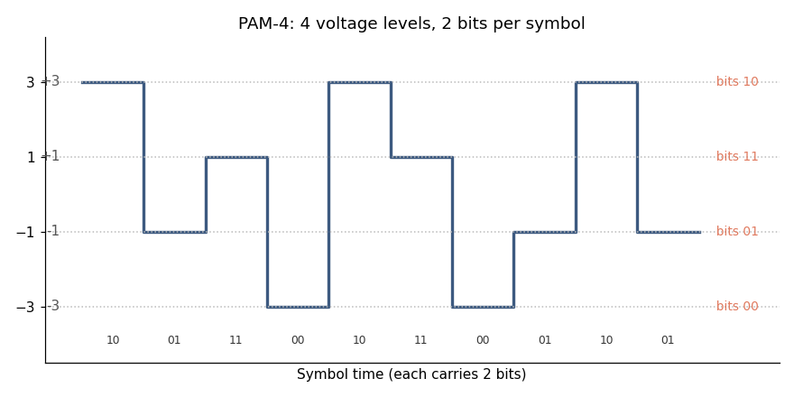
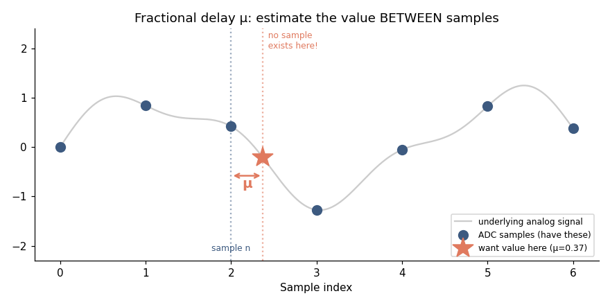
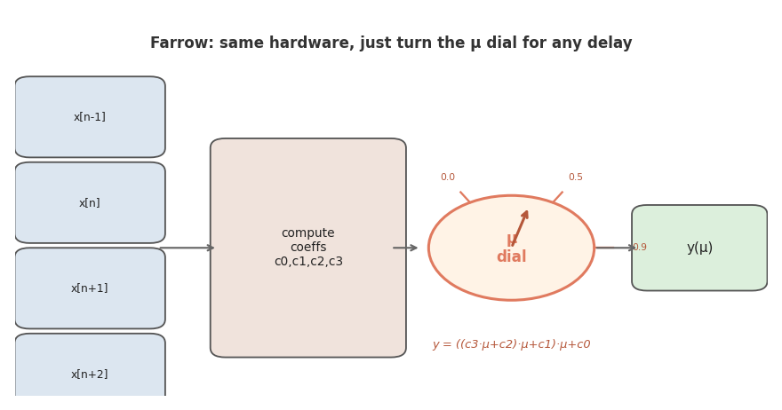
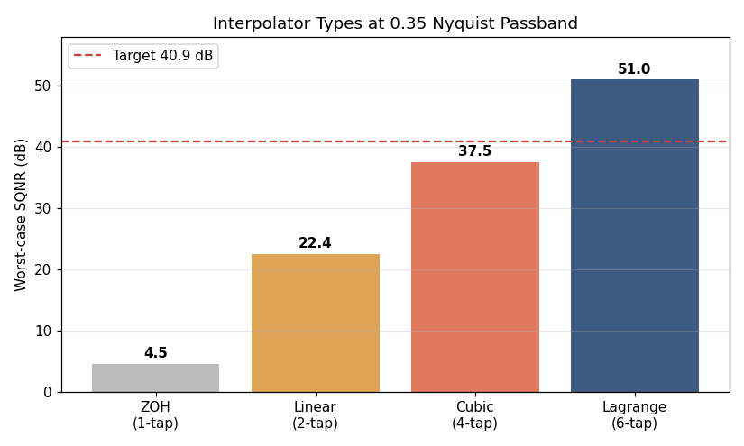
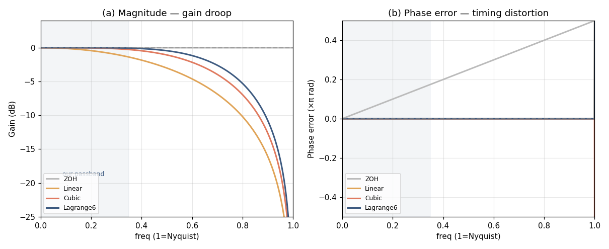
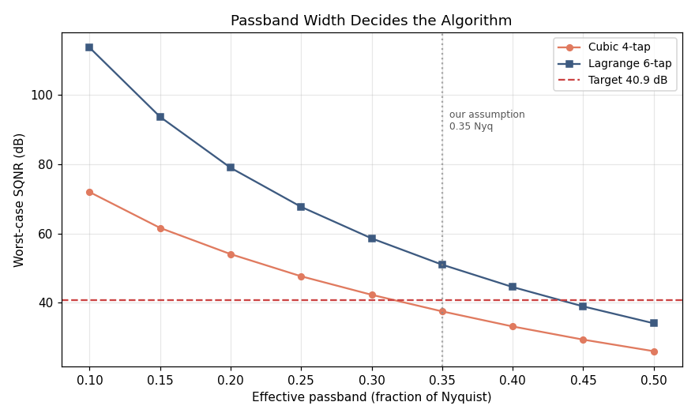
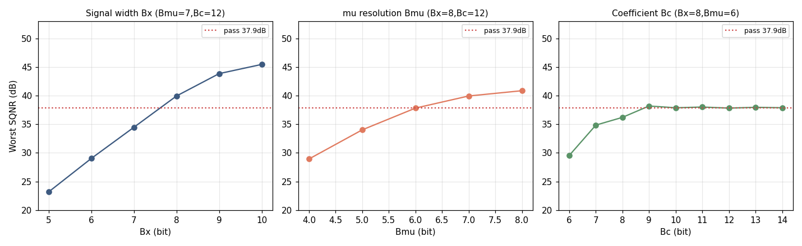
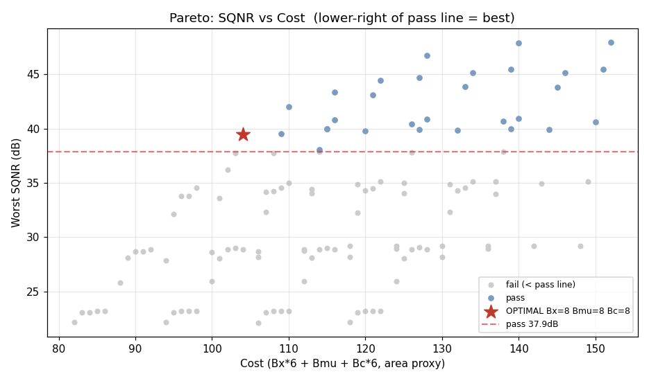

고속 수신기에서 ADC가 받아온 샘플은 데이터의 진짜 타이밍과 **미묘하게 어긋나 있다.** 이 어긋남을 메워 "심볼 정중앙의 값"을 만들어내는 블록이 **Interpolator** 다. 이 글은 Interpolator를 설계하는 전 과정을 다룬다 — **"왜 이 알고리즘을 골랐는가"** 라는 선정 논리를 충분히 깔고 나서, MATLAB 코드로 SQNR을 측정해 최적의 비트 폭까지 정한다. 구체적인 요구사항(데이터율·통과대역 등)은 **MIPI M-PHY v6.0 HS-G6(PAM-4) 수신기를 기준으로 정리**해, 추상적인 설명이 아니라 실제 사양에 맞춰 설계가 진행되도록 했다.

:::note[이 글에서 다루는 것]
- Interpolator가 왜 필요한가 — ADC 샘플과 심볼 타이밍의 어긋남
- **Interpolator 전종류 비교** — ZOH·Linear·Cubic·고차 FIR·CIC·Polyphase의 트레이드오프
- **왜 Farrow 구조인가** — 가변 분수지연이라는 요구가 후보를 좁힌다
- **왜 Cubic을 거쳐 6-tap인가** — SQNR 천장이라는 정량적 근거
- SQNR의 정의와 측정법 (MATLAB)
- 통과대역 실험으로 알고리즘을 확정하는 과정
- 고정소수점 모델링과 최적 비트 폭 결정
:::

:::tip[Interpolator 한 블록에만 집중한다]
실제 수신기엔 위상검출기·루프필터·이퀄라이저·슬라이서가 함께 돈다. 이 글은 그것을 모두 걷어내고 **Interpolator 자체의 품질만** 본다. CDR이 "지연값 μ를 줄게"라고 하면, Interpolator가 그만큼 정확히 옮겨주는가 — 딱 그것만 평가한다.
:::

---

## 1. 요구사항 정리 — 무엇을 알고, 무엇을 가정하는가

알고리즘을 고르려면 **무엇이 주어졌는지**부터 못 박아야 한다. 요구사항이 후보를 걸러내기 때문이다. 이 글에서는 요구사항을 **MIPI M-PHY v6.0 HS-G6 규격을 기준으로** 정리한다. 다른 규격이라도 데이터율·통과대역 같은 숫자만 바꾸면 같은 방법이 그대로 적용된다.

**확인된 사실 (M-PHY v6.0):** 최대 46.694 Gbps/lane, PAM-4 시그널링(한 심볼에 2bit), Tx 이퀄라이저와 FEC 사용. 여기서 심볼 레이트가 나온다.

:::note[PAM-4 시그널링이란]
일반적인 디지털 신호(NRZ)는 전압을 **0과 1, 두 단계**로만 나눠 한 번에 1bit를 보낸다. **PAM-4**는 전압을 **네 단계**(예: -3, -1, +1, +3)로 나눠, 각 단계에 2bit를 대응시킨다. 그래서 **한 심볼에 2bit**를 실어 보낸다.



위 그림에서 신호는 네 전압 레벨 사이를 오가고, 각 레벨이 `00·01·11·10` 같은 2bit 값을 나타낸다(인접 레벨이 1bit만 다르도록 배열한 gray code). 덕분에 같은 데이터를 **절반의 심볼 레이트**로 보낼 수 있어 채널 손실이 유리하다. 대신 레벨 간격이 좁아져(1/3로) **잡음에 약하다** — 이것이 뒤에서 Interpolator 품질 예산을 빡빡하게 만드는 이유다.
:::

```
심볼 레이트  = 46.694 Gbps ÷ 2 = 23.347 GBaud
Nyquist 주파수 = 23.347 ÷ 2 = 11.674 GHz
```

**가정한 값 두 개:**

| 가정 | 값 | 왜 이 값인가 |
|---|---|---|
| ADC 유효비트 ENOB | **6.5 bit** | DSP 수신기 ADC의 "깨끗한 비트 수". PAM-4 4레벨 구분+여유로 6~7bit가 현실적 |
| 유효 통과대역 | **0.35 Nyquist** | EQ 후 신호 에너지가 실제로 들어있는 폭. 짧은 채널+EQ의 보수적 중간값 |

**Interpolator에 내려오는 핵심 요구 세 가지** — 이게 알고리즘 선정의 기준이 된다.

1. **가변 분수지연.** CDR이 주는 지연값 μ는 매 순간 바뀐다(0.37→0.41→…). Interpolator는 임의의 μ를 실시간으로 처리해야 한다.
2. **저지연.** Interpolator는 CDR 피드백 루프 안에 있어, 탭이 많으면 루프 지연이 커지고 지터 추적 성능이 나빠진다.
3. **PAM-4 수준의 품질.** 4레벨이라 잡음·왜곡 예산이 빡빡하다. 목표 SQNR은 ENOB에서 도출한다(4장).

---

## 2. Interpolator란 무엇인가, 그리고 어떤 종류가 있나

### 2-1. 문제 상황

ADC는 매 UI마다 신호를 한 번 찍는다. 그런데 **찍는 순간이 심볼 정중앙이라는 보장이 없다.** 송수신 클럭 차이와 채널 지연 때문이다.

```
신호:    ╱▔▔▔╲___╱▔▔▔╲___
심볼중앙:    ●       ●        ← 우리가 원하는 값
ADC샘플:  ○         ○        ← 실제로 찍힌 값 (μ만큼 어긋남)
              ↑μ
```

ADC 샘플 ○과 심볼 중앙 ● 사이 거리가 **분수지연 μ**(0~1, 한 샘플 간격 기준)다. CDR이 μ를 알려주면, Interpolator는 ○ 값들로 ● 위치 값을 추정해야 한다.

:::note[분수지연(fractional delay)이란]
**"정수 지연"** 은 샘플을 통째로 한 칸 미루는 것이다. 데이터에 이미 그 값이 있으니 인덱스만 +1 하면 끝(쉽다). **"분수 지연"** 은 **샘플과 샘플 사이 어딘가**로 옮기는 것이다. 예를 들어 0.37칸 위치.



위 그림에서 파란 점(●)이 ADC가 실제로 가진 샘플이고, 주황 별(★)이 우리가 원하는 위치(μ=0.37)다. **그 위치엔 샘플이 없다.** 회색 곡선(진짜 아날로그 신호)은 우리가 볼 수 없다. 따라서 주변 파란 점들만 가지고 별 위치의 값을 **추정해야** 한다. 그 추정 방법이 바로 Interpolation 알고리즘이다.
:::

### 2-2. Interpolator 전종류 트레이드오프

샘플 사이를 **무엇으로 잇느냐**, **몇 개를 보느냐**에 따라 종류가 갈린다. 대표적인 것들을 모두 늘어놓고 비교하자.

| 종류 | 잇는 방식 | 탭 수 | 가변 μ | 품질 | 비용 | 한 줄 평 |
|---|---|---|---|---|---|---|
| **ZOH** | 앞 샘플 유지(계단) | 1 | △ | ★ | 최소 | 곱셈 없음, 품질 최악 |
| **Linear** | 두 점 직선 | 2 | ○ | ★★ | 낮음 | 자(ruler)로 잇기 |
| **Cubic** | 네 점 3차곡선 | 4 | ○ | ★★★★ | 중간 | 오디오·통신 표준급 |
| **고차 Lagrange** | 여섯+ 점 고차곡선 | 6+ | ○ | ★★★★★ | 높음 | 정밀하나 지연 큼 |
| **CIC** | 적분-콤 누적 | 多 | △ | ★★★ | 낮음(곱셈無) | 정수배율 전용, 가변 μ 어려움 |
| **Polyphase FIR** | 위상별 FIR 분기 | 多 | ✕ | ★★★★★ | 중~높음 | 고정 배율 최강, 가변 μ 불가 |

각각을 조금 더 보면:

- **ZOH(Zero-Order Hold):** 앞 샘플을 그대로 유지한다. 곱셈이 없어 제일 싸지만 곡선을 계단으로 근사하니 품질이 형편없다.
- **Linear:** 양옆 두 샘플을 직선으로 잇는다. ZOH보다 낫지만 곡선을 직선으로 보니 여전히 왜곡이 크다.
- **Cubic(4-tap):** 네 샘플을 3차 곡선으로 잇는다. 곡선의 휘어짐까지 따라가 훨씬 부드럽다.
- **고차 Lagrange(6-tap+):** 점을 더 써서 더 정밀하게. 대신 탭이 늘어 지연·면적이 커진다.
- **CIC:** 곱셈 없이 적분기·콤 필터만으로 큰 배율 보간. **정수 배율 전용**이라 임의 μ를 만들기 어렵다.
- **Polyphase FIR:** 품질 최강이지만 **미리 정해진 고정 배율**(×2, ×4 등)에서만 동작한다. 임의 μ는 못 만든다.

### 2-3. 요구사항이 후보를 걸러낸다 — 왜 Farrow인가

1장의 요구 중 **"가변 분수지연"** 이 결정적이다. CDR이 주는 μ는 연속적으로 변하는데:

- **CIC와 Polyphase는 탈락한다.** 둘 다 **정수 배율** 구조라 임의의 μ(0.37 같은 연속값)를 못 만든다. 고정 배율 업샘플링엔 최강이지만, 우리 문제(임의 지연)엔 안 맞는다.
- **남는 건 ZOH·Linear·Cubic·고차 Lagrange.** 이들은 μ를 인자로 받아 임의 지연을 만들 수 있다.

그런데 μ가 매 순간 바뀌면, μ값마다 다른 필터 계수가 필요해진다. 가능한 μ를 모두 저장하면 메모리가 폭발한다. 이걸 푸는 게 **Farrow 구조**다.

:::tip[Farrow = μ를 다이얼처럼 돌리는 만능 필터]
Farrow는 보간 공식을 **μ에 대한 다항식**으로 정리한다. 예를 들어 Cubic은:

`y(μ) = ((c₃·μ + c₂)·μ + c₁)·μ + c₀`

계수 c₀~c₃는 주변 샘플로 계산해두고, **μ만 곱해 넣으면** 그 위치 값이 나온다. μ가 0.37이든 0.41이든 같은 하드웨어에 숫자만 바꿔 넣는다. μ마다 필터를 따로 저장할 필요가 없다 — 이것이 가변 분수지연에 Farrow를 쓰는 이유다.



그림처럼 주변 샘플로 계수를 한 번 계산해두면, 나머지는 **μ라는 다이얼 하나를 돌리는 일**뿐이다. 0.0으로 돌리면 현재 샘플, 0.5로 돌리면 두 샘플 정중앙, 0.9로 돌리면 다음 샘플 근처 값이 나온다. 하드웨어는 그대로 두고 **μ 값만 바꿔** 어떤 분수지연이든 만들어낸다.
:::

**그래서 후보는 "Farrow 구조의 다항식 Interpolator"로 좁혀진다.** 이제 남은 질문은 **차수(탭 수)** 다. Linear(2)? Cubic(4)? 6-tap? 이건 감이 아니라 **SQNR 측정**으로 정한다. 그 자(尺)부터 만들자.

---

## 3. 품질의 자(尺) — SQNR

### 3-1. 정의

Interpolator가 만든 값이 진짜 값과 얼마나 가까운지를 숫자 하나로 나타낸 게 **SQNR**(신호 대 양자화잡음비)이다. 클수록 좋다.

```
                    신호 에너지
SQNR(dB) = 10 · log10( ─────────── )
                    오차 에너지

  · 신호 에너지 = (정답값)들의 제곱합
  · 오차 에너지 = (Interpolator 출력 − 정답값)들의 제곱합
```

오차가 작을수록 분모가 작아져 SQNR이 커진다. 즉 **Interpolator가 정답에 가까울수록 SQNR이 높다.**

### 3-2. 문제 — "정답값"을 우리가 어떻게 아나

위 공식을 다시 보면 오차를 구하려면 **"정답값"** 이 필요하다. Interpolator 출력에서 정답값을 빼야 오차가 나오니까. 그런데 여기서 막힌다 — **애초에 정답을 알면 Interpolator가 왜 필요한가?** Interpolator는 "모르는 값을 추정"하는 장치인데, 채점하려면 그 모르는 값(정답)을 알아야 하는 모순처럼 보인다.

해결책은 **우리가 정답을 아는 상황을 일부러 만드는 것**이다. 실제 수신기에선 정답을 모르지만, **시험(테스트)할 때는** 우리가 신호를 직접 만드니 정답도 계산할 수 있다.

방법은 이렇다. 깨끗한 테스트 신호를 하나 만들고, 그것을 **이상적인 분수지연**으로 μ만큼 옮긴다 — 아주 긴 sinc 필터를 쓰면 이론상 거의 완벽하게 옮겨지므로, 그 결과가 "μ 위치의 진짜 값"이 된다. 이게 **정답**이다. 그다음 같은 신호를 평가 대상 Interpolator로 μ만큼 옮긴 출력과 비교하면, 둘의 차이가 곧 오차다.

:::note[왜 sinc 필터가 "정답"인가]
신호처리 이론상, 대역제한된 신호를 분수만큼 정확히 옮기는 이상적 필터가 바로 **sinc 함수**다. 다만 진짜 sinc는 무한히 길어 현실에선 못 쓴다. 그래서 **아주 길게(예: 65탭) 잘라 쓰면** 거의 이상적에 가까워진다. 이건 너무 무거워 실제 하드웨어엔 못 넣지만, **채점용 "정답지"로는 완벽**하다. 실시간일 필요가 없으니 길어도 상관없다. 우리가 설계하는 가벼운 Interpolator(4탭, 6탭)가 이 정답지에 얼마나 가까운지를 재는 것이다.
:::

### 3-3. μ를 전 구간 돌려 "최악"을 본다

이제 채점 준비가 됐는데, 한 가지 더 정할 게 있다. **어떤 μ로 채점할 것인가?**

:::tip[가운데(μ=0.5)가 가장 어렵다]
μ=0이면 옮길 필요가 없어(샘플이 곧 정답) 점수가 무한대로 좋다. μ=1도 마찬가지(다음 샘플이 정답). 진짜 어려운 건 **μ=0.5, 두 샘플 정중앙**이다. 양옆 샘플에서 가장 먼 위치라 추정이 제일 부정확해, 여기서 SQNR이 최악이 된다.

그래서 μ를 한 값으로 고정하지 않고 **0.1부터 0.9까지 돌려가며** 재고, 그중 **가장 나쁜 점수**를 그 Interpolator의 사양으로 삼는다. "최악의 μ에서도 목표를 넘느냐"가 진짜 합격 기준이기 때문이다.
:::

---

## 4. 알고리즘 선정 — 차수를 SQNR로 정한다

이제 2장에서 좁힌 Farrow 후보들(Linear·Cubic·6-tap)을 같은 조건에서 채점한다. 먼저 코드부터.

### 4-1. 테스트 신호

통과대역(0.35 Nyquist) 안에 8개 톤을 깔아 섞는다. 한 톤만 쓰면 그 주파수에서만 잘 되는지 알 뿐이라, 대역을 대표하도록 여러 톤을 쓴다.

```matlab
clear; rng(1);
Fs = 23.347e9;  N = 2^14;  n = 0:N-1;
BW = 0.35;                              % [가정] 유효 통과대역

f = linspace(0.03, BW, 8) * Fs/2;       % 통과대역 안 8개 톤
x = zeros(1, N);
for k = 1:numel(f)
    x = x + cos(2*pi*f(k)/Fs*n + 2*pi*rand);
end
x = 0.9 * x / max(abs(x));              % 진폭 ±0.9로 정규화
```

### 4-2. Interpolator들을 코드로 — 왜 이렇게 짰나

각 Interpolator를 하나씩 보며 **코드가 왜 그런 모양인지** 설명한다. 공통적으로 `circshift(x, k)`는 신호 전체를 k칸 민다. 이렇게 하면 `x[n-1]`, `x[n+1]` 같은 이웃 샘플을 **루프 없이 한꺼번에** 벡터로 다룰 수 있어 빠르다.

**(1) ZOH — μ를 아예 안 쓴다**

```matlab
function y = interp_zoh(x, mu),  y = x;  end
```

ZOH는 "가장 가까운 앞 샘플을 그대로 유지"하는 방식이라, **μ가 얼마든 현재 샘플값을 그냥 출력**한다. 그래서 코드에 μ가 등장하지 않는다. 이게 ZOH가 제일 싸지만(곱셈 0개) 제일 부정확한 이유를 그대로 보여준다 — 샘플 사이를 전혀 추정하지 않는다.

**(2) Linear — 두 점을 직선으로 잇는다**

```matlab
function y = interp_lin(x, mu),  y = (1-mu)*x + mu*circshift(x,-1);  end
```

현재 샘플 `x[n]`과 다음 샘플 `x[n+1]`(=`circshift(x,-1)`)을 **μ:(1-μ) 비율로 섞는다.** μ=0이면 현재 샘플, μ=1이면 다음 샘플, μ=0.5면 정확히 둘의 평균. 자(ruler)를 두 점에 대고 μ 위치를 읽는 것과 같다. 두 점만 쓰므로 곡선의 휘어짐은 무시된다.

**(3) Cubic 4-tap — 네 점을 3차 곡선으로**

```matlab
function y = farrow_cubic(x, mu)
    xm1=circshift(x,1); x0=x; x1=circshift(x,-1); x2=circshift(x,-2);
    c0=x0;                              % μ⁰ 항: 현재 샘플
    c1=0.5*(x1-xm1);                    % μ¹ 항: 기울기 (양옆 차이)
    c2=xm1 -2.5*x0 +2*x1 -0.5*x2;       % μ² 항: 곡률
    c3=0.5*(x2-xm1)+1.5*(x0-x1);        % μ³ 항: 곡률의 변화
    y=((c3*mu+c2)*mu+c1)*mu+c0;         % μ 다항식 (Farrow 핵심)
end
```

앞뒤 4개 샘플(`x[n-1]`부터 `x[n+2]`까지)로 **3차 곡선의 계수 `c0`, `c1`, `c2`, `c3`를 만든다.** 이 계수들은 Catmull-Rom이라는 표준 보간 공식에서 나온 것으로, `c1`은 기울기, `c2`는 곡률처럼 곡선의 모양을 점점 정교하게 잡는다. 마지막 줄이 **Farrow의 핵심**: 계수에 μ를 차례로 곱해 넣는 다항식이다. `((c3*mu+c2)*mu+c1)*mu+c0` 형태(호너 방식)로 써서 곱셈 횟수를 줄였다.

**(4) Lagrange 6-tap — 여섯 점으로 더 정밀하게**

```matlab
function y = farrow_6tap(x, mu)
    pts=[-2 -1 0 1 2 3]; sh=[2 1 0 -1 -2 -3]; N=numel(x); y=zeros(1,N);
    for i=1:6
        L=ones(1,N);
        for j=1:6
            if j~=i, L=L.*(mu-pts(j))/(pts(i)-pts(j)); end  % 라그랑주 기저
        end
        y=y+circshift(x,sh(i)).*L;
    end
end
```

6개 샘플(`pts`가 그 상대 위치 -2부터 +3까지)을 쓴다. 이중 루프는 **라그랑주 보간의 표준 공식**이다. 각 샘플 i마다 "그 샘플만 1이고 나머지 위치에선 0이 되는" 기저 다항식 L을 만들어(안쪽 j 루프), 샘플값에 곱해 모두 더한다. 점을 더 많이 보니 곡선을 더 정확히 따라가지만, 그만큼 곱셈과 지연이 늘어난다.

:::note[위 코드는 교육용 — 실제 RTL은 Farrow 형태로]
위 6-tap 코드는 **공식이 그대로 보이는 교육용 형태**다. μ가 바뀔 때마다 이중 루프로 기저를 다시 계산하고, 그 안에 **나눗셈**(`/(pts(i)-pts(j))`)이 들어 있다. 나눗셈기는 하드웨어에서 면적·지연이 크므로, 실제 RTL에서는 이대로 쓰지 않는다. 같은 결과를 내되 나눗셈 없는 **Farrow 구조**로 바꾼다. 바로 아래에서 그 변환을 다룬다.
:::

### 4-3. 라그랑주를 Farrow 구조로 — RTL 친화적 형태

위 라그랑주는 매 μ마다 기저를 다시 계산했다. **Farrow 구조**는 그 계산을 **미리 끝내**, μ의 거듭제곱(μ⁰부터 μ⁵까지)별로 **고정된 FIR 분기**로 바꾼다. 핵심 아이디어는 라그랑주 기저를 μ에 대한 다항식으로 전개하는 것이다.

```
y(μ) = Σ μᵏ · bₖ      (bₖ = μᵏ 분기 FIR의 출력)
       k
```

라그랑주 기저 `L_i(μ) = ∏_{j≠i}(μ-pts_j)/(pts_i-pts_j)` 를 μ에 대해 전개하면, 각 탭이 μ⁰부터 μ⁵까지의 **상수 계수**를 갖는다. 이 계수를 미리 뽑아 행렬 `B`로 박아두면, 런타임엔 나눗셈 없이 μ만 대입하면 된다.

```matlab
function y = farrow_6tap_opt(x, mu)
% Lagrange 6-tap을 Farrow 구조로 (나눗셈 없음, RTL 친화적)
% 탭 위치: x[n-2] ~ x[n+3]

    % --- μ^k 분기 계수 행렬 (라그랑주에서 미리 전개한 상수) ---
    %   행 = μ^0..μ^5,  열 = 탭 x[n-2..n+3]
    B = [  0       0       1       0       0       0     ;   % μ^0
           1/20   -1/2    -1/3     1      -1/4     1/30  ;   % μ^1
          -1/24    2/3    -5/4     2/3    -1/24    0     ;   % μ^2
          -1/24   -1/24    5/12   -7/12    7/24   -1/24  ;   % μ^3
           1/24   -1/6     1/4    -1/6     1/24    0     ;   % μ^4
          -1/120   1/24   -1/12    1/12   -1/24    1/120 ];  % μ^5

    % --- 6개 탭을 한 행렬로 (벡터화) ---
    X = [circshift(x, 2);    % x[n-2]
         circshift(x, 1);    % x[n-1]
         x;                  % x[n]
         circshift(x,-1);    % x[n+1]
         circshift(x,-2);    % x[n+2]
         circshift(x,-3)];   % x[n+3]

    % --- 각 μ^k 분기 출력 b_k = B(k,:)*X ---
    b = B * X;               % 6 x N

    % --- Horner로 μ 다항식 합성 (나눗셈 0, μ곱 5회) ---
    y = b(6,:);
    for k = 5:-1:1
        y = y .* mu + b(k,:);
    end
end
```

**핵심은 계수 행렬 `B`가 μ와 무관한 상수**라는 점이다. 원래 코드와 비교하면:

| | 원래 라그랑주 (교육용) | Farrow 변환 (RTL용) |
|---|---|---|
| μ 처리 | 매번 이중 루프로 기저 재계산 | `B`는 **상수** (ROM/배선에 고정) |
| **나눗셈** | 탭당 5회 (런타임) | **0회** (미리 다 함) |
| 구조 | 알고리즘 그대로 | **고정 FIR 6개 + Horner 체인** |

하드웨어로 그리면 이렇다. μ⁰부터 μ⁵까지 각 분기가 **고정 계수 6-tap FIR**이고, 그 출력들을 μ로 Horner 합성한다.

```
           ┌─ μ⁰ 분기 FIR ─┐ b0 ─┐
 6 samples ├─ μ¹ 분기 FIR ─┤ b1 ─┤
   x[n-2]  ├─ μ² 분기 FIR ─┤ b2 ─┤   Horner 체인
   ...     ├─ μ³ 분기 FIR ─┤ b3 ─┼─▶ ((((b5·μ+b4)·μ+b3)·μ+b2)·μ+b1)·μ+b0 ─▶ y
   x[n+3]  ├─ μ⁴ 분기 FIR ─┤ b4 ─┤        ↑
           └─ μ⁵ 분기 FIR ─┘ b5 ─┘        μ (CDR이 매 사이클 공급)
            (계수 B는 전부 상수)
```

이 구조의 이점은 **입력 FIR부와 μ 다항식부가 분리**된다는 것이다. μ가 바뀌어도 FIR부(고정 계수)는 그대로고, Horner 체인에 새 μ만 흘려주면 된다. CDR이 매 사이클 μ를 갱신하는 상황에 딱 맞는다.

:::tip[결과는 동일, 구현만 효율적]
이 Farrow 버전을 원래 라그랑주와 비교하면 **최대 오차 4.4×10⁻¹⁶**(부동소수점 반올림 한계)로, 수학적으로 완전히 같은 값을 낸다. 즉 **결과는 똑같고 구현만 나눗셈 없는 형태로 바뀐 것**이다. `B` 행렬의 분수값(1/20, -1/24 등)은 라그랑주 기저를 전개해 얻은 정확한 유리수다. 고정소수점 RTL에선 이 계수들도 양자화 대상이 되어, 6장의 비트폭 분석에 **계수 양자화** 항이 하나 더 추가된다.
:::

**(5) 정답 생성과 채점 함수**

```matlab
% 이상적 분수지연 — 정답 생성 (windowed sinc)
function y = ideal_at(x, mu)
    Nt=32; m=-Nt:Nt; h=sinc(m+mu).*hann(2*Nt+1)'; h=h/sum(h);
    y=conv(x,h,'same');
end

% μ 전구간 최악 SQNR
function w = worst_sqnr(interp, x)
    g=64; w=inf;
    for mu = 0.1:0.1:0.9
        yi=ideal_at(x,mu); yf=interp(x,mu);     % 정답 vs Interpolator 출력
        e=yf(g:end-g)-yi(g:end-g); sg=yi(g:end-g);
        w=min(w, 10*log10(sum(sg.^2)/sum(e.^2)));% SQNR, 최악값 갱신
    end
end
```

`ideal_at`은 **65탭짜리 긴 sinc 필터**로 μ만큼 옮긴다. 탭이 길수록 이상적 분수지연에 가까워지므로, 이걸 "정답"으로 쓴다(`hann` 창은 끝을 부드럽게 잘라 인공적 울림을 막는다). `worst_sqnr`은 μ를 0.1~0.9로 돌려 **가장 나쁜 SQNR**을 그 Interpolator의 점수로 삼는다. `g=64`로 양 끝을 버리는 건 `circshift`가 신호를 순환시켜 경계에서 생기는 가짜 오차를 제외하기 위해서다.

```matlab
% 종류별 채점
fprintf('ZOH      : %.1f dB\n', worst_sqnr(@interp_zoh,  x));
fprintf('Linear   : %.1f dB\n', worst_sqnr(@interp_lin,  x));
fprintf('Cubic    : %.1f dB\n', worst_sqnr(@farrow_cubic, x));
fprintf('6-tap    : %.1f dB\n', worst_sqnr(@farrow_6tap,  x));
```

### 4-4. 결과 — 탭이 늘수록 품질이 오른다

```
ZOH      :  4.5 dB
Linear   : 22.4 dB
Cubic    : 37.5 dB
6-tap    : 51.0 dB
```



탭을 1→2→4→6으로 늘릴 때마다 SQNR이 크게 오른다. 더 많은 샘플을 봐서 곡선을 더 정교하게 그리니 오차가 줄기 때문이다. 이제 **어디까지 올려야 충분한지**, 즉 목표선을 그어야 한다.

### 4-5. 목표 SQNR은 어디서 오나

Interpolator가 "몇 점이면 합격인가"의 기준선은 **ADC**에서 나온다. 잠깐 SQNR이 무엇인지 더 쉽게 풀어보자.

:::note[SQNR을 쉽게 — 양자화하면 오차가 생긴다]
ADC는 **아날로그 신호를 디지털 숫자로 바꾸는** 장치다. 그런데 아날로그는 연속적인 값(예: 0.61723…)인데, 디지털은 정해진 칸으로만 표현한다(예: 8bit면 256칸). 그래서 가장 가까운 칸으로 **반올림**하게 되고, 이때 진짜 값과 표현된 값 사이에 **양자화 오차**가 생긴다.

**SQNR**은 바로 이 비율이다 — **"신호의 크기"가 "양자화 오차의 크기"보다 몇 배나 큰가**. 신호가 오차보다 압도적으로 크면 SQNR이 높고(깨끗), 오차가 무시 못 할 만큼이면 SQNR이 낮다(거침). 비트를 1개 늘릴 때마다 칸이 2배 촘촘해져 오차가 절반이 되고, SQNR이 약 6dB 좋아진다. 이게 `6.02 × 비트수 + 1.76` 공식의 의미다.
:::

우리가 가정한 ADC는 ENOB 6.5bit다. 이 ADC가 신호를 디지털로 바꾸는 순간 생기는 SNR(신호 대 양자화오차 비)은:

```
ADC SNR = 6.02 × ENOB + 1.76 = 6.02 × 6.5 + 1.76 ≈ 40.9 dB
```

즉 **신호가 디지털로 들어오는 입구에서 이미 40.9dB만큼의 오차가 깔려 있다.** 여기서 핵심 논리가 나온다.

:::tip[★ 합격선의 핵심 — 전체 성능이 ADC에 좌우되게 하라]
Interpolator도 고정소수점으로 만들면 자기 나름의 오차를 보탠다. 전체 오차는 **ADC 오차 + Interpolator 오차**다. 

만약 Interpolator 오차가 ADC 오차보다 **크면**, 전체 성능을 Interpolator가 망치게 된다 — 아무리 좋은 ADC를 써도 소용없어진다. 반대로 Interpolator 오차를 ADC 오차보다 **충분히 작게** 만들면, 전체 오차는 거의 ADC가 결정한다. **이것이 우리가 원하는 상태다**: 시스템 성능이 ADC라는 근본 한계에 좌우되고, Interpolator는 거기에 누를 끼치지 않는 것.

그래서 합격선을 **"ADC SNR(40.9dB)과 비슷하거나 그 위"** 로 잡는다. 실무에선 마진 3dB를 둬 **약 37.9dB 이상**이면, Interpolator가 보탠 오차가 ADC 오차에 묻혀 전체를 끌어내리지 않는다고 본다. Interpolator를 ADC보다 위로 올릴수록 시스템은 더 확실히 ADC가 지배한다.
:::

:::note[40.9dB의 의미를 정확히]
40.9dB은 "잡음의 절대 바닥"이 아니라 **풀스케일 사인파 기준 ADC의 SNR**이다(측정 신호의 종류에 따라 숫자가 조금 달라진다). 우리 Interpolator SQNR은 멀티톤으로 쟀으니 둘을 1:1로 등치할 순 없지만, **"Interpolator가 최소 이 수준은 돼야 ADC에 묻힌다"** 는 합리적 출발점으로 쓴다.
:::

### 4-6. 선정 — 왜 6-tap인가

목표선(40.9dB)을 그으면 결론이 명확해진다.

| 후보 | 최악 SQNR | 목표 40.9dB | 판정 |
|---|---|---|---|
| ZOH | 4.5 dB | ❌ | 논외 |
| Linear | 22.4 dB | ❌ | 18dB 부족 |
| Cubic | 37.5 dB | ❌ | **3.4dB 부족** |
| **Lagrange 6-tap** | **51.0 dB** | ✅ | **여유 10dB → 선정** |

Cubic이 아깝게 미달한다는 점이 중요하다. **3.4dB만 모자란데, 왜 비트를 늘려 메우지 않고 6-tap으로 가나?**

:::tip[핵심 — 37.5dB는 두 가지 의미를 동시에 갖는다]
이 37.5dB이라는 숫자를 정확히 이해하는 게 중요하다. 이 값은 **서로 다른 두 축**에서 본 결과다.

- **μ 축에서는 "최악값".** 4장에서 μ를 0.1~0.9로 돌려 잰 것 중 가장 낮은 점수다(가장 어려운 μ=0.5 부근). 안전을 위해 최악을 사양으로 삼았으니, Cubic의 사양 SQNR이 37.5dB다.
- **비트 축에서는 "천장(최선)".** 그런데 이 37.5dB은 **float(거의 무한 비트) 상태**에서 잰 값이다. 고정소수점으로 만들면 양자화 잡음이 더해져 여기서 **더 떨어지기만 한다.** 즉 37.5dB은 Cubic이 현실에서 **절대 넘을 수 없는 상한(천장)** 이다.

정리하면 37.5dB은 **"가장 어려운 μ에서, 비트를 무한히 썼을 때"** 의 값이다 — μ에 대해선 바닥, 비트에 대해선 천장. 모순이 아니라 다른 축을 본 것이다.

여기서 결론이 나온다. **Cubic의 천장(37.5dB)이 이미 목표(40.9dB)에 못 미치므로, 비트를 늘려봐야 소용없다** — 비트는 천장 아래에서만 움직이기 때문이다. 부족분을 메우려면 비트가 아니라 **차수(탭 수)를 올려 천장 자체를 높여야** 한다. 그래서 6-tap을 고른다. 6-tap의 천장 51dB는 목표 위로 10dB 여유가 있어, 다음 단계의 고정소수점 양자화 잡음을 흡수하고도 목표를 지킨다.
:::

이것이 **"왜 Cubic을 거쳐 6-tap인가"** 의 답이다. Cubic은 **천장**(비트를 무한히 써도 도달 못 하는 상한)이 부족하고, 6-tap은 그 천장에 충분한 여유가 있다. Linear(22dB)나 ZOH(4.5dB)는 애초에 논외다.

---

## 5. 통과대역 실험 — 선택이 가정에 얼마나 견고한가

### 5-1. 왜 이 실험을 하나

4장의 결론(6-tap 선정)은 **"통과대역 0.35"라는 가정 하나 위에** 서 있다. 이 가정은 실측이 아니라 추정값이다(1장 참고). 그렇다면 당연히 이런 의문이 든다 — **"만약 실제 신호 대역이 0.35가 아니라면? 그래도 6-tap이 정답일까?"**

이 의문에 답하는 게 통과대역 실험이다. 목적은 두 가지다.

1. **가정이 틀렸을 때의 대비.** 실제 대역이 0.2일 수도, 0.45일 수도 있다. 각 경우에 어떤 Interpolator를 써야 하는지 미리 표로 만들어두면, 나중에 실측값이 나왔을 때 그 표에서 답을 바로 고를 수 있다.
2. **선택의 견고함 확인.** 만약 0.3~0.4 어디서든 6-tap이 정답이라면, 가정이 약간 빗나가도 결론은 안전하다. 반대로 경계에 아슬아슬하게 걸쳐 있다면 더 신중해야 한다.

### 5-2. 핵심 직관 — 왜 대역이 넓어지면 SQNR이 떨어지나

실험에 앞서 결과를 예측해보자. **신호 대역이 좁을수록(저역에만 있을수록) 보간이 쉽다.** 천천히 변하는 신호는 샘플 사이도 완만해서, 단순한 곡선으로 이어도 잘 맞기 때문이다. 반대로 대역이 넓어 신호가 빠르게 출렁이면, 같은 Interpolator로도 샘플 사이를 못 따라가 오차가 커진다.

이 직관에는 **물리적 근거**가 있다. 모든 Interpolator는 사실 하나의 필터이고, 필터에는 **주파수 응답**(주파수별로 신호를 얼마나 통과시키는지)이 있다. 이상적인 Interpolator라면 모든 주파수를 똑같이(평탄하게) 통과시켜야 하지만, 실제 Farrow Interpolator는 **고역으로 갈수록 이득이 처진다(droop).** 아래 그림이 그걸 보여준다.



**(a) 크기(Magnitude):** 이상적이라면 0dB 평탄선이어야 한다. 그런데 Linear(주황)는 가장 빨리 처지고, Cubic(빨강), Lagrange 6-tap(파랑) 순으로 처짐이 작다. 회색 음영이 우리 통과대역(0~0.35)인데, 이 구간 안에서 **6-tap이 가장 평탄**하다. 통과대역 끝(0.35)에서의 처짐을 재보면:

| Interpolator | 0.35에서 droop | 0.5에서 droop |
|---|---|---|
| Linear | -1.38 dB | -3.01 dB |
| Cubic | -0.27 dB | -1.07 dB |
| **Lagrange 6-tap** | **-0.06 dB** | **-0.44 dB** |

신호 대역이 0.35까지면 6-tap은 끝에서도 거의 처지지 않아(-0.06dB) 깨끗하지만, 대역이 0.5까지 넓어지면 처짐이 커져(-0.44dB) 오차가 늘어난다. **이것이 "대역이 넓어지면 SQNR이 떨어진다"의 정체다.**

**(b) 위상 오차(Phase error):** 크기만 보면 ZOH(회색)는 평탄해 멀쩡해 보인다. 하지만 ZOH는 **위상**이 문제다. 주파수가 올라갈수록 위상 오차가 커지는데, 이는 곧 **타이밍이 어긋난다**는 뜻이다(μ만큼 옮겨야 하는데 안 옮겨짐). 그래서 ZOH는 크기가 평탄해도 SQNR이 4.5dB로 최악이다. 나머지 Interpolator들은 위상 오차가 거의 0이라 타이밍이 정확하다.

:::note[주파수 응답과 SQNR이 같은 이야기]
주파수 응답의 droop·위상오차와 SQNR은 **같은 현상을 다른 각도에서 본 것**이다. 통과대역 안에서 응답이 평탄할수록(크기·위상 둘 다) 보간 오차가 작고, 그게 곧 높은 SQNR이다. 그래서 "통과대역 안에서 누가 더 평탄한가"를 보면 SQNR 순위를 미리 알 수 있다 — 그림 (a)의 음영 구간에서 6-tap > Cubic > Linear 순으로 평탄하고, SQNR도 정확히 그 순서다.
:::

### 5-3. 어떻게 실험하나 — 코드

방법은 단순하다. **2장의 신호 생성에서 `BW` 한 줄만 바꿔가며** 같은 SQNR 측정을 반복한다. `BW`를 바꾸면 톤들이 깔리는 대역이 통째로 바뀌므로, "이 대역에서 각 Interpolator가 몇 점인가"를 잴 수 있다.

```matlab
% BW(통과대역)만 인자로 받아 신호를 다시 만드는 함수
function xs = make_sig(bw, Fs, N)
    rng(1); n = 0:N-1;
    f = linspace(0.03, bw, 8) * Fs/2;   % ★ 톤이 깔리는 대역을 bw로 교체
    xs = zeros(1, N);
    for k = 1:numel(f)
        xs = xs + cos(2*pi*f(k)/Fs*n + 2*pi*rand);
    end
    xs = 0.9 * xs / max(abs(xs));
end

% 통과대역을 0.10 ~ 0.50으로 훑으며 두 Interpolator 채점
fprintf('통과대역 | Cubic | 6-tap\n');
for bw = 0.10:0.05:0.50
    xs = make_sig(bw, Fs, N);           % 대역만 바꾼 새 신호
    fprintf('  %.2f   | %5.1f | %5.1f dB\n', bw, ...
            worst_sqnr(@farrow_cubic, xs), worst_sqnr(@farrow_6tap, xs));
end
```

여기서 `worst_sqnr`은 4장에서 만든 함수 그대로다 — μ를 전 구간 돌려 최악값을 낸다. 바뀌는 건 입력 신호의 대역뿐이다.

### 5-4. 결과

```
통과대역 | Cubic | 6-tap
  0.15   |  61.6 |  93.7 dB
  0.25   |  47.7 |  67.7 dB
  0.35   |  37.5 |  51.0 dB    ← 우리 가정
  0.50   |  26.0 |  34.1 dB
```



이 SQNR 곡선은 5-2의 주파수 응답과 정확히 맞물린다. 대역이 좁을 땐(0.15) 둘 다 droop이 거의 없는 평탄 구간만 쓰므로 SQNR이 매우 높고, 대역이 넓어질수록(0.5) droop이 큰 고역까지 쓰게 돼 SQNR이 가파르게 떨어진다.

### 5-5. 해석 — 통과대역이 알고리즘을 가른다

직관과 주파수 응답이 모두 맞았다. 이제 목표선(40.9dB)을 어디서 넘느냐가 Interpolator 선택을 바꾼다.

| 유효 통과대역 | Cubic | 6-tap | 결론 |
|---|---|---|---|
| 0.15 Nyquist (좁음) | 61.6 ✅ | 93.7 ✅ | Cubic도 충분 → **더 싼 Cubic 선택** |
| 0.25 Nyquist | 47.7 ✅ | 67.7 ✅ | Cubic 통과 → Cubic 가능 |
| **0.35 Nyquist (우리 가정)** | 37.5 ❌ | 51.0 ✅ | Cubic 미달 → **6-tap 선정** |
| 0.50 Nyquist (꽉 참) | 26.0 ❌ | 34.1 ❌ | 둘 다 미달 → **하이브리드 필요** |

**선택의 견고함도 확인됐다.** 우리 관심 영역(0.3~0.4) 전체에서 6-tap은 안전하게 목표를 넘고 Cubic은 미달이다. 즉 가정이 0.35에서 약간 빗나가도(0.3이든 0.4든) 6-tap이 정답이라는 결론은 흔들리지 않는다.

:::note[그래서 통과대역을 "가정"이라 명시했다]
0.35라는 숫자 하나가 Cubic이냐 6-tap이냐 하이브리드냐를 가른다. 실제 채널을 측정해 EQ 후 -3dB 대역이 나오면, 위 표에서 해당 행을 골라 알고리즘을 확정하면 된다. 0.5처럼 대역이 꽉 차면 6-tap조차 부족해, 앞단에 저역통과 필터를 두는 **하이브리드(Polyphase로 먼저 업샘플 → Farrow로 미세조정)** 가 필요해진다. **가정이 측정으로 바뀌어도 방법(BW를 훑어 목표선과 비교)은 그대로다.**
:::

---

## 6. 고정소수점으로 최적 비트 폭 찾기

알고리즘(6-tap)을 정했으니, 실제 하드웨어가 쓰는 **정수 연산(고정소수점)** 으로 옮긴다. 비트를 줄이면 반올림 오차(양자화 잡음)가 생긴다. **목표를 넘기는 가장 적은 비트**가 정답이다.

정할 비트는 넷. **신호 비트 Bx**, **μ 해상도 Bmu**, **계수 비트 Bc**(4-3절의 Farrow 계수 행렬 `B`를 몇 비트로 표현할지), 그리고 **누적기 폭 Bacc**.

:::note[계수 비트 Bc가 왜 새로 등장하나]
4-2의 교육용 라그랑주 코드에는 "계수"가 따로 없었다(매번 나눗셈으로 계산). 하지만 4-3에서 **Farrow 구조로 바꾸면 고정된 계수 행렬 `B`** 가 생긴다. 실제 하드웨어는 이 `B`를 ROM이나 배선에 박는데, 그때 **유한한 비트로 표현**해야 한다(예: 1/24를 8bit로 반올림). 이 반올림이 새로운 양자화 잡음원, 즉 **계수 양자화**다. Farrow로 구현하기로 한 이상 Bc는 반드시 함께 정해야 한다.
:::

### 6-1. 양자화 함수와 측정 준비

```matlab
q = @(v, B) round(v * 2^(B-1)) / 2^(B-1);   % B비트로 반올림

% Farrow 6-tap 계수 행렬 (4-3절). Bc 비트로 양자화해서 사용.
B_FARROW = [  0      0      1      0      0      0    ;   % μ^0
              1/20  -1/2   -1/3    1     -1/4    1/30 ;   % μ^1
             -1/24   2/3   -5/4    2/3   -1/24   0    ;   % μ^2
             -1/24  -1/24   5/12  -7/12   7/24  -1/24 ;   % μ^3
              1/24  -1/6    1/4   -1/6    1/24   0    ;   % μ^4
             -1/120  1/24  -1/12   1/12  -1/24   1/120];  % μ^5

function w = worst_fixed(x, Bx, Bmu, Bc, q, B_FARROW)
    Bq = q(B_FARROW, Bc);               % ★ 계수 행렬을 Bc 비트로 양자화
    g=64; w=inf;
    for mu = 0.1:0.1:0.9
        muq = q(mu, Bmu);               % μ를 Bmu 비트로
        xq  = q(x, Bx);                 % 입력을 Bx 비트로
        yi  = ideal_at(x, mu);          % 정답은 float 기준
        % Farrow 구조로 보간 (양자화된 계수 사용)
        X = [circshift(xq,2); circshift(xq,1); xq; ...
             circshift(xq,-1); circshift(xq,-2); circshift(xq,-3)];
        b = Bq * X;
        yf = b(6,:);
        for k = 5:-1:1, yf = yf.*muq + b(k,:); end
        yf = q(yf, Bx);                 % 출력도 Bx로
        e  = yf(g:end-g) - yi(g:end-g);
        w  = min(w, 10*log10(sum(yi(g:end-g).^2)/sum(e.^2)));
    end
end
```

### 6-2. 민감도 분석 — 어느 비트가 병목인가

```matlab
x35 = make_sig(0.35, Fs, N);
% 한 변수씩 바꿔 민감도 측정 (나머지는 충분히 큰 값으로 고정)
fprintf('--- Bx 민감도 (Bmu=7, Bc=12) ---\n');
for Bx = 5:10
    fprintf('Bx=%2d : %.1f dB\n', Bx, worst_fixed(x35, Bx, 7, 12, q, B_FARROW));
end
fprintf('--- Bmu 민감도 (Bx=8, Bc=12) ---\n');
for Bmu = 4:8
    fprintf('Bmu=%2d : %.1f dB\n', Bmu, worst_fixed(x35, 8, Bmu, 12, q, B_FARROW));
end
fprintf('--- Bc 민감도 (Bx=8, Bmu=6) ---\n');
for Bc = 6:2:14
    fprintf('Bc=%2d : %.1f dB\n', Bc, worst_fixed(x35, 8, 6, Bc, q, B_FARROW));
end
```

```
--- Bx 민감도 (Bmu=7,Bc=12) -- --- Bmu 민감도 (Bx=8,Bc=12) -- --- Bc 민감도 (Bx=8,Bmu=6) --
Bx= 5 : 23.2 dB                Bmu= 4 : 28.9 dB               Bc= 6 : 29.5 dB
Bx= 6 : 29.0 dB                Bmu= 5 : 34.0 dB               Bc= 8 : 36.2 dB
Bx= 7 : 34.6 dB                Bmu= 6 : 37.9 dB               Bc=10 : 37.9 dB
Bx= 8 : 39.9 dB                Bmu= 7 : 39.9 dB               Bc=12 : 37.8 dB
Bx= 9 : 43.9 dB                Bmu= 8 : 40.9 dB               Bc=14 : 37.9 dB
Bx=10 : 45.4 dB
```



세 패널이 각각 한 변수만 바꾼 결과다(나머지는 천장이 드러나도록 충분히 크게 고정). 빨간 점선이 합격선(37.9dB)이다.

- **왼쪽 (Bx, 신호 비트):** 5→10bit로 갈수록 **1비트당 약 5~6dB씩** 또박또박 오른다. 이게 양자화의 기본 법칙(`6dB/bit`)이다. **8bit에서 합격선을 막 넘는다**(39.9dB). 9bit 위로는 다른 잡음원과 알고리즘 천장에 막혀 기울기가 완만해진다.
- **가운데 (Bmu, μ 해상도):** 거동이 Bx와 비슷하다. 4bit면 28.9dB로 한참 모자라지만 **6~7bit에서 합격선에 닿는다**. μ를 거칠게 표현하면 "0.37을 0.375로" 어긋나며 생기는 오차가 그만큼 크다는 뜻이다.
- **오른쪽 (Bc, 계수 비트):** 모양이 조금 다르다. 6bit면 29.5dB로 크게 깎이고, 7bit 34.8dB, 8bit 36.2dB로 오르다가 **9bit 부근에서 천장(약 38dB)에 닿은 뒤 평평해진다**. 즉 계수는 **9~10bit 위로는 더 줘도 소용없다** — 이미 다른 잡음원이 천장이기 때문이다.

세 변수 모두 공통점이 있다. **"어느 선까지는 비트당 또박또박 오르다가, 그 위로는 천장에 막혀 완만해지는"** 무릎(knee) 모양이다. 합격선을 막 넘는 그 무릎 지점이 각 변수의 "본전" 비트다.

:::tip[잡음원의 균형이 효율이다]
세 패널에서 보듯, 한 변수만 키우면 **다른 변수가 천장이 돼 막힌다.** Bx를 10bit까지 키워도 Bmu=4면 28.9dB에서 멈추고, Bc=6이면 29.5dB에서 멈춘다. 전체 SQNR은 **가장 거친 잡음원**이 결정하기 때문이다(약한 고리의 법칙). 그래서 **세 잡음원(Bx·Bmu·Bc)을 비슷한 수준으로 맞출 때** 자원을 가장 알뜰하게 쓴다. 한쪽만 키우는 건 한쪽 바퀴만 큰 자전거를 만드는 격이다.
:::

### 6-3. 최적 조합 찾기

```matlab
PASS = 6.02*6.5 + 1.76 - 3;          % 합격선 ≈ 37.9 dB
best = []; minCost = inf;
for Bx = 5:10
    for Bmu = 4:8
        for Bc = 8:2:14
            s = worst_fixed(x35, Bx, Bmu, Bc, q, B_FARROW);
            if s >= PASS
                cost = Bx*6 + Bmu + Bc*6;   % 신호·μ·계수 모두 자원에 반영
                if cost < minCost, minCost=cost; best=[Bx Bmu Bc s]; end
            end
        end
    end
end
Bacc = best(1) + best(3) + ceil(log2(6)) + 2;   % 누적기: Bx+Bc + log2(탭) + guard
fprintf('최적: Bx=%d, Bmu=%d, Bc=%d, SQNR=%.1f dB, 누적기=%d bit\n', ...
        best(1), best(2), best(3), best(4), Bacc);
```

```
최적: Bx=8, Bmu=8, Bc=8, SQNR=39.4 dB, 누적기=21 bit
```

### 6-4. 왜 이 조합이 최적인가 — Pareto 분석

위 탐색이 한 일을 풀어보자. 후보는 Bx(6가지)×Bmu(5가지)×Bc(4가지) = **120개 조합**이다. 각 조합마다 두 값을 잰다.

- **SQNR** — 품질 (합격선 37.9dB를 넘어야 함)
- **cost** — 자원량. `Bx*6 + Bmu + Bc*6`으로 어림한다. 6-tap이라 곱셈기가 6개씩 필요하므로 신호폭·계수폭에 ×6을 곱하고, μ는 위상 레지스터라 ×1이다(곱셈기 면적에 비례한 근사).

이 120개를 "cost(가로) vs SQNR(세로)" 평면에 뿌리면 아래 산점도가 된다.



읽는 법은 이렇다.

1. **빨간 점선(합격선) 아래는 전부 탈락.** SQNR이 모자라 쓸 수 없다(회색 점).
2. **합격선 위(파란 점)가 후보.** 목표는 넘었으니, 이제 **가장 싼 것**을 고른다.
3. **별표(★)가 최적** — 합격선 위에서 **가장 왼쪽(최소 cost)** 에 있는 점이다. 더 왼쪽(더 싼)으로 가면 합격선 아래로 떨어지고, 더 비싼 점들은 SQNR이 남아돌아 자원 낭비다.

별표가 바로 **Bx=8, Bmu=8, Bc=8 (cost=104, SQNR=39.4dB)** 이다. 왜 이 조합이 이겼는지 구체적으로 보면:

**(1) 합격선을 "막" 넘는다 (과하지 않다).** SQNR 39.4dB는 합격선 37.9dB를 1.5dB 여유로 넘는다. 더 높은 SQNR을 내는 조합도 많지만(40~48dB), 그것들은 비트를 더 써서 cost가 크다. **목표를 넘은 뒤의 추가 SQNR은 공짜가 아니다** — 자원을 더 먹을 뿐 사양상 의미가 없다.

**(2) 세 잡음원이 균형 잡혀 있다.** 6-2에서 봤듯 전체 SQNR은 가장 거친 잡음원이 결정한다. Bx=8/Bmu=8/Bc=8은 셋이 비슷한 수준이라, 어느 하나가 혼자 발목을 잡지 않는다. 만약 Bmu만 6으로 줄이면(cost 절약처럼 보임) SQNR이 합격선 밑으로 떨어져 탈락한다.

**(3) cost 가중치가 선택을 좌우한다.** cost에서 Bx와 Bc는 ×6, Bmu는 ×1이다. 즉 **μ 비트(Bmu)는 싸고, 신호·계수 비트는 비싸다.** 그래서 탐색은 "비싼 Bx·Bc는 최소(8bit)로 누르고, 싼 Bmu는 좀 더 써서(8bit) 부족분을 메우는" 쪽을 골랐다. 같은 SQNR이면 싼 자원으로 채우는 게 이득이기 때문이다.

:::note[cost 가중치를 바꾸면 답도 바뀐다]
`cost = Bx*6 + Bmu + Bc*6`은 **곱셈기 면적**을 근사한 것이다. 만약 다른 것을 우선한다면(예: 전력, 레지스터 수, 타이밍) 가중치가 달라지고, 그러면 최적 조합도 달라진다. 예컨대 μ 레지스터가 비싼 설계라면 Bmu에 더 큰 가중치를 줘서, Bmu를 줄이고 Bx를 키우는 답이 나올 수 있다. **Pareto의 "정답"은 cost를 어떻게 정의하느냐에 달려 있다** — 그래서 cost 식을 명시적으로 적어두는 게 중요하다.
:::

이렇게 고른 **Bx=8 / Bmu=8 / Bc=8** 이 비트폭 3종의 최종값이다. 남은 건 누적기뿐인데, 이건 탐색이 아니라 공식으로 정한다.

:::note[누적기는 탐색하지 않고 공식으로]
Bx, Bmu, Bc는 실험으로 찾지만, 누적기는 **넘치지만 않으면 되므로 공식으로** 정한다. Farrow는 **신호(Bx)와 계수(Bc)를 곱하므로**, 곱셈 결과는 `Bx + Bc` 비트로 불어난다(8+8=16비트). 그 곱들을 **6개 더하면** `⌈log₂6⌉≈3비트`가 더 붙고, 오버플로 안전 여유 **guard 2비트**를 더해:

```
Bacc = Bx + Bc + ⌈log₂(탭수)⌉ + guard = 8 + 8 + 3 + 2 = 21 비트
```

만약 계수를 10bit로 키웠다면 `8+10+3+2 = 23비트`가 된다 — 즉 누적기는 **Bx와 Bc에 함께 연동**된다. 어느 쪽도 탐색 대상이 아니라, 정해진 비트폭에서 자동으로 계산되는 값이다.
:::

### 최종 설계

```
═══════════════════════════════════════════════
 최적 Interpolator 설계 (통과대역 0.35 Nyquist 가정)
───────────────────────────────────────────────
 구조        Farrow (μ를 다항식 계수로 흡수)
 알고리즘    Lagrange 6-tap
 신호폭 Bx   8 bit
 μ 해상도    8 bit
 계수 Bc     8 bit
 누적기      21 bit (공식으로 확정)
 달성 SQNR   ≈ 39.4 dB (마진 포함 합격)
═══════════════════════════════════════════════
```

---

## 7. 선정 논리 한눈에 정리

이 글의 핵심은 "왜 이 Interpolator인가"의 논증이다. 그 사슬을 정리하면:

```
요구사항: 가변 분수지연 + 저지연 + PAM-4 품질
        │
        ├─ CIC, Polyphase 탈락 (정수 배율 전용, 임의 μ 불가)
        │
        └─ 남은 후보: ZOH·Linear·Cubic·6-tap (모두 μ 인자 가능)
                │
                └─ Farrow 구조로 구현 (μ 다항식 → 하나의 HW로 모든 μ)
                        │
                        └─ 차수는 SQNR로 결정:
                            ZOH 4.5 / Linear 22 / Cubic 37.5 / 6-tap 51 dB
                                │
                                목표 40.9dB와 비교
                                ├─ Cubic 37.5 → 천장 미달 (비트로 못 메움)
                                └─ 6-tap 51   → 여유 10dB → ★선정
                                        │
                                        └─ 고정소수점: Bx 8b / Bmu 8b / Bc 8b / 누적기 21b
```

:::tip[세 가지만 기억한다면]
1. **요구사항이 후보를 거른다.** "가변 분수지연"이라는 한 줄이 CIC·Polyphase를 떨어뜨리고 Farrow로 좁힌다.
2. **천장이 비트보다 먼저다.** Cubic이 37.5dB로 미달인 건 float 천장이라, 비트로는 절대 못 넘는다 — 차수를 올려야 한다.
3. **통과대역이 알고리즘을 가른다.** 좁으면 Cubic, 0.35면 6-tap, 꽉 차면 하이브리드. `BW`를 훑어 직접 확인하라.
:::

:::note[무엇이 가정이고 무엇이 사실인가]
**확인된 사실**은 M-PHY v6.0이 PAM-4 23.347GBaud에 Tx EQ·FEC를 쓴다는 것까지다. **유효 통과대역 0.35 Nyquist와 ADC ENOB 6.5bit는 합리적 가정**이며, 정확한 값은 채널 측정과 ADC 사양에서 나온다. 다만 두 숫자가 바뀌어도 코드의 `BW`와 `ENOB` 두 곳만 고치면 알고리즘 선정부터 비트폭까지 전부 다시 계산된다. **방법론은 가정과 무관하게 그대로다.**
:::

---

## 부록 — 전체 MATLAB 코드

본문의 모든 코드를 한 파일로 모았다. 그대로 복사해 `interpolator_design.m`으로 저장하고 실행하면, 4장(종류별 채점)·5장(통과대역 실험)·6장(비트폭 최적화)의 결과가 차례로 출력된다.

```matlab
%% ====================================================================
%  Interpolator 설계 — 알고리즘 선정 + SQNR 최적화 (전체 통합본)
%  요구사항 기준: MIPI M-PHY v6.0 HS-G6 (PAM-4, 23.347 GBaud)
%
%  실행하면:
%    4장 - 종류별(ZOH/Linear/Cubic/6-tap) SQNR 채점
%    5장 - 통과대역(BW)을 훑으며 알고리즘 선택 확인
%    6장 - 고정소수점 비트폭(Bx/Bmu) 최적화 + 누적기 폭
% ====================================================================
clear; clc; rng(1);

%% ---- 1장: 요구사항(가정 포함) ----
Fs   = 23.347e9;        % 샘플레이트 = 심볼레이트 (46.694G / 2)
N    = 2^14;            % 신호 길이
BW   = 0.35;            % [가정] 유효 통과대역 (Nyquist 대비 비율)
ENOB = 6.5;             % [가정] ADC 유효비트
TARGET = 6.02*ENOB + 1.76;   % 목표 SQNR (ADC SNR) ≈ 40.9 dB
MARGIN = 3;
PASS   = TARGET - MARGIN;     % 실용 합격선 ≈ 37.9 dB

q = @(v, B) round(v * 2^(B-1)) / 2^(B-1);   % B비트 양자화 (6장에서 사용)

% Farrow 6-tap 계수 행렬 (4-3절). 6장에서 Bc 비트로 양자화.
B_FARROW = [  0      0      1      0      0      0    ;   % μ^0
              1/20  -1/2   -1/3    1     -1/4    1/30 ;   % μ^1
             -1/24   2/3   -5/4    2/3   -1/24   0    ;   % μ^2
             -1/24  -1/24   5/12  -7/12   7/24  -1/24 ;   % μ^3
              1/24  -1/6    1/4   -1/6    1/24   0    ;   % μ^4
             -1/120  1/24  -1/12   1/12  -1/24   1/120];  % μ^5

fprintf('심볼레이트 %.3f GBaud | Nyquist %.3f GHz\n', Fs/1e9, Fs/2/1e9);
fprintf('목표 SQNR %.1f dB (합격선 %.1f dB)\n\n', TARGET, PASS);

%% ---- 4장: 종류별 채점 ----
x = make_sig(BW, Fs, N);
fprintf('=== 4장. 종류별 최악 SQNR (통과대역 %.2f) ===\n', BW);
fprintf('ZOH    : %5.1f dB\n', worst_sqnr(@interp_zoh,   x));
fprintf('Linear : %5.1f dB\n', worst_sqnr(@interp_lin,   x));
fprintf('Cubic  : %5.1f dB\n', worst_sqnr(@farrow_cubic, x));
fprintf('6-tap  : %5.1f dB\n\n', worst_sqnr(@farrow_6tap, x));

%% ---- 5장: 통과대역 실험 ----
fprintf('=== 5장. 통과대역 훑기 ===\n');
fprintf('통과대역 | Cubic | 6-tap\n');
for bw = 0.10:0.05:0.50
    xs = make_sig(bw, Fs, N);
    fprintf('  %.2f   | %5.1f | %5.1f dB\n', bw, ...
            worst_sqnr(@farrow_cubic, xs), worst_sqnr(@farrow_6tap, xs));
end
fprintf('\n');

%% ---- 6장: 비트폭 최적화 (6-tap Farrow 기준) ----
fprintf('=== 6장. 고정소수점 비트폭 최적화 ===\n');
x35 = make_sig(0.35, Fs, N);

% 민감도 (Bx / Bmu / Bc)
fprintf('-- Bx 민감도 (Bmu=7,Bc=12) --\n');
for Bx = 5:10
    fprintf('  Bx=%2d : %.1f dB\n', Bx, worst_fixed(x35, Bx, 7, 12, q, B_FARROW));
end
fprintf('-- Bmu 민감도 (Bx=8,Bc=12) --\n');
for Bmu = 4:8
    fprintf('  Bmu=%2d : %.1f dB\n', Bmu, worst_fixed(x35, 8, Bmu, 12, q, B_FARROW));
end
fprintf('-- Bc 민감도 (Bx=8,Bmu=6) --\n');
for Bc = 6:2:14
    fprintf('  Bc=%2d : %.1f dB\n', Bc, worst_fixed(x35, 8, 6, Bc, q, B_FARROW));
end

% Pareto 탐색 (Bx / Bmu / Bc 동시)
best = []; minCost = inf;
for Bx = 5:10
    for Bmu = 4:8
        for Bc = 8:2:14
            s = worst_fixed(x35, Bx, Bmu, Bc, q, B_FARROW);
            if s >= PASS
                cost = Bx*6 + Bmu + Bc*6;
                if cost < minCost, minCost = cost; best = [Bx Bmu Bc s]; end
            end
        end
    end
end
Bacc = best(1) + best(3) + ceil(log2(6)) + 2;   % Bx+Bc+log2(탭)+guard
fprintf('\n>> 최적: Bx=%d, Bmu=%d, Bc=%d, SQNR=%.1f dB, 누적기=%d bit\n', ...
        best(1), best(2), best(3), best(4), Bacc);

%% ====================================================================
%  함수 정의
% ====================================================================

% --- 테스트 신호: 통과대역(bw) 안에 8개 톤 ---
function xs = make_sig(bw, Fs, N)
    rng(1); n = 0:N-1;
    f = linspace(0.03, bw, 8) * Fs/2;
    xs = zeros(1, N);
    for k = 1:numel(f)
        xs = xs + cos(2*pi*f(k)/Fs*n + 2*pi*rand);
    end
    xs = 0.9 * xs / max(abs(xs));
end

% --- Interpolator들 ---
function y = interp_zoh(x, mu),  y = x;  end                       % ZOH (μ 무시)
function y = interp_lin(x, mu),  y = (1-mu)*x + mu*circshift(x,-1);  end % Linear

function y = farrow_cubic(x, mu)                                   % Cubic 4-tap
    xm1=circshift(x,1); x0=x; x1=circshift(x,-1); x2=circshift(x,-2);
    c0=x0; c1=0.5*(x1-xm1);
    c2=xm1 -2.5*x0 +2*x1 -0.5*x2;
    c3=0.5*(x2-xm1)+1.5*(x0-x1);
    y=((c3*mu+c2)*mu+c1)*mu+c0;
end

function y = farrow_6tap(x, mu)                                    % Lagrange 6-tap (교육용)
    pts=[-2 -1 0 1 2 3]; sh=[2 1 0 -1 -2 -3]; N=numel(x); y=zeros(1,N);
    for i=1:6
        L=ones(1,N);
        for j=1:6
            if j~=i, L=L.*(mu-pts(j))/(pts(i)-pts(j)); end
        end
        y=y+circshift(x,sh(i)).*L;
    end
end

function y = farrow_6tap_opt(x, mu)   % 위와 동일 결과, Farrow 구조 (RTL용, 나눗셈 0)
    B = [  0       0       1       0       0       0     ;   % μ^0
           1/20   -1/2    -1/3     1      -1/4     1/30  ;   % μ^1
          -1/24    2/3    -5/4     2/3    -1/24    0     ;   % μ^2
          -1/24   -1/24    5/12   -7/12    7/24   -1/24  ;   % μ^3
           1/24   -1/6     1/4    -1/6     1/24    0     ;   % μ^4
          -1/120   1/24   -1/12    1/12   -1/24    1/120 ];  % μ^5
    X = [circshift(x,2); circshift(x,1); x; ...
         circshift(x,-1); circshift(x,-2); circshift(x,-3)];
    b = B * X;                      % 6 x N : μ^k 분기 출력
    y = b(6,:);
    for k = 5:-1:1, y = y.*mu + b(k,:); end   % Horner
end

% --- 이상적 분수지연 (정답 생성, windowed sinc) ---
function y = ideal_at(x, mu)
    Nt=32; m=-Nt:Nt; h=sinc(m+mu).*hann(2*Nt+1)'; h=h/sum(h);
    y=conv(x,h,'same');
end

% --- float 최악 SQNR ---
function w = worst_sqnr(interp, x)
    g=64; w=inf;
    for mu = 0.1:0.1:0.9
        yi=ideal_at(x,mu); yf=interp(x,mu);
        e=yf(g:end-g)-yi(g:end-g); sg=yi(g:end-g);
        w=min(w, 10*log10(sum(sg.^2)/sum(e.^2)));
    end
end

% --- 고정소수점 최악 SQNR (Farrow 구조, 계수 Bc 양자화 포함) ---
function w = worst_fixed(x, Bx, Bmu, Bc, q, B_FARROW)
    Bq = q(B_FARROW, Bc);               % 계수 행렬을 Bc 비트로 양자화
    g=64; w=inf;
    for mu = 0.1:0.1:0.9
        muq=q(mu,Bmu); xq=q(x,Bx);
        yi=ideal_at(x,mu);
        X = [circshift(xq,2); circshift(xq,1); xq; ...
             circshift(xq,-1); circshift(xq,-2); circshift(xq,-3)];
        b = Bq * X;
        yf = b(6,:);
        for k = 5:-1:1, yf = yf.*muq + b(k,:); end
        yf = q(yf, Bx);
        e=yf(g:end-g)-yi(g:end-g); sg=yi(g:end-g);
        w=min(w, 10*log10(sum(sg.^2)/sum(e.^2)));
    end
end
```

:::note[실행 결과]
위 코드를 그대로 실행하면 다음이 출력된다(본문의 모든 수치와 일치).

```
=== 4장. 종류별 최악 SQNR (통과대역 0.35) ===
ZOH    :   4.5 dB
Linear :  22.4 dB
Cubic  :  37.5 dB
6-tap  :  51.0 dB

=== 5장. 통과대역 훑기 ===
  0.35   |  37.5 |  51.0 dB    (← 우리 가정)
  ...

=== 6장. 고정소수점 비트폭 최적화 ===
>> 최적: Bx=8, Bmu=8, Bc=8, SQNR=39.4 dB, 누적기=21 bit
```

`BW`(통과대역)와 `ENOB`(ADC 유효비트) 두 줄만 바꾸면, 다른 요구사항에 맞춰 알고리즘 선정부터 비트폭까지 전부 다시 계산된다.
:::