 이번 글은 그 이론을 **실제로 손으로 만져보는 실습편**이다. 목표는 하나다 — Vivado를 처음 켜본 사람이, 이 글만 그대로 따라 하면 **FPGA 보드에서 카운터 값이 1씩 올라가는 것을 눈으로 확인**하는 것.

:::note[이 글에서 하는 것]
- Vivado 프로젝트를 처음부터 생성하기
- 시뮬레이션용 testbench(`tb.v`)와 카운터 RTL(`counter.v`) 만들기
- 시뮬레이션으로 카운터가 논리적으로 잘 도는지 확인하기
- **ILA(Integrated Logic Analyzer)** 를 추가해 실제 하드웨어 내부 신호를 들여다보기
- 합성 → 구현 → 비트스트림 생성 → **보드에 program device**
- Hardware Manager에서 카운터가 실시간으로 올라가는 파형 보기
:::

:::tip[준비물]
- **Vivado 2024.1** 이상 (이 글은 2024.1.2 기준)
- FPGA 보드 (이 글은 **Zynq UltraScale+ RFSoC ZCU208 Evaluation Kit** 기준이지만, 아무 보드나 상관없다 — 자기 보드에 맞게 Default Part만 바꾸면 된다)
- USB-JTAG 케이블 (보드 program 용)
:::

## 1. 새 프로젝트 만들기

Vivado를 실행하고 시작 화면에서 **Create Project**를 누르면 New Project 마법사가 뜬다. 첫 화면은 그냥 안내문이다. **Next**를 누른다.

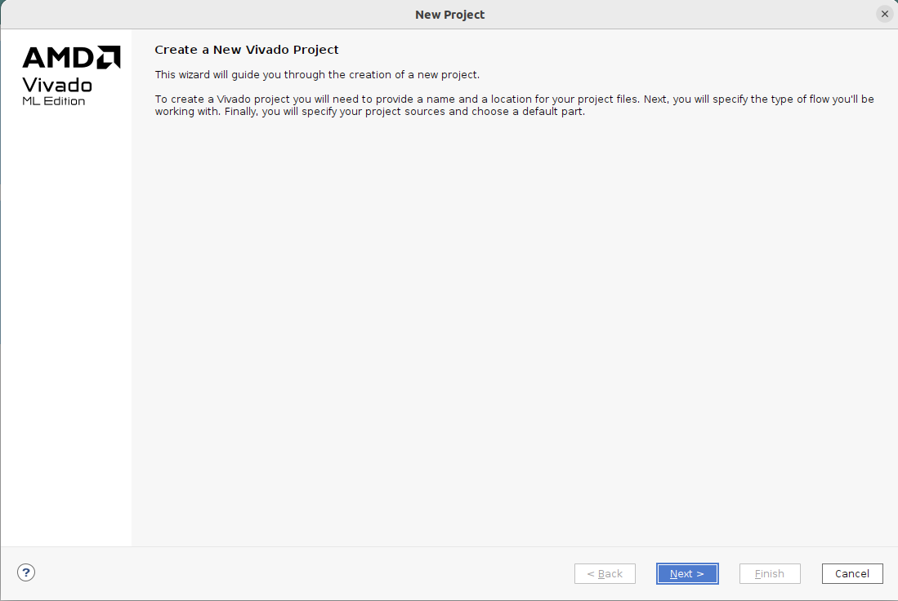

### 프로젝트 이름과 위치

- **Project name**: `counter_demo` (원하는 이름으로)
- **Project location**: 프로젝트 파일이 저장될 폴더 (예: `/home/kkh`)
- **Create project subdirectory** 체크는 그대로 둔다 — 이러면 지정한 위치 아래에 프로젝트 이름의 폴더가 새로 생겨서 파일들이 깔끔하게 모인다.

아래쪽 안내처럼 최종 경로가 `/home/kkh/counter_demo`로 만들어진다. **Next**.

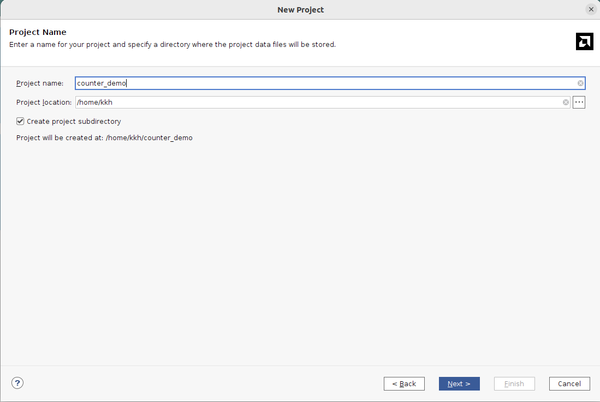

:::note[경로에 한글/공백 피하기]
프로젝트 경로에 한글이나 공백이 들어가면 합성·구현 단계에서 이상한 에러가 날 수 있다. 되도록 **영문 + 언더스코어**로만 된 경로를 쓰자.
:::

### 프로젝트 타입

**RTL Project**를 선택한다. Verilog/SystemVerilog로 직접 회로를 설계하고 합성·구현·비트스트림 생성까지 다 하는, 가장 기본적이고 일반적인 타입이다.

이때 **"Do not specify sources at this time"** 체크박스는 **체크하지 않는다**. (체크하면 소스 추가 단계를 건너뛴다. 우리는 뒤에서 파일을 만들 거지만, 마법사 흐름을 다 보여주기 위해 체크 해제 상태로 진행한다.) **Next**.

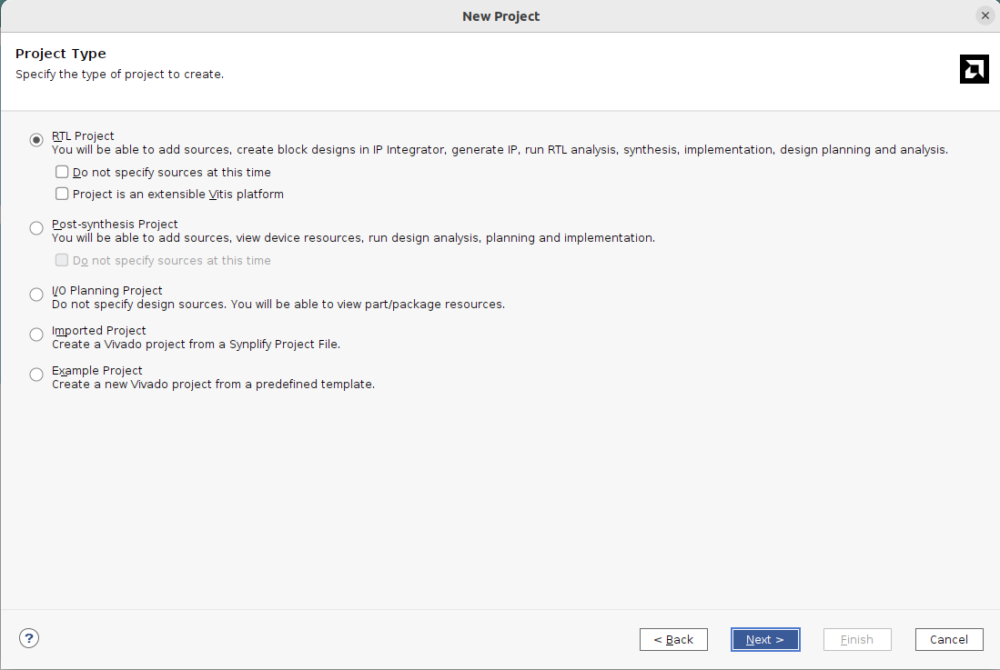

### 소스 추가 (지금은 건너뛰기)

Add Sources 화면이 나온다. 지금은 추가할 파일이 없으니 아무것도 하지 않고 **Next**를 누른다. 소스 파일은 프로젝트를 만든 뒤에 얼마든지 추가할 수 있다.

- **Target language**: `Verilog` (이 글은 Verilog 기준)
- **Simulator language**: `Mixed` (그대로 두면 됨)

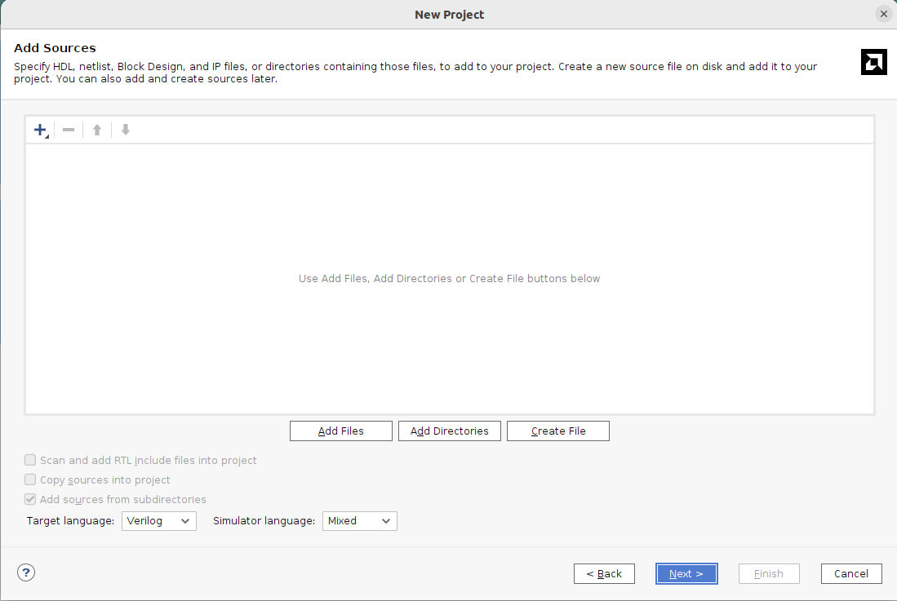

### 제약 파일 추가 (지금은 건너뛰기)

Add Constraints도 마찬가지다. 핀 배치나 타이밍을 지정하는 `.xdc` 제약 파일인데, 지금은 없으니 그냥 **Next**.

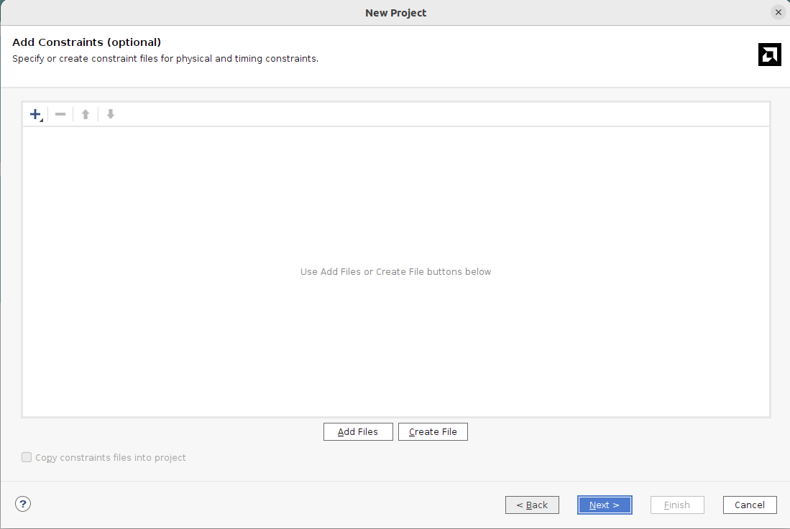

### 보드/파트 선택

여기가 중요하다. 내가 쓸 **보드 또는 칩(Part)** 을 고르는 단계다.

- 상단에서 **Boards** 탭을 선택한다.
- Search 칸에 자기 보드 이름을 입력한다. 이 글은 `zcu208`을 검색해서 **Zynq UltraScale+ RFSoC ZCU208 Evaluation Kit**을 선택했다.
- 만약 목록에 보드가 안 보이면 아래 **Refresh** 버튼을 눌러 보드 목록을 최신화한다.

자기 보드가 없다면 **Parts** 탭에서 칩 번호(예: `xczu48dr-fsvg1517-2-e`)를 직접 검색해 골라도 된다. **Next**.

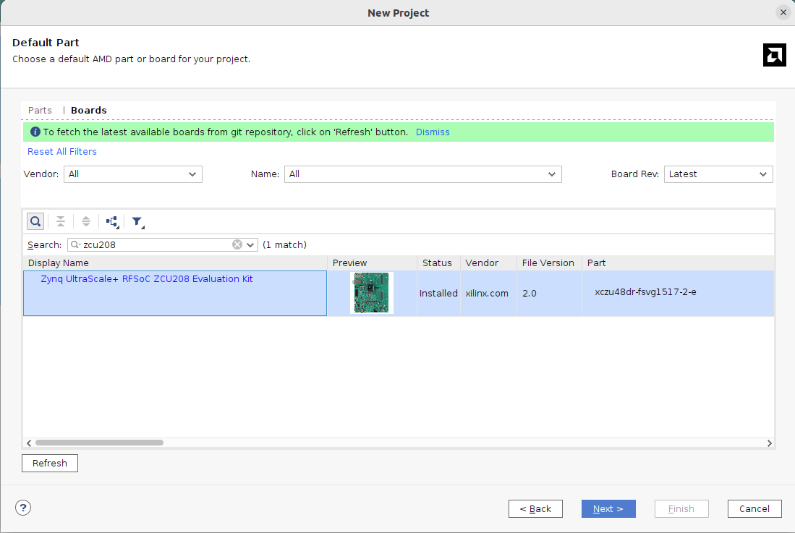

:::tip[보드 vs 파트]
**Board**를 고르면 그 보드에 맞는 핀맵·클럭 등 정보가 자동으로 딸려와서 편하다. **Part**만 고르면 칩만 지정하는 거라 핀 배치를 직접 다 해줘야 한다. 초보라면 자기 보드가 목록에 있는지 먼저 확인하자.
:::

### 요약 확인 후 완료

마지막 Summary 화면에서 지금까지 설정한 내용을 확인한다.

- 프로젝트 이름: `counter_demo`
- 소스/제약 없음 (나중에 추가)
- Default Part: `xczu48dr-fsvg1517-2-e` (ZCU208)

문제 없으면 **Finish**.

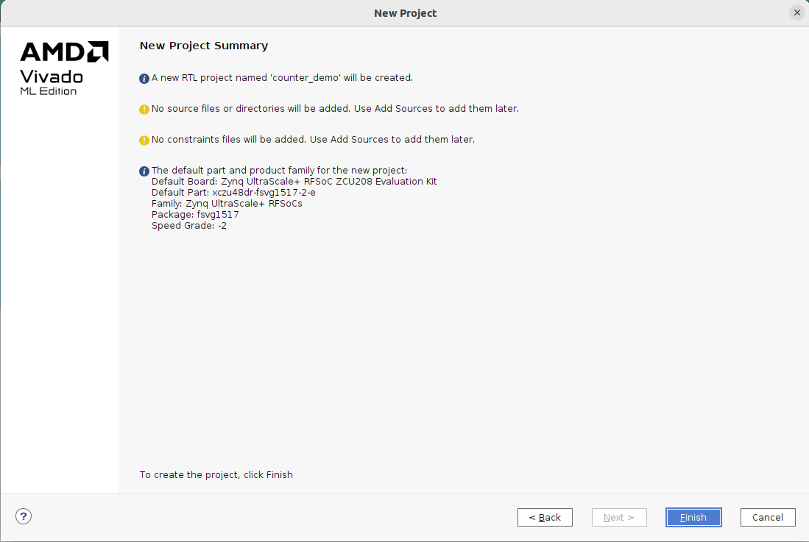

## 2. 프로젝트 메인 화면 살펴보기

Finish를 누르면 Vivado 메인 화면이 뜬다. 처음 보면 창이 많아 복잡해 보이지만, 실제로 자주 쓰는 곳은 몇 군데 안 된다.

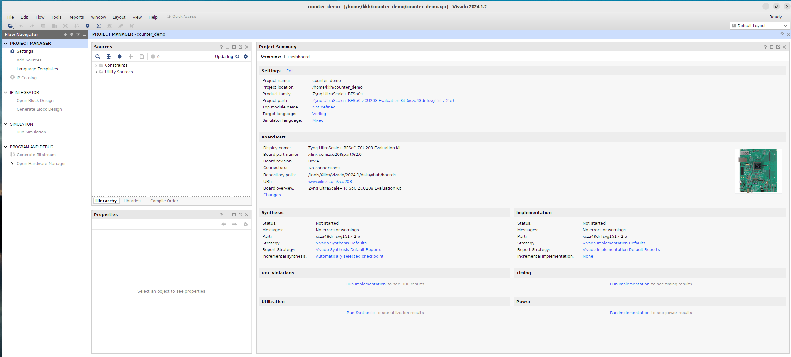

- **왼쪽 Flow Navigator**: 개발 흐름 전체가 위에서 아래로 나열돼 있다. `PROJECT MANAGER → IP INTEGRATOR → SIMULATION → SYNTHESIS → IMPLEMENTATION → PROGRAM AND DEBUG` 순서로 내려가면 된다고 생각하면 쉽다.
- **가운데 Sources 창**: 프로젝트에 포함된 파일들(Design Sources / Constraints / Simulation Sources)이 여기 뜬다.
- **오른쪽 Project Summary**: 프로젝트 설정 요약. 여기서 Top module name이 `Not defined`인 게 보이는데, 아직 소스를 안 넣었으니 당연하다.

이제 여기에 파일을 채워 넣을 차례다.

## 3. 시뮬레이션용 Testbench 만들기

먼저 **testbench**부터 만든다. Testbench는 실제 하드웨어에 올라가는 회로가 아니라, **설계한 회로가 제대로 도는지 컴퓨터에서 검증**하기 위한 코드다. 클럭을 만들어주고, 리셋을 넣고, 결과를 관찰한다.

Sources 창의 **`+` 버튼**을 누르거나, 메뉴에서 소스 추가를 하면 Add Sources 대화상자가 뜬다. 여기서 **Add or create simulation sources**를 선택하고 **Next**.

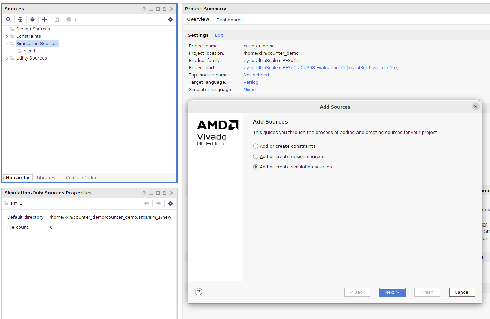

### 파일 생성

다음 화면에서 **Create File** 버튼을 누른다.

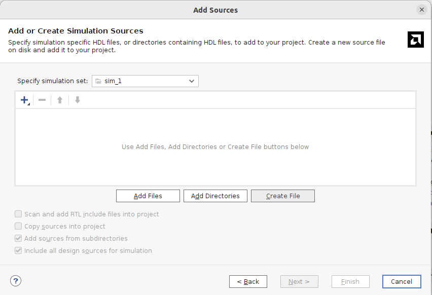

Create Source File 대화상자가 뜨면:

- **File type**: `Verilog`
- **File name**: `tb`
- **File location**: `<Local to Project>` (그대로)

**OK**를 누른다.

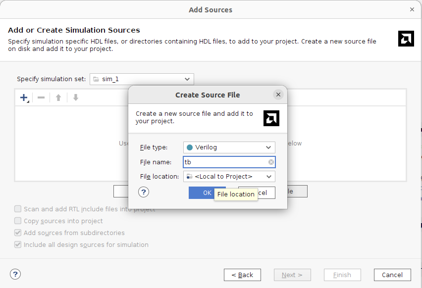

목록에 `tb.v`가 추가된 걸 확인하고 **Finish**.

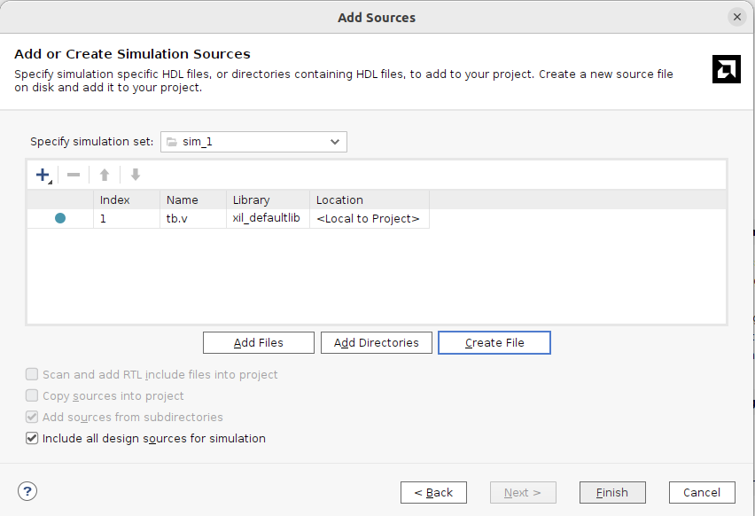

### Define Module (그냥 넘어가기)

Finish를 누르면 Define Module 창이 뜬다. 여기서 포트(입출력 신호)를 GUI로 정의할 수 있는데, **testbench는 외부 포트가 없으므로** 아무것도 입력하지 않고 **OK**를 누른다.

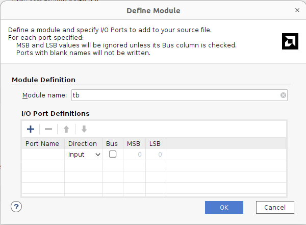

"모듈 정의가 변경되지 않았다"는 확인 창이 뜨면 **Yes**를 눌러 그대로 진행한다.

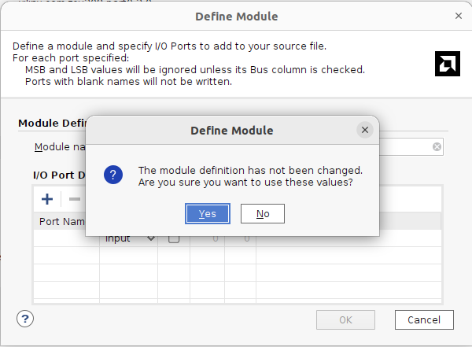

이제 Sources 창의 **Simulation Sources → sim_1** 아래에 `tb.v`가 생긴 걸 볼 수 있다.

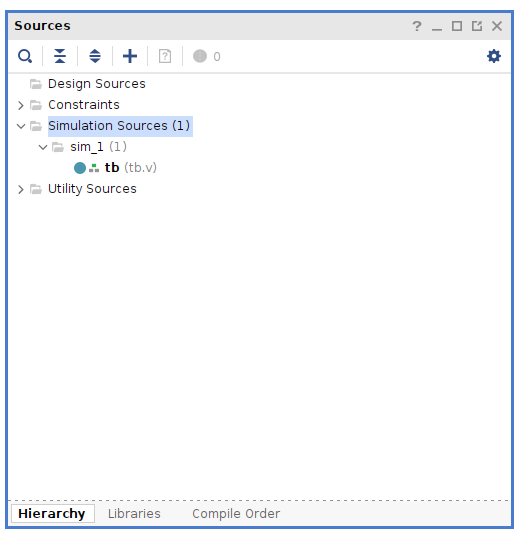

### testbench 코드 작성

`tb.v`를 더블클릭해서 열고, 아래 내용을 채워 넣는다. 이 testbench는 **100MHz 클럭을 만들고, 리셋을 잠깐 걸었다 풀고, 카운터(`counter`)를 인스턴스화해서 값이 올라가는 걸 관찰**한다.

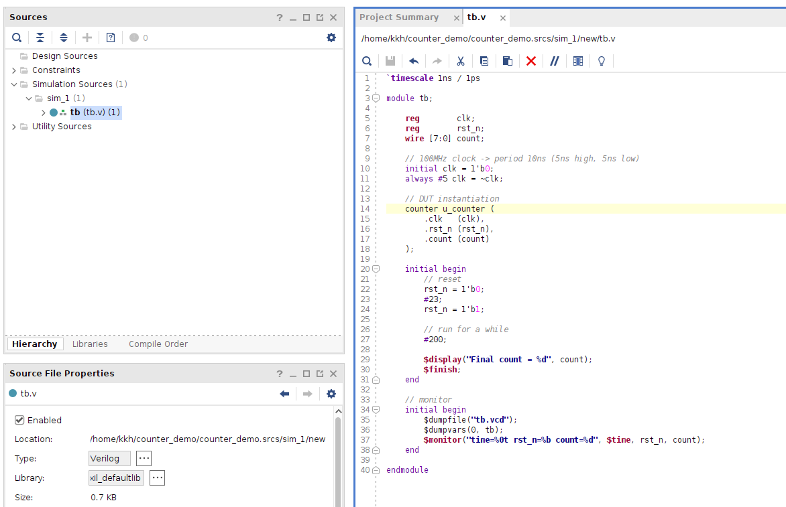

```verilog
`timescale 1ns / 1ps

module tb;

    reg         clk;
    reg         rst_n;
    wire [7:0]  count;

    // 100MHz clock -> period 10ns (5ns high, 5ns low)
    initial clk = 1'b0;
    always #5 clk = ~clk;

    // DUT instantiation
    counter u_counter (
        .clk   (clk),
        .rst_n (rst_n),
        .count (count)
    );

    initial begin
        // reset
        rst_n = 1'b0;
        #23;
        rst_n = 1'b1;

        // run for a while
        #200;

        $display("Final count = %d", count);
        $finish;
    end

    // monitor
    initial begin
        $dumpfile("tb.vcd");
        $dumpvars(0, tb);
        $monitor("time=%0t rst_n=%b count=%d", $time, rst_n, count);
    end

endmodule
```

:::note[코드 뜯어보기]
- **`` `timescale 1ns / 1ps``**: 시뮬레이션의 시간 단위. `#5`는 5ns를 뜻하게 된다.
- **`always #5 clk = ~clk;`**: 5ns마다 clk를 뒤집으니 주기 10ns = **100MHz** 클럭이 만들어진다.
- **`counter u_counter (...)`**: 아직 안 만든 `counter` 모듈을 미리 연결(인스턴스화)해뒀다. 이게 우리가 검증할 대상, 즉 **DUT(Design Under Test)** 다.
- **`$monitor`**: 신호가 바뀔 때마다 값을 콘솔에 찍어준다. 카운터가 올라가는 걸 텍스트로 확인할 수 있다.
- **`$dumpfile / $dumpvars`**: 파형(waveform)을 파일로 저장한다.
:::

## 4. 카운터 RTL(counter.v) 만들기

testbench가 부르고 있는 `counter` 모듈이 아직 없다. 이번엔 **design source**로 만든다. testbench와 달리 이건 **실제 FPGA에 합성되어 하드웨어가 되는 코드**다.

다시 Sources의 **`+`** → Add Sources → 이번엔 **Add or create design sources**를 선택하고 **Next**.

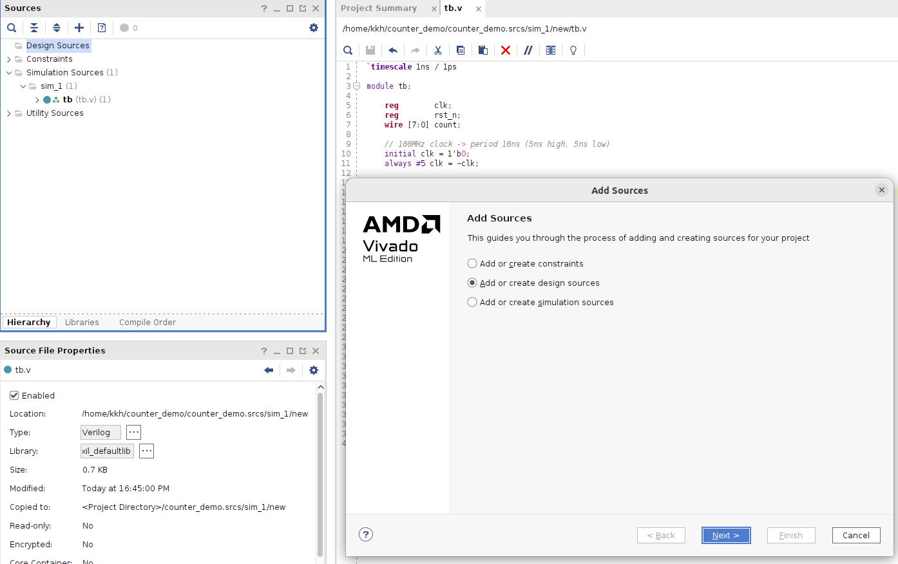

**Create File**을 누르고,

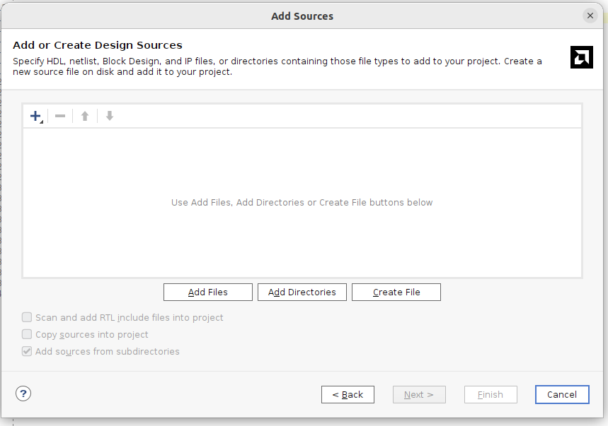

- **File type**: `Verilog`
- **File name**: `counter`

로 만든다. **OK**를 누르면 목록에 `counter.v`가 추가된다.

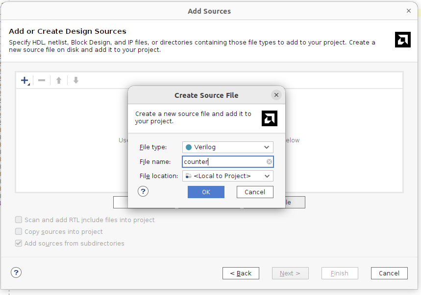

목록에서 `counter.v`를 확인하고 **Finish**.

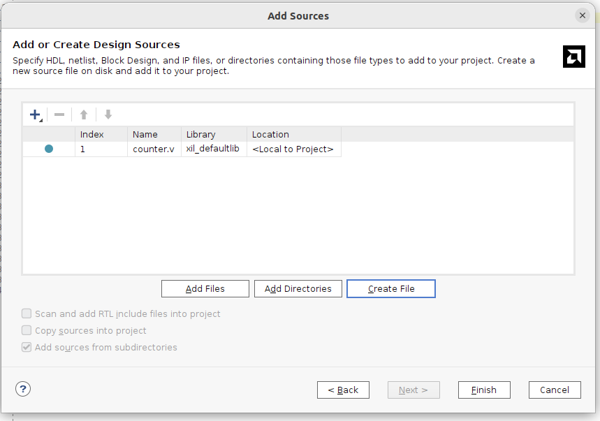

### Define Module (역시 넘어가기)

`tb` 때와 똑같이 Define Module 창이 뜬다. 여기서도 포트를 GUI로 채우지 않고 코드에서 직접 쓸 거라, 아무것도 입력하지 않고 **OK**를 누른다.

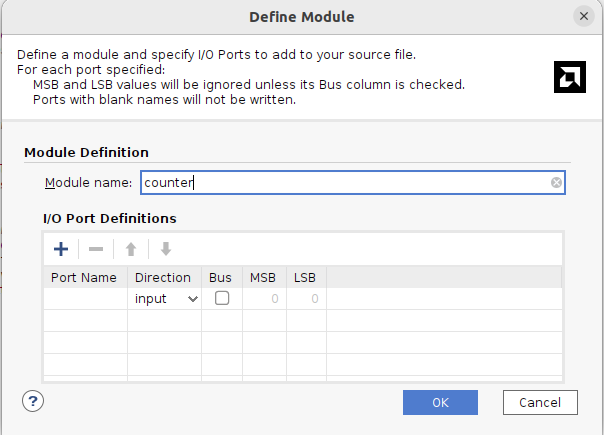

"변경되지 않았다"는 확인 창에는 **Yes**.

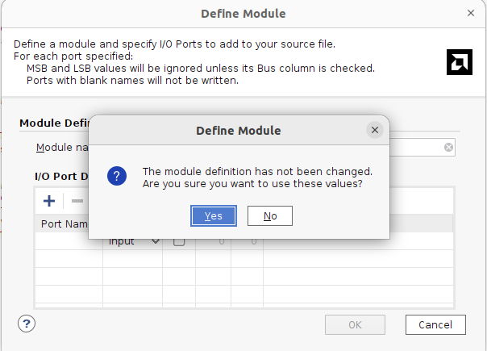

이제 Sources 창의 **Design Sources** 아래에 `counter (counter.v)`가 생겼다.

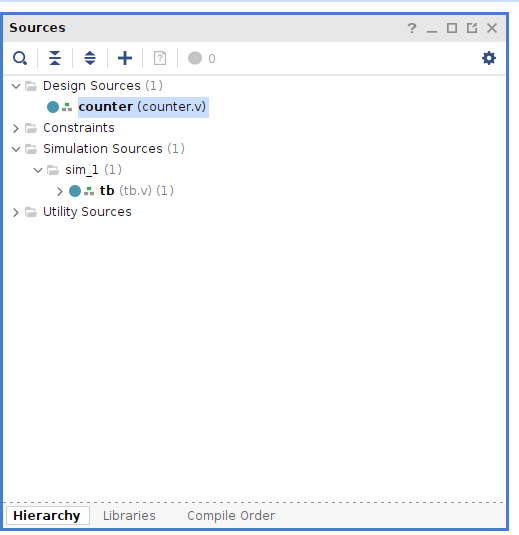

### counter 코드 작성

`counter.v`를 열고 아래처럼 작성한다. **매 클럭 1씩 증가하는 8비트 카운터**다.

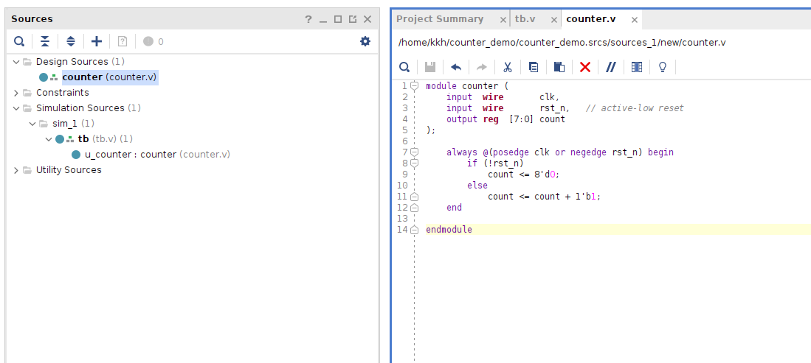

```verilog
module counter (
    input  wire      clk,
    input  wire      rst_n,   // active-low reset
    output reg [7:0] count
);

    always @(posedge clk or negedge rst_n) begin
        if (!rst_n)
            count <= 8'd0;         // 리셋되면 0
        else
            count <= count + 1'b1; // 매 클럭 +1
    end

endmodule
```

:::note[핵심 3가지]
- **`posedge clk`**: 클럭이 0→1로 올라가는 순간에만 동작 (동기 회로의 기본).
- **`negedge rst_n`**: `rst_n`이 0이 되면 즉시 리셋 (**active-low** 비동기 리셋 — 0일 때 리셋이라는 뜻).
- **`count <= count + 1'b1`**: 매 클럭 1씩 증가. 8비트라 255 다음엔 자동으로 0으로 돌아온다(오버플로).
:::

코드를 저장하면 Sources 창에서 계층(hierarchy)이 완성된 걸 볼 수 있다. **Simulation Sources**에서는 `tb`가 최상위이고 그 아래에 `u_counter : counter`가 인스턴스로 들어간 모습이다. testbench가 counter를 감싸고 있으니 시뮬레이션에서는 `tb`가 top이 된다.

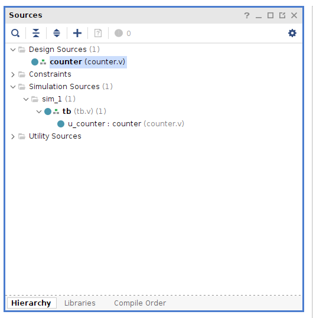

**Design Sources**에서는 `counter`가 단독 top으로 잡힌다. 이게 실제 하드웨어에 올라갈 회로다.

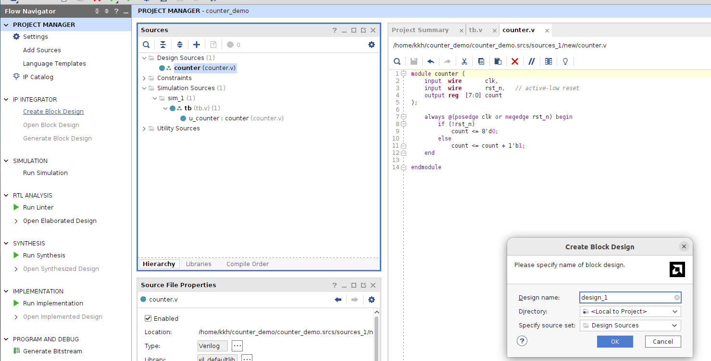

## 5. 시뮬레이션 돌려보기

Flow Navigator의 **SIMULATION → Run Simulation → Run Behavioral Simulation**을 누른다.

파형 창(Waveform)이 뜨면 `clk`, `rst_n`, `count` 신호가 보인다. 처음엔 시간이 짧게 잡혀 있을 수 있으니, 툴바에서 **Run All**(또는 일정 시간 Run)을 눌러 충분히 돌린 뒤 **Zoom Fit**으로 전체를 본다.

확인할 것:
- `rst_n`이 0인 동안 `count`가 **0으로 유지**되는가
- `rst_n`이 1이 된 뒤 `count`가 **1, 2, 3...으로 올라가는가**
- Tcl Console에 `$monitor`가 찍어주는 값이 순서대로 증가하는가

여기까지 정상이면 **논리적으로는 카운터가 완성**된 것이다. 이제 진짜 하드웨어에 올릴 준비를 한다.

:::tip[시뮬레이션이 먼저인 이유]
FPGA에 비트스트림을 굽고 보드에 올리는 건 시간이 오래 걸린다(합성+구현+생성에 몇 분~수십 분). 시뮬레이션으로 **논리 오류를 먼저 잡아두면** 보드에서 헤매는 시간을 크게 줄일 수 있다.
:::

## 6. Block Design 만들기 — PS와 PL을 한 그림에 올리기

이 데모는 **Zynq UltraScale+ MPSoC** 보드를 쓴다. 이런 SoC에서는 우리가 만든 PL 로직(`counter`)만 달랑 올리는 게 아니라, **PS(ARM CPU 블록)** 를 같이 배치해서 PL에 **클럭과 리셋을 공급**하게 하는 게 일반적이다. 이걸 GUI로 블록들을 배치·연결해서 하는 게 **IP Integrator의 Block Design**이다.

:::note[왜 굳이 Block Design인가]
`counter`에 클럭(`clk`)과 리셋(`rst_n`)을 줘야 하는데, Zynq 보드에서 이 신호를 가장 손쉽게 얻는 방법이 **PS 블록이 만들어주는 `pl_clk0`(PL 클럭)과 `pl_resetn0`(PL 리셋)** 을 가져다 쓰는 것이다. Block Design은 이 배선을 시각적으로, 그리고 상당 부분 자동으로 해준다.
:::

Flow Navigator의 **IP INTEGRATOR → Create Block Design**을 누른다. 이름(Design name)은 기본값 `design_1` 그대로 두고 **OK**.

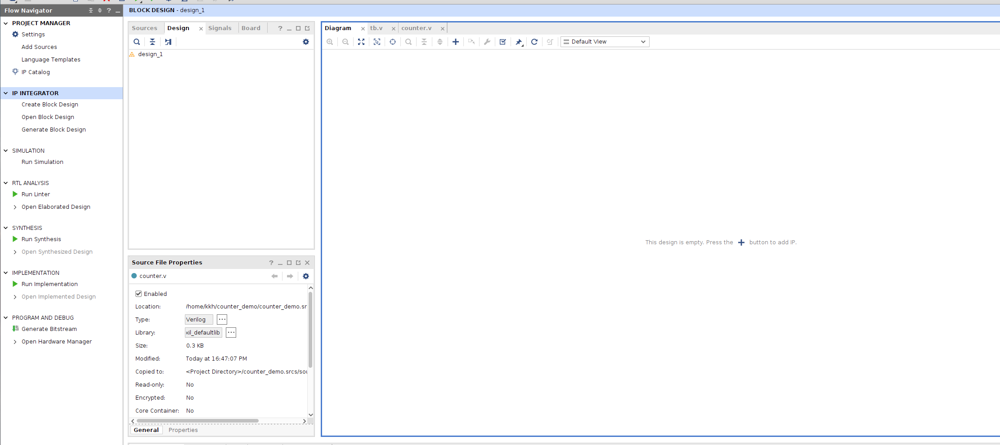

빈 다이어그램 캔버스가 열린다. 가운데 "This design is empty. Press the + button to add IP." 안내가 보인다.

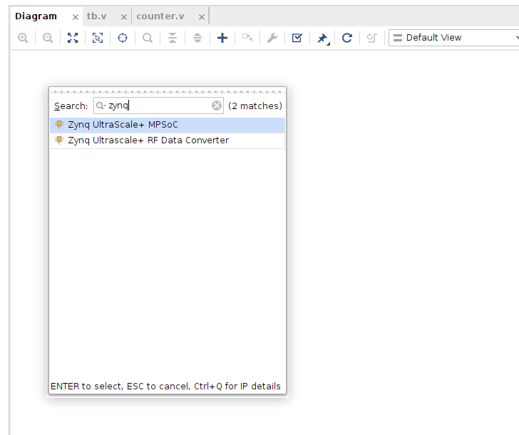

### (1) Zynq PS 추가

캔버스에서 **`+` 버튼**(Add IP)을 누르고 검색창에 `zynq`를 입력한다. **Zynq UltraScale+ MPSoC**를 더블클릭해 추가한다.

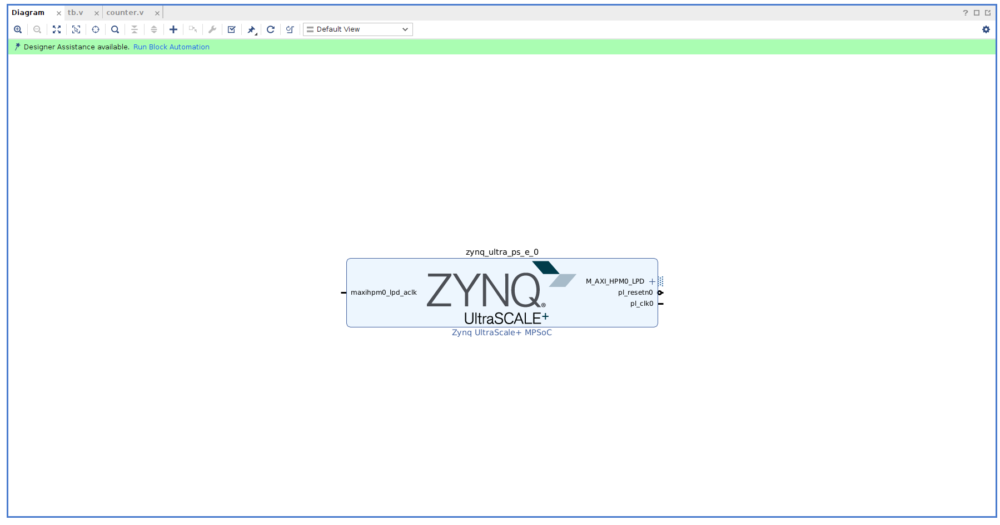

Zynq MPSoC 블록이 캔버스에 올라온다. 상단에 초록색 띠로 **"Designer Assistance available. Run Block Automation"** 이 뜬다.

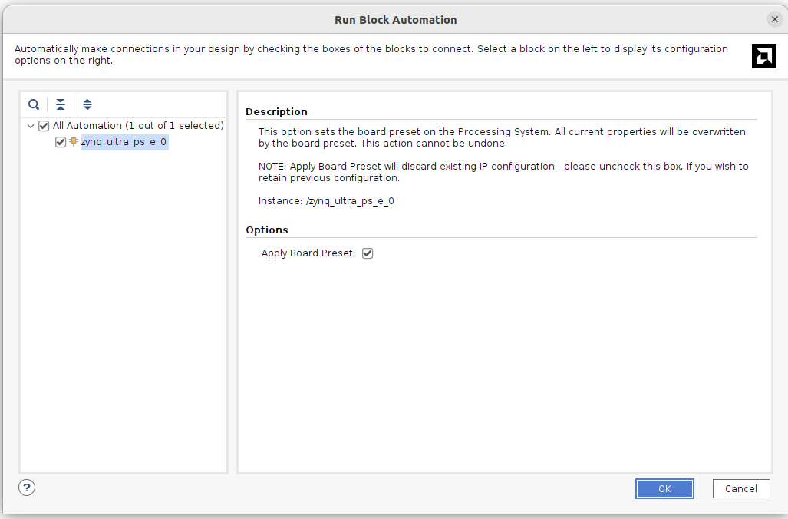

### (2) Run Block Automation — 보드 프리셋 적용

초록 띠의 **Run Block Automation**을 누른다. 대화상자에서 `zynq_ultra_ps_e_0`가 선택돼 있고 **Apply Board Preset**이 체크돼 있다. 이건 우리가 고른 보드(ZCU208)에 맞는 PS 설정을 자동으로 넣어주는 것이다. 그대로 **OK**.

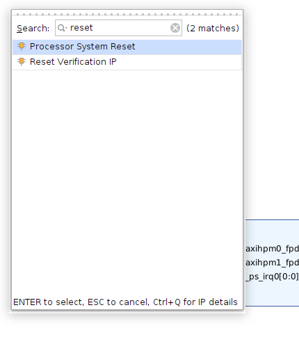

:::note[Apply Board Preset이 하는 일]
PS에는 DDR, 클럭, MIO 핀 등 설정해야 할 게 아주 많다. 보드 프리셋은 이 값들을 **해당 보드에 맞게 한 번에 채워준다.** 초보가 직접 손댈 필요 없이, 보드가 정상 동작하는 기본 설정을 얻는 가장 안전한 방법이다.
:::

### (3) Processor System Reset 추가

이번엔 PL 쪽 리셋을 만들어주는 IP를 넣는다. 다시 **`+`** → 검색창에 `reset` → **Processor System Reset**을 더블클릭.

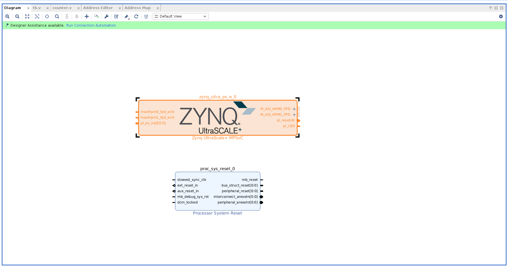

`proc_sys_reset_0` 블록이 추가된다. 이 블록은 PS가 준 리셋 신호를 받아, PL 로직이 쓰기 좋은 **동기화된 리셋**으로 만들어준다.

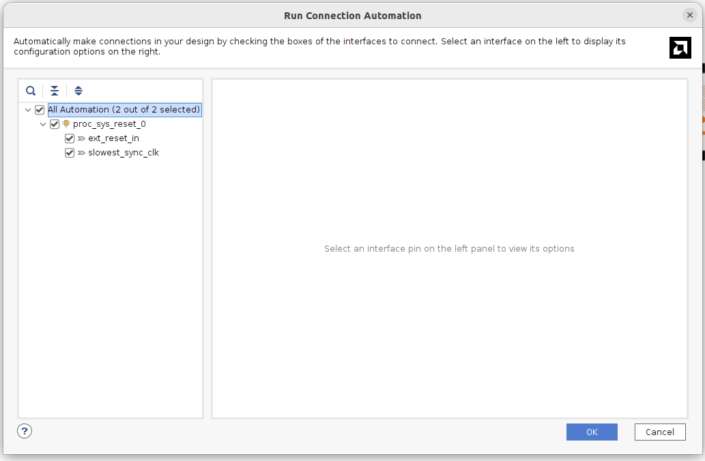

### (4) Run Connection Automation — 자동 배선

`proc_sys_reset_0`을 넣으면 상단에 이번엔 **Run Connection Automation**이 뜬다. 이걸 누르면 Vivado가 "이 리셋 블록의 `ext_reset_in`과 `slowest_sync_clk`를 PS의 어디에 연결할지" 자동으로 제안한다.

**All Automation**을 체크한 채로 **OK**를 누르면, `proc_sys_reset_0`의 클럭·리셋 입력이 PS의 `pl_clk0`·`pl_resetn0`에 자동으로 이어진다.

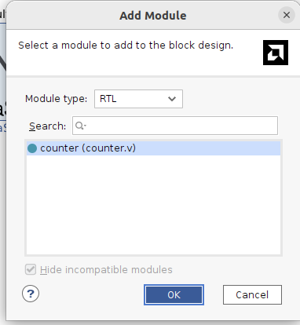

## 7. counter 모듈을 Block Design에 넣고 연결하기

이제 우리가 만든 `counter`를 이 블록 다이어그램 안으로 가져온다.

캔버스 빈 곳에서 **우클릭 → Add Module...**을 선택하면 Add Module 창이 뜬다. Module type이 `RTL`인 상태에서 목록의 **`counter (counter.v)`** 를 선택하고 **OK**.

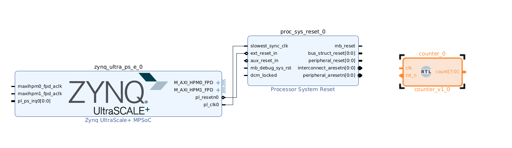

`counter_0` 블록이 캔버스에 나타난다. 아직 아무 데도 연결되지 않은 상태다. (`clk`, `rst_n` 입력과 `count[7:0]` 출력이 보인다.)

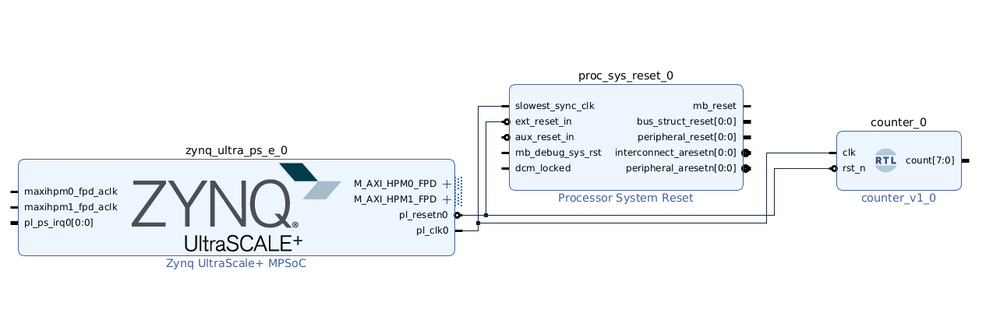

### 클럭과 리셋 수동 연결

이제 배선을 직접 이어준다. 포트 위에 마우스를 올리면 연필/연결 커서로 바뀌는데, 끌어다 놓아 선을 만든다.

- **PS의 `pl_clk0`** → **`counter_0`의 `clk`**
- **`proc_sys_reset_0`의 `peripheral_aresetn[0:0]`** → **`counter_0`의 `rst_n`**

:::tip[클럭은 왜 pl_clk0에서?]
PL 로직은 반드시 어딘가에서 **클럭**을 받아야 돈다. Zynq PS가 만들어 내보내는 `pl_clk0`이 그 소스다. 리셋은 방금 넣은 `proc_sys_reset_0`이 정리해준 `peripheral_aresetn`(active-low)을 쓰면, 우리 counter의 `rst_n`과 극성(0일 때 리셋)이 딱 맞는다.
:::

연결이 끝나면 아래처럼 PS → reset → counter로 클럭·리셋이 흐르는 그림이 완성된다.

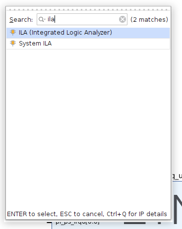

## 8. ILA 추가하기 — 하드웨어 내부를 들여다보는 창

시뮬레이션은 컴퓨터 안에서의 검증이다. 그런데 **실제 보드에서도 카운터가 정말 올라가는지** 어떻게 확인할까? FPGA 내부 신호는 눈에 안 보인다. 이때 쓰는 게 **ILA(Integrated Logic Analyzer)** 다.

ILA는 FPGA 안에 같이 심어 넣는 **미니 로직 분석기**다. 원하는 신호를 실시간으로 캡처해서 JTAG를 통해 PC로 보내주므로, 보드가 돌아가는 중에 내부 파형을 볼 수 있다. Block Design에서는 이걸 **IP 하나 추가하듯** 넣을 수 있다.

캔버스에서 **`+`** → 검색창에 `ila` → **ILA (Integrated Logic Analyzer)** 를 더블클릭.

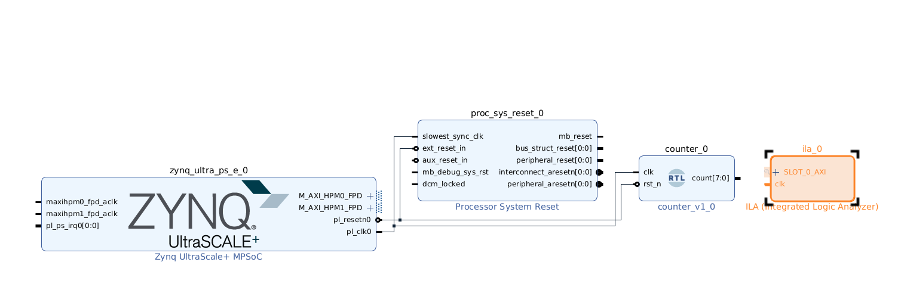

`ila_0` 블록이 추가된다. 이 블록의 `probe0` 입력에 우리가 관찰하고 싶은 신호 — 즉 `counter_0`의 `count[7:0]` — 를, `clk`에는 `counter`와 같은 클럭(`pl_clk0`)을 연결하면 된다.

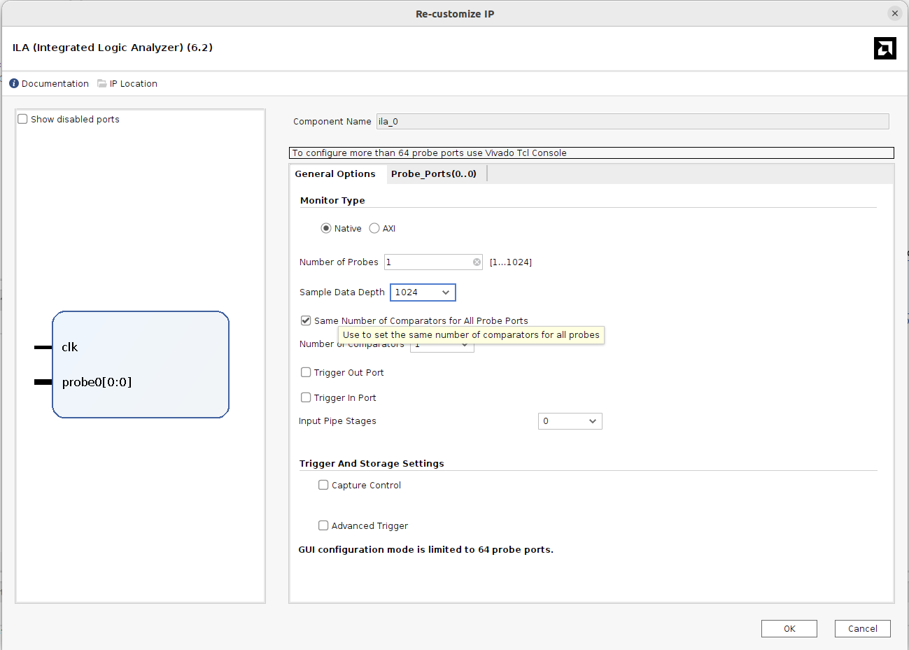

### ILA 설정 — Probe 폭 맞추기

`ila_0`을 더블클릭하면 설정(Re-customize IP) 창이 뜬다. **General Options** 탭에서는 기본값(Monitor Type `Native`, Number of Probes `1`, Sample Data Depth `1024`)을 그대로 두면 된다.

중요한 건 **Probe_Ports(0..0)** 탭이다. 여기서 `PROBE0`의 **Probe Width**를 `8`로 바꾼다. 우리가 관찰할 `count`가 `[7:0]`, 즉 8비트이기 때문이다. 값을 넣고 **OK**.

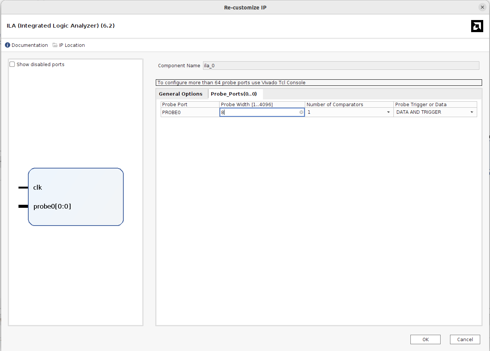

:::note[probe 폭은 왜 8인가]
`count[7:0]`은 8개의 비트로 된 신호다. ILA의 `probe0`도 이 폭에 정확히 맞춰야 연결이 된다. 폭이 1(기본값)인 채로 8비트 신호를 이으려 하면 에러가 나거나 한 비트만 잡힌다. 관찰하려는 신호의 비트 수 = probe 폭, 이 규칙만 기억하면 된다.
:::

### count을 probe에 연결

`counter_0`의 **`count[7:0]` 출력**을 `ila_0`의 **`probe0[7:0]` 입력**에 끌어다 연결하고, `ila_0`의 **`clk`** 도 `counter`와 같은 클럭(`pl_clk0`)에 연결한다. 이러면 ILA가 매 클럭 `count` 값을 캡처하게 된다.

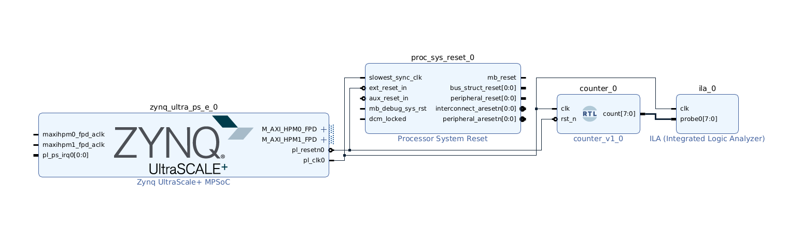

이렇게 하면 Block Design 전체가 **PS(클럭·리셋 공급) → Processor System Reset(리셋 정리) → counter(카운트 생성) → ILA(카운트 관찰)** 로 이어진 하나의 그림으로 완성된다.

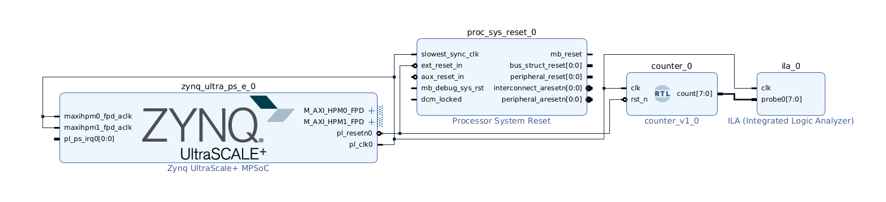

## 9. 설계 검증(Validate)과 HDL Wrapper 만들기

블록을 다 연결했으면, 배선에 실수가 없는지 **Validate Design**으로 점검한다. 다이어그램 툴바에서 **체크 표시 아이콘(Validate Design, 단축키 F6)** 을 누른다.

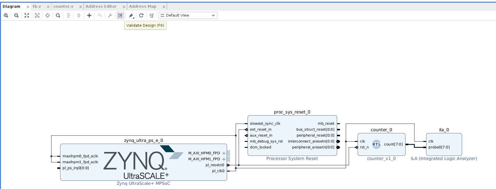

문제가 없으면 "Validation successful. There are no errors or critical warnings in this design." 메시지가 뜬다. **OK**.

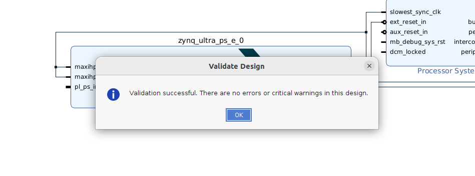

:::tip[Validate를 습관으로]
Block Design은 선을 눈으로 잇다 보니 실수가 잦다(폭 안 맞음, 빠진 연결 등). 합성에 몇 분씩 쓰고 나서 에러를 발견하면 아깝다. **연결을 바꿀 때마다 F6로 Validate** 하는 습관을 들이면 시간을 크게 아낀다.
:::

### HDL Wrapper 생성

Block Design(`design_1`)은 그 자체로 합성되지 않는다. 이걸 감싸는 **최상위 HDL 파일(wrapper)** 이 필요하다. Sources 창에서 `design_1`을 **우클릭 → Create HDL Wrapper...** 를 선택한다.

옵션에서 **"Let Vivado manage wrapper and auto-update"** 를 선택하고 **OK**. (블록 디자인을 바꿀 때마다 wrapper를 Vivado가 알아서 갱신해주는, 가장 편한 옵션이다.)

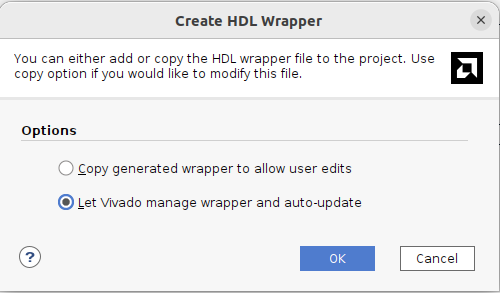

:::note[HDL Wrapper가 뭔가]
Block Design은 "블록들의 연결 그림"이지 합성 대상 그 자체가 아니다. Vivado는 이 그림을 감싸는 얇은 Verilog 파일(`design_1_wrapper.v`)을 만들어, 이걸 **프로젝트의 진짜 top module**로 삼는다. 우리가 손댈 일은 거의 없고, "블록 디자인을 실제 회로로 만들기 위한 껍데기"라고 이해하면 된다.
:::

Wrapper가 만들어지면 Sources의 **Design Sources** 아래에 `design_1_wrapper (design_1_wrapper.v)` 가 생긴다.

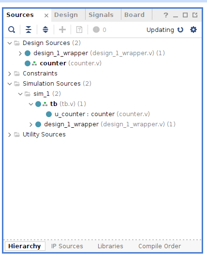

이 `design_1_wrapper`가 자동으로 **top module**(볼드체)로 잡힌 걸 확인한다. 이제 이게 보드에 올라갈 최종 최상위다.

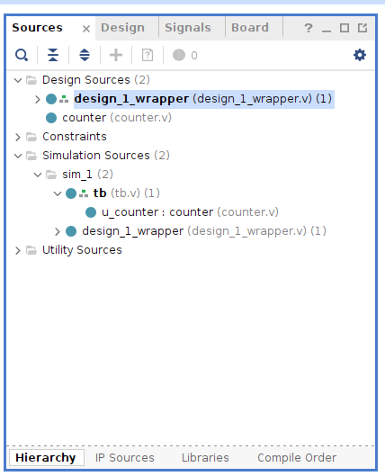

## 10. 비트스트림 생성 (Generate Bitstream)

이제 실제 보드에 구울 파일(**bitstream, `.bit`**)을 만든다. Flow Navigator 맨 아래 **PROGRAM AND DEBUG → Generate Bitstream**을 누른다.

아직 합성·구현을 안 했다면 "No Implementation Results Available. OK to launch synthesis and implementation?" 창이 뜬다. **Yes**를 누르면 합성 → 구현 → 비트스트림 생성이 **한 번에 자동으로** 진행된다.

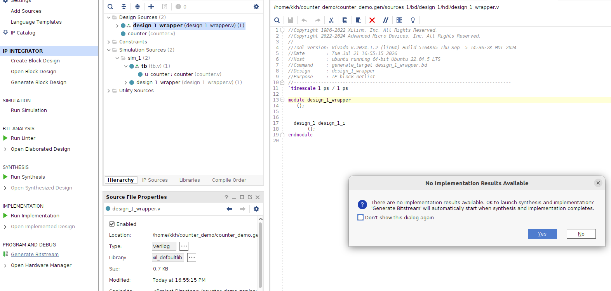

:::note[내부에서 벌어지는 3단계]
1. **Synthesis**: RTL 코드(`counter` + PS 등)를 논리 게이트로 변환
2. **Implementation**: 그 게이트를 실제 칩 안의 위치에 배치하고 배선(place & route)
3. **Bitstream Generation**: 칩에 구울 최종 `.bit` 파일 생성

보드·PC 성능에 따라 몇 분에서 십수 분 걸린다. 커피 한 잔 마실 시간이다.
:::

완료되면 "Bitstream Generation successfully completed." 창이 뜬다. 여기서 **Open Hardware Manager**를 선택하고 **OK**를 누르면 바로 다음 단계로 넘어간다.

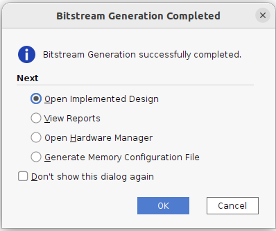

## 11. 보드에 Program Device 하기

이제 만든 비트스트림을 실제 하드웨어에 올린다.

:::tip[먼저 확인]
보드에 **전원이 켜져 있고**, **USB-JTAG 케이블이 PC와 연결**돼 있어야 한다. 안 그러면 Hardware Manager가 보드를 못 찾는다.
:::

Hardware Manager가 열리면 **Open Target → Auto Connect**로 보드에 연결한다. 정상 연결되면 칩(`xczu48dr_0`)이 나타나고, DDR 메모리 캘리브레이션(MIG) 등이 **CAL PASS / Programmed** 로 표시된다.

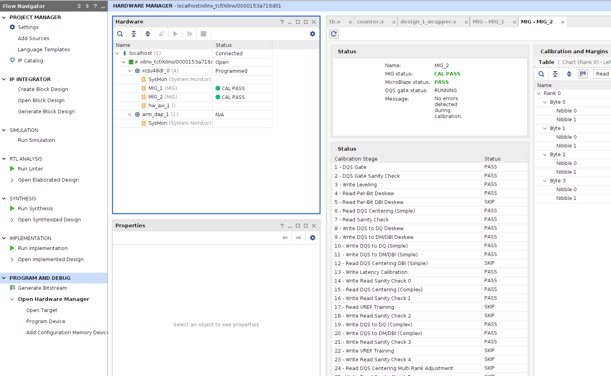

Flow Navigator에서 **Program Device**를 누른다. Program Device 창이 뜨면 방금 만든 두 파일이 자동으로 채워져 있다:

- **Bitstream file**: `design_1_wrapper.bit` (회로 자체)
- **Debug probes file**: `design_1_wrapper.ltx` (ILA가 어떤 신호를 보는지 알려주는 파일)

**Program**을 누른다.

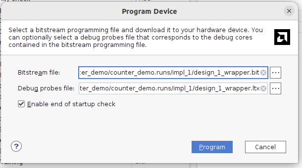

:::note[.ltx 파일이 왜 필요한가]
`.bit`은 회로 그 자체지만, ILA로 신호를 보려면 "이 ILA의 probe0은 `count`라는 신호에 연결돼 있다"는 **매핑 정보**가 따로 필요하다. 그게 `.ltx`(debug probes) 파일이다. 이게 있어야 Hardware Manager 파형 창에 신호 이름이 제대로 뜬다.
:::

프로그래밍 진행 막대가 올라간다.

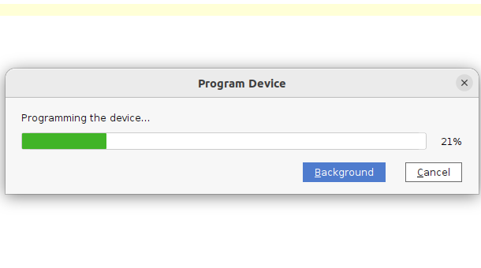

프로그래밍이 끝나는 순간, FPGA 안에서 우리 `counter`가 **이미 돌기 시작**한다. `pl_clk0` 클럭을 받아 매 클럭 +1 하고 있는 것이다.

## 12. ILA로 카운터가 올라가는 것 확인하기

Program이 끝나면 Hardware Manager에 **ILA 파형 창(hw_ila_1)** 이 열린다. 왼쪽 Hardware 트리의 `hw_ila_1` 상태가 `Idle`이고, 파형 창에 `design_1_i/counter_0_count[7:0]` probe가 보인다.

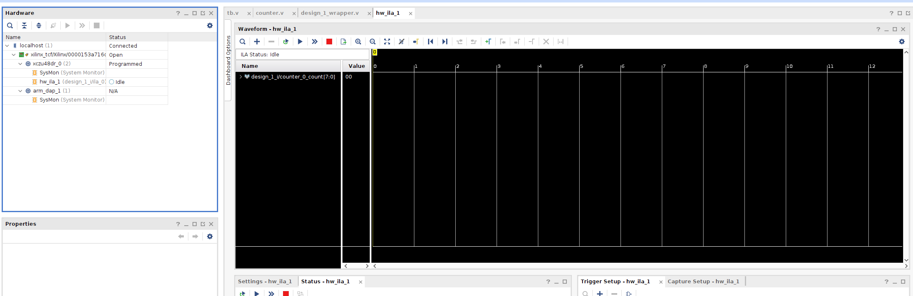

이제 파형 창 툴바에서 **Run Trigger(▶)** 를 누르면 ILA가 실제 하드웨어에서 `count` 값을 캡처해 그려준다.

캡처된 파형을 보면 — **`count`가 0부터 255까지 쭉 올라갔다가 다시 0으로 떨어지는 톱니(sawtooth) 모양**이 반복된다. 이게 바로 8비트 카운터가 매 클럭 +1 하다가 255(`0xFF`) 다음에 0으로 오버플로되는, 우리가 시뮬레이션에서 봤던 바로 그 동작이다. 이번엔 **진짜 FPGA 칩 안에서** 벌어지는 일을 실시간으로 캡처한 것이다.

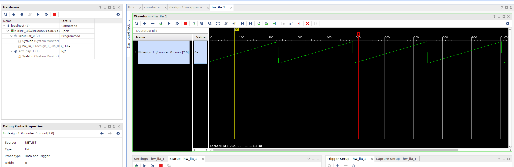

:::tip[값이 안 변하는 것처럼 보인다면]
100MHz로 도는 카운터는 사람 눈에는 너무 빠르다. ILA 한 번 캡처는 아주 짧은 순간(1024 샘플)만 담으므로, 그 안에서 값이 촘촘히 증가하는 게 보인다. **Run Trigger를 여러 번** 누르면 매번 다른 구간이 잡히는 걸로 "계속 돌고 있음"을 확인할 수 있다. 특정 값에서 멈춰 보고 싶으면 Trigger Setup에서 `count == 8'h80` 같은 조건을 걸면 된다.
:::

## 마무리 — 그리고 다음 단계

여기까지 왔다면, FPGA 개발의 가장 기본적인 한 사이클을 처음부터 끝까지 완주한 것이다. 정리하면:

1. Vivado 프로젝트를 처음부터 생성했고
2. counter RTL과 testbench를 만들어 **시뮬레이션으로 논리를 검증**했고
3. **Block Design**에 Zynq PS · Reset · counter · ILA를 배치·연결했고
4. Validate → HDL Wrapper → **비트스트림 생성**을 거쳐
5. 보드에 **program device**하고
6. **진짜 FPGA에서 카운터가 톱니파로 올라가는 파형**을 눈으로 확인했다.

이 단순한 `counter`를 이제 **CPU에서 켜고/끄고 값을 읽는** 형태로 발전시키고 싶다면, 앞 글에서 다룬 **AXI4-Lite 슬레이브 레지스터맵**이 바로 그 다음 단계다. 지금은 PL 안에서 혼자 도는 카운터지만, 레지스터맵을 앞에 붙이면 CPU가 `CNT_START`에 1을 써서 켜고, `CNT_VALUE`를 읽어 지금 값을 가져올 수 있다. 오늘 만든 `count`가, 레지스터맵 뒤에 붙는 PL 하드웨어(`hw_cnt_value`)로 그대로 자라나는 것이다.