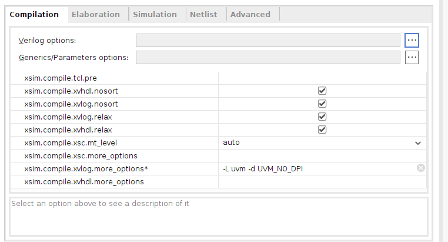
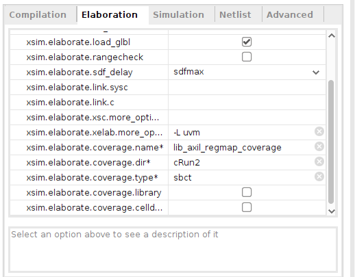
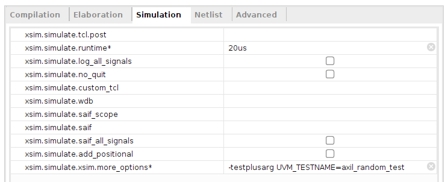
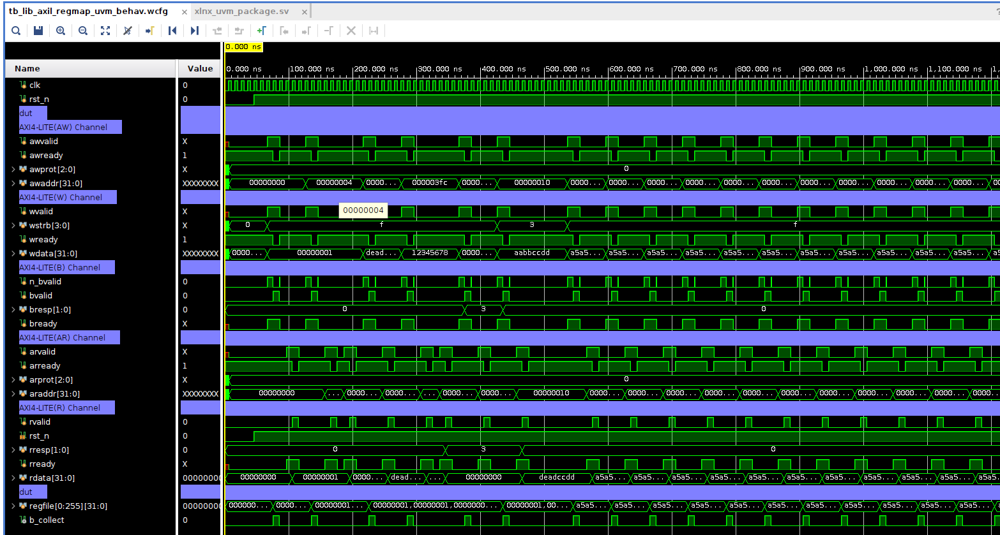
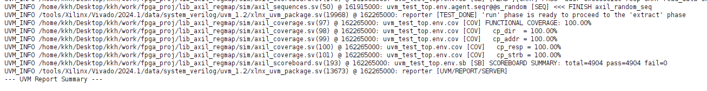

[UVM으로 AXI4-Lite 슬레이브 검증하기](/rtl/uvm-verification/)에서 검증환경의 구조를 코드로 살펴봤다. 이제 그걸 **Vivado에서 실제로 돌려서** PASS/FAIL과 커버리지 결과를 직접 확인해 보자. 이 글은 Xilinx Vivado(2024.1 기준)의 내장 시뮬레이터 **xsim**으로 UVM을 실행하는 설정과, 끝나고 **커버리지 DB를 뽑아 리포트를 읽는 법**을 다룬다.

:::note[이 글을 읽고 나면]
- Vivado에서 UVM 검증환경을 컴파일·실행하는 설정을 안다
- 시뮬레이션을 돌려 PASS/FAIL과 커버리지 결과를 확인할 수 있다
- TCL 명령으로 커버리지 DB를 뽑고, 어떤 리포트를 봐야 하는지 안다
:::

:::tip[먼저 짚고 갈 점 — Vivado UVM의 한계]
Vivado xsim은 UVM을 지원하지만, Questa·VCS 같은 상용 시뮬레이터만큼 기능 커버리지(covergroup) 지원이 완전하지는 않다. 버전에 따라 일부 기능이 제한되거나 옵션 이름이 다를 수 있으니, 본인 Vivado 버전 기준으로 확인하며 따라오는 게 좋다. 이 글은 2024.1 기준이다.
:::

## 1. 큰 그림 — 세 단계 설정

Vivado에서 시뮬레이션은 **컴파일(Compilation) → 정교화(Elaboration) → 실행(Simulation)** 세 단계를 거친다. UVM과 커버리지를 쓰려면 각 단계마다 옵션을 더해줘야 한다. 설정 위치는 Vivado에서 **Settings → Simulation** 탭이다(또는 프로젝트의 Simulation Settings).

- **Compilation**: UVM 라이브러리를 링크하도록 알려준다.
- **Elaboration**: UVM 라이브러리를 한 번 더 링크하고, **커버리지를 수집하라**고 켠다.
- **Simulation**: 어떤 테스트를 얼마나 오래 돌릴지 정한다.

하나씩 보자.

## 2. Compilation 설정 — UVM 라이브러리 링크

먼저 컴파일 단계에서 UVM 라이브러리를 링크해야 한다. `xsim.compile.xvlog.more_options` 항목에 다음을 넣는다.

```
-L uvm -d UVM_NO_DPI
```



- `-L uvm` : UVM 라이브러리를 링크하라는 뜻이다. 이게 없으면 `uvm_pkg`를 못 찾아 컴파일 에러가 난다.
- `-d UVM_NO_DPI` : UVM이 쓰는 일부 DPI(C 연동) 기능을 끄는 매크로다. xsim 환경에서 DPI 관련 링크 문제를 피하기 위해 흔히 켜둔다.

위쪽의 `xvlog.relax`, `xvhdl.relax` 같은 체크박스는 문법 검사를 약간 느슨하게 해주는 옵션으로, 기본값 그대로 두면 된다.

## 3. Elaboration 설정 — 커버리지 켜기

여기가 **커버리지의 핵심**이다. Elaboration 단계에서 UVM 라이브러리를 한 번 더 링크하고(`xsim.elaborate.xelab.more_options`에 `-L uvm`), 아래 커버리지 옵션들을 채운다.



| 옵션 | 넣은 값 | 뜻 |
|---|---|---|
| `xsim.elaborate.xelab.more_options` | `-L uvm` | 정교화 단계에서도 UVM 링크 |
| `xsim.elaborate.coverage.name` | `lib_axil_regmap_coverage` | 커버리지 DB에 붙일 이름 |
| `xsim.elaborate.coverage.dir` | `cRun2` | 커버리지 DB가 저장될 폴더 이름 |
| `xsim.elaborate.coverage.type` | `sbct` | 어떤 종류의 커버리지를 수집할지 |

`coverage.type`의 `sbct`는 수집할 커버리지 종류를 글자 하나씩으로 지정한 것이다 — **s**tatement(구문), **b**ranch(분기), **c**ondition(조건), **t**oggle(신호 토글). 우리가 8장에서 만든 **기능 커버리지(covergroup)** 는 코드 안에서 직접 `get_coverage()`로 찍어 보므로, 이 옵션과 별개로 로그에 나타난다(아래 6절에서 확인).

:::note[coverage.name과 coverage.dir 기억해 두기]
이 두 값(`lib_axil_regmap_coverage`, `cRun2`)은 나중에 TCL로 커버리지 리포트를 뽑을 때 그대로 쓰인다. 본인이 정한 이름으로 바꿔도 되지만, 뒤 단계에서 같은 이름을 써야 하니 기억해 두자.
:::

## 4. Simulation 설정 — 어떤 테스트를 얼마나

마지막으로 실행 단계다. **무슨 테스트**를 **얼마 동안** 돌릴지 정한다.



- `xsim.simulate.runtime` : `20us` — 시뮬레이션을 20마이크로초 동안 돌린다. 우리 테스트가 모든 시퀀스를 끝내기에 충분한 시간이다. (너무 짧으면 시퀀스가 다 안 돌고, 너무 길면 시간만 낭비된다.)
- `xsim.simulate.xsim.more_options` : `-testplusarg UVM_TESTNAME=axil_random_test` — **어떤 UVM 테스트를 실행할지** 지정한다. 앞 글에서 본 `axil_random_test`가 여기 들어간다.

:::tip[UVM_TESTNAME으로 테스트를 바꾼다]
`UVM_TESTNAME`은 UVM의 표준 방식으로, **코드를 다시 컴파일하지 않고도** 실행할 테스트를 바꿀 수 있게 해준다. 예를 들어 `axil_random_test` 대신 다른 테스트 클래스 이름을 넣으면 그 테스트가 돌아간다. `run_test()`가 이 값을 읽어 해당 테스트를 생성한다(앞 글 11장 참고).
:::

## 5. 실행하고 파형 보기

설정을 마쳤으면 **Run Simulation**을 누른다. xsim이 컴파일 → 정교화 → 실행을 차례로 수행하고, 파형 창이 열린다.



파형에는 우리가 검증한 AXI4-Lite 신호들이 채널별로 묶여 보인다 — **AW**(쓰기 주소), **W**(쓰기 데이터), **B**(쓰기 응답), **AR**(읽기 주소), **R**(읽기 데이터). 예를 들어 `awaddr`가 `00000004`로 바뀌고 `awvalid`/`awready`가 같이 1이 되는 지점이 바로 앞 글에서 본 **주소 채널 핸드셰이크**가 성립하는 순간이다. 맨 아래 `regfile[0:255]`는 DUT 내부의 레지스터 장부로, 쓰기가 일어날 때마다 값이 바뀌는 걸 볼 수 있다.

파형은 "신호가 언제 어떻게 변했나"를 눈으로 확인할 때 유용하지만, **수백~수천 건의 거래가 다 맞았는지**는 파형으로 일일이 보기 어렵다. 그래서 scoreboard와 coverage가 자동으로 채점·집계한 **텍스트 결과**를 봐야 한다. 그게 다음 절이다.

## 6. TCL 콘솔에서 결과 읽기 — PASS/FAIL과 기능 커버리지

시뮬레이션이 끝나면 Vivado 아래쪽 **Tcl Console**에 UVM 리포트가 출력된다. 여기서 두 가지를 확인한다.



**(1) 기능 커버리지 (coverage)**

`axil_coverage.sv`의 `report_phase`가 `get_coverage()`로 찍은 값이 `[COV]` 태그로 나온다.

```
[COV] FUNCTIONAL COVERAGE: 100.00%
[COV]   cp_dir  = 100.00%
[COV]   cp_addr = 100.00%
[COV]   cp_resp = 100.00%
[COV]   cp_strb = 100.00%
```

- `FUNCTIONAL COVERAGE` : 전체 기능 커버리지. 우리가 정의한 모든 관찰 항목을 종합한 값이다.
- `cp_dir`/`cp_addr`/`cp_resp`/`cp_strb` : 항목별 커버리지. 각각 방향(읽기/쓰기), 주소, 응답코드, strobe 패턴을 빠짐없이 봤는지를 %로 보여준다. 앞 글 8장에서 만든 그 coverpoint들이다.

전부 `100.00%`라는 건 **정의한 모든 경우를 한 번 이상 테스트했다**는 뜻이다. 만약 어떤 항목이 100%가 안 되면, "그 경우를 자극하는 시퀀스가 빠졌다"는 신호다.

**(2) 채점 결과 (scoreboard)**

`axil_scoreboard.sv`가 찍은 `[SB]` 요약도 함께 나온다.

```
[SB] SCOREBOARD SUMMARY: total=4904 pass=4904 fail=0
```

총 4904건의 거래를 채점해 **전부 PASS, 실패 0건**이라는 뜻이다. `fail`이 0이 아니면 그 지점에서 DUT가 기대와 다른 응답을 줬다는 것이고, 로그를 위로 올려보면 어느 주소·어떤 거래에서 틀렸는지 `[SB]` 에러 메시지로 찍혀 있다.

:::tip[이 두 줄이 검증의 결론이다]
`fail=0`(scoreboard)과 `100.00%`(coverage), 이 두 가지가 함께 충족돼야 "잘 검증했다"고 말할 수 있다. 앞 글에서 강조했듯, **scoreboard는 "답이 맞았나", coverage는 "충분히 봤나"** 를 본다. 답이 다 맞아도 커버리지가 낮으면 "쉬운 것만 테스트한" 것이고, 커버리지가 높아도 fail이 있으면 버그가 있는 것이다.
:::

## 7. 커버리지 DB 뽑기 — TCL 명령

위의 `[COV]` 로그는 우리가 코드에 직접 찍은 기능 커버리지다. 한편 Elaboration에서 켠 **구조 커버리지(sbct)** 는 별도의 **커버리지 DB**로 저장되는데, 이걸 사람이 읽을 수 있는 리포트로 뽑으려면 TCL 명령을 쓴다.

시뮬레이션이 끝난 상태에서 **Tcl Console**에 다음을 입력한다.

```tcl
# 1) 현재까지 수집된 커버리지를 DB로 저장
xcrg -report_format html -dir cRun2

# (또는) 커버리지 DB를 지정해 리포트 생성
xcrg -report_dir cov_report -dir cRun2
```

- `xcrg` : Xilinx Coverage Report Generator. 커버리지 DB를 읽어 리포트를 만드는 도구다.
- `-dir cRun2` : 3절에서 `coverage.dir`로 정한 폴더(`cRun2`)를 가리킨다. 여기에 커버리지 DB가 쌓여 있다.
- `-report_format html` : 결과를 HTML로 뽑는다. (텍스트로 받으려면 형식 옵션을 바꾼다.)

:::note[명령 이름·옵션은 버전에 따라 다를 수 있다]
`xcrg`의 옵션 이름은 Vivado 버전마다 조금씩 다르다. 콘솔에서 `xcrg -help`를 치면 본인 버전에서 쓸 수 있는 정확한 옵션이 나오니, 막히면 그걸 먼저 확인하자. 핵심은 "**`coverage.dir`로 지정했던 폴더(`cRun2`)를 입력으로 줘서 리포트를 생성한다**"는 흐름이다.
:::

## 8. 어떤 리포트를 봐야 하나

`xcrg`가 만든 리포트 폴더를 열면 보통 **HTML 인덱스 파일**(예: `index.html`)이 있다. 이걸 브라우저로 열면 커버리지를 종류별로 정리한 표가 나온다. 초보자가 봐야 할 핵심은 이렇다.

| 리포트 항목 | 무엇을 보여주나 | 어떻게 읽나 |
|---|---|---|
| **Summary (요약)** | 전체 커버리지 종합 % | 가장 먼저 보는 한눈 요약. 100%에 가까울수록 좋다 |
| **Statement / Branch** | 코드의 각 구문·분기를 실행했나 | 안 돌아간(빨강) 줄이 있으면 그 경로를 안 탄 것 |
| **Toggle** | 각 신호가 0↔1 둘 다 바뀌었나 | 한 값으로만 머문 신호를 찾아낸다 |
| **Functional (covergroup)** | 우리가 정의한 기능 항목 (cp_dir 등) | 8장에서 만든 관찰 항목별 달성률 |

가장 먼저 **Summary**로 전체 그림을 보고, 100%가 안 되는 항목이 있으면 그 항목을 클릭해 **어느 부분이 안 채워졌는지**(어느 주소, 어느 분기, 어느 신호) 파고들면 된다. 그 "빈칸"이 바로 **테스트가 빠뜨린 경우**이고, 그걸 자극하는 시퀀스를 추가하면 커버리지가 올라간다.

:::tip[기능 커버리지 vs 구조 커버리지]
두 가지를 헷갈리지 말자. **기능 커버리지**(covergroup, `[COV]` 로그)는 "내가 **의도한** 상황들을 다 봤나"이고, **구조 커버리지**(statement/branch/toggle, `xcrg` 리포트)는 "코드의 **모든 줄·분기·신호**가 다 동작했나"이다. 둘은 보완 관계다 — 기능 커버리지는 "검증 의도"를, 구조 커버리지는 "코드 빈틈"을 드러낸다.
:::

## 마무리

정리하면, Vivado에서 UVM을 돌리는 건 **세 단계 설정 → 실행 → 결과 확인**의 흐름이다.

1. **Compilation**에서 `-L uvm -d UVM_NO_DPI`로 UVM을 링크하고,
2. **Elaboration**에서 `-L uvm` + 커버리지 옵션(`coverage.name/dir/type`)으로 커버리지를 켜고,
3. **Simulation**에서 `UVM_TESTNAME`으로 테스트를 골라 실행한다.

끝나면 **Tcl Console**에서 `[SB] fail=0`(채점 통과)과 `[COV] 100.00%`(기능 커버리지)를 확인하고, 더 자세한 구조 커버리지는 `xcrg`로 리포트를 뽑아 **Summary부터 빈칸을 찾아 들어가며** 읽으면 된다.

이렇게 "구조를 이해한다(앞 글)"에서 "직접 돌려 결과를 확인한다(이 글)"까지 오면, UVM 검증환경 하나를 처음부터 끝까지 다뤄본 셈이다.