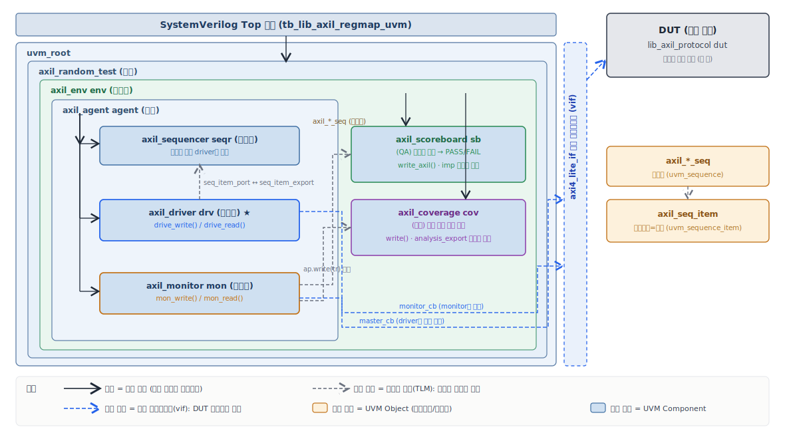

앞선 글 [AXI4-Lite 슬레이브 레지스터맵](/rtl-library/axi4lite-regmap/)에서 회로(RTL)를 한 줄씩 설계했다. 그런데 **설계를 끝냈다고 끝이 아니다.** 정말 이 회로가 시킨 대로 동작하는지 확인해야 한다. 정상적으로 값을 쓰고 읽는 것은 물론, 잘못된 주소가 들어오면 에러를 돌려주는지, 신호가 뒤죽박죽 들어와도 데이터를 안 잃는지까지.

이 "확인" 작업을 **검증(verification)** 이라 하고, 업계 표준 방법이 **UVM**이다. 이 글은 UVM을 한 번도 안 본 사람을 기준으로, 개념부터 실제 코드까지 천천히 풀어본다.

:::tip[딱 한 줄로 요약하면]
**UVM은 검증 작업을 "회사 조직"처럼 역할별 부품 — 신호 생성·구동·관찰·채점 — 으로 나눠 조립하는 업계 표준 프레임워크다.** 이 한 줄만 잡고 시작하면 된다.
:::

:::note[이 글을 읽고 나면]
- UVM이 무엇이고 왜 필요한지 안다
- 검증환경이 어떤 부품들로 이뤄지는지, 각 부품이 무슨 일을 하는지 안다
- 신호 하나가 검증환경 전체를 어떻게 흐르는지 그림이 그려진다
- 우리가 만든 AXI4-Lite 슬레이브를 어떻게 검증하는지 안다
:::

용어를 처음부터 다 외울 필요는 없다. 나오는 자리에서 풀어 설명하니 흐름만 따라오면 된다.

:::tip[자주 나오는 기본 용어 미리보기]
글에 반복해서 나오는 단어 몇 개만 짚고 가자. 다 이해할 필요는 없고, 나올 때 "아 그거" 하면 된다.
- **레지스터**: 회로 안에 값을 저장하는 칸. 주소(0x00, 0x04…)로 구분한다. 메모리의 한 칸이라고 보면 된다.
- **버스(bus)**: 회로와 바깥을 잇는 신호선 묶음. 여기로 주소·데이터가 오간다.
- **클럭(clock)**: 회로의 박자. 모든 동작이 이 박자(클럭 엣지)에 맞춰 일어난다.
- **DUT**: Device Under Test. 우리가 검증하려는 대상 회로.
- **AXI4-Lite**: 회로끼리 값을 주고받는 약속(프로토콜) 중 하나. 앞 글에서 만든 회로가 이 약속을 따른다.
- **응답 코드**: 회로가 명령을 처리한 뒤 돌려주는 결과. **OKAY**=정상 처리, **SLVERR**(slave error)=슬레이브가 거부(예: 주소가 어긋남), **DECERR**(decode error)=주소를 해석 못 함(예: 범위 밖). 이름만 봐도 "정상이냐, 어떤 종류의 에러냐"를 알 수 있다.
:::

---

## 1. 검증이란 무엇인가

검증은 한마디로 **"회로에 일을 시켜보고, 결과가 맞는지 채점하는 것"** 이다.

우리가 만든 회로(이걸 **DUT**, Device Under Test = 검증 대상이라 부른다)에 "0x04 주소에 0x1234를 써라" 같은 명령을 주고, 회로가 내놓은 결과를 미리 계산해 둔 정답과 비교한다. 맞으면 통과(PASS), 틀리면 실패(FAIL).

이걸 가장 단순하게 짜면 이렇게 된다.

```system-verilog
initial begin
    // 0x04에 0x1234 쓰기
    awaddr = 32'h04; awvalid = 1; wdata = 32'h1234; wvalid = 1;
    @(posedge clk);
    // ... 회로가 받았는지 기다리고, 응답 확인하고 ...
    // 0x04 읽어서 0x1234가 나오는지 비교 ...
end
```

테스트 두세 개면 이렇게도 충분하다. **문제는 실전이다.** 잘못된 주소, 부분 쓰기, 신호 순서를 바꾼 경우, 빠르게 연속으로 보내는 경우… 검증해야 할 상황이 수십 가지고, 각각을 수백 번씩 돌려야 한다. 이걸 다 `initial` 블록에 손으로 적으면 코드가 수천 줄로 불어나고, **"신호를 보내는 코드"와 "결과를 채점하는 코드"가 한 덩어리로 엉켜** 손댈 수 없게 된다.

## 2. UVM이 푸는 문제 — 역할을 나눈다

UVM은 이 엉킴을 푸는 표준 방법이다. 핵심 아이디어는 딱 하나, **역할 분리**다.

검증에 필요한 일을 잘게 쪼개서, 각각을 **독립된 부품**에게 맡긴다. 신호를 만드는 부품, 신호를 회로에 보내는 부품, 결과를 지켜보는 부품, 채점하는 부품을 따로 둔다. 그러면 한 부품을 고쳐도 다른 부품은 그대로고, 다음 프로젝트에서 부품을 재사용할 수도 있다.

UVM에서는 이 **부품을 "컴포넌트(component)"** 라고 부른다. 이 글에서 "부품"이라고 하면 곧 UVM 컴포넌트를 가리킨다고 보면 된다. 아래 표의 test·env·agent·sequencer·driver·monitor·scoreboard·coverage가 모두 컴포넌트다.

이 부품들의 관계를 **회사 조직**에 비유하면 단번에 이해된다.

| 회사 비유 | UVM 컴포넌트 | 하는 일 |
|---|---|---|
| 사장 | **test** | 방침을 정하고 "이번엔 이걸 검증해" 지시 |
| 본부장 | **env** | 부서들을 모아 조직을 구성 |
| 팀장 | **agent** | 현장 3인방을 거느림 |
| 파트장 | **sequencer** | 일감을 받아 실무자에게 배분 |
| 현장 실무자 | **driver** | 실제로 신호를 회로에 보내 DUT에 일을 시킴 |
| 감사팀 | **monitor** | 오간 신호를 지켜보고 기록 |
| 품질검사관(QA) | **scoreboard** | 결과를 정답과 대조해 채점 |
| 실적 집계 | **coverage** | 어떤 상황을 테스트했는지 통계 |

회사가 그렇듯, **사장은 직접 신호를 보내지 않는다.** 방침만 정하고 아래로 위임한다. 실제로 손을 움직이는 건 현장 실무자(driver) 한 명뿐이다.

여기에 한 가지 더, 부품들 사이를 오가는 **"서류"** 가 있다. "0x04에 0x1234를 써라" 같은 명령 한 건을 담은 종이 한 장이다. UVM에서는 이걸 **트랜잭션(transaction)** 이라 부르고, 우리 코드에서는 `axil_seq_item`이라는 이름의 작업 전표다.

:::tip[부품(컴포넌트) vs 서류(트랜잭션)]
둘의 차이가 중요하다. **부품**(driver, monitor 등)은 시뮬레이션 내내 자리를 지키는 "사람"이다. **서류**(트랜잭션)는 그 사람들 사이를 오가다 처리되면 버려지는 "종이 한 장"이다. 사람은 조직도에 박혀 있고, 종이는 그때그때 만들어졌다 사라진다.
:::

## 3. 신호 하나가 흐르는 길 (전체 그림 먼저)

세부 코드로 들어가기 전에, **전체가 어떻게 맞물리는지** 한눈에 보자. 이 그림만 머리에 있으면 나머지는 다 이 그림의 부분 설명이다.

아래 다이어그램은 검증환경의 부품들이 어떻게 계층을 이루고(누가 누구를 담는지) 데이터가 어디로 흐르는지를 한 장에 담은 것이다. 이름은 모두 이 글에서 다룰 **실제 코드 이름**이다.



**다이어그램 읽는 법**

먼저 **박스 색**부터 보자. 두 종류가 있다.

- **파란 박스 = UVM 컴포넌트(Component)**: 시뮬레이션이 시작될 때 만들어져 **끝까지 자리를 지키는 "부품(사람)"** 이다. `axil_sequencer`·`axil_driver`·`axil_monitor`·`axil_scoreboard`·`axil_coverage`, 그리고 이들을 담는 상자인 `axil_agent`·`axil_env`·`axil_random_test`가 모두 컴포넌트다. 2장에서 본 "조직도에 박혀 있는 사람"이 이것이다.
- **주황 박스 = UVM 오브젝트(Object)**: 부품들 사이를 **떠다니다 처리되면 사라지는 "데이터(종이)"** 다. `axil_seq_item`(트랜잭션=전표)과 `axil_*_seq`(시퀀스)가 여기 해당한다. 2장의 "그때그때 만들어졌다 사라지는 종이"가 이것이다.

즉 **파란 박스는 사람, 주황 박스는 종이**다(2장의 컴포넌트 vs 트랜잭션 구분 그대로). 이 색 구분만 잡아도 그림의 절반은 읽은 셈이다.

이제 계층을 보자. 맨 바깥 `tb_lib_axil_regmap_uvm`(SystemVerilog 최상위 모듈) 안에 `uvm_root`가 있고, 그 안으로 `axil_random_test` → `axil_env` → `axil_agent` 순서로 상자가 중첩된다. **바깥 상자가 안쪽 상자를 담는(생성하는) 관계**다. (엄밀히는 UVM 부품들은 모듈 계층 '안'이 아니라 별개의 클래스 세계에 존재하지만, 그림에서는 이해를 돕기 위해 한 장에 함께 그렸다.) `axil_agent` 안에 현장 3인방(`axil_sequencer`·`axil_driver`·`axil_monitor`)이 있고, `axil_env` 안에는 그 옆에 `axil_scoreboard`와 `axil_coverage`가 나란히 있다. 괄호 안 `seqr`·`drv`·`mon`·`sb`·`cov`는 코드에서 각 부품을 만들 때 붙인 인스턴스 이름이다.

화살표는 세 종류다.

- **검은 실선 = 계층 연결**: 누가 누구를 만드는지(생성·소유 관계). test가 env를, env가 agent·scoreboard·coverage를, agent가 3인방을 만든다.
- **회색 점선 = 데이터 흐름(TLM)**: 전표가 포트를 통해 흐른다. `axil_driver`의 `seq_item_port`와 `axil_sequencer`의 `seq_item_export`가 맞물려 전표가 전달되고, `axil_monitor`가 `ap.write(tr)`로 방송하면 `axil_scoreboard`의 `imp`와 `axil_coverage`의 `analysis_export`가 동시에 받는다.
- **파란 점선 = 가상 인터페이스(vif) 연결**: `axil_driver`와 `axil_monitor`가 `axi4_lite_if`(오른쪽 세로 밴드)를 통해 DUT의 신호선과 이어진다. driver는 `master_cb`로 신호를 구동하고, monitor는 `monitor_cb`로 관찰만 한다.

오른쪽의 `lib_axil_protocol`(`dut`)이 검증 대상(DUT)이고, 그 옆 주황 박스 `axil_seq_item`·`axil_*_seq`는 위에서 말한 "떠다니는 데이터(오브젝트)"다.

회사 비유로 옮기면 `axil_random_test`=사장, `axil_env`=본부장, `axil_agent`=팀장, `axil_sequencer`=파트장, `axil_driver`=실무자, `axil_monitor`=감사팀, `axil_scoreboard`=QA, `axil_coverage`=집계다.

핵심은 **두 방향의 흐름**이다.

- **내려가는 흐름(자극)**: `axil_random_test` → `axil_sequences`(시퀀스) → `axil_sequencer` → `axil_driver` → DUT. "이런 신호를 보내라"가 위에서 아래로. (`axil_sequences`는 "무엇을 보낼지" 정하는 시나리오로, 10장에서 자세히 다룬다.)
- **올라가는 흐름(관찰)**: DUT → `axil_monitor` → (`axil_scoreboard` + `axil_coverage`). "이런 일이 일어났다"가 아래에서 위로.

이 두 흐름이 만나는 지점이 **monitor**다. monitor가 본 것을 scoreboard(채점)와 coverage(집계)가 동시에 받아 일한다.

이제 각 부품을 하나씩, 위 그림의 어느 부분인지 짚어가며 보자. 모든 코드는 어느 파일의 것인지 머리말(`📄`)로 표시한다.

## 4. `axil_seq_item.sv` — 부품들이 주고받는 서류(전표)

`axil_seq_item.sv`는 부품들 사이를 오가는 "서류"를 정의한 파일이다. 부품을 보기 전에, 이 서류부터 보자. "무엇을 할지"를 담은 한 장짜리 양식이다.

```system-verilog
// 📄 axil_seq_item.sv — 작업 전표의 핵심 칸들
class axil_seq_item extends uvm_sequence_item;
    typedef enum {READ, WRITE} dir_e;
    rand dir_e      dir;    // 읽기냐 쓰기냐
    rand bit [31:0] addr;   // 어느 주소에
    rand bit [31:0] data;   // 어떤 값을
    rand bit [3:0]  strb;   // (쓰기 시) 어느 바이트를 쓸지
         bit [1:0]  resp;   // 회로가 돌려준 응답 (OK / 에러)
endclass
```

칸이 곧 명령의 내용이다. 방향(읽기/쓰기), 주소, 데이터, 그리고 회로가 돌려준 응답을 적는 칸(`resp`).

(`strb`는 **바이트 마스크(strobe)** 다. 32비트 데이터는 4바이트로 이뤄지는데, 쓸 때 "이 4바이트 중 어느 것을 실제로 쓸지"를 4비트로 고른다. 예를 들어 `4'b1111`은 4바이트 전부 쓰기, `4'b0001`은 맨 아래 1바이트만 쓰기다. 그래서 strobe 조합은 총 16가지(2의 4제곱)다 — 10장의 "부분 쓰기 16가지"가 이걸 가리킨다.)

`rand`라고 붙은 칸은 **무작위로 채울 수 있다**는 뜻이다. UVM에게 "아무 값이나 넣어줘" 하면 임의의 주소·데이터가 들어간다. 수백 가지 경우를 자동으로 만들 때 쓴다. 반면 `resp`에는 `rand`가 없는데, 이건 우리가 정하는 게 아니라 **회로가 돌려준 답을 받아 적는** 칸이기 때문이다.

한 가지 미리 알아두면 좋다. **이 전표는 "종이(소프트웨어 객체)"일 뿐, 회로의 실제 전선이 아니다.** 전표에 "0x04에 0x1234 써라"라고 적는다고 회로가 바로 움직이는 게 아니다. 이 종이를 받아 **실제 전선을 움직이는 일은 다음 장의 driver가** 한다. 전표(종이)와 실제 신호(전선)는 다른 것이라는 점 — 5장에서 이 차이가 또렷해진다.

:::note[`extends uvm_sequence_item`이 뜻하는 것]
전표는 "서류"라서 `uvm_sequence_item`이라는 부모를 상속한다(2장의 "사람 vs 종이" 구분 그대로). 부품들은 `uvm_component`라는 다른 부모를 상속한다. 상속이 뭔지는 지금 몰라도 된다 — "서류 종류와 사람 종류는 출신이 다르다" 정도면 충분하다.
:::

## 5. `axil_driver.sv` — 신호를 회로에 보내는 부품

`axil_driver.sv`는 driver(현장 실무자) 역할을 담은 파일이다. driver는 검증환경에서 **실제로 회로에 신호를 보내는 단 하나의 부품**이다(3장 전체 그림에서 DUT로 내려가는 화살표가 바로 이 부품이 하는 일). 파트장(sequencer)에게 전표를 한 건 받아, 거기 적힌 대로 회로에 보낼 신호를 만들어 내보낸다.

기본 동작은 "전표 받고 → 신호 보내고 → 끝나면 다음 전표 받고"를 무한 반복하는 것이다.

```system-verilog
// 📄 axil_driver.sv — driver의 근무 루프
task run_phase(uvm_phase phase);
    wait (vif.rst_n === 1'b1);      // 리셋이 풀릴 때까지 대기
    forever begin
        seq_item_port.get_next_item(req);    // 파트장에게 "다음 전표 주세요"
        if (req.dir == axil_seq_item::WRITE)
            drive_write(req);                // 쓰기면 쓰기 신호를 회로에 보냄
        else
            drive_read(req);                 // 읽기면 읽기 신호를 회로에 보냄
        seq_item_port.item_done();           // "이 전표 처리 끝!"
    end
endtask
```

`get_next_item`은 "다음 일감 주세요"라고 손 내미는 동작이고, 전표가 올 때까지 여기서 멈춰 기다린다. 전표가 오면 그 전표(`req`라는 변수에 담긴다)의 방향을 보고 쓰기/읽기에 따라 신호를 보내고(`drive_write`/`drive_read`), 끝나면 "다 했다"고 알린다. 이 과정이 `forever`로 끝없이 반복된다.

(첫 줄의 **리셋(reset)** 은 회로를 초기 상태로 되돌리는 신호다. 전원이 막 켜졌을 때처럼 회로가 깨끗한 상태가 될 때까지 기다렸다가 일을 시작하는 것이다.)

:::note[`vif`, `seq_item_port`는 어디서 났나]
코드에 갑자기 등장하는 `vif`(회로로 가는 신호선)는 axi4_lite_if.sv에서 정의된 신호이고 `seq_item_port`(파트장과 잇는 통로)는 우리가 만든 게 아니라 UVM이 미리 갖춰 준 부품이다. 자세한 출처는 글 끝 [부록 A](#부록-a-uvm이-주는-것-vs-우리가-만든-것)에 표로 정리했다. 지금은 "이런 통로가 있다" 정도로 넘어가자.
:::

### driver가 신호를 보내는 규칙 — 핸드셰이크

이 절은 새 용어가 좀 몰려 나온다. 그래서 먼저 **택배 보내기**에 빗대 전체 그림을 그려두자. 뒤에 나오는 세부는 다 이 그림의 한 조각이다.

> driver가 "0x04에 0x1234를 써라"를 처리하는 건, **택배를 부치고 영수증을 받는 일**과 같다.
> 1. **주소 라벨을 붙여 보낸다** (주소 채널 AW) — "0x04로 갑니다"
> 2. **물건을 실어 보낸다** (데이터 채널 W) — "내용물은 0x1234"
> 3. **받았다는 영수증을 기다린다** (응답 채널 B) — 회로가 "잘 받음(OK)" 또는 "주소 이상함(에러)"을 돌려줌
>
> 이 세 단계가 각각 따로 "주고받기"로 이뤄지는데, 그 한 번의 주고받기가 **핸드셰이크**다. 그리고 "1번 보냈나? 2번 보냈나? 3번 영수증 받았나?"를 체크하는 메모가 바로 코드의 `got_aw`·`got_w`·`got_b`다.

이제 세부로 들어가자.

AXI4-Lite에서 신호를 주고받는 약속을 **핸드셰이크(handshake, 악수)** 라고 부른다. 규칙은 단순하다.

> **보내는 쪽이 "준비됐어(VALID=1)"를 올리고, 받는 쪽이 "받을게(READY=1)"를 올려서, 같은 클럭(박자)에 둘 다 1이 되는 순간 — 그 순간 데이터 한 건이 전송된다.**

택배로 치면, 택배기사가 초인종을 누르고(VALID = "왔어요") 집주인이 문을 열어줘야(READY = "받을게요") 물건이 건네진다. 한쪽만 준비돼선 거래가 안 일어나고 기다린다. 둘이 동시에 준비된 그 순간에만 물건이 오간다.

driver는 보내는 쪽이라 VALID를 올리고, 회로가 READY를 돌려주길 기다린다. 그리고 **"핸드셰이크가 성립했는지"(= 택배가 건네졌는지)를 기억해 두는 메모**가 필요한데, 그게 코드에 나오는 `got_*` 변수들이다.

- `got_aw` : 주소 라벨을 건넸나? (주소 채널 AW 핸드셰이크 성립 전 0, 성립 후 1)
- `got_w` : 물건을 건넸나? (데이터 채널 W)
- `got_b` : 영수증을 받았나? (응답 채널 B = 회로가 결과를 돌려줬나?)

쓰기 한 건은 주소·데이터를 보내고(AW, W) 회로의 응답(B)을 받아야 끝난다. 아래 코드는 그중 **영수증(B 응답)을 기다리는 부분**이다. `got_b`가 1이 될 때까지, 즉 영수증을 받을 때까지 반복한다.


```system-verilog
// 📄 axil_driver.sv — drive_write() 안에서 응답(B)을 기다리는 부분
while (!got_b) begin                  // 응답 핸드셰이크가 성립할 때까지 반복
    @(vif.master_cb);                 // 다음 클럭(박자)까지 대기
    if (vif.master_cb.bvalid) begin   // 회로가 "응답 준비됐어(bvalid=1)" 하면
        tr.resp = vif.master_cb.bresp;//   회로의 응답값을 → 전표 칸에 복사
        got_b   = 1'b1;               //   "응답 핸드셰이크 성립" 표시 → 반복 종료
    end
end
```

:::note[코드에 나오는 `tr`은 어디서 왔나]
앞의 근무 루프에서 받은 전표는 `req`라는 이름이었는데, 여기서는 `tr`로 나온다. 둘은 **같은 전표**다 — `drive_write(req)`로 넘길 때 함수가 `task drive_write(axil_seq_item tr)`로 선언돼 있어, 함수 안에서는 같은 전표를 `tr`로 부르는 것뿐이다(이름표만 바꿔 단 것). `req`·`tr`·`vif`가 헷갈린다면 이 절 끝의 "잠깐 정리" 표에 한 번에 모아 두었으니 거기서 확인하면 된다.
:::

**여기서 `vif.master_cb`와 `tr.resp`는 완전히 다른 것이다.** 가장 헷갈리는 부분이라 따로 짚는다. 문제의 한 줄은 이것이다.

```system-verilog
tr.resp = vif.master_cb.bresp;
//  ▲            ▲
// 전표 칸    실제 회로의 전선
```

`vif.master_cb.bresp`에서 `vif`는 회로로 이어진 **진짜 전선 다발(virtual interface)** 이다. 즉 이것은 **회로가 지금 이 순간 전선에 실어 보낸 실제 응답 신호**로, 하드웨어 쪽 값이다. 반면 `tr.resp`에서 `tr`은 우리가 만든 **전표(서류) 객체**이고, `tr.resp`는 그 종이의 "응답" 칸으로, 소프트웨어 쪽 값이다.

이 "전선 다발"의 정체는 `axi4_lite_if.sv`라는 인터페이스 파일이다. AXI4-Lite 신호(awaddr, wdata, bvalid, bresp …)를 전부 한 묶음으로 선언해 둔 것으로, driver·monitor는 신호를 일일이 들고 다니지 않고 이 묶음(`vif`) 하나만 받아 쓴다. 코드에 자주 보이는 `vif.master_cb`는 그 안에 정의된 **클러킹 블록**(신호를 읽고 쓸 박자를 맞추는 약속)이다. 전체 코드는 [부록의 axi4_lite_if.sv](#axi4_lite_ifsv)에 있다.

그래서 이 한 줄은 **"회로의 전선에 나타난 실제 응답을, 우리 서류의 칸에 베껴 적는다"** 는 뜻이다. 왜 베껴 적을까? 전선의 값은 다음 클럭이면 사라지지만, 서류에 적어두면 나중에 scoreboard가 "이 응답이 맞나?" 채점할 때 꺼내 볼 수 있기 때문이다. **전선(`vif`)은 순간의 신호, 전표(`tr`)는 기록으로 남는 종이** — 이 구분이 UVM 전체에서 계속 나오니 꼭 기억해 두자.

택배로 치면, `vif`는 **택배기사가 잠깐 보여주는 전광판**(지나가면 사라짐)이고, `tr`은 그걸 보고 **내 장부에 옮겨 적은 영수증**(계속 남음)이다. 채점은 나중에 영수증을 보고 하지, 사라진 전광판을 보고 하지 않는다.

`while (!got_b)`는 "응답 핸드셰이크가 성립할 때까지 계속 돌라"는 뜻이고, 회로가 응답(`bvalid=1`)을 올린 클럭에 그 결과(`bresp`: OK인지 에러인지)를 전표 칸에 베껴 적고 멈춘다. 이렇게 쓰기 한 건이 완료된다.

읽기(`drive_read`)도 짜임새는 같다. 다만 쓰기가 "응답(B 채널)"으로 OK/에러만 돌려받는 것과 달리, 읽기는 **읽은 값(R 채널)** 을 돌려받는다. driver는 읽기 주소(AR)를 보낸 뒤 회로가 `rvalid`를 올리길 기다렸다가, 그 순간 전선에 실린 데이터(`rdata`)와 응답(`rresp`)을 전표의 `data`·`resp` 칸에 베껴 적는다. "주소를 보내고 → 값이 돌아오길 기다렸다 받아 적는다"는 흐름은 쓰기와 똑같고, 받는 것이 응답 하나냐(쓰기) 값+응답이냐(읽기)만 다르다.

### 잠깐 정리 — `req` · `tr` · `vif`, 헷갈리는 세 이름

여기까지 오면서 비슷비슷한 이름이 여럿 나왔다. 코드를 읽다 막히는 가장 큰 이유가 이것이라, 한 번에 정리하고 가자.

| 이름 | 정체 | 어디서 나왔나 | 한 줄 요약 |
|---|---|---|---|
| `req` | 전표(트랜잭션) | driver가 UVM에서 **물려받은 변수**. `get_next_item(req)`로 받은 전표가 여기 담긴다 | "방금 받은 일감 전표" (request의 줄임) |
| `tr` | 전표(트랜잭션) | 같은 전표를 가리키는 또 다른 이름 | 아래 설명 참고 |
| `vif` | 신호선 묶음 | `virtual axi4_lite_if vif;`로 선언, config_db에서 받아옴(12장) | "회로로 가는 진짜 전선 다발" |

핵심은 **`req`와 `tr`은 둘 다 "전표"이고, `vif`만 전혀 다른 것**(전선)이라는 점이다. `req`/`tr`은 종이(소프트웨어 객체), `vif`는 전선(하드웨어 신호)이다.

그럼 `req`와 `tr`은 왜 이름이 둘일까? **같은 전표를 부르는 위치가 다르기 때문**이다.

- driver의 근무 루프에서 전표를 받을 땐 `req`라는 이름으로 받는다.
- 그 `req`를 처리 함수에 `drive_write(req)`로 넘기는데, 함수가 `task drive_write(axil_seq_item tr)`로 선언돼 있어 **함수 안에서는 같은 전표를 `tr`로 부른다.** (이름표만 바꿔 단 것, 새 전표가 아니다.)
- 한편 monitor의 `tr`은 사정이 다르다. monitor는 받은 게 아니라 **관찰한 내용을 담으려고 새 전표를 직접 만든다** — 그래서 `axil_seq_item tr;`로 선언하고 `create`로 생성한다. 이름은 같은 `tr`이지만 "새로 만든 전표"라는 점이 driver와 다르다.

정리하면, **전표를 부르는 이름은 상황에 따라 `req`이거나 `tr`일 뿐 실체는 같은 "한 장짜리 서류"**이고, `vif`만 그것과 무관한 "전선"이다. 이 셋만 구분되면 앞으로 코드가 훨씬 잘 읽힌다.

:::note[코드의 기호·문법 — 처음 보는 사람을 위한 설명]
SystemVerilog 문법이 낯설면 코드가 암호처럼 보인다. 자주 나오는 것만 정리한다(외울 필요는 없고 막힐 때 돌아오면 된다).

**비트 값 표기** — `1'b1`은 "1비트 크기의 2진수 값 1"이라는 뜻이다. 앞의 `1'`은 "1비트", `b`는 "2진수(binary)", 뒤의 `1`이 실제 값이다. 마찬가지로 `2'b10`은 "2비트 2진수 값 10"(= 십진수 2), `32'hFFFF_FFFF`는 "32비트 16진수(hex) 값 FFFF_FFFF"다. 회로 신호는 비트 단위라 이렇게 크기를 명시한다. (`1'b1`은 사실상 참/True, `1'b0`은 거짓/False로 봐도 된다.)

**비교·논리 기호** — `!`는 "아니다"(`!got_b`는 "got_b가 0인 동안"), `&&`는 "그리고"(둘 다 참이어야 참), `==`는 "값이 같다", `===`는 "X·Z 상태까지 포함해 정확히 같다"는 비교다(`==`와 `===`의 차이는 지금은 몰라도 된다).

**시간 제어** — `@(...)`는 "그 시점이 올 때까지 멈춰 기다려라"는 뜻이다. `@(vif.master_cb)`는 "다음 클럭 박자까지 기다려라"가 된다. 여기서 `master_cb`는 **클러킹 블록(clocking block)** 으로, "신호를 언제 읽고 언제 쓸지 박자를 맞춰주는 약속"이다. 검증 코드가 회로 신호를 어긋난 타이밍에 건드려 생기는 오류를 막아준다. `wait(...)`도 비슷하게 "조건이 참이 될 때까지 기다려라"다.

**채널 약자** — AXI4-Lite 신호 이름은 채널 머리글자로 시작한다. `AW`=쓰기 주소(Address Write), `W`=쓰기 데이터(Write), `B`=쓰기 응답(write response의 B), `AR`=읽기 주소(Address Read), `R`=읽기 데이터(Read). 그래서 `bvalid`는 "B(응답) 채널의 VALID 신호", `awaddr`는 "AW(쓰기 주소) 채널의 주소값"이 된다.
:::

:::tip[왜 driver가 신호 "순서"까지 신경 쓰나]
앞 글에서 우리 회로의 핵심 자랑이 "주소(AW)와 데이터(W)가 **어떤 순서로 와도** 처리한다"였다. 그래서 driver는 일부러 순서를 바꿔가며 신호를 보낸다 — 동시에, 주소 먼저, 데이터 먼저. 이 세 경우를 다 만들어 보내서 "정말 순서에 상관없이 동작하나?"를 시험한다. 회로가 한 순서에서 응답을 안 주고 멈추면, driver가 일정 시간 뒤 에러를 내고 빠져나온다(무한정 멈추지 않게 하는 안전장치).
:::

## 6. `axil_monitor.sv` — 지켜보기만 하는 부품

`axil_monitor.sv`는 monitor(감사팀) 역할을 담은 파일이다. monitor는 driver와 **정반대**다. driver가 신호를 만들어 보낸다면, monitor는 **아무것도 건드리지 않고 지켜보기만** 한다(3장 전체 그림에서 "올라가는 흐름"의 시작점). 회로에 오간 신호를 관찰해, "방금 이런 거래가 있었다"는 전표로 재구성한 뒤 위로 방송한다.

쓰기 한 건은 주소(AW)·데이터(W)·응답(B)이 **서로 다른 시점에** 도착할 수 있다. 그래서 monitor도 5장의 driver처럼 `got_*` 표시를 써서 "이 채널의 핸드셰이크를 봤나"를 기억한다.

- `got_aw` : 주소 핸드셰이크(AWVALID·AWREADY 둘 다 1)를 봤나?
- `got_w` : 데이터 핸드셰이크(WVALID·WREADY 둘 다 1)를 봤나?

driver는 자기가 핸드셰이크를 **만드는** 쪽이라 `got_*`로 "성립시켰나"를 기억했고, monitor는 **지켜보는** 쪽이라 `got_*`로 "성립하는 걸 봤나"를 기억한다 — 쓰임은 같다. 주소·데이터·응답을 다 봤을 때 비로소 전표 한 장을 만든다.

```system-verilog
// 📄 axil_monitor.sv — 쓰기 거래를 관찰해 전표로 만들기 (요약)
if (got_aw && got_w && bvalid && bready) begin   // 주소·데이터·응답 핸드셰이크 다 봤으면
    tr = axil_seq_item::type_id::create("mon_wr");// 전표 한 장 발행
    tr.dir = axil_seq_item::WRITE;
    tr.addr = addr; tr.data = data;               // 회로에서 관찰한 값을 → 전표 칸에 기입
    tr.resp = bresp;                              // 회로의 응답도 → 전표 칸에 기입
    ap.write(tr);   // 이 전표를 방송 → scoreboard와 coverage가 받음
end
```

여기서도 5장과 같은 구도다 — `bvalid`/`bresp`는 **회로의 실제 신호**, `tr.addr`/`tr.resp`는 **전표(서류)의 칸**이다. monitor는 회로 신호를 관찰해 그 값을 전표에 베껴 적는다. 주소·데이터·응답을 모두 본 뒤 전표 한 장을 완성해 `ap.write(tr)`로 방송한다. 이 한 줄이 "올라가는 흐름"의 출발이다.

여기서 `ap`는 **analysis port(분석 포트)** — monitor가 만든 전표를 밖으로 내보내는 **"방송 송출구"** 다. `ap.write(tr)`라고 하면, 이 송출구에 연결된 모든 부품(scoreboard, coverage)에게 전표가 동시에 뿌려진다. 라디오 방송처럼 한 번 보내면 여러 청취자가 같이 듣는 구조라, monitor는 누가 듣는지 신경 쓸 필요 없이 그냥 내보내기만 하면 된다(누구에게 연결할지는 9장에서 정한다).

(코드의 `axil_seq_item::type_id::create("mon_wr")`는 **전표 한 장을 새로 만드는** 표준 방법이다. `new()`로 직접 만들지 않고 이렇게 하는 이유는, 나중에 코드를 안 고치고도 전표 종류를 바꿔 끼울 수 있게 하기 위해서다 — 자세한 건 [부록 A](#부록-a-uvm이-주는-것-vs-우리가-만든-것)에 있다. 지금은 "전표를 만드는 정해진 방식" 정도로 보면 된다.)

:::note[왜 driver가 만든 전표를 그냥 안 쓰고, monitor가 따로 관찰하나]
driver가 "내가 0x04에 0x1234 썼어"라고 직접 보고하면 편할 것 같다. 하지만 그건 **"driver가 의도한 것"** 일 뿐이다. 만약 driver에 버그가 있어서 실제로는 다른 신호를 보냈다면? monitor는 **"회로에 진짜로 나타난 것"** 을 독립적으로 본다. 그래서 driver의 실수까지 잡아낼 수 있다. **관찰자는 행위자와 분리돼야 한다** — 이게 monitor를 따로 두는 이유다.
:::

## 7. `axil_scoreboard.sv` — 정답과 대조해 채점하는 부품

`axil_scoreboard.sv`는 scoreboard(품질검사관) 역할을 담은 파일이다. scoreboard는 검증의 **채점관**이다(3장 전체 그림에서 QA). monitor가 방송한 전표를 받아, **자기만의 정답표**와 비교해 PASS/FAIL을 매긴다.

핵심 아이디어는 **"회로와 똑같은 정답표를 하나 더 갖는 것"** 이다. scoreboard는 머릿속에 DUT와 같은 레지스터 장부를 둔다. 쓰기 전표가 오면 자기 장부에도 똑같이 적어두고, 읽기 전표가 오면 "내 장부엔 이 값이 있어야 해" 하고 기대값을 꺼내 회로가 준 값과 비교한다.

```system-verilog
// 📄 axil_scoreboard.sv — 채점 로직 (요약)
function void write_axil(axil_seq_item tr);
    if (tr.dir == WRITE) begin
        // 잘못된 주소면 에러가 정답, 정상 주소면 OK가 정답
        if      (!in_range(tr.addr)) exp_resp = DECERR;   // 범위 밖
        else if (!aligned(tr.addr))  exp_resp = SLVERR;   // 비정렬
        else                         exp_resp = OKAY;     // 정상
        if (exp_resp == OKAY)
            m_regfile[idx(tr.addr)] = tr.data;            // 내 장부에도 기록
    end
    else begin // READ
        // 읽기도 같은 규칙으로 기대 응답을 먼저 정한다
        if      (!in_range(tr.addr)) exp_resp = DECERR;   // 범위 밖
        else if (!aligned(tr.addr))  exp_resp = SLVERR;   // 비정렬
        else begin
            exp_resp = OKAY;
            exp_data = m_regfile[idx(tr.addr)];           // 내 장부의 값이 정답
        end
    end
    // 회로의 응답/데이터가 내 기대와 같으면 PASS, 다르면 FAIL
    do_check(...);
endfunction
```

여기서 중요한 건 scoreboard가 **회로와 똑같은 규칙**(범위 밖이면 에러, 정상이면 OK)을 **독립적으로** 갖고 있다는 점이다. 이게 "정답"이고, 회로의 답이 이것과 다르면 버그다.

(코드의 `aligned()`가 검사하는 **정렬(alignment)** 이란, 주소가 4의 배수냐는 것이다. 32비트(4바이트) 레지스터는 0x00, 0x04, 0x08…처럼 4칸 간격으로 놓이므로, 주소도 4의 배수여야 한 레지스터를 정확히 가리킨다. 0x06처럼 4의 배수가 아닌 주소는 "레지스터 사이"를 가리키는 셈이라 **비정렬**이고, 회로는 이를 SLVERR로 거부해야 한다.)

:::note[참고 — 실제 AXI 시스템에서의 DECERR]
실무 SoC에서 DECERR는 보통 슬레이브가 아니라 **인터커넥트(주소 디코더)** 가 "이 주소에 매핑된 슬레이브가 없다"며 생성하고, 슬레이브 자신은 SLVERR를 내는 경우가 많다. 이 글의 DUT는 학습 목적상 범위 밖 주소를 슬레이브가 직접 DECERR로 처리하도록 설계한 것이니, 실무 코드에서 정책이 다르더라도 놀라지 말자.
:::

:::tip[에러가 나는 게 PASS일 수도 있다]
헷갈리기 쉬운 부분. 잘못된 주소를 보냈는데 회로가 "에러" 응답을 주면, 그건 **PASS**다. 잘못된 입력을 정확히 걸러냈으니까. 채점 기준은 "회로가 좋은 일을 했나"가 아니라 **"우리가 기대한 응답을 줬나"** 이다. 정상 입력엔 OK를, 잘못된 입력엔 에러를 줘야 PASS다.
:::

## 8. `axil_coverage.sv` — 빠뜨린 경우를 찾는 부품

`axil_coverage.sv`는 coverage(실적 집계) 역할을 담은 파일이다. coverage는 scoreboard와 짝을 이루지만 목적이 다르다. scoreboard가 **"답이 맞나?"** 를 본다면, coverage는 **"충분히 다양하게 테스트했나?"** 를 본다(3장 전체 그림에서 집계).

같은 monitor 전표를 받지만, coverage는 채점하지 않고 **"어떤 상황을 봤는지"를 표시**만 한다. 이 표시는 SystemVerilog의 **커버그룹(covergroup)** 으로 만든다 — "확인하고 싶은 항목들을 모아둔 점검표"라고 보면 된다. 그 안의 각 **커버포인트(coverpoint)** 가 점검표의 한 항목이다(예: "읽기를 봤나?", "에러 응답을 봤나?").

```system-verilog
// 📄 axil_coverage.sv — 무엇을 봤는지 체크하는 항목들 (요약)
covergroup cg;
    cp_dir  : coverpoint tr.dir;   // 읽기도 해봤나? 쓰기도 해봤나?
    cp_addr : coverpoint tr.addr;  // 주소 0,4,8,C... 범위 밖도 건드려봤나?
    cp_resp : coverpoint tr.resp;  // OK도, 에러도 받아봤나?
    cp_strb : coverpoint tr.strb;  // 전체 쓰기, 부분 쓰기 다 해봤나?
endgroup
```

각 항목(`coverpoint`)이 "이 경우를 봤다"를 체크하는 칸이다. 시뮬레이션이 끝나면 "읽기 100%, 에러 응답 50%" 식으로 **얼마나 다양하게 봤는지** 퍼센트가 나온다. 빠진 칸이 있으면 "아, 이 경우는 테스트 안 했네" 하고 알 수 있다.

:::note[채점(scoreboard)과 집계(coverage)는 다른 질문]
- **scoreboard**: "답이 맞았나?" → 버그를 잡는다
- **coverage**: "충분히 봤나?" → 빠뜨린 경우를 알려준다

둘 다 있어야 한다. 답이 다 맞아도(scoreboard 100% PASS) 정작 어려운 경우를 안 봤다면(coverage 낮음), 그건 "쉬운 것만 풀고 만점 받은" 셈이기 때문이다.
:::

## 9. `axil_agent.sv`와 `axil_env.sv` — 부품을 묶는 상자들

지금까지 본 부품들은 혼자 떠다니지 않는다. **상자에 담겨 계층을 이룬다.**

**agent**(팀장)는 현장 3인방 — sequencer, driver, monitor — 를 한 상자에 담는다. 그리고 이들 사이에 통신선을 잇는다.

아래 코드의 `.connect(...)`는 **"두 부품을 통신선으로 잇는다"** 는 한 가지 동작이다. `seq_item_port`, `seq_item_export`, `ap` 같은 이름은 "잇는 양쪽 끝의 단자 이름"일 뿐이니, 지금은 외우지 말고 **"누구와 누구를 잇는지"** 만 보면 된다.

```system-verilog
// 📄 axil_agent.sv — 부품 간 통신선 잇기
drv.seq_item_port.connect(seqr.seq_item_export);  // 실무자 ↔ 파트장 (일감 전달선)
mon.ap.connect(ap);                               // 감사팀 관찰 → 위로 내보내는 선
```

첫 줄은 driver가 "다음 일감 주세요" 하면 sequencer가 전표를 건네는 통로다(5장·10장에서 본 그 일감 주고받기). 둘째 줄은 monitor의 관찰을 위(env)로 올려보내는 통로다.

(둘째 줄 `mon.ap.connect(ap)`에서 같은 `ap`가 두 번 보여 헷갈릴 수 있다. 앞의 `mon.ap`는 **monitor가 가진 송출구**이고, 뒤의 `ap`는 **agent 자신이 밖으로 내보내려고 가진 송출구**다. 즉 "monitor의 송출구를 agent의 송출구에 이어, monitor가 본 것이 agent 밖으로까지 흘러나가게 한다"는 뜻이다. agent는 3인방을 담은 상자라, 안의 monitor가 만든 전표를 상자 밖으로 빼주는 통로가 따로 필요한 것이다.)

**env**(본부장)는 agent와 scoreboard, coverage를 한 상자에 담고, monitor의 방송을 두 곳에 동시에 분배한다.

```system-verilog
// 📄 axil_env.sv — 관찰 결과를 두 곳에 분배
agent.ap.connect(sb.imp);              // 관찰 → scoreboard (채점하라)
agent.ap.connect(cov.analysis_export); // 같은 관찰 → coverage (집계하라)
```

monitor가 본 것 하나를 scoreboard와 coverage가 **동시에** 받는다. 한 사람이 방송하면 여러 명이 듣는 라디오 같은 구조다. 3장 전체 그림에서 monitor 아래로 갈라지던 두 화살표가 바로 이 두 줄이다.

`ap`가 "내보내는 송출구"였다면, `sb.imp`와 `cov.analysis_export`는 그걸 **"받는 수신 단자"** 다. 둘의 이름이 다른 건 그냥 UVM에서 받는 방식이 두 종류라서 그런 것이니(scoreboard와 coverage가 안에서 받는 함수가 조금 다르다), 지금은 **"송출구(`ap`) 하나를 수신 단자 둘에 연결했다"** 로만 보면 된다.

## 10. `axil_sequences.sv` — 무엇을 보낼지 정하는 시퀀스

부품은 다 봤다. 이제 **"실제로 무슨 신호를 보낼지"** 를 정하는 시나리오, 시퀀스 차례다.

시퀀스는 "업무 지시서"다. 전표를 한 장씩 발급해 흘려보낸다. 모든 시퀀스가 쓰는 기본 명령은 두 개 — `write_reg`(써라)와 `read_reg`(읽어라)다.

```system-verilog
// 📄 axil_sequences.sv — 기본 명령 "써라"
task write_reg(bit [31:0] addr, bit [31:0] data, ...);
    axil_seq_item tr = axil_seq_item::type_id::create("wr"); // 빈 전표 한 장
    start_item(tr);                     // 발급 신청 (파트장이 받아줄 때까지 대기)
    tr.dir = WRITE; tr.addr = addr; tr.data = data;          // 칸 채우기
    finish_item(tr);                    // 제출 (실무자가 처리 끝낼 때까지 대기)
endtask
```

`start_item`과 `finish_item` 사이에서 전표 칸을 채운다. `finish_item`이 5장에서 본 driver의 `get_next_item`과 짝이다 — 한쪽이 제출하면 다른 쪽이 받는다. 중요한 건, **시퀀스는 driver를 직접 부르지 않는다는 점**이다. `finish_item`으로 전표를 sequencer에 내밀면, sequencer가 그걸 기다리던 driver에게 건넨다. 시퀀스("무엇을 보낼지")와 driver("어떻게 신호로 보낼지")가 sequencer를 사이에 두고 분리돼 있어서, 같은 시퀀스를 다른 프로토콜의 driver에 그대로 재사용할 수 있다.

이 두 명령을 조합해 **검증 시나리오별 시퀀스**가 만들어진다. AXI4-Lite 슬레이브를 빠짐없이 검증하려면 이런 시나리오들이 필요하다.

| 시퀀스 | 무엇을 시험하나 | 기대 결과 |
|---|---|---|
| `axil_smoke_seq` | 기본 동작 (대표 주소 몇 개) | 정상 |
| `axil_walk_seq` | 모든 레지스터에 쓰고 읽기 | 쓴 값 그대로 |
| `axil_strb_seq` | 부분 쓰기 16가지 전부 | 정상 |
| `axil_misalign_seq` | 어긋난 주소 (예: 0x06) | **SLVERR 에러** |
| `axil_oob_seq` | 범위 밖 주소 | **DECERR 에러** |
| `axil_aw_w_order_seq` | 주소·데이터 순서 3가지 | 정상 (순서 무관) |
| `axil_random_seq` | 위 경우들을 무작위로 섞어 수천 번 | 경우마다 다름 |

(위 표는 대표 7개만 추린 것이다. 부록 전체 코드에는 read-after-write, back-to-back, prot 토글 등을 포함해 총 14개 시퀀스가 있다.)

예를 들어 "어긋난 주소" 시퀀스는 일부러 0x06 같은 잘못된 주소를 보낸다.

```system-verilog
// 📄 axil_sequences.sv — 어긋난 주소로 에러를 유도
for (int off = 1; off <= 3; off++) begin
    bit [31:0] a = base*4 + off;     // 4의 배수에 +1~3 → 0x05, 0x06, 0x07 같은 어긋난 주소
    write_reg(a, 32'hFFFF_FFFF);     // → 회로가 SLVERR 줘야 PASS
    read_reg (a);
end
```

scoreboard는 이미 "어긋난 주소엔 SLVERR가 정답"이라는 규칙을 갖고 있으니(7장), 회로가 SLVERR를 주면 PASS로 기록한다. 동시에 coverage의 "에러 응답 봤음" 칸도 채워진다.

## 11. `axil_test.sv` — 사장의 지시

test(이 프로젝트에서는 `axil_random_test`)는 조직의 **최상위**다. 두 가지 일만 한다 — 조직(env)을 세우고, 시퀀스(지시서)를 내려보낸다.

```system-verilog
// 📄 axil_test.sv — 모든 시퀀스를 차례로 실행 (요약)
task run_phase(uvm_phase phase);
    phase.raise_objection(this, "run_all");   // "아직 끝내지 마" 표시
    run_seq(s_smoke,    "기본 동작");
    run_seq(s_misalign, "어긋난 주소");
    run_seq(s_oob,      "범위 밖");
    run_seq(s_order,    "AW/W 순서");
    run_seq(s_random,   "랜덤");
    phase.drop_objection(this, "run_all");    // "이제 끝내도 돼"
endtask
```

시퀀스를 차례로 실행하기만 하면 된다. scoreboard와 coverage는 (monitor 방송을 통해) **모든 구간을 자동으로 채점·집계**하므로, 이 test 하나만 돌려도 정답 검증과 다양성 집계가 한 번에 끝난다.

`raise_objection`/`drop_objection`은 "이 일이 끝날 때까지 시뮬레이션을 멈추지 마라"는 표시다. 모든 시퀀스가 끝나면 표시를 내려 시뮬레이션을 종료한다.

## 12. 마지막 연결 — 검증환경과 회로를 잇기

지금까지의 부품들은 **클래스(소프트웨어 객체)** 이고, 검증 대상인 회로는 **모듈(하드웨어)** 이다. 둘은 종류가 달라 직접 못 잇는다. 이 둘을 연결하는 곳이 테스트벤치의 최상단이다.

```system-verilog
// 📄 tb_lib_axil_regmap_uvm.sv — 검증환경과 회로를 잇는 최상단 (핵심만)
module tb_lib_axil_regmap_uvm;
    clk_rst_if  cr_if ();                          // 클럭/리셋 만들기
    axi4_lite_if axi (.clk(cr_if.clk), ...);       // 회로와 잇는 신호 묶음

    lib_axil_protocol dut ( .bus(axi.slave), ... );// 검증 대상 회로(DUT)

    initial begin
        // 부품들이 신호선을 찾을 수 있게 "게시판"에 올려둠
        uvm_config_db#(virtual axi4_lite_if)::set(null, "*", "vif", axi);
        run_test();   // 검증 시작
    end
endmodule
```

여기서 신호선(`axi`)을 **config_db라는 게시판**에 올려둔다. 그러면 driver와 monitor가 각자 "내 신호선 어디 있지?" 하고 이 게시판에서 찾아 쓴다. 클래스 세계와 하드웨어 세계를 잇는 다리다.

(DUT를 연결하는 `.bus(axi.slave)`에서 `axi.slave`는, 그 신호 묶음 중 **회로(DUT) 쪽 연결구**를 가리킨다. 같은 신호 다발이라도 "회로가 보는 방향"과 "검증환경이 보는 방향"은 입출력이 반대다 — 회로가 내보내는 신호는 검증환경엔 입력이다. 이 방향 정의가 부록의 `axi4_lite_if.sv`에 있는 `modport slave`이고, 여기서 그걸 골라 DUT에 물린 것이다.)

코드 한 줄이 길어 보이지만 뜯어보면 단순하다. `uvm_config_db#(virtual axi4_lite_if)::set(null, "*", "vif", axi)`는 **"`axi`라는 신호선을, `vif`라는 이름표를 붙여, 모든 부품(`"*"`)이 볼 수 있는 게시판에 올린다"** 는 뜻이다. `set`은 올리기, 부품 쪽에서 꺼낼 땐 `get`을 쓴다. `#(virtual axi4_lite_if)`는 "올리는 물건의 종류가 axi4_lite_if 신호선"이라는 표시이고, `virtual`은 "이게 클래스가 들고 다닐 수 있는 신호선 참조"라는 뜻이다(클래스는 하드웨어 신호선을 직접 못 가지므로 `virtual`로 가리킨다).

:::note[왜 게시판을 거치나]
driver/monitor는 만들어질 때 자기가 어느 회로에 연결될지 모른다. 그래서 최상단에서 신호선을 게시판에 올려두고, 부품들이 알아서 찾아 쓰게 한다. 이렇게 하면 부품 코드를 안 고치고도 다른 회로에 붙일 수 있다.
:::

## 13. 다시, 전체 흐름 — 이번엔 부품 이름으로

3장에서 본 그림을, 이제 실제 부품 이름으로 다시 따라가 보자. 모든 조각이 어떻게 맞물리는지 확인하는 마무리다.

**"0x04에 0x1234를 쓰고 읽어 확인"이 흐르는 길**

1. `axil_random_test`가 `axil_smoke_seq`를 실행 → 시퀀스가 `write_reg(0x04, 0x1234)` 전표를 발급
2. `axil_sequencer`가 그 전표를 `axil_driver`에게 전달
3. `axil_driver`가 신호를 보내 DUT에 쓰기 → DUT가 값을 저장하고 "OK" 응답
4. `axil_monitor`가 이 거래를 관찰해 전표로 재구성 → 방송
5. `axil_scoreboard`가 받아 "내 장부에도 0x04=0x1234, 응답도 OK 일치" → **PASS**
6. `axil_coverage`가 "쓰기 했음, 0x04 건드림, OK 응답 봤음" 체크
7. 이어서 `read_reg(0x04)` → `axil_driver`가 읽기 신호 → DUT가 0x1234 반환
8. `axil_monitor`가 읽기 전표 발행 → `axil_scoreboard`가 "기대 0x1234 = 실제 0x1234" → **PASS**

각자 한 가지 일만 한다. **시퀀스**는 무엇을 보낼지 정하고, **driver**는 신호로 옮기고, **monitor**는 독립적으로 지켜보고, **scoreboard**는 채점하고, **coverage**는 다양성을 집계한다. 역할이 나뉘어 있어서, 새 시나리오는 시퀀스만 추가하면 되고, 다른 회로를 검증할 땐 driver/monitor/scoreboard를 거의 그대로 재사용한다.

## 마무리

UVM은 처음엔 클래스 덩어리처럼 보이지만, **"검증을 역할별로 나눈 조직"** 이라는 한 가지 원리로 보면 단순해진다. 무엇을 보낼지 정하는 시퀀스, 신호로 옮기는 driver, 지켜보는 monitor, 채점하는 scoreboard, 다양성을 집계하는 coverage — 각자 한 가지 일만 하고, 그 일들이 위아래로 흐르며 맞물린다.

앞 글에서 설계한 AXI4-Lite 프로토콜의 모든 동작 — 정상 동작, 잘못된 주소 거절, AW/W 순서 랜덤화, 빠른 연속 처리 — 을 각각 시퀀스로 시험하고, scoreboard가 독립 정답으로 채점하며, coverage가 빠진 경우를 드러낸다. "회로를 맞게 만들었다"에서 **"맞다는 걸 증명했다"** 로 넘어가는 다리가 바로 이 UVM 환경이다.

이 구조를 이해하면, 어떤 회로를 만나도 "어떻게 테스트 벡터를 만들고, 무엇을 관찰하고, 정답을 어떻게 둘지"를 같은 틀로 설계할 수 있다.

Vivado에서 이 UVM 환경을 설정하고 시뮬레이션을 돌려 커버리지 결과까지 뽑는 방법은 다음 글에서 이어서 다룰 예정이다.

---

## 부록 A. UVM이 주는 것 vs 우리가 만든 것

본문 코드에는 우리가 정의하지 않았는데 그냥 쓰는 이름들이 나온다(`seq_item_port`, `ap.write`, `type_id::create` 등). 전부 UVM이 상속으로 미리 갖춰 준 것이다. 더 깊이 보고 싶은 사람을 위해 출처를 정리한다. (처음 읽을 땐 건너뛰어도 된다.)

| 우리가 쓰는 이름 | 출처 | 정체 |
|---|---|---|
| `seq_item_port` | `uvm_driver` 상속 | 파트장에게서 전표를 받아오는 통로 |
| `get_next_item()` / `item_done()` | 위 포트의 메서드 | 전표 받기 / 완료 통보 |
| `req` | `uvm_driver` 상속 | 받은 전표가 담기는 변수 |
| `start_item()` / `finish_item()` | `uvm_sequence` 상속 | 전표 발급 신청 / 제출 |
| `seq_item_export` | `uvm_sequencer` 상속 | driver의 포트와 짝이 되는 공급 단자 |
| `type_id::create()` | 등록 매크로가 생성 | 부품/전표를 만드는 표준 방법 |
| `build_phase` / `run_phase` 등 | `uvm_component` 상속 | UVM이 정해진 순서로 불러주는 단계 |
| `uvm_config_db::set/get` | UVM 전역 게시판 | 신호선을 부품에 전달 |
| `raise_objection` / `drop_objection` | `uvm_phase`의 메서드 | 시뮬레이션 종료 막기/허용 |
| `ap` (`uvm_analysis_port`) / `.write()` | UVM 포트 (우리가 `new`로 생성) | 1:N 방송 송출구 |
| `analysis_export` | `uvm_subscriber` 상속 | coverage의 방송 수신 단자 |

반대로 **우리가 직접 만든 것**: driver의 `drive_write`/`drive_read`, monitor의 `mon_write`/`mon_read`, scoreboard의 채점 헬퍼들(`in_range`/`aligned`/`do_check` 등), 시퀀스의 `write_reg`/`read_reg`/`body`, test의 `run_seq`.

:::note[가장 헷갈리는 경우 — 이름은 고정, 내용은 우리가]
`build_phase`, `run_phase`, coverage의 `write()`, scoreboard의 `write_axil()`은 **이름이 UVM 규약으로 정해져 있다.** UVM이 정해진 시점에 이 이름을 찾아 부르기 때문이다. 우리는 그 이름의 빈 골격 안을 채울 뿐이다. 즉 **"언제 부를지"는 UVM이, "부르면 무슨 일을 할지"는 우리가** 정한다.
:::

## 부록 B. 페이즈 — UVM이 부품을 깨우는 순서

UVM은 모든 부품을 **정해진 순서의 단계(phase)** 로 진행시킨다. 자주 보이는 셋만 알면 된다.

| 페이즈 | 하는 일 | 비유 |
|---|---|---|
| `build_phase` | 하위 부품을 생성 | 조직도 세우고 사람 뽑기 |
| `connect_phase` | 부품 간 통신선 연결 | 부서 간 통신선 잇기 |
| `run_phase` | 실제 시뮬레이션 (시간이 흐름) | 업무 시간 |

`build_phase`는 위에서 아래로(test가 env를, env가 agent를…), `connect_phase`는 모든 부품이 생긴 뒤에 호출된다. 그래서 "아직 안 만들어진 부품을 연결하려다 실패"하는 일이 없다. 셋 중 `run_phase`만 시간이 흐르는 단계라 함수가 아니라 task로 쓴다.


## 부록. 전체 코드

복사해서 바로 쓸 수 있도록 검증환경 전체 코드를 싣는다. 컴파일은 패키지가 모든 클래스를 `include`하므로, 시뮬레이터에 인터페이스(`clk_rst_if.sv`, `axi4_lite_if.sv`) → 레지스터 정의 패키지(`lib_axil_reg_pkg.sv`, 앞 글 부록 — scoreboard/coverage/sequences가 import하므로 `axil_pkg.sv`보다 먼저) → `axil_pkg.sv` → `tb_lib_axil_regmap_uvm.sv` 순서로(또는 도구 자동 정렬) 넘기면 된다. DUT 측 코드(`lib_axil_protocol.sv` 등)는 앞 글 [AXI4-Lite 슬레이브 레지스터맵](/rtl-library/axi4lite-regmap/)의 부록에 있다.

함수가 여러 개 있는 핵심 파일에는 코드 앞에 **"이 파일의 주요 함수가 무엇을 하는지" 표**를 붙였다. 코드를 읽기 전에 표로 큰 그림을 잡고 들어가면 한결 수월하다.

### axil_pkg.sv

검증 클래스를 한데 묶는 패키지 (include 순서가 의존성 순서)

```system-verilog
//======================================================================
// axil_pkg.sv
//======================================================================
package axil_pkg;
    import uvm_pkg::*;
    `include "uvm_macros.svh"

    `include "axil_seq_item.sv"
    `include "axil_sequencer.sv"
    `include "axil_driver.sv"
    `include "axil_monitor.sv"
    `include "axil_agent.sv"
    `include "axil_scoreboard.sv"
    `include "axil_coverage.sv"
    `include "axil_env.sv"
    `include "axil_sequences.sv"
    `include "axil_test.sv"
endpackage
```

### axil_seq_item.sv

트랜잭션(작업 전표) 정의

**주요 구성** — 이 파일은 함수보다 "칸(필드)"이 핵심이다.

| 이름 | 무엇 | 예시 |
|---|---|---|
| `dir` | 방향: 읽기/쓰기 | `dir = WRITE` → 쓰기 명령 |
| `addr` | 대상 주소 | `addr = 32'h04` → 0x04번지 |
| `data` | 쓸/읽은 값 | `data = 32'h1234` |
| `strb` | (쓰기 시) 어느 바이트를 쓸지 마스크 | `strb = 4'hF` → 4바이트 전부 |
| `resp` | 회로가 돌려준 응답 | `resp = OKAY` 또는 에러 |
| `new()` | 전표 한 장을 만드는 생성자 | `create("wr")` 호출 시 실행됨 |

```system-verilog
//======================================================================
// axil_seq_item.sv
//----------------------------------------------------------------------
// [회사 비유]  이 파일 = "작업 전표(업무 의뢰서 1장)".
//   지금까지(test/env/agent)는 전부 '사람(컴포넌트)'이었다.
//   이건 사람이 아니라, 그 사람들 사이를 '오가는 서류 한 장'이다.
//
//   - 파트장(sequencer)이 실무자에게 건네는 일감          = 이 전표
//   - 감사팀(monitor)이 관찰해 QA에 올리는 거래 기록       = 이 전표
//   즉 자극 방향이든 관찰 방향이든, 떠다니는 데이터 단위가 이것.
//
//   전표에 적힌 칸:  방향(읽기/쓰기) / 주소 / 데이터 / 바이트선택 / 권한 / 응답
//
//   * uvm_component 가 아니라 uvm_sequence_item(=uvm_object)을 상속한다.
//     '사람'은 조직도에 박혀 평생 한 자리(component), '서류'는 그때그때
//     만들어졌다 폐기되는 일회성 객체(object). 그래서 부모가 다르다.
//======================================================================
class axil_seq_item extends uvm_sequence_item;                  // uvm_sequence_item 상속 = "나는 떠다니는 작업 전표다"
    typedef enum {READ, WRITE} dir_e;                           // 방향 종류 정의: 읽기(READ) 또는 쓰기(WRITE) 두 값만 가능한 이름표 타입

    rand dir_e      dir;                                        // [방향]   읽기/쓰기. rand = 무작위 생성 대상(랜덤화하면 둘 중 하나 뽑힘)
    rand bit [31:0] addr;                                       // [주소]   32비트. 어느 레지스터를 건드릴지
    rand bit [31:0] data;                                       // [데이터] 32비트. 쓸 값(WRITE) 또는 읽은 값이 담길 칸(READ)
    rand bit [3:0]  strb;                                       // [strobe] 4비트. 32비트 중 어느 바이트를 쓸지 마스크(1=그 바이트 씀)
    rand bit [2:0]  prot;                                       // [prot]   3비트. 접근 권한/속성(이 DUT는 무시하지만 AXI 표준 필드)
         bit [1:0]  resp;   // filled by driver/monitor         // [응답]   2비트. OKAY/DECERR 등. rand 아님 — DUT가 돌려준 값을 실무자/감사팀이 채움

    // ---- 쓰기 채널 순서 제어 (AXI4-Lite 순서 독립성 검증용) ----
    //   aw_delay > 0 이면 driver 가 W(데이터)를 먼저 VALID 로 띄우고
    //   aw_delay 클럭 뒤에 AW(주소)를 VALID 로 띄운다. (W-before-AW)
    //   AXI4-Lite 규격상 AW/W 채널은 독립이라 이 순서도 처리돼야 한다.
    //   기본 0 = 기존 동작(AW/W 동시 구동).
         int unsigned aw_delay = 0;   // rand 아님 — 시퀀스가 직접 지정

    // ---- AW-before-W 순서 제어 (반대 방향, w_delay) ----
    //   w_delay > 0 이면 driver 가 AW(주소)를 먼저 VALID 로 띄우고
    //   w_delay 클럭 뒤에 W(데이터)를 VALID 로 띄운다. (AW-before-W)
    //   AXI4-Lite 규격상 AW/W 채널은 독립이라 이 순서도 처리돼야 한다.
    //   ★ aw_delay 와 w_delay 는 동시에 >0 으로 쓰지 않는다(둘 중 하나만).
    //   기본 0 = 기존 동작(AW/W 동시 구동).
         int unsigned w_delay = 0;    // rand 아님 — 시퀀스가 직접 지정

    //------------------------------------------------------------------
    // uvm_object_utils_begin/end : "이 전표의 자동 처리 기능 등록"
    //   각 칸을 UVM에 등록해두면, 복사/비교/출력/팩킹을 UVM이 자동 처리.
    //   `uvm_field_* 는 "이 칸도 자동기능 대상에 포함해라"라는 등록.
    //   UVM_ALL_ON = 복사/비교/프린트 등 모든 자동기능을 다 켜라.
    //------------------------------------------------------------------
    `uvm_object_utils_begin(axil_seq_item)                     // 전표를 공장에 등록 + 자동 필드처리 블록 시작
        `uvm_field_int (addr,        UVM_ALL_ON)               //  addr 칸 등록 (정수형 필드)
        `uvm_field_int (data,        UVM_ALL_ON)               //  data 칸 등록
        `uvm_field_int (strb,        UVM_ALL_ON)               //  strb 칸 등록
        `uvm_field_int (prot,        UVM_ALL_ON)               //  prot 칸 등록
        `uvm_field_int (resp,        UVM_ALL_ON)               //  resp 칸 등록
        `uvm_field_enum(dir_e, dir,  UVM_ALL_ON)               //  dir 칸 등록 (enum형은 전용 매크로 사용)
    `uvm_object_utils_end                                      // 자동 필드처리 블록 끝

    function new(string name = "axil_seq_item");               // 생성자 = 전표 한 장 발급(기본 이름 부여) // @suppress "The direction of the subroutine port is implicitly defined as 'input'"
        super.new(name);                                       // 부모(uvm_sequence_item) 기본 생성 절차
    endfunction                                                //
endclass                                                       // axil_seq_item 끝
```

### axil_sequencer.sv

시퀀스 → driver 일감 중개 (UVM 부모가 다 구현, 빈 껍데기)

```system-verilog
//======================================================================
// axil_sequencer.sv
//----------------------------------------------------------------------
// [회사 비유]  이 파일 = "파트장(일감 배분 담당)".
//   파트장이 하는 일: 지시서(sequence)에서 작업 전표(seq_item)를 한 건씩
//   꺼내, 실무자(driver)가 "다음 거 주세요" 하고 손 내밀면 건네준다.
//   즉 'sequence(지시서)'와 'driver(실무자)' 사이의 중개 창구.
//
//   [왜 이렇게 코드가 비어 있나?]
//     배분/중개 로직은 UVM 부모 클래스 uvm_sequencer 가 이미 100% 구현해 둠.
//     우리는 "이 파트장은 axil_seq_item(우리 전표양식)을 다룬다"고
//     타입만 지정해 주면 끝. 그래서 본문이 거의 없다. (관례적 빈 껍데기)
//
//   [흐름 속 위치]
//     sequence --(전표 발급)--> sequencer --(요청 시 전달)--> driver
//                                  ▲
//                          driver 가 pull 하면 한 건씩 내보냄
//======================================================================
class axil_sequencer extends uvm_sequencer #(axil_seq_item);    // uvm_sequencer 상속. #(axil_seq_item)="내가 다루는 전표양식은 이것"
    `uvm_component_utils(axil_sequencer)                       // UVM 공장에 파트장 등록 = 이름표 발급
    function new(string name, uvm_component parent);           // 생성자 = 파트장 부임(이름표/소속만 받음) // @suppress "The direction of the subroutine port is implicitly defined as 'input'"
        super.new(name, parent);                              // 부모(uvm_sequencer) 기본 부임 절차 — 배분 로직은 전부 여기에 내장됨
    endfunction                                                //
endclass                                                       // axil_sequencer 끝 (본문 없음 = UVM이 다 해줌)
```

### axil_driver.sv

전표대로 실제 AXI 신호를 구동하는 유일한 컴포넌트

**주요 함수**

| 함수 | 하는 일 | 예시로 풀면 |
|---|---|---|
| `run_phase()` | 근무 루프: 전표를 끝없이 받아 처리 | "전표 받기 → 쓰기/읽기 실행 → 완료 통보"를 무한 반복 |
| `init_signals()` | 모든 출력 신호를 0으로 초기화 | 출근하자마자 책상 위를 깨끗이 치우는 것 |
| `drive_write()` | 쓰기 한 건을 실제 신호로 수행 | 0x04에 0x1234를 쓰려고 AW·W 신호를 올리고 B 응답을 기다림 |
| `drive_read()` | 읽기 한 건을 실제 신호로 수행 | 0x08을 읽으려고 AR 신호를 올리고 R 데이터를 받아옴 |

```system-verilog
//======================================================================
//  AXI4-Lite master driver. Deasserts VALID on the SAME edge READY is seen.
//----------------------------------------------------------------------
// [수정 요지]
//   (이전) READY 를 본 '다음' 클럭에 VALID 를 내렸다. 이 한 박자 지연이
//          registered-ready DUT 와 맞물려, 같은 VALID 가 핸드셰이크 클럭과
//          그 다음 클럭 두 번에 걸쳐 READY=1 을 보면서 동일 트랜잭션이
//          두 번 latch/commit 되었다(rf_we 2회, 같은 데이터 중복 기록).
//   (수정) READY 를 감지한 '바로 그 엣지'에서 VALID 를 내린다(NBA 큐잉).
//          clocking block 의 input #1step / output #1ns 스큐가 읽기·쓰기
//          race 를 막아 주므로, 같은 엣지에 READY 를 읽고 VALID 를 내려도
//          안전하다. 감지(got_*) 와 deassert 를 한 곳에서 동시에 처리한다.
//
//   [AXI4-Lite 핸드셰이크 기본 규칙]  *모든 채널 공통*
//     VALID & READY 가 같은 클럭에 둘 다 1 = 거래 1건 성립.
//     성립한 순간 그 엣지에서 VALID 를 내려 재포착을 막는다.
//
//   [채널 5개]
//     쓰기: AW(주소) + W(데이터) -> B(응답)
//     읽기: AR(주소)            -> R(데이터+응답)
//======================================================================
class axil_driver extends uvm_driver #(axil_seq_item);
    `uvm_component_utils(axil_driver)
    virtual axi4_lite_if vif;

    function new(string name, uvm_component parent);
        super.new(name, parent);
    endfunction

    //------------------------------------------------------------------
    // build_phase : 구동할 배선(vif)을 config_db 에서 받아옴.
    //------------------------------------------------------------------
    function void build_phase(uvm_phase phase);
        super.build_phase(phase);
        if (!uvm_config_db#(virtual axi4_lite_if)::get(this, "", "vif", vif))
            `uvm_fatal("DRV", "axi4_lite_if (vif) not set in config_db")
    endfunction

    //------------------------------------------------------------------
    // run_phase : 전표를 끝없이 받아 처리하는 근무 루프.
    //------------------------------------------------------------------
    task run_phase(uvm_phase phase);
        init_signals();
        wait (vif.rst_n === 1'b1);
        @(vif.master_cb);
        forever begin
            seq_item_port.get_next_item(req);
            if (req.dir == axil_seq_item::WRITE) drive_write(req);
            else                                  drive_read(req);
            seq_item_port.item_done();
        end
    endtask

    //------------------------------------------------------------------
    // init_signals : 모든 master 출력 신호를 비활성(0)으로.
    //------------------------------------------------------------------
    task init_signals();
        vif.master_cb.awvalid <= 1'b0;
        vif.master_cb.awaddr  <= '0;
        vif.master_cb.awprot  <= '0;
        vif.master_cb.wvalid  <= 1'b0;
        vif.master_cb.wdata   <= '0;
        vif.master_cb.wstrb   <= '0;
        vif.master_cb.bready  <= 1'b0;
        vif.master_cb.arvalid <= 1'b0;
        vif.master_cb.araddr  <= '0;
        vif.master_cb.arprot  <= '0;
        vif.master_cb.rready  <= 1'b0;
    endtask

    //------------------------------------------------------------------
    // drive_write : 쓰기 1건 수행.
    //   AW(주소)·W(데이터)를 VALID 켜 내보내고 B(응답) 회수.
    //   규칙: VALID 는 READY 를 본 '그 엣지'에 내린다(조기/지연 없이 정확히 1회).
    //------------------------------------------------------------------
    task drive_write(axil_seq_item tr);
        bit got_aw = 1'b0;                                     // AW 거래 성립(awready 봤나)
        bit got_w  = 1'b0;                                     // W  거래 성립(wready 봤나)
        bit got_b  = 1'b0;                                     // B  응답 받았나(bvalid 봤나)
        int unsigned wait_cnt = 0;                             // 응답 대기 클럭 수(타임아웃)
        localparam int unsigned RESP_LIMIT = 64;

        // ---- 값(주소/데이터/제어)은 항상 먼저 세팅 ----
        vif.master_cb.wdata   <= tr.data;
        vif.master_cb.wstrb   <= tr.strb;
        vif.master_cb.bready  <= 1'b1;                         // B READY 미리 켬
        vif.master_cb.awaddr  <= tr.addr;
        vif.master_cb.awprot  <= tr.prot;

        if (tr.aw_delay == 0 && tr.w_delay == 0) begin         // ---- 기본: AW/W 동시 ----
            vif.master_cb.awvalid <= 1'b1;
            vif.master_cb.wvalid  <= 1'b1;
        end
        else if (tr.aw_delay > 0) begin                        // ---- W-before-AW: AW 지연 ----
            vif.master_cb.wvalid  <= 1'b1;
            vif.master_cb.awvalid <= 1'b0;
            `uvm_info("DRV", $sformatf(
                "W-before-AW: driving WVALID first, holding AWVALID for %0d cycle(s) (addr=0x%08h)",
                tr.aw_delay, tr.addr), UVM_LOW)
            repeat (tr.aw_delay) begin
                @(vif.master_cb);
                // 지연 중에도 wready 펄스를 놓치지 않도록 폴링 (감지=즉시 drop)
                if (!got_w && vif.master_cb.wready) begin
                    got_w = 1'b1;
                    vif.master_cb.wvalid <= 1'b0;
                end
            end
            vif.master_cb.awvalid <= 1'b1;                     // 이제 AW VALID 켬
        end
        else begin                                             // ---- AW-before-W: W 지연 ----
            vif.master_cb.awvalid <= 1'b1;
            vif.master_cb.wvalid  <= 1'b0;
            `uvm_info("DRV", $sformatf(
                "AW-before-W: driving AWVALID first, holding WVALID for %0d cycle(s) (addr=0x%08h)",
                tr.w_delay, tr.addr), UVM_LOW)
            repeat (tr.w_delay) begin
                @(vif.master_cb);
                // 지연 중 awready 펄스를 놓치지 않도록 폴링 (감지=즉시 drop)
                if (!got_aw && vif.master_cb.awready) begin
                    got_aw = 1'b1;
                    vif.master_cb.awvalid <= 1'b0;
                end
            end
            vif.master_cb.wvalid  <= 1'b1;                     // 이제 W VALID 켬
        end

        while (!got_b) begin
            @(vif.master_cb);                                 // 다음 클럭 엣지

            // ── 핸드셰이크 감지와 동시에 VALID 내림 (같은 엣지, NBA 큐잉) ──
            //    이전엔 'got_*' 가 이미 1일 때 다음 클럭에 내려 한 박자 늦었다.
            //    이제 READY 를 보는 그 엣지에서 바로 내려 재포착을 차단한다.
            if (!got_aw && vif.master_cb.awready) begin
                got_aw = 1'b1;
                vif.master_cb.awvalid <= 1'b0;
            end
            if (!got_w && vif.master_cb.wready) begin
                got_w = 1'b1;
                vif.master_cb.wvalid <= 1'b0;
            end

            if (vif.master_cb.bvalid) begin                   // 응답 도착
                tr.resp = vif.master_cb.bresp;
                got_b   = 1'b1;
                vif.master_cb.bready <= 1'b0;                 // 응답 회수, B READY 내림
            end else begin
                wait_cnt++;
                if (wait_cnt >= RESP_LIMIT) begin             // 한도 초과 = 프로토콜 위반/deadlock
                    `uvm_error("DRV", $sformatf(
                        "AXI4-LITE VIOLATION: no BVALID within %0d cycles (addr=0x%08h, aw_delay=%0d, w_delay=%0d, got_aw=%0b, got_w=%0b). Slave failed to complete write under this AW/W ordering -> channels not independent.",
                        RESP_LIMIT, tr.addr, tr.aw_delay, tr.w_delay, got_aw, got_w))
                    got_b = 1'b1;
                    tr.resp = 2'bxx;
                    vif.master_cb.bready <= 1'b0;
                end
            end
        end

        // 다음 거래 전 VALID 확실히 0 (방어적 — 정상 경로에선 이미 0)
        vif.master_cb.awvalid <= 1'b0;
        vif.master_cb.wvalid  <= 1'b0;
        @(vif.master_cb);
    endtask

    //------------------------------------------------------------------
    // drive_read : 읽기 1건 수행.
    //   AR(주소)을 VALID 켜 내보내고 R(데이터+응답) 회수.
    //   규칙: AR VALID 는 arready 를 본 '그 엣지'에 내린다.
    //------------------------------------------------------------------
    task drive_read(axil_seq_item tr);
        bit got_ar = 1'b0;                                     // AR 거래 성립(arready 봤나)
        bit got_r  = 1'b0;                                     // R 데이터 받았나(rvalid 봤나)

        vif.master_cb.araddr  <= tr.addr;
        vif.master_cb.arprot  <= tr.prot;
        vif.master_cb.arvalid <= 1'b1;                         // AR VALID 켬
        vif.master_cb.rready  <= 1'b1;                         // R READY 켬

        while (!got_r) begin
            @(vif.master_cb);

            // ── arready 감지와 동시에 AR VALID 내림 (같은 엣지) ──
            if (!got_ar && vif.master_cb.arready) begin
                got_ar = 1'b1;
                vif.master_cb.arvalid <= 1'b0;
            end

            if (vif.master_cb.rvalid) begin                   // 읽기 데이터 도착
                tr.data = vif.master_cb.rdata;
                tr.resp = vif.master_cb.rresp;
                got_r   = 1'b1;
                vif.master_cb.rready <= 1'b0;                 // R READY 내림
            end
        end
        vif.master_cb.arvalid <= 1'b0;
        @(vif.master_cb);
    endtask
endclass
```

### axil_monitor.sv

버스를 관찰해 전표로 재구성 (driver의 거울쌍)

**주요 함수**

| 함수 | 하는 일 | 예시로 풀면 |
|---|---|---|
| `run_phase()` | 쓰기 감시와 읽기 감시를 동시에 시작 | CCTV 두 대를 켜서 쓰기·읽기를 따로 녹화 |
| `mon_write()` | 쓰기 거래를 관찰해 전표로 재구성 | AW·W·B 신호를 다 보고 "0x04에 0x1234 썼고 OK" 전표 발행 |
| `mon_read()` | 읽기 거래를 관찰해 전표로 재구성 | AR·R 신호를 보고 "0x08에서 0x99 읽음" 전표 발행 |

```system-verilog
//======================================================================
// axil_monitor.sv
//----------------------------------------------------------------------
// [회사 비유]  이 파일 = "감사팀 / CCTV(monitor)".
//   driver 와 거울쌍이다. 같은 AXI 핸드셰이크를 보지만 방향이 반대:
//     - driver : 신호를 '만든다'(능동). VALID/주소/데이터를 출력.
//     - monitor: 신호를 '읽기만 한다'(수동). 아무것도 구동하지 않고
//                버스에 오간 거래를 몰래 관찰해 기록만 한다.
//
//   monitor 가 하는 일:
//     1) 버스에서 핸드셰이크(VALID&READY 동시 1)가 성립하는 순간을 포착
//     2) 그때의 주소/데이터/응답을 모아 '전표(seq_item)'로 재구성
//     3) ap.write(tr) 로 그 전표를 방송 송출 -> scoreboard/coverage가 받음
//
//   * driver 와 달리 sequencer 와 연결되지 않는다. 전표를 '받는' 게 아니라
//     관찰해서 '만들어 내보낸다'. 그래서 seq_item_port 가 없고 ap 만 있다.
//
//   [관찰 포인트]  monitor_cb(모니터 전용 클러킹블록)로 신호를 본다.
//     driver가 master_cb로 '쓰는' 것과 분리해, 순수 읽기 시점을 보장.
//======================================================================
class axil_monitor extends uvm_monitor;                         // uvm_monitor 상속 = "나는 감사팀 직책이다"
    `uvm_component_utils(axil_monitor)                         // UVM 공장에 감사팀 등록
    virtual axi4_lite_if vif;                                  // AXI 배선 관찰용 리모컨(읽기 전용으로 사용)
    uvm_analysis_port #(axil_seq_item) ap;                     // 관찰 결과를 내보내는 송신단자(방송 송출구)

    function new(string name, uvm_component parent);           // 생성자 = 감사팀 부임 // @suppress "The direction of the subroutine port is implicitly defined as 'input'"
        super.new(name, parent);                              //
        ap = new("ap", this);                                 // 송신단자 생성(포트는 new로 직접 만든다)
    endfunction                                                //

    //------------------------------------------------------------------
    // build_phase : 관찰할 배선(vif)을 게시판에서 수령.
    //------------------------------------------------------------------
    function void build_phase(uvm_phase phase);                // // @suppress "The direction of the subroutine port is implicitly defined as 'input'"
        super.build_phase(phase);                             //
        if (!uvm_config_db#(virtual axi4_lite_if)::get(this, "", "vif", vif)) // AXI 인터페이스 리모컨 수령
            `uvm_fatal("MON", "axi4_lite_if (vif) not set in config_db")      // 못 받으면 치명적
    endfunction                                                //

    //------------------------------------------------------------------
    // run_phase : 근무 시작. 쓰기 감시와 읽기 감시를 '동시에' 돌린다.
    //   fork...join 으로 두 감시 스레드를 병렬 실행(읽기/쓰기는 따로 일어남).
    //------------------------------------------------------------------
    task run_phase(uvm_phase phase);                           // // @suppress "The direction of the subroutine port is implicitly defined as 'input'"
        wait (vif.rst_n === 1'b1);                             // 리셋 풀릴 때까지 대기
        fork                                                   // 병렬 분기 시작
            mon_write();                                      //  쓰기 채널 감시 스레드
            mon_read();                                       //  읽기 채널 감시 스레드
        join                                                  // 둘 다(사실상 영원히) 돌게 둠
    endtask                                                    //

    //------------------------------------------------------------------
    // mon_write : 쓰기 거래 1건을 관찰해 전표로 재구성하는 무한 감시.
    //   AW핸드셰이크에서 주소, W핸드셰이크에서 데이터/strb, B핸드셰이크에서
    //   응답을 각각 포착해 모은 뒤, 셋이 다 모이면 전표 발행.
    //------------------------------------------------------------------
    task mon_write();                                          //
        forever begin                                         // 쓰기 거래를 끝없이 관찰(한 건 끝나면 다음 건)
            axil_seq_item tr;                                 // 재구성할 전표
            bit [31:0] addr = '0;                             // 포착한 주소 저장
            bit [31:0] data = '0;                             // 포착한 데이터 저장
            bit [3:0]  strb = '0;                             // 포착한 strb 저장
            bit got_aw = 1'b0, got_w = 1'b0;                  // AW/W 핸드셰이크 포착했나 플래그
            forever begin                                     // 한 건이 완성될 때까지의 내부 루프
                @(vif.monitor_cb);                            // 다음 클럭까지 대기(관찰 시점)
                if (!got_aw && vif.monitor_cb.awvalid && vif.monitor_cb.awready) begin // AW VALID&READY 동시 1 = 주소 거래 성립
                    addr = vif.monitor_cb.awaddr;
                    got_aw = 1'b1; //  그 순간 주소 캡처
                end                                           //
                if (!got_w && vif.monitor_cb.wvalid && vif.monitor_cb.wready) begin // W VALID&READY 동시 1 = 데이터 거래 성립
                    data = vif.monitor_cb.wdata;
                    strb = vif.monitor_cb.wstrb;
                    got_w = 1'b1; // 데이터/strb 캡처
                end                                           //
                if (got_aw && got_w && vif.monitor_cb.bvalid && vif.monitor_cb.bready) begin // 주소·데이터 다 모였고 B응답 성립하면
                    tr = axil_seq_item::type_id::create("mon_wr"); // 전표 발행
                    tr.dir = axil_seq_item::WRITE;            //  방향=쓰기
                    tr.addr = addr;
                    tr.data = data;
                    tr.strb = strb; // 모은 값들 기입
                    tr.resp = vif.monitor_cb.bresp;           //  응답코드 기입
                    ap.write(tr);                             //  전표 방송 송출 -> scoreboard/coverage가 수신
                    break;                                    //  이 건 완료 -> 내부루프 탈출(바깥 forever가 다음 건 시작)
                end                                           //
            end                                               //
        end                                                   //
    endtask                                                    //

    //------------------------------------------------------------------
    // mon_read : 읽기 거래 1건을 관찰해 전표로 재구성하는 무한 감시.
    //   AR핸드셰이크에서 주소, R핸드셰이크에서 데이터/응답을 포착.
    //------------------------------------------------------------------
    task mon_read();                                           //
        forever begin                                         // 읽기 거래 끝없이 관찰
            axil_seq_item tr;                                 // 재구성할 전표
            bit [31:0] addr = '0;                             // 포착한 주소 저장
            bit got_ar = 1'b0;                                // AR 핸드셰이크 포착했나
            forever begin                                     // 한 건 완성까지 내부 루프
                @(vif.monitor_cb);                            // 다음 클럭 대기
                if (!got_ar && vif.monitor_cb.arvalid && vif.monitor_cb.arready) begin // AR VALID&READY 동시 1 = 읽기주소 성립
                    addr = vif.monitor_cb.araddr;
                    got_ar = 1'b1; //  주소 캡처
                end                                           //
                if (got_ar && vif.monitor_cb.rvalid && vif.monitor_cb.rready) begin // 주소 모였고 R데이터 성립하면
                    tr = axil_seq_item::type_id::create("mon_rd"); // 전표 발행
                    tr.dir = axil_seq_item::READ;             //  방향=읽기
                    tr.addr = addr;                           //  주소 기입
                    tr.data = vif.monitor_cb.rdata;           //  읽힌 데이터 기입
                    tr.resp = vif.monitor_cb.rresp;           //  응답코드 기입
                    ap.write(tr);                             //  전표 방송 송출
                    break;                                    //  이 건 완료 -> 다음 건으로
                end                                           //
            end                                               //
        end                                                   //
    endtask                                                    //
endclass                                                       // axil_monitor 끝
```

### axil_agent.sv

sequencer/driver/monitor 묶음

```system-verilog
//======================================================================
// axil_agent.sv
//----------------------------------------------------------------------
// [회사 비유]  이 파일 = "팀장(현장 팀)".
//   본부장(env) 아래에서 실무 3인방을 직접 거느리는 팀.
//     - sequencer(seqr) : 파트장   (일감을 받아 실무자에게 배분)
//     - driver(drv)     : 현장 실무자(실제로 신호를 흔들어 DUT에 일 시킴)
//     - monitor(mon)    : 감사팀   (오간 거래를 몰래 관찰해 기록)
//   팀장이 하는 일도 동일한 패턴:
//     (1) 팀원을 뽑는다       : build_phase
//     (2) 팀원 간 배선을 잇는다 : connect_phase
//   추가로, 감사팀의 관찰을 본부로 송출할 "팀 대표 송신단자(ap)"를 둔다.
//======================================================================
class axil_agent extends uvm_agent;                             // uvm_agent 상속 = "나는 팀장 직책이다"
    `uvm_component_utils(axil_agent)                           // UVM 공장에 팀장 등록 = 이름표 발급

    axil_sequencer seqr;                                       // 파트장(sequencer) 자리 — 일감 배분 담당
    axil_driver    drv;                                        // 실무자(driver) 자리 — 실제 신호 구동 담당
    axil_monitor   mon;                                        // 감사팀(monitor) 자리 — 신호 관찰 담당
    uvm_analysis_port #(axil_seq_item) ap;                     // 팀 대표 송신단자: 감사팀이 본 걸 본부(env)로 내보내는 방송 송출구

    function new(string name, uvm_component parent);           // 생성자 = 팀장 부임(이름표/소속만 받음) // @suppress "The direction of the subroutine port is implicitly defined as 'input'"
        super.new(name, parent);                              // 부모(uvm_agent) 기본 부임 절차
    endfunction                                                //

    //------------------------------------------------------------------
    // build_phase : "팀원을 채용하는 단계"
    //   본부장이 팀장을 만든 직후, 팀장은 자기 팀원 3명 + 송신단자를 만든다.
    //------------------------------------------------------------------
    function void build_phase(uvm_phase phase);                // 빌드 페이즈 = 팀원 생성 시점 // @suppress "The direction of the subroutine port is implicitly defined as 'input'"
        super.build_phase(phase);                             // 부모 빌드 절차 먼저(관례)
        seqr = axil_sequencer::type_id::create("seqr", this); // 파트장(sequencer) 채용. 이름 "seqr", 상사 this(팀장)
        drv  = axil_driver::type_id::create("drv", this);     // 실무자(driver) 채용
        mon  = axil_monitor::type_id::create("mon", this);    // 감사팀(monitor) 채용
        ap   = new("ap", this);                               // 송신단자 생성. (port는 공장 생성이 아니라 new 로 직접 만든다)
    endfunction                                                //

    //------------------------------------------------------------------
    // connect_phase : "팀원 간 통신선을 잇는 단계"
    //   두 개의 연결이 핵심이다.
    //
    //   [연결 1] 실무자 <-> 파트장  (일감 받아오는 선)
    //     driver.seq_item_port --> sequencer.seq_item_export
    //     실무자가 "다음 일감 주세요"라고 당기면(pull),
    //     파트장이 지시서(sequence)에서 한 건 꺼내 건네준다.
    //
    //   [연결 2] 감사팀 -> 팀 대표 송신단자  (관찰 결과 내보내는 선)
    //     monitor.ap --> agent.ap
    //     감사팀이 관찰한 거래를 팀 대표 송출구로 올려보낸다.
    //     (이 ap가 env에서 다시 scoreboard/coverage로 분배됨)
    //------------------------------------------------------------------
    function void connect_phase(uvm_phase phase);             // 커넥트 페이즈 = 포트끼리 잇는 시점 // @suppress "The direction of the subroutine port is implicitly defined as 'input'"
        super.connect_phase(phase);                          // 부모 커넥트 절차 먼저
        drv.seq_item_port.connect(seqr.seq_item_export);     // [연결1] 실무자의 일감요청 단자 <-> 파트장의 일감공급 단자
        mon.ap.connect(ap);                                  // [연결2] 감사팀 송신 -> 팀 대표 송신단자로 중계
    endfunction                                               //
endclass                                                      // axil_agent 끝
```

### axil_scoreboard.sv

shadow regfile 레퍼런스 모델로 정답 채점

**주요 함수**

| 함수 | 하는 일 | 예시로 풀면 |
|---|---|---|
| `write_axil()` | monitor 전표가 올 때마다 호출되는 채점 진입점 | 전표가 오면 "이 경우 정답은 뭐지?" 계산 시작 |
| `in_range()` | 주소가 유효 범위 안인지 검사 | 0x04 → 안(OK), 0x800 → 밖(DECERR) |
| `aligned()` | 주소가 4의 배수(정렬)인지 검사 | 0x04 → 정렬(OK), 0x06 → 어긋남(SLVERR) |
| `idx()` | 바이트 주소를 레지스터 번호로 변환 | 0x08 → 2번 레지스터 (0x08 ÷ 4) |
| `apply_strb()` | 부분 쓰기를 정답표에 반영 | strb=0011이면 하위 2바이트만 새 값으로 |
| `do_check()` | 기대값과 실제값을 비교해 PASS/FAIL 기록 | "기대 OK, 실제 OK → PASS" 로그 출력 |
| `report_phase()` | 시뮬 끝에 통과/실패 통계 출력 | "total=120 pass=120 fail=0" |

```system-verilog
//======================================================================
// axil_scoreboard.sv
//  Reference model of the register file. Verifies PS<->PL data transfer:
//  a value written to a register must read back identical (echo).
//  Out-of-range access -> DECERR, in-range misaligned access -> SLVERR.
//----------------------------------------------------------------------
// [회사 비유]  이 파일 = "품질검사관(QA, scoreboard)".
//   감사팀(monitor)이 올려보낸 거래 전표를 받아, 자기만의 '정답 장부'와
//   대조해 DUT가 옳게 동작했는지 판정한다. 검증의 두뇌.
//
//   [핵심 아이디어: 레퍼런스 모델(shadow regfile)]
//     QA는 DUT와 똑같은 레지스터 장부(m_regfile)를 마음속에 하나 더 가진다.
//     쓰기 전표가 오면 자기 장부에도 똑같이 적고,
//     읽기 전표가 오면 "내 장부엔 이 값이 있어야 해"라고 기대값을 계산해
//     DUT가 실제로 돌려준 값과 비교한다. 둘이 같으면 PASS.
//     => "쓴 값이 그대로 읽혀야 한다(echo)"를 이렇게 검증.
//
//   [주소 정책]  범위 밖 = DECERR, 범위 안 비정렬 = SLVERR, 정렬+범위 안 = OKAY.
//======================================================================
`uvm_analysis_imp_decl(_axil)                                   // 분석 수신단자 타입 '_axil' 변형을 만들어주는 매크로(아래 imp 타입에 사용)

import lib_axil_reg_pkg::*;                                     // NUM_REGISTERS 등 레지스터 정의 가져오기

class axil_scoreboard extends uvm_scoreboard;                   // uvm_scoreboard 상속 = "나는 QA 직책이다"
    `uvm_component_utils(axil_scoreboard)                      // UVM 공장에 QA 등록
    uvm_analysis_imp_axil #(axil_seq_item, axil_scoreboard) imp; // 관찰전표 수신단자. monitor의 ap.write가 여기 write_axil()을 부른다

    // must match DUT
    localparam int REGION_BYTES  = NUM_REGISTERS * 4;          // 유효 주소 범위(바이트). DUT와 반드시 일치해야 함

    localparam bit [1:0] OKAY = 2'b00, SLVERR = 2'b10, DECERR = 2'b11; // 응답코드 상수 정의(AXI 표준값)

    // shadow register file (the reference model)
    bit [31:0] m_regfile [NUM_REGISTERS];                      // 정답 장부(레퍼런스 모델). DUT 레지스터파일의 그림자 사본

    int unsigned n_pass, n_fail, n_total;                      // 통계: 통과/실패/전체 건수

    function new(string name, uvm_component parent);           // 생성자 = QA 부임 // @suppress "The direction of the subroutine port is implicitly defined as 'input'"
        super.new(name, parent);                              //
        imp = new("imp", this);                               // 수신단자 생성(포트는 new로 직접)
    endfunction                                                //

    //------------------------------------------------------------------
    // build_phase : 정답 장부를 0으로 초기화 (DUT 리셋 후 상태와 맞춤).
    //------------------------------------------------------------------
    function void build_phase(uvm_phase phase);                // // @suppress "The direction of the subroutine port is implicitly defined as 'input'"
        super.build_phase(phase);                             //
        foreach (m_regfile[i]) m_regfile[i] = '0;             // 모든 레지스터 칸을 0으로(리셋 직후 DUT와 동일 상태)
    endfunction                                                //

    //------------------------------------------------------------------
    // in_range : 주소가 유효 범위 안인가? (범위 밖이면 DECERR 기대)
    //------------------------------------------------------------------
    function bit in_range(bit [31:0] a);                       // // @suppress "The direction of the subroutine port is implicitly defined as 'input'"
        return (a < REGION_BYTES);                            // 주소 < 범위끝 이면 1(범위 안)
    endfunction                                                //

    //------------------------------------------------------------------
    // aligned : 4바이트 정렬 여부(DUT 와 동일 규칙). 비정렬이면 SLVERR 기대.
    //------------------------------------------------------------------
    function bit aligned(bit [31:0] a);                        // // @suppress "The direction of the subroutine port is implicitly defined as 'input'"
        return (a[1:0] == 2'b00);                             // 하위 2비트 0 = 정렬
    endfunction                                                //

    //------------------------------------------------------------------
    // idx : 바이트주소 -> 레지스터 인덱스. 하위 2비트(바이트오프셋)를 떼고
    //       나머지를 인덱스로 사용 (레지스터당 4바이트이므로 [..:2]).
    //------------------------------------------------------------------
    function int idx(bit [31:0] a);                            // // @suppress "The direction of the subroutine port is implicitly defined as 'input'"
        return a[$clog2(REGION_BYTES)-1:2];                   // 주소에서 인덱스 비트만 추출(bit1:0=바이트오프셋 제외)
    endfunction                                                //

    //------------------------------------------------------------------
    // apply_strb : 부분쓰기 반영. strb 비트가 1인 바이트만 새 값으로 교체,
    //   0인 바이트는 기존값 유지. (DUT의 바이트 단위 쓰기를 모델이 흉내냄)
    //------------------------------------------------------------------
    function bit [31:0] apply_strb(bit [31:0] oldv, bit [31:0] neww, bit [3:0] strb); // // @suppress "The direction of the subroutine port is implicitly defined as 'input'"
        bit [31:0] r = oldv;                                  // 기본은 기존값
        for (int i = 0; i < 4; i++)                           // 4개 바이트 각각에 대해
            if (strb[i]) r[i*8 +: 8] = neww[i*8 +: 8];        //  strb 그 비트가 1이면 그 바이트만 새 값으로 덮어씀
        return r;                                             // 합성된 결과 반환
    endfunction                                                //

    //------------------------------------------------------------------
    // write_axil : monitor가 전표를 보낼 때마다 호출되는 핵심 콜백.
    //   (imp 타입을 _axil 로 선언했기에 메서드명이 write_axil 이어야 함)
    //   전표가 쓰기냐 읽기냐에 따라 정답을 계산하고 do_check로 비교.
    //------------------------------------------------------------------
    function void write_axil(axil_seq_item tr);               // monitor의 ap.write(tr) -> 이 함수가 자동 호출됨 // @suppress "The direction of the subroutine port is implicitly defined as 'input'"
        bit [31:0] a = tr.addr;                               // 이번 전표의 주소
        bit [1:0]  exp_resp;                                  // 기대 응답코드
        bit [31:0] exp_data = 32'h0;                          // 기대 데이터(읽기일 때 사용)
        bit        check_data = 1'b0;                         // 데이터까지 비교할지 여부

        n_total++;                                            // 전체 건수 +1

        if (tr.dir == axil_seq_item::WRITE) begin             // ---- 쓰기 전표면 ----
            // DUT 와 동일 우선순위: 범위밖 DECERR > 비정렬 SLVERR > 정상 OKAY
            if (!in_range(a))
                exp_resp = DECERR;                            // 범위 밖
            else if (!aligned(a))
                exp_resp = SLVERR;                            // 범위 안 + 비정렬
            else
                exp_resp = OKAY;                              // 범위 안 + 정렬
            if (exp_resp == OKAY)                             // 정상 쓰기일 때만 기록
                m_regfile[idx(a)] = apply_strb(m_regfile[idx(a)], tr.data, tr.strb); // 정답 장부 반영
            do_check("WRITE", a, exp_resp, tr.resp, 32'h0, 32'h0, 1'b0, tr.data, tr.strb); // 응답코드 채점 + 쓴 데이터/strb 로그
        end                                                   //
        else begin // READ                                     // ---- 읽기 전표면 ----
            if (!in_range(a)) begin                           // 범위 밖이면
                exp_resp = DECERR;
                exp_data = 32'h0;
                check_data = 1'b1; // DECERR + 데이터 0 기대
            end else if (!aligned(a)) begin                   // 범위 안 + 비정렬이면
                exp_resp = SLVERR;
                exp_data = 32'h0;
                check_data = 1'b0; // SLVERR — 데이터는 비교 안 함(거절된 접근)
            end else begin                                    // 범위 안 + 정렬이면
                exp_resp = OKAY;
                exp_data = m_regfile[idx(a)];
                check_data = 1'b1; // OKAY + 장부 값 기대
            end                                               //
            do_check("READ", a, exp_resp, tr.resp, exp_data, tr.data, check_data, 32'h0, 4'h0); // 응답+데이터 채점(읽기는 wdata/strb 미사용)
        end                                                   //
    endfunction                                                //

    //------------------------------------------------------------------
    // resp_tag : 응답코드(2비트) -> 태그 문자열. 로그 분류용.
    //   기대했던 응답을 DUT 가 그대로 돌려주면 그 태그로 PASS 가 찍힌다.
    //   예) 비정렬 접근을 DUT 가 SLVERR 로 잘 검출 -> "[WRITE][SLVERR] PASS"
    //------------------------------------------------------------------
    function string resp_tag(bit [1:0] r); // @suppress "The direction of the subroutine port is implicitly defined as 'input'"
        case (r)
            OKAY:    return "OKAY";
            SLVERR:  return "SLVERR";
            DECERR:  return "DECERR";
            default: return "RESV";        // 2'b01 (EXOKAY) — 이 DUT 미사용
        endcase
    endfunction

    //------------------------------------------------------------------
    // do_check : 기대값 vs 실제값 비교 후 PASS/FAIL 기록.
    //   로그 태그는 [방향][기대응답] 형태로 분리한다.
    //     [WRITE][OKAY]   : 정상 쓰기를 OKAY 로 처리      -> 실제 쓴 값/strb 표시
    //     [READ ][OKAY]   : 정상 읽기를 OKAY 로 처리      -> DUT 가 돌려준 값 표시
    //     [WRITE][SLVERR] : 비정렬 쓰기를 SLVERR 로 검출  -> 에러를 잘 잡았으면 PASS
    //     [READ ][SLVERR] : 비정렬 읽기를 SLVERR 로 검출  -> 〃
    //     [WRITE][DECERR] : 범위밖 쓰기를 DECERR 로 검출  -> 〃
    //     [READ ][DECERR] : 범위밖 읽기를 DECERR 로 검출  -> 〃
    //   즉 "기대했던 응답을 DUT 가 그대로 돌려줬는가"가 채점 기준이며,
    //   에러 응답(SLVERR/DECERR)을 정확히 검출한 경우도 PASS 로 표시된다.
    //   (READ + OKAY/DECERR 는 데이터까지 일치해야 PASS)
    //------------------------------------------------------------------
    function void do_check(string kind, bit [31:0] addr,      //  kind=WRITE/READ 라벨, addr=주소 // @suppress "The direction of the subroutine port is implicitly defined as 'input'"
                           bit [1:0] exp_resp, bit [1:0] got_resp, // 기대/실제 응답코드
                           bit [31:0] exp_data, bit [31:0] got_data, // 기대/실제 데이터(READ 채점용)
                           bit check_data,                    // 데이터 비교 여부
                           bit [31:0] wdata, bit [3:0] wstrb); //  WRITE 로그 표기용 실제 쓴 데이터/strb
        bit    ok;
        string dir_tag;                                       // [WRITE] / [READ ]
        string rsp_tag;                                       // [OKAY] / [SLVERR] / [DECERR] — 기대응답 기준
        ok = (exp_resp == got_resp);                          // 우선 응답코드가 일치하는가
        if (check_data && (exp_resp == OKAY || exp_resp == DECERR)) // 데이터도 봐야 하고 정상응답이면
            ok &= (exp_data == got_data);                     //  데이터까지 일치해야 ok 유지

        dir_tag = (kind == "WRITE") ? "[WRITE]" : "[READ ]";  // 방향 태그(폭 맞춤)
        rsp_tag = $sformatf("[%s]", resp_tag(exp_resp));      // 기대했던 응답으로 태그(에러검출도 분류됨)

        if (ok) begin                                         // 통과면
            n_pass++;                                         //  통과 +1
            if (kind == "WRITE")                              //  쓰기: 실제 쓴 값/strb 표시
                `uvm_info("SB", $sformatf("%s%s PASS  addr=0x%08h resp=%s write_data=0x%08h strb=0x%01h",
                           dir_tag, rsp_tag, addr, resp_tag(got_resp), wdata, wstrb), UVM_MEDIUM)
            else                                              //  읽기: DUT 가 돌려준 값 표시
                `uvm_info("SB", $sformatf("%s%s PASS  addr=0x%08h resp=%s read_data=0x%08h",
                           dir_tag, rsp_tag, addr, resp_tag(got_resp), got_data), UVM_MEDIUM)
        end else begin                                        // 실패면
            n_fail++;                                         //  실패 +1
            if (kind == "WRITE")                              //  쓰기 실패: 쓴 값/strb + 기대/실제 응답
                `uvm_error("SB", $sformatf("%s%s FAIL  addr=0x%08h write_data=0x%08h strb=0x%01h | exp_resp=%s got_resp=%s",
                           dir_tag, rsp_tag, addr, wdata, wstrb, resp_tag(exp_resp), resp_tag(got_resp)))
            else                                              //  읽기 실패: 기대/실제 응답 + 기대/실제 데이터
                `uvm_error("SB", $sformatf("%s%s FAIL  addr=0x%08h | exp_resp=%s got_resp=%s | exp_read_data=0x%08h got_read_data=0x%08h",
                           dir_tag, rsp_tag, addr, resp_tag(exp_resp), resp_tag(got_resp), exp_data, got_data))
        end                                                   //
    endfunction                                                //

    //------------------------------------------------------------------
    // report_phase : 시뮬 끝에 한 번. 전체 통계 출력 + 실패 있으면 에러.
    //------------------------------------------------------------------
    function void report_phase(uvm_phase phase);              // // @suppress "The direction of the subroutine port is implicitly defined as 'input'"
        `uvm_info("SB", $sformatf("SCOREBOARD SUMMARY: total=%0d pass=%0d fail=%0d", // 최종 요약 출력
                   n_total, n_pass, n_fail), UVM_LOW)         //
        if (n_fail != 0)                                      // 실패가 하나라도 있으면
            `uvm_error("SB", $sformatf("%0d transactions FAILED", n_fail)) // 최종 에러로 표시(테스트 실패 처리)
    endfunction                                                //
endclass                                                       // axil_scoreboard 끝
```

### axil_coverage.sv

기능 커버리지 집계

**주요 구성** — 핵심은 점검표(`covergroup cg`)와 그 채우기 함수다.

| 이름 | 하는 일 | 예시로 풀면 |
|---|---|---|
| `cg` (covergroup) | 확인할 항목들을 모은 점검표 | "읽기/쓰기, 주소, 응답, strb를 봤나" 칸 모음 |
| `cp_dir` 등 (coverpoint) | 점검표의 한 항목 | `cp_resp` = "OK·에러를 다 봤나" 칸 |
| `write()` | 전표가 올 때마다 점검표에 한 줄 기록 | 전표 받으면 해당 칸에 체크 |
| `cg.sample()` | 실제로 칸을 채우는 동작 | `write()` 안에서 호출 |
| `report_phase()` | 끝에 항목별 달성 퍼센트 출력 | "방향 100%, 응답 67%" |

```system-verilog
//======================================================================
// axil_coverage.sv
//  Functional coverage for the register-file DUT (lib_axil_protocol).
//  주소 정책: 범위 밖=DECERR, 범위 안 비정렬=SLVERR, 정렬+범위 안=OKAY (RO 레지스터 없음).
//----------------------------------------------------------------------
// [회사 비유]  이 파일 = "실적 집계 담당(coverage)".
//   scoreboard 가 "DUT가 맞게 동작했나?(정오 채점)"를 본다면,
//   coverage 는 "우리가 충분히 다양한 상황을 테스트했나?(시험범위 체크)"를
//   집계한다. 둘 다 monitor의 같은 전표를 받지만 목적이 다르다.
//     - scoreboard : 정답 채점     -> 버그를 잡는다
//     - coverage   : 시험범위 추적 -> '덜 본 케이스'를 알려준다
//
//   [기능 커버리지 vs 코드 커버리지]
//     우리가 리포트에서 본 statement/branch/toggle 은 '코드 커버리지'
//     (HDL 코드 줄/비트가 실행됐나, 시뮬레이터가 자동 측정).
//     이 파일은 '기능 커버리지' — "읽기도 쓰기도 해봤나? OKAY도 DECERR도
//     봤나? 부분쓰기도 해봤나?" 같이 '검증 의도'를 사람이 직접 정의한 것.
//
//   [핵심 3요소]
//     covergroup  : 집계표 한 장(여러 항목을 묶음)
//     coverpoint  : 그 표의 한 '관찰 항목'(예: 방향, 주소, 응답)
//     cross       : 두 항목의 '조합'(예: 읽기×범위밖 같은 칸이 채워졌나)
//     bins        : 각 항목에서 '세고 싶은 칸'들
//======================================================================
import lib_axil_reg_pkg::*;                                     // 레지스터 정의 가져오기

class axil_coverage extends uvm_subscriber #(axil_seq_item);    // uvm_subscriber 상속 = "전표를 구독(수신)하는 집계자"
    `uvm_component_utils(axil_coverage)                        // UVM 공장에 집계담당 등록

    // 레지스터 개수는 lib_axil_reg_pkg 의 NUM_REGISTERS 를 그대로 사용 (DUT와 자동 일치)
    localparam int REGION_BYTES  = NUM_REGISTERS * 4;         // 유효 주소 범위(바이트) = 256*4 = 1024 (0x000~0x3FF)

    axil_seq_item tr;                                         // 방금 받은 전표를 잠시 담아둘 핸들(covergroup이 이걸 본다)

    //------------------------------------------------------------------
    // covergroup cg : 집계표. 전표 한 건이 올 때마다 sample()로 한 줄 기록.
    //------------------------------------------------------------------
    covergroup cg;                                            //
        option.per_instance = 1;                             // 이 인스턴스별로 따로 집계(여러 개 있어도 섞이지 않게)

        // 방향: 읽기 / 쓰기
        cp_dir : coverpoint tr.dir {                         // [관찰항목] 방향. tr.dir 값을 본다
            bins rd = {axil_seq_item::READ};                 //  READ 가 한 번이라도 나왔나
            bins wr = {axil_seq_item::WRITE};                //  WRITE 가 한 번이라도 나왔나
        }                                                    //

        // 주소 영역: 대표 레지스터 4개(앞쪽) + 범위 밖 접근 여부를 관찰
        //   (전 레지스터를 건드렸는지는 walk 시퀀스 + 코드 커버리지로 별도 확인)
        cp_addr : coverpoint tr.addr {                       // [관찰항목] 주소
            bins reg0 = {32'h00};                            //  레지스터0(주소0x00) 접근했나
            bins reg1 = {32'h04};                            //  레지스터1(0x04) 접근했나
            bins reg2 = {32'h08};                            //  레지스터2(0x08) 접근했나
            bins reg3 = {32'h0C};                            //  레지스터3(0x0C) 접근했나
            bins out_of_range = {[NUM_REGISTERS*4 : 32'hFFFF_FFFF]}; // 범위 밖 주소를 접근했나(0x400 이상 전부 한 칸)
        }                                                    //

        // 응답: OKAY / DECERR(범위밖) / SLVERR(범위안 비정렬)
        cp_resp : coverpoint tr.resp {                       // [관찰항목] 응답코드
            bins okay   = {2'b00};                           //  OKAY 나왔나
            bins decerr = {2'b11};                           //  DECERR 나왔나(범위 밖)
            bins slverr = {2'b10};                           //  SLVERR 나왔나(범위 안 비정렬). 비정렬 자극을 줄 때만 채워짐
        }                                                    //

        // strobe 패턴: 전체 / 부분 / 없음
        cp_strb : coverpoint tr.strb {                       // [관찰항목] 바이트선택 패턴
            bins full    = {4'hF};                           //  전체 바이트 쓰기(1111) 해봤나
            bins partial = {[4'h1:4'hE]};                    //  부분 쓰기(1~14 중 하나) 해봤나
            bins none    = {4'h0};                           //  아무 바이트도 안 쓰는(0000) 케이스 봤나
        }                                                    //

        // 교차: 읽기/쓰기 각각이 범위 안/밖을 다 건드렸는지
        x_dir_addr : cross cp_dir, cp_addr;                  // [조합] 방향×주소 — 예: '읽기로 범위밖' 칸도 채웠나
        // 교차: 읽기/쓰기 각각에서 OKAY/DECERR가 다 나왔는지
        x_dir_resp : cross cp_dir, cp_resp;                  // [조합] 방향×응답 — 예: '쓰기로 DECERR' 칸도 채웠나
    endgroup                                                 //

    function new(string name, uvm_component parent);         // 생성자 = 집계담당 부임 // @suppress "The direction of the subroutine port is implicitly defined as 'input'"
        super.new(name, parent);                            //
        cg = new();                                         // 집계표 생성(covergroup은 new로 인스턴스화해야 동작)
    endfunction                                              //

    //------------------------------------------------------------------
    // write : monitor가 보낸 전표를 받는 콜백.
    //   uvm_subscriber 를 상속하면 메서드명이 반드시 'write' 여야 한다.
    //   (scoreboard는 imp_decl로 write_axil 이었지만, 여기선 표준 write)
    //------------------------------------------------------------------
    function void write(axil_seq_item t);                    // monitor의 ap.write(t) -> 이 함수 자동 호출 // @suppress "The direction of the subroutine port is implicitly defined as 'input'"
        tr = t;                                             // 받은 전표를 멤버 tr 에 연결(covergroup이 tr을 보므로)
        cg.sample();                                        // "이 전표로 집계표에 한 줄 기록해라" — 각 coverpoint가 값 확인
    endfunction                                              //

    //------------------------------------------------------------------
    // report_phase : 시뮬 끝에 기능 커버리지 퍼센트를 항목별로 출력.
    //------------------------------------------------------------------
    function void report_phase(uvm_phase phase);             // // @suppress "The direction of the subroutine port is implicitly defined as 'input'"
        `uvm_info("COV", $sformatf("FUNCTIONAL COVERAGE: %0.2f%%", cg.get_coverage()), UVM_LOW) // 전체 기능 커버리지 %
        `uvm_info("COV", $sformatf("  cp_dir  = %0.2f%%", cg.cp_dir.get_coverage()),  UVM_LOW)  // 방향 항목 %
        `uvm_info("COV", $sformatf("  cp_addr = %0.2f%%", cg.cp_addr.get_coverage()), UVM_LOW)  // 주소 항목 %
        `uvm_info("COV", $sformatf("  cp_resp = %0.2f%%", cg.cp_resp.get_coverage()), UVM_LOW)  // 응답 항목 %
        `uvm_info("COV", $sformatf("  cp_strb = %0.2f%%", cg.cp_strb.get_coverage()), UVM_LOW)  // strobe 항목 %
    endfunction                                              //
endclass                                                     // axil_coverage 끝
```

### axil_env.sv

agent/scoreboard/coverage 묶음 + 방송 분배

```system-verilog
//======================================================================
// axil_env.sv
//----------------------------------------------------------------------
// [회사 비유]  이 파일 = "본부장(사업본부)".
//   사장(test) 바로 아래에서 여러 부서를 거느린다.
//   본부장이 하는 일도 사장처럼 딱 둘이다.
//     (1) 부서를 만든다       : build_phase   -> 팀(agent)/QA(sb)/집계(cov) 채용
//     (2) 부서 간 배선을 잇는다 : connect_phase -> "감사팀이 본 내용을 QA와 집계로 보내라"
//   본부장도 직접 신호를 흔들지 않는다. 조직을 짜고 정보 흐름만 연결한다.
//======================================================================
class axil_env extends uvm_env;                                // uvm_env 상속 = "나는 본부장 직책이다"
    `uvm_component_utils(axil_env)                             // UVM 공장(factory)에 본부장 등록 = 이름표 발급

    axil_agent      agent;                                     // 산하 팀(driver+monitor+sequencer 묶음) 자리 선언
    axil_scoreboard sb;                                        // 품질검사관(QA, scoreboard) 자리 선언
    axil_coverage   cov;                                       // 실적 집계 담당(coverage) 자리 선언

    function new(string name, uvm_component parent);           // 생성자 = 본부장 부임(이름표/소속만 받음) // @suppress "The direction of the subroutine port is implicitly defined as 'input'"
        super.new(name, parent);                               // 부모(uvm_env) 기본 부임 절차
    endfunction                                                //

    //------------------------------------------------------------------
    // build_phase : "부서를 채용/설치하는 단계"
    //   사장이 본부장을 만든 직후, 본부장은 자기 밑 부서들을 만든다.
    //   UVM은 위->아래로 build 를 호출하므로 순서가 자동 보장된다.
    //------------------------------------------------------------------
    function void build_phase(uvm_phase phase);                // 빌드 페이즈 = 산하 부서 생성 시점 // @suppress "The direction of the subroutine port is implicitly defined as 'input'"
        super.build_phase(phase);                              // 부모 빌드 절차 먼저(관례)
        agent = axil_agent::type_id::create("agent", this);    // 팀(agent)을 공장에 주문 생성. 이름 "agent", 상사 this(본부장)
        sb    = axil_scoreboard::type_id::create("sb", this);  // QA(scoreboard) 생성
        cov   = axil_coverage::type_id::create("cov", this);   // 집계(coverage) 생성
    endfunction                                                //

    //------------------------------------------------------------------
    // connect_phase : "부서 간 통신선을 연결하는 단계"
    //   build 가 끝나 모든 부서가 존재한 뒤 호출된다.
    //   감사팀(monitor)이 관찰한 거래내역을, 그걸 필요로 하는 부서로 배선.
    //
    //   [데이터 흐름]
    //     monitor --(agent.ap)--> +--> scoreboard (정답과 대조)
    //                             +--> coverage   (통계 집계)
    //   ap  = analysis port  : "관찰 결과를 내보내는 송신 단자"(방송국 송출)
    //   imp = analysis import : "그 방송을 받는 수신 단자"(QA의 안테나)
    //------------------------------------------------------------------
    function void connect_phase(uvm_phase phase);              // 커넥트 페이즈 = 포트끼리 잇는 시점 // @suppress "The direction of the subroutine port is implicitly defined as 'input'"
        super.connect_phase(phase);                            // 부모 커넥트 절차 먼저
        agent.ap.connect(sb.imp);                              // 팀의 관찰 송신단자(ap) -> QA의 수신단자(imp) 연결
        agent.ap.connect(cov.analysis_export);                 // 같은 송신을 -> 집계의 수신단자에도 분배(한 방송, 두 청취자)
    endfunction                                                //
endclass                                                       // axil_env 끝
```

### axil_sequences.sv

자극 시나리오 모음 (베이스 + 14개 시퀀스)

**공통 헬퍼 (베이스 시퀀스가 제공)**

| 함수 | 하는 일 | 예시로 풀면 |
|---|---|---|
| `write_reg(addr, data)` | "이 주소에 이 값 써라" 전표 한 장 발급 | `write_reg(0x04, 0x1234)` |
| `read_reg(addr)` | "이 주소를 읽어라" 전표 한 장 발급 | `read_reg(0x08)` |
| `body()` | 각 시퀀스의 실제 시나리오 본문 | 시퀀스가 start되면 자동 실행 |

**대표 시퀀스 (각각 한 가지 상황을 검증)**

| 시퀀스 | 무엇을 보내나 | 기대 결과 |
|---|---|---|
| `axil_smoke_seq` | 대표 주소 몇 개에 기본 쓰기/읽기 | 정상 |
| `axil_walk_seq` | 모든 레지스터를 하나씩 쓰고 읽기 | 쓴 값 그대로 |
| `axil_strb_seq` | strb 16가지를 모두 시험 | 정상 |
| `axil_misalign_seq` | 0x06 같은 어긋난 주소 | SLVERR 에러 |
| `axil_oob_seq` | 범위 밖 주소 | DECERR 에러 |
| `axil_aw_w_order_seq` | 주소·데이터 순서 3가지 | 정상(순서 무관) |
| `axil_random_seq` | 위를 무작위로 섞어 대량 | 경우마다 다름 |

```system-verilog
//======================================================================
// axil_sequences.sv
//  순수 레지스터 파일(lib_axil_protocol, NUM_REGISTERS개) 검증용 자극.
//  주소 정책: 범위 밖 = DECERR, 범위 안 비정렬 = SLVERR, 정렬+범위 안 = OKAY (RO 레지스터 없음).
//----------------------------------------------------------------------
// [회사 비유]  이 파일 = "업무 지시서(작업 시나리오 모음)".
//   sequence 는 사람이 아니라 '서류'다(seq_item 과 같은 uvm_object 계열).
//   파트장(sequencer)이 이 지시서를 받아 전표(seq_item)를 한 장씩 발급해
//   실무자(driver)에게 흘려보낸다.
//
//   핵심 동사 두 개:
//     start_item(tr)  = "전표 한 장 발급 신청" — 파트장이 받아줄 때까지 대기
//     finish_item(tr) = "이 전표 실무자에게 넘겨라" — 실무자가 처리 끝낼 때까지 대기
//   이 둘 사이에서 전표 칸(dir/addr/data/...)을 채운다.
//
//   [TOGGLE 보강 변경점]
//    1) write_reg / read_reg 에 prot 인자 추가 (prot 비트 toggle 가능)
//    2) toggle sweep 에 상위 주소 비트 토글 자극 추가 (awaddr/araddr 상위비트)
//    3) random 단계에서 strb=0, prot!=0 도 발생하도록 범위 확장
//======================================================================
import lib_axil_reg_pkg::*;                                      // CNT_START/CNT_CLEAR/NUM_REGISTERS 등 레지스터 정의 가져오기

//======================================================================
// axil_base_seq : "지시서 공통 양식" — write_reg / read_reg 라는
//   '한 줄짜리 업무 명령'을 제공한다. 자식 지시서들이 이걸 받아 쓴다.
//   (사람 아님 -> uvm_sequence 상속, uvm_object_utils 등록)
//======================================================================
// base: write/read helpers
class axil_base_seq extends uvm_sequence #(axil_seq_item);       // uvm_sequence 상속. #(axil_seq_item)="이 전표양식을 발급한다"
    `uvm_object_utils(axil_base_seq)                            // 공장에 지시서 등록(서류라서 object_utils)
    function new(string name = "axil_base_seq"); super.new(name); endfunction // 생성자 = 지시서 한 부 발급 // @suppress "The direction of the subroutine port is implicitly defined as 'input'"

    //------------------------------------------------------------------
    // seq_begin / seq_end : "지금 어떤 시퀀스를 도는 중인가"를 콘솔에 표시.
    //   Vivado XSim 의 TCL Console(및 다른 시뮬레이터 로그)에 아래 형태로
    //   현재 실행 중인 시퀀스의 시작/종료가 찍힌다. get_type_name() 으로
    //   시퀀스 클래스명이 자동으로 들어가므로, 각 시퀀스는 호출만 하면 된다.
    //     UVM_INFO ... [SEQ] >>> START  axil_walk_seq : <설명>
    //     UVM_INFO ... [SEQ] <<< FINISH axil_walk_seq
    //   note 인자에 한 줄 설명을 넣으면 START 줄 끝에 함께 표시된다.
    //------------------------------------------------------------------
    task seq_begin(string note = ""); // @suppress "The direction of the subroutine port is implicitly defined as 'input'"
        string msg;
        if (note == "") msg = $sformatf(">>> START  %s", get_type_name());
        else            msg = $sformatf(">>> START  %s : %s", get_type_name(), note);
        `uvm_info("SEQ", msg, UVM_LOW)
    endtask

    task seq_end(); // @suppress "The direction of the subroutine port is implicitly defined as 'input'"
        `uvm_info("SEQ", $sformatf("<<< FINISH %s", get_type_name()), UVM_LOW)
    endtask

    //------------------------------------------------------------------
    // write_reg : "이 주소에 이 값을 써라" 한 건을 발급하는 헬퍼.
    //   strb 기본 4'hF(전체 바이트), prot 기본 0. 인자로 덮어쓸 수 있음.
    //------------------------------------------------------------------
    // [변경] prot 인자 추가 (기본 0)
    task write_reg(bit [31:0] addr, bit [31:0] data, bit [3:0] strb = 4'hF, bit [2:0] prot = 3'b000); // 쓰기 명령 한 건 // @suppress "The direction of the subroutine port is implicitly defined as 'input'"
        axil_seq_item tr = axil_seq_item::type_id::create("wr"); // 빈 전표 한 장 발급
        start_item(tr);                                         // 발급 신청 — 파트장이 받아줄 때까지 대기
        tr.dir=axil_seq_item::WRITE;
        tr.addr=addr;
        tr.data=data;
        tr.strb=strb;
        tr.prot=prot;                                           // 전표 칸 채우기: 쓰기/주소/값/바이트선택/권한
        finish_item(tr);                                        // 실무자에게 넘김 — 처리 끝날 때까지 대기
    endtask                                                     //

    //------------------------------------------------------------------
    // read_reg : "이 주소를 읽어라" 한 건을 발급하는 헬퍼.
    //   읽기는 보낼 데이터가 없으므로 data=0, strb=0(바이트선택 무의미).
    //------------------------------------------------------------------
    // [변경] prot 인자 추가 (기본 0)
    task read_reg(bit [31:0] addr, bit [2:0] prot = 3'b000);     // 읽기 명령 한 건 // @suppress "The direction of the subroutine port is implicitly defined as 'input'"
        axil_seq_item tr = axil_seq_item::type_id::create("rd"); // 빈 전표 발급
        start_item(tr);                                         // 발급 신청 대기
        tr.dir=axil_seq_item::READ;
        tr.addr=addr;
        tr.data=32'h0;
        tr.strb=4'h0;
        tr.prot=prot; // 칸 채우기: 읽기/주소/(데이터·strb는 미사용)/권한
        finish_item(tr);                                        // 실무자에게 넘김 — 처리(=읽은 값 회수)까지 대기
    endtask                                                     //
    //------------------------------------------------------------------
    // write_reg_delayed_aw : "데이터 먼저, 주소 나중(W-before-AW)" 쓰기 한 건.
    //   W(데이터)를 먼저 VALID 로 띄우고 aw_delay 클럭 뒤에 AW(주소)를 띄운다.
    //   AXI4-Lite 규격상 W 를 AW 보다 먼저 보내는 것은 완전히 합법이며,
    //   규격 준수 슬레이브는 데이터를 버퍼링했다가 주소가 오면 완료해야 한다.
    //   현재 lib_axil_protocol 은 awready/wready 를 상시 1 로 두는 병렬 수신
    //   구조라, 먼저 온 W 를 래치해 두었다가 AW 도착 시 기록한다.
    //   => 이 순서도 정상 완료된다(PASS 기대).
    //------------------------------------------------------------------
    task write_reg_delayed_aw(bit [31:0] addr, bit [31:0] data,
                              int unsigned aw_delay = 3,
                              bit [3:0] strb = 4'hF, bit [2:0] prot = 3'b000); // @suppress "The direction of the subroutine port is implicitly defined as 'input'"
        axil_seq_item tr = axil_seq_item::type_id::create("wr_daw"); // 빈 전표 발급
        start_item(tr);                                         // 발급 신청 대기
        tr.dir      = axil_seq_item::WRITE;
        tr.addr     = addr;
        tr.data     = data;
        tr.strb     = strb;
        tr.prot     = prot;
        tr.aw_delay = aw_delay;                                 // ★ W-before-AW 지연 지정
        finish_item(tr);                                        // 실무자에게 넘김(처리 끝까지 대기)
    endtask                                                     //

    //------------------------------------------------------------------
    // write_reg_delayed_w : "주소 먼저, 데이터 나중(AW-before-W)" 쓰기 한 건.
    //   AW(주소)를 먼저 VALID 로 띄우고 w_delay 클럭 뒤에 W(데이터)를 띄운다.
    //   AXI4-Lite 규격상 AW/W 채널은 독립이라 이 순서도 합법이다.
    //   현재 lib_axil_protocol 은 병렬 수신 구조라 먼저 온 AW 를 래치해 두었다가
    //   W 도착 시 기록한다. => 이 순서도 정상 완료된다(PASS 기대).
    //------------------------------------------------------------------
    task write_reg_delayed_w(bit [31:0] addr, bit [31:0] data,
                             int unsigned w_delay = 3,
                             bit [3:0] strb = 4'hF, bit [2:0] prot = 3'b000); // @suppress "The direction of the subroutine port is implicitly defined as 'input'"
        axil_seq_item tr = axil_seq_item::type_id::create("wr_dw"); // 빈 전표 발급
        start_item(tr);                                         // 발급 신청 대기
        tr.dir      = axil_seq_item::WRITE;
        tr.addr     = addr;
        tr.data     = data;
        tr.strb     = strb;
        tr.prot     = prot;
        tr.w_delay  = w_delay;                                  // ★ AW-before-W 지연 지정
        finish_item(tr);                                        // 실무자에게 넘김(처리 끝까지 대기)
    endtask                                                     //
endclass                                                        //


//======================================================================
// axil_wbefore_aw_seq : "데이터 먼저 / 주소 나중(W-before-AW)" 순서 검증 지시서
//   합법적인 AXI4-Lite 자극(W 먼저, AW 나중)을 보낸다.
//   AXI4-Lite 규격상 W 를 AW 보다 먼저 보내는 것은 완전히 합법이며,
//   규격 준수 슬레이브는 데이터를 버퍼링했다가 주소가 오면 OKAY 로 완료해야 한다.
//   현재 lib_axil_protocol 은 병렬 수신 구조(awready/wready 상시 1)라
//   이 순서를 정상 처리한다. => PASS 기대. 쓴 값이 그대로 읽혀야 한다.
//======================================================================
class axil_wbefore_aw_seq extends axil_base_seq;                // 공통 양식 상속
    `uvm_object_utils(axil_wbefore_aw_seq)                     // 공장 등록
    function new(string name = "axil_wbefore_aw_seq"); super.new(name); endfunction // @suppress "The direction of the subroutine port is implicitly defined as 'input'"

    task body();                                                //
        seq_begin("W-before-AW ordering (legal, expect PASS)");
        // 1) 기준선: AW/W 동시 구동(기존 경로). PASS.
        write_reg(CNT_START, 32'h0000_0001);                   //  동시 구동 쓰기(정상)
        read_reg (CNT_START);                                  //  echo 확인(정상)

        // 2) W-before-AW: 같은 주소에 'W 먼저, AW 3클럭 뒤' 로 쓰기
        //    규격상 합법이며 이 DUT 는 정상 처리한다(PASS 기대).
        write_reg_delayed_aw(CNT_START, 32'hCAFE_F00D, 3);     //  ★ W-before-AW (합법)

        // 3) 후속 정상 트랜잭션으로 버스 상태 점검 + echo 확인
        read_reg (CNT_START);                                  //  방금 쓴 값(0xCAFE_F00D)이 그대로 읽혀야 함
        seq_end();
    endtask                                                    //
endclass                                                       //


//======================================================================
// axil_awbefore_w_seq : "주소 먼저 / 데이터 나중(AW-before-W)" 순서 검증 지시서
//   합법적인 AXI4-Lite 자극(AW 먼저, W 나중)을 보낸다.
//   현재 lib_axil_protocol 은 병렬 수신 구조라 먼저 온 AW 를 래치해 두었다가
//   W 도착 시 기록하므로, 이 순서는 정상 완료된다(PASS 기대).
//   => "AW-before-W 도 잘 처리되는가"를 확인하는 회귀(PASS) 케이스.
//======================================================================
class axil_awbefore_w_seq extends axil_base_seq;               // 공통 양식 상속
    `uvm_object_utils(axil_awbefore_w_seq)                     // 공장 등록
    function new(string name = "axil_awbefore_w_seq"); super.new(name); endfunction // @suppress "The direction of the subroutine port is implicitly defined as 'input'"

    task body();                                                //
        seq_begin("AW-before-W ordering (legal, expect PASS)");
        // 1) 비교용 정상 케이스: AW/W 동시(기존 경로). 통과해야 함.
        write_reg(CNT_START, 32'h0000_0001);                   //  동시 구동 쓰기(정상)
        read_reg (CNT_START);                                  //  echo 확인(정상)

        // 2) AW-before-W: 같은 주소에 'AW 먼저, W 3클럭 뒤' 로 쓰기
        //    이 DUT 는 이 순서를 정상 처리하므로 PASS 기대.
        write_reg_delayed_w(CNT_START, 32'hA5A5_1234, 3);      //  ★ AW-before-W

        // 3) 후속 정상 트랜잭션으로 버스 상태 점검 + echo 확인
        read_reg (CNT_START);                                  //  방금 쓴 값(0xA5A5_1234)이 그대로 읽혀야 함
        seq_end();
    endtask                                                    //
endclass                                                       //


//======================================================================
// axil_aw_w_order_seq : "AW/W 순서 3종 통합 검증 지시서"
//   같은 주소에 세 가지 순서를 모두 인가해 채널 독립성을 한 번에 찌른다.
//     (1) AW/W 동시        -> PASS 기대
//     (2) AW-before-W      -> PASS 기대
//     (3) W-before-AW      -> PASS 기대
//   세 순서 모두 합법적 AXI4-Lite 자극이며, 현재 lib_axil_protocol 은
//   병렬 수신 구조라 셋 다 정상 처리한다. scoreboard 기대값은 모두 PASS(OKAY).
//======================================================================
class axil_aw_w_order_seq extends axil_base_seq;               // 공통 양식 상속
    `uvm_object_utils(axil_aw_w_order_seq)                     // 공장 등록
    function new(string name = "axil_aw_w_order_seq"); super.new(name); endfunction // @suppress "The direction of the subroutine port is implicitly defined as 'input'"

    task body();                                                //
        seq_begin("AW/W ordering 3-way (all legal, expect PASS)");
        // (1) 동시 구동 — 기준선(PASS)
        `uvm_info("SEQ", "[1/3] AW/W simultaneous (expect PASS)", UVM_LOW)
        write_reg(CNT_START, 32'h0000_1111);                   //
        read_reg (CNT_START);                                  //

        // (2) AW-before-W — DUT 가 처리 가능(PASS)
        `uvm_info("SEQ", "[2/3] AW-before-W (expect PASS)", UVM_LOW)
        write_reg_delayed_w(CNT_START, 32'h0000_2222, 3);      //  ★ AW 먼저, W 나중
        read_reg (CNT_START);                                  //  echo 확인

        // (3) W-before-AW — 합법, DUT 가 정상 처리(PASS)
        `uvm_info("SEQ", "[3/3] W-before-AW (expect PASS)", UVM_LOW)
        write_reg_delayed_aw(CNT_START, 32'h0000_3333, 3);     //  ★ W 먼저, AW 나중

        // 후속 정상 트랜잭션으로 버스 생존 + echo 확인
        read_reg (CNT_START);                                  //  방금 쓴 값(0x0000_3333)이 그대로 읽혀야 함
        seq_end();
    endtask                                                    //
endclass                                                       //
//======================================================================
// axil_smoke_seq : "기본 동작 훑기(smoke) 지시서"
//   대표 레지스터 + 경계 + 범위 밖 + 부분쓰기를 한 번씩 찍어 기본 동작 확인.
//======================================================================
// directed smoke: 대표 주소 몇 개 + 경계 + 범위 밖
class axil_smoke_seq extends axil_base_seq;                      // 공통 양식 상속 = write_reg/read_reg 그대로 사용
    `uvm_object_utils(axil_smoke_seq)                           // 공장 등록
    function new(string name = "axil_smoke_seq"); super.new(name); endfunction // 생성자 // @suppress "The direction of the subroutine port is implicitly defined as 'input'"

    //------------------------------------------------------------------
    // body() : 지시서의 '실제 작업 목록'. sequence가 start되면 자동 실행됨.
    //------------------------------------------------------------------
    task body();                                                //
        bit [31:0] region_bytes = NUM_REGISTERS * 4;            // 유효 주소 범위(바이트). 레지스터당 4바이트이므로 ×4
        seq_begin("directed smoke (rep regs + boundary + OOB + partial)");

        // 카운터 제어용 대표 레지스터들 (echo: 쓴 값이 그대로 읽힘)
        write_reg(CNT_START, 32'h0000_0001);                   // 카운터 시작 레지스터에 1 쓰기
        read_reg (CNT_START);                                  // 같은 곳 읽어 echo 확인(쓴 값이 그대로 와야 함)
        write_reg(CNT_CLEAR, 32'h0000_0001);                   // 카운터 클리어 레지스터에 1 쓰기
        read_reg (CNT_CLEAR);                                  // 읽어 확인
        read_reg (CNT_VALUE);                                  // 카운터 값 레지스터 읽기

        // 범위 안 임의 레지스터
        write_reg(32'h10, 32'hDEAD_BEEF);                      // 주소 0x10 에 임의값 쓰기
        read_reg (32'h10);                                     // 읽어 확인

        // 경계: 마지막 유효 레지스터
        write_reg(region_bytes - 4, 32'h1234_5678);            // 유효범위 맨 끝 레지스터(경계값) 쓰기
        read_reg (region_bytes - 4);                           // 읽어 확인

        // 범위 밖 -> DECERR
        read_reg (region_bytes);                               // 범위 바로 밖 읽기 -> DECERR 기대
        write_reg(region_bytes, 32'h0);                        // 범위 밖 쓰기 -> DECERR 기대
        read_reg (region_bytes + 32'h100);                     // 더 밖 읽기 -> DECERR 기대

        // 부분 strobe
        write_reg(32'h10, 32'hAABB_CCDD, 4'b0011);             // 하위 2바이트만 쓰기(strb=0011) — 부분쓰기 동작 확인
        read_reg (32'h10);                                     // 읽어 확인(쓴 바이트만 바뀌었는지)
        seq_end();
    endtask                                                    //
endclass                                                       //


//======================================================================
// axil_toggle_random_seq : "토글+기능 합본 지시서"
//   우리가 커버리지 디버깅하던 그 시나리오. 3단계로 구성.
//     Phase 1  : 전 레지스터 1로 싹/0으로 싹 -> 데이터 비트 toggle 채움
//     Phase 1b : 주소 상위비트/prot/strb 토글 보강
//     Phase 2  : 랜덤 트래픽 -> 기능 커버리지 채움
//======================================================================
// toggle + random 합본
class axil_toggle_random_seq extends axil_base_seq;             // 공통 양식 상속
    `uvm_object_utils(axil_toggle_random_seq)                  // 공장 등록

    int unsigned n_rand = 200;   // sweep 후 무작위 트랜잭션 개수    // 외부(test)에서 덮어쓸 수 있는 랜덤 건수(기본 200)

    function new(string name = "axil_toggle_random_seq"); super.new(name); endfunction // 생성자 // @suppress "The direction of the subroutine port is implicitly defined as 'input'"

    task body();                                                //
        bit [31:0] region_bytes = NUM_REGISTERS * 4;            // 유효 범위(바이트)
        seq_begin($sformatf("toggle sweep + %0d random txns", n_rand));

        // ---- Phase 1: TOGGLE 채우기 (directed sweep) ----
        for (int i = 0; i < NUM_REGISTERS; i++)   // 전 레지스터에 all-ones (0->1)
            write_reg(i*4, 32'hFFFF_FFFF);                     //  i번 레지스터(주소 i*4)에 전부 1 쓰기 -> 모든 데이터 비트 0->1
        for (int i = 0; i < NUM_REGISTERS; i++)   // 전부 읽기 (read 경로 + rdata high)
            read_reg(i*4);                                     //  읽어서 read 경로와 rdata=high 상태 통과
        for (int i = 0; i < NUM_REGISTERS; i++)   // 전 레지스터에 all-zeros (1->0)
            write_reg(i*4, 32'h0000_0000);                     //  전부 0 쓰기 -> 모든 데이터 비트 1->0 (반대방향 토글)
        for (int i = 0; i < NUM_REGISTERS; i++)   // 다시 읽기 (rdata low)
            read_reg(i*4);                                     //  읽어서 rdata=low 상태 통과

        // ---- Phase 1b: 주소 상위비트 / prot / strb 토글 보강 ----
        // (모두 범위 밖 -> DECERR. 응답 정확성은 scoreboard가 검증, 여기선 toggle 목적)

        // (a) 주소 상위 비트 0->1->0 토글: bit10 ~ bit31 까지 켜보기
        //     읽기/쓰기 양쪽 araddr/awaddr 모두 토글되도록 write+read 둘 다 수행
        for (int b = 10; b < 32; b++) begin                    // 주소의 bit10~bit31 을 하나씩
            bit [31:0] a = (32'h1 << b);          // 해당 비트만 1 (범위 밖) //  그 비트 하나만 1인 주소 생성(전부 범위 밖)
            write_reg(a, 32'hFFFF_FFFF);                       //  그 주소로 쓰기 -> awaddr 해당 상위비트 0->1
            read_reg (a);                                      //  그 주소로 읽기 -> araddr 해당 상위비트 0->1
        end                                                    //
        // 거의 모든 상위 비트가 동시에 1인 주소 (남은 비트 채우기)
        write_reg(32'hFFFF_FFFC, 32'hFFFF_FFFF);               // 상위비트 거의 전부 1인 주소로 쓰기(빠진 비트 보강)
        read_reg (32'hFFFF_FFFC);                              // 같은 주소 읽기
        // 다시 범위 안 접근으로 상위 비트 1->0 복귀(토글 보장)
        write_reg(32'h0, 32'h0);                               // 주소 0(범위 안)으로 쓰기 -> 상위비트 1->0 (반대방향 보장)
        read_reg (32'h0);                                      // 주소 0 읽기

        // (b) prot 비트 0->1->0 토글: awprot/arprot 3비트 모두 켜보기
        write_reg(32'h0, 32'h0, 4'hF, 3'b111);    // prot all-ones //  prot=111 로 쓰기 -> prot 3비트 0->1
        read_reg (32'h0,             3'b111);                  //  prot=111 로 읽기 -> arprot 토글
        write_reg(32'h0, 32'h0, 4'hF, 3'b000);    // prot all-zeros (1->0) //  prot=000 으로 쓰기 -> prot 1->0
        read_reg (32'h0,             3'b000);                  //  prot=000 으로 읽기

        // (c) wstrb 비트 0->1->0 토글: 전체0, 전체1 둘 다 발생
        write_reg(32'h0, 32'h0, 4'h0);            // strb all-zeros (모든 strb bit 0) //  strb=0000 쓰기 -> strb 각 비트 1->0
        write_reg(32'h0, 32'h0, 4'hF);            // strb all-ones  (모든 strb bit 1) //  strb=1111 쓰기 -> strb 각 비트 0->1

        // ---- Phase 2: FUNCTIONAL 채우기 (random) ----
        for (int i = 0; i < n_rand; i++) begin                 // 랜덤 트랜잭션 n_rand 건 반복
            axil_seq_item tr = axil_seq_item::type_id::create($sformatf("rnd%0d", i)); // 전표 발급(이름에 번호)
            int unsigned do_write, oob;                        // 쓰기여부 / 범위밖여부 플래그
            bit [31:0]   addr;                                 // 이번 주소
            bit [3:0]    rstrb;                                // 이번 strb
            bit [2:0]    rprot;                                // 이번 prot

            do_write = $urandom_range(0, 1);                   // 0/1 무작위: 1이면 쓰기, 0이면 읽기
            oob      = ($urandom_range(0, 9) == 0);   // ~10% 범위 밖 //  10분의 1 확률로 범위 밖 접근
            if (oob)                                           // 범위 밖이면
                addr = region_bytes + ($urandom_range(0, 15) * 4); //  유효범위 너머 임의 주소
            else                                               // 범위 안이면
                addr = $urandom_range(0, NUM_REGISTERS-1) * 4;  // 임의 유효 레지스터 //  임의의 유효 레지스터 주소
            rstrb = $urandom_range(0, 15);   // [변경] 0 포함 -> strb=0 케이스 발생 //  strb 0~15 무작위(0 포함)
            rprot = $urandom_range(0, 7);    // [변경] prot 도 랜덤 토글           //  prot 0~7 무작위

            start_item(tr);                                    // 발급 신청 대기
            tr.addr = addr;                                    // 주소 채움
            tr.prot = rprot;                                   // 권한 채움
            if (do_write) begin                                // 쓰기면
                tr.dir=axil_seq_item::WRITE;
                tr.data=$urandom;
                tr.strb=rstrb; //  방향=쓰기, 데이터 랜덤, strb 랜덤
            end else begin                                     // 읽기면
                tr.dir=axil_seq_item::READ;
                tr.data=32'h0;
                tr.strb=4'h0;  //  방향=읽기, 데이터·strb 미사용
            end                                                //
            finish_item(tr);                                   // 실무자에게 넘김 — 처리까지 대기
        end                                                    //
        seq_end();
    endtask                                                    //
endclass                                                       //


//======================================================================
// axil_random_seq : "순수 랜덤 회귀 지시서"
//   toggle 보강 없이, 범위 안/밖 섞은 랜덤 트래픽만 n_txn 건.
//   (Phase 2 와 동일한 랜덤 로직)
//======================================================================
// random regression: 범위 안 전체 + 범위 밖 섞기
class axil_random_seq extends axil_base_seq;                    // 공통 양식 상속
    `uvm_object_utils(axil_random_seq)                         // 공장 등록

    int unsigned n_txn = 200;                                  // 랜덤 건수(외부에서 덮어쓰기 가능, 기본 200)

    function new(string name = "axil_random_seq"); super.new(name); endfunction // 생성자 // @suppress "The direction of the subroutine port is implicitly defined as 'input'"

    task body();                                               //
        bit [31:0] region_bytes = NUM_REGISTERS * 4;           // 유효 범위(바이트)
        seq_begin($sformatf("%0d random txns (mixed AW/W ordering)", n_txn));

        for (int i = 0; i < n_txn; i++) begin                  // n_txn 건 반복
            axil_seq_item tr = axil_seq_item::type_id::create($sformatf("rnd%0d", i)); // 전표 발급
            int unsigned do_write, oob, misalign;              // 쓰기여부/범위밖여부/비정렬여부
            bit [31:0]   addr;                                 // 주소
            bit [3:0]    rstrb;                                // strb
            bit [2:0]    rprot;                                // prot

            do_write = $urandom_range(0, 1);                   // 쓰기/읽기 무작위
            oob      = ($urandom_range(0, 9) == 0);   // ~10% 범위 밖 //  10% 범위 밖
            if (oob) begin                                     //
                addr = region_bytes + ($urandom_range(0, 15) * 4); //  범위 밖 임의 주소 -> DECERR 기대
            end else begin                                     // 범위 안
                //  범위 안에서 ~15% 확률로 비정렬 주소(하위 2비트≠0) 생성.
                //   정렬 레지스터 주소에 1~3 바이트 오프셋을 더해 0x6,0xA 같은
                //   비정렬 접근을 만든다. DUT 는 이를 SLVERR 로 거절해야 한다.
                //   나머지 ~85% 는 기존대로 4바이트 정렬 주소(OKAY 기대).
                misalign = ($urandom_range(0, 6) == 0);   // ~14% //  비정렬 케이스 선택
                addr = $urandom_range(0, NUM_REGISTERS-1) * 4;  //  임의 유효 레지스터(정렬)
                if (misalign)                                  //
                    addr = addr + $urandom_range(1, 3);        //  +1~3 바이트로 비정렬화 -> SLVERR 기대
            end                                                //
            rstrb = $urandom_range(0, 15);   // [변경] 0 포함        //  strb 0~15 (0 포함)
            rprot = $urandom_range(0, 7);    // [변경] prot 랜덤      //  prot 0~7

            start_item(tr);                                    // 발급 신청 대기
            tr.addr = addr;                                    // 주소 채움
            tr.prot = rprot;                                   // 권한 채움
            if (do_write) begin                                // 쓰기면
                int unsigned order;                            //  AW/W 순서 선택용
                tr.dir=axil_seq_item::WRITE;
                tr.data=$urandom;
                tr.strb=rstrb; //  쓰기/랜덤데이터/랜덤strb

                // ---- AW/W 순서를 3종 중 하나로 랜덤 선택 ----
                //   0 = AW/W 동시
                //   1 = AW-before-W (w_delay = AW 먼저, W 1~3클럭 뒤)
                //   2 = W-before-AW (aw_delay = W 먼저, AW 1~3클럭 뒤)
                //   ★ 세 순서 모두 합법적 AXI4-Lite 자극이므로 다 인가한다.
                //     scoreboard 기대값은 전부 PASS. 현재 lib_axil_protocol 은
                //     병렬 수신 구조라 세 순서를 모두 정상 처리한다(전부 OKAY).
                //     (만약 채널 독립성을 깨는 회귀가 생기면 driver 타임아웃/
                //      응답불일치로 ERROR 가 자연히 드러난다 — 기대값을 미리 박지 않음.)
                order = $urandom_range(0, 2);                  //  0/1/2 균등 선택
                tr.aw_delay = 0;
                tr.w_delay  = 0;                              //  기본 동시
                if (order == 1)                                //
                    tr.w_delay  = $urandom_range(1, 3);        //  AW-before-W: W 를 1~3클럭 지연
                else if (order == 2)                           //
                    tr.aw_delay = $urandom_range(1, 3);        //  W-before-AW: AW 를 1~3클럭 지연
            end else begin                                     // 읽기면
                tr.dir=axil_seq_item::READ;
                tr.data=32'h0;
                tr.strb=4'h0;  //  읽기/미사용
            end                                                //
            finish_item(tr);                                   // 실무자에게 넘김
        end                                                    //
        seq_end();
    endtask                                                    //
endclass                                                       //


//======================================================================
//  ★ 신규 추가 시퀀스 (커버리지/시나리오 보강)
//----------------------------------------------------------------------
//  아래 시퀀스들은 기존 axil_base_seq(write_reg/read_reg 헬퍼)를 그대로
//  상속해, 커버리지 표(cp_dir/cp_addr/cp_resp/cp_strb + cross)와
//  scoreboard 정책(범위밖=DECERR, 비정렬=SLVERR, 정렬+범위안=OKAY echo)을
//  빠짐없이 찌르도록 directed 자극을 만든다.
//  모두 axil_random_test 에서 순차로 한 번씩 실행된다.
//======================================================================


//======================================================================
// axil_walk_seq : "전 레지스터 walk(쓰고-바로-읽기)"
//   0번부터 NUM_REGISTERS-1 번까지 모든 레지스터에 고유 값을 써 넣고
//   곧바로 같은 주소를 읽어 echo(쓴 값=읽은 값)를 1:1로 확인한다.
//   cp_addr(reg0~reg3) + 전 주소 toggle + read/write 양방향을 한 번에 채움.
//======================================================================
class axil_walk_seq extends axil_base_seq;                      // 공통 양식 상속
    `uvm_object_utils(axil_walk_seq)                           // 공장 등록
    function new(string name = "axil_walk_seq"); super.new(name); endfunction // @suppress "The direction of the subroutine port is implicitly defined as 'input'"

    task body();                                                //
        seq_begin("write+read every register (echo check)");
        for (int i = 0; i < NUM_REGISTERS; i++) begin           // 전 레지스터 순회
            bit [31:0] a = i*4;                                 //  주소 = 인덱스*4
            bit [31:0] d = 32'hA5A50000 + i;                   //  레지스터마다 고유 데이터
            write_reg(a, d);                                    //  쓰기
            read_reg (a);                                       //  바로 읽어 echo 확인
        end                                                    //
    seq_end();
    endtask                                                    //
endclass                                                       //


//======================================================================
// axil_raw_seq : "같은 주소 Read-After-Write 집중"
//   하나의 주소에 값을 쓰고 즉시 읽어 round-trip 을 반복 확인한다.
//   대표 레지스터(CNT_START/CNT_CLEAR/CNT_VALUE)와 임의 주소에 대해
//   '쓰자마자 읽기' 순서를 강하게 찔러 echo 정확성을 검증.
//======================================================================
class axil_raw_seq extends axil_base_seq;                       // 공통 양식 상속
    `uvm_object_utils(axil_raw_seq)                            // 공장 등록
    function new(string name = "axil_raw_seq"); super.new(name); endfunction // @suppress "The direction of the subroutine port is implicitly defined as 'input'"

    task body();                                                //
        bit [31:0] addrs [] = '{ CNT_START, CNT_CLEAR, CNT_VALUE, 32'h10, 32'h3C };
        seq_begin("back-to-back write-then-read on same address");
        foreach (addrs[k]) begin                                // 각 대표 주소에 대해
            write_reg(addrs[k], 32'hDEAD_0000 + k);            //  값 쓰기
            read_reg (addrs[k]);                                //  즉시 읽기(echo)
            write_reg(addrs[k], 32'hBEEF_0000 + k);            //  값 덮어쓰기
            read_reg (addrs[k]);                                //  다시 읽기(갱신 확인)
        end                                                    //
    seq_end();
    endtask                                                    //
endclass                                                       //


//======================================================================
// axil_b2b_seq : "back-to-back 연속 쓰기/읽기"
//   응답 회수와 다음 트랜잭션 발급이 맞물리는 연속 전송을 만든다.
//   범위 안 레지스터들을 간격 없이 연속으로 쓰고, 이어서 연속으로 읽어
//   driver/protocol 의 핸드셰이크 연속 처리(파이프라인)를 찌른다.
//======================================================================
class axil_b2b_seq extends axil_base_seq;                       // 공통 양식 상속
    `uvm_object_utils(axil_b2b_seq)                            // 공장 등록

    int unsigned n_b2b = 32;                                   // 연속 건수(외부에서 덮어쓰기 가능)

    function new(string name = "axil_b2b_seq"); super.new(name); endfunction // @suppress "The direction of the subroutine port is implicitly defined as 'input'"

    task body();                                                //
        seq_begin($sformatf("continuous writes then continuous reads (%0d each)", n_b2b));
        for (int i = 0; i < n_b2b; i++)                         // 연속 쓰기
            write_reg((i % NUM_REGISTERS)*4, 32'hC0DE_0000 + i);
        for (int i = 0; i < n_b2b; i++)                         // 연속 읽기
            read_reg ((i % NUM_REGISTERS)*4);
    seq_end();
    endtask                                                    //
endclass                                                       //


//======================================================================
// axil_strb_seq : "strobe 패턴 전수(부분 쓰기)"
//   같은 주소에 strb 16종(0x0~0xF)을 모두 인가해 cp_strb(full/partial/none)
//   를 빠짐없이 채운다. 각 부분쓰기 후 읽어 바이트 단위 갱신을 확인.
//   strb=0(none) 은 아무 바이트도 안 바뀌어야 하므로 직전 값이 유지된다.
//======================================================================
class axil_strb_seq extends axil_base_seq;                      // 공통 양식 상속
    `uvm_object_utils(axil_strb_seq)                           // 공장 등록
    function new(string name = "axil_strb_seq"); super.new(name); endfunction // @suppress "The direction of the subroutine port is implicitly defined as 'input'"

    task body();                                                //
        bit [31:0] a = 32'h20;                                 // 검사용 고정 주소(범위 안)
        seq_begin("sweep all 16 strobe patterns with readback");
        write_reg(a, 32'h0000_0000, 4'hF);                     // 초기화: 전체 0
        read_reg (a);                                          //
        for (int s = 0; s <= 15; s++) begin                    // strb 0x0~0xF 전수
            write_reg(a, 32'hAABB_CCDD, s[3:0]);              //  같은 데이터로 strb만 바꿔 쓰기
            read_reg (a);                                      //  부분쓰기 결과 읽기
        end                                                    //
    seq_end();
    endtask                                                    //
endclass                                                       //


//======================================================================
// axil_misalign_seq : "비정렬 주소 집중(SLVERR)"
//   범위 안이지만 하위 2비트≠0 인 비정렬 주소를 읽기/쓰기로 인가한다.
//   DUT 는 이를 SLVERR 로 거절해야 하므로 cp_resp.slverr 를 채운다.
//   정렬 주소에 1~3 오프셋을 더해 0x01/0x02/0x03/0x06/0x0A 등을 만든다.
//======================================================================
class axil_misalign_seq extends axil_base_seq;                  // 공통 양식 상속
    `uvm_object_utils(axil_misalign_seq)                       // 공장 등록
    function new(string name = "axil_misalign_seq"); super.new(name); endfunction // @suppress "The direction of the subroutine port is implicitly defined as 'input'"

    task body();                                                //
        seq_begin("unaligned in-range access (expect SLVERR)");
        for (int base = 0; base < 8; base++) begin              // 앞쪽 레지스터 몇 개를 기준으로
            for (int off = 1; off <= 3; off++) begin            // +1,+2,+3 비정렬 오프셋
                bit [31:0] a = base*4 + off;                   //  비정렬 주소 생성
                write_reg(a, 32'hFFFF_FFFF);                   //  비정렬 쓰기 -> SLVERR 기대
                read_reg (a);                                  //  비정렬 읽기 -> SLVERR 기대
            end                                                //
        end                                                    //
    seq_end();
    endtask                                                    //
endclass                                                       //


//======================================================================
// axil_oob_seq : "범위 밖 주소 집중(DECERR)"
//   유효 범위(NUM_REGISTERS*4) 너머 주소를 읽기/쓰기로 인가한다.
//   DUT 는 DECERR 를 줘야 하므로 cp_resp.decerr + cp_addr.out_of_range +
//   cross(읽기×범위밖, 쓰기×범위밖)를 채운다. 경계 바로 밖부터 멀리까지.
//======================================================================
class axil_oob_seq extends axil_base_seq;                       // 공통 양식 상속
    `uvm_object_utils(axil_oob_seq)                            // 공장 등록
    function new(string name = "axil_oob_seq"); super.new(name); endfunction // @suppress "The direction of the subroutine port is implicitly defined as 'input'"

    task body();                                                //
        bit [31:0] region_bytes = NUM_REGISTERS * 4;           // 유효 범위 끝
        seq_begin("out-of-range access (expect DECERR)");
        // 경계 바로 밖 + 점점 먼 주소들
        for (int k = 0; k < 16; k++) begin                     //
            bit [31:0] a = region_bytes + k*4;                 //  범위 밖 정렬 주소
            write_reg(a, 32'h1234_0000 + k);                   //  쓰기 -> DECERR 기대
            read_reg (a);                                      //  읽기 -> DECERR 기대(데이터 0)
        end                                                    //
        // 아주 먼 주소(상위 비트까지)
        write_reg(32'hFFFF_FFFC, 32'hDEAD_BEEF);               //  최상단 부근 쓰기
        read_reg (32'hFFFF_FFF0);                              //  최상단 부근 읽기
    seq_end();
    endtask                                                    //
endclass                                                       //


//======================================================================
// axil_resp_sweep_seq : "응답코드 전수(OKAY/SLVERR/DECERR) 한 번에"
//   하나의 시퀀스로 세 응답을 모두 발생시켜 cp_resp 와 x_dir_resp(방향×응답)
//   교차를 채운다. 읽기/쓰기 양방향으로 각 응답을 한 번씩 찍는다.
//======================================================================
class axil_resp_sweep_seq extends axil_base_seq;                // 공통 양식 상속
    `uvm_object_utils(axil_resp_sweep_seq)                     // 공장 등록
    function new(string name = "axil_resp_sweep_seq"); super.new(name); endfunction // @suppress "The direction of the subroutine port is implicitly defined as 'input'"

    task body();                                                //
        bit [31:0] region_bytes = NUM_REGISTERS * 4;           //
        seq_begin("hit OKAY/SLVERR/DECERR on both read and write");
        // OKAY: 정렬 + 범위 안
        write_reg(32'h08, 32'h0000_00AA);                      //  쓰기 OKAY
        read_reg (32'h08);                                     //  읽기 OKAY
        // SLVERR: 범위 안 + 비정렬
        write_reg(32'h0A, 32'h0000_00BB);                      //  쓰기 SLVERR
        read_reg (32'h0A);                                     //  읽기 SLVERR
        // DECERR: 범위 밖
        write_reg(region_bytes + 32'h10, 32'h0000_00CC);       //  쓰기 DECERR
        read_reg (region_bytes + 32'h10);                      //  읽기 DECERR
    seq_end();
    endtask                                                    //
endclass                                                       //


//======================================================================
// axil_prot_seq : "prot 비트 전수 토글"
//   awprot/arprot 3비트를 0~7 까지 모두 인가한다(DUT 는 무시하지만 AXI
//   표준 필드라 toggle 커버리지 목적). 읽기/쓰기 양쪽에 적용.
//======================================================================
class axil_prot_seq extends axil_base_seq;                      // 공통 양식 상속
    `uvm_object_utils(axil_prot_seq)                           // 공장 등록
    function new(string name = "axil_prot_seq"); super.new(name); endfunction // @suppress "The direction of the subroutine port is implicitly defined as 'input'"

    task body();                                                //
        seq_begin("sweep awprot/arprot 0..7");
        for (int p = 0; p <= 7; p++) begin                     // prot 0~7 전수
            write_reg(32'h00, 32'h0, 4'hF, p[2:0]);           //  prot 지정 쓰기
            read_reg (32'h00,             p[2:0]);            //  prot 지정 읽기
        end                                                    //
    seq_end();
    endtask                                                    //
endclass                                                       //
```

### axil_test.sv

최상위 test + 시퀀스 실행

**주요 함수**

| 함수 | 하는 일 | 예시로 풀면 |
|---|---|---|
| `build_phase()` | env(조직)를 생성 | 회사를 설립하고 조직도를 세움 |
| `run_phase()` | 시퀀스들을 차례로 실행 | "기본 → 어긋난 주소 → 범위 밖 → 랜덤" 순서로 지시 |
| `run_seq()` | 시퀀스 하나를 제출하고 잠시 쉼 | 한 지시를 내리고 버스가 정리될 시간을 줌 |

```system-verilog
//======================================================================
// axil_test.sv
//----------------------------------------------------------------------
// [회사 비유]  이 파일 = "사장(CEO)실".
//   UVM에서 test 는 검증 환경의 최상위. 사장이 하는 일은 딱 둘이다.
//     (1) 회사 조직을 세운다       -> env(본부)를 만든다  : build_phase
//     (2) 이번 분기 사업을 지시한다 -> sequence(지시서)를 실무팀에 내려보낸다 : run_phase
//   사장은 직접 신호를 흔들지 않는다. 방침만 정하고 아래로 위임한다.
//======================================================================

//======================================================================
// axil_base_test : "사장의 공통 업무 매뉴얼" (베이스 클래스)
//   모든 구체적 사장(smoke/random/toggle)이 이걸 상속한다.
//   즉, 어느 사장이 와도 "조직 세우기 / 보고체계 / 마무리 정리"는 공통.
//======================================================================
class axil_base_test extends uvm_test;                          // uvm_test 를 상속 = "나는 사장 직책이다"
    `uvm_component_utils(axil_base_test)                        // UVM 공장(factory)에 사장을 등록 = 이름표 발급(이 이름으로 생성 가능)

    axil_env             env;                                   // 내 밑의 본부(env) 핸들. 아직 사람은 없고 "자리"만 선언
    virtual clk_rst_if   cr_vif;                                // 공장 전체에 흐르는 clock/reset 배선으로 가는 리모컨(가상 인터페이스)

    function new(string name, uvm_component parent);            // 생성자 = 사장이 부임할 때 호출(이름표/소속만 받음) // @suppress "The direction of the subroutine port is implicitly defined as 'input'"
        super.new(name, parent);                                // 부모(uvm_test)의 기본 부임 절차를 그대로 수행
    endfunction                                                 //

    //------------------------------------------------------------------
    // build_phase : "조직도를 세우는 단계" (회사 설립일)
    //   UVM이 정해둔 순서대로 자동 호출된다. 위에서 아래로 조직을 만든다.
    //------------------------------------------------------------------
    function void build_phase(uvm_phase phase);                 // 빌드 페이즈 = 부서/사람을 생성하는 시점 // @suppress "The direction of the subroutine port is implicitly defined as 'input'"
        super.build_phase(phase);                               // 부모의 빌드 절차 먼저(관례상 항상 호출)
        env = axil_env::type_id::create("env", this);           // 본부(env)를 공장에 주문 생성. "env"는 이름, this(사장)는 소속 상사
        if (!uvm_config_db#(virtual clk_rst_if)::get(this, "", "cr_vif", cr_vif)) // 공용 게시판(config_db)에서 clock/reset 리모컨을 수령 시도
            `uvm_fatal("TEST", "clk_rst_if (cr_vif) not set in config_db")        // 못 받으면 치명적 오류로 즉시 중단(배선 없이는 일 못 함)
    endfunction                                                 //

    //------------------------------------------------------------------
    // end_of_elaboration_phase : "조직 완성 후, 첫 출근 직전" 단계
    //   모든 부서가 다 만들어진 뒤 한 번 호출. 여기선 조직도를 출력만 한다.
    //------------------------------------------------------------------
    function void end_of_elaboration_phase(uvm_phase phase);    // 조직 구성이 끝난 직후 호출되는 페이즈 // @suppress "The direction of the subroutine port is implicitly defined as 'input'"
        super.end_of_elaboration_phase(phase);                  // 부모 절차 먼저
        uvm_top.print_topology();                               // 완성된 조직도(누가 누구 밑에 있는지)를 로그에 출력
    endfunction                                                 //

    //------------------------------------------------------------------
    // run_phase : "실제 업무가 돌아가는 시간" (시뮬레이션이 흐르는 구간)
    //   베이스에서는 공통 설정만. 실제 지시는 자식 사장들이 채운다.
    //------------------------------------------------------------------
    task run_phase(uvm_phase phase);                            // run_phase 는 task(시간이 흐름). 시뮬레이션 본편 // @suppress "The direction of the subroutine port is implicitly defined as 'input'"
        // global drain time so last transactions settle         //  └ 일이 끝나도 바로 불 끄지 말고 잔업이 마무리될 시간을 준다
        phase.phase_done.set_drain_time(this, 200ns);           // "마지막 트랜잭션이 DUT를 빠져나갈 때까지 200ns 더 기다려라"
    endtask                                                     //
endclass                                                        // axil_base_test 끝


//======================================================================
// axil_random_test : "신임 사장 B — AXI4-Lite 전 시퀀스를 한 번에 돌린다"
//   AXI4-Lite 를 테스트하기 위한 '모든' sequence 를 이 한 test 에서
//   순차로(한 번씩) 발생시킨다. 각 sequence 사이에 몇 클럭 간격을 두어
//   버스를 정리하고 다음 자극으로 넘어간다.
//
//   [실행 순서 — 의도]
//     1) smoke           : 대표 주소/경계/범위밖/부분쓰기 기본 동작
//     2) walk            : 전 레지스터 write+read (echo 1:1)
//     3) raw             : 같은 주소 read-after-write 집중
//     4) b2b             : back-to-back 연속 쓰기/읽기
//     5) strb            : strobe 16종 부분쓰기 전수
//     6) prot            : awprot/arprot 0..7 전수 토글
//     7) misalign        : 범위 안 비정렬 (SLVERR)
//     8) oob             : 범위 밖 (DECERR)
//     9) resp_sweep      : OKAY/SLVERR/DECERR 를 읽기/쓰기 양방향으로
//    10) awbefore_w      : AW-before-W (합법, PASS 기대)
//    11) aw_w_order      : AW/W 순서 3종 통합 (셋 다 합법, 전부 PASS 기대)
//    12) wbefore_aw      : W-before-AW (합법, PASS 기대)
//    13) toggle_random   : 전 레지스터 토글 sweep + 랜덤 트래픽
//    14) random          : AW/W 순서 혼합 랜덤 회귀 (마무리 대량 자극)
//
//   * scoreboard/coverage 는 monitor 방송을 받아 전 구간을 채점/집계하므로,
//     이 한 test 만 돌려도 기능 커버리지(cp_dir/addr/resp/strb + cross)와
//     응답 정확성 검증이 모두 수행된다.
//   * AW/W 순서 3종(동시 / AW-before-W / W-before-AW)은 모두 합법적
//     AXI4-Lite 자극이며, 현재 lib_axil_protocol(병렬 수신 구조)은 셋 다
//     정상 처리한다 -> 전부 PASS 기대. (만약 채널 독립성이 깨지는 회귀가
//     생기면 driver 가 그 지점을 uvm_error 로 드러낸다 — 기대값 미고정.)
//======================================================================
// run-all sequences regression test
class axil_random_test extends axil_base_test;                 // 베이스 사장 상속
    `uvm_component_utils(axil_random_test)                     // 공장 등록

    // 외부에서 조정 가능한 수량 노브 (uvm_config_db / +arg 로 덮어쓰기 가능)
    int unsigned n_random = 2000;                              // 마무리 랜덤 회귀 건수
    int unsigned n_toggle_random = 1000;                       // toggle_random 의 랜덤 건수
    int unsigned n_b2b = 64;                                   // back-to-back 연속 건수

    function new(string name, uvm_component parent);           // 생성자 // @suppress "The direction of the subroutine port is implicitly defined as 'input'"
        super.new(name, parent);                               //
    endfunction                                                //

    // 시퀀스 한 개를 실행하고 약간의 간격을 두는 헬퍼
    task run_seq(uvm_sequence #(axil_seq_item) seq, string tag); // @suppress "The direction of the subroutine port is implicitly defined as 'input'"
        `uvm_info("TEST", $sformatf(">>> running sequence: %s", tag), UVM_LOW)
        seq.start(env.agent.seqr);                             // 파트장에게 제출
        cr_vif.wait_clks(5);                                   // 다음 자극 전 버스 정리 간격
    endtask                                                    //

    task run_phase(uvm_phase phase);                           // 업무 지시 // @suppress "The direction of the subroutine port is implicitly defined as 'input'"
        // ---- 모든 시퀀스 핸들 발급 ----
        axil_smoke_seq         s_smoke    = axil_smoke_seq::type_id::create("s_smoke");
        axil_walk_seq          s_walk     = axil_walk_seq::type_id::create("s_walk");
        axil_raw_seq           s_raw      = axil_raw_seq::type_id::create("s_raw");
        axil_b2b_seq           s_b2b      = axil_b2b_seq::type_id::create("s_b2b");
        axil_strb_seq          s_strb     = axil_strb_seq::type_id::create("s_strb");
        axil_prot_seq          s_prot     = axil_prot_seq::type_id::create("s_prot");
        axil_misalign_seq      s_misalign = axil_misalign_seq::type_id::create("s_misalign");
        axil_oob_seq           s_oob      = axil_oob_seq::type_id::create("s_oob");
        axil_resp_sweep_seq    s_resp     = axil_resp_sweep_seq::type_id::create("s_resp");
        axil_awbefore_w_seq    s_awbw     = axil_awbefore_w_seq::type_id::create("s_awbw");
        axil_aw_w_order_seq    s_order    = axil_aw_w_order_seq::type_id::create("s_order");
        axil_wbefore_aw_seq    s_wbaw     = axil_wbefore_aw_seq::type_id::create("s_wbaw");
        axil_toggle_random_seq s_togrand  = axil_toggle_random_seq::type_id::create("s_togrand");
        axil_random_seq        s_random   = axil_random_seq::type_id::create("s_random");

        super.run_phase(phase);                                // 공통 설정(drain 200ns) 먼저
        phase.raise_objection(this, "run_all");                // 종료 금지 깃발 올림
        cr_vif.wait_for_reset_release();                       // 리셋 해제 대기
        cr_vif.wait_clks(2);                                   // 2클럭 안정화

        `uvm_info("TEST",
            "Running ALL AXI4-Lite sequences sequentially (smoke -> walk -> raw -> b2b -> strb -> prot -> misalign -> oob -> resp_sweep -> awbefore_w -> aw_w_order -> wbefore_aw -> toggle_random -> random).",
            UVM_LOW)

        // 수량 노브 반영
        s_b2b.n_b2b      = n_b2b;                               //
        s_togrand.n_rand = n_toggle_random;                    //
        s_random.n_txn   = n_random;                           //

        // ---- 모든 시퀀스를 순차로 한 번씩 실행 ----
        run_seq(s_smoke,    "smoke");                          //  1) 기본 동작
        run_seq(s_walk,     "walk");                           //  2) 전 레지스터 echo
        run_seq(s_raw,      "read-after-write");               //  3) 같은 주소 RAW
        run_seq(s_b2b,      "back-to-back");                   //  4) 연속 전송
        run_seq(s_strb,     "strobe sweep");                   //  5) strb 전수
        run_seq(s_prot,     "prot sweep");                     //  6) prot 전수
        run_seq(s_misalign, "misaligned (SLVERR)");            //  7) 비정렬
        run_seq(s_oob,      "out-of-range (DECERR)");          //  8) 범위 밖
        run_seq(s_resp,     "resp sweep (OKAY/SLVERR/DECERR)");//  9) 응답 전수
        run_seq(s_awbw,     "AW-before-W");                    // 10) 순서: AW 먼저
        run_seq(s_order,    "AW/W order 3-way");               // 11) 순서 3종 통합
        run_seq(s_wbaw,     "W-before-AW (legal)");           // 12) 순서: W 먼저(합법)
        run_seq(s_togrand,  "toggle + random");                // 13) 토글 sweep + 랜덤
        run_seq(s_random,   "random regression");              // 14) 마무리 랜덤 회귀

        cr_vif.wait_clks(10);                                  // 마무리 대기
        phase.drop_objection(this, "run_all");                 // 깃발 내림 -> 종료 허용
    endtask                                                    //
endclass                                                       //
```

### clk_rst_if.sv

클럭/리셋 생성 인터페이스

```system-verilog
//======================================================================
// clk_rst_if.sv
//======================================================================
interface clk_rst_if #(
    parameter time CLK_PERIOD = 10ns,
    parameter int  RST_CYCLES = 5,
    parameter bit  ACTIVE_LOW = 1
);
    logic clk;
    logic rst_n;

    initial begin
        clk = 1'b0;
        forever #(CLK_PERIOD/2) clk = ~clk;
    end

    initial begin
        rst_n = 1'b0;
        repeat (RST_CYCLES) @(posedge clk);
        rst_n = 1'b1;
    end

    task automatic wait_for_reset_release();
        wait (rst_n === 1'b1);
    endtask

    task automatic wait_clks(int n); // @suppress "The direction of the subroutine port is implicitly defined as 'input'"
        repeat (n) @(posedge clk);
    endtask
endinterface
```

### axi4_lite_if.sv

AXI4-Lite 신호 묶음 — `vif`의 실체

이 인터페이스가 본문에서 driver/monitor가 쓰던 `vif`의 정체다. 회로와 검증환경을 잇는 **모든 AXI4-Lite 전선(awaddr, wdata, bresp …)을 한 다발로 묶은 것**이라, 부품들은 신호를 일일이 들고 다니지 않고 `vif` 하나만 받아 쓴다.

**주요 구성**

| 이름 | 무엇 | 예시로 풀면 |
|---|---|---|
| 신호 선언부 | AXI4-Lite 전선 전체 (awaddr, wdata, bvalid …) | `vif.bvalid` = "응답 준비됐다" 전선 |
| `modport slave` | 회로(DUT) 입장에서 각 신호가 입력인지 출력인지 정의 | DUT는 awaddr를 받고(input) bresp를 내보냄(output) |
| `clocking master_cb` | driver가 신호를 읽고 쓸 **박자**를 정함 | `@(vif.master_cb)` = "다음 클럭까지 대기" |
| `clocking monitor_cb` | monitor가 신호를 **읽기만** 할 박자를 정함 | monitor는 출력 없이 관찰만 |
| `modport master_tb` / `monitor` | 검증환경이 어느 clocking을 쓸지 묶음 | driver는 master_tb, monitor는 monitor 사용 |

:::note[왜 driver와 monitor가 다른 clocking을 쓰나]
같은 전선 다발(`vif`)이라도, driver는 신호를 **만들어 내보내야** 해서 읽기·쓰기가 다 되는 `master_cb`를 쓰고, monitor는 **지켜보기만** 하므로 읽기 전용인 `monitor_cb`를 쓴다. 같은 버스를 보지만 한쪽은 운전대를 잡고 한쪽은 블랙박스로 녹화만 하는 셈이다. `#1step`, `#1ns` 같은 표기는 "신호를 클럭 직전 안정된 값으로 읽고, 약간의 지연을 두고 내보내라"는 타이밍 약속으로, 검증 코드와 회로가 같은 순간 신호를 건드려 생기는 충돌을 막아준다.
:::

```system-verilog
//======================================================================
// axi4_lite_if.sv
//======================================================================
interface axi4_lite_if #(
    parameter int ADDR_WIDTH = 32,
    parameter int DATA_WIDTH = 32
) (
    input logic clk,
    input logic rst_n
);
    localparam int STRB_WIDTH = DATA_WIDTH / 8;

    logic [ADDR_WIDTH-1:0]  awaddr;
    logic [2:0]             awprot;
    logic                   awvalid;
    logic                   awready;
    logic [DATA_WIDTH-1:0]  wdata;
    logic [STRB_WIDTH-1:0]  wstrb;
    logic                   wvalid;
    logic                   wready;
    logic [1:0]             bresp;
    logic                   bvalid;
    logic                   bready;
    logic [ADDR_WIDTH-1:0]  araddr;
    logic [2:0]             arprot;
    logic                   arvalid;
    logic                   arready;
    logic [DATA_WIDTH-1:0]  rdata;
    logic [1:0]             rresp;
    logic                   rvalid;
    logic                   rready;

    // DUT modport
    modport slave (
        input  clk, rst_n,
               awaddr, awprot, awvalid, wdata, wstrb, wvalid, bready,
               araddr, arprot, arvalid, rready,
        output awready, wready, bresp, bvalid, arready, rdata, rresp, rvalid
    );

    // verification clocking blocks
    clocking master_cb @(posedge clk);
        default input #1step output #1ns;
        input  awready, wready, bresp, bvalid, arready, rdata, rresp, rvalid;
        output awaddr, awprot, awvalid, wdata, wstrb, wvalid, bready,
               araddr, arprot, arvalid, rready;
    endclocking

    clocking monitor_cb @(posedge clk);
        default input #1step;
        input  awaddr, awprot, awvalid, awready,
               wdata, wstrb, wvalid, wready,
               bresp, bvalid, bready,
               araddr, arprot, arvalid, arready,
               rdata, rresp, rvalid, rready;
    endclocking

    modport master_tb  ( clocking master_cb,  input clk, rst_n );
    modport monitor    ( clocking monitor_cb, input clk, rst_n );
endinterface
```

### tb_lib_axil_regmap_uvm.sv

테스트벤치 top — DUT 연결 + config_db 등록

```system-verilog
//======================================================================
// tb_lib_axil_regmap_uvm.sv  (UVM top)
//  DUT = lib_axil_protocol (256 register slots, AXI4-Lite protocol engine).
//  Verifies PS<->PL data transfer through the AXI4-Lite protocol.
//  reg_i = reg_o 를 TB에서 echo로 배선해 round-trip(쓴 값 그대로 읽힘)을 검증.
//  (RO 주입/제어비트 추출은 reg_glue 의 책임이며, 그 둘을 묶은 최상위가
//   lib_axil_regmap wrapper. 프로토콜 자체 검증은 여기 protocol 엔진 대상.)
//======================================================================
module tb_lib_axil_regmap_uvm;
    import uvm_pkg::*;
    import axil_pkg::*;
    import lib_axil_reg_pkg::*;
    `include "uvm_macros.svh"

    // clock / reset
    clk_rst_if #(
        .CLK_PERIOD (10ns),
        .RST_CYCLES (5),
        .ACTIVE_LOW (1)
    ) cr_if ();

    // AXI4-Lite interface
    axi4_lite_if #(
        .ADDR_WIDTH (32),
        .DATA_WIDTH (32)
    ) axi (
        .clk   (cr_if.clk),
        .rst_n (cr_if.rst_n)
    );

    // regfile exposed to hardware; echo reg_i = reg_o for round-trip test
    logic [31:0] w_reg_o [NUM_REGISTERS];
    logic [31:0] w_reg_i [NUM_REGISTERS];

    genvar gi;
    generate
        for (gi = 0; gi < NUM_REGISTERS; gi++) begin : g_echo
            assign w_reg_i[gi] = w_reg_o[gi];
        end
    endgenerate

    // DUT (AXI4-Lite protocol engine)
    lib_axil_protocol #(
        .ADDR_WIDTH    (32),
        .DATA_WIDTH    (32),
        .NUM_REGISTERS (NUM_REGISTERS)
    ) dut (
        .bus   (axi.slave),
        .reg_o (w_reg_o),
        .reg_i (w_reg_i)
    );

    // UVM config + run
    initial begin
        uvm_config_db#(virtual clk_rst_if)::set(null, "*", "cr_vif", cr_if);
        uvm_config_db#(virtual axi4_lite_if)::set(null, "*", "vif", axi);
        run_test();
    end

    // global watchdog
    initial begin
        #10ms;
        `uvm_fatal("TB", "global timeout")
    end
endmodule
```